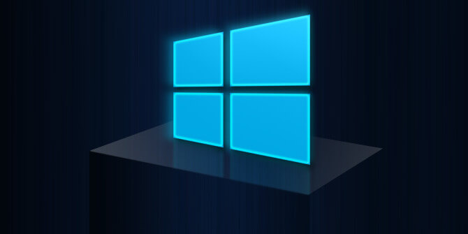

<!--more-->

之前公司内部禁用了破解软件，所以找了一些免费的软件代替，不过意外发现几款比较好用的免费软件。

## Bandizip

官网：[Bandizip](https://cn.bandisoft.com/bandizip/)

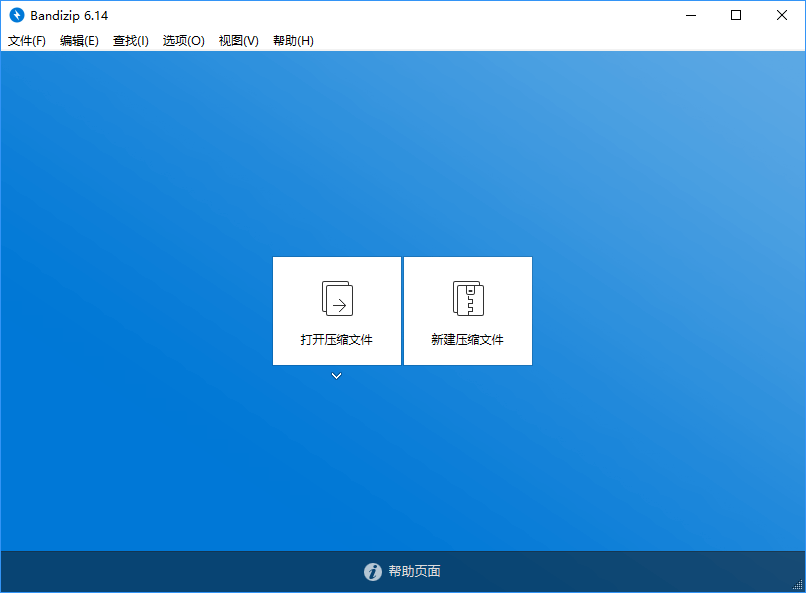

Bandizip是一款来自韩国的免费压缩工具，虽然免费但是意外地好用。

如果有解压Mac下的压缩文件的需求，7-Zip对中文解压会乱码，WinRAR需要安装5.0.1以上版本，不过winRAR这个版本需要付费去广告，而Bandizip的兼容性非常出色，解压无乱码，界面很干净清爽，不像某些国产压缩软件，花花绿绿。

Bandizip 同样支持文件右键菜单快速压缩/解压缩文件和文件夹，甚至还可以在右键菜单上快速预览压缩包里的文件列表。

右键压缩

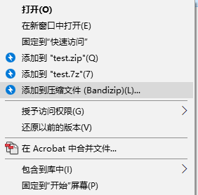

右键解压

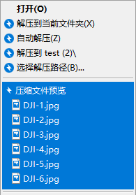

预览

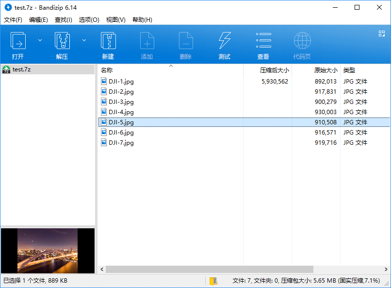

当然，什么分卷压缩和加密压缩也不在话下：

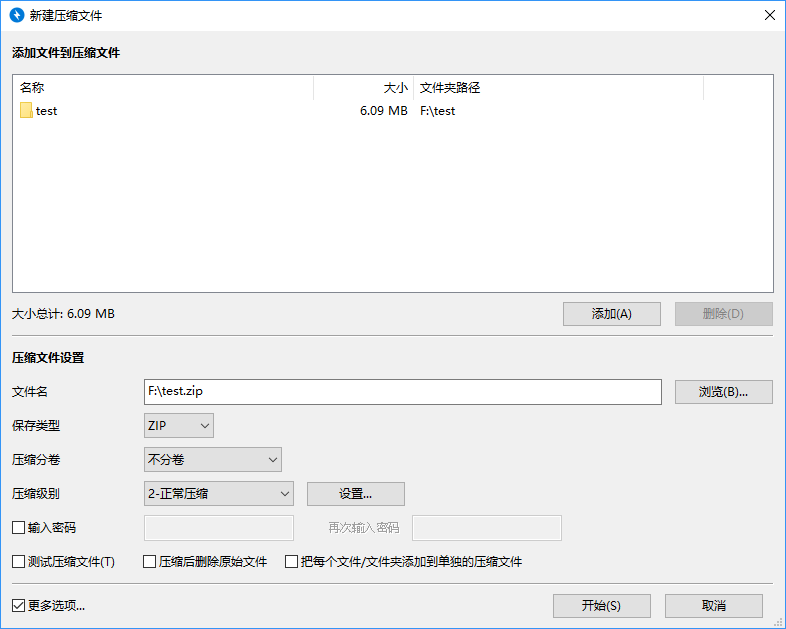

支持的格式包括: 7Z, ACE, AES, ALZ, ARJ, BH, BIN, BZ, BZ2, CAB, Compound(MSI), EGG, GZ, IMG, ISO, ISZ, LHA, LZ, LZH, LZMA, PMA, RAR, RAR5, SFX(EXE), TAR, TBZ, TBZ2, TGZ, TLZ, TXZ, UDF, WIM, XPI, XZ, Z, ZIP, ZIPX, ZPAQ，而且不同格式的文件的icon也会略有不同，并且可以自定义：

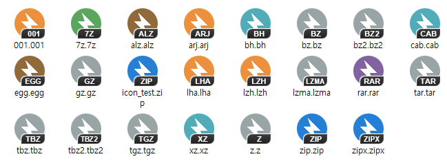

不过在Windows上虽然Bandizip免费，但Mac版却是收费版本。所以推荐win系统的朋友可以尝试一下这款优秀的免费软件。

## Snipaste

官网：[Snipaste](https://zh.snipaste.com/)

这款免费的截图+贴图软件居然是一个个人独立开发项目，作者开发了[三年](https://www.v2ex.com/t/295433?p=8)，相比其他一些截图软件，这款软件在截图后的处理上做得很友好，如果比功能的话可能没有收费的snagit来的多，不过在免费里面已经算很良心了，唯一有点遗憾的是没有滚动截图的功能。

截图带了自动检测界面元素区域功能，这样截图更加方便，点击左键截图后还可以进行编辑，比如加个箭头或者文字说明什么的：

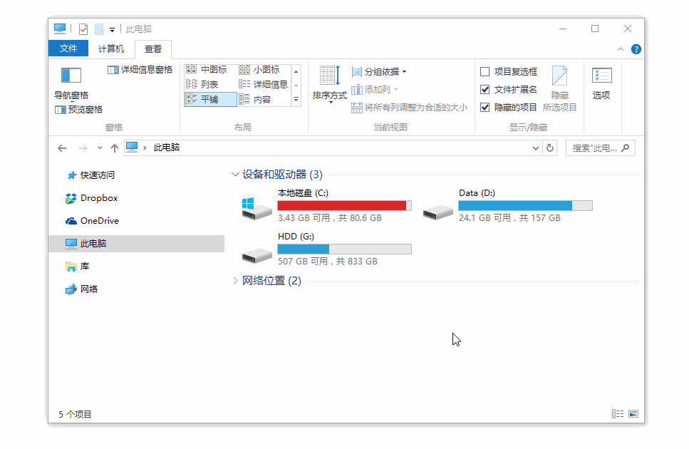

比较贴心的是，截图的时候可以通过放大镜精确控制截图范围，而且还可以显示光标所在像素的颜色，并且能复制当前像素点的 RGB 值：

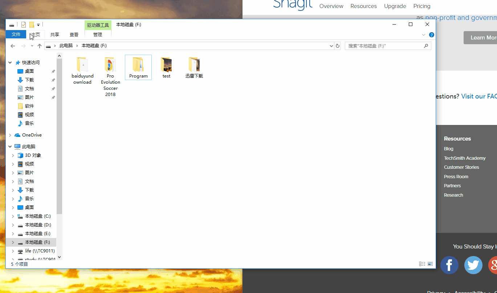

编辑时还有打码功能，方便截图的时候去除一些涉及隐私的信息：

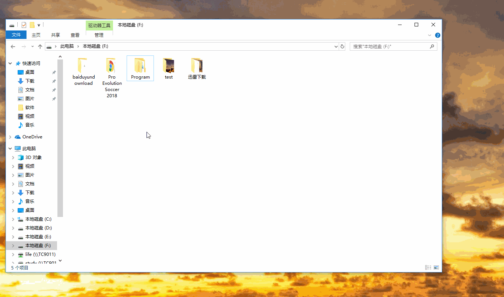

贴图就是使图片成为一个窗口并置顶显示：

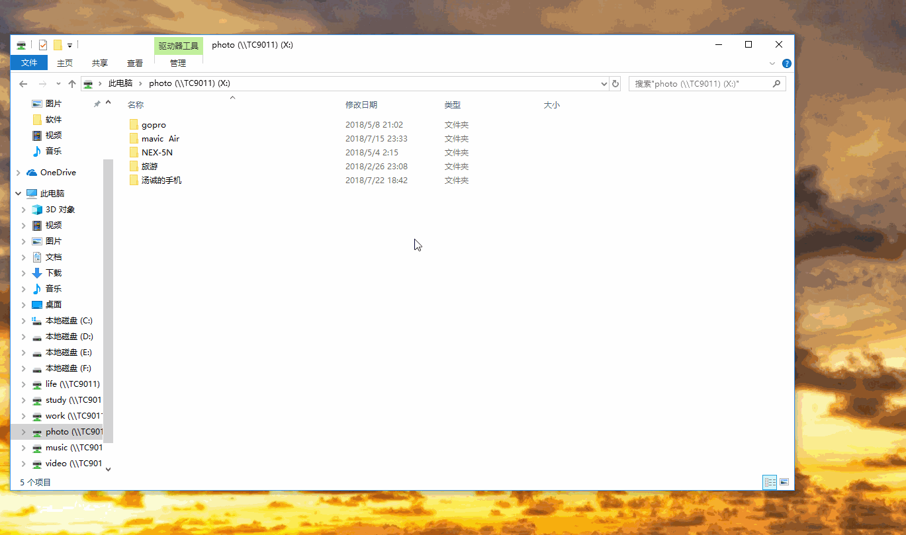

贴图功能我个人常用的场景是需要将两个不同截图进行对比的时候会用，不过作者给出了关于贴图的[更多使用场景](https://www.v2ex.com/t/295433?p=8)。

基本上Snipaste可以覆盖大部分的使用场景，再加上免费，称得上是非常良心了。

## ScreenToGif

官网：[ScreenToGif](https://www.screentogif.com/)

ScreenToGif是一款录制Gif的小工具，免安装版只有818KB，使用也很方便。

启动界面

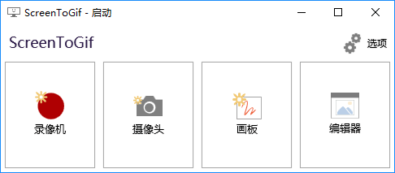

按下F7就可以录制，录制界面也非常简洁，把要录制的对象放在视图框内就行：

录制完后在编辑界面中提供了很多工具给你编辑录制的gif

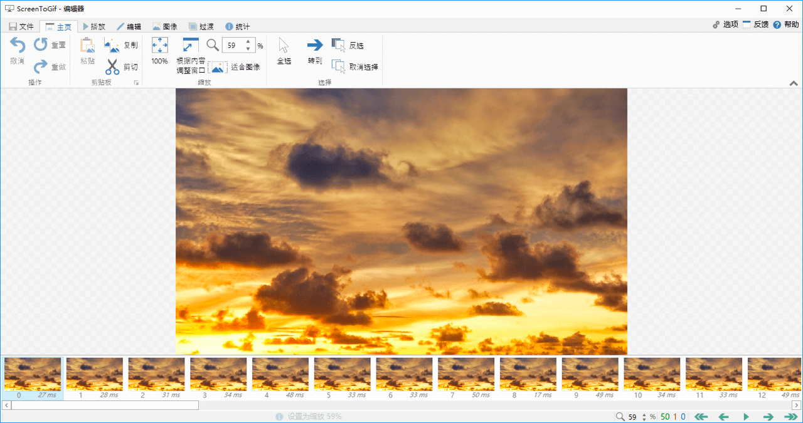

最后保存的时候编码器会分析不变的像素，对录制的gif进行压缩处理。

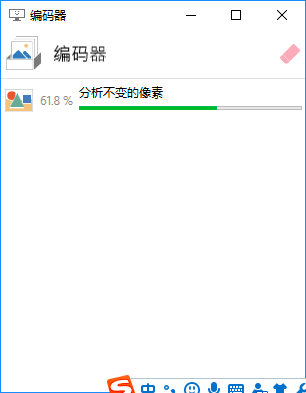

总得来说ScreenToGif在使用上非常简单，效果也不错。

	

这里就罗列这三款软件，Windows上还有其他一些免费的软件，比如MobaXterm（SSH软件）、Typora（Markdown工具），Visual Studio Code（写代码利器），Fiddler（抓包工具）等，就不一一罗（wo）列（tai）出（lan）来（le）。

最后，如果觉得付费软件很好，在承受范围内可以考虑付费，毕竟码农开发一款软件也很辛苦的。
