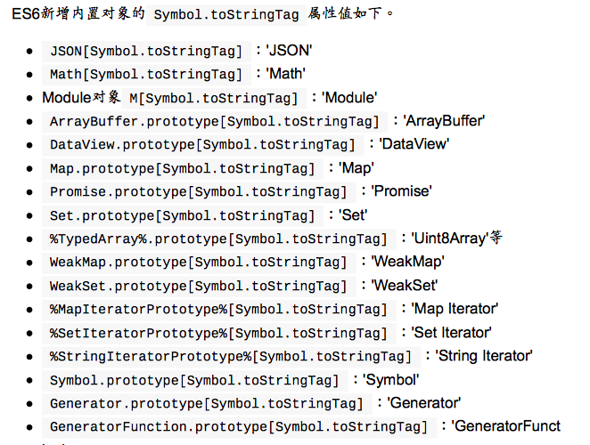
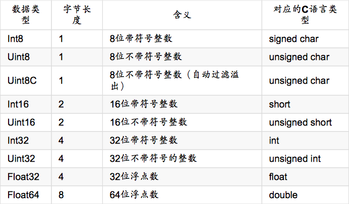

<!--more-->

## ECMAScript6简介

### ES6与ECMAScript2015的关系

ES6既是一个历史名词，也是一个泛指，含义是5.1版以后的JavaScript的下一代标准，涵盖了ES2015、ES2016、ES2017等，而ES2015则是正式名称，特指该年发布的正式版本的语言标准。

### 语法提案的批准流程

一个新的语法从提案到变成正式标准，需要经历五个阶段。每个阶段的变动都需要由TC901139委员会批准。

* Stage0 - Strawman（展示阶段）
* Stage1 - Proposal（征求意见阶段）
* Stage2 - Draft（草案阶段）
* Stage3 - Candidate（候选人阶段）
* Stage4 - Finished（定案阶段）

ECMAScript 当前的所有提案，可以在 TC39 的官方网站[Github.com/tc39/ecma262](https://github.com/tc39/ecma262) 查看。

### 部署进度

各大浏览器的最新版本对ES6的支持情况：[ECMAScript 6 compatibility table](http://kangax.github.io/compat-table/es6/)

查看Node已经实现的ES6特性：

```shell
node --v8-option | grep harmony
```

查看你的浏览器支持ES6的程度：[ES-Checker](http://ruanyf.github.io/es-checker/index.cn.html)

### Babel转码器

Bable是一个广泛使用的ES6转码器，可以将ES6代码转为ES5代码。

#### 配置文件.babelrc

Babel 的配置文件是`.babelrc`，存放在项目的根目录下。使用Babel的第一步，

就是配置这个文件。

```json
{
  // 设定转码规则
  "presets": [
    "latest",
    "react",
    "stage-2"
  ],
  
  // 插件
  "plugins": []
}
```

```sh
# 最新转码规则
$ npm install --save-dev babel-preset-latest

# react 转码规则
$ npm install --save-dev babel-preset-react

# 不同阶段语法提案的转码规则（共有4个阶段），选装一个
$ npm install --save-dev babel-preset-stage-0

$ npm install --save-dev babel-preset-stage-1

$ npm install --save-dev babel-preset-stage-2

$ npm install --save-dev babel-preset-stage-3
```

注意，以下所有 Babel工具和模块的使用，都必须先写好`.babelrc`。

#### 命令行转码babel-cli

babel-cli用于命令行转码。

##### 全局安装

```sh
$ npm install --global babel-cli
```

##### 本地安装

```sh
$ npm install --save-dev babel-cli
```

`package.json`：

```json
{
  "scripts": {
    "build": "babel src -d lib"
  },
  "devDependencies": {
    "babel-cli": "^6.26.0"
  }
}
```

##### 基本用法

```sh
# 转码结果输出到标准输出
$ babel example.js

# 转码结果写入一个文件
# --out-file 或 -o 参数指定输出文件
$ babel example.js --out-file compiled.js
# 或者
$ babel example.js -o compiled.js

# 整个目录转码
# --out-dir 或 -d 参数指定输出目录
$ babel src --out-dir lib
# 或者
$ babel src -d lib

# -s 参数生成source map文件
$ babel src -d lib -s
```

#### babel-node

babel-cli工具自带一个babel-node命令，提供一个支持ES6的REPL环境。它支持Node的REPL环境的所有功能，而且可以直接运行ES6代码。

```sh
$ babel-node
> (x => x * 2)(1)
2

# 或者

$ babel-node es6.js
2
```

babel-node也可以安装在项目中：

```sh
$ npm install --save-dev babel-cli
```

`package.json`：

```json
{
  "scripts": {
  "script-name": "babel-node script.js"
  }
}
```

#### babel-register

 babel-register模块改写`require`命令，为它加上一个钩子。此后，每当使用`require` 加载`.js` 、`.jsx `、`.es `和` .es6 `后缀名的文件，就会先用Babel

进行转码。

```sh
$ npm install --save-dev babel-register
```

接着，在项目中创建 `register.js` 文件并添加如下代码：

```javascript
require("babel-register");
require("./index.js");
```

这样做可以把 Babel注册到 Node 的模块系统中并开始编译其中 `require` 的所有文件。

现在我们可以使用 `register.js` 来代替 `node index.js` 来运行了。

```sh
$ node register.js
```

需要注意的是， babel-register 只会对 require 命令加载的文件转码，而不会对当前文件转码。另外，由于它是实时转码，所以只适合在开发环境使用。

#### babel-core

如果某些代码需要调用 Babel 的 API 进行转码，就要使用babel-core模块。

```sh
$ npm install babel-core --save
```

然后在项目中就可以调用`babel-core`：

```javascript
var babel = require('babel-core');

// 字符串转码
babel.transform('code();', options);
// => { code, map, ast }

// 文件转码（异步）
babel.transformFile('filename.js', options, function(err, result
) {
	result; // => { code, map, ast }
});

// 文件转码（同步）
babel.transformFileSync('filename.js', options);
// => { code, map, ast }

// Babel AST转码
babel.transformFromAst(ast, code, options);
// => { code, map, ast }
```

配置对象`options`，可以参看官方文档[http://babeljs.io/docs/usage/options/](http://babeljs.io/docs/usage/options/)。

例子：

```javascript
var es6Code = 'let x = n => n + 1';

var es5Code = require('babel-core')
    .transform(es6Code, {
        presets: ['latest']
    })
    .code;
// 转换成：
// '"use strict";\n\nvar x = function x(n) {\n return n + 1;\n};'
```

#### babel-polyfill

Babel 默认只转换新的 JavaScript 句法（syntax），而不转换新的 API，比如

`Iterator` 、`Generator`、`Set`、`Maps`、`Proxy`、`Reflect`、`Symbol`、`promise`等全局对象，以及一些定义在全局对象上的方法（比如`Object.assign`）都不会转码。

Babel 默认不转码的 API 非常多，详细清单可以查看模块的[definitions.js](https://github.com/babel/babel/blob/master/packages/babel-plugin-transform-runtime/src/definitions.js)文件。

必须使用babel-polyfill，为当前环境提供一个垫片：

```sh
$ npm install --save babel-polyfill
```

然后，在脚本头部，加入如下一行代码：

```javascript
import 'babel-polyfill';
// 或者
require('babel-polyfill');
```

#### 与其他工具的配合

##### ESLint

```sh
$ npm install --save-dev eslint babel-eslint
```

然后，在项目根目录下，新建一个配置文件 `.eslintrc`，在其中加入`parser`字段：

```json
{
  "parser": "babel-eslint",
  "rules": {
    ...
  }
}
```

##### Mocha

如果需要执⾏使⽤ES6 语法的测试脚本，可以修改package.json的scripts.test：

```json
"scripts": {
	"test": "mocha --ui qunit --compilers js:babel-core/register"
}
```

 `--compilers`参数指定脚本的转码器，规定后缀名为 `js`的文件，都需要使用`babel-core/register`。

## let和const命令

### let命令

#### 基本用法

`let`用来声明变量，但所声明的变量只在`let`命令所在的代码块中有效：

```javascript
{
  let a = 10;
  var b = 1;
}

a	// ReferenceError: a is not defined.
b	// 1
```

下面代码如果使用`var`，最后输出是`10`：

```javascript
var a = [];
for (var i = 0; i < 10; i++) {
  a[i] = function () {
    console.log(i);
  };
}
a[6]();     // 10
```

上面代码中，变量`i`是`var`命令声明的，在全局范围内都有效，所以全局只有一 个变量`i`。每一次循环，变量`i`的值都会发生改变，而循环内被赋给数组`a`的函数内部的`console.log(i)`，里面的`i`指向的就是全局的`i`。也就是说，所 有数组`a`的成员里面的`i`，指向的都是同一个`i`，导致运行时输出的是最后一 轮的`i`的值，也就是`10`。

如果使用`let`，声明的变量仅在块级作用域内有效，最后输出的是`6`。

```javascript
var a = [];
for (let i = 0; i < 10; i++) {
  a[i] = function () {
    console.log(i);
  };
}
a[6]();     // 6
```

上面代码中，变量`i`是`let`声明的，当前的`i`只在本轮循环有效，所以每一次循环的`i`其实都是一个新的变量，所以最后输出的是`6`。你可能会问，如果每一 轮循环的变量`i`都是重新声明的，那它怎么知道上一轮循环的值，从而计算出本轮循环的值？这是因为 JavaScript 引擎内部会记住上一轮循环的值，初始化本轮的 变量`i`时，就在上一轮循环的基础上进行计算。

在`for`循环中，设置循环变量的那部分是一个父作用域，而循环体内部是一个单独的子作用域。

```javascript
for (let i = 0; i < 3; i++) {
    let i = 'abc';
    console.log(i);
}

// abc
// abc
// abc
// 输出3次abc，表明函数内部的变量i与循环变量i不在同一个作用域
```

#### 不存在变量提升

`var`会发生变量提升的现象，即变量在声明前可以使用，值为`undefined`。

`let`所声明的变量一定要在声明后使用，否则报错。

```javascript
// var 的情况
console.log(foo);       // 输出undefined
var foo = 2;

// let 的情况
console.log(bar);       // 报错
let bar = 2;
```

#### 暂时性死区

只要块级作用域内存在`let`命令，它所声明的变量就绑定这个区域，不再受外部的影响。

```javascript
var tmp = 123;

if (true) {
  tmp = 'abc';        // ReferenceError
  let tmp;
}
```

上面代码中，存在全局变量`tmp`，但是块级作用域内`let`又声明了一个局部变量`tmp`，导致后者绑定这个块级作用域，所以在`let`声明变量前，对`tmp`赋值会报错。

ES6明确规定，如果区块中存在`let`和`const`命令，这个区块对这些命令声明的 变量，从一开始就形成了封闭作用域。凡是在声明之前就使用这些变量，就会报错。

在代码块内，使用 let 命令声明变量之前，该变量都是不可用的。这在语 法上，称为“暂时性死区”（temporal dead zone，简称 TDZ）。

```javascript
if (true) {
  // TDZ开始
  tmp = 'abc';    // ReferenceError
  console.log(tmp); // ReferenceError

  let tmp;    // TDZ结束
  console.log(tmp);   // undefined

  tmp = 123;
  console.log(tmp);   // 123
}
```

TDZ意味着`typeof`不再是百分之百安全的操作：

```javascript
typeof x; 	// ReferenceError
let x;
```

如果一个变量根本没有被声明，使用`typeof`反而不会报错：

```javascript
typeof undecalared_variable		// 'undefined'
```

```javascript
function bar(x = y, y = 2) {	// y未声明，属于死区
    return [x, y];
}

bar();	// Uncaught ReferenceError: y is not defined

/*******修改后********/

function bar(x = 2, y = x) {
    return [x, y];
}

bar();	// [2, 2]
```

```javascript
var x = x;	    // 不报错

let x = x;		// Uncaught ReferenceError: x is not defined
```

ES6 规定暂时性死区和`let`、`const`语句不出现变量提升，主要是为了减少运行时错误，防止在变量声明前就使用这个变量，从而导致意料之外的行为。这样的错误在 ES5 是很常见的，现在有了这种规定，避免此类错误就很容易了。

暂时性死区的本质就是，只要一进入当前作用域，所要使用的变量就已经存在了，但是不可获取，只有等到声明变量的那一行代码出现，才可以获取和使用该变量。

#### 不允许重复声明

`let`不允许在相同作用域内，重复声明同一个变量：

```javascript
// 报错
function test () {
  let a = 10;
  var a = 1;
}

test();

// 报错
function test() {
  let a = 10;
  let a = 1;
}

test();
```

```javascript
function func(arg) {
  let arg;    // 报错
}

function func(arg) {
  {
    let arg;    // 不报错
  }
}
```

### 块级作用域

#### 为什么需要块级作用域

ES5 只有全局作用域和函数作用域，没有块级作用域，这带来很多不合理的场景。

* 内层变量覆盖外层变量

```javascript
var tmp = new Date();

function f() {
  console.log(tmp);
  if (false) {
    var tmp = 'hello';		// 变量提升，导致内层tmp覆盖外层tmp
  }
}

f();    // undefined
```

* 用来计数的循环变量泄露为全局变量

```javascript
var s = 'hello';

for (var i = 0; i < s.length; i++) {
  console.log(s[i]);	// 循环结束后，i泄露成全局变量
}

console.log(i);     // 5
```

#### ES6的块级作用域

`let`为JavaScript新增了块级作用域：

```javascript
function f1() {
  let n = 5;
  if (true) {
    let n = 10;
  }
  console.log(n);     // 5
}
```

ES6允许块级作用域的任意嵌套：

```javascript
{{{{
  {let insane = 'hello world'}
  console.log(insane);		// 报错
}}}};

{{{{
  let insane = 'hello world';
  {let insane = 'hello world'}	// 内层作用域可以定义外层作用域同名变量
}}}};
```

块级作用域的出现，实际上使得获得广泛应用的立即执行函数表达式（IIFE）不再 必要了：

```javascript
// IIFE写法
(function () {
  var tmp = ....;
  ....
}());

// 块级作用域写法
{
  let tmp = ...;
  ...
}
```

#### 块级作用域与函数声明

ES6 引入了块级作用域，明确允许在块级作用域之中声明函数。ES6规定，块级作用域之中，函数声明语句的行为类似于`let`，在块级作用域之外不可引用：

```javascript
function f() {
  console.log('i am outside');
}

(function () {
  if (false) {
    // 重复声明一次函数f，在作用域外不可用
    function f() {
      console.log('i am inside');
    }
  }
  f();
}());


// es5下if中的f函数会被提升到函数头部
(function () {
  function f() {
      console.log('i am inside');
    }
  if (false) {
  }
  f();
}());
```

但是以上代码在ES6浏览器中运行还是会报错，ES6规定，浏览器为了兼容可以不遵守上面规定，有自己的实现方式：

* 允许在块级作用域内声明函数
* 函数声明类似于`var`，即会提升到全局作用域或作用域的头部
* 函数声明还会提升到所在的块级作用域的头部

以上三条规则只对ES6浏览器实现有效，在其他环境的实现不用遵守。

根据以上三条规则，在浏览器的ES6环境中，块级作用域内声明的函数，行为类似于`var`声明的变量：

```javascript
// 浏览器的ES6环境
function f() {
    console.log('i am outside');
}

(function () {
    if (false) {
        // 重复声明一次函数f
        function f() {
            console.log('i am inside');
        }
    }
    f();
}());
// Uncaught TypeError: f is not a function

/********实际运行的代码**********/

// 浏览器的ES6环境
function f() {
    console.log('i am outside');
}

(function () {
    var f = undefined;
    if (false) {
        // 重复声明一次函数f
        function f() {
            console.log('i am inside');
        }
    }
    f();
}());
// Uncaught TypeError: f is not a function
```

应该避免在块级作用域内声明函数，如果确实需要，应该写成函数表达式，而不是函数声明语句。

ES6的块级作用域允许声明函数的规则，只在使用大括号的情况下成立，如果没有使用大括号就会报错。

#### do表达式

本质上，块级作用域是一个语句，将多个操作封装在一起，没有返回值。

```javascript
{
  let t = f();
  t = t * t + 1;	// 在块级作用域外，没办法得到t
}
```

现在有一个提案，使得块级作用域可以变成表达式，也就是说可以返回值，办法就是在块级作用域之前加上`do`，使它变为`do`表达式：

```javascript
let x = do {			// x会得到整个块级作用域的返回值
    let t = f();
    t * t + 1;
};
```

### const命令

#### 基本用法

`const`声明一个只读的常量。一旦声明，常量的值就不能改变。`const`一旦声明变量，就必须立即初始化，不能留到以后赋值。

`const`只在声明所在的块级作用域内有效。声明的常量也是不提升，同样存在暂时性死区，只能在声明的位置后面使用。

`const`与`let`一样不可重复声明。

#### 本质

`const`实际上保证的，并不是变量的值不得改动，而是变量指向的那个内存地址 不得改动。对于简单类型的数据（数值、字符串、布尔值），值就保存在变量指向 的那个内存地址，因此等同于常量。但对于复合类型的数据（主要是对象和数组），**变量指向的内存地址，保存的只是一个指针**，`const`只能保证这个指针是 固定的，至于它指向的数据结构是不是可变的，就完全不能控制了。因此，将一个 对象声明为常量必须非常小心。

```javascript
const foo = {};

// 为foo添加一个属性，可以成功
foo.prop = 123;
foo.prop    // 123

// 将foo指向另一个对象，就会报错
foo = {}; // TypeError: "foo" is read-only
```

如果真想将对象冻结，应该使用`object.freeze`方法：

```javascript
const foo = Object.freeze({});

// 常规模式时，下面一行不起作用
// 严格模式时，该行会报错
foo.prop = 123;
```

除了将对象本身冻结，对象的属性也应该冻结。下面是一个将对象彻底冻结的函数。

```javascript
var constantize = (obj => {
  Object.freeze(obj);
  Object.keys(obj).forEach((key, i) => {
    if (typeof obj[key] === 'object') {
      constantize(obj[key]);
    }
  });
});
```

### ES6声明变量的六种方法

ES6的六种声明变量的方法：`var`命令、`function`命令、`let`命令、`const`命令、`import`命令和`class`命令。

#### 顶层对象的属性

顶层对象，在浏览器环境中指的是`window`对象，在node指的是`global`对象。

顶层对象的属性与全局变量挂钩，被认为是JavaScript语言最大的设计败笔之一。 这样的设计带来了几个很大的问题：

* 首先是没法在编译时就报出变量未声明的错误，只有运行时才能知道（因为全局变量可能是顶层对象的属性创造的，而属性的创造是动态的）；
* 其次，程序员很容易不知不觉地就创建了全局变量（比如打字出错）；
* 最后，顶层对象的属性是到处可以读写的，这非常不利于模块化编程。

另一 方面， window 对象有实体含义，指的是浏览器的窗口对象，顶层对象是一个有实体含义的对象，也是不合适的。

ES6为了改变这一点，一方面规定，为了保持兼容性，`var`命令和`function`命令声明的全局变量，依旧是顶层对象的属性；另一方面规定，`let`命令、`const`命令、`class`命令声明的全局变量，不属于顶层对象的属性。也就是说，从ES6开始，全局变量将逐步与顶层对象的属性脱钩。

```javascript
var a = 1;
// 如果在node的REPL环境，可以写成global.a
// 或者采用通用方法，写成this.a
window.a    // 1

let b = 1;
window.b    // undefined
```

#### global对象

ES5 的顶层对象在各种实现里面是不统一的：

* 浏览器里面，顶层对象是`window`，但 Node 和 Web Worker 没有`window`。
* 浏览器和 Web Worker 里面，`self`也指向顶层对象，但是 Node 没有`self`。
* Node 里面，顶层对象是`global`，但其他环境都不支持。

同一段代码为了能够在各种环境，都能取到顶层对象，现在一般是使用`this`变量，但是有局限性：

* 全局环境中，`this`会返回顶层对象。但是Node 模块和 ES6 模块中，`this`返回的是当前模块。
* 函数里面的`this`，如果函数不是作为对象的方法运行，而是单纯作为函数运行，`this`会指向顶层对象。但严格模式下，`this`会返回`undefined`。
* 不管是严格模式，还是普通模式，`new Function('return this')()`，总 是会返回全局对象。但是，如果浏览器用了CSP（Content Security Policy，内容安全政策），那么`eval`、`new Function`这些方法都可能无法使用。

综上所述，很难找到一种方法，可以在所有情况下，都取到顶层对象。下面是两种 勉强可以使用的方法：

```javascript
//  方法一
(typeof window !== 'undefined' ? window : (typeof process === 'object' && typeof require === 'function' && typeof global === 'object') ? global : this);


// 方法二
var getGlobal = function () {
  if (typeof self !== 'undefined') { return self; }
  if (typeof window !== 'undefined') { return window; }
  if (typeof global !== 'undefined') { return global; }
  throw new Error('unable to locate global object');
};
```

现在有一个提案，在语言标准的层面，引入`global`作为顶层对象。也就是说，在 所有环境下，`global`都是存在的，都可以从它拿到顶层对象。

垫片库`system.global`模拟了这个提案：

```javascript
/* 保证各种环境中，global对象都是存在的 */
// CommonJS的写法
require('system.global/shim')();

// ES6模块的写法
import shim from 'system.global/shim'; shim();

/* 将顶层对象放入变量global中 */
// CommonJS的写法
var global = require('system.global')();

// ES6模块的写法
import getGlobal from 'system.global';
const global = getGlobal();
```

## 变量的解构赋值

### 数组的解构赋值

#### 基本用法

ES6 允许按照一定模式，从数组和对象中提取值，对变量进行赋值，这被称为解构。

以前，为变量赋值，只能直接指定值：

```javascript
let a = 1;
let b = 2;
let c = 3;
```

ES6允许写成下面这样：

```javascript
let [a, b, c] = [1, 2, 3];
```

本质上，这种写法属于“模式匹配”，只要等号两边的模式相同，左边的变量就会被 赋予对应的值。

```javascript
let [foo, [[bar], baz]] = [1, [[2]], 3];
foo // 1
bar // 2
baz // 3

let [ , , third] = ['foo', 'bar', 'baz'];
third   // 'baz'

let [x,  , y] = [1, 2, 3];
x   // 1
y   //3

let [head, ...tail] = [1, 2, 3, 4];
head    // 1
tail    // [2, 3, 4]

let [x, y,  ...z] = ['a'];
x   // 'a'
y   // undefined
z   // []
```

如果解构不成功，变量的值就等于`undefined`：

```javascript
let [foo] = [];
let [bar, foo] = [1];
```

以上两种情况都属于解构不成功，`foo`的值都会等于`undefined`。 

另一种情况是不完全解构，即等号左边的模式，只匹配一部分的等号右边的数组。 这种情况下，解构依然可以成功。

```javascript
// 不完全解构，但是可以成功

let [x, y] = [1, 2, 3];
x   // 1
y   // 2

let [a, [b], d] = [1, [2, 3], 4];
a   // 1
b   // 2
d   // 4
```

如果等号的右边不是数组（或者严格地说，不是可遍历的结构），那么将会报错。

对于Set结构，也可以使用数组的解构赋值：

```javascript
let [x, y, z] = new Set(['a', 'b', 'c']);
x   // 'a'
```

只要某种数据结构具有 Iterator 接口，都可以采用数组形式的解构赋值

```javascript
function * fibs() {// fibs是一个Generator函数，原生具有Iterator接口
    let a = 0;
    let b = 1;
    while (true) {
        yield a;
        [a, b] = [b, a + b];
    }
}

let [first, second, third, fourth, fifth, sixth] = fibs();
sixth   // 5
```

#### 默认值

结构赋值允许指定默认值

```javascript
let [foo = true] = [];
foo // true

let [x, y = 'b'] = ['a'];   // x='a', y='b'
let [x, y = 'b'] = ['a', undefined];    // x='a', y='b'
```

ES6 内部使用严格相等运算符（`===`），判断一个位置是否有值。所以， 如果一个数组成员不严格等于`undefined`，默认值是不会生效的。

```javascript
let [x = 1] = [undefined];
x   // 1

let [x = 1] = [null];
x   // null
```

如果默认值是一个表达式，那么这个表达式是惰性求值的，即只有在用到的时候， 才会求值：

```javascript
function f() {
    console.log('aaa');
}

let [x = f()] = [1];

/*******等价于*******/

let x;
if ([1][0] === undefined) {
    x = f();
} else {
    x = [1][0];
}
```

默认值可以引用解构赋值的其他变量，但该变量必须已经声明。

### 对象的解构赋值

```javascript
let { foo, bar} = { foo: 'aaa', bar: 'bbb'};
foo //  'aaa'
bar // 'bbb'
```

对象的解构与数组有一个重要的不同。数组的元素是按次序排列的，变量的取值由它的位置决定；而对象的属性没有次序，变量必须与属性同名，才能取到正确的值：

```javascript
let { bar, foo} = { foo: 'aaa', bar: 'bbb'};
foo //  'aaa'
bar // 'bbb'

let { baz } = { foo: 'aaa', bar: 'bbb' };
baz // undefined
```

如果变量名与属性名不一致，必须写成下面这样：

```javascript
let { foo: baz } = { foo: 'aaa', bar: 'bbb'};
baz // 'aaa'

let obj = { first: 'hello', last: 'world' };
let { first: f, last: l } = obj;
f   // 'hello'
l   // 'world'
```

对象的解构赋值是下面形式的简写，也就是说，对象的解构赋值的内部机制，是先找到同名属性，然后再赋给对应的变 量。**真正被赋值的是后者，而不是前者**。

```javascript
let { foo: foo, bar: bar } = { foo: 'aaa', bar: 'bbb' };

let { foo: baz } = { foo: 'aaa', bar: 'bbb' };
baz // 'aaa'
foo // error: foo is not defined
```

解构也可以用于嵌套解构的对象：

```javascript
let obj = {
    p: [
        'Hello',
        { y: 'world' }
    ]
};

let { p: [x, { y }] } = obj;
x   // 'Hello'
y   // 'world'
```

**这时`p`是模式，不是变量，因此不会被赋值**。如果`p`也要作为变量赋值，可以写成下面这样：

```javascript
let obj = {
    p: [
        'Hello',
        { y: 'world' }
    ]
};

let { p, p: [x, { y }] } = obj;
x   // 'Hello'
y   // 'world'
p   // ["Hello", {y: "World"}]

/*****************另一个例子*****************/

let obj = {};
let arr = [];

({ foo: obj.prop, bar: arr[0] } = { foo: 123, bar: true });

obj // {prop:123}
arr // [true]
```

对象解构也可以指定默认值：

```javascript
var {x = 3} = {};
x   // 3

var {x, y = 5} = {x: 1};
x   // 1
y   // 5

var {x: y = 3} = {};
y   // 3

var {x: y = 3} = {x: 5};
y   // 5

var {message: msg = 'something went wrong'} = {};
msg  // 'something went wrong'
```

默认值生效的条件是，对象的属性值严格等于`undefined`。

如果解构失败，变量的值等于`undefined`。

如果解构模式是嵌套的对象，而且子对象所在的父属性不存在，那么将会报错。

如果要将一个已经声明的变量用于解构赋值，必须非常小心：

```javascript
// 错误的写法
let x;
{x} = {x: 1};
// syntaxError: syntax error


// 正确写法
let x;
({x} = {x: 1});
```

 JavaScript 引擎会将`{x}`理解成一个代码块，从而发生语法错误。只有不将大括号写在行首，避免 JavaScript 将其解释为代码块，才 能解决这个问题。

解构赋值允许等号左边的模式之中，不放置任何变量名。因此，可以写出非常古怪的赋值表达式：

```javascript
({} = [true, false]);
({} = 'abc');
({} = []);
```

对象的解构赋值，可以很方便地将现有对象的方法，赋值到某个变量：

```javascript
let { log, sin, cos } = Math;
//  将Math对象的对数、正弦、余弦三个方法，赋值到对应的变量上，使用起来就会方便很多。
```

由于数组本质是特殊的对象，因此可以对数组进行对象属性的解构：

```javascript
let arr = [1, 2, 3];
let {0 : first, [arr.length - 1] : last} = arr;
first   // 1
last    // 3
```

### 字符串的结构赋值

字符串也可以解构赋值。这是因为此时，字符串被转换成了一个类似数组的对象：

```javascript
const [a, b ,c, d, e] = 'hello';
a   // 'h'
b   // 'e'
c   // 'l'
d   // 'l'
e   // 'o'
```

类似数组的对象都有一个`length`属性，因此还可以对这个属性解构赋值：

```javascript
let {length: len} = 'hello';
len // 5
```

### 数值和布尔值的解构赋值

解构赋值时，如果等号右边是数值和布尔值，则会先转为对象：

```javascript
let {toString: s} = 123;
s === Number.prototype.toString     // true

let {toString: s} = true;
s === Boolean.prototype.toString;   // true
```

解构赋值的规则是，只要等号右边的值不是对象或数组，就先将其转为对象。由 于`undefined`和`null`无法转为对象，所以对它们进行解构赋值，都会报错。

```javascript
let {prop: x} = undefined;  // TypeError
let {prop: y} = null;       // TypeError
```

### 函数参数的解构赋值

```javascript
function add([x, y]) {
    return x + y;
}

add([1, 2]);    // 3

[[1, 2], [3, 4]].map(([a, b]) => a + b);
// [3, 7]
```

函数参数的解构也可以使用默认值：

```javascript
function move({x = 0, y = 0} = {}) {
    return [x, y];
}

move({x: 3, y: 8});     // [3, 8]
move({x: 3});           // [3, 0]
move({});               // [0, 0]
move();                 // [0, 0]
```

`undefined`就会触发函数参数的默认值：

```javascript
[1, undefined, 3].map((x = 'yes') => x);
// [1, 'yes', 3]
```

### 圆括号问题

解构赋值虽然很方便，但是解析起来并不容易。对于编译器来说，一个式子到底是模式，还是表达式，没有办法从一开始就知道，必须解析到（或解析不到）等号才能知道。

由此带来的问题是，如果模式中出现圆括号怎么处理。ES6的规则是，只要有可能 导致解构的歧义，就不得使用圆括号。

但是，这条规则实际上不那么容易辨别，处理起来相当麻烦。因此，建议只要有可能，就不要在模式中放置圆括号。

#### 不能使用圆括号的情况

* 变量声明语句

```javascript
// 全部报错,它们都是变量声明语句，模式不能使用圆括号
let [(a)] = [1];

let {x: (c)} = {};
let ({x: c}) = {};
let {(x: c)} = {};
let {(x): c} = {};

let { o: ({p: p}) } = { o: { p: 2 } };
```

* 函数参数

```javascript
// 函数参数也属于变量声明，因此不能带有圆括号
// 报错
function f([(z)]) {
    return z;
}

// 报错
function f([z, (x)]) {
    return x;
}
```

* 赋值语句的模式

```javascript
// 全部报错,将整个模式放在圆括号之中，导致报错
({ p: a }) = { p: 42 };
([a]) = [5];

// 报错,将一部分模式放在圆括号之中，导致报错
[({ p: a }), { x: c }] = [{}, {}];
```

#### 可以使用圆括号的情况

可以使用圆括号的情况只有一种：赋值语句的非模式部分，可以使用圆括号：

```javascript
[(b)] = [3];    // 正确
({ p: (d) } = {});  // 正确
[(parseInt.prop)] = [3];    // 正确
```

上面三行语句都可以正确执行，因为首先它们都是赋值语句，而不是声明语句；其 次它们的圆括号都不属于模式的一部分。第一行语句中，模式是取数组的第一个成 员，跟圆括号无关；第二行语句中，模式是`p`，而不是`d`；第三行语句与第一行 语句的性质一致。

### 用途

* 交换变量的值

```javascript
let x = 1;
let y = 2;
[x, y] = [y, x];
```

* 从函数返回多个值

函数只能返回一个值，如果要返回多个值，只能将它们放在数组或对象里返回。有 了解构赋值，取出这些值就非常方便：

```javascript
// 返回一个数组
function example() {
    return [1, 2, 3];
}
let [a, b, c] = example();

// 返回一个对象
function example() {
    return {
        foo: 1,
        bar: 2
    };
}
let {foo, bar} = example();
```

* 函数参数的定义

```javascript
// 参数是一组无次序的值
function f([x, y, z]) {
    // do something
}

f({z: 3, y: 2, x: 1});

// 参数是一组有次序的值
function f([x, y, z]) {
    // do something
}

f([1, 2, 3]);
```

* 提取JSON数据

```javascript
let jsonData = {
    id: 42,
    status: 'ok',
    data: [867, 5309]
};

let { id, status, data: number } = jsonData;

console.log(id, status, number);
// 42, 'ok', [867, 5309]
```

* 参数函数的默认值

```javascript
jQuery.ajax = function (url, {
    async = true,
    beforeSend = function () {},
    cache = true,
    complete = function () {},
    crossDomain = false,
    global = true,
    // ....more config
}) {
    // ... do stuff
};
```

* 遍历Map结构

任何部署了Iterator接口的对象，都可以用`for…of`循环遍历。Map结构原生支 持Iterator接口，配合变量的解构赋值，获取键名和键值就非常方便。

```javascript
var map = new Map();
map.set('first', 'hello');
map.set('second', 'world');

for (let [key, value] of map) {
    console.log(key + 'is' + value);
}
// first is hello
// second is world

// 获取键名
for (let [key] of map) {
    console.log(key);
}

// 获取键值
for (let [value] of map) {
    console.log(value);
}
```

* 输入模块的指定方法

加载模块时，往往需要指定输入哪些方法。结构赋值使得输入语句非常清晰：

```javascript
const { SourceMapConsumer, SourceNode } = require('source-map');
```

## 字符串的扩展

### 字符的Unicode表示法

JavaScript允许采用`\uxxxx`形式表示一个字符，其中`xxxx`表示字符的Unicode码点。

但是，这种表示法只限于码点在`\u0000`~`\uFFF`之间的字符。超出这个范围的字符，必须用两个双字节的形式表示。 

ES6 对这一点做出了改进，只要将码点放入大括号，就能正确解读该字符：

```javascript
'\u{20BB7}'
// ""

'\u{41}\u{42}\u{43}'
// "ABC"

'\u{1F680}' === '\uD83D\uDE80'
// true
```

### 字符串的遍历器接口

ES6为字符串添加了遍历器接口，使得字符串可以被`for...of`循环遍历：

```javascript
for (let codePoint of 'foo') {
    console.log(codePoint);
}

// 'f'
// 'o'
// 'o'
```

除了遍历字符串，这个遍历器最大的优点是可以识别大于`0xFFFF`的码点，传统的`for`循环无法识别这样的码点。

### includes(), startsWith(), endsWith()

* `includes()`：返回布尔值，表示是否找到了参数字符串
* `startsWith()`：返回布尔值，表示参数字符串是否在原字符串的头部
* `endsWith()`：返回布尔值，表示参数字符串串是否在原字符串串的尾部

```javascript
var s = 'hello world!';

s.startsWith('hello');  // true
s.endsWith('!');        // true
s.includes('o');        // true
```

这三个方法都支持第二个参数，表示开始搜索的位置：

```javascript
var s = 'hello world!';

s.startsWith('world', 6);  // true
s.endsWith('hello', 5);        // true
s.includes('hello', 6);        // false
```

`endWith`的行为与其他两个方法有所不同。它针对前n个字符，而且其他两个方法针对从第n个位置直到字符串结束。

### repeat()

`repeat()`方法返回一个新字符串，表示将原字符串重复n次：

```javascript
'x'.repeat(3);      // 'xxx'
'hello'.repeat(2);  // 'hellohello'
'na'.repeat(0);     // ''
```

参数如果是小数，会被取整：

```javascript
'na'.repeat(2.9);   // 'nana'
```

如果`repeat`的参数是负数或者`Infinity`，会报错。但是参数是0到-1之间的小数，由于会先进行取整运算，所以等同于0。

参数`NaN`等同于0。

如果`repeat`的参数是字符串，则会先转换成数字：

```javascript
'na'.repeat('na');  // ''
'na'.repeat('3');   // 'nanana'
```

### padStart(), padEnd()

ES2017 引入了字符串补全长度的功能。如果某个字符串不够指定长度，会在头部 或尾部补全。`padStart()`用于头部补全，`padEnd()`用于尾部补全。

```javascript
'x'.padStart(5, 'ab');  // 'ababx'
'x'.padStart(4, 'ab');  // 'abax'

'x'.padEnd(5, 'ab');    // 'xabab'
'x'.padEnd(4, 'ab');    // 'xaba'
```

上面代码中，`padStart`和`padEnd`一共接受两个参数，第一个参数用来指定字 符串的最小长度，第二个参数是用来补全的字符串。

如果原字符串的长度，等于或大于指定的最小长度，则返回原字符串。

如果用来补全的字符串与原字符串，两者的长度之和超过了指定的最小长度，则会 截去超出位数的补全字符串。

如果省略第二个参数，默认使用空格补全长度。

`padStart`的常见用途是为数值补全指定位数和提示字符串格式：

```javascript
'1'.padStart(10, '0');  // 0000000001

'12'.padStart(10, 'YYYY-MM-DD');    // 'YYYY-MM-12'
'09-12'.padStart(10, 'YYYY-MM-DD'); // 'YYYY-MM-09-12'
```

### 模板字符串

模板字符串（template string）是增强版的字符串，用反引号（`）标识。它可以当 作普通字符串使用，也可以用来定义多行字符串，或者在字符串中嵌入变量。

```javascript
console.log(`string text line 1
string text line 2`);

// 字符串中嵌入变量
var name = 'Bob', time = 'today';
`Hello ${name}, how are you ${time}?`
```

如果在模板字符串中需要使用反引 号，则前面要用反斜杠转义。

如果使用模板字符串表示多行字符串，所有的空格和缩进都会被保留在输出之中。

模板字符串中嵌入变量，需要将变量名写在`${}`中，大括号内部可以放入任意的JavaScript表达式，可以进行运算，以及引用对象属性，甚至还能调用函数：

```javascript
function fn() {
    return 'hello world';
}
`foo ${fn()} bar`
// foo hello world bar
```

如果大括号中的值不是字符串，将按照一般的规则转为字符串。

如果模板字符串中的变量没有声明，将报错。

模板字符串甚至还能嵌套：

```javascript
const tmpl = addrs => `
    <table>
    ${addrs.map(addr => `
        <tr><td>${addr.first}</td></tr>
        <tr><td>${addr.last}</td></tr>
    `).join('')}
    </table>
`;

const data = [
    {first: '<jane>', last: 'Bond'},
    {first: 'Lars', last: '<Croft>'},
];

console.log(tmpl(data));

// <table>
//
//      <tr><td><jane></td></tr>
//      <tr><td>Bond</td></tr>
//  
//      <tr><td>Lars</td></tr>
//      <tr><td><Croft></td></tr>
//  
//  </table>
```

如果需要引用模板字符串本身，在需要时执行，可以像下面这样写:

```javascript
// 写法一
let str = 'return' + '`hello ${name}!`';
let func = new Function('name', str);
func('Jack');    // 'hello Jack!

// 写法二
let str = '(name) => `hello ${name}!`';
let func = eval.call(null, str);
func('Jack');    // 'hello Jack!
```

#### 实例：模板编译

```javascript
var template = `
    <ul>
        <% for(var i=0; i < data.supplies.length; i++) { %>
            <li><%= data.supplies[i] %></li>
        <% } %>
    </ul>
`;
```

如果要编译这个模板字符串， 一种思路是将其转换为JavaScript表达式字符串。

```javascript
echo('<ul>');
for (var i=0; i < data.supplies.length; i++) {
    echo('<li>');
    echo(data.supplies[i]);
    echo('</li>');
};
echo('</ul>');
```

```javascript
var evalExpr = /<%=(.+?)%>/g;
var expr = /<%([\s\S]+?)%>/g;

template = template
    .replace(evalExpr, '`); \n echo($1); \n echo(`')
    .replace(expr, '`); \n $1 \n echo(`');
template = 'echo(`' + template + '`);';
```

然后将`template`封装在一个函数里面返回：

```javascript
var script =
    `(function parse(data){
        var output = "";
        
        function echo(html){
            output += html;
        }
        
        ${template}
        
        return output;
    })`;
return script;
```

将上面内容拼装成一个模板编译函数`compile`：

```javascript
function compile(template) {
    var evalExpr = /<%=(.+?)%>/g;
    var expr = /<%([\s\S]+?)%>/g;

    template = template
        .replace(evalExpr, '`); \n echo($1); \n echo(`')
        .replace(expr, '`); \n $1 \n echo(`');
    template = 'echo(`' + template + '`);';

    var script =
        `(function parse(data){
        var output = "";
        
        function echo(html){
            output += html;
        }
        
        ${template}
        
        return output;
    })`;
    return script;
}


var parse = eval(compile(template));
div.innerHTML = parse({supplies: ['boom', 'mop', 'cleaner']});
// <ul>
//   <li>boom</li>
//   <li>mop</li>
//   <li>cleaner</li>
// </ul>
```

#### 标签模板

模板字符串的功能，不仅仅是上面这些。它可以紧跟在一个函数名后面，该函数将 被调用来处理这个模板字符串。这被称为“标签模板”功能（tagged template）。

```javascript
alert `123`;
// 等同于
alert(123);
```

标签模板其实不是模板，而是函数调用的一种特殊形式。“标签”指的就是函数，紧 跟在后面的模板字符串就是它的参数。

但是，如果模板字符里面有变量，就不是简单的调用了，而是会将模板字符串先处理成多个参数，再调用函数。

```javascript
var a = 5;
var b = 10;

tag `Hello ${a+b} world ${a*b}`;
// 等同于
tag(['Hello ', ' world ', ''], 15, 50);
```

上面代码中，模板字符串前面有一个标识名`tag`，它是一个函数。整个表达式的 返回值，就是`tag`函数处理模板字符串后的返回值。

函数`tag`依次会接收到多个参数：

```javascript
function tag(stringArr, value1, value2) {
    // ....
}
// 等同于
function tag(stringArr, ...values) {
	// ....
}
```

 `tag`函数的第一个参数是一个数组，**该数组的成员是模板字符串中那些没有变量 替换的部分**，也就是说，变量替换只发生在数组的第一个成员与第二个成员之间、 第二个成员与第三个成员之间，以此类推。

`tag` 函数的其他参数，都是模板字符串各个变量被替换后的值。由于本例中，模 板字符串含有两个变量，因此`tag`会接受到`value1`和`value2`两个参数。

`tag`函数所有参数的实际值如下：

* 第一个参数：`['Hello ', ' world ', '']`
* 第二个参数：`15`
* 第三个参数：`50`

下面是`tag`函数的一种写法：

```javascript
var a = 5;
var b = 10;

function tag(s, v1, v2) {
    console.log(s[0]);
    console.log(s[1]);
    console.log(s[2]);
    console.log(v1);
    console.log(v2);

    return 'ok';
}

tag `Hello ${a+b} world ${a*b}`;
// 'Hello '
// ' world '
// ''
// 15
// 50
// 'ok'
```

下面是一个更复杂的例子，展示了如何将各个参数按照原来的位置拼合回去：

```javascript
var total = 30;
var msg = passthru`The total is ${total} (${total*1.05} with tax)`;

function passthru(literals) {
    var result = '';
    var i = 0;

    while (i < literals.length) {
        result += literals[i++];
        if (i < arguments.length) {
            result += arguments[i];
        }
    }

    return result;
}

msg // "The total is 30 (31.5 with tax)"

/*********passthru函数采用rest参数的写法如下**********/
function passthru(literals, ...values) {
    var output = '';
    for (var index = 0; index < values.length; index++) {
        output += literals[index] + values[index];
    }

    output += literals[index];
    return output;
}
```

“标签模板”的一个重要应用，就是过滤HTML字符串，防止用户输入恶意内容：

```javascript
 var message = SaferHTML`<p>${sender} has sent you a message.</p>`;

function SaferHTML(templateData) {
    var s = templateData[0];
    for (var i = 1; i < arguments.length; i++) {
        var arg = String(arguments[i]);

        s += arg.replace(/&/g, '&amp;')
                .replace(/</g, '&lt;')
                .replace(/>/g, '&gt;');

        s += templateData[i];
    }
    return s;
}
```

上面代码中，`sender`变量往往是用户提供的，经过 `SaferHTML`函数处理，里面的特殊字符都会被转义：

```javascript
var sender = '<script>alert("abc")</script>';   // 恶意代码
var message = SaferHTML`<p>${sender} has sent you a message.</p>`;

message
// <p>&lt;script&gt;alert("abc")&lt;/script&gt; has sent you a message.</p>
```

标签模板的另一个应用，就是多语言转换（国际化处理）：

```javascript
i18n`welcome to ${siteName}, you are visitor number ${visitorNumber}`;
```

模板字符串本身并不能取代Mustache之类的模板库，因为没有条件判断和循环处理 功能，但是通过标签函数，你可以自己添加这些功能。

模板处理函数的第一个参数（模板字符串数组），还有一个`raw`属性：

```javascript
console.log`123`;
// ['123', raw: Array[1]]
```

`raw`属性，保存的是转义后的原字符串。

#### String.raw()

ES6还为原生的String对象，提供了一个`raw`方法。

`String.raw`方法，往往用来充当模板字符串的处理函数，返回一个斜杠都被转 义（即斜杠前面再加一个斜杠）的字符串，对应于替换变量后的模板字符串。

```javascript
String.raw`Hi\n${2+3}!`;
// 'Hi\\n5!'

String.raw`Hi\u000A!`;
// 'Hi\\u000A!'
```

如果原字符串的斜杠已经转义，那么`String.raw`不会做任何处理。

 `String.raw`方法可以作为处理模板字符串的基本方法，它会将所有变量替换， 而且对斜杠进行转义，方便下一步作为字符串来使用。

`String.raw`方法也可以作为正常的函数使用。这时，它的第一个参数，应该是 一个具有 raw 属性的对象，且 raw 属性的值应该是一个数组：

```javascript
String.raw({ raw: 'test' }, 0, 1, 2);
// 't0e1s2t'

//等同于
String.raw({ raw: ['t', 'e', 's', 't'] }, 0, 1, 2);
```

## 正则的扩展

### RegExp构造函数

ES6 中，如果 RegExp 构造函数第一个参数是一个正则对象，那么可以使用第二个参数指定修饰符。而且，返回的正则表达式会忽略原有的正则表达 式的修饰符，只使用新指定的修饰符。

```javascript
new RegExp(/abc/ig, 'i').flags;
// 'i'
```

### 字符串的正则方法

字符串对象共有4个方法，可以使用正则表达 式：`match()`、`replace()`、`search()`和`split()`。

ES6 将这4个方法，在语言内部全部调用`RegExp`的实例方法，从而做到所有与正则相关的方法，全都定义在`RegExp`对象上：

* `String.prototype.match` 调用`RegExp.prototype[Symbol.match]`
* `String.prototype.replace`调用`RegExp.prototype[Symbol.replace]`
* `String.prototype.search`调用`RegExp.prototype[Symbol.search]`
* `String.prototype.split`调用`RegExp.prototype[Symbol.split]`

###U修饰符

ES6对正则表达式添加了`u`修饰符，含义为`Unicode`模式，用来处理大于`\uFFFF`的Unicode字符。也就是说，会正确处理四个字节的 UTF-16 编码。

```javascript
/^\uD83D/u.test('\uD83D\uDC2A'); // false
/^\uD83D/.test('\uD83D\uDC2A'); // true
```

上面代码中，`\uD83D\uDC2A`是一个四个字节的 UTF-16 编码，代表一个字符。 但是，ES5 不支持四个字节的 UTF-16 编码，会将其识别为两个字符，导致第二行 代码结果为`true`。加了`u`修饰符以后，ES6 就会识别其为一个字符，所以第一行代码结果为`false`。

一旦加上`u`修饰符号，就会修改下面这些正则表达式的行为。

* 点字符

`.`在正则表达式中，含义是除了换行符以外的任意单个字符。对于码点大于`0xFFFF`的Unicode字符，`.`不能识别，必须加上`u`修饰符。

* Unicode字符表示法

ES6新增了大括号表示Unicode字符，这种表示方法在正则表达式中必须加上`u`修饰符，才能识别当中的大括号。

* 量词

使用`u`修饰符后，所有量词都会正确识别码点大于`0xFFFF`的 Unicode 字符。

```javascript
/a{2}/.test('aa');      // true
/a{2}/u.test('aa');     // true
/{ 2}/.test('' );       // false
/{ 2}/u.test('' );      // true
```

* 预定义模式

`u`修饰符也影响到预定义模式，能否正确识别码点大于`0xFFFF`的Unicode字符：

```javascript
/^\s$/.test('' );       // false
/^\s$/u.test('' );      // true
```

`\s`是预定义模式，匹配所有不是空格的字符。只有加了`u`修饰符，它才能正确匹配码点大于`0xFFFF`的Unicode字符。

利用这点，可以写出一个正确返回字符串长度的函数：

```javascript
function codePointLength(text) {
    var result = text.match(/[\s\S]/gu);
    return result ? result.length : 0;
}

var s = '';

s.length;    // 4
codePointLength(s);     // 2
```

* `i`修饰符

有些 Unicode 字符的编码不同，但是字型很相近，比如， `\u004B`与`\u212A`都是大写的`K`：

```javascript
/[a-z]/i.test('\u212A');    // false
/[a-z]/iu.test('\u212A');   // true
```

### y修饰符

ES6 还为正则表达式添加了`y`修饰符，叫做“粘连”（sticky）修饰符。

`y`修饰符的作用与`g`修饰符类似，也是全局匹配，后一次匹配都从上一次匹配成 功的下一个位置开始。不同之处在于，`g`修饰符只要剩余位置中存在匹配就可， 而`y`修饰符确保匹配必须从剩余的第一个位置开始，这也就是“粘连”的涵义。

```javascript
var s = 'aaa_aa_a';
var r1 = /a+/g;
var r2 = /a+/y;

r1.exec(s);     // ['aaa']
r2.exec(s);     // ['aaa']

r1.exec(s);     // ['aa']
r2.exec(s);     // null
```

上面代码有两个正则表达式，一个使用`g`修饰符，另一个使用`y`修饰符。这两个 正则表达式各执行了两次，第一次执行的时候，两者行为相同，剩余字符串都是`_aa_a`。由于`g`修饰没有位置要求，所以第二次执行会返回结果，而`y`修饰 符要求匹配必须从头部开始，所以返回`null`。

如果改一下正则表达式，保证每次都能头部匹配，`y`修饰符就会返回结果了：

```javascript
var s = 'aaa_aa_a';
var r = /a+_/y;

r.exec(s);      // ['aaa_']
r.exec(s);      // ['aa_']
```

使用`lastIndex`属性，可以更好地说明`y`修饰符：

```javascript
const REGEX = /a/g;

// 指定从2号位置（y）开始匹配
REGEX.lastIndex = 2;

// 匹配成功
const match = REGEX.exec('xaya');

// 在3号位匹配成功
match.index;    // 3

// 下一次匹配从4号位开始
REGEX.lastIndex;    // 4

// 4号位开始匹配失效
REGEX.exec('xaxa'); // null
```

```javascript
//  y修饰符同样遵守lastIndex属性，但是要求必须在lastIndex指定的位置发现匹配
const REGEX = /a/y;

// 指定从2号位开始匹配
REGEX.lastIndex = 2;

// 不是粘连，匹配失败
REGEX.exec('xaya');     // null

// 指定从3号位置开始匹配
REGEX.lastIndex = 3;

// 3号位是粘连，匹配成功
const match = REGEX.exec('xaxa');
match.index;    // 3
REGEX.lastIndex;    // 4
```

在`split`方法中使用`y`修饰符，原字符串必须以分隔符开头。这也意味着，只要匹配成功，数组的第一个成员肯定是空字符串:

```javascript
// 没有找到匹配
'x##'.split(/#/y);
// ['x##']

// 找到两个匹配
'##x'.split(/#/y);
// ['', '', 'x']

'#x#'.split(/#/y);
// ['', 'x#']

'##'.split(/#/y);
// ['', '', '']
```

 `y`修饰符的一个应用，是从字符串提取 token， `y`修饰符确保了匹配之间不会有漏掉的字符：

```javascript
const TOKEN_Y = /\s*(\+|[0-9]+)\s*/y;
const TOKEN_G = /\s*(\+|[0-9]+)\s*/g;

tokenize(TOKEN_Y, '3 + 4');
// ['3', '+', '4']

tokenize(TOKEN_G, '3 + 4');
// ['3', '+', '4']

function tokenize(TOKEN_REGEX, str) {
    let result = [];
    let match;
    while (match = TOKEN_REGEX.exec(str)) {
        result.push(match[1]);
    }
    return result;
}
```

上面代码中，如果字符串里面没有非法字符，`y`修饰符与`g`修饰符的提取结果是一样的。但是，一旦出现非法字符，两者行为就不一样。

#### sticky属性

ES6 的正则对象多了`sticky`属性，表示是否设置了`y`修饰符。

### flags属性

ES6 为正则表达式新增了`flags`属性，会返回正则表达式的修饰符。

### 具名组匹配

#### 简介

正则表达式使用圆括号进行组匹配：

```javascript
const RE_DATE = /(\d{4})-(\d{2)-(\d{2})/;
```

上面代码中，正则表达式里面有三组圆括号。使用`exec`方法，就可以将这三组匹配结果提取出来：

```javascript
const matchObj = RE_DATE.exec('1999-12-31');
const year = matchObj[1];       // 1999
const month = matchObj[2];      // 12
const day = matchObj[3];        // 31
```

现在有一个“具名组匹配”（Named Capture Groups）的提案，允许为每一个组匹配指定一个名字，既便于阅读代码，又便于引用：

```javascript
const RE_DATE = /(?<year>\d{4})-(?<month>\d{2)-(?<day>\d{2})/;

const matchObj = RE_DATE.exec('1999-12-31');
const year = matchObj.groups.year;          // 1999
const month = matchObj.groups.month;        // 12
const day = matchObj.groups.day;            // 31
```

上面代码中，“具名组匹配”在圆括号内部，模式的头部添加“问号 + 尖括号 + 组 名”（`?<year>`），然后就可以在`exec`方法返回结果的`groups`属性上引用该组名。同时，数字序号依然有效。

如果具名组没有匹配，那么对应的`groups`对象属性会是`undefined`。

## 数值的扩展

### 二进制和八进制表示法

ES6 提供了二进制和八进制数值的新的写法，分别用前缀`0b`（或`0B`）和`0o`（或`0O`）表示。

```javascript
0b111110111 === 503 // true
0o767 === 503 // true
```

如果要将`0b`和`0o`前缀的字符串数值转为十进制，要使用`Number`方法：

```javascript
Number('0b111');    // 7
Number('0o10');     // 8
```

### Number.isFinite(), Number.isNaN()

ES6在`Number`对象上，新提供了`Number.isFinite()`和`Number.isNaN()`两个方法。

`Number.isFinite()`用来检查一个数值是否为有限的。

```javascript
Number.isFinite(15);    // true
Number.isFinite(NaN);   // false
Number.isFinite(Infinity);  // false
Number.isFinite('foo'); // false
Number.isFinite(true);  // false
```

`Number.isNaN()`用来检查一个值是否为`NaN`：

```javascript
Number.isNaN(NaN);      // true
Number.isNaN(15);       // false
```

### Number.parseInt(), Number.parseFloat()

ES6 将全局方法`parseInt()`和`parseFloat()`，移植到`Number`对象上面，行为完全保持不变。

```javascript
// ES5写法
parseInt('12.34');      // 12
parseInt('123.45#');    // 123.45

// ES6写法
Number.parseInt('12.34');       // 12
Number.parseFloat('123.45#');   // 123.45
```

这样做的目的，是逐步减少全局性方法，使得语言逐步模块化。

###Number.isInteger()

 `Number.isInteger()`用来判断一个值是否为整数。需要注意的是，在JavaScript 内部，整数和浮点数是同样的储存方法，所以3和3.0被视为同一个值。

```javascript
Number.isInteger(25);   // true
Number.isInteger(25.0); // true
Number.isInteger(25.1); // false
Number.isInteger('15'); // false
Number.isInteger(true); // false
```

### Number.EPSILON

ES6在Number对象上面，新增一个极小的常量`Number.EPSILON`：

```javascript
Number.EPSILON;
// 2.220446049250313e-16

Number.EPSILON.toFixed(20);
// '0.00000000000000022204'
```

引入一个这么小的量的目的，在于为浮点数计算，设置一个误差范围。我们知道浮 点数计算是不精确的:

```javascript
0.1 + 0.2
// 0.30000000000000004

0.1 + 0.2 - 0.3
// 5.551115123125783e-17

5.551115123125783e-17.toFixed(20);
// '0.00000000000000005551'
```

但是如果这个误差能够小于 `Number.EPSILON`，就可以得到正确结果。因此，`Number.EPSILON`的实质是一个可以接受的误差范围。

```javascript
function withinErrorMargin(left, right) {
    return Math.abs(left - right) < Number.EPSILON;
}

withinErrorMargin(0.1 + 0.2, 0.3);  // true
withinErrorMargin(0.2 + 0,2, 0.3);  // false
```

### 安全整数和Number.isSafeInteger()

ES6引入了`Number.MAX_SAFE_INTEGER`和`Number.MIN_SAFE_INTEGER`表示JavaScript能够准确表示的整数范围的上下限（`-2^53`到`2^53`之间，不含两点）。

`Number.isSafeInteger()`是用来判断一个整数是否落在这个范围之内。实际使用这个函数时，需要注意。验证运算结果是否落在安全整数的范围内，不要 只验证运算结果，而要同时验证参与运算的每个值。

### Math对象的扩展

#### Math.trunc()

`Math.trunc()`方法用于去除一个数的小数部分，返回整数部分：

```javascript
Math.trunc(4.1);    // 4
Math.trunc(4.9);    // 4
Math.trunc(-0.1);   // -0
```

对于非数值，`Math.trunc()`内部使用`Number`方法先将其转为数值。对于空值和无法截取整数的值，返回`NaN`。

####Math.sign()

`Math.sign()`方法用来判断一个数到底是正数、负数、还是零。对于非数值，会先将其转换为数值。

它会返回五种值：

* 参数为正数，返回+1
* 参数为负数，返回-1
* 参数为0，返回0
* 参数为-0，返回-0
* 其他值，返回NaN

#### Math.cbrt()

`Math.cbrt()`方法用于计算一个数的立方根：

```javascript
Math.cbrt(-1);      // -1
Math.cbrt(0);       // -1
Math.cbrt(2);       // 1.2599210498948734
```

对于非数值，`Math.cbrt()`方法内部也是先使用`Number`方法将其转为数值。

#### Math.clz32()

JavaScript的整数使用32位二进制形式表示，`Math.clz32()`方法返回一个数的32位无符号整数形式有多少个前导0。

```javascript
Math.clz32(0);      // 32,0的二进制形式全为0
Math.clz32(1);      // 31,1的二进制形式是 0b1
Math.clz32(1000);   // 22,1000的二进制形式是0b1111101000
Math.clz32(0b01000000000000000000000000000000);  // 1
```

对于小数，`Math.clz32()`方法只考虑整数部分。对于空值或其他类型的值，`Math.clz32()`方法会将它们先转为数值，然后再计算。

####Math.imul()

`Math.imul()`方法返回两个数以32位带符号整数形式相乘的结果，返回的也是一个 32位的带符号整数。

如果只考虑最后32位，大多数情况下，`Math.imul(a, b)`与`a * b`的结果是相 同的，即该方法等同于`(a * b)|0`的效果（超过32位的部分溢出）。之所以需要 部署这个方法，是因为JavaScript有精度限制，超过2的53次方的值无法精确表示。 这就是说，对于那些很大的数的乘法，低位数值往往都是不精确的， Math.imul 方法可以返回正确的低位数值。

####Math.fround()

`Math.fround()`方法返回一个数的单精度浮点数形式。

对于整数来说，`Math.fround`方法返回结果不会有任何不同，区别主要是那些无 法用64个二进制位精确表示的小数。这时，`Math.fround`方法会返回最接近这个 小数的单精度浮点数。

#### Math.hypot()

`Math.hypot()`方法返回所有参数的平方和的平方根。

对于非数值，`Math.hypot()`先将其转为数值。只要有一个参数无法转为数值，返回`NaN`。

#### 对数方法

* Math.expm1()

`Math.expm1(x)`返回e x - 1，即`Math.exp(x) - 1`

* Math.log1p()

`Math.log1p(x)`返回`1+x`的自然对数，即`Math.log(1+x)`，如果`x`小于`-1`，返回NaN

* Math.log10()

`Math.log10(x)`返回10为底的`x`的对数。如果`x`小于0，返回NaN

* Math.log2()

`Math.log2()`返回2为底的`x`的对数。如果`x`小于0，返回NaN

#### 双曲函数方法

* Math.sinh(x) 返回`x`的双曲正弦（hyperbolic sine）
* Math.cosh(x) 返回`x`的双曲余弦（hyperbolic cosine） 
* Math.tanh(x) 返回`x`的双曲正切（hyperbolic tangent）
* Math.asinh(x) 返回`x`的反双曲正弦（inverse hyperbolic sine） 
* Math.acosh(x) 返回`x`的反双曲余弦（inverse hyperbolic cosine） 
* Math.atanh(x) 返回`x`的反双曲正切（inverse hyperbolic tangent）

### 指数运算符

ES2016 新增了一个指数运算符`**`

```javascript
2 ** 2	// 4
2 ** 3	// 8
```

指数运算符可以与等号结合，形成一个新的赋值运算符`**=`:

```javascript
let a = 1.5;
a **= 2;
// 等同于 a = a * a

let b = 4;
b **= 3;
// 等同于 b = b * b * b
```

### Integer数据类型

JavaScript 所有数字都保存成64位浮点数，这决定了整数的精确程度只能到53个二 进制位。大于这个范围的整数，JavaScript 是无法精确表示的，这使得 JavaScript 不适合进行科学和金融方面的精确计算。

现在有一个提案，引入了新的数据类型 Integer（整数），来解决这个问题。整数类 型的数据只用来表示整数，没有位数的限制，任何位数的整数都可以精确表示。

为了与 Number 类型区别，Integer 类型的数据必须使用后缀`n`表示：

```javascript
1n + 2n 	// 3n
```

`typeof`运算符对于 Integer 类型的数据返回`integer`。

JavaScript 原生提供`Integer`对象，用来生成`Integer`类型的数值。转换规则基本与`Number()`一致。

#### 运算

在数学运算方面，Iteger类型的`+`、`-`、`*`和`**`这四个二元运算符，与Number类型的行为一致。除法运算`/`会舍去小数部分，返回一个整数：

```javascript
9n / 5n     // 1n
```

几乎所有的 Number 运算符都可以用在 Integer，但是有两个除外：不带符号的右 移位运算符`>>>`和一元的求正运算符`+`，使用时会报错。前者是因为`>>>`要求 最高位补0，但是 Integer 类型没有最高位，导致这个运算符无意义。后者是因为一 元运算符`+`在 asm.js 里面总是返回 Number 类型或者报错。

Integer 类型不能与 Number 类型进行混合运算：

```javascript
1n + 1
// 报错
```

相等运算符`==`会改变数据类型，也是不允许混合使用。

精确相等运算符`===`不会改变数据类型，因此可以混合使用。

## 函数的扩展

### 函数参数的默认值

#### 基本用法

ES6 允许为函数的参数设置默认值，即直接写在参数定义的后面：

```javascript
function log(x, y = 'world') {
    console.log(x, y);
}

log('hello');   // hello world
log('hello', '');   // hello
```

参数变量是默认声明的，所以不能用`let`或`const`再次声明。

使用参数默认值时，函数不能有同名参数。

另外，一个容易忽略的地方是，参数默认值不是传值的，而是每次都重新计算默认 值表达式的值。也就是说，参数默认值是惰性求值的。

#### 与解构赋值默认值结合使用

```javascript
function foo({x, y = 5}) {
    console.log(x, y);
}

foo({});        // undefined 5
foo({x: 1});    // 1 5
foo();      // TypeError: Cannot read property 'x' of undefined

/*****避免报错******/

function foo({x, y = 5} = {}) {
    console.log(x, y);
}

foo()		// undefined 5
```

```javascript
function fetch(url, { body = '', method = 'GET', headers = {}}) {
    console.log(method);
}

fetch('http://example.com', {});
// 'GET'

fetch('http://example.com');
// 报错

/*****避免报错******/

function fetch(url, { method = 'GET'} = {}) {
    console.log(method);
}

fetch('http://example.com');
// 'GET'
```

下面两种写法都对函数的参数设定了默认值，区别是写法一函数参数的默认值是空 对象，但是设置了对象解构赋值的默认值；写法二函数参数的默认值是一个有具体 属性的对象，但是没有设置对象解构赋值的默认值

```javascript
// 写法一
function m1({x = 0, y = 0} = {}) {
    return [x, y];
}

// 写法二
function m2({x, y} = {x: 0, y: 0}) {
    return [x, y];
}

m1();   // [0, 0]
m2();   // [0, 0]

m1({x: 3, y: 8});   // [3, 8]
m2({x: 3, y: 8});   // [3, 8]

m1({x: 3});         // [3, 0]
m2({x: 3});         // [3, undefined]

m1({});             // [0, 0]
m2({});             // [undefined, undefined]

m1({z: 3});         // [0, 0]
m2({z: 3});         // [undefined, undefined]
```

#### 参数默认值的位置

通常情况下，定义了默认值的参数，应该是函数的尾参数。因为这样比较容易看出来，到底省略了哪些参数。如果非尾部的参数设置默认值，实际上这个参数是没法省略的:

```javascript
function f(x = 1, y) {
    return [x, y];
}

f();    // [1, undefined]
f(2);   // [2, undefined]
f(,1);  // 报错
f(undefined, 1);    // [1, 1]
```

如果传入`undefined`，将触发该参数等于默认值，`null`则没有这个效果。

#### 函数的length属性

指定了默认值以后，函数的`length`属性，将返回没有指定默认值的参数个数。也就是说，指定了默认值后，`length`属性将失真。

这是因为`length`属性的含义是，该函数预期传入的参数个数。某个参数指定默认 值以后，预期传入的参数个数就不包括这个参数了。同理，下面的`rest`参数也不会 计入`length`属性。

```javascript
(function(...args) {}).length;      // 0
```

如果设置了默认值的参数不是尾参数，那么`length`属性也不再计入后面的参数了。

#### 作用域

一旦设置了参数的默认值，函数进行声明初始化时，参数会形成一个单独的作用域 （context）。等到初始化结束，这个作用域就会消失。这种语法行为，在不设置参数默认值时，是不会出现的。

```javascript
var x = 1;

function f(x, y = x) {
    //调用函数 f 时，参数形成一个单独的作用域。在这个作用域里面，默认值变量x 指向第⼀个参数 x 
    
    console.log(y);
}

f(2);   // 2

/**********************************/

let x = 1;

function f(y = x) {	
    //上面代码中，函数 f 调用时，参数 y = x 形成一个单独的作用域。这个作用域里 面，变量 x 本身没有定义，所以指向外层的全局变量 x 。函数调用时，函数体内部的局部变量x影响不到默认值变量x
    
    let x = 2;
    console.log(y);
}

f();        // 1
```

下面这样写，会报错:

```javascript
var x = 1;

function foo(x = x) {
    // ....
}

foo();      // ReferenceError: x is not defined
```

上面代码中，参数`x = x`形成一个单独作用域。实际执行的是 `let x = x` 由于暂时性死区的原因，这行代码会报错”x 未定义“。

如果参数的默认值是一个函数，该函数的作用域也遵守这个规则。

#### 应用

利用参数默认值，可以指定某一个参数不得省略，如果省略就抛出一个错误：

```javascript
function throwIfMissing() {
    throw new Error('Missing parameter');
}

function foo(mustBeProvided = throwIfMissing()) {
    return mustBeProvided;
}

foo();      // Error: Missing parameter
```

### rest 参数

ES6引入rest参数（形式为`...变量名`），用于获取函数的多余参数，这样就不需要使用`arguments`对象了。rest参数搭配的变量是一个数组，该变量将多余的参数放入数组中。

```javascript
function add(...values) {   
    let sum = 0;            
                            
    for (var val of values) 
        sum += val;         
    }                       
                            
    return sum;             
}                           
                            
add(2, 5, 3);       // 10   
```

rest 参数之后不能再有其他参数（即只能是最后一个参数），否则会报错。

函数`length`属性，不包括rest参数。

### 严格模式

ES2016规定只要函数参数使用了默认值、解构赋值、或者扩展运算符，那么函数内部就不能显式设定为严格模式，否则会报错。

这样规定的原因是，函数内部的严格模式，同时适用于函数体和函数参数。但是， 函数执行的时候，先执行函数参数，然后再执行函数体。这样就有一个不合理的地方，只有从函数体之中，才能知道参数是否应该以严格模式执行，但是参数却应该先于函数体执行。

两种方法可以规避这种限制。第一种是设定全局性的严格模式，这是合法的；第二种是把函数包在一个无参数的立即执行函数里面。

### name属性

函数的`name`属性，返回函数的函数名。

需要注意的是，如果将一个匿名函数赋值给一个变量，ES5 的`name`属性，会返回空字符串，而 ES6 的`name`属性会返回 实际的函数名。

### 箭头函数

#### 基本用法

ES6允许使用`=>`定义函数：

```javascript
var f = v => v;  
```

如果箭头函数不需要参数或需要多个参数，就使用一个圆括号代表参数部分。

如果箭头函数的代码块部分多于一条语句，就要使用大括号将它们括起来。

由于大括号被解释为代码块，所以如果箭头函数直接返回一个对象，必须在对象外 面加上括号，否则会报错。

如果箭头函数只有一行语句，且不需要返回值，可以采用下面的写法，就不用写大括号了:

```javascript
let fn = () => void doesNotReturn();      
```

箭头函数可以与变量解构结合使用:

```javascript
const full = ({first, last}) => first + ' ' + last; 
                                                    
// 等同于                                              
function full(person) {                             
   return person.first + ' ' + person.last          
}                                                   
```

#### 使用注意点

* 函数体内的`this`对象，就是定义时所在的对象，而不是使用时所在的对象
* 不可以当做构造函数，也就是说，不可以使用`new`命令，否则会抛出一个错误
* 不可以使用`arguments`对象，该对象在函数体内不存在。如果要用，可以用 rest 参数代替
* 不可以用`yield`命令，因此箭头函数不能用作 Generator 函数

`this`对象的指向是可变的，但是在箭头函数中，它是固定的，总是指向函数定义生效时所在的对象。

```javascript
function foo() {                                   
    setTimeout(() => {                             
        console.log('id:', this.id);               
    }, 100)                                        
}                                                  
                                                   
var id = 21;                                       
                                                   
foo.call({id: 42});     // id: 42                  
```

箭头函数可以让 setTimeout 里面的 this ，绑定定义时所在的作用域，而不是指向运行时所在的作用域。

```javascript
function Timer() {
    this.s1 = 0;
    this.s2 = 0;

    setInterval(() => this.s1++, 1000);

    setInterval(function () {
        this.s2++;
    }, 1000);
}

var timer = new Timer();

setTimeout(() => console.log('s1: ', timer.s1), 3100);
setTimeout(() => console.log('s2: ', timer.s2), 3100);
// s1: 3
// s2: 0
```

上面代码中， Timer 函数内部设置了两个定时器，分别使用了箭头函数和普通函 数。前者的`this`绑定定义时所在的作用域（即 Timer 函数），后者的`this`指 向运行时所在的作用域（即全局对象）。所以，3100毫秒之后，`timer.s1`被更 新了3次，而`timer.s2`一次都没更新。

箭头函数可以让`this`指向固定化，这种特性很有利于封装回调函数。

`this`指向的固定化，并不是因为箭头函数内部有绑定`this`的机制，实际原因 是箭头函数根本没有自己的`this`，导致内部的`this`就是外层代码块的`this`。正是因为它没有`this`，所以也就不能用作构造函数。

除了`this`，以下三个变量在箭头函数之中也是不存在的，指向外层函数的对应变`arguments`、`super`、`new.target`。

由于箭头函数没有自己的`this`，所以当然也就不能用`call()`、`apply()`、`bind()`这些方法去改变`this`的指向。

#### 嵌套的箭头函数

```javascript
let insert = (value) => ({into: (array) => ({after: (afterValue) => {
            array.splice(array.indexOf(afterValue) + 1, 0, value);
            return array;
        }
    })
});

insert(2).into([1, 3]).after(1);        // [1, 2, 3]
```

#### 绑定this

箭头函数可以绑定`this`对象，大大减少了显式绑定`this`对象的写法（`call`、`apply`、`bind`）。但是，箭头函数并不适用于所有场合，所以ES7 提出了“函数绑定”（function bind）运算符，用来取代`call`、`apply`、`bind`调用。虽然该语法还是ES7的一个提案，但是Babel已经支持。

函数绑定运算符是并排的两个冒号（`::`），双冒号左边是一个对象，右边是一个函 数。该运算符会自动将左边的对象，作为上下文环境（即this对象），绑定到右边的函数上面。

```javascript
foo::bar;
// 等同于
bar.bind(foo);

foo::bar(...arguments);
// 等同于
bar.apply(foo, arguments);
```

如果双冒号左边为空，右边是一个对象的方法，则等于将该方法绑定在该对象上 面:

```javascript
var method = obj::obj.foo;
// 等同于
var method = ::obj.foo;

let log = ::console.log;
// 等同于
var log = console.log.bind(console);
```

由于双冒号运算符返回的还是原对象，因此可以采用链式写法:

```javascript
// 例一
import { map, takeWhile, forEach } from "iterlib";

getPlayers()
::map(x => x.character())
::takeWhile(x => x.strength > 100)
::forEach(x => console.log(x));

// 例二
let { find, html } = jake;

document.querySelectorAll("div.myClass")
::find("p")
::html("hahaha");
```

### 尾调用优化

#### 什么是尾调用

尾调用（Tail Call）是函数式编程的一个重要概念，本身非常简单，一句话就能说 清楚，就是指某个函数的最后一步是调用另一个函数。

```javascript
function f(x) {         
    return g(x);        
}                       
```

上面代码中，函数`f`的最后一步是调用函数`g`，这就叫尾调用。

以下三种情况 不属于尾调用：

```javascript
// 情况一
function f(x) {
    let y = g(x);
    return y;
}

// 情况二
function f(x) {
    return g(x) + 1;
}

// 情况三
function f(x) {
    g(x);
}
```

尾调用不一定出现在函数尾部，只要是最后一步操作即可:

```javascript
function f(x) {
    if (x > 0) {
        return m(x);
    }
    return n(x);
}
```

#### 尾调用优化

函数调用会在内存形成一个“调用记录”，又称“调用帧”（call frame）， 保存调用位置和内部变量等信息。如果在函数 A 的内部调用函数 B ，那么在 A 的调用帧上方，还会形成一个 B 的调用帧。等到 B 运行结束，将结果返回 到 A ， B 的调用帧才会消失。如果函数 B 内部还调用函数 C ，那就还有一个 C 的调用帧，以此类推。所有的调用帧，就形成一个“调用栈”（call stack）。

尾调用由于是函数的最后一步操作，所以不需要保留外层函数的调用帧，因为调用 位置、内部变量等信息都不会再用到了，只要直接用内层函数的调用帧，取代外层 函数的调用帧就可以了。

```javascript
function f() {
    let m = 1;
    let n = 2;
    return g(m + n);
}

f();

// 等同于
function f() {
    return g(3);
}
f();

// 等同于
g(3);
```

上面代码中，如果函数`g`不是尾调用，函数 f 就需要保存内部变量`m`和`n`的 值、`g`的调用位置等信息。但由于调用`g`之后，函数`f`就结束了，所以执行到 最后一步，完全可以删除`f(x)`的调用帧，只保留`g(3)`的调用帧。

这就叫做“尾调用优化”（Tail call optimization），即只保留内层函数的调用帧。如 果所有函数都是尾调用，那么完全可以做到每次执行时，调用帧只有一项，这将大 大节省内存。这就是“尾调用优化”的意义。

注意，只有不再用到外层函数的内部变量，内层函数的调用帧才会取代外层函数的 调用帧，否则就无法进行“尾调用优化”。

#### 尾递归

函数调用自身，称为递归。如果尾调用自身，就称为尾递归。

递归非常耗费内存，因为需要同时保存成千上百个调用帧，很容易发生“栈溢出”错 误（stack overflow）。但对于尾递归来说，由于只存在一个调用帧，所以永远不会 发生“栈溢出”错误。

```javascript
function factorial(n) {
    if (n === 1) return 1;
    return n * factorial(n - 1);
}

factorial(5);   // 120
```

上面代码是一个阶乘函数，计算`n`的阶乘，最多需要保存`n`个调用记录，复杂度O(n)。

如果改写成尾递归，只保留一个调用记录，复杂度 O(1) 。

```javascript
function factorial(n, total) {
    if (n === 1) return total;
    return factorial(n-1, n * total);
}

factorial(5, 1);   // 120
```

非尾递归的Fibonacci数列实现：

```javascript
function Fibonacci(n) {
    if (n <= 1) {return 1};
    return Fibonacci(n - 1) + Fibonacci(n - 2);
}

Fibonacci(10);      // 89
Fibonacci(100);     // 堆栈溢出
Fibonacci(500);     // 堆栈溢出
```

尾递归优化过后：

```javascript
function Fibonacci2(n, ac1 = 1, ac2 = 1) {
    if (n <= 1) {return ac2};

    return Fibonacci2(n - 1, ac2, ac1 + ac2);
}

Fibonacci2(100);        // 573147844013817200000
Fibonacci2(1000);       // 7.0330367711422765e+208
Fibonacci2(10000);      // Infinity
```

由此可见，“尾调用优化”对递归操作意义重大，所以一些函数式编程语言将其写入 了语言规格。ES6 是如此，第一次明确规定，所有 ECMAScript 的实现，都必须部 署“尾调用优化”。这就是说，ES6 中只要使用尾递归，就不会发生栈溢出，相对节省内存。

#### 递归函数的改写

尾递归的实现，往往需要改写递归函数，确保最后一步只调用自身。做到这一点的 方法，就是把所有用到的内部变量改写成函数的参数。这样做的缺点就是不太直观。

两个方法可以解决这个问题。方法一是在尾递归函数之外，再提供一个正常形式的 函数。

```javascript
function tailFactorial(n, total) {
    if (n === 1) return total;
    return tailFactorial(n - 1, n * total);
}

function factorial(n) {
    return tailFactorial(n, 1);
}

factorial(5);       // 120
```

函数式编程有一个概念，叫做柯里化（currying），意思是将多参数的函数转换成 单参数的形式。这里也可以使用柯里化。

```javascript
function currying(fn, n) {
    return function (m) {
        return fn.call(this, m, n);
    };
}

function tailFactorial(n, total) {
    if (n === 1) return total;
    return tailFactorial(n - 1, n * total);
}

const factorial = currying(tailFactorial, 1);

factorial(5);       // 120
```

第二种方法就简单多了，就是采用 ES6 的函数默认值。

```javascript
function factorial(n, total = 1) {
  if (n === 1) return total;
  return factorial(n - 1, n * total);
}

factorial(5);   // 120
```

总结一下，递归本质上是一种循环操作。纯粹的函数式编程语言没有循环操作命 令，所有的循环都用递归实现，这就是为什么尾递归对这些语言极其重要。对于其 他支持“尾调用优化”的语言（比如Lua，ES6），只需要知道循环可以用递归代替， 而一旦使用递归，就最好使用尾递归。

#### 严格模式

ES6 的尾调用优化只在严格模式下开启，正常模式是无效的。

这是因为在正常模式下，函数内部有两个变量，可以跟踪函数的调用栈。

* `func.arguments`：返回调用时函数的参数。 
* `func.caller`：返回调用当前函数的那个函数。

尾调用优化发生时，函数的调用栈会改写，因此上面两个变量就会失真。严格模式 禁用这两个变量，所以尾调用模式仅在严格模式下生效。

#### 尾递归优化的实现

那么正常模式下，或者那些不支持该功能的环境 中，可以采用“循环”换掉“递 归”来实现尾递归优化。它的原理非常简单。尾递归之所以需要优化，原因是调用栈太多，造成溢出，那么 只要减少调用栈，就不会溢出。

蹦床函数（trampoline）可以将递归执行转为循环执行。

```javascript
function trampoline(f) {
  while (f && f instanceof Function) {
    f = f();
  }
  return f;
}
```

上面就是蹦床函数的一个实现，它接受一个函数 f 作为参数。只要 f 执行后返回 一个函数，就继续执行。注意，这里是返回一个函数，然后执行该函数，而不是函 数里面调用函数，这样就避免了递归执行，从而就消除了调用栈过大的问题。

```javascript
function sum(x, y) {
  if (y > 0) {
    return sum(x + 1, y - 1);
  } else {
    return x;
  }
}

sum(1, 100000);   // Uncaught RangeError: Maximum call stack size exceeded(…)

/**************改写后**************/

function sum(x, y) {
  if (y > 0) {
    return sum.bind(null, x + 1, y - 1);
  } else {
    return x;
  }
}

trampoline(sum(1, 100000)); // 100001
```

蹦床函数并不是真正的尾递归优化，下面的实现才是：

```javascript
function tco(f) {
  var value;
  var active = false;
  var accumulated = [];

  return function accumulator() {
    accumulated.push(arguments);
    if (!active) {
      active = true;
      while (accumulated.length) {
        value = f.apply(this, accumulated.shift());
      }
      active = false;
      return value;
    }
  };
}

var sum = tco(function (x, y) {
  if (y > 0) {
    return sum(x + 1, y + 1);
  } else {
    return x;
  }
});

sum(1, 100000);     // 100001
```

`tco`函数是尾递归优化的实现，它的奥妙就在于状态变量`active`。默认情况下，这个变量是不激活的。一旦进入尾递归优化的过程，这 个变量就激活了。然后，每一轮递归`sum`返回的都是`undefined`，所以就避免 了递归执行；而`accumulated`数组存放每一轮`sum`执行的参数，总是有值的，这就保证了`accumulator`函数内部的`while`循环总是会执行。这样就很巧妙地 将“递归”改成了“循环”，而后一轮的参数会取代前一轮的参数，保证了调用栈只有一层。

#### 函数参数的尾逗号

ES2017允许函数的最后一个参数有尾逗号。此前，函数定义和调用时，都不允许最后一个参数后面出现逗号。

## 数组的扩展

### 扩展运算符

#### 含义

扩展运算符（spread）是`...`。它好比 rest 参数的逆运算，将一个数组转为用逗号分隔的参数序列。

```javascript
console.log(...[1, 2, 3]);
// 1 2 3

console.log(1, ...[2, 3, 4], 5);
// 1 2 3 4 5

[...document.querySelectorAll('div')];
// [<div>, <div>, <div>]
```

该运算符主要用于函数调用:

```javascript
function push(array, ...items) {
  array.push(...items);
}

function add(x, y) {
  return x + y;
}

var numbers = [4, 38];
add(...numbers);
```

扩展运算符与正常的函数参数可以结合使用，非常灵活:

```javascript
function f(v, w, x, y, z) {}
var args = [0, 1];
f(-1, ...args, 2, ...[3]);
```

扩展运算符后面还可以放置表达式：

```javascript
const arr = [
  ...(x > 0 ? ['a'] : []),
  'b',
];
```

如果扩展运算符后面是一个空数组，则不产生任何效果。

#### 替代数组的apply方法

由于扩展运算符可以展开数组，所以不再需要`apply`方法，将数组转为函数的参数：

```javascript
// ES5的写法
function f(x, y, z) {
  // ...
}
var args = [0, 1, 2];
f.apply(null, args);

// ES6的写法
function f(x, y, z) {
  // ...
}
var args = [0, 1, 2];
f(...args);
```

#### 扩展运算符的应用

* 合并数组

```javascript
// ES5
[1, 2].concat(more);
// ES6
[1, 2, ...more];

var arr1 = ['a', 'b'];
var arr2 = ['c'];
var arr3 = ['d', 'e'];

// ES5的合并数组
arr1.concat(arr2, arr3);
// ['a', 'b', 'c', 'd', 'e']

// ES6的合并数组
[...arr1, ...arr2, ...arr3];
// ['a', 'b', 'c', 'd', 'e']
```

* 与解构赋值结合

```javascript
// ES5
a = list[0], rest = list.slice(1);

// ES6
[a, ...rest] = list;
```

如果将扩展运算符用于数组赋值，只能放在参数的最后一位，否则会报错。

* 函数的返回值

JavaScript 的函数只能返回一个值，如果需要返回多个值，只能返回数组或对象。 扩展运算符提供了解决这个问题的一种变通方法。

```javascript
var dateFields = readDateFields(database);
var d = new Date(...dateFields);
```

* 字符串

扩展运算符还可以将字符串转为真正的数组：

```javascript
[...'hello']
// ['h', 'e', 'l', 'l', 'o']
```

上面的写法，有一个重要的好处，那就是能够正确识别32位的Unicode字符。

* 实现了Iterator接口的对象

任何 Iterator 接口的对象，都可以用扩展运算符转为真正的 数组。

```javascript
var nodeList = document.querySelectorAll('div');
var array = [...nodeList];
```

上面代码中，`querySelectorAll`方法返回的是一个`nodeList`对象。它不是数 组，而是一个类似数组的对象。这时，扩展运算符可以将其转为真正的数组，原因 就在于`NodeList`对象实现了 Iterator。

对于那些没有部署 Iterator 接口的类似数组的对象，扩展运算符就无法将其转为真正的数组。

* Map和Set结构，Generator函数

扩展运算符内部调用的是数据结构的 Iterator 接口，因此只要具有 Iterator 接口的 对象，都可以使用扩展运算符，比如 Map 结构。

Generator 函数运行后，返回一个遍历器对象，因此也可以使用扩展运算符。

### Array.from()

`Array.from`方法用于将两类对象转为真正的数组：类似数组的对象（array-like object）和可遍历的对象。

```javascript
let arrayLike = {
  '0': 'a',
  '1': 'b',
  '2': 'c',
  length: 3
};

// ES5的写法
var arr1 = [].slice.call(arrayLike);  // ['a', 'b', 'c']

// ES6的写法
let arr2 = Array.from(arrayLike);     // ['a', 'b', 'c']
```

实际应用中，常见的类似数组的对象是DOM操作返回的NodeList集合，以及函数内 部的`arguments`对象。`Array.from`都可以将它们转为真正的数组。

只要是部署了Iterator接口的数据结构，`Array.from`都能将其转为数组。

`Array.from`方法还支持类似数组的对象。所谓类似数组的对象，本质特征只有一点，即必须有`length`属性。因此，任何有`length`属性的对象，都可以通过`Array.from`方法转为数组，而此时扩展运算符就无法转换。

`Array.from`还可以接受第二个参数，作用类似于数组的`map`方法，用来对每个元素进行处理，将处理后的值放入返回的数组：

```javascript
Array.from(arrayLike, x => x * x);
// 等同于
Array.from(arrayLike).map(x => x * x);

Array.from([1, 2, 3], (x) => x * x);
// [1, 4, 9]
```

如果`map`函数里面用到了`this`关键字，还可以传入`Array.from`的第三个参数，用来绑定`this`。

`Array.from()`可以将各种值转为真正的数组，并且还提供`map`功能。这实际上 意味着，只要有一个原始的数据结构，你就可以先对它的值进行处理，然后转成规 范的数组结构，进而就可以使用数量众多的数组方法。

```javascript
Array.from({length: 2}, () => 'jack');
// ['jack', 'jack']
```

 `Array.from()`的另一个应用是，将字符串转为数组，然后返回字符串的长度。 因为它能正确处理各种Unicode字符，可以避免JavaScript将大于`\uFFFF`的 Unicode字符，算作两个字符的bug。

### Array.of()

`Array.of `方法用于将一组值，转换为数组。

这个方法的主要目的，是弥补数组构造函数`Array()`的不足。因为参数个数的不同，会导致`Array()`的行为有差异。

```javascript
Array.of(3);          // [3]
Array.of(3, 11, 8);   // [3, 11, 8]

Array();            // []
Array(3);           // [,,,]
Array(3, 11, 8);    // [3, 11, 8]
```

`Array.of`总是返回参数值组成的数组。如果没有参数，就返回一个空数组。

### 数组实例的copyWithin()

 数组实例的`copyWithin()`方法，在当前数组内部，将指定位置的成员复制到其他位置（会覆盖原有成员），然后返回当前数组。也就是说，使用这个方法，会修改当前数组。

它接受三个参数:

* target（必需）：从该位置开始替换数据。 
* start（可选）：从该位置开始读取数据，默认为0。如果为负值，表示倒数。 
* end（可选）：到该位置前停止读取数据，默认等于数组长度。如果为负值， 表示倒数。

这三个参数都应该是数值，如果不是，会自动转为数值:

```javascript
[1, 2, 3, 4, 5].copyWithin(0, 3);
// [4, 5, 3, 4, 5]
```

### 数组实例的find()和findIndex()

数组实例的`find`方法，用于找出第一个符合条件的数组成员。它的参数是一个回 调函数，所有数组成员依次执行该回调函数，直到找出第一个返回值为`true`的成 员，然后返回该成员。如果没有符合条件的成员，则返回`undefined`。

```javascript
[1, 4, -5, 10].find((n) => n < 0);
// -5
```

`find`方法的回调函数可以接受三个参数，依次为当前的值、当前的位置和原数组。

数组实例的`findIndex`方法的用法与`find`方法非常类似，返回第一个符合条件 的数组成员的位置，如果所有成员都不符合条件，则返回`-1`。

```javascript
[1, 5, 10, 15].findIndex(function (value, index, arr) {
  return value > 9;
});   // 2
```

这两个方法都可以接受第二个参数，用来绑定回调函数的`this`对象。

另外，这两个方法都可以发现`NaN`。

### 数组实例的fill()

`fill`方法使用给定值，填充一个数组：

```javascript
['a', 'b', 'c'].fill(7);
// [7, 7, 7]

new Array(3).fill(7);
// [7, 7, 7]
```

`fill`方法还可以接受第二个和第三个参数，用于指定填充的起始位置和结束位置：

```javascript
['a', 'b', 'c'].fill(7, 1, 2);
// ['a', 7, 'c']
```

### 数组实例的entries(), keys()和values()

`entries()`,`keys()`和`values()`用于遍历数组。都返回一个遍历器对象，可以用`for...of`循环遍历，唯一的区别是`key()`是对键名的遍历，`values()`是键值的遍历，`entries()`是对键值对的遍历：

```javascript
for (let index of ['a', 'b'].keys()) {
  console.log(index);
}
// 0
// 1

for (let elem of ['a', 'b'].values()) {
  console.log(elem);
}
// 'a'
// 'b'

for (let [index, elem] of ['a', 'b'].entries()) {
  console.log(index, elem);
}
// 0 'a'
// 1 'b'
```

可以手动调用遍历器对象的`next`方法进行遍历：

```javascript
let letter = ['a', 'b', 'c'];
let entries = letter.entries();
console.log(entries.next().value);  // [0, 'a']
console.log(entries.next().value);  // [1, 'b']
console.log(entries.next().value);  // [2, 'c']
```

### 数组实例的includes()

`includes()`方法返回一个布尔值，表示某个数组是否包含给定的值。

```javascript 
[1, 2, 3].includes(2);    // true
[1, 2, 3].includes(4);    // false
[1, 2, 3].includes(NaN);  // true
```

该方法的第二个参数表示搜索的起始位置，默认为 0 。如果第二个参数为负数， 则表示倒数的位置，如果这时它大于数组长度（比如第二个参数为 -4 ，但数组长 度为 3 ），则会重置为从 0 开始。

没有该方法之前，我们通常使用数组的`indexof`放，检查是否包含某个值。`indexof`方法有两个缺点，一是不够语义化，它的含义是找到参数值的第一个出 现位置，所以要去比较是否不等于 -1 ，表达起来不够直观。二是，它内部使用严 格相等运算符（ === ）进行判断，这会导致对 NaN 的误判。

另外，Map 和 Set 数据结构有一个`has`方法：

* Map 结构的 has 方法，是用来查找键名的，比如`Map.prototype.has(key)` 、`WeakMap.prototype.has(key)`、`Reflct.has(target, propertyKey)`
* Set 结构的`has`方法，是用来查找值的，比如`Set.prototype.has(value)`、`WeakSet.prototype.has(value)`

### 数组的空位

数组的空位指，数组的某一个位置没有任何值。比如， `Array`构造函数返回的组都是空位。

```javascript
Array(3);   // [, , ,]
```

注意，空位不是`undefined`，一个位置的值等于`undefined`，依然是有值的。空位是没有任何值， in 运算符可以说明这一点:

```javascript
0 in [undefined, undefined, undefined];   // true
0 in [, , ,]                              // false
```

上面代码说明，第一个数组的0号位置是有值的，第二个数组的0号位置没有值。 

ES5 对空位的处理，已经很不一致了，大多数情况下会忽略空位。

ES6 则是明确将空位转为`undefined`。

由于空位的处理规则非常不统一，所以建议避免出现空位。

## 对象的扩展

### 属性的简洁表示法

ES6 允许直接写入变量和函数，作为对象的属性和方法。这样的书写更加简洁。

```javascript
var foo = 'bar';
var baz = {foo};
baz   // {foo: 'bar'}

// 等同于
var baz = {foo: foo};

/*************分隔线**************/

function f(x ,y) {
  return {x, y};
}

// 等同于
function f(x, y) {
  return {x: x, y: y};
}
```

上面代码表明，ES6 允许在对象之中，直接写变量。这时，属性名为变量名, 属性 值为变量的值。

除了属性简写，方法也可以简写。

```javascript
var o = {
  method() {
    return 'hello';
  }
};

// 等同于
var o = {
  method: function () {
    return 'hello';
  }
};
```

注意，简洁写法的属性名总是字符串，这会导致一些看上去比较奇怪的结果:

```javascript
var obj = {
  class() {}
};

// 等同于
var obj = {
  'class': function () {
    
  }
};
```

`class`是字符串，所以不会因为它属于关键字，而导致语法解析报错。

如果某个方法的值是一个 Generator 函数，前面需要加上星号。

### 属性名表达式

ES6 允许字面量定义对象时，用表达式作为对象的属性名，即把表达式放在方括号内。

```javascript
let propKey = 'foo';
let obj = {
  [propKey]: true,
  ['a' + 'bc']: 123
};
```

表达式还可以用于定义方法名。注意，属性名表达式与简洁表示法，不能同时使用，会报错。

```javascript
let obj = {
  ['h' + 'ello']() {
    return 'hi';
  }
};

obj.hello();  // hi

// 报错
var foo = 'bar';
var bar = 'abc';
var baz = { [foo] };
```

注意，属性名表达式如果是一个对象，默认情况下会自动将对象转为字符串 `[object Object]`，这一点要特别小心。

### 方法的name属性

函数的`name`属性，返回函数名。对象方法也是函数，因此也有`name`属性。

如果对象的方法使用了取值函数（`getter`）和存值函数（`setter`）， 则`name`属性不是在该方法上面，而是该方法的属性的描述对象的`get`和`set`属性上面，返回值是方法名前加上`get`和`set`。

```javascript
const obj = {
  get foo() {},
  set foo(x) {}
};

obj.foo.name;
// TypeError: Cannot read property 'name' of undefined

const descriptor = Object.getOwnPropertyDescriptor(obj, 'foo');

descriptor.get.name;  // 'get foo'
descriptor.set.name;  // 'set foo'
```

有两种特殊情况：`bind`方法创造的函数，`name`属性返回`bound`加上原函数的名字；`Function`构造函数创造的函数，`name`属性返回`anonymous`。

如果对象的方法是一个 Symbol 值，那么`name`属性返回的是这个 Symbol 值的描述。

### Object.is()

ES6 提出“Same-value equality”（同值相等）算法，用来解决在所有环境中，只要两个值是 一样的，它们就应该相等的问题。`Object.is`就是部署这个算法的新方法。它用来比较两个值是否严格相等， 与严格比较运算符（`===`）的行为基本一致。 

不同之处只有两个：一是`+0`不等于`-0`，二是`NaN`等于自身。

```javascript
Object.is('foo', 'foo');    // true
Object.is({}, {});          // false
Object.is(+0, -0);          // false
Object.is(NaN, NaN);        // true
```

### Object.assign()

#### 基本用法

`Object.assign`方法用于对象的合并，将源对象（source）的所有可枚举属性，复制到目标对象。该方法的第一个参数是目标对象，后面的参数都是源对象。注意，如果目标对象与源对象有同名属性，或多个源对象有同名属性，则后面的属 性会覆盖前面的属性。

```javascript
var target = {a: 1, b: 1};
var source1 = {b: 2, c: 2};
var source2 = {c: 3};

Object.assign(target, source1, source2);
target;   // {a: 1, b: 2, c: 3}
```

如果只有一个参数，`Object.assign`会直接返回该参数。如果该参数不是对象，则会先转成对象，然后返回。`undefined`和`null`无法转成对象，所以如果它们作为参数，就会报错。

如果非对象参数出现在源对象的位置（即非首参数），那么处理规则有所不同。首 先，这些参数都会转成对象，如果无法转成对象，就会跳过。这意味着，如果` undefined`和`null`不在首参数，就不会报错。

字符串会以数组形式，拷贝入目标对象。这是因为只有字 符串的包装对象，会产生可枚举属性。

`Object.assign`拷贝的属性是有限制的，只拷贝源对象的自身属性（不拷贝继承属性），也不拷贝不可枚举的属性（`enumerable: false`）。

属性名为 Symbol 值的属性，也会被`Object.assign`拷贝。

#### 注意点

`Object.assign`方法实行的是浅拷贝，而不是深拷贝。也就是说，如果源对象某 个属性的值是对象，那么目标对象拷贝得到的是这个对象的引用。

```javascript
var obj1 = {a: {b: 1}};
var obj2 = Object.assign({}, obj1);

obj1.a.b = 2;
obj2.a.b  // 2
```

对于这种嵌套的对象，一旦遇到同名属性，`Object.assign`的处理方法是替换，而不是添加。

有一些函数库提供`Object.assign`的定制版本（比如 Lodash的`_.defaultsDeep`方法），可以解决浅拷贝的问题，得到深拷贝的合并。

`Object.assign`可以用来处理数组，但是会把数组视为对象。

```javascript
Object.assign([1, 2, 3], [4, 5]);
// [4, 5, 3]
```

`Object.assign`把数组视为属性名为0、1、2的对象，因此源数组的0号属性`4`覆盖了目标数组的0号属性`1`。

#### 常见用途

* 为对象添加属性

```javascript
class Point {
  constructor(x, y) {
    Object.assign(this, {x, y});
  }
}
```

* 为对象添加方法

```javascript
Object.assign(SomeClass.prototype, {
  someMethod(arg1, arg2) {
    // ...
  },
  anotherMethod() {
    // ...
  }
});

// 等同于
SomeClass.prototype.someMethod = function (arg1, arg2) {
  // ...
};

SomeClass.prototype.anotherMethod = function () {
  // ...
};
```

* 克隆对象

```javascript
function clone(origin) {
  return Object.assign({}, origin);
}
```

上面代码将原始对象拷贝到一个空对象，就得到了原始对象的克隆。

不过，采用这种方法克隆，只能克隆原始对象自身的值，不能克隆它继承的值。如果想要保持继承链，可以采用下面的代码:

```javascript
function clone(orgin) {
  let orginProto = Object.getPrototypeOf(orgin);
  return Object.assign(Object.create(orginProto), orgin);
}
```

* 合并多个对象

```javascript
const merge = (target, ...sources) => Object.assign(target, ...sources);
```

* 为属性指定默认值

```javascript
const DEFAULTS = {
  logLevel: 0,
  outputFormat: 'html'
};

function processContent(options) {
  options = Object.assign({}, DEFAULTS, options);
  console.log(options);
  // ...
}
```

注意，由于存在浅拷贝的问题，`DEFAULTS`对象和`options`对象的所有属性的 值，最好都是简单类型，不要指向另一个对象。否则，`DEFAULTS`对象的该属性很 可能不起作用。

### 属性的可枚举性和遍历

#### 可枚举性

对象的每个属性都有一个描述对象（Descriptor），用来控制该属性的行为。`Object.getOwnPropertyDescriptor`方法可以获取该属性的描述对象。

```javascript
let obj = {foo: 123};
Object.getOwnPropertyDescriptor(obj, 'foo');
// {
//    value: 123,
//    writable: true,
//    enumerable: true,
//    configurable: true
// }
```

描述对象的 enumerable 属性，称为”可枚举性“，如果该属性为`false`，就表示某些操作会忽略当前属性。

目前，有四个操作会忽略`enumerable`为`false`的属性：

* `for…in`循环：只遍历对象自身的和继承的可枚举的属性。
*  `Object.keys()`：返回对象自身的所有可枚举的属性的键名。
* `JSON.stringify()`：只串行化对象自身的可枚举的属性。
* `Object.assign()`： 忽略`enumerable`为`false`的属性，只拷贝对象自身的可枚举的属性。

实际上，引入“可枚举”（ enumerable ）这个概念的 最初目的，就是让某些属性可以规避掉`for…in`操作，不然所有内部属性和方法 都会被遍历到。比如，对象原型的`toString`方法，以及数组的`length`属性，就通过“可枚举性”，从而避免被`for…in`遍历到。

ES6 规定，所有 Class 的原型的方法都是不可枚举的。

操作中引入继承的属性会让问题复杂化，大多数时候，我们只关心对象 自身的属性。所以，尽量不要用`for…in`循环，而用`Object.keys()`代替。

#### 属性的遍历

ES6 一共有5种方法可以遍历对象的属性：

* for...in

`for…in`循环遍历对象自身的和继承的可枚举属性（不含 Symbol 属性）。

* Object.keys(obj)

`Object.keys`返回一个数组，包括对象自身的（不含继承的）所有可枚举属性（不含 Symbol 属性）。

* Object.getOwnPropertyNames(obj)

 `Object.getOwnPropertyNames`返回一个数组，包含对象自身的所有属性（不含Symbol 属性，但是包括不可枚举属性）。 

* Object.getOwnPropertySymbols(obj)

 `Object.getOwnPropertySymbols`返回一个数组，包含对象自身的所有 Symbol属性。

* Reflect.ownKeys(obj)

`Reflect.ownKeys`返回一个数组，包含对象自身的所有属性，不管属性名是Symbol 或字符串，也不管是否可枚举。

以上的5种⽅方法遍历对象的属性，都遵守同样的属性遍历的次序规则:

* 首先遍历所有属性名为数值的属性，按照数字排序。 
* 其次遍历所有属性名为字符串的属性，按照生成时间排序。 
* 最后遍历所有属性名为 Symbol 值的属性，按照生成时间排序。

### Object.getOwnPropertyDescriptors()

`Object.getOwnPropertyDescriptor`方法会返回某个对象属性的描述对象（descriptor）。ES2017 引入了`Object.getOwnPropertyDescriptors`法，返回指定对象所有自身属性（非继承属性）的描述对象。

```javascript
const obj = {
  foo: 123,
  get bar() { return 'abc' }
};

Object.getOwnPropertyDescriptors(obj);
// { foo:
//    { value: 123,
//      writable: true,
//      enumerable: true,
//      configurable: true },
//   bar:
//    { get: [Function: bar],
//      set: undefined,
//      enumerable: true,
//      configurable: true } }
```

该方法的引入目的，主要是为了解决`Object.assign()`无法正确拷贝`get`属性和`set`属性的问题。

```javascript
const source = {
  set foo(value) {
    console.log(value);;
  }
};

const target1 = {};
Object.assign(target1, source);

Object.getOwnPropertyDescriptor(target1, 'foo');
// {
//   value: undefined,
//   writable: true,
//   enumerable: true,
//   configurable: true
// }
```

`Object.assign`方法将`source`对象的`foo`属性拷贝给`target1`对象，结果该属性的值`undefined`。这是因为`Object.assign`方法总是拷贝一个属性的值，而不拷贝它背后的赋值方法或取值方法。这时，`Object.getOwnPropertyDescriptors`方法配合`Object.defineProperties`方法，就可以实现正确拷贝:

```javascript
const source = {
  set foo(value) {
    console.log(value);
  }
};

const target2 = {};
Object.defineProperties(target2, Object.getOwnPropertyDescriptors(source));
Object.getOwnPropertyDescriptor(target2, 'foo');
// { get: undefined,
//   set: [Function: foo],
//   enumerable: true,
//   configurable: true }
```

`Object.getOwnPropertyDescriptors`方法的另一个用处，是配合`Object.create`方法，将对象属性克隆到一个新对象。这属于浅拷贝。

```javascript
const clone = Object.create(Object.getPrototypeOf(obj), Object.getOwnPropertyDescriptors(obj));

// 或者

const shallowClone = (obj) => Object.create(
  Object.getPrototypeOf(obj),
  Object.getOwnPropertyDescriptors(obj)
);
```

另外，`Object.getOwnPropertyDescriptors`方法可以实现一个对象继承另一个 对象。以前，继承另一个对象，常常写成下面这样：

```javascript
const obj = {
  _proto_: port,
  foo: 123,
};
```

ES6 规定`_proto_`只有浏览器要部署，其他环境不用部署。如果去除`_proto_`，上面代码就改成这样：

```javascript
const obj = Object.create(prot);
obj.foo = 123;

// 或者

const obj = Object.assign(
  Object.create(prot),
  {
    foo: 123,
  }
);
```

有了`Object.getOwnPropertyDescriptors`，就可以这样写：

```javascript
const obj = Object.create(
  prot,
  Object.getOwnPropertyDescriptors({
    foo: 123,
  })
);
```

`Object.getOwnPropertyDescriptors`也可以用来实现Mixin模式:

```javascript
let mix = (object) => ({
  with: (...mixins) => mixins.reduce(
    (c, mixin) => Object.create(
      c, Object.getOwnPropertyDescriptors(mixin)
    ), object)
});

// multiple mixins example
let a = {a: 'a'};
let b = {b: 'b'};
let c = {c: 'c'};
let d = mix(c).with(a, b);

d.c // 'c'
d.b // 'b'
d.a // 'a'
```

### _ protp _属性，Object.setPrototypeOf()，Object.getPrototypeOf()

#### _ protp _属性

 `_protp_`属性，用来读取或设置当前对象的`prototype`对象。

该属性没有写入 ES6 的正文，而是写入了附录，原因是 `__proto__ `前后的双下划 线，说明它本质上是一个内部属性，而不是一个正式的对外的 API，只是由于浏览 器广泛支持，才被加入了 ES6。标准明确规定，只有浏览器必须部署这个属性，其 他运行环境不一定需要部署，而且新的代码最好认为这个属性是不存在的。因此， 无论从语义的角度，还是从兼容性的角度，都不要使用这个属性，而是使用下面的`Object.setPrototypeOf()`（写操作）、`Object.getPrototypeOf()`（读操作）、`Object.create() `（生成操作）代替。

实现上，`__proto__`调用的是`Object.prototype.__proto__`。

如果一个对象本身部署了`__proto__`属性，则该属性的值就是对象的原型。

#### Object.setPrototypeOf()

`Object.setPrototypeOf`方法的作用与` __proto__`相同，用来设置一个对象的`prototype`对象，返回参数对象本身。它是 ES6 正式推荐的设置原型对象的方法。

```javascript
let proto = {};
let obj = { x: 10 };
Object.setPrototypeOf(obj, proto);

proto.y = 20;
proto.z = 40;

obj.x   // 10
obj.y   // 20
obj.z   // 40
```

上面代码将`proto`对象设为`obj`对象的原型，所以从`obj`对象可以读取`proto`对象的属性。

如果第一个参数不是对象，会自动转为对象。但是由于返回的还是第一个参数，所以这个操作不会产生任何效果。

`undefined`和`null`无法转为对象，所以如果第一个参数是`undefined`或`null`，就会报错。

#### Object.getPrototypeOf()

`Object.getPrototypeOf()`方法用于读取一个对象的原型对象。

如果参数不是对象，会被自动转为对象。

### Object.keys()，Object.values()，Object.entries()

#### Object.keys()

ES5 引入了`Object.keys()`方法，返回一个数组，成员是参数对象自身的（不含继 承的）所有可遍历（enumerable）属性的键名。

#### Object.values()

`Object.values()`方法返回一个数组，成员是参数对象自身的（不含继承的）所有可遍历（enumerable）属性的键值。返回数组的成员顺序，与本章的《属性的遍历》部分介绍的排列规则一致。

```javascript
var obj = {100: 'a', 2: 'b', 7: 'c'};
Object.values(obj);
// ["b", "c", "a"]
```

上面代码中，属性名为数值的属性，是按照数值大小，从小到大遍历的，因此返回 的顺序是`b`、`c`、`a`。

`Object.values`只返回对象自身的**可遍历**属性。

`Object.values`会过滤属性名为 Symbol 值的属性。

`Object.values`方法的参数是一个字符串，会返回各个字符组成的一个数组。

如果参数不是对象，`Object.values`会先将其转为对象。由于数值和布尔值的包 装对象，都不会为实例添加非继承的属性。所以，`Object.values`会返回空数 组。

#### Object.entries

`Object.entries`方法返回一个数组，成员是参数对象自身的（不含继承的）所 有可遍历（enumerable）属性的键值对数组。

除了返回值不一样，该方法的行为与`Object.values`基本一致。

`Object.entries`的基本用途是遍历对象的属性:

```javascript
let obj = {one: 1, two: 2};
for (let [k, v] of Object.entries(obj)) {
  console.log(`${JSON.stringify(k)}: ${JSON.stringify(v)}`);
}
// "one": 1
// "two": 2
```

`Object.entries`方法的另一个用处是，将对象转为真正的`Map`结构：

```javascript
var obj = { foo: 'bar', baz: 42 };
var map = new Map(Object.entries(obj));
map   // Map { foo: "bar", baz: 42 }
```

### 对象的扩展运算符

* 解构赋值

对象的解构赋值用于从一个对象取值，相当于将所有可遍历的、但尚未被读取的属性，分配到指定的对象上面。所有的键和它们的值，都会拷贝到新对象上面。

```javascript
let {x, y, ...z} = {x: 1, y: 2, a: 3, b: 4};
x // 1
y // 2
z // {a: 3, b: 4}
```

由于解构赋值要求等号右边是一个对象，所以如果等号右边是`undefined`或`null`，就会报错，因为它们无法转为对象。

解构赋值必须是最后一个参数，否则会报错。

注意，解构赋值的拷贝是浅拷贝，即如果一个键的值是复合类型的值（数组、对 象、函数）、那么解构赋值拷贝的是这个值的引用，而不是这个值的副本。

另外，解构赋值不会拷贝继承自原型对象的属性。

```javascript
let o1 = { a: 1 };
let o2 = { b: 2 };
o2._proto_ = o1;
let { ...o3 } = o2;
o3  // { b: 2 }
o3.a // undefined
```

```javascript
var o = Object.create({x: 1, y: 2});
o.z = 3;

let {x, ...{y, z}} = o;
x // 1
y // undefined
z // 3
```

`Object.create({x: 1, y: 2})`为对象`o`的原型继承了`{x: 1, y: 2}`，`let {x, ...{y, z}} = o;`中变量`x`是单纯的解构赋值，所以可以读取对象`o`继承的属性；变量`y`和`z`是双重解构赋值，只能读取对象`o`自身的属性，所以只有变量`z`可以赋值成功。

解构赋值的一个用处，是扩展某个函数的参数，引入其他操作：

```javascript
function baseFunction({a, b}) {
  // ...
}

function wrapperFunction({x, y, ...restConfig}) {
  // 使用x和y参数进行操作
  // 其余参数传给原始函数
  return baseFunction(restConfig);
}
```

* 扩展运算符

扩展运算符（`…`）用于取出参数对象的所有可遍历属性，拷贝到当前对象之中。

```javascript
let z = {a: 3, b: 4};
let n = {...z};
n   // {a: 3, b: 4}
```

上面的例子只是拷贝了对象实例的属性，如果想完整克隆一个对象，还拷贝对象原 型的属性，可以采用下面的写法:

```javascript
// 写法一
const clone1 = {
  _proto_: Object.getPrototypeOf(obj),
  ...obj
};

// 写法二
const clone2 = Object.assign(
  Object.create(Object.getPrototypeOf(obj)),
  obj
);
```

扩展运算符可以用于合并两个对象:

```javascript
let ab = {...a, ...b};
// 等同于
let ab = Object.assign({}, a, b);
```

如果用户自定义的属性，放在扩展运算符后面，则扩展运算符内部的同名属性会被覆盖掉。如果把自定义属性放在扩展运算符前面，就变成了设置新对象的默认属性值。

与数组的扩展运算符一样，对象的扩展运算符后面可以跟表达式。如果扩展运算符后面是一个空对象，则没有任何效果。

如果扩展运算符的参数是`null`或`undefined`，这两个值会被忽略，不会报错。

扩展运算符的参数对象之中，如果有取值函数`get`，这个函数是会执行的。

### Null传导运算符

编程实务中，如果读取对象内部的某个属性，往往需要判断一下该对象是否存在。 比如，要读取`message.body.user.firstName`，安全的写法是写成下面这样:

```javascript
const firstName = (message 
  && message.body 
  && message.body.user
  && message.body.user.firstName) || 'default';
```

这样的层层判断非常麻烦，因此现在有一个提案，引入了“Null 传导运算符”（null propagation operator）`?.`，简化上面的写法。

```javascript
const firstName = message?.body?.user?.firstName  || 'default';
```

“Null 传导运算符”有四种用法:

* `obj?.prop`  // 读取对象属性
* `obj?.[expr]` // 同上
* `func?.(...args)` // 函数或对象方法的调用
* `new C?.(...args)`// 构造函数的调用

## Symbol

### 概述

ES5 的对象属性名都是字符串，这容易造成属性名的冲突。比如，你使用了一个他 人提供的对象，但又想为这个对象添加新的方法（mixin 模式），新方法的名字就 有可能与现有方法产生冲突。如果有一种机制，保证每个属性的名字都是独一无二 的就好了，这样就从根本上防止属性名的冲突。这就是 ES6 引入 Symbol 的原 因。

ES6 引入了一种新的原始数据类型`symbol`，表示独一无二的值。它是JavaScript语言的第七种数据类型，前六种是：`undefined`、`null`、布尔值（Boolean）、字符串（String）、数值（Number）、对象（Object）。

`symbol`值通过`symbol`函数生成。这就是说，对象的属性名现在可以有两种类型，一种是原来就有的字符串，另一种就是新增的 Symbol 类型。凡是属性名属于 Symbol 类型，就都是独一无二的，可以保证不会与其他属性名产生冲突。

```javascript
let s = Symbol();

typeof s;   // symbol
```

注意，`Symbol`函数前不能使用`new`命令，否则会报错。这是因为生成的`Symbol`是一个原始类型的值，不是对象。也就是说，由于`Symbol`值不是对象， 所以不能添加属性。基本上，它是一种类似于字符串的数据类型。

`symbol`函数可以接受一个字符串作为参数，表示对`Symbol`实例的描述，主要是 为了在控制台显示，或者转为字符串时，比较容易区分。

```javascript
var s1 = Symbol('foo');
var s2 = Symbol('bar');

s1    // symbol(foo)
s2    // symbol(bar)

s1.toString();    // "symbol(foo)"
s2.toString();    // "symbol(bar)"
```

如果 Symbol 的参数是一个对象，就会调用该对象的`toString`方法，将其转为字符串，然后再生成一个`Symbol`值。

`Symbol`函数的参数只是表示对当前`Symbol`值的描述，因此相同参数的`Symbol`函数的返回值是不相等的。

Symbol 值不能与其他类型的值进行运算，会报错。但是，Symbol 值可以显式转为字符串。另外，Symbol 值也可以转为布尔值，但是不能转为数值。

### 作为属性名的Symbol

由于每一个 Symbol 值都是不相等的，这意味着 Symbol 值可以作为标识符，用于 对象的属性名，就能保证不会出现同名的属性。这对于一个对象由多个模块构成的 情况非常有用，能防止某一个键被不小心改写或覆盖。

```javascript
var mySymbol = Symbol();

// 第一种写法
var a = {};
a[mySymbol] = 'hello!';

// 第二种写法
var a = {
  [mySymbol]: 'hello!'
};

// 第三种写法
var a = {};
Object.defineProperty(a, mySymbol, {value: 'hello!'});

// 以上写法都得到相同的结果
a[mySymbol]     // 'hello!'
```

注意，Symbol 值作为对象属性名时，不能用点运算符。因为点运算符后面总是字符串，所以不会读取`mySymbol`作为标识名所指代的那个值。同理，在对象的内部，使用 Symbol 值定义属性时，Symbol 值必须放在方括号之中。

Symbol 类型还可以用于定义一组常量，保证这组常量的值都是不相等的。常量使用 Symbol 值最大的好处，就是其他任何值都不可能有相同的值了，因此可以保证`switch`语句会按设计的方式工作。

还有一点需要注意，Symbol 值作为属性名时，该属性还是公开属性，不是私有属 性。

### 属性名的遍历

Symbol 作为属性名，该属性不会出现在`for…in`、`for…of`循环中，也不会被 `Object.keys()`、`Object.getOwnPropertyNames()`、`JSON.stringify()`返回。但是，它也不是私有属性，有一个`Object.getOwnPropertySymbols`方法，可以获取指定对象的所有 Symbol 属性名。

`Object.getOwnPropertySymbols`方法返回一个数组，成员是当前对象的所有用作属性名的Symbol值。

```javascript
var obj = {};
var a = Symbol('a');
var b = Symbol('b');

obj[a] = 'hello';
obj[b] = 'world';

var objectSymbols = Object.getOwnPropertySymbols(obj);

objectSymbols
// [Symbol(a), Symbol(b)]
```

`Reflect.ownKeys`方法可以返回所有类型的键名，包括常规键名和Symbol键名：

```javascript
let obj = {
  [Symbol('my_key')]: 1,
  enum: 2,
  nonEnum: 3
};

Reflect.ownKeys(obj);
// ['enum', 'nonEnum', Symbol(my_Key)]
```

由于以 Symbol 值作为名称的属性，不会被常规方法遍历得到。我们可以利用这个 特性，为对象定义一些非私有的、但又希望只用于内部的方法:

```javascript
var size = Symbol('size');

class Collection {
  constructor() {
    this[size] = 0;
  }
  
  add(item) {
    this[this[size]] = item;
    this[size]++;
  }
  
  static sizeOf(instance) {
    return instance[size];
  }
}

var x = new Collection();
Collection.sizeOf(x);   // 0

x.add('foo');
Collection.sizeOf(x);   // 1

Object.keys(x);   // ['0']
Object.getOwnPropertyNames(x);    // ['0']
Object.getOwnPropertySymbols(x);  // [Symbol(size)]
```

### Symbol.for()，Symbol.keyFor()

有时，我们希望重新使用同一个Symbol值，`Symbol.for`方法可以做到这一点。 它接受一个字符串作为参数，然后搜索有没有以该参数作为名称的Symbol值。如果有，就返回这个Symbol值，否则就新建并返回一个以该字符串为名称的Symbol 值。

```javascript
var s1 = Symbol.for('foo');
var s2 = Symbol.for('foo');

s1 === s2   // true
```

`Symbol.for()`和`Symbol()`这两种写法，都会生成新的Symbol。它们的区别 是，前者会被登记在全局环境中供搜索，后者不会。`Symbol.for()`不会每次调 用就返回一个新的 Symbol 类型的值，而是会先检查给定的 key 是否已经存在， 如果不存在才会新建一个值。比如，如果你调用`Symbol.for("cat")`30次，每次 都会返回同一个 Symbol 值，但是调用`Symbol("cat")`30次，会返回30个不同的 Symbol值。

`Symbol.keyFor`方法返回一个已登记的 Symbol 类型值的`key`。

```javascript
var s1 = Symbol.for('foo');
Symbol.keyFor(s1);    // 'foo'

var s2 = Symbol('foo');
Symbol.keyFor(s2);    // undefined
```

需要注意的是，`Symbol.for`为Symbol值登记的名字，是全局环境的，可以在不 同的 iframe 或 service worker 中取到同一个值。

### 实例：模块的Singleton模式

Singleton模式指的是调用一个类，任何时候返回的都是同一个实例。

```javascript
// mod.js
const FOO_KEY = Symbol.for('foo');

function A() {
  this.foo = 'hello';
}

if (!global[FOO_KEY]) {
  global[FOO_KEY] = new A();
}

module.exports = global[FOO_KEY];
```

### 内置的Symbol值

#### Symbol.hasInstance

 对象的`Symbol.hasInstance`属性，指向一个内部方法。当其他对象使用 `instanceof`运算符，判断是否为该对象的实例时，会调用这个方法。比 如，` foo instanceof Foo`在语言内部，实际调用的是 `Foo[Symbol.hasInstance](foo) `。

```javascript
class MyClass {
  [Symbol.hasInstance](foo) {
    return foo instanceof Array;
  }
}

[1, 2, 3] instanceof new MyClass()   // true
```

#### Symbol.isConcatSpreadable

对象的`Symbol.isConcatSpreadable`属性等于一个布尔值，表示该对象用于`Array.prototype.concat()`时，是否可以展开。

```javascript
let arr1 = ['c', 'd'];
['a', 'b'].concat(arr1, 'e');     // ['a', 'b', 'c', 'd', 'e']
arr1[Symbol.isConcatSpreadable];    // undefined

let arr2 = ['c', 'd'];
arr2[Symbol.isConcatSpreadable] = false;
['a', 'b'].concat(arr2, 'e');   // ['a', 'b', ['c','d'], 'e']
```

上面代码说明，数组的默认行为是可以展开，`Symbol.isConcatSpreadable`默认等于`undefined`。该属性等于`true`时，也有展开的效果。

类似数组的对象正好相反，默认不展开。它的`Symbol.isConcatSpreadable`属性设为`true`，才可以展开。

```javascript
let obj = {length: 2, 0: 'c', 1: 'd'};
['a', 'b'].concat(obj, 'e');    // ['a', 'b', obj, 'e']

obj[Symbol.isConcatSpreadable] = true;
['a', 'b'].concat(obj, 'e');    // ['a', 'b', 'c', 'd', 'e']
```

#### Symbol.species

对象的`Symbol.species`属性，指向当前对象的构造函数。创造实例时，默认会 调用这个方法，即使用这个属性返回的函数当作构造函数，来创造新的实例对象。

```javascript
class MyArray extends Array{
  // 覆盖父类Array的构造函数
  static get [Symbol.species]() {return Array;}
}
```

上面代码中，子类`MyArray`继承了父类`Array`。创建`MyArray`的实例对象时， 本来会调用它自己的构造函数（本例中被省略了），但是由于定义了`Symbol.species`属性，所以会使用这个属性返回的的函数，创建`MyArray`的实例。这个例子也说明，定义`Symbol.species`属性要采用`get`读取器。

```javascript
class MyArray extends Array{
  static get [Symbol.species]() {return Array;}
}

var a = new MyArray(1, 2, 3);
var mapped = a.map(x => x * x);

mapped instanceof MyArray   // false
mapped instanceof Array     // true
```

上面代码中，由于构造函数被替换成了`Array`。所以，mapped对象不是`MyArray`的实例，而是`Array`的实例。

#### Symbol.match

对象的`Symbol.match`属性，指向一个函数。当执行`str.match(myObject)`时，如果该属性存在，会调用它，返回该方法的返回值。

#### Symbol.replace

对象的`Symbol.replace`属性，指向一个方法，当该对象被`String.prototype.replace`方法调用时，会返回该方法的返回值。

```javascript
String.prototype.replace(searchValue, replaceValue);

// 等同于
searchValue[Symbol.replace](this, replaceValue);


const x = {};
x[Symbol.replace] = (...s) => console.log(s);

'hello'.replace(x, 'world');  // ["Hello", "World"]
```

`Symbol.replace`方法会收到两个参数，第一个参数是`replace`方法正在作用的对象，上面例子是`Hello`，第二个参数是替换后的值，上面例子是`World`。

#### Symbol.search

对象的`Symbol.search`属性，指向一个方法，当该对象被`String.prototype.search`方法调用时，会返回该方法的返回值。

```javascript
class MySearch {
  constructor(value) {
    this.value = value;
  }
  [Symbol.search](string) {
    return string.indexOf(this.value);
  }
}

'foobar'.search(new MySearch('foo'));   // 0
```

#### Symbol.split

 对象的`Symbol.split`属性，指向一个方法，当该对象被`String.prototype.split` 方法调用时，会返回该方法的返回值。

```javascript
class MySplitter {
  constructor(value) {
    this.value = value;
  }
  [Symbol.split](string) {
    var index = string.indexOf(this.value);
    if (index === -1) {
      return string;
    }
    return [
      string.substr(0, index),
      string.substr(index + this.value.length)
    ];
  }
}

'foobar'.split(new MySplitter('foo'));  // ['', 'bar']
'foobar'.split(new MySplitter('bar'));  // ['foo', '']
'foobar'.split(new MySplitter('baz'));  // 'foobar'
```

使用`Symbol.split`方法，重新定义了字符串对象的`split`方法的行为。

#### Symbol.iterator

对象的`Symbol.iterator`属性，指向该对象的默认遍历器方法。

对象进行`for…of`循环时，会调用`Symbol.iterator`方法，返回该对象的默认遍历器。

```javascript
class Collection {
  *[Symbol.iterator]() {
    let i = 0;
    while (this[i] !== undefined) {
      yield this[i];
      ++ i;
    }
  }
}

let myCollection = new Collection();
myCollection[0] = 1;
myCollection[1] = 2;

for (let value of myCollection) {
  console.log(value);
}
// 1
// 2
```

#### Symbol.toPrimitive

对象的`Symbol.toPrimitive`属性，指向一个方法。该对象被转为原始类型的值 时，会调用这个方法，返回该对象对应的原始类型值。

`Symbol.toPrimitive`被调用时，会接受一个字符串参数，表示当前运算的模式，一共有三种模式:

* Number: 该场合需要转成数值
* String: 该场合需要转成字符串
* Default: 该场合可以转成数值，也可以转成字符串

```javascript
let obj = {
  [Symbol.toPrimitive](hint) {
    switch (hint) {
      case 'number':
        return 123;
      case 'string':
        return 'str';
      case 'default':
        return 'default';
      default:
        throw new Error();
    }
  }
};

2 * obj // 246
3 + obj // '3default'
obj == 'default'  // true
String(obj)       // 'str'
```

#### Symbol.toStringTag

 对象的`Symbol.toStringTag`属性，指向一个方法。在该对象上面调用`Object.prototype.toString`方法时，如果这个属性存在，它的返回值会出现在`toString`方法返回的字符串之中，表示对象的类型。也就是说，这个属性可 以用来定制`[object Object]`或`[object Array]`中 object 后面的那个字符串。

```javascript
class Collection {
  get [Symbol.toStringTag]() {
    return 'xxx';
  }
}

var x = new  Collection();
Object.prototype.toString.call(x);    // "[object xxx]"
```



#### Symbol.unscopables

对象的`Symbol.unscopables`属性，指向一个对象。该对象指定了使用`with`关键字时，哪些属性会被`with`环境排除。

## Set和Map数据结构

### Set

#### 基本用法

ES6 提供了新的数据结构 Set。它类似于数组，但是成员的值都是唯一的，没有重 复的值。

Set 本身是一个构造函数，用来生成 Set 数据结构。

```javascript
const s = new Set();

[2, 3, 5, 4, 5, 2, 2].forEach(x => s.add(x));

for (let i of s) {
  console.log(i);
}
// 2 3 5 4
```

上面代码通过`add`方法向 Set 结构加入成员，结果表明 Set 结构不会添加重复的值。

Set 函数可以接受一个数组（或者具有 iterable 接口的其他数据结构）作为参数，用来初始化。

Set 函数可以用来去除数组重复成员：

```javascript
const items = new Set([1, 2, 3, 4, 5, 5, 5, 5, 5, 5]);
items.size    // 5

// 去除数组的重复成员
[...new Set(array)]
```

向Set加入值的时候，不会发生类型转换，所以`5`和`"5"`是两个不同的值。Set内 部判断两个值是否不同，使用的算法叫做“Same-value equality”，它类似于精确相 等运算符（`===`），主要的区别是`NaN`等于自身，而精确相等运算符认为`NaN`不等于自身。

在Set 函数中，两个对象总是不相等的。

#### Set实例的属性和方法

Set 结构的实例有以下属性：

* `Set.prototype.constructor`：构造函数，默认就是`Set`函数
* `Set.prototype.size`：返回`Set`实例的成员总数

Set 实例的方法分为两大类：操作方法（用于操作数据）和遍历方法（用于遍历成 员）。下面先介绍四个操作方法：

* `add(value)`：添加某个值，返回Set结构本身。
* `delete(value)`：删除某个值，返回一个布尔值，表示删除是否成功。
* `has(value)`：返回一个布尔值，表示该值是否为 Set 的成员。
* `clear()`：清除所有成员，没有返回值。

上面这些属性和方法的实例如下:

```javascript
s.add(1).add(2).add(2);
// 注意2被加入了两次

s.size; // 2

s.has(1);   // true
s.has(2);   // true
s.has(3);   // false

s.delete(2);
s.has(2);   // false
```

`Array.from`方法可以将 Set 结构转为数组:

```javascript
const items = new Set([1, 2, 3, 4, 5]);
const array = Array.from(items);
```

这就提供了去除数组重复成员的另一种方法：

```javascript
function dedupe() {
  return Array.from(new Set(array));
}

dedupe([1, 2, 1, 3]);   // [1, 2, 3]
```

#### 遍历操作

Set 结构的实例有四个遍历方法，可以用于遍历成员：

* `keys()`：返回键名的遍历器
* `values()`：返回键值的遍历器 
* `entries()`：返回键值对的遍历器
* `forEach()`：使用回调函数遍历每个成员

需要特别指出的是， Set 的遍历顺序就是插入顺序。这个特性有时非常有用，比 如使用Set保存一个回调函数列表，调用时就能保证按照添加顺序调用。

##### **keys(), values(), entries()**

 `keys`方法、`values`方法、`entries`方法返回的都是遍历器对象。由于 Set 结构没有键名，只有键值（或者说键名和键值 是同一个值），所以`keys`方法和 `values`方法的行为完全一致。

```javascript
let set = new Set(['red', 'green', 'blue']);

for (let item of set.keys()) {
  console.log(item);
}
// red
// green
// blue

for (let item of set.values()) {
  console.log(item);
}
// red
// green
// blue

for (let item of set.entries()) {
  console.log(item);
}
// ['red', 'red']
// ['green', 'green']
// ['blue', 'blue']
```

上面代码中，`entries`方法返回的遍历器，同时包括键名和键值，所以每次输出 一个数组，它的两个成员完全相等。

Set 结构的实例默认可遍历，它的默认遍历器生成函数就是它的 values 方法。这意味着，可以省略`values`方法，直接用`for…of`循环遍历 Set。

##### **forEach()**

Set结构的实例的`forEach`方法，用于对每个成员执行某种操作，没有返回值。另外， forEach 方法还可以有第二 个参数，表示绑定的 this 对象。

##### 遍历的应用

扩展运算符`…`内部是用`for...of`循环，所以也可以用于Set结构：

```javascript
let set = new Set(['red', 'green', 'blue']);
let arr = [...set];
// ['red', 'green', 'blue']
```

扩展运算符和 Set 结构相结合，就可以去除数组的重复成员:

```javascript
let  arr = [3, 5, 2, 2, 5, 5];
let unique = [...new Set(arr)];
// [3, 5, 2]
```

数组的`map`和`filter`方法也可以用于Set：

```javascript
let set = new Set([1, 2, 3]);
set = new Set([...set].map(x => x * 2));
// 返回set结构： {2, 4, 6}

let set = new Set([1, 2, 3, 4, 5]);
set = new Set([...set].filter(x => (x % 2) == 0));
// 返回set结构： {2, 4}
```

因此使用 Set 可以很容易地实现并集（Union）、交集（Intersect）和差集 （Difference）:

```javascript
let a = new Set([1, 2, 3]);
let b = new Set([4, 3, 2]);

// 并集
let union = new Set([...a, ...b]);
// Set {1, 2, 3, 4}

// 交集
let intersect = new Set([...a].filter(x => b.has(x)));
// Set {2, 3}

// 差集
let different = new Set([...a].filter(x => !b.has(x)));
// Set {1}
```

如果想在遍历操作中，同步改变原来的 Set 结构，目前没有直接的方法，但有两种 变通方法。一种是利用原 Set 结构映射出一个新的结构，然后赋值给原来的 Set 结 构；另一种是利用`Array.from`方法:

```javascript
// 方法一
let set = new Set([1, 2, 3]);
set = new Set([...set].map(val => val * 2));
// set的值是2, 4, 6

// 方法二
let set = new Set([1, 2, 3]);
set = new Set(Array.from(set, val => val * 2));
// set的值是2, 4, 6
```

### WeakSet

#### 含义

WeakSet 结构与 Set 类似，也是不重复的值的集合。但是，它与 Set 有两个区 别。

首先，WeakSet 的成员只能是对象，而不能是其他类型的值。

其次，WeakSet 中的对象都是弱引用，即垃圾回收机制不考虑 WeakSet 对该对象 的引用，也就是说，如果其他对象都不再引用该对象，那么垃圾回收机制会自动回 收该对象所占用的内存，不考虑该对象还存在于 WeakSet 之中。

这是因为垃圾回收机制依赖引用计数，如果一个值的引用次数不为 0 ，垃圾回收 机制就不会释放这块内存。结束使用该值之后，有时会忘记取消引用，导致内存无法释放，进而可能会引发内存泄漏。WeakSet 里面的引用，都不计入垃圾回收机制，所以就不存在这个问题。因此，WeakSet 适合临时存放一组对象，以及存放跟对象绑定的信息。只要这些对象在外部消失，它在 WeakSet 里面的引用就会自动消失。

由于上面这个特点，WeakSet 的成员是不适合引用的，因为它会随时消失。另外， 由于 WeakSet 内部有多少个成员，取决于垃圾回收机制有没有运行，运行前后很可能成员个数是不一样的，而垃圾回收机制何时运行是不可预测的，因此 ES6 规定 WeakSet 不可遍历。

#### 语法

WeakSet 是一个构造函数，可以使用`new`命令，创建WeakSet数据结构：

```javascript
const ws = new WeakSet();
```

作为构造函数，WeakSet 可以接受一个数组或类似数组的对象作为参数。（实际 上，任何具有 Iterable 接口的对象，都可以作为 WeakSet 的参数。）该数组的所 有成员，都会自动成为 WeakSet 实例对象的成员。这意味着，数组的成员只能是对象。

WeakSet 结构有以下三个方法:

* WeakSet.prototype.add(value)：向 WeakSet 实例添加一个新成员。
* WeakSet.prototype.delete(value)：清除 WeakSet 实例的指定成员。
*  WeakSet.prototype.has(value)：返回一个布尔值，表示某个值是否在 WeakSet 实例之中。

WeakSet没有`size`属性，没有办法遍历它的成员。

WeakSet 的一个用处，是储存 DOM 节点，而不用担心这些节点从文档移除时，会引发内存泄漏。

 WeakSet 的另一个例子：

```javascript
const foos = new WeakSet();
class Foo {
  constructor() {
    foos.add(this);
  }
  method() {
    if (!foo.has(this)) {
      throw new TypeError('Foo.prototype.method 只能在Foo的实例上调用!');
    }
  }
}
```

`Foo`的实例方法，只能在`Foo`的实例上调用。这里使用WeakSet 的好处是，`foos`对实例的引用，不会被计入内存回收机制，所以删除实例的时 候，不用考虑`foos`，也不会出现内存泄漏。

### Map

#### 含义和基本用法

JavaScript 的对象（Object），本质上是键值对的集合（Hash 结构），但是传统 上只能用字符串当作键。这给它的使用带来了很大的限制。

为了解决这个问题，ES6 提供了 Map 数据结构。它类似于对象，也是键值对的集 合，但是“键”的范围不限于字符串，各种类型的值（包括对象）都可以当作键。也 就是说，Object 结构提供了“字符串—值”的对应，Map结构提供了“值—值”的对应，是一种更完善的 Hash 结构实现。如果你需要“键值对”的数据结构，Map 比 Object 更合适。

```javascript
const map = new Map();
map.set(1, 'aaa').set(1, 'bbb');
map.get(1);   // 'bbb'
```

如果读取一个未知的键，则返回`undefined`。

注意，只有对同一个对象的引用，Map 结构才将其视为同一个键。这一点要非常小 心。同理，同样的值的两个实例，在 Map 结构中被视为两个键。

Map 的键实际上是跟内存地址绑定的，只要内存地址不一样，就视为两 个键。这就解决了同名属性碰撞（clash）的问题，我们扩展别人的库的时候，如果 使用对象作为键名，就不用担心自己的属性与原作者的属性同名。

如果 Map 的键是一个简单类型的值（数字、字符串、布尔值），则只要两个值严 格相等，Map 将其视为一个键，比如`0`和`-0`就是一个键，布尔值`true`和字符 串`true`则是两个不同的键。另外，`undefined`和`null`也是两个不同的键。虽然`NaN`不严格相等于自身，但 Map 将其视为同一个键。

<p id="div-border-left-green">`Map`是一组键值对的结构，具有极快的查找速度。举个例子，假设要根据同学的名字查找对应的成绩，如果用`Array`实现，给定一个名字，要查找对应的成绩，就先要在names中找到对应的位置，再从scores取出对应的成绩，Array越长，耗时越长。如果用Map实现，只需要一个“名字”-“成绩”的对照表，直接根据名字查找成绩，无论这个表有多大，查找速度都不会变慢。</p>

#### 实例的属性和操作方法

* `size`属性：返回 Map 结构的成员总数
* `set(key, value)`：设置键名`key`对应的键值为 value ，然后返回整个 Map 结构。如果`key`已经有值，则键值会被更新，否则就新生成该键。`set`返回的是当前的`Map`对象，因此可以采用链式写法
* `get(key)`：读取`key`对应的键值，如果找不到`key`，返回`undefined`
* `has(key)`: 返回一个布尔值，表示某个键是否在当前 Map 对象之中
* `delete(key)`：法删除某个键，返回`true`。如果删除失败，返回`false`
* `clear()`：清除所有成员，没有返回值

#### 遍历方法

Map 结构原生提供三个遍历器生成函数和一个遍历方法：

* `keys()`：：返回键名的遍历器
* `values()`：返回键值的遍历器。
* `entries()` ：返回所有成员的遍历器。 
* `forEach()` ：遍历 Map 的所有成员。

需要特别注意的是，Map 的遍历顺序就是插入顺序。

```javascript
const map = new Map([
  ['F', 'no'],
  ['T', 'yes'],
]);

for (let key of map.keys()) {
  console.log(key);
}
// 'F'
// 'T'

for (let value of map.values()) {
  console.log(value);
}
// 'no'
// 'yes'

for (let item of map.entries()) {
  console.log(item[0], item[1]);
}
// 'F' 'no'
// 'T' 'yes'
```

 Map 结构的默认遍历器接口 （`Symbol.iterator`属性），就是`entries`方法。

Map 结构转为数组结构，比较快速的方法是使用扩展运算符`...`：

```javascript
const map = new Map([
  [1, 'one'],
  [2, 'two'],
  [3, 'three'],
]);

[...map.keys()]
// [1, 2, 3]

[...map.values()]
// ['one', 'two', 'three']

[...map.entries()]
// [[1,'one'], [2, 'two'], [3, 'three']]

[...map]
// [[1,'one'], [2, 'two'], [3, 'three']]
```

结合数组的`map`方法、`filter`方法，可以实现 Map 的遍历和过滤（Map 本身没 `map`和`filter`方法）。

```javascript
const map0 = new Map()
  .set(1, 'a')
  .set(2, 'b')
  .set(3, 'c');

const map1 = new Map(
  [...map0].filter(([k, v]) => k < 3)
);
// 产生Map结构 {1 => 'a', 2 => 'b'}

const map2 = new Map(
  [...map0].map(([k, v]) => [k * 2, '_' + v])
);
// 产生Map结构 {2 => '_a', 4 => '_b', 6 => '_c'}
```

此外，Map 还有一个 `forEach`方法，与数组的`forEach`方法类似，也可以实现遍历。该方法还可以接受第二个参数，用来绑定`this`。

#### 与其他数据结构的互相转换

* Map转为数组

Map 转为数组最方便的方法，就是使用扩展运算符`...`

```javascript
const myMap = new Map()
  .set(true, 7)
  .set({foo: 3}, ['abc']);
[...myMap]
// [ [ true, 7 ], [ { foo: 3 }, [ 'abc' ] ] ]
```

* 数组转为Map

将数组传入Map构造函数，就可以转为Map

* Map转为对象

如果所有 Map 的键都是字符串，它可以转为对象：

```javascript
function strMapToObj(strMap) {
  let obj = Object.create(null);
  for (let [k, v] of strMap) {
    obj[k] = v;
  }
  return obj;
}

const myMap = new Map()
  .set('yes', true)
  .set('no', false);
strMapToObj(myMap);
// { yes: true, no: false }
```

* 对象转为Map

```javascript
function objToStrMap(obj) {
  let strMap = new Map();
  for (let k of Object.keys(obj)) {
    strMap.set(k, obj[k]);
  }
  return strMap;
}

objToStrMap({yes: true, no: false});
// Map {"yes" => true, "no" => false}
```

* Map转为JSON

Map 转为 JSON 要区分两种情况。一种情况是，Map 的键名都是字符串，这时可 以选择转为对象 JSON。

```javascript
function strMapToJson(strMap) {
  return JSON.stringify(strMapToObj(strMap));
}

let myMap = new Map().set('yes', true).set('no', false);
strMapToJson(myMap);
// '{"yes":true,"no":false}'
```

另一种情况是，Map 的键名有非字符串，这时可以选择转为数组 JSON。

```javascript
function mapToArrayJson(map) {
  return JSON.stringify([...map]);
}
let myMap = new Map().set(true, 7).set({foo: 3}, ['abc']);
mapToArrayJson(myMap);
// '[[true,7],[{"foo":3},["abc"]]]'
```

* JSON转为Map

JSON 转为 Map，正常情况下，所有键名都是字符串：

```javascript
function jsonToStrMap(jsonStr) {
  return objToStrMap(JSON.parse(jsonStr));
}

jsonToStrMap('{"yes": true, "no": false}');
// Map {'yes' => true, 'no' => false}
```

但是，有一种特殊情况，整个 JSON 就是一个数组，且每个数组成员本身，又是一 个有两个成员的数组。这时，它可以一一对应地转为Map。这往往是数组转为 JSON 的逆操作。

### WeakMap

#### 含义

`WeakMap`结构与`Map`结构类似，也是用于生成键值对的集合。

```javascript
// WeakMap 可以使用 set 方法添加成员
const wm1 = new WeakMap();
const key = {foo: 1};
wm1.set(key, 2);
wm1.get(key);   // 2

// WeakMap 也可以接受一个数组，作为构造函数的参数
const k1 = [1, 2, 3];
const k2 = [4, 5, 6];
const wm2 = new WeakMap([[k1, 'foo'], [k2, 'bar']]);
wm2.get(k2);  // 'bar'
```

`WeakMap`和`Map`的区别有两点:

* `WeakMap`只接受对象作为键名（`null`除外），不接受其他类型的值作为键名
* `WeakMap`的键名所指向的对象，不计入垃圾回收机制

WeakMap 的键名所引用的对象都是弱引用， 即垃圾回收机制不将该引用考虑在内。因此，只要所引用的对象的其他引用都被清 除，垃圾回收机制就会释放该对象所占用的内存。也就是说，一旦不再需要，WeakMap 里面的键名对象和所对应的键值对会自动消失，不用手动删除引用。

基本上，如果你要往对象上添加数据，又不想干扰垃圾回收机制，就可以使用 WeakMap。一个典型应用场景是，在网页的 DOM 元素上添加数据，就可以使 用 WeakMap 结构。当该 DOM 元素被清除，其所对应的 WeakMap 记录就会自动被移除。

总之， WeakMap 的专用场合就是，它的键所对应的对象，可能会在将来消 失。 WeakMap 结构有助于防止内存泄漏。

注意，WeakMap 弱引用的只是键名，而不是键值。键值依然是正常引用。

#### WeakMap的语法

WeakMap 与 Map 在 API 上的区别主要是两个，一是没有遍历操作（即没有`key()`、`values()`和`entries()`方法），也没有`size`属性。因为没有办法列出所有键名，某个键名是否存在完全不可预测，跟垃圾回收机制是否运行相 关。这一刻可以取到键名，下一刻垃圾回收机制突然运行了，这个键名就没了，为 了防止出现不确定性，就统一规定不能取到键名。二是无法清空，即不支持`clear`方法。因此，`WeakMap`只有四个方法可用：`get()`、`set()`、`has()`、`delete()`。

#### WeakMap的用途

WeakMap 应用的典型场合就是 DOM 节点作为键名。

```javascript
let myElement = document.getElementById('logo');
let myWeakMap = new WeakMap();

myWeakMap.set(myElement, {timeClicked: 0});

myElement.addEventListener('click', function () {
  let logoData = myWeakMap.get(myElement);
  logoData.timeClicked++;
}, false);
```

上面代码中，`myElement`是一个 DOM 节点，每当发生`click`事件，就更新一 下状态。我们将这个状态作为键值放在 WeakMap 里，对应的键名就是`myElement`。一旦这个 DOM 节点删除，该状态就会自动消失，不存在内存泄漏风险。

WeakMap 的另一个用处是部署私有属性。

```javascript
const _counter = new WeakMap();
const _action = new WeakMap();

class Countdown {
  constructor(counter, action) {
    _counter.set(this, counter);
    _action.set(this, action);
  }
  dec() {
    let counter = _counter.get(this);
    if (counter < 1) return;
    counter--;
    _counter.set(this, counter);
    if (counter === 0) {
      _action.get(this);
    }
  }
}

const c = new Countdown(2, () => console.log('DONE'));

c.dec();
c.dec();
//DONE
```

上面代码中，`Countdown`类的两个内部属性`_counter`和`_action`，是实例的弱引用，所以如果删除实例，它们也就随之消失，不会造成内存泄漏。

## Proxy

### 概述

Proxy 用于修改某些操作的默认行为，等同于在语言层面做出修改，所以属于一 种“元编程”（meta programming），即对编程语言进行编程。

Proxy 可以理解成，在目标对象之前架设一层“拦截”，外界对该对象的访问，都必 须先通过这层拦截，因此提供了一种机制，可以对外界的访问进行过滤和改写。Proxy 这个词的原意是代理，用在这里表示由它来“代理”某些操作，可以译为“代理 器”。

```javascript
var obj = new Proxy({}, {
  get: function (target, key, receiver) {
    console.log(`getting ${key}`);
    return Reflect.get(target, key, receiver);
  },
  set: function (target, key, value, receiver) {
    console.log(`setting ${key}`);
    return Reflect.set(target, key, value, receiver);
  }
});
```

上面代码对一个空对象架设了一层拦截，重定义了属性的读取（`get`）和设置 （`set`）行为。这里暂时先不解释具体的语法，只看运行结果。对设置了拦截行 为的对象`obj`，去读写它的属性，就会得到下面的结果。

```javascript
obj.count = 1;
// setting count

++obj.count;
// getting count
// setting count
// 2
```

Proxy 对象的所有用法，都是`var proxy = new Proxy(target, handler);`这种形式，不同的只是`handler`参数的写法。`target`参数表示所要拦截的目标对象，`handler`参数也是一个对象，用来定制拦截行为。

要使得 Proxy 起作用，必须针对 Proxy 实例进行操作。

一个技巧是将 Proxy 对象，设置到`object.proxy`属性，从而可以在`object`对象上调用：

```javascript
var object = { proxy: new Proxy(target, handler) };
```

Proxy实例也可以作为其他对象的原型对象。

同一个拦截器函数，可以设置拦截多个操作。

```javascript
var handler = {
  get: function (target, name) {
    if (name === 'prototype') {
      return Object.prototype;
    }
    return 'hello, ' + name;
  },

  apply: function (target, thisBindding, args) {
    return args[0];
  },

  construct: function (target, args) {
    return {value: args[1]};
  }
};

var fproxy = new Proxy(function (x, y) {
  return x + y;
}, handler);

fproxy(1, 2);   // 1
new fproxy(1, 2); // {value: 2}
fproxy.prototype === Object.prototype;   // true
fproxy.foo;   // 'hello, foo'
```

下面是 Proxy 支持的拦截操作一览。

对于可以设置、但没有设置拦截的操作，则直接落在目标对象上，按照原先的方式 产生结果。

（**1**）**get(target, propKey, receiver)**

拦截对象属性的读取，比如`proxy.foo`和`proxy['foo']`。

最后一个参数`receiver`是一个对象，可选，参见下面 Reflect.get 的部分。 （**2**）**set(target, propKey, value, receiver)**

拦截对象属性的设置，比如`proxy.foo = v`或`proxy['foo'] = v`，返回一个布尔值。

（**3**）**has(target, propKey)**

拦截`propKey in proxy`的操作，返回一个布尔值。

（**4**）**deleteProperty(target, propKey)**

拦截`delete proxy[propKey] `的操作，返回一个布尔值。

（**5**）**ownKeys(target)**

拦截`Object.getOwnPropertyNames(proxy)`、`Object.getOwnPropertySymbols(proxy)`、`Object.keys(proxy)`，返回一个数组。该方法返回目标对象所有自身的属性的属性名，而`Object.keys()`的返回结果仅包括目标对象自身的可遍历 属性。

（**6**）**getOwnPropertyDescriptor(target, propKey)**

拦截`Object.getOwnPropertyDescriptor(proxy, propKey)`，返回属性的描述对象。

（**7**）**defineProperty(target, propKey, propDesc)**

拦截`Object.defineProperty(proxy, propKey,propDesc)`、`Object.defineProperties(proxy, propDescs)`，返回一个布尔值。

（**8**）**preventExtensions(target)**

拦截`Object.preventExtensions(proxy)`，返回一个布尔值。

（**9**）**getPrototypeOf(target)**

拦截`Object.getPrototypeOf(proxy)`，返回一个对象。

（**10**）**isExtensible(target)**

拦截`Object.isExtensible(proxy)`，返回一个布尔值。

（**11**）**setPrototypeOf(target, proto)**

拦截`Object.setPrototypeOf(proxy, proto)`，返回一个布尔值。

如果目标对象是函数，那么还有两种额外操作可以拦截。

（**12**）**apply(target, object, args)**

拦截 Proxy 实例作为函数调用的操作，比如`proxy(…args)`、`proxy.call(object,...args)`、`proxy.apply(...)`。

（**13**）**construct(target, args)**

拦截 Proxy 实例作为构造函数调用的操作，比如`new proxy(...args)`。

### Proxy实例的方法

#### get()

`get`方法用于拦截某个属性的读取操作。

```javascript
var person = {
  name: '张三'
};

var proxy = new Proxy(person, {
  get: function (target, property) {
    if (property in target) {
      return target[property];
    } else {
      throw new ReferenceError(`Property  " ${Property} " do not exist.`);
    }
  }
});

proxy.name;   // '张三'
proxy.age;    // 抛出一个错误
```

`get`方法可以继承。

```javascript
let proto = new Proxy({}, {
  get(target, propertyKey, receiver) {
    console.log('GET' + propertyKey);
    return target[propertyKey];
  }
});

let obj = Object.create(proto);
obj.xxx;    // 'GET xxx'
```

```javascript
function createArray(...elements) {
  let handler = {
    get(target, propKey, receiver) {
      let index = Number(propKey);
      if (index < 0) {
        propKey = String(target.length + index);
      }
      return Reflect.get(target, propKey, receiver);
    }
  };

  let target = [];
  target.push(...elements);
  return new Proxy(target, handler);
}

let arr = createArray('a', 'b', 'c');
arr[-1];    
// c
// 数组的位置参数是 -1 ，就会输出数组的倒数最后一个成员
```

利用 Proxy，可以将读取属性的操作（`get`），转变为执行某个函数，从而实现属性的链式操作。

```javascript
var pipe = (function () {
  return function (value) {
    var funcStack = [];
    var oprpxy = new Proxy({}, {
      get: function (pipeObject, fnName) {
        if (fnName === 'get') {
          return funcStack.reduce(function (val, fn) {
            return fn(val);
          }, value);
        }
        funcStack.push(window[fnName]);
        return oprpxy;
      }
    });

    return oprpxy;
  }
}());

var double = n => n * 2;
var pow = n => n * n;
var reverseInt = n => n.toString().split('').reverse().join('') | 0;

pipe(3).double.pow.reverseInt.get;    // 63
```

下面的例子则是利用`get`拦截，实现一个生成各种DOM节点的通用函数`dom`：

```javascript
const dom = new Proxy({}, {
  get(target, property) {
    return function (attrs = {}, ...children) {
      const el = document.createElement(property);
      for (let prop of Object.keys(attrs)) {
        el.setAttribute(prop, attrs[prop]);
      }
      for (let child of children) {
        if (typeof child === 'string') {
          child = document.createTextNode(child);
        }
        el.appendChild(child);
      }
      return el;
    }
  }
});

const el = dom.div({},
  'hello, my name is ',
  dom.a({href: '//example.com'}, 'Mark'),
  '. I like: ',
  dom.ul({},
    dom.li({}, 'The web'),
    dom.li({}, 'Food'),
    dom.li({}, '...actually that\'s it')
  )
);

document.body.appendChild(el);
```

如果一个属性不可配置（configurable）和不可写（writable），则该属性不能被代 理，通过 Proxy 对象访问该属性会报错。

#### set()

`set`方法用来拦截某个属性的赋值操作。

假定`Person`对象有一个`age`属性，该属性应该是一个不大于200的整数，那么可以使用`Proxy`保证`age`的属性值符合要求。

```javascript
let validator = {
  set: function (obj, prop, value) {
    if (prop === 'age') {
      if (!Number.isInteger(value)) {
        throw new TypeError('the age is not an integer');
      } 
      if (value > 200) {
        throw new RangeError('The age seems invalid');
      } 
    } 
    // 对于age以外的属性，直接保存
    obj[prop] = value;
  }
};

let person = new Proxy({}, validator);

person.age = 100;

person.age;  // 100
person.age = 'young';   // 报错
person.age = 300;   // 报错
```

上面代码中，由于设置了存值函数`set`，任何不符合要求的`age`属性赋值，都会抛出一个错误，这是数据验证的一种实现方法。利用`set`方法，还可以数据绑定，即每当对象发生变化时，会自动更新 DOM。

有时，我们会在对象上面设置内部属性，属性名的第一个字符使用下划线开头，表示这些属性不应该被外部使用。结合`get`和`set`方法，就可以做到防止这些内部 属性被外部读写。

#### apply()

`apply`方法拦截函数的调用、`call`和`apply`操作。

`apply`方法可以接受三个参数，分别是目标对象、目标对象的上下文对象`this`和目标对象的参数数组。

```javascript
var target = function () {
  return 'I am the target';
};
var handler = {
  apply: function () {
    return 'I am the proxy';
  }
};

var p = new Proxy(target, handler);

p();
// "I am the proxy"
```

 上面代码中，变量`p`是 Proxy 的实例，当它作为函数调用时（`p()`），就会被`apply`方法拦截，返回一个字符串。

```javascript
var twice = {
  apply(target, ctx, args) {
    return Reflect.apply(...arguments) * 2;
  }
};
function sum(left, right) {
  return left + right;
}
var proxy = new Proxy(sum, twice);
proxy(1, 2);      // 6
proxy.call(null, 5, 6);   // 22
proxy.call(null, [7, 8]); // 30
```

上面代码中，每当执行`proxy`函数（直接调用或`call`和`apply`调用），就会被`apply`方法拦截。

另外，直接调用`Reflect.apply`方法，也会被拦截。

#### has()

`has` 方法用来拦截`HasProperty`操作，即判断对象是否具有某个属性时，这个 方法会生效。典型的操作就是`in`运算符。

下面的例子使用`has`方法隐藏某些属性，不被`in`运算符发现。

```javascript
var handler = {
  has(target, key) {
    if (key[0] === '_') {
      return false;
    }
    return key in target;
  }
};

var target = {_proto: 'foo', prop: 'foo'};
var proxy = new Proxy(target, handler);
'_prop' in proxy;   // false
```

如果原对象不可配置或者禁止扩展，这时`has`拦截会报错。

值得注意的是，`has`方法拦截的是`HasProperty`操作，而不是`HasOwnProperty`操作，即`has`方法不判断一个属性是对象自身的属性，还是继承的属性。

另外，虽然`for...in`循环也用到了`in`运算符，但是`has`拦截对`for...in`循环不生效 。

#### construct()

`construct`方法用于拦截`new`命令，下面是拦截对象的写法：

```javascript
var handler = {
  construct(target, args, newTarget) {
    return new target(...args);
  }
};
```

`construct`方法可以接受两个参数：

* `target` : 目标对象
* `args`：构建函数的参数对象

```javascript
var p = new Proxy(function () {}, {
  construct: function (target, args) {
    console.log('called: ' + args.join(', '));
    return {value: args[0] * 10};
  }
});

(new p(1)).value;
// 'called: 1'
// 10
```

`construct`方法返回的必须是一个对象，否则会报错。

#### deleteProperty()

`deleteProperty`方法用于拦截`delete`操作，如果这个方法抛出错误或者返回`false`，当前属性就无法被`delete`命令删除。

```javascript
var handler = {
  deleteProperty (target, key) {
    invariant(key, 'delete');
    return true;
  }
};

function invariant(key, action) {
  if (key[0] === '_') {
    throw new Error(`Invalid attempt to ${action} private "${key}" property`);
  }
}

var target = {_prop: 'foo'};
var proxy = new Proxy(target, handler);
delete proxy._prop;
// Error: Invalid attempt to delete private "_prop" property
```

注意，目标对象自身的不可配置（configurable）的属性，不能被`deleteProperty`方法删除，否则报错。

#### defineProperty()

`defineProperty()`方法拦截了`Object.defineProperty`操作。

注意，如果目标对象不可扩展（extensible），则`defineProperty`不能增加目标 对象上不存在的属性，否则会报错。另外，如果目标对象的某个属性不可写 （writable）或不可配置（configurable），则`defineProperty`方法不得改变这 两个设置。

#### getOwnPropertyDescriptor()

`getOwnPropertyDescriptor()`方法拦截`Object.getOwnPropertyDescriptor()`，返回一个属性描述对象或`undefined`。

#### getPrototypeOf()

`getPrototypeOf()`方法主要用来拦截获取对象原型。具体来说，拦截下面这些操作。

* `Object.prototype.__proto__`
* `Object.prototype.isPrototypeOf()`
* `Object.getPrototypeOf()`
* `Reflect.getPrototypeOf()`
* `instanceof`

注意，`getPrototypeOf`方法的返回值必须是对象或者`null`，否则报错。另 外，如果目标对象不可扩展（extensible），`getPrototypeOf`方法必须返回目标 对象的原型对象。

#### isExtensible()

`isExtensible()`方法拦截`Object.isExtensible`操作。

注意，该方法只能返回布尔值，否则返回值会被自动转为布尔值。

这个方法有一个强限制，它的返回值必须与目标对象的`isExtensible`属性保持一致，否则就会抛出错误。

#### ownKeys()

`ownKeys()`方法用来拦截对象自身属性的读取操作。具体来说，拦截以下操作：

* `Object.getOwnPropertyNames()`
* `Object.getOwnPropertySymbols()`
* `Object.keys()`

```javascript
let target = {
  _bar: 'foo',
  _prop: 'bar',
  prop: 'baz'
};

let handler = {
  ownKeys(target) {
    return Reflect.ownKeys(target).filter(key => key[0] !== '_');
  }
};

let proxy = new Proxy(target, handler);
for (let key of Object.keys(proxy)) {
  console.log(target[key]);
}
// 'baz'
```

注意，使用`Object.keys`方法时，有三类属性会被`ownKeys`方法自动过滤，不会返回：

*  目标对象上不存在的属性 
* 属性名为 Symbol 值
* 不可遍历（`enumerable`）的属性

`ownKeys`方法还可以拦截`Object.getOwnPropertyNames()`。

`ownKeys`方法返回的数组成员，只能是字符串或 Symbol 值。如果有其他类型的 值，或者返回的根本不是数组，就会报错。

如果目标对象自身包含不可配置的属性，则该属性必须被 `ownKeys`方法返回，否则报错。

另外，如果目标对象是不可扩展的（non-extensition），这时`ownKeys`方法返回的数组之中，必须包含原对象的所有属性，且不能包含多余的属性，否则报错。

#### preventExtensions()

`preventExtensions()`方法拦截`Object.preventExtensions()`。该方法必须返回一个布尔值，否则会被自动转为布尔值。

这个方法有一个限制，只有目标对象不可扩展时（即`Object.isExtensible(proxy)`为`false`），`preventExtensions`才能返回`true`，否则会报错。

为了防止出现这个问题，通常要在`proxy.preventExtensions`方法里面，调用一次`Object.preventExtensions`。

```javascript
var p = new Proxy({}, {
  preventExtensions: function (target) {
    console.log('called');
    Object.preventExtensions(target);
    return true;
  }
});

Object.preventExtensions(p);
// 'called'
// true
```

#### setPrototypeOf()

`setPrototypeOf()`方法主要用来拦截`Object.setPrototypeOf`方法。

注意，该方法只能返回布尔值，否则会被自动转为布尔值。另外，如果目标对象不可扩展（extensible），`setPrototypeOf`方法不得改变目标对象的原型。

### Proxy.revocable()

`Proxy.revocable()`方法返回一个可取消的 Proxy 实例。

```javascript
let target = {};
let handler = {};

let {proxy, revoke} = Proxy.revocable(target, handler);

proxy.foo = 123;
proxy.foo     // 123

revoke();
proxy.foo     // TypeError: Revoked
```

`Proxy.revocable()`方法返回一个对象，该对象的`proxy`属性是`Proxy`实 例，`revoke`属性是一个函数，可以取消`Proxy`实例。上面代码中，当执行`revoke`函数之后，再访问`Proxy`实例，就会抛出一个错误。

`Proxy.revocable()` 的一个使用场景是，目标对象不允许直接访问，必须通过代理访问，一旦访问结束，就收回代理权，不允许再次访问。

### this问题

虽然 Proxy 可以代理针对目标对象的访问，但它不是目标对象的透明代理，即不做任何拦截的情况下，也无法保证与目标对象的行为一致。主要原因就是在 Proxy 代理的情况下，目标对象内部的`this`关键字会指向 Proxy 代理。

```javascript
const target = {
  m: function () {
    console.log(this === proxy);
  }
};
const handler = {};

const proxy = new Proxy(target, handler);

target.m();   // false
proxy.m();    // true
```

此外，有些原生对象的内部属性（比如`Date`对象的`getDate`方法），只有通过正确的`this`才能拿到，所以Proxy也无法代理这些原生对象的属性。

### 实例：Web服务的客户端

Proxy 对象可以拦截目标对象的任意属性，这使得它很合适用来写 Web 服务的客 户端。

```javascript
const service = createWebService('http://example.com/data');

service.employees().then(json => {
  const employees = JSON.parse(json);
  // ...
});
```

上面代码新建了一个 Web 服务的接口，这个接口返回各种数据。Proxy 可以拦截 这个对象的任意属性，所以不用为每一种数据写一个适配方法，只要写一个 Proxy 拦截就可以了。

```javascript
function createWebService(baseUrl) {
  return new Proxy({}, {
    get(target, propKey, receiver) {
      return () => httpGet(baseUrl + '/' + propKey);
    }
  });
}
```

## Reflect

### 概述

`Reflect`对象的设计目的有这样几个：

* 将 Object 对象的一些明显属于语言内部的方法（比如`Object.defineProperty`），放到`Reflect`对象上。现阶段，某些方法同时在`Object`和`Reflect`对象上部署，未来的新方法将只部署在`Reflect`对象上。也就是说，从 Reflect 对象上可以拿到语言内部的方法。
*  修改某些` Object`方法的返回结果，让其变得更合理。比如，`Object.defineProperty(obj, name, desc)`在无法定义属性时，会抛出一个错误，而`Reflect.defineProperty(obj, name, desc)`则会返回`false`。
* 让`object`操作都变成函数行为。某些`Object`操作是命令式，比如`name in obj`和`delete obj[name]`，而`Reflect.has(obj, name)`和`Reflect.deleteProperty(obj, name)`让它们变成了函数行为。
* `Reflect`对象的方法和`Proxy`对象的方法一一对应，只要是`Proxy`对象 的方法，就能在`Reflect`对象上找到对应的方法。这就让`Proxy`对象可以方便地调用对应的`Reflect`方法，完成默认行为，作为修改行为的基础。也就是说， 不管`Proxy`怎么修改默认行为，你总可以在`Reflect`上获取默认行为。

```javascript
Proxy(target, {
  set: function (target, name, value, receiver) {
    var success = Reflect.set(target, name, value, receiver);
    if (success) {
      log('property ' + name + ' on ' + target + ' set to ' + value);
    }
    return success;
  }
});
```

 上面代码中，`proxy`方法拦截`target`对象的属性赋值行为。它采用`Reflect.set`方法将值赋值给对象的属性，确保完成原有的行为，然后再部署额外的功能。

### 静态方法

`Reflect`对象共有13个静态方法：

* Reflect.apply(target,thisArg,args) 
* Reflect.construct(target,args) 
* Reflect.get(target,name,receiver) 
* Reflect.set(target,name,value,receiver) 
* Reflect.defineProperty(target,name,desc)
* Reflect.deleteProperty(target,name)
* Reflect.has(target,name) 
* Reflect.ownKeys(target) 
* Reflect.isExtensible(target) 
* Reflect.preventExtensions(target) 
* Reflect.getOwnPropertyDescriptor(target, name) 
* Reflect.getPrototypeOf(target) 
* Reflect.setPrototypeOf(target, prototype)

#### Reflect.get(target,name,receiver) 

`Reflect.get`方法查找并返回`target`对象的`name`属性，如果没有该属性，则返回`undefined`。

```javascript
var myObject = {
  foo: 1,
  bar: 2,
  get baz() {
    return this.foo + this.bar;
  }
};

Reflect.get(myObject, 'foo');   // 1
Reflect.get(myObject, 'bar');   // 2
Reflect.get(myObject, 'baz');   // 3
```

如果`name`属性部署了读取函数（getter），则读取函数的`this`绑定`receiver`。

```javascript
var myObject = {
  foo: 1,
  bar: 2,
  get baz() {
    return this.foo + this.bar;
  }
};

var myReceiverObject = {
  foo: 4,
  bar: 4
};

Reflect.get(myObject, 'baz', myReceiverObject);   // 8
```

如果第一个参数不是对象，`Reflect.get`方法会报错。

#### Reflect.set(target, name, value, receiver)

`Reflect.set`方法设置`target`对象的`name`属性等于`value`。

如果`name`属性设置了赋值函数，则赋值函数的`this`绑定`receiver`。

如果第一个参数不是对象，`Reflect.set`会报错。

`Reflect.set`会触发`Proxy.defineProperty`拦截。

#### Reflect.has(obj, name)

`Reflect.has`方法对应`name in obj`中的`in`运算符。

如果第一个参数不是对象，`Reflect.has`和`in`运算符都会报错。

#### Reflect.deleteProperty(obj, name)

`Reflect.deleteProperty`方法等同于`delete obj[name]`，用于删除对象的属性。

该方法返回一个布尔值。如果删除成功，或者被删除的属性不存在，返回`true`；删除失败，被删除的属性依然存在，返回`false`。

#### Reflect.construct(target, args)

`Reflect.construct`方法等同于`new target(...args)`，这提供了一种不使用`new`，来调用构造函数的方法。

#### Reflect.getPrototyprOf(obj)

 `Reflect.getPrototyprOf`方法用于读取对象的`_proto_`属性，对应`Object.getPrototypeOf(obj)`。

`Reflect.getPrototypeOf`和`Object.getPrototypeOf`的一个区别是，如果参数不是对象，`Object.getPrototypeOf`会将这个参数转为对象，然后再运行，而`Reflect.getPrototypeOf`会报错。

#### Reflect.setPrototypeOf(obj, newProto)

`Reflect.setPrototypeOf`方法用于设置对象的`_proto_`属性，返回第一个参数对象，对应`Object.setPrototypeOf(obj, newProto)`。

如果第一个参数不是对象，`Object.setPrototypeOf`会返回第一个参数本身，而`Reflect.setPrototypeOf`会报错。

如果第一个参数是`undefined`或`null`，`Object.setPrototypeOf`和`Reflect.setPrototypeOf`都会报错。

#### Reflect.apply(func, thisArg, args)

`Reflect.apply`方法等同于`Function.prototype.apply.call(func,thisArg, args)`，用于绑定`this`对象后执行给定函数。

一般来说，如果要绑定一个函数的`this`对象，可以这样写`fn.apply(obj, args)`，但是如果函数定义了自己的`apply`方法，就只能写成`Function.prototype.apply.call(fn, obj, args)`，采用`Reflect`对象可以简化这种操作。

#### Reflect.defineProperty(target, propertyKey, attributes)

`Reflect.defineProperty`方法基本等同于`Object.defineProperty`，用来为对象定义属性。未来，后者会被逐渐废除，请从现在开始就使用`Reflect.defineProperty`代替它。

`Reflect.defineProperty`的第一个参数不是对象，就会抛出错误。

#### Reflect.getOwnPropertyDescriptor(target, propertyKey)

`Reflect.getOwnPropertyDescriptor`基本同于`Object.getOwnPropertyDescriptor`，用于得到指定属性的描述对象，将来会替代掉后者。

`Reflect.getOwnPropertyDescriptor`和`Object.getOwnPropertyDescriptor`的一个区别是，如果第一个参数不是对象，`Object.getOwnPropertyDescriptor(1, 'foo')`不报错，返回`undefined`，而`Reflect.getOwnPropertyDescriptor(1, 'foo')`会抛出错 误，表示参数非法。

#### Reflect.isExtensible(target)

`Reflect.isExtensible`方法对应`Object.isExtensible`，返回一个布尔值，表示当前对象是否可扩展。

如果参数不是对象，`Object.isExtensible`会返回`false`，因为非对象本来就是不可扩展的，而`Reflect.isExtensible`会报错。

#### Reflect.preventExtensions(target)

`Reflect.preventExtensions`对应`Object.preventExtensions`方法，用于让一个对象变为不可扩展。它返回一个布尔值，表示是否操作成功。

如果参数不是对象，`Object.preventExtensions`在 ES5 环境报错，在 ES6 环 境返回传入的参数，而`Reflect.preventExtensions`会报错。

#### Reflect.ownKeys(target)

`Reflect.ownKeys`方法用于返回对象的所有属性，基本等同于`Object.getOwnPropertyNames`与`Object.getOwnPropertySymbols`之和。

### 实例：使用Proxy实现观察者模式

观察者模式（Observer mode）指的是函数自动观察数据对象，一旦对象有变化，函数就会自动执行。

下面，使用 Proxy 写一个观察者模式的最简单实现，即实现`observable`和`observe`这两个函数。思路是`observable`函数返回一个原 始对象的 Proxy 代理，拦截赋值操作，触发充当观察者的各个函数。

```javascript
const queuedObservers = new Set();

const observe = fn => queuedObservers.add(fn);
const observable = obj => new Proxy(obj, {set});

function set(target, key, value, receiver) {
  const result = Reflect.set(target, key, value, receiver);
  queuedObservers.forEach(observe => observe());
  return result;
}
```

上面代码中，先定义了一个`Set`集合，所有观察者函数都放进这个集合。然后，`observable`函数返回原始对象的代理，拦截赋值操作。拦截函数`set`之中，会自动执行所有观察者。

## Promise对象

### Promise的含义

所谓 Promise ，简单说就是一个容器，里面保存着某个未来才会结束的事件（通 常是一个异步操作）的结果。从语法上说，Promise 是一个对象，从它可以获取异 步操作的消息。Promise 提供统一的 API，各种异步操作都可以用同样的方法进行 处理。

Promise对象有以下两个特点:

* 对象的状态不受外界影响。 Promise 对象代表一个异步操作，有三种状 态：`pending`（进行中）、`fulfilled`（已成功）和`rejected`（已失败）。只有异步操作的结果，可以决定当前是哪一种状态，任何其他操作都无法改变这个 状态。这也是 Promise 这个名字的由来，它的英语意思就是“承诺”，表示其他手段无法改变。
* 一旦状态改变，就不会再变，任何时候都可以得到这个结果。 Promise 对象的状态改变，只有两种可能：从`pending`变为`fulfilled`和从`pending`变为`rejected`。只要这两种情况发生，状态就凝固了，不会再变了，会一直保持这个结果，这时就称为`resolved`（已定型）。如果改变已经发生了，你再对 Promise 对象添加回调函数，也会立即得到这个结果。这与事件（Event）完全 不同，事件的特点是，如果你错过了它，再去监听，是得不到结果的。

注意，为了行文方便，本章后面的`resolved`统一只指`fulfilled`状态，不包含`rejected`状态。

有了 Promise 对象，就可以将异步操作以同步操作的流程表达出来，避免了层层 嵌套的回调函数。此外， Promise 对象提供统一的接口，使得控制异步操作更加容易。

Promise也有一些缺点。首先，无法取消 Promise ，一旦新建它就会立即执行，无法中途取消。其次，如果不设置回调函数， Promise 内部抛出的错误，不会反应到外部。第三，当处于 pending 状态时，无法得知目前进展到哪一个阶段。

如果某些事件不断地反复发生，一般来说，使用 Stream 模式是比部署Promise更好的选择。

### 基本用法

ES6 规定，Promise对象是一个构造函数，用来生成Promise实例。

```javascript
var promise = new Promise(function (resolve, reject) {
  // ... some code

  if (/*异步操作成功*/) {
    resolve(value);			// value作为参数传递给then回调中的resolved函数
  } else {
    reject(error);			// error作为参数传递给then回调中的rejected函数
  }
});
```

`Promise`构造函数接受一个函数作为参数，该函数的两个参数分别是`resolve`和`reject`。它们是两个函数，由 JavaScript 引擎提供，不用自己部署。

`resolve`函数的作用是，将`Promise`对象的状态从“未完成”变为“成功”（即从`pending`变为`resolved`），在异步操作成功时调用，并将异步操作的结果，作为参数传递出去；`reject`函数的作用是，将`Promise`对象的状态从“未完成”变为“失 败”（即从`pending`变为` rejected`），在异步操作失败时调用，并将异步操作报出的 错误，作为参数传递出去。

`Promise`实例生成以后，可以用`then`方法分别指定`resolved`状态和`rejected`状态的回调函数。

```javascript
promise.then(function (value) {
  // success
}, function (error) {
  // failure
});
```

` then`方法可以接受两个回调函数作为参数。第一个回调函数是`Promise`对象的状态变为`resolved`时调用，第二个回调函数是`Promise`对象的状态变为`rejected`时调用。其中，第二个函数是可选的，不一定要提供。这两个函数都接受`Promise`对象传出的值作为参数。

```javascript
function timeout(ms) {
  return new Promise((resolve, reject) => {
    setTimeout(resolve, ms, 'done');
  });
}

timeout(100).then((value) => {
  console.log(value);
});
```

上面代码中，`timeout`方法返回一个`Promise`实例，表示一段时间以后才会发生的结果。过了指定的时间（`ms`参数）以后，`Promise`实例的状态变为`resolved`，就会触发`then`方法绑定的回调函数。

Promise 新建后就会立即执行。

```javascript
let promise = new Promise(function (resolve, reject) {
  console.log('promise');
  resolve();
});

promise.then(function () {
  console.log('resolved');
});

console.log('hi');

// promise
// hi
// resolved
```

上面代码中，Promise 新建后立即执行，所以首先输出的是`Promise`。然后，`then`方法指定的回调函数，将在当前脚本所有同步任务执行完才会执行，所以`resolved`最后输出。

```javascript
var getJSON = function (url) {
  var promise = new Promise(function (resolve, reject) {
    var client = new XMLHttpRequest();
    client.open('GET', url);
    client.onreadystatechange = handler;
    client.responseType = 'json';
    client.setRequestHeader('Accept', 'application/json');
    client.send();

    function handler() {
      if (this.readyState !== 4) {
        return;
      }
      if (this.status === 200) {
        resolve(this.response);
      } else {
        reject(new Error(this.statusText));
      }
    }
  });

  return promise;
};

getJSON('/post.json').then(function (json) {
  console.log('contents: ' + json);
}, function (error) {
  console.log('出错误了', error);
});
```

 如果调用`resolve`函数和`reject`函数时带有参数，那么它们的参数会被传递给回调函数。`reject`函数的参数通常是`Error`对象的实例，表示抛出的错误；`resolve`函数的参数除了正常的值以外，还可能是另一个`Promise`实例，比如：

```javascript
var p1 = new Promise(function (resolve, reject) {
  // ...
});

var p2 = new Promise(function (resolve, reject) {
  // ...
  resolve(p1);
});
```

注意，这时`p1`的状态就会传递给`p2`，也就是说，`p1`的状态决定了`p2`的状 态。如果`p1`的状态是`pending`，那么`p2`的回调函数就会等待`p1`的状态改变；如果`p1`的状态已经是`resolved`或者`rejected`，那么`p2`的回调函数将会立即执行。

```javascript
var p1 = new Promise(function (resolve, reject) {
  setTimeout(() => reject(new Error('fail')), 3000)
});

var p2 = new Promise(function (resolve, reject) {
  setTimeout(() => resolve(p1), 1000)
});

p2
  .then(result => console.log(result))			// 这个then是针对p1的
  .catch(error => console.log(error));
// Error: fail
```

上面代码中，`p1`是一个Promise，3秒之后变为`rejected`。`p2`的状态在1秒之 后改变，`resolve`方法返回的是`p1`。由于`p2`返回的是另一个 Promise，导 致`p2`自己的状态无效了，由`p1`的状态决定`p2`的状态。所以，后面的`then`语句都变成针对后者（`p1`）。又过了2秒，`p1`变为`rejected`，导致触发`catch`方法指定的回调函数。

注意，调用`resolve`或`reject`并不会终结 Promise 的参数函数的执行。这是因为立即`resolved`的 Promise 是在本轮事件循环的末尾执行，总是晚于本轮循环的同步任务。

一般来说，调用`resolve`或`reject`以后，Promise 的使命就完成了，后继操作 应该放到`then` 方法里面，而不应该直接写在`resolve`或`reject`的后面。所以，最好在它们前面加上`return` 语句，这样就不会有意外。

```javascript
new Promise(((resolve, reject) => {
  return resolve(1);
  // 后面语句不会执行

  console.log(2);
}));
```

### Promise.prototype.then()

Promise实例具有`then`方法，也就是说，`then`方法是定义在原型对象`Promise.prototype`上的。它的作用是为 Promise 实例添加状态改变时的回调函数。前面说过，`then`方法的第一个参数是`resolved`状态的回调函数，第二 个参数（可选）是`rejected`状态的回调函数。

`then`方法返回的是一个新的`Promise`实例。因此可以采用链式写法。

```javascript
getJSON('/post.json').then(function (json) {
  return json.post;
}).then(function (post) {
  // ...
});
```

上面的代码使用`then`方法，依次指定了两个回调函数。第一个回调函数完成以 后，会将返回结果作为参数，传入第二个回调函数。

采用链式的`then`，可以指定一组按照次序调用的回调函数。这时，前一个回调函 数，有可能返回的还是一个`Promise`对象（即有异步操作），这时后一个回调函数，就会等待该`Promise`对象的状态发生变化，才会被调用。

### Promise.prototype.catch()

`Promise.prototype.catch()`方法是`.then(null, rejection)`的别名，用于指定发生错误时的回调函数。

`then`方法指定的回调函数，如果运行中抛出错误，也会被`catch`方法捕获。

下面三种写法是等价的：

```javascript
var promise = new Promise(function (resolve, reject) {
  throw new Error('test');
});
promise.catch(function (error) {
  console.log(error);
});

/***********分割线****************/

var promise = new Promise(function (resolve, reject) {
  try {
    throw new Error('test');
  } catch (e) {
    reject(e);
  }
});
promise.catch(function (error) {
  console.log(error);
});

/***********分割线****************/

var promise = new Promise(function (resolve, reject) {
  reject(new Error('test'));
});
promise.catch(function (error) {
  console.log(error);
});
```

如果Promise状态已经变成`resolved`，再抛出错误是无效的。因为 Promise 的状态一旦改变，就永久保持该状态，不会再变了。

Promise 对象的错误具有“冒泡”性质，会一直向后传递，直到被捕获为止。也就是说，错误总是会被下一个`catch`语句捕获。

```javascript
getJSON('/post/1.json').then(function (post) {
  return getJSON(post.commentURL);
}).then(function (comments) {
  // some code
}).catch(function (error) {
  // 处理前面三个Promise产生的错误
});
```

一般来说，不要在`then`方法里面定义Reject状态的回调函数（即`then`的第二个参数），总是使⽤`catch`方法：

```javascript
// bad
promise
  .then(function (data) {
    // success
  }, function (err) {
    // error
  });

// good
promise
  .then(function (data) {
    // success
  })
  .catch(function (err) {
    // error
  });
```

上面代码中，第二种写法要好于第一种写法，理由是第二种写法可以捕获前面`then`方法执行中的错误，也更接近同步的写法（`try/catch`）。因此，建议总是使用`catch`方法，而不使用 then 方法的第二个参数。

跟传统的`try/catch`代码块不同的是，如果没有使用`catch`方法指定错误处理 的回调函数，Promise对象抛出的错误不会传递到外层代码，即不会有任何反应。

```javascript
var someAsyncThing = function () {
  return new Promise(function (resolve, reject) {
    // 下面一行会报错，因为x没有声明
    resolve(x + 2);
  });
};

someAsyncThing().then(function () {
  console.log('everything is great');
});
```

上面代码中，`someAsyncThing`函数产生的 Promise 对象会报错，但是由于没有指定`catch`方法，这个错误不会被捕获，也不会传递到外层代码。正常情况下， 运行后不会有任何输出，但是浏览器此时会打印出错误“ReferenceError: x is not defined”，不过不会终止脚本执行，如果这个脚本放在服务器执行，退出码就是`0`（即表示执行成功）。

```javascript
var promise = new Promise(function (resolve, reject) {
  resolve('ok');
  setTimeout(function () {
    throw new Error('test');
  }, 0);
});
promise.then(function (value) {
  console.log(value);
});
// ok
// Uncaught Error: test
```

上面代码中，Promise 指定在下一轮“事件循环”再抛出错误。到了那个时候， Promise 的运行已经结束了，所以这个错误是在 Promise 函数体外抛出的，会冒泡到最外层，成了未捕获的错误。

Node有一个`unhandledRejection`事件，专门监听未捕获的`reject`错误。

```javascript
process.on('unhandledRejection', function (err, p) {
  console.log(err.stack);
});
```

`unhandledRejection`事件的监听函数有两个参数，第一个是错误对象，第二个是报错的 Promise 实例，它可以用来了解发生错误的环境信息。

`catch`方法返回的还是一个 Promise 对象，因此后面还可以接着调用`then`方法：

```javascript
var someAsyncThing = function () {
  return new Promise(function (resolve, reject) {
    // 下面一行会报错，因为x没有声明
    resolve(x + 2);
  });
};

someAsyncThing()
  .catch(function (error) {
    console.log(error);
  })
  .then(function () {
    console.log('carry on');
  });
// [ReferenceError: x is not defined]
// carry on
```

上面代码运行完`catch`方法指定的回调函数，会接着运行后面那个`then`方法指定的回调函数。如果没有报错，则会跳过`catch`方法。

`catch`方法之中，还能再抛出错误。

### Promise.all()

`Promise.all`方法用于将多个 Promise 实例，包装成一个新的 Promise 实例。

```javascript
var p = Promise.all([p1, p2, p3]);
```

上面代码中，`Promise.all`方法接受一个数组作为参数，`p1`、`p2`、`p3`都是 Promise 实例，如果不是，就会先调用下面讲到的`Promise.resolve`方法，将参 数转为 Promise 实例，再进一步处理。（`Promise.all`方法的参数可以不是数组，但必须具有 Iterator 接口，且返回的每个成员都是 Promise 实例。）

`p`的状态由`p1`、`p2`、`p3`决定，分成两种情况：

* 只有`p1` 、`p2`、`p3`的状态都变成`fulfilled`，`p`的状态才会变`fulfilled`，此时`p1`、`p2`、`p3`的返回值组成一个数组，传递给`p`的回调函数。
* 只要`p1`、`p2`、`p3`之中有一个被`rejected`，`p`的状态就变成`rejected`，此时第一个被` reject`的实例的返回值，会传递给`p`的回调函数。

```javascript
// 生成一个Promise对象的数组
var promises = [2, 3, 5, 7, 11, 13].map(function (id) {
  return getJSON('/post/' + id + '.json');
});

Promise.all(promises).then(function (posts) {
  // ...
}).catch(function (reason) {
  // ...
});

/************************/

const databasePromise = connectDatabase();

const booksPromise = databasePromise
  .then(findAllBooks);

const userPromise = databasePromise
  .then(getCurrentUser);

Promise.all([
  booksPromise,
  userPromise
])
.then(([books, user]) => pickTopRecommentations(books, user));
```

注意，如果作为参数的 Promise 实例，自己定义了`catch`方法，那么它一旦 被`rejected`，并不会触发`Promise.all()`的`catch`方法。

### Promise.race()

`Promise.race`方法同样是将多个Promise实例，包装成一个新的Promise实例。

```javascript
var p = Promise.race([p1, p2, p3]);
```

上面代码中，只要`p1`、`p2`、`p3`之中有一个实例率先改变状态，`p`的状态就 着改变。那个率先改变的`Promise`实例的返回值，就传递给`p`的回调函数。

 `promise.race`方法的参数与`promise.all`方法一样，如果不是 Promise 实例，就会先调用`Promise.resolve`方法，将参数转为 Promise 实例，再进一步处理。

```javascript
const p = Promise.race([
  fetch('/resource-that-may-take-a-while'),
  new Promise((function (resolve, reject) {
    setTimeout(() => reject(new Error('request timeout')), 5000);
  }))
]);
p.then(response => console.log(response));
p.then(error => console.log(error));
```

上面例子中，如果指定时间内没有获得结果，就将Promise的状态变 为`reject`，否则变为` resolve`。

### Promise.resolve()

有时需要将现有对象转为Promise对象，`Promise.resolve`方法就起到这个作用。

```javascript
var jsPromise = Promise.resolve($.ajax('/whatever.json'));
```

`Promise.resolve`等价于下面的写法：

```javascript
Promise.resolve('foo');
// 等价于
new Promise(resolve => resolve('foo'));
```

`Promise.resolve`方法的参数分成四种情况:

* 参数是一个**Promise**实例

  如果参数是Promise实例，那么`Promise.resolve`将不做任何修改、原封不动地 返回这个实例。

* 参数是一个 **thenable**对象

  `thenable`对象指的是具有`then`方法的对象，比如下面这个对象。

  ```javascript
  let thenable = {
    then: function (resolve, reject) {
      resolve(42);
    }
  };

  let p1 = Promise.resolve(thenable);
  p1.then(function (value) {
    console.log(value);   // 42
  });
  ```

  `Promise.resolve`方法会将这个对象转为Promise对象，然后就立即执行`thenable`对象的`then`方法。

* 参数不是具有`then`方法的对象，或根本就不是对象

  如果参数是一个原始值，或者是一个不具有`then`方法的对象，则`Promise.resolve`方法返回一个新的Promise对象，状态为`resolved`。

  ```javascript
  var p = Promise.resolve('hello');

  p.then(function (s) {
    console.log(s);
  });
  // hello
  ```

* 不带有任何参数

  `Promise.resolve`方法允许调用时不带参数，直接返回一个`resolved`状态的Promise对象。

  所以，如果希望得到一个Promise对象，比较方便的方法就是直接调`Promise.resolve`方法。

  ```javascript
  var p = Promise.resolve();

  p.then(function () {
    // ...
  });
  ```

  需要注意的是，立即`resolve`的Promise对象，是在本轮“事件循环”（event loop）的结束时，而不是在下一轮“事件循环”的开始时。

  ```javascript
  setTimeout(function () {
    console.log('three');
  }, 0);

  Promise.resolve().then(function () {
    console.log('two');
  });

  console.log('one');
  // one
  // two
  // three
  ```

  上面代码中，`setTimeout(fn, 0)`在下一轮“事件循环”开始时执 行，`Promise.resolve()`在本轮“事件循环”结束时执行，`console.log('one')`则是立即执行，因此最先输出。

### Promise.reject()

`Promise.reject(reason)`方法也会返回一个新的 Promise 实例，该实例的状态为`rejected`。

```javascript
var p = Promise.reject('出错了');
// 等同于
var p = new Promise(((resolve, reject) => reject('出错误了')));

p.then(null, function (s) {
  console.log(s);
});
// 出错了
```

注意，`Promise.reject()`方法的参数，会原封不动地作为`reject`的理由，变成后续方法的参数。这一点与`Promise.resolve`方法不一致。

```javascript
const thenable = {
  then(resolve, reject) {
    reject('出错了');
  }
};

Promise.reject(thenable)
.catch(e => {
  console.log(e === thenable);
});
// true
```

上面代码中，`Promise.reject`方法的参数是一个`thenable`对象，执行以后， 后面`catch`方法的参数不是`reject`抛出的“出错了”这个字符串，而是`thenable`对象。

### 两个有用的附加方法

ES6的Promise API提供的方法不是很多，有些有用的方法可以自己部署。下面介 绍如何部署两个不在ES6之中、但很有用的方法。

#### done()

Promise对象的回调链，不管以`then`方法或`catch`方法结尾，要是最后一个方法抛出错误，都有可能无法捕捉到（因为Promise内部的错误不会冒泡到全局）。 因此，我们可以提供一个`done`方法，总是处于回调链的尾端，保证抛出任何可能 出现的错误。

```javascript
Promise.prototype.done = function (onFulfilled, onRejected) {
  this.then(onFulfilled, onRejected)
    .catch(function (reason) {
      // 抛出一个全局错误
      setTimeout(() => {throw reason}, 0);
    });
};
```

#### finally()

 `finally()`方法用于指定不管Promise对象最后状态如何，都会执行的操作。它与`done`方法的最大区别，它接受一个普通的回调函数作为参数，该函数不管怎样都必须执行。

```javascript
Promise.prototype.finally = function (callback) {
  let p = this.constructor;
  return this.then(
    value => p.resolve(callback()).then(() => value),
    reason => p.resolve(callback()).then(() => {throw reason})
  );
};
```

### 应用

#### 加载图片

```javascript
const preloadImage = function (path) {
  return new Promise(function (resolve, reject) {
    var image = new Image();
    image.onload = resolve;
    image.onerror = reject;
    image.src = path;
  });
};
```

#### Generator函数与Promise的结合

使用Generator函数管理流程，遇到异步操作的时候，通常返回一个`Promise`对象。

```javascript
function getFoo() {
  return new Promise(function (resolve, reject) {
    resolve('foo');
  });
}

var g = function* () {
  try {
    var foo = yield getFoo();
    console.log(foo);
  } catch (e) {
    console.log(e);
  }
};

function run(generator) {
  var it = generator();

  function go(result) {
    if (result.done) return result.value;

    return result.value.then(function (value) {
      return go(it.next(value));
    }, function (error) {
      return go(it.throw(error));
    });
  }

  go(it.next());
}

run(g);
```

上面代码的Generator函数`g`之中，有一个异步操作`getFoo`，它返回的就是一 个`Promise`对象。函数`run`用来处理这个`Promise`对象，并调用下一个`next`方法。

### Promise.try()

实际开发中，经常遇到一种情况：不知道或者不想区分，函数 f 是同步函数还是 异步操作，但是想用 Promise 来处理它。因为这样就可以不管`f`是否包含异步操 作，都用`then`方法指定下一步流程，用`catch`方法处理 f 抛出的错误。一般就会采用下面的写法:

```javascript
Promise.resolve().then(f);
```

上面的写法有一个缺点，就是如果`f`是同步函数，那么它会在本轮事件循环的末尾执行。

```javascript
const f = () => console.log('now');
Promise.resolve().then(f);
console.log('next');
// next
// now
```

那么有没有一种方法，让同步函数同步执行，异步函数异步执行，并且让它们具有 统一的 API 呢？回答是可以的，并且还有两种写法。第一种写法是用`async`函数来写。

```javascript
const f = () => console.log('now');
(async () => f())();
console.log('next');
// now
// next
```

上面代码中，第二行是一个立即执行的匿名函数，会立即执行里面的`async`函 数，因此如果`f`是同步的，就会得到同步的结果；如果`f`是异步的，就可以用`then`指定下一步，就像下面的写法。

```javascript
(async () => f())()
.then(...);
```

需要注意的是，`async () => f()`会吃掉`f()`抛出的错误。所以，如果想捕获错误，要使用`promise.catch`方法。

```javascript
(async () => f())()
.then(...)
.catch(...);
```

第二种写法是使用`new Promise()`：

```javascript
const f = () => console.log('now');
(
  () => new Promise(
    resolve => resolve(f())
  )
)();
console.log('next');
// now
// next
```

上面代码也是使用立即执行的匿名函数，执行`new Promise()`。这种情况下，同步函数也是同步执行的。

鉴于这是一个很常见的需求，所以现在有一个提案，提供`Promise.try`方法代替上面的写法。

```javascript
const f = () => console.log('now');
Promise.try(f);
console.log('next');
// now
// next
```

由于`Promise.try`为所有操作提供了统一的处理机制，所以如果想用`then`方法 管理流程，最好都用`Promise.try`包装一下。这样有许多好处，其中一点就是可以更好地管理异常。

```javascript
Promise.try(database.user.get({id: userId}))
  .then(...)
  .catch(...)
```

## Iterator 和 for...of 循环

### Iterator的概念

JavaScript 原有的表示“集合”的数据结构，主要是数组（`Array`）和对象（`Object`），ES6 又添加了`Map`和`Set`。这样就有了四种数据集合，用户还 可以组合使用它们，定义自己的数据结构，比如数组的成员是 Map ， Map 的成员是对象。这样就需要一种统一的接口机制，来处理所有不同的数据结构。

遍历器（Iterator）就是这样一种机制。它是一种接口，为各种不同的数据结构提供 统一的访问机制。任何数据结构只要部署Iterator接口，就可以完成遍历操作（即依 次处理该数据结构的所有成员）。

Iterator 的作用有三个：一是为各种数据结构，提供一个统一的、简便的访问接 口；二是使得数据结构的成员能够按某种次序排列；三是ES6创造了一种新的遍历 命令`for…of`循环，Iterator接口主要供`for…of`消费。

Iterator 的遍历过程是这样的:

* 创建一个指针对象，指向当前数据结构的起始位置。也就是说，遍历器对象 本质上，就是一个指针对象。
* 第一次调用指针对象的`next`方法，可以将指针指向数据结构的第一个成员。
* 第二次调用指针对象的`next`方法，指针就指向数据结构的第二个成员。
* 不断调用指针对象的`next`方法，直到它指向数据结构的结束位置。

每一次调用 `next`方法，都会返回数据结构的当前成员的信息。具体来说，就是返回一个包含`value`和`done`两个属性的对象。其中，`value`属性是当前成员的值，`done`属性是一个布尔值，表示遍历是否结束。

```javascript
var it = makeIterator(['a', 'b']);

it.next();     // { value: "a", done: false }
it.next();     // { value: "b", done: false }
it.next();     // { value: undefined, done: true }

// 一个遍历器生成函数，作用就是返回一个遍历器对象
function makeIterator(array) {
  var nextIndex = 0;
  return {
    next: function () {
      return nextIndex < array.length ?
        {value: array[nextIndex++], done: false} :
        {value: undefined, done: true};
    }
  };
}
```

对于遍历器对象来说，`done: false`和`value: undefined`属性都是可以省略 的，因此上面的`makeIterator`函数可以简写成下面的形式:

```javascript
function makeIterator(array) {
  var nextIndex = 0;
  return {
    next: function () {
      return nextIndex < array.length ?
        {value: array[nextIndex++]} :
        {done: true};
    }
  };
}
```

由于 Iterator 只是把接口规格加到数据结构之上，所以，遍历器与它所遍历的那个数据结构，实际上是分开的，完全可以写出没有对应数据结构的遍历器对象，或者 说用遍历器对象模拟出数据结构。下面是一个无限运行的遍历器对象的例子:

```javascript
var it = idMaker();

it.next().value;    // 0
it.next().value;    // 1
it.next().value;    // 2
// ...

function idMaker() {
  var index = 0;

  return {
    next: function () {
      return {value: index++, done: false};
    }
  };
}
```

如果使用 TypeScript 的写法，遍历器接口（Iterable）、指针对象（Iterator） 和 next 方法返回值的规格可以描述如下：

```typescript
interface Iterable {
  [Symbol.iterator]() : Iterator,
}

interface Iterator {
  next(value?: any) : IterationResult,
}

interface IterationResult {
  value: any,
  done: boolean,
}
```

### 默认Iterator接口

Iterator 接口的目的，就是为所有数据结构，提供了一种统一的访问机制，即`for…of`循环。当使用`for…of`循环遍历某种数据结构时， 该循环会自动去寻找 Iterator 接口。

一种数据结构只要部署了 Iterator 接口，我们就称这种数据结构是”可遍历 的“（iterable）。

ES6 规定，默认的 Iterator 接口部署在数据结构的`Symbol.iterator`属性，或者 说，一个数据结构只要具有`Symbol.iterator`属性，就可以认为是“可遍历 的”（iterable）。` Symbol.iterator`属性本身是一个函数，就是当前数据结构默认的遍历器生成函数。执行这个函数，就会返回一个遍历器。至于属性名`Symbol.iterator`，它是一个表达式，返回`Symbol`对象的`iterator`属 性，这是一个预定义好的、类型为 Symbol 的特殊值，所以要放在方括号内（参见 Symbol 一章）。

```javascript
const obj = {
  [Symbol.iterator] : function () {
    return {
      next: function () {
        return {
          value: 1,
          done: true
        };
      }
    };
  }
};
```

ES6 的有些数据结构原生具备 Iterator 接口（比如数组），即不用任何处理，就可以被`for…of`循环遍历。原因在于，这些数据结构原生部署了`Symbol.iterator`属性，另外一些数据结构没有（比如对象）。 凡是部署了`Symbol.iterator`属性的数据结构，就称为部署了遍历器接口。调用这个接口，就会返回一个遍历器对象。

原生具备 Iterator 接口的数据结构如下:

* Array
* Map
* Set
* String
* TypedArray
* 函数的arguments对象
* NodeList对象

```javascript
let arr = ['a', 'b', 'c'];
let iter = arr[Symbol.iterator]();

iter.next();     // { value: 'a', done: false }
iter.next();     // { value: 'b', done: false }
iter.next();     // { value: undefined, done: true }
```

对于原生部署 Iterator 接口的数据结构，不用自己写遍历器生成函数，`for…of`循环会自动遍历它们。除此之外，其他数据结构（主要是对象）的 Iterator 接口，都需要自己在`Symbol.iterator`属性上面部署，这样才会被`for…of`循环遍历。

对象（Object）之所以没有默认部署 Iterator 接口，是因为对象的哪个属性先遍 历，哪个属性后遍历是不确定的，需要开发者手动指定。本质上，遍历器是一种线 性处理，对于任何非线性的数据结构，部署遍历器接口，就等于部署一种线性转 换。不过，严格地说，对象部署遍历器接口并不是很必要，因为这时对象实际上被 当作 Map 结构使用，ES5 没有 Map 结构，而 ES6 原生提供了。

一个对象如果要具备可被`for…of`循环调用的 Iterator 接口，就必须在`Symbol.iterator`的属性上部署遍历器生成方法（原型链上的对象具有该方法也可）。

```javascript
class RangeIterator {
  constructor(start, stop) {
    this.value = start;
    this.stop = stop;
  }

  [Symbol.iterator]() {return this;}

  next() {
    var value = this.value;
    if (value < this.stop) {
      this.value++;
      return {done: false, value: value};
    }
    return {done: true, value: undefined};
  }
}

function range(start, stop) {
  return new RangeIterator(start, stop);
}

for (var value of range(0, 3)) {
  console.log(value);   // 0, 1, 2
}
```

对于类似数组的对象（存在数值键名和`length`属性），部署Iterator接口，有个简便方法，就是`Symbol.iterator`方法直接引用数组的 Iterator 接口。

```javascript
NodeList.prototype[Symbol.iterator] = Array.prototype[Symbol.iterator];
// 或者
NodeList.prototype[Symbol.iterator] = [][Symbol.iterator];

[...document.querySelectorAll('div')] // 可以执行了
```

注意，普通对象部署数组的`Symbol.iterator`方法，并无效果。

```javascript
let iterable = {
  0: 'a',
  1: 'b',
  2: 'c',
  length: 3,
  [Symbol.iterator]: Array.prototype[Symbol.iterator]
};

let iterable1 = {
  a: 'a',
  b: 'b',
  c: 'c',
  length: 3,
  [Symbol.iterator]: Array.prototype[Symbol.iterator]
};

for (let item of iterable) {
  console.log(item);    // 'a', 'b', 'c'
}

for (let item of iterable1) {
  console.log(item);    // undefined, undefined, undefined
}
```

如果`Symbol.iterator`方法对应的不是遍历器生成函数（即会返回一个遍历器对象），解释引擎将会报错。

有了遍历器接口，数据结构就可以用`for...of`循环遍历，也可以使用`while`循环遍历。

```javascript
var $iterator = ITERABLE[Symbol.iterator]();
var $result = $iterator.next();
while (!$result.done) {
  var x = $result.value;
  // ...
  $result = $iterator.next();
}
```

### 调用Iterator接口的场合

* 解构赋值

对数组和 Set 结构进行解构赋值时，会默认调用`Symbol.iterator`方法:

```javascript
let set = new Set().add('a').add('b').add('c');

let [x, y] = set;
// x = 'a'; y = 'b'

let [first, ...rest] = set;
// first='a'; rest=['b','c'];
```

* 扩展运算符

扩展运算符（...）也会调用默认的 Iterator 接口:

```javascript
var str = 'hello';
[...str]    // ['h','e','l','l','o']
```

* yield*

`yield*`后面跟的是一个可遍历的结构，它会调用该结构的遍历器接口。

```javascript
let generator = function* () {
  yield 1;
  yield* [2, 3, 4];
  yield 5;
};

var iterator = generator();

iterator.next();    // { value: 1, done: false }
iterator.next();    // { value: 2, done: false }
iterator.next();    // { value: 3, done: false }
iterator.next();    // { value: 4, done: false }
iterator.next();    // { value: 5, done: false }
iterator.next();    // { value: undefined, done: true }
```

* 其他场合 

由于数组的遍历会调用遍历器接口，所以任何接受数组作为参数的场合，其实都调 用了遍历器接口。下面是一些例子：

* for...of
* Array.from()
* Map(), Set(), WeakMap(), WeakSet()（比如`new Map([['a',1],['b',2]])`）
* Promise.all() 
* Promise.race()

### 字符串的Iterator接口

字符串是一个类似数组的对象，也原生具有 Iterator 接口。

可以覆盖原生的`Symbol.iterator`方法，达到修改遍历器行为的目的：

```javascript
var str = new String('hi');

[...str]    // ['h', 'i']

str[Symbol.iterator] = function () {
  return {
    next: function () {
      if (this._first) {
        this._first = false;
        return {value: 'bye', done: false};
      } else {
        return {done: true};
      }
    },
    _first: true
  };
};

[...str]    // ['bye']
str         // 'hi'
```

### Iterator接口与Generator函数

`Symbol.iterator`方法的最简单实现，还是使用下一章要介绍的Generator函数：

````javascript
var myIterable = {};

myIterable[Symbol.iterator] = function* () {
  yield 1;
  yield 2;
  yield 3;
};
[...myIterable]   // [1, 2, 3]

// 或者采用下面的简洁写法

let obj = {
  * [Symbol.iterator]() {
    yield 'hello';
    yield 'world';
  }
};

for (let x of obj) {
  console.log(x);
}
// hello
// world
````

### 遍历器对象的return()，throw()

遍历器对象除了具有`next`方法，还可以具有`return`方法和`throw`方法。如果 你自己写遍历器对象生成函数，那么`next`方法是必须部署的，`return`方法和`throw`方法是否部署是可选的。

`return`方法的使用场合是，如果`for...of`循环提前退出（通常是因为出错，或者有`break`语句或`continue`语句），就会调用`return`方法。如果一个对象在完成遍历前，需要清理或释放资源，就可以部署`return`方法。

```javascript
function realinesSync(file) {
  return {
    next() {
      return {done: false};
    },
    return() {
      file.close();
      return {done: true};
    },
  };
}

// 下面的三种情况，都会触发执行return
// 情况一
for (let line of realinesSync(fileName)) {
  console.log(line);
  break;
}

// 情况二
for (let line of realinesSync(fileName)) {
  console.log(line);
  continue;
}

// 情况三
for (let line of realinesSync(fileName)) {
  console.log(line);
  throw new Error();
}
```

`return`方法必须返回一个对象，这是 Generator 规格决定的。

`throw`方法主要是配合 Generator 函数使用，一般的遍历器对象用不到这个方法。

### for…of循环

`for…of`循环可以使用的范围包括数组、Set 和 Map 结构、某些类似数组的对象（比如`arguments`对象、DOM NodeList对象）、Generator对象以及字符串。

#### 数组

数组原生具备`iterator`接口（即默认部署了`Symbol.iterator`属性），`for…of`循环本质上就是调用这个接口产生的遍历器。

`for…of`循环可以代替数组实例的`forEach`方法。

JavaScript 原有的`for…in`循环，只能获得对象的键名，不能直接获取键值。 ES6 提供`for...of `循环，允许遍历获得键值。如果要通过`for…of`循环，获取数组的索引，可以借助数组实例的`entries`方法和`keys`方法。

`for…of`循环调用遍历器接口，数组的遍历器接口只返回具有数字索引的属性。

#### Set和Map结构

Set 和 Map 结构也原生具有 Iterator 接口，可以直接使用`for...of`循环。

遍历的顺序是按照各个成员被添加进数据结构的顺序。Set 结构遍历时，返 回的是一个值，而 Map 结构遍历时，返回的是一个数组，该数组的两个成员分别 为当前 Map 成员的键名和键值。

#### 计算生成的数据结构

有些数据结构是在现有数据结构的基础上，计算生成的。比如，ES6的数组、Set、 Map 都部署了以下三个方法，调用后都返回遍历器对象。

* `entries()`返回一个遍历器对象，用来遍历 [键名, 键值] 组成的数组。对 于数组，键名就是索引值；对于 Set，键名与键值相同。Map 结构的 Iterator 接口，默认就是调用`entries`方法。
* `keys()`返回一个遍历器对象，用来遍历所有的键名。
* `values()`返回一个遍历器对象，用来遍历所有的键值。

这三个方法调用后生成的遍历器对象，所遍历的都是计算生成的数据结构。

#### 类似数组的对象

对于字符串来说， `for...of`循环还有一个特点，就是会正确识别32位 UTF-16 字符。

并不是所有类似数组的对象都具有 Iterator 接口，一个简便的解决方法，就是使用`Array.from`方法将其转为数组:

```javascript
let arrayLike = {
  length: 2,
  0: 'a',
  1: 'b'
};

// 报错
for (let x of arrayLike) {
  console.log(x);
}

// 正确
for (let x of Array.from(arrayLike)) {
  console.log(x);
}
```

#### 对象

对于普通的对象，`for…of`结构不能直接使用，会报错，必须部署了 Iterator 接口后才能使用。但是，这样情况下，`for…in`循环依然可以用来遍历键名。

一种解决方法是，使用`Object.keys`方法将对象的键名生成一个数组，然后遍历这个数组：

```javascript
for (var key of Object.keys(someObject)) {
  console.log(key + ': ' + someObject[key]);
}
```

另一个方法是使用 Generator 函数将对象重新包装一下:

```javascript
function* entries(obj) {
  for (let key of object.keys(obj)) {
    yield [key, obj[key]];
  }
}

for (let [key, value] of entries(obj)) {
  console.log(key, '->', value);
}
// a -> 1
// b -> 2
// c -> 3
```

### 与其他遍历语法的比较

`forEach`无法中途跳出，`break`命令或`return`命令都不能奏效。

`for…in`循环有几个缺点：

* 数组的键名是数字，但是 `for...in`循环是以字符串作为键名“0”、“1”、“2”等等
* `for...in`循环不仅遍历数字键名，还会遍历手动添加的其他键，甚至包括原型链上的键
* 某些情况下，`for...in`循环会以任意顺序遍历键名

`for...in`循环主要是为遍历对象而设计的，不适用于遍历数组。

## Generator函数的语法

### 简介

#### 基本概念

Generator 函数有多种理解角度。从语法上，首先可以把它理解成，Generator 函 数是一个状态机，封装了多个内部状态。

执行 Generator 函数会返回一个遍历器对象，也就是说，Generator 函数除了状态 机，还是一个遍历器对象生成函数。返回的遍历器对象，可以依次遍历 Generator 函数内部的每一个状态。

形式上，Generator 函数是一个普通函数，但是有两个特征。一是，`function`关键字与函数名之间有一个星号；二是，函数体内部使用`yield`表达式，定义不同的内部状态（`yield`在英语里的意思就是“产出”）。

```javascript
function* helloWorldGenerator() {
  yield 'hello';
  yield 'world';
  return 'ending';
}

var hw = helloWorldGenerator();
```

上面代码定义了一个 Generator 函数`helloWorldGenerator`，它内部有两个`yield`表达式（ `hello`和`world`），即该函数有三个状态：`hello`，`world` 和`return`语句（结束执行）。

然后，Generator 函数的调用方法与普通函数一样，也是在函数名后面加上一对圆 括号。不同的是，调用 Generator 函数后，该函数并不执行，返回的也不是函数运行结果，而是一个指向内部状态的指针对象，也就是上一章介绍的遍历器对象。

下一步，必须调用遍历器对象的`next`方法，使得指针移向下一个状态。也就是 说，每次调用` next`方法，内部指针就从函数头部或上一次停下来的地方开始执行，直到遇到下一个`yield` 表达式（或`return`语句）为止。换言之，Generator 函数是分段执行的，`yield `表达式是暂停执行的标记，而`next`方法 可以恢复执行。

```javascript
hw.next();
// { value: 'hello', done: false }

hw.next();
// { value: 'world', done: false }

hw.next();
// { value: 'ending', done: true }

hw.next();
// { value: undefined, done: true }
```

### yield表达式

由于 Generator 函数返回的遍历器对象，只有调用`next`方法才会遍历下一个内部 状态，所以其实提供了一种可以暂停执行的函数。`yield`表达式就是暂停标志。

遍历器对象的`next`方法的运行逻辑如下:

* 遇到`yield`表达式，就暂停执行后面的操作，并将紧跟在`yield`后面的那个表达式的值，作为返回的对象的`value`属性值
* 下一次调用 `next`方法时，再继续往下执行，直到遇到下一个`yield`表达式
* 如果没有再遇到新的`yield`表达式，就一直运行到函数结束，直到`return`语句为止，并将`return`语句后面的表达式的值，作为返回的对象的`value`属性值
* 如果该函数没有`return`语句，则返回的对象的`value`属性值为`undefined` 

需要注意的是，`yield`表达式后面的表达式，只有当调用`next`方法、内部指针 指向该语句时才会执行，因此等于为 JavaScript 提供了手动的“惰性求值”（Lazy Evaluation）的语法功能。

`yield`表达式与`return`语句既有相似之处，也有区别。相似之处在于，都能返回紧跟在语句后面的那个表达式的值。区别在于每次遇到`yield`，函数暂停执行，下一次再从该位置继续向后执行，而`return`语句不具备位置记忆的功能。一个函数里面，只能执行一次（或者说一个）`return`语句，但是可以执行多次（或 者说多个）`yield`表达式。正常函数只能返回一个值，因为只能执行一次`return`；Generator 函数可以返回一系列的值，因为可以有任意多个`yield`。从另一个角度看，也可以说 Generator 生成了一系列的值，这也就是 它的名称的来历（英语中，generator 这个词是“生成器”的意思）。

Generator 函数可以不用`yield`表达式，这时就变成了一个单纯的暂缓执行函数。

```javascript
function* f() {
  console.log('执行了');
}

var generator = f();

setTimeout(function () {
  generator.next();
}, 20000);
```

`yield`表达式只能用在 Generator 函数里面，用在其他地方都会报错。

```javascript
var arr = [1, [[2, 3], 4], [5, 6]];

var flat = function* (a) {
  a.forEach(function (item) {
    if (typeof item !== 'number') {
      yield* flat(item);
    } else {
      yield item;
    }
  });
};

for (var f of flat(arr)) {
  console.log(f);
}
```

上面代码也会产生句法错误，因为`forEach`方法的参数是一个普通函数，但是在 里面使用了` yield`表达式。一种修改方法是改用`for`循环:

```javascript
var arr = [1, [[2, 3], 4], [5, 6]];

var flat = function* (a) {
  var length = a.length;
  for (var i = 0; i < length; i++) {
    var item = a[i];
    if (typeof item !== 'number') {
      yield* flat(item);
    } else {
      yield item;
    }
  }
};

for (var f of flat(arr)) {
  console.log(f);
}
```

`yield`表达式如果用在另一个表达式之中，必须放在圆括号里面:

```javascript
function* demo() {
  console.log('Hello' + yield); // SyntaxError
  console.log('Hello' + yield 123); // SyntaxError

  console.log('Hello' + (yield)); // OK
  console.log('Hello' + (yield 123)); // OK
}
```

`yield`表达式用作函数参数或放在赋值表达式的右边，可以不加括号。

### 与Iterator接口的关系

由于 Generator 函数就是遍历器生成函数，因此可以把 Generator 赋值给对象 的 Symbol.iterator 属性，从而使得该对象具有 Iterator 接口。

```javascript
var myIterable = {};
myIterable[Symbol.iterator] = function* () {
  yield 1;
  yield 2;
  yield 3;
};

[...myIterable]   // [1, 2, 3]
```

Generator 函数执行后，返回一个遍历器对象。该对象本身也具 有 Symbol.iterator 属性，执行后返回自身。

### next方法的参数

`yield`表达式本身没有返回值，或者说总是返回`undefined`。`next`方法可以带一个参数，该参数就会被当作上一个`yield`表达式的返回值。

```javascript
function* f() {
  for (var i = 0; true; i++) {
    var reset = yield i;
    if (reset) { i = -1; }
  }
}

var g = f();

g.next();     // { value: 0, done: false }
g.next();     // { value: 1, done: false }
g.next(true); // { value: 0, done: false }
```

上面代码先定义了一个可以无限运行的 Generator 函数`f`，如果`next`方法没有参数，每次运行到 yield 表达式，变量`reset`的值总是`undefined`。当`next`方法带一个参数`true`时，变量`reset`就被重置为这个参数（即`true`），因此`i`会等于`-1`，下一轮循环就会从`-1`开始递增。

这个功能有很重要的语法意义。Generator 函数从暂停状态到恢复运行，它的上下 文状态（context）是不变的。通过`next`方法的参数，就有办法在 Generator 函数开始运行之后，继续向函数体内部注入值。也就是说，可以在 Generator 函数运 行的不同阶段，从外部向内部注入不同的值，从而调整函数行为。

注意，由于`next`方法的参数表示上一个`yield`表达式的返回值，所以在第一次使用`next`方法时，传递参数是无效的。V8 引擎直接忽略第一次使用`next`方法 时的参数，只有从第二次使用` next`方法开始，参数才是有效的。从语义上讲，第 一个`next`方法用来启动遍历器对象，所以不用带有参数。

```javascript
function* dataConsumer() {
  console.log('start');
  console.log(`1.${yield}`);
  console.log(`2.${yield}`);
  return 'result';
}

let genObj = dataConsumer();
genObj.next();
// start
genObj.next('a');
// 1.2
genObj.next('b');
// 2.b
```

如果想要第一次调用`next`方法时，就能够输入值，可以在 Generator 函数外面再包一层：

```javascript
function wrapper(generatorFunction) {
  return function (...args) {
    let generatorObject = generatorFunction(...args);
    generatorObject.next();
    return generatorObject;
  };
}

const wrapped = wrapper(function* () {
  console.log(`first input: ${yield}`);
  return 'DONE';
});

wrapper().next('hello');
// first input: hello
```

### for…of 循环

`for…of`循环可以自动遍历 Generator 函数时生成的`Iterator`对象，且此时不再需要调用`next`方法:

```javascript
function* foo() {
  yield 1;
  yield 2;
  yield 3;
  yield 4;
  yield 5;
  return 6;
}

for (let v of foo()) {
  console.log(v);
}
// 1 2 3 4 5
```

```javascript
function* fibonacci() {
  let [prev, curr] = [0, 1];
  for(;;) {
    [prev, curr] = [curr, prev + curr];
    yield curr;
  }
}

for (let n of fibonacci()) {
  if (n > 1000) break;
  console.log(n);
}
```

利用`for…of`循环，可以写出遍历任意对象（object）的方法。原生的 JavaScript 对象没有遍历接口，无法使用`for…of`循环，通过 Generator 函数为 它加上这个接口，就可以用了。

```javascript
function* objectEntries(obj) {
  let propKeys = Reflect.ownKeys(obj);

  for (let propKey of propKeys) {
    yield [propKey, obj[propKey]];
  }
}

let jane = { first: 'jane', last: 'doe' };

for (let [key, value] of objectEntries(jane)) {
  console.log(`${key}: ${value}`);
}
```

加上遍历器接口的另一种写法是，将 Generator 函数加到对象的`Symbol.iterator`属性上面：

```javascript
function* objectEntries(obj) {
  let propKeys = Reflect.ownKeys(obj);

  for (let propKey of propKeys) {
    yield [propKey, obj[propKey]];
  }
}

let jane = { first: 'jane', last: 'doe' };

jane[Symbol.iterator] = objectEntries;

for (let [key, value] of objectEntries(jane)) {
  console.log(`${key}: ${value}`);
}
```

除了`for…of`循环以外，扩展运算符（`…`）、解构赋值和`Array.from`方法 内部调用的，都是遍历器接口。这意味着，它们都可以将 Generator 函数返回的 Iterator 对象，作为参数。

```javascript
function* number() {
  yield 1;
  yield 2;
  return 3;
  yield 4;
}

// 扩展运算符
[...number()]   // [1, 2]

// Array.from方法
Array.from(number());   // [1, 2]

// 解构赋值
let [x, y] = number();
x  // 1
y  // 2

// for...of 循环
for (let n of number()) {
  console.log(n);
}
// 1
// 2
```

### Generator.prototype.throw()

Generator 函数返回的遍历器对象，都有一个`throw`方法，可以在函数体外抛出错误，然后在 Generator 函数体内捕获。

```javascript
var g = function* () {
  try {
    yield;
  } catch (e) {
    console.log('内部捕获', e);
  }
};

var i = g();
i.next();

try {
  i.throw('a');
  i.throw('b');
} catch (e) {
  console.log('外部捕获', e);
}
// 内部捕获 a
// 外部捕获 b
```

`throw`方法可以接受一个参数，该参数会被`catch`语句接收，建议抛出`Error`对象的实例。

如果 Generator 函数内部没有部署`try…catch`代码块，那么`throw`方法抛出的错误，将被外部`try…catch`代码块捕获。

`throw`方法被捕获以后，会附带执行下一条`yield`表达式。也就是说，会附带执行一次`next`方法。

`throw`命令与`g.throw`方法是无关的，两者互不影响。

```javascript
var gen = function* gen () {
  yield console.log('hello');
  yield console.log('world');
};

var g = gen();
g.next();

try {
  throw new Error()
} catch (e) {
  g.next();
}
// hello
// world
```

这种函数体内捕获错误的机制，大大方便了对错误的处理。多个`yield`表达式， 可以只用一个 `try…catch` 代码块来捕获错误。如果使用回调函数的写法，想要 捕获多个错误，就不得不为每个函数内部写一个错误处理语句，现在只在Generator 函数内部写一次`catch `语句就可以了。

Generator 函数体外抛出的错误，可以在函数体内捕获；反过来，Generator 函数 体内抛出的错误，也可以被函数体外的`catch`捕获。

一旦 Generator 执行过程中抛出错误，且没有被内部捕获，就不会再执行下去了。 如果此后还调用`next`方法，将返回一个`value`属性等于`undefined`、`done`属性等于`true`的对象，即 JavaScript 引擎认为这个Generator 已经运行结束了。

### Generator.prototype.return()

Generator 函数返回的遍历器对象，还有一个`return` 方法，可以返回给定的值，并且终结遍历 Generator 函数。

```javascript
function* gen() {
  yield 1;
  yield 2;
  yield 3;
}

var g = gen();

g.next();         // { value: 1, done: false }
g.return('foo');  // { value: "foo", done: true }
g.next();         // { value: undefined, done: true }
```

如果`return`方法调用时，不提供参数，则返回值的`value`属性为`undefined`。

```javascript
function* gen() {
  yield 1;
  yield 2;
  yield 3;
}

var g = gen();

g.next();      // { value: 1, done: false }
g.return();    // { value: undefined, done: true }
```

如果 Generator 函数内部有`try...finally`代码块，那么`return`方法会推迟到`finally`代码块执行完再执行。

```javascript
function* numbers() {
  yield 1;
  try {
    yield 2;
    yield 3;
  } finally {
    yield 4;
    yield 5;
  }
  yield 6;
}

var g = number();
g.next();     // { value: 1, done: false }
g.next();     // { value: 2, done: false }
g.return(7);  // { value: 4, done: false }
g.next();     // { value: 5, done: false }
g.next();     // { value: 7, done: true }
```

### next()、throw()、return() 的共同点

`next()` 、 `throw()` 、 `return()` 这三个方法本质上是同 一件事，可以放在一起理解。它们的作用都是让 Generator 函数恢复执行，并且使用不同的语句替换`yield`表达式。

`next()`是将`yield`表达式替换成一个值。

`throw()`是将`yield`表达式替换成一个`throw`语句。

`return()` 是将表达式替换成一个`return`语句。

### yield*表达式

如果在 Generator 函数内部，调用另一个 Generator 函数，默认情况下是没有效果的。

这个就需要用到`yield*` 表达式，用来在一个 Generator 函数里面执行另一个 Generator 函数。

```javascript
function* foo() {
  yield 'a';
  yield 'b';
}

function* bar() {
  yield 'x';
  yield* foo();
  yield 'y';
}

// 等同于
function* bar() {
  yield 'x';
  yield 'a';
  yield 'b';
  yield 'y';
}

// 等同于
function* bar() {
  yield 'x';
  for (let v of foo()) {
    yield v;
  }
  yield 'y';
}

for (let v of bar()) {
  console.log(v);
}
// 'x';
// 'a';
// 'b';
// 'y';
```

 从语法角度看，如果`yield*`表达式后面跟的是一个遍历器对象，需要在`yield`表达式后面加上星号，表明它返回的是一个遍历器对象。这被称`yield* `表达式。

`yield*`后面的 Generator 函数（没有 return 语句时），等同于在 Generator 函数内部，部署一个`for…of`循环。

如果`yield*`后面跟着一个数组，由于数组原生支持遍历器，因此就会遍历数组成员。

```javascript
function* gen() {
  yield* ['a', 'b', 'c'];
}

gen().next();     // { value:"a", done:false }
```

实际上，任何数据结构只要有 Iterator 接口，就可以被`yield*`遍历。

```javascript
let read = (function* () {
  yield 'hello';
  yield* 'hello';
})();

read.next().value;      // 'hello'
read.next().value;      // 'h'
```

如果被代理的 Generator 函数有`return`语句，那么就可以向代理它的 Generator 函数返回数据。

```javascript
function* foo() {
  yield 2;
  yield 3;
  return 'foo';
}

function* bar() {
  yield 1;
  var v = yield* foo();
  console.log('v: ' + v);
  yield 4;
}

var it = bar();

it.next();
// {value: 1, done: false}
it.next();
// {value: 2, done: false}
it.next();
// {value: 3, done: false}
it.next();
// "v: foo"
// {value: 4, done: false}
it.next();
// {value: undefined, done: true}
```

`yield*`命令可以很方便地取出嵌套数组的所有成员。

```javascript
function* iterTree(tree) {
  if (Array.isArray(tree)) {
    for (let i = 0; i < tree.length; i++) {
      yield* iterTree(tree[i]);
    }
  } else {
    yield tree;
  }
}

const tree = ['a', ['b', 'c'], ['d', 'e']];

for (let x of iterTree(tree)) {
  console.log(x);
}
// a
// b
// c
// d
// e
```

```javascript
// 下面是二叉树的构造函数
// 三个参数分别是左树、当前节点和右树
function Tree(left, label, right) {
  this.left = left;
  this.label = label;
  this.right = right;
}

// 下面中序（inorder）遍历函数
// 由于返回的是一个遍历器，所以要用generator函数
// 函数体内采用递归算法，所以左树和右树要用yield*遍历
function* inorder(t) {
  if (t) {
    yield* inorder(t.left);
    yield t.label;
    yield* inorder(t.right);
  }
}

// 下面生成二叉树
function make(array) {
  // 判断是否为叶节点
  if (array.length == 1) return new Tree(null, array[0], null);
  return new Tree(make(array[0]), array[1], make(array[2]));
}
let tree = make([[['a'], 'b', ['c']], 'd', [['e'], 'f', ['g']]]);

// 遍历二叉树
var result = [];
for (let node of inorder(tree)) {
  result.push(node);
}

result
// ['a', 'b', 'c', 'd', 'e', 'f', 'g']
```

### 作为对象属性的Generator函数

如果一个对象的属性是 Generator 函数，可以简写成下面的形式：

```javascript
let obj = {
  * myGeneratorMethod() {
    // ...
  }
};
```

### Generator函数的this

Generator 函数总是返回一个遍历器，ES6 规定这个遍历器是 Generator 函数的实例，也继承了 Generator 函数的`prototype`对象上的方法。

```javascript
function* g() {}

g.prototype.hello = function () {
  return 'hi';
};

let obj = g();

obj instanceof g    // true
obj.hello()         // hi
```

上面代码表明，Generator 函数`g`返回的遍历器`obj`，是`g`的实例，而且继承 了`g.prototype` 。但是，如果把`g`当作普通的构造函数，并不会生效，因为`g`返回的总是遍历器对象，而不是`this`对象。

```javascript
function* g() {
  this.a = 11;
}

let obj = g();
obj.a     // undefined
```

Generator函数也不能跟`new`命令一起用，会报错。

那么，有没有办法让 Generator 函数返回一个正常的对象实例，既可以用`next`方法，又可以获得正常的`this`？

下面是一个变通方法。首先，生成一个空对象，使用`call`方法绑定 Generator 函数内部的`this`。这样，构造函数调用以后，这个空对象就是 Generator 函数的实例对象了。

```javascript
function* F() {
  this.a = 1;
  yield this.b = 2;
  yield this.c = 3;
}
var obj = {};
var f = F.call(obj);

f.next();       // Object {value: 2, done: false}
f.next();       // Object {value: 3, done: false}
f.next();       // Object {value: undefined, done: true}
obj.a           // 1
obj.b           // 2
obj.c           // 3
```

上面代码中，执行的是遍历器对象`f`，但是生成的对象实例是`obj`，有没有办法将这两个对象统一呢？

一个办法就是将`obj`换成`F.prototype`:

```javascript
function* F() {
  this.a = 1;
  yield this.b = 2;
  yield this.c = 3;
}

var f = F.call(F.prototype);

f.next();       // Object {value: 2, done: false}
f.next();       // Object {value: 3, done: false}
f.next();       // Object {value: undefined, done: true}
f.a           // 1
f.b           // 2
f.c           // 3
```

再将`F`改成构造函数，就可以对它执行`new`命令了：

```javascript
function* gen() {
  this.a = 1;
  yield this.b = 2;
  yield this.c = 3;
}

function F() {
  return gen.call(gen.prototype);
}

var f = new F();

f.next();       // Object {value: 2, done: false}
f.next();       // Object {value: 3, done: false}
f.next();       // Object {value: undefined, done: true}
f.a           // 1
f.b           // 2
f.c           // 3
```

### 含义

#### Generator与状态机

Generator 是实现状态机的最佳结构。比如，下面的`clock`函数就是一个状态机。

```javascript
var ticking = true;
var clock = function () {
  if (ticking) {
    console.log('Tick');
  } else {
    console.log('Tock');
  }
  ticking = !ticking;
};
```

上面代码的`clock`函数一共有两种状态（`Tick`和`Tock`），每运行一次，就改 变一次状态。这个函数如果用 Generator 实现，就是下面这样:

```javascript
var clock = function* () {
  while (true) {
    console.log('tick');
    yield;
    console.log('tock');
    yield;
  }
};
```

上面的 Generator 实现与 ES5 实现对比，可以看到少了用来保存状态的外部变 量`ticking`，这样就更简洁，更安全（状态不会被非法篡改）、更符合函数式编 程的思想，在写法上也更优雅。Generator 之所以可以不用外部变量保存状态，是 因为它本身就包含了一个状态信息，即目前是否处于暂停态。

#### Generator与协程

协程（coroutine）是一种程序运行的方式，可以理解成“协作的线程”或“协作的函数”。协程既可以用单线程实现，也可以用多线程实现。前者是一种特殊的子例程， 后者是一种特殊的线程。

* 协程与子例程的差异

传统的“子例程”（subroutine）采用堆栈式“后进先出”的执行方式，只有当调用的子 函数完全执行完毕，才会结束执行父函数。协程与其不同，多个线程（单线程情况 下，即多个函数）可以并行执行，但是只有一个线程（或函数）处于正在运行的状 态，其他线程（或函数）都处于暂停态（suspended），线程（或函数）之间可以 交换执行权。也就是说，一个线程（或函数）执行到一半，可以暂停执行，将执行 权交给另一个线程（或函数），等到稍后收回执行权的时候，再恢复执行。这种可以并行执行、交换执行权的线程（或函数），就称为协程。

从实现上看，在内存中，子例程只使用一个栈（stack），而协程是同时存在多个 栈，但只有一个栈是在运行状态，也就是说，协程是以多占用内存为代价，实现多任务的并行。

* 协程与普通线程的差异

不难看出，协程适合用于多任务运行的环境。在这个意义上，它与普通的线程很相似，都有自己的执行上下文、可以分享全局变量。它们的不同之处在于，同一时间 可以有多个线程处于运行状态，但是运行的协程只能有一个，其他协程都处于暂停 状态。此外，普通的线程是抢先式的，到底哪个线程优先得到资源，必须由运行环 境决定，但是协程是合作式的，执行权由协程自己分配。

由于 JavaScript 是单线程语言，只能保持一个调用栈。引入协程以后，每个任务可以保持自己的调用栈。这样做的最大好处，就是抛出错误的时候，可以找到原始的调用栈。不至于像异步操作的回调函数那样，一旦出错，原始的调用栈早就结束。

Generator 函数是 ES6 对协程的实现，但属于不完全实现。Generator 函数被称 为“半协程”（semi-coroutine），意思是只有 Generator 函数的调用者，才能将程序 的执行权还给 Generator 函数。如果是完全执行的协程，任何函数都可以让暂停的协程继续执行。

如果将 Generator 函数当作协程，完全可以将多个需要互相协作的任务写成 Generator 函数，它们之间使用 yield 表示式交换控制权。

### 应用

#### 异步操作的同步化表达

Generator 函数的暂停执行的效果，意味着可以把异步操作写在`yield`表达式里 面，等到调用`next`方法时再往后执行。这实际上等同于不需要写回调函数了，因 为异步操作的后续操作可以放在`yield`表达式下面，反正要等到调用`next`方法 时再执行。所以，Generator 函数的一个重要实际意义就是用来处理异步操作，改写回调函数。

```javascript
function* loadUI() {
  showLoadingScreen();
  yield loadUIDataAsynchronously();
  hideLoadingScreen();
}
var loader = loadUI();
// 加载UI
loader.next();

// 卸载UI
loader.next();
```

上面代码中，第一次调用`loadUI`函数时，该函数不会执行，仅返回一个遍历器。 下一次对该遍历器调用`next`方法，则会显示`Loading`界面 （`showLoadingScreen`），并且异步加载数据（`loadUIDataAsynchronously`）。等到数据加载完成，再一次使用`next`方法，则会隐藏` Loading`界面。可以看到，这种写法的好处是所有`loading`界面的逻辑，都被封装在一个函数，按部就班非常清晰。

Ajax 是典型的异步操作，通过 Generator 函数部署 Ajax 操作，可以用同步的方式表达:

```javascript
function* main() {
  var result = yield result('http://some.url');
  var resp = JSON.parse(result);
  console.log(resp.value);
}

function request(url) {
  makeAjaxCall(url, function (response) {
    it.next(response);
  });
}

var it = main();
it.next();
```

上面代码的`main`函数，就是通过 Ajax 操作获取数据。可以看到，除了多了一 个`yield`，它几乎与同步操作的写法完全一样。注意，`makeAjaxCal` 函数中的`next`方法，必须加上`response`参数，因为`yield`表达式，本身是没有值的，总是等于`undefined`。

下面是另一个例子，通过 Generator 函数逐行读取文本文件。

```javascript
function* numbers() {
  let file = new FileReader('number.txt');
  try {
    while (!file.eof) {
      yield parseInt(file.readLine(), 10);
    }
  } finally {
    file.close();
  }
}
```

#### 控制流管理

如果有一个多步操作非常耗时，采用回调函数，可能会写成下面这样:

```javascript
step1(function (value1) {
  step2(value1, function (value2) {
    step3(value2, function (value3) {
      step(value3, function (value4) {
        // Do something with value4
      });
    });
  });
});
```

采用 Promise 改写上面的代码：

```javascript
Promise.resolve(step1)
  .then(step2)
  .then(step3)
  .then(step4)
  .then(function (value4) {
    // Do something with value4
  }, function (error) {
    // Handle error
  })
  .done();
```

上面代码已经把回调函数，改成了直线执行的形式，但是加入了大量 Promise 的语 法。Generator 函数可以进一步改善代码运行流程:

```javascript
function* longRunningTask() {
  try {
    var value2 = yield step1(value1);
    var value3 = yield step1(value2);
    var value4 = yield step1(value3);
    var value5 = yield step1(value4);
    // Do something with value4
  } catch (e) {
    // Handle error
  }
}
```

然后，使用一个函数，按次序自动执行所有步骤：

```javascript
scheduler(longRunningTask(initialValue));

function scheduler(task) {
  var taskObj = task.next(task.value);
  // 如果Generator函数未结束，就继续调用
  if (!taskObj.done) {
    task.value = taskObj.value;
    scheduler(task);
  }
}
```

注意，上面这种做法，只适合同步操作，即所有的 task 都必须是同步的，不能有 异步操作。因为这里的代码一得到返回值，就继续往下执行，没有判断异步操作何 时完成。如果要控制异步的操作流程，详见后面的《异步操作》一章。

下面，利用`for...of`循环会自动依次执行`yield`命令的特性，提供一种更一般的控制流管理的方法:

```javascript
let steps = [step1Func, step2Func, step3Func];

function* iterateSteps(steps) {
  for (var i = 0; i < steps.length; i++) {
    var step = steps[i];
    yield step();
  }
}
```

#### 部署Iterator接口

利用 Generator 函数，可以在任意对象上部署 Iterator 接口：

```javascript
function* iterEntries() {
  let keys = Object.keys(obj);
  for (let i = 0; i < keys.length; i++) {
    let key = keys[i];
    yield [key, obj[key]];
  }
}

let myobj = { foo: 3, bar: 7 };

for (let [key, value] of iterEntries(myobj)) {
  console.log(key, value);
}
// foo 3
// bar 7
```

上述代码中，`myObj`是一个普通对象，通过`iterEntries`函数，就有了 Iterator 接口。也就是说，可以在任意对象上部署`next`方法。

#### 作为数据结构

Generator 可以看作是数据结构，更确切地说，可以看作是一个数组结构，因为 Generator 函数可以返回一系列的值，这意味着它可以对任意表达式，提供类似数组的接口。

```javascript
function* doStuff() {
  yield fs.redFile.bind(null, 'hello.txt');
  yield fs.redFile.bind(null, 'world.txt');
  yield fs.redFile.bind(null, 'and-such.txt');
}
```

上面代码就是依次返回三个函数，但是由于使用了 Generator 函数，导致可以像处理数组那样，处理这三个返回的函数。

```javascript
for (task of doStuff()) {
  // task是一个函数，可以像回调函数那样使用它
}
```

Generator 使得数据或者操作，具备了类似数组的接口。

## Generator函数的异步应用

### 传统方法

ES6 诞生以前，异步编程的方法，大概有下面四种：

* 回调函数 
* 事件监听 
* 发布/订阅 
* Promise 对象

### 基本概念

#### 异步

所谓"异步"，简单说就是一个任务不是连续完成的，可以理解成该任务被人为分成 两段，先执行第一段，然后转而执行其他任务，等做好了准备，再回过头执行第二段。

比如，有一个任务是读取文件进行处理，任务的第一段是向操作系统发出请求，要 求读取文件。然后，程序执行其他任务，等到操作系统返回文件，再接着执行任务 的第二段（处理文件）。这种不连续的执行，就叫做异步。

相应地，连续的执行就叫做同步。由于是连续执行，不能插入其他任务，所以操作 系统从硬盘读取文件的这段时间，程序只能干等着。

#### 回调函数

JavaScript 语言对异步编程的实现，就是回调函数。所谓回调函数，就是把任务的第二段单独写在一个函数里面，等到重新执行这个任务的时候，就直接调用这个函 数。回调函数的英语名字 callback ，直译过来就是"重新调用"。

```javascript
fs.readFile('/etc/passwd', 'utf-8', function (err, data) {
  if (err) throw err;
  console.log(data);
});
```

一个有趣的问题是，为什么 Node 约定，回调函数的第一个参数，必须是错误对象`err`（如果没有错误，该参数就是`null`）？

原因是执行分成两段，第一段执行完以后，任务所在的上下文环境就已经结束了。 在这以后抛出的错误，原来的上下文环境已经无法捕捉，只能当作参数，传入第二 段。

#### Promise

Promise 对象就是为了解决回调地狱而提出的。它不是新的语法功能，而是一种新的写法，允许将回调函数的嵌套，改成链式调用。

Promise 的最大问题是代码冗余，原来的任务被 Promise 包装了一下，不管什么操 作，一眼看去都是一堆`then`，原来的语义变得很不清楚。

### Generator函数

#### 协程

传统的编程语言，早有异步编程的解决方案（其实是多任务的解决方案）。其中有 一种叫做"协程"（coroutine），意思是多个线程互相协作，完成异步任务。

协程有点像函数，又有点像线程。它的运行流程大致如下:

* 第一步，协程`A`开始执行。
* 第二步，协程`A`执行到一半，进入暂停，执行权转移到协程`B` 
* 第三步，（一段时间后）协程`B`交还执行权。
* 第四步，协程`A`恢复执行。

```javascript
function* asyncJob() {
  // ... 其他代码
  var f = yield readFile(fileA);
  // ... 其他代码
}
```

上面代码的函数`asyncJob`是一个协程，它的奥妙就在其中的`yield`命令。它表示执行到此处，执行权将交给其他协程。也就是说，`yield`命令是异步两个阶段 的分界线。

协程遇到`yield`命令就暂停，等到执行权返回，再从暂停的地方继续往后执行。 它的最大优点，就是代码的写法非常像同步操作，如果去除`yield`命令，简直一 模一样。

#### 协程的Generator函数实现

Generator 函数是协程在 ES6 的实现，最大特点就是可以交出函数的执行权（即暂 停执行）。

整个 Generator 函数就是一个封装的异步任务，或者说是异步任务的容器。异步操 作需要暂停的地方，都用`yield`语句注明。Generator 函数的执行方法如下:

```javascript
function* gen(x) {
  var y = yield x + 2;
  return y;
}

var g = gen(1);
g.next(); // { value: 3, done: false }
g.next(); // { value: undefined, done: true }
```

换言之，`next`方法的作用是分阶段执行 Generator 函数。每次调用`next`方法，会返回一个对象，表示当前阶段的信息（`value`属性和`done`属性）。`value`属性是`yield`语句后面表达式的值，表示当前阶段的值；`done`属性是一个布尔值，表示 Generator 函数是否执行完毕，即是否还有下一个阶段。

#### Generator函数的数据交换和错误处理

Generator 函数可以暂停执行和恢复执行，这是它能封装异步任务的根本原因。除 此之外，它还有两个特性，使它可以作为异步编程的完整解决方案：函数体内外的 数据交换和错误处理机制。

`next`返回值的value属性，是 Generator 函数向外输出数据；`next`方法还可以接受参数，向 Generator 函数体内输入数据。

```javascript
function* gen(x) {
  var y = yield x + 2;
  return y;
}

var g = gen(1);
g.next();    // { value: 3, done: false }
g.next(2);   // { value: 2, done: true }
```

Generator 函数内部还可以部署错误处理代码，捕获函数体外抛出的错误：

```javascript
function* gen(x) {
  try {
    var y = yield x + 2;
  } catch (e) {
    console.log(e);
  }
  return y;
}

var g = gen(1);
g.next();
g.throw('出错了');
// 出错了
```

上面代码的最后一行，Generator 函数体外，使用指针对象的`throw`方法抛出的 错误，可以被函数体内的`try…catch`代码块捕获。这意味着，出错的代码与处理错误的代码，实现了时间和空间上的分离，这对于异步编程无疑是很重要的。

#### 异步任务的封装

```javascript
var fetch = require('node-fetch');
function* gen() {
  var url = 'https://api.github.com/users/github';
  var result = yield fetch(url);
  console.log(result.bio);
}

var g = gen();
var result = g.next();

result.value.then(function (data) {
  return data.json();
}).then(function (data) {
  g.next(data);
});
```

上面代码中，首先执行 Generator 函数，获取遍历器对象，然后使用`next`方法 （第二行），执行异步任务的第一阶段。由于 Fetch 模块返回的是一个 Promise 对象，因此要用`then`方法调用下一个`next`方法。

### Thunk函数

Thunk 函数是自动执行 Generator 函数的一种方法。

#### 参数的求值策略

```javascript
var x = 1;

function f(m) {
  return m * 2;
}

f(x + 5)
```

上面代码先定义函数 `f`，然后向它传入表达式`x + 5`。。请问，这个表达式应该何时求值？

一种意见是"传值调用"（call by value），即在进入函数体之前，就计算`x+5`的值（等于6），再将这个值传入函数`f`。C语言就采用这种策略。

另一种意见是“传名调用”（call by name），即直接将表达式`x+5`传入函数体， 只在用到它的时候求值。Haskell 语言采用这种策略。

传值调用比较简单，但是对参数求值的时候，实际上还没用到这 个参数，有可能造成性能损失。

#### Thunk函数的含义

编译器的“传名调用”实现，往往是将参数放到一个临时函数之中，再将这个临时函 数传入函数体。这个临时函数就叫做 Thunk 函数。

```javascript
function f(m) {
  return m * 2;
}

f(x + 5);

// 等同于

var thunk = function () {
  return x + 5;
};

function f(thunk) {
  return thunk() * 2;
}
```

上面代码中，函数f的参数`x+5`被一个函数替换了。凡是用到原参数的地方，对`Thunk`函数求值即可。

这就是 Thunk 函数的定义，它是“传名调用”的一种实现策略，用来替换某个表达式。

#### JavaScript语言的Thunk函数

JavaScript 语言是传值调用，它的Thunk函数含义有所不同。在 JavaScript 语言 中，Thunk 函数替换的不是表达式，而是多参数函数，将其替换成一个只接受回调函数作为参数的单参数函数。

```javascript
// 正常版本的readFile（多参数版本）
fs.readFile(fileName, callback);

// Thunk版本的readFile（单参数版本）
var Thunk = function (fileName) {
  return function (callback) {
    return fs.readFile(fileName, callback);
  };
};

var readFileThunk = Thunk(fileName);
readFileThunk(callback);
```

任何函数，只要参数有回调函数，就能写成 Thunk 函数的形式。下面是一个简单的 Thunk 函数转换器。

```javascript
// ES5版本
var Thunk = function (fn) {
  return function () {
    var args = array.prototype.slice.call(arguments);
    return function (callback) {
      args.push(callback);
      return fn.apply(this, args);
    }
  };
};

// ES6版本
const Thunk = function (fn) {
  return function (...args) {
    return function (callback) {
      return fn.call(this, ...args, callback);
    }
  };
};

function f(a, cb) {
  cb(a);
}
const ft = Thunk(f);

ft(1)(console.log);     // 1
```

#### Thunkify模块

生产环境的转换器，建议使用 Thunkify 模块:

```shell
$ npm install thunkify
```

```javascript
var thunkify = require('thunkify');
var fs = require('fs');

var read = thunkify(fs.readFile);
read('package.json')(function (err, str) {
  // ...
});
```

Thunkify 的源码与上一节那个简单的转换器非常像：

```javascript
function thunkify(fn) {
  return function () {
    var args = new array(arguments.length);
    var ctx = this;

    for (var i = 0; i < args.length; ++i) {
      args[i] = arguments[i];
    }

    return function (done) {
      var called;

      args.push(function () {
        if (called) return;
        called = true;
        done.apply(null, arguments);
      });

      try {
        fn.apply(ctx, args);
      } catch (e) {
        done(e);
      }
    }
  }
}
```

它的源码主要多了一个检查机制，变量 called 确保回调函数只运行一次。这样的 设计与下文的 Generator 函数相关。

```javascript
function f(a, b, callback) {
  var sum = a + b;
  callback(sum);
  callback(sum);
}

var ft = thunkify(f);
var print = console.log.bind(console);
ft(1, 2)(print);
// 3
```

#### Generator函数的流程管理

Thunk 函数现在可以用于 Generator 函数的自动流程管理。

```javascript
function* gen() {
  // ...
}

var g = gen();
var res = g.next();

while (!res.done) {
  console.log(res.value);
  res = g.next();
}
```

上面代码中，Generator 函数`gen`会自动执行完所有步骤。

但是，这不适合异步操作。如果必须保证前一步执行完，才能执行后一步，上面的自动执行就不可行。这时，Thunk 函数就能派上用处。以读取文件为例。下面的 Generator 函数封装了两个异步操作。

```javascript
var fs = require('fs');
var thunkify = require('thunkify');
var readFileTunk = thunkify(fs.readFile);

var gen = function* () {
  var r1 = yield readFileThunk('/etc/fstab');
  console.log(r1.toString());
  var r2 = yield readFileThunk('/etc/shells');
  console.log(r2.toString());
};
```

上面代码中，`yield`命令用于将程序的执行权移出 Generator 函数，那么就需要 一种方法，将执行权再交还给 Generator 函数。

这种方法就是 Thunk 函数，因为它可以在回调函数里，将执行权交还给 Generator 函数。为了便于理解，我们先看如何手动执行上面这个 Generator 函数。

```javascript
var g = gen();

var r1 = g.next();
r1.value(function (err, data) {
  if (err) throw err;
  var r2 = g.next(data);
  r2.value(function (err, data) {
    if (err) throw err;
    g.next(data);
  });
});
```

上面代码中，变量`g`是 Generator 函数的内部指针，表示目前执行到哪一 步。`next`方法负责将指针移动到下一步，并返回该步的信息（`value`属性和`done`属性）。

仔细查看上面的代码，可以发现 Generator 函数的执行过程，其实是将同一个回调函数，反复传入`next`方法的`value`属性。这使得我们可以用递归来自动完成这 个过程。

#### Thunk函数的自动流程管理

Thunk 函数真正的威力，在于可以自动执行 Generator 函数。下面就是一个基于 Thunk 函数的 Generator 执行器。

```javascript
function run(fn) {
  var gen = fn();

  function next(err, data) {
    var result = gen.next(data);
    if (result.done) return;
    result.value(next);
  }

  next();
}

function* g() {
  // ...
}

run(g);
```

上面代码的`run`函数，就是一个 Generator 函数的自动执行器。内部的`next`函数就是 Thunk 的回调函数。`next`函数先将指针移到 Generator 函数的下一步 （`gen.next`方法），然后判断 Generator 函数是否结束（`result.done`属 性），如果没结束，就将`next`函数再传入 Thunk 函数（`result.value`属性），否则就直接退出。

有了这个执行器，执行 Generator 函数方便多了。不管内部有多少个异步操作，直接把 Generator 函数传入`run`函数即可。当然，前提是每一个异步操作，都要是 Thunk 函数，也就是说，跟在`yield`命令后面的必须是 Thunk 函数。

```javascript
var g = function* () {
  var f1 = yield readFileTunk('fileA');
  var f2 = yield readFileTunk('fileB');
  // ...
  var fn = yield readFileTunk('fileN');
};

run(g);
```

Thunk 函数并不是 Generator 函数自动执行的唯一方案。因为自动执行的关键是， 必须有一种机制，自动控制 Generator 函数的流程，接收和交还程序的执行权。回 调函数可以做到这一点，Promise 对象也可以做到这一点。

### co模块

#### 基本用法

co 模块是著名程序员 TJ Holowaychuk 于2013年6月发布的一个小工具，用于 Generator 函数的自动执行。

下面是一个 Generator 函数，用于依次读取两个文件:

```javascript
var gen = function* () {
  var f1 = yield readFile('/etc/fstab');
  var f2 = yield readFile('/etc/shells');
  console.log(f1.toString());
  console.log(f2.toString());
};
```

co 模块可以让你不用编写 Generator 函数的执行器：

```javascript
var co = require('co');
co(gen);
```

上面代码中，Generator 函数只要传入`co`函数，就会自动执行。

`co`函数返回一个 Promise 对象，因此可以用`then`方法添加回调函数。

```javascript
co(gen).then(function () {
  console.log('Generator函数执行完成');
});
```

#### co模块的原理

为什么 co 可以自动执行 Generator 函数？

前面说过，Generator 就是一个异步操作的容器。它的自动执行需要一种机制，当 异步操作有了结果，能够自动交回执行权。

两种方法可以做到这一点。

* 回调函数。将异步操作包装成 Thunk 函数，在回调函数里面交回执行权。 
* Promise 对象。将异步操作包装成 Promise 对象，用 then 方法交回执行权。

co 模块其实就是将两种自动执行器（Thunk 函数和 Promise 对象），包装成一个 模块。使用 co 的前提条件是，Generator 函数的 yield 命令后面，只能是 Thunk 函数或 Promise 对象。如果数组或对象的成员，全部都是 Promise 对象，也可以 使用 co，详见后文的例子。（co v4.0版以后， yield 命令后面只能是 Promise 对象，不再支持 Thunk 函数。）

#### 基于Promise对象的自动执行

手动执行其实就是用 `then`方法，层层添加回调函数。理解了这一点，就可以写出一个自动执行器。

```javascript
function run(gen) {
  var g = gen();

  function next(data) {
    var result = g.next(data);
    if (result.done) return result.value;
    result.value.then(function (data) {
      next(data);
    });
  }

  next();
}

run(gen);
```

#### co模块的源码

首先，co 函数接受 Generator 函数作为参数，返回一个 Promise 对象:

```javascript
function co(gen) {
  var ctx = this;
  
  return new Promise(function (resolve, reject) {
    
  })
}
```

在返回的 Promise 对象里面，co 先检查参数`gen`是否为 Generator 函数。如果是，就执行该函数，得到一个内部指针对象；如果不是就返回，并将 Promise 对象的状态改为`resolved`。

```javascript
function co(gen) {
  var ctx = this;
  
  return new Promise(function (resolve, reject) {
    if (typeof gen === 'function') gen = gen.call(ctx);
    if (!gen || typeof gen.next !== 'function') return resolve(gen);
  });
}
```

接着，co 将 Generator 函数的内部指针对象的`next`方法，包装成`onFulfilled`函数。这主要是为了能够捕捉抛出的错误。

```javascript
function co(gen) {
  var ctx = this;
  
  return new Promise(function (resolve, reject) {
    if (typeof gen === 'function') gen = gen.call(ctx);
    if (!gen || typeof gen.next !== 'function') return resolve(gen);

    onFulfilled();
    function onFulfilled(res) {
      var ret;
      try {
        ret = gen.next(res);
      } catch (e) {
        return reject(e);
      }
      next(ret);
    }
  });
}
```

最后，就是关键的`next`函数，它会反复调用自身。

```javascript
function next(ret) {
    if (ret.done) return resolve(ret.value);
    var value = toPromise.call(ctx, ret.value);
    if (value && isPromise(value)) return value.then(onFulfilled, onRejected);
    return onRejected(
        new TypeError(
            'You may only yield a function, promise, generator, array,or object, '
            + 'but the following object was passed: "'
            + String(ret.value)
            + '"'
        )
    );
}
```

上面代码中，`next`函数的内部代码，一共只有四行命令。

第一行，检查当前是否为 Generator 函数的最后一步，如果是就返回。

第二行，确保每一步的返回值，是 Promise 对象。

第三行，使用`then`方法，为返回值加上回调函数，然后通过`onFulfilled`函数 再次调用`next `函数。

第四行，在参数不符合要求的情况下（参数非 Thunk 函数和 Promise 对象），将 Promise 对象的状态改为`rejected`，从而终止执行。

#### 处理并发的异步操作

co 支持并发的异步操作，即允许某些操作同时进行，等到它们全部完成，才进行下 一步。

这时，要把并发的操作都放在数组或对象里面，跟在`yield`语句后面。

```javascript
// 数组的写法
co(function* () {
  var res = yield [
    Promise.resolve(1),
    Promise.resolve(2)
  ];
  console.log(res);
}).catch(onerror);

// 对象的写法
co(function* () {
  var res = yield {
    1: Promise.resolve(1),
    2: Promise.resolve(2)
  };
  console.log(res);
}).catch(onerror);
```

#### 实例 ：处理Stream

Node 提供 Stream 模式读写数据，特点是一次只处理数据的一部分，数据分成一 块块依次处理，就好像“数据流”一样。这对于处理大规模数据非常有利。Stream 模 式使用 EventEmitter API，会释放三个事件。

* `data`事件：下一块数据块已经准备好了。 
* `end`事件：整个“数据流”处理“完了。
* `error`事件：发生错误。

使用`Promise.race()` 函数，可以判断这三个事件之中哪一个最先发生，只有当`data`事件最先发生时，才进入下一个数据块的处理。从而，我们可以通过一 个`while` 循环，完成所有数据的读取。

```javascript
const co = require('co');
const fs = require('fs');

const stream = fs.createReadStream('./les_miserables.txt');
let valjeanCount = 0;

co(function* () {
  while (true) {
    const res = yield Promise.race([
      new Promise(resolve => stream.once('data', resolve)),
      new Promise(resolve => stream.once('end', resolve)),
      new Promise((resolve, reject) => stream.once('error', reject))
    ]);
    if (!res) {
      break;
    }
    stream.removeAllListeners('data');
    stream.removeAllListeners('end');
    stream.removeAllListeners('error');
    valjeanCount += (res.toString().match(/valjean/ig) || []).length;
  }
  console.log('count:', valjeanCount); // count: 1120
});
```

## async函数

### 含义

ES2017 标准引入了 async 函数，使得异步操作变得更加方便。 

async 函数是什么？一句话，它就是 Generator 函数的语法糖。 

前文有一个 Generator 函数，依次读取两个文件。

```javascript
var fs = request('fs');

var readFile = function (fileName) {
  return new Promise(function (resolve, reject) {
    fs.readFile(fileName, function (error, data) {
      if (error) return reject(error);
      resolve(data);
    });
  });
};

var gen = function* () {
  var f1 = yield readFile('/etc/fstab');
  var f2 = yield readFile('/etc/shells');
  console.log(f1.toString());
  console.log(f2.toString());
};
```

写成`async`函数，就是下面这样:

```javascript
var asyncReadFile = async function () {
  var f1 = await readFile('/etc/fstab');
  var f2 = await readFile('/etc/shells');
  console.log(f1.toString());
  console.log(f2.toString());
};
```

一比较就会发现，`async`函数就是将 Generator 函数的星号（ `*`）替换成`async`，将`yield`替换成`await`，仅此而已。

`async`函数对 Generator 函数的改进，体现在以下四点:

* 内置执行器

Generator 函数的执行必须靠执行器，所以才有了`co`模块，而`async`函数自带执行器。也就是说，`async`函数的执行，与普通函数一模一样，只要一行。

```javascript
asyncReadFile();
```

上面的代码调用了 asyncReadFile 函数，然后它就会自动执行，输出最后结果。 这完全不像 Generator 函数，需要调用 next 方法，或者用 co 模块，才能真正执 行，得到最后结果。

* 更好的语义

`async`和`await`，比起星号和`yield`，语义更清楚了。`async`表示函数里有异步操作，`await` 表示紧跟在后面的表达式需要等待结果。 

* 更广的适用性

`co`模块约定，`yield`命令后面只能是 Thunk 函数或 Promise 对象，而`async`函数的`await`命令后面，可以是Promise 对象和原始类型的值（数值、字符串和布尔值，但这时等同于同步操作）。

* 返回值是 Promise

`async`函数的返回值是 Promise 对象，这比 Generator 函数的返回值是 Iterator 对象方便多了。你可以用`then`方法指定下一步的操作。

进一步说，`async`函数完全可以看作多个异步操作，包装成的一个 Promise 对 象，而`await`命令就是内部`then`命令的语法糖。

### 基本用法

`async`函数返回一个 Promise 对象，可以使用`then`方法添加回调函数。当函数执行的时候，一旦遇到`await`就会先返回，等到异步操作完成，再接着执行函数体内后面的语句。

```javascript
async function getStockPriceByName(name) {
  var symbol = await getStockPriceSymbol(name);
  var stockPrice = await getStockPrice(symbol);
  return stockPrice;
}

getStockPriceByName('goog').then(function (result) {
  console.log(result);
});
```

上面代码是一个获取股票报价的函数，函数前面的`async`关键字，表明该函数内 部有异步操作。调用该函数时，会立即返回一个 Promise 对象。 下面是另一个例子，指定多少毫秒后输出一个值。

```javascript
function timeout(ms) {
  return new Promise(resolve => {
    setTimeout(resolve, ms);
  });
}

async function asyncPrint(value, ms) {
  await timeout(ms);
  console.log(value);
}

asyncPrint('hello world', 50);
```

由于 async 函数返回的是 Promise 对象，可以作为`await`命令的参数。所以，上面的例子也可以写成下面的形式:

```javascript
async function timeout(ms) {
  await new Promise(resolve => {
    setTimeout(resolve, ms);
  });
}

async function asyncPrint(value, ms) {
  await timeout(ms);
  console.log(value);
}

asyncPrint('hello world', 50);
```

async 函数有多种使用形式：

```javascript
// 函数声明
async function foo() {}

// 函数表达式
const foo = async function () {};

// 对象的方法
let obj = { async foo() {} };
obj.foo().then();

// class的方法
class Storage {
  constructor() {
    this.cachePromise = caches.open('avatars');
  }

  async getAvatar(name) {
    const cache = await this.cachePromise;
    return cache.match(`/avatars/${name}.jpg`);
  }
}

const storage = new Storage();
storage.getAvatar('jake').then();

// 箭头函数
const foo = async () => {};
```

### 语法

#### 返回Promise对象

`async`函数返回一个 Promise 对象。

`async`函数内部`return`语句返回的值，会成为`then`方法回调函数的参数:

```javascript
async function f() {
  return 'hello world';
}

f().then(v => console.log(v));
// 'hello world'
```

`async`函数内部抛出错误，会导致返回的 Promise 对象变为`reject`状态。抛出的错误对象会被`catch`方法回调函数接收到。

```javascript
async function f() {
  throw new Error('出错了');
}

f().then(
  v => console.log(v),
  e => console.log(e)
);
// Error: 出错了
```

#### Promise对象的状态变化

`async`函数返回的 Promise 对象，必须等到内部所有`await`命令后面的 Promise 对象执行完，才会发生状态改变，除非遇到`return`语句或者抛出错误。 也就是说，只有`async`函数内部的异步操作执行完，才会执行`then`方法指定的回调函数。

```javascript
async function getTitle(url) {
  let response = await fetch(url);
  let html = await response.text();
  return html.match(/<title>([\s\S]+)<\/title>/i)[1];
}
getTitle('https://tc39.github.io/ecma262/').then(console.log);
// "ECMAScript 2017 Language Specification"
```

#### await命令

正常情况下，`await`命令后面是一个 Promise 对象。如果不是，会被转成一个立即`resolve`的 Promise 对象。

```javascript
async function f() {
  return await 123;
}

f().then(v => console.log(v));
// 123
```

`await`命令后面的 Promise 对象如果变为`reject`状态，则`reject`的参数会被`catch`方法的回调函数接收到。

```javascript
async function* f() {
  await Promise.reject('出错了');
}

f()
.then(v => console.log(v))
.catch(e => console.log(e));
// 出错了
```

只要一个`await`语句后面的 Promise 变为` reject`，那么整个 `async`函数都会中断执行。

```javascript
async function f() {
  await Promise.reject('出错了');
  await Promise.resolve('hello world'); // 不会执行
}
```

有时，我们希望即使前一个异步操作失败，也不要中断后面的异步操作。这时可以 将第一个`await`放在`try…catch`结构里面，这样不管这个异步操作是否成 功，第二个`await`都会执行。

```javascript
async function f() {
  try {
    await Promise.reject('出错了');
  } catch (e) {
    
  }
  return await Promise.resolve('hello world');
}

f().then(v => console.log(v));
// hello world
```

另一种方法是`await`后面的Promise对象再跟一个`catch`方法，处理前面可能出现的错误。

```javascript
async function f() {
  await Promise.reject('出错了')
    .catch(e => console.log(e));
  return await Promise.resolve('hello world');
}

f().then(v => console.log(v));
// 出错了
// hello world
```

#### 错误处理

如果`await`后面的异步操作出错，那么等同于`async`函数返回的Promise对象被`reject`。

```javascript
async function f() {
  await new Promise(function (resolve, reject) {
    throw new Error('出错了');
  });
}

f()
  .then(v => console.log(v))
  .catch(e => console.log(e));
// Error：出错了
```

上面代码中，`async`函数`f`执行后，`await`后面的 Promise 对象会抛出一个错误对象，导致`catch`方法的回调函数被调用，它的参数就是抛出的错误对象。具体的执行机制，可以参考后文的“async 函数的实现原理”。

防止出错的方法，也是将其放在`try...catch`代码块之中。

```javascript
async function f() {
  try {
    await new Promise(function (resolve, reject) {
      throw new Error('出错了');
    });
  } catch (e) {
    return await('hello world');
  }
}
```

如果有多个`await`命令，可以统一放在`try...catch`结构中。

```javascript
async function main() {
  try {
    var val1 = await firstStep();
    var val2 = await secondStep(val1);
    var val3 = await thirdStep(val1, val2);
    
    console.log('final: ', val3);
  } catch (e) {
    console.log(e);
  }
}
```

下面的例子使用`try...catch`结构，实现多次重复尝试。

```javascript
const superagent = require('superagent');
const NUM_RETRIES = 3;

async function test() {
  let i;
  for (i = 0; i < NUM_RETRIES; ++i) {
    try {
      await superagent.get('http://google.com/this-throws-an-error');
      break;
    } catch (e) {

    }
  }
  console.log(i);   // 3
}

test();
```

#### 使用注意点

第一点，前面已经说过，`await`命令后面的 Promise 对象，运行结果可能是`rejected`，所以最好把`await`命令放在`try…catch`代码块中。

```javascript
async function myFunction() {
  try {
    await sometingThatReturnsAPromise();
  } catch (e) {
    console.log(e);
  }
}

// 另一种写法
async function myFunction() {
  await sometingThatReturnsAPromise()
    .catch(function (err) {
      console.log(err);
    });
}
```

第二点，多个`await` 命令后面的异步操作，如果不存在继发关系，最好让它们同时触发。

```javascript
let foo = await getFoo();
let bar = await getBar();
```

上面代码中，`getFoo`和`getBar`是两个独立的异步操作（即互不依赖），被写成继发关系。这样比较耗时，因为只有`getFoo`完成以后，才会执行`getBar`， 完全可以让它们同时触发：

```javascript
// 写法一
let [foo, bar] = await Promise.all([getFoo(), getBar()]);

// 写法二
let fooPromise = getFoo();
let barPromise = getBar();
let foo = await fooPromise;
let bar = await barPromise;
```

上面两种写法， `getFoo`和`getBar`都是同时触发，这样就会缩短程序的执行时间。

第三点，`await` 命令只能用在`async`函数之中，，如果用在普通函数，就会报错：

```javascript
async function dbFuc(db) {
  let docs = [{}, {}, {}];
  
  // 报错
  docs.forEach(function (doc) {
    await db.post(doc);
  });
}
```

上面代码会报错，因为 await 用在普通函数之中了。但是，如果将`forEach` 方法的参数改成 async 函数，也有问题。

```javascript
function dbFuc(db) {  // 这里不需要async
  let docs = [{}, {}, {}];

  // 可能得到错误结果
  docs.forEach(async function (doc) {
    await db.post(doc);
  });
}
```

上面代码可能不会正常工作，原因是这时三个`db.post`操作将是并发执行，也就是同时执行，而不是继发执行。正确的写法是采用`for`循环：

```javascript
async function dbFuc(db) {
  let docs = [{}, {}, {}];

  for (let doc of docs) {
    await db.post(doc);
  } 
}
```

如果确实希望多个请求并发执行，可以使用`Promise.all`方法。当三个请求都会 resolved 时，下面两种写法效果相同:

```javascript
async function dbFuc(db) {
  let docs = [{}, {}, {}];
  let promises = docs.map((doc) => db.post(doc));
  
  let results = await Promise.all(promises);
  console.log(results);
}

// 或者使用下面的写法

async function dbFuc(db) {
  let docs = [{}, {}, {}];
  let promises = doc.map((doc) => db.post(doc));
  
  let results = [];
  for (let promise of promises) {
    results.push(await promise);
  } 
  console.log(results);
}
```

目前，`@std/esm`模块加载器支持顶层`await`，即`await`命令可以不放在`async` 函数里面，直接使用:

```javascript
// async函数的写法
const start = async () => {
  const res = await fetch('google.com');
  return res.text();
};

// 顶层await的写法,脚本必须使用@std/esm加载器
const res = await fetch('google.com');
console.log(await res.text());
```

### async函数的实现原理

async 函数的实现原理，就是将 Generator 函数和自动执行器，包装在一个函数里：

```javascript
async function fn(args) {
  // ...
}

// 等同于

function fn(args) {
  return spawn(function* () {
    // ...
  });
}
```

所有的`async`函数都可以写成上面的第二种形式，其中的`spawn`函数就是自动执行器。

### 与其他异步处理方法的比较

假定某个 DOM 元素上面，部署了一系列的动画，前一个动画结束，才能开始后一 个。如果当中有一个动画出错，就不再往下执行，返回上一个成功执行的动画的返 回值。

首先是 Promise 的写法:

```javascript
function chainAnimationsPromise(elem, animations) {

  // 变量ret用来保存上一个动画的返回值
  var ret = null;

  // 新建一个空的Promise
  var p = Promise.resolve();

  // 使用then方法，添加所有动画
  for (var anim of animations) {
    p = p.then(function (val) {
      ret = val;
      return anim(elem);
    });
  }

  // 返回一个部署了错误捕捉机制的Promise
  return p.catch(function (e) {
    /*忽略错误，继续执行*/
  }).then(function () {
    return ret;
  });
}
```

虽然 Promise 的写法比回调函数的写法大大改进，但是一眼看上去，代码完全都是 Promise 的 API（`then`、`catch`等等），操作本身的语义反而不容易看出来。

接着是 Generator 函数的写法:

```javascript
function chainAnimationsPromise(elem, animations) {
  return spawn(function* () {
    var ret = null;
    try {
      for (var anim of animations) {
        ret = yield anim(elem);
      } 
    } catch (e) {
      /*忽略错误，继续执行*/
    }
    return ret;
  });
}
```

上面代码使用 Generator 函数遍历了每个动画，语义比 Promise 写法更清晰，用户定义的操作全部都出现在`spawn`函数的内部。这个写法的问题在于，必须有一个任务运行器，自动执行 Generator 函数，上面代码的`spawn`函数就是自动执行 器，它返回一个 Promise 对象，而且必须保证`yield`语句后面的表达式，必须返 回一个 Promise。

最后是 async 函数的写法：

```javascript
async function chainAnimationsPromise(elem, animations) {
  var ret = null;
  try {
    for (var anim of animations) {
      ret = await anim(elem);
    } 
  } catch (e) {
    /*忽略错误，继续执行*/
  }
  return ret;
}
```

可以看到Async函数的实现最简洁，最符合语义，几乎没有语义不相关的代码。它将Generator写法中的自动执行器，改在语言层面提供，不暴露给用户，因此代码 量最少。如果使用Generator写法，自动执行器需要用户自己提供。

### 实例：按顺序完成异步操作

实际开发中，经常遇到一组异步操作，需要按照顺序完成。比如，依次远程读取一 组 URL，然后按照读取的顺序输出结果。

```javascript
async function logInOrder(urls) {
  for (const url of urls) {
    const response = await fetch(url);
    console.log(await response.text());
  }
}
```

上面代码的问题是所有远程操作都是继发。只有前一个URL返回结 果，才会去读取下一个URL，这样做效率很差，非常浪费时间。我们需要的是并发发出远程请求。

```javascript
async function logInOrder(urls) {
  // 并发读取远程URL
  const textPromises = urls.map(async url => {
    const response = await fetch(url);
    return response.text();
  });
  
  // 按次序输出
  for (const textPromise of textPromises) {
    console.log(await textPromise);
  } 
}
```

 上面代码中，虽然`map`方法的参数是`async`函数，但它是并发执行的，因为只有`async`函数内部是继发执行，外部不受影响。后面的`for..of`循环内部使用`await`，因此实现了按顺序输出。

### 异步遍历器

《遍历器》一章说过，Iterator 接口是一种数据遍历的协议，只要调用遍历器对象的`next`方法，就会得到一个对象，表示当前遍历指针所在的那个位置的信息。`next`方法返回的对象的结构是`{value, done}`，其中`value`表示当前的数据的值，`done`是一个布尔值，表示遍历是否结束。

这里隐含着一个规定，`next`方法必须是同步的，只要调用就必须立刻返回值。也就是说，一旦执行`next`方法，就必须同步地得到`value`和`done`这两个属性。 如果遍历指针正好指向同步操作，当然没有问题，但对于异步操作，就不太合适了。目前的解决方法是，Generator 函数里面的异步操作，返回一个 Thunk 函数或 者 Promise 对象，即`value`属性是一个 Thunk 函数或者 Promise 对象，等待以后返回真正的值，而`done`属性则还是同步产生的。

目前，有一个提案，为异步操作提供原生的遍历器接口，即`value`和`done`这个属性都是异步产生，这称为”异步遍历器“（Async Iterator）。

#### 异步遍历的接口

异步遍历器的最大的语法特点，就是调用遍历器的`next`方法，返回的是一个 Promise 对象。

```javascript
asyncIterator
  .next()
  .then(
    ({value, done}) => /*...*/
  );
```

上面代码中， asyncIterator 是一个异步遍历器，调用`next`方法以后，返回一 个 Promise 对象。因此，可以使用`then`方法指定，这个 Promise 对象的状态变为`resolve`以后的回调函数。回调函数的参数，则是一个具有`value`和`done`两个属性的对象，这个跟同步遍历器是一样的。

我们知道，一个对象的同步遍历器的接口，部署在`Symbol.iterator`属性上面。 同样地，对象的异步遍历器接口，部署在`Symbol.asyncIterator`属性上面。不 管是什么样的对象，只要它的`Symbol.asyncIterator`属性有值，就表示应该对 它进行异步遍历。

```javascript
const asyncIterable = createAsyncIterable(['a', 'b']);
const asyncIterator = asyncIterable[Symbol.asyncIterator]();

asyncIterator
  .next()
  .then(iterResult1 => {
    console.log(iterResult1); // { value: 'a', done: false }
    return asyncIterator.next();
  })
  .then(iterResult2 => {
    console.log(iterResult2);
    return asyncIterator.next();  // { value: 'b', done: false }
  })
  .then(iterResult3 => {
    console.log(iterResult3);
    return asyncIterator.next();  // { value: undefined, done: true }
  });
```

由于异步遍历器的`next`方法，返回的是一个 Promise 对象。因此，可以把它放在`await`命令后面。

```javascript
async function f() {
  const asyncIterable = createAsyncIterable(['a', 'b']);
  const asyncIterator = asyncIterable[Symbol.asyncIterator]();
  console.log(await asyncIterator.next());
  // { value: 'a', done: false }
  console.log(await asyncIterator.next());
  // { value: 'b', done: false }
  console.log(await asyncIterator.next());
  // { value: undefined, done: true }
}
```

注意，异步遍历器的 next 方法是可以连续调用的，不必等到上一步产生的 Promise对象 `resolve`以后再调用。这种情况下，`next`方法会累积起来，自动按照每一步的顺序运行下去。下面是一个例子，把所有的`next`方法放在`Promise.all`方法里面。

```javascript
const asyncGenObj = createAsyncIterable(['a', 'b']);
const [{value: v1}, {value: v2}] = await Promise.all([
  asyncGenObj.next(), asyncGenObj.next()
]);

console.log(v1, v2);  // a b
```

另一种用法是一次性调用所有的`next`方法，然后`await`最后一步操作：

```javascript
const writer = openFile('someFile.txt');
writer.next('hello');
writer.next('world');
await writer.return();
```

#### for await…of

前面介绍过，`for…of`循环用于遍历同步的 Iterator 接口。新引入的`for await…of`循环，则是用于遍历异步的 Iterator 接口。

```javascript
async function f() {
  for await (const x of createAsyncIterable(['a', 'b'])) {
    console.log(x);
  }
}
// a
// b
```

上面代码中，`createAsyncIterable()`返回一个异步遍历器，`for…of`循环 自动调用这个遍历器的`next`方法，会得到一个Promise对象。`await`用来处理这个Promise对象，一旦`resolve` ，就把得到的值（`x`）传入`for…of`的循环体。

 `for await...of`循环的一个用途，是部署了 asyncIterable 操作的异步接口，可 以直接放入这个循环。

```javascript
let body = '';

async function f() {
  for await (const data of req) body += data;
  const parsed = JSON.parse(body);
  console.log('got', parsed);
}
```

 如果`next`方法返回的 Promise 对象被`reject`，`for await...of`就会报错，要用`try…catch` 捕捉。

```javascript
async function () {
  try {
    for await (const x of createRejectingIterable()) {
      console.log(x);
    }
  } catch (e) {
    console.error(e);
  }
}
```

注意，`for await...of`循环也可以用于同步遍历器:

```javascript
(async function() {
  for await (const x of ['a', 'b']) {
    console.log(x);
  }
})();
// a
// b
```

#### 异步Generator函数

就像 Generator 函数返回一个同步遍历器对象一样，异步 Generator 函数的作用， 是返回一个异步遍历器对象。

在语法上，异步 Generator 函数就是`async`函数与 Generator 函数的结合。

```javascript
async function* gen() {
  yield 'hello';
}
const genObj = gen();
genObj.next().then(x => console.log(x));
// { value: 'hello', done: false }
```

上面代码中，`gen`是一个异步 Generator 函数，执行后返回一个异步 Iterator 对 象。对该对象调用`next`方法，返回一个 Promise 对象。

异步遍历器的设计目的之一，就是 Generator 函数处理同步操作和异步操作时，能 够使用同一套接口。

```javascript
// 同步Generator函数
function* map(iterable, func) {
  const iter = iterable[Symbol.iterator]();
  while (true) {
    const {value, done} = iter.next();
    if (done) break;
    yield func(value);
  }
}

// 异步Generator函数
async function* map(iterable, func) {
  const iter = iterable[Symbol.asyncIterator]();
  while (true) {
    const {value, done} = await iter.next();
    if (done) break;
    yield func(value);
  }
}
```

下面是另一个异步 Generator 函数的例子：

```javascript
async function* readLines(path) {
  let file = await fileOpen(path);

  try {
    while (!file.EOF) {
      yield await file.ReadLine();
    }
  } finally {
    await file.close();
  }
}
```

上面代码中，异步操作前面使用`await`关键字标明，即`await`后面的操作，应该返回 Promise 对象。凡是使用`yield`关键字的地方，就是`next`方法的停下来 的地方，它后面的表达式的值（即`await file.readLine()` 的值），会作为`next()`返回对象的`value`属性，这一点是与同步 Generator 函数一致的。

异步 Generator 函数内部，能够同时使用`await`和`yield`命令。可以这样理 解，`await`命令用于将外部操作产生的值输入函数内部，`yield`命令用于将函数内部的值输出。

```javascript
(async function() {
  for await (const line of readLines(filePath)) {
    console.log(line);
  }
})();
```

异步 Generator 函数可以与`for await...of`循环结合起来使用:

```javascript
async function* prefixLines(asyncIterable) {
  for await (const line of asyncIterable) {
    yield '> ' + line;
  }
}
```

异步 Generator 函数的返回值是一个异步 Iterator，即每次调用它的`next`方法， 会返回一个 Promise 对象，也就是说，跟在`yield`命令后面的，应该是一个 Promise 对象。

```javascript
async function* asyncGenerator() {
  console.log('start');
  const result = await doSomethingAsync();  // (A)
  yield 'Result: ' + result;    //(B)
  console.log('Done');
}

const ag = asyncIterator();
ag.next().then({value, done} => {
  // ...
})
```

上面代码中，`ag`是`asyncGenerator`函数返回的异步 Iterator 对象。调用`ag.next()`以后，`asyncGenerator`函数内部的执行顺序如下：

* 打印出`start` 
* `await`命令返回一个 Promise 对象，但是程序不会停在这里，继续往下执行
* 程序在 B 处暂停执行，`yield`命令立刻返回一个 Promise 对象，该对象就是`ag.next()`的返回值
* A 处`await`命令后面的那个 Promise 对象 resolved，产生的值放入`result`变量
* B 处的 Promise 对象 resolved，`then`方法指定的回调函数开始执行，该函数的参数是一个对象，`value`的值是表达式` 'Result： ' + result` 的值， done 属性的值是`false`

如果异步 Generator 函数抛出错误，会被 Promise 对象`reject`，然后抛出的错误被`catch`方法捕获。

```javascript
async function* asyncGenerator() {
  throw new Error('problem!');
}

asyncIterator()
  .next()
  .catch(err => console.log(err));  // Error: problem!
```

注意，普通的`async`函数返回的是一个 Promise 对象，而异步 Generator 函数返回的是一个异步 Iterator 对象。可以这样理解，async 函数和异步 Generator 函数，是封装异步操作的两种方法，都用来达到同一种目的。区别在于，前者自带执行器，后者通过`for await…of`执行，或者自己编写执行器。下面就是一个异 步 Generator 函数的执行器。

```javascript
async function takeAsync(asyncIterable, count = Infinity) {
  const result = [];
  const iterator = asyncIterable[Symbol.asyncIterator]();
  while (result.length < count) {
    const {value, done} = await iterator.next();
    if (done) break;
    result.push(value);
  }
  return result;
}
```

上面代码中，异步 Generator 函数产生的异步遍历器，会通过`while`循环自动执 行，每当`await iterator.next()`完成，就会进入下一轮循环。一旦`done`属性变为`true`，就会跳出循环，异步遍历器执行结束。

```javascript
async function f() {
  async function* gen() {
    yield 'a';
    yield 'b';
    yield 'c';
  }

  return await takeAsync(gen());
}

f().then(function(result) {
  console.log(result);    // ['a', 'b', 'c']
});
```

异步 Generator 函数出现以后，JavaScript 就有了四种函数形式：普通函数、 async 函数、Generator 函数和异步 Generator 函数。请注意区分每种函数的不同之处。基本上，如果是一系列按照顺序执行的异步操作（比如读取文件，然后写入 新内容，再存入硬盘），可以使用 async 函数；如果是一系列产生相同数据结构的异步操作（比如一行一行读取文件），可以使用异步 Generator 函数。

异步 Generator 函数也可以通过`next`方法的参数，接收外部传入的数据。

```javascript
const write = openFile('someFile.txt');
write.next('hello');    // 立即执行
writer.next('world');   // 立即执行
await writer.return();  // 等待写入结束
```

上面代码中，`openFile`是一个异步 Generator 函数。`next`方法的参数，向该函数内部的操作传入数据。每次`next`方法都是同步执行的，最后的 await 命令 用于等待整个写入操作结束。

最后，同步的数据结构，也可以使用异步 Generator 函数：

```javascript
async function* createAsyncIterable(syncIterable) {
  for (const elem of syncIterable) {
    yield elem;
  }
}
```

#### yield*语句

`yield*`语句也可以跟一个异步遍历器:

```javascript
async function* gen1() {
  yield 'a';
  yield 'b';
  return 2;
}

async function* gen2() {
  // result 最终会等于2
  const result = yield* gen1();
}
```

与同步 Generator 函数一样，`for await…of`循环会展开`yield*`：

```javascript
(asyncGenObj function() {
  for await (const x of gen2()) {
    console.log(x);
  }
})();
// a
// b
```

## Class的基本语法

### 简介

ES6 提供了更接近传统语言的写法，引入了 Class（类）这个概念，作为对象的模板。通过`class`关键字，可以定义类。

基本上，ES6 的`class`可以看作只是一个语法糖，它的绝大部分功能，ES5 都可以做到，新的` class`写法只是让对象原型的写法更加清晰、更像面向对象编程的语法而已。

```javascript
// 定义类
class Point {
  constructor(x, y) {
    this.x = x;
    this.y = y;
  }

  toString() {
    return '(' + this.x + ', ' + this.y + ')';
  }
}
```

上面代码定义了一个“类”，可以看到里面有一个`constructor`方法，这就是构造 方法，而`this`关键字则代表实例对象。

`Point` 类除了构造方法，还定义了一个`toString`方法。注意，定义“类”的方法的时候，前面不需要加上`function`这个关键字，直接把函数定义放进去了就可以 了。另外，方法之间不需要逗号分隔，加了会报错。

类的数据类型就是函数，类本身就指向构造函数。

构造函数的 prototype 属性，在 ES6 的“类”上面继续存在。事实上，类的所有方法都定义在类的 prototype 属性上面。在类的实例上面调用方法，其实就是调用原型上的方法。

由于类的方法都定义在 prototype 对象上面，所以类的新方法可以添加在 prototype 对象上面。`Object.assign`方法可以很方便地一次向类添加多个方法。

另外，类的内部所有定义的方法，都是不可枚举的（non-enumerable）。

类的属性名，可以采用表达式：

```javascript
let methodName = 'getArea';

class Square {
  constructor(length) {
    // ...
  }

  [methodName]() {
    // ...
  }
}
```

### 严格模式

类和模块的内部，默认就是严格模式，所以不需要使用`use strict`指定运行模式。只要你的代码写在类或模块之中，就只有严格模式可用。

考虑到未来所有的代码，其实都是运行在模块之中，所以 ES6 实际上把整个语言升级到了严格模式。

### constructor方法

`constructor`方法是类的默认方法，通过`new`命令生成对象实例时，自动调用该方法。一个类必须有`constructor`方法，如果没有显式定义，一个空的`constructor`方法会被默认添加。

`constructor`方法默认返回实例对象（即`this`），完全可以指定返回另外一个对象。

```javascript
class Foo {
  constructor() {
    return objectEntries.create(null);
  }
}

new Foo() instanceof Foo
// false
```

类必须使用`new`调用，否则会报错。这是它跟普通构造函数的一个主要区别，后者不用`new`也可以执行。

### 类的实例对象

生成类的实例对象的写法，与 ES5 完全一样，也是使用`new`命令。前面说过，如果忘记加上` new`，像函数那样调用`Class` ，将会报错。

与 ES5 一样，实例的属性除非显式定义在其本身（即定义在`this`对象上），否则都是定义在原型上（即定义在`class`上）。

```javascript
// 定义类
class Point {
  constructor(x, y) {
    this.x = x;
    this.y = y;
  }

  toString() {
    return '(' + this.x + ', ' + this.y + ')';
  }
}

var point = new Point(2, 3);

point.toString();   // (2, 3)

point.hasOwnProperty('x');    // true
point.hasOwnProperty('y');    // true
point.hasOwnProperty('toString');   // false
point._proto_.hasOwnProperty('toString');   // true
```

上面代码中，`x`和`y`都是实例对象`point`自身的属性（因为定义在`this`变量 上），所以` hasOwnProperty` 方法返回 `true` ，而 `toString` 是原型对象的属性 （因为定义在 `Point` 类上），所以 `hasOwnProperty` 方法返回 `false` 。这些都与 ES5 的行为保持一致。

与 ES5 一样，类的所有实例共享一个原型对象。

```javascript
var p1 = new Point(2, 3);
var p2 = new Point(3, 3);

p1._proto_ === p2._proto_
// true
```

这也意味着，可以通过实例的`_proto_`属性为“类”添加方法。

> `_proto_`并不是语言本身的特性，这是各大厂商具体实现时添加的私有属 性，虽然目前很多现代浏览器的JS引擎中都提供了这个私有属性，但依旧不建 议在生产中使用该属性，避免对环境产生依赖。生产环境中，我们可以使用`Object.getPrototypeOf `方法来获取实例对象的原型，然后再来为原型添加方法/属性。

```javascript
var p1 = new Point(2, 3);
var p2 = new Point(3, 2);

p1._proto_.printName = function () {
  return 'Oops'
};

p1.printName();   // Oops
p2.printName();   // Oops

var p3 = new Point(4, 2);
p3.printName();   // Oops
```

### Class表达式

与函数一样，类也可以使用表达式的形式定义：

```javascript
const MyClass = class Me{
  getClassName() {
    return Me.name;
  }
};
```

上面代码使用表达式定义了一个类。需要注意的是，这个类的名字是`MyClass`而不是`Me`，`Me` 只在 Class 的内部代码可用，指代当前类。

```javascript
let inst = new MyClass();
inst.getClassName();    // Me
Me.name                 // // ReferenceError: Me is not defined
```

如果类的内部没用到的话，可以省略`Me `，也就是可以写成下面的形式:

```javascript
const MyClass = class {
  /* ... */
};
```

采用 Class 表达式，可以写出立即执行的 Class：

```javascript
let person = new class {
  constructor(name) {
    this.name = name;
  }

  sayName() {
    console.log(this.name);
  }
}('张三');

person.sayName();   // 张三
```

### 不存在变量提升

类不存在变量提升（hoist），这一点与 ES5 完全不同。

 ES6 不会把类的声 明提升到代码头部。这种规定的原因与下文要提到的继承有关，必须保证子类在父类之后定义。

### 私有方法

私有方法是常见需求，但 ES6 不提供，只能通过变通方法模拟实现。

一种做法是在命名上加以区别：

```javascript
class Widget {

  // 公有方法
  foo(baz) {
    this._baz(baz);
  }

  // 私有方法
  _baz(baz) {
    return this.snaf = baz;
  }

  // ...
}
```

这种命名是不保险的，在类的外部，还是可以调用到这个方法。

另一种方法就是索性将私有方法移出模块，因为模块内部的所有方法都是对外可见的。

```javascript
class Widget {
  foo (baz) {
    bar.call(this, baz);
  }

  // ...
}

function bar(baz) {
  return this.snaf = baz;
}
```

还有一种方法是利用`Symbol`值的唯一性，将私有方法的名字命名为一个`Symbol`值。 

```javascript
export default class myClass{

  // 公有方法
  foo(baz) {
    this[bar](baz);
  }

  // 私有方法
  [bar](baz) {
    return this[snaf] = baz;
  }

  // ...
}
```

上面代码中，`bar` 和 `snaf` 都是 `Symbol`值，导致第三方无法获取到它们，因此达到了私有方法和私有属性的效果。 

### 私有属性

与私有方法一样，ES6 不支持私有属性。目前，有一个提案，为`class`加了私有属性。方法是在属性名之前，使用`#`表示。

```javascript
class Point {
  #x;

  constructor(x = 0) {
    #x = +x;    // 写成 this.#x 亦可
  }

  get x() { return #x }

  set x(value) { #x = +value }
}
```

上面代码中，`#x`就表示私有属性`x`，在`Point`类之外是读取不到这个属性的。还可以看到，私有属性与实例的属性是可以同名的（比如，`#x` 与 `get x()` ）。

私有属性可以指定初始值，在构造函数执行时进行初始化：

```javascript
class Point {
  #x = 0;
  constructor() {
    #x;   // 0
  }
}
```

之所以要引入一个新的前缀`#`表示私有属性，而没有采用`private`关键字，是因为 JavaScript 是一门动态语言，使用独立的符号似乎是唯一的可靠方法，能够准 确地区分一种属性是否为私有属性。另外，Ruby 语言使用`@`表示私有属性，ES6 没有用这个符号而使用`#` ，是因为`@`已经被留给了 Decorator。

该提案只规定了私有属性的写法。但是，很自然地，它也可以用来写私有方法。

### this的指向

类的方法内部如果含有`this` ，它默认指向类的实例。但是，必须非常小心，一旦单独使用该方法，很可能报错。

```javascript
class Logger {
  printName(name = 'there') {
    this.print(`hello ${name}`);
  }

  print(text) {
    console.log(text);
  }
}

const logger = new Logger();
const { printName } = logger;
printName();    // TypeError: Cannot read property 'print' of undefined
```

上面代码中，`printName`方法中的`this`，默认指向 Logger 类的实例。但是， 如果将这个方法提取出来单独使用，`this`会指向该方法运行时所在的环境。

一个比较简单的解决方法是，在构造方法中绑定`this`，这样就不会找不到`print`方法了。

```javascript
class Logger {
  constructor() {
    this.printName = this.printName.bind(this);
  }

  // ...
}
```

另一种解决方法是使用箭头函数。

```javascript
class Logger {
  constructor() {
    this.printName = (name = 'there') => {
      this.print(`hello ${name}`);
    };
  }

  // ...
}
```

还有一种解决方法是使用`Proxy`，获取方法的时候，自动绑定`this`。

```javascript
function selfish(target) {
  const cache = new WeakMap();
  const handler = {
    get (target, key) {
      const value = Reflect.get(target, key);
      if (typeof value !== 'function') {
        return value;
      }
      if (!cache.has(value)) {
        cache.set(value, value.bind(target));
      }
      return cache.get(value);
    }
  };
  const proxy = new Proxy(target, handler);
  return proxy;
}

const logger = selfish(new Logger());
```

### name属性

由于本质上，ES6 的类只是 ES5 的构造函数的一层包装，所以函数的许多特性都被 Class 继承，包括`name`属性。

`name`属性总是返回紧跟在`class`关键字后面的类名。

### Class的取值函数（getter）和存值函数（setter）

与 ES5 一样，在“类”的内部可以使用`get` 和`set`关键字，对某个属性设置存值函数和取值函数，拦截该属性的存取行为。

```javascript
class MyClass {
  constructor() {
    // ...
  }
  get prop() {
    return 'getter';
  }
  set prop(value) {
    console.log('setter: ' + value);
  }
}

let inst = new MyClass();

inst.prop = 123;
// setter: 123

inst.prop
// 'getter'
```

存值函数和取值函数是设置在属性的 Descriptor 对象上的。

```javascript
class CustomHTMLElement {
  constructor(element) {
    this.element = element;
  }

  get html() {
    return this.element.innerHTML;
  }

  set html(value) {
    this.element.innerHTML = value;
  }
}

var descriptor = Object.getOwnPropertyDescriptor(
  CustomHTMLElement.prototype, 'html'
);

'get' in descriptor // true
'set' in descriptor // true
```

### Class的Generator方法

如果某个方法之前加上星号（`*`），就表示该方法是一个 Generator 函数。

```javascript
class Foo {
  constructor(...args) {
    this.args = args;
  }

  * [Symbol.iterator]() {
    for (let arg of this.args) {
      yield arg;
    }
  }
}

for (let x of new Foo('hello', 'world')) {
  console.log(x);
}
// hello
// world
```

上面代码中，`Foo`类的`Symbol.iterator`方法前有一个星号，表示该方法是一 个 Generator 函数。`Symbol.iterator`方法返回一个`Foo`类的默认遍历器，`for…of`循环会自动调用这个遍历器。

### Class的静态方法

类相当于实例的原型，所有在类中定义的方法，都会被实例继承。如果在一个方法 前，加上`static` 关键字，就表示该方法不会被实例继承，而是直接通过类来调用，这就称为“静态方法”。

```javascript
class Foo {
  static classMethod() {
    return 'hello';
  }
}

Foo.classMethod();    // hello

var foo = new Foo();
foo.classMethod();
// TypeError: foo.classMethod is not a function
```

注意，如果静态方法包含`this`关键字，这个`this`指的是类，而不是实例。

```javascript
class Foo {
  static bar () {
    this.baz();
  }
  static baz () {
    console.log('hello');
  }
  baz () {
    console.log('world');
  }
}

Foo.bar();    // hello
```

从这个例子还可以看出，静态方法可以与非静态方法重名。

父类的静态方法，可以被子类继承。

```javascript
class Foo {
  static classMethod() {
    return 'hello';
  }
}

class Bar extends Foo{

}

Bar.classMethod();    // hello
```

上面代码中，父类`Foo`有一个静态方法，子类`Bar`可以调用这个方法。

静态方法也是可以从`super`对象上调用的。

```javascript
class Foo {
  static classMethod() {
    return 'hello';
  }
}

class Bar extends Foo{
  static classMethod() {
    return super.classMethod() + ', too';
  }
}

Bar.classMethod();    // hello, too
```

### Class的静态属性和实例属性

静态属性指的是 Class 本身的属性，即`Class.propName` ，而不是定义在实例对象（`this`）上的属性。

```javascript
class Foo {

}

Foo.prop = 1;
Foo.prop    // 1
```

目前，只有这种写法可行，因为 ES6 明确规定，Class 内部只有静态方法，没有静 态属性。

目前有一个静态属性的提案，对实例属性和静态属性都规定了新的写法。 

* 类的实例属性

类的实例属性可以用等式，写入类的定义之中。

```javascript
class MyClass {
  myProp = 42;

  constructor() {
    console.log(this.prop);   // 42
  }
}
```

上面代码中， `myProp`就是`MyClass`的实例属性。在`MyClass`的实例上，可以读取这个属性。

以前，我们定义实例属性，只能写在类的`constructor`方法里面。

```javascript
class ReactCounter extends React.component{
  constructor(props) {
    super(props);
    this.state = {
      count: 0
    };
  }
}
```

上面代码中，构造方法`constructor`里面，定义了`this.state`属性。 有了新的写法以后，可以不在`constructor`方法里面定义。

```javascript
class ReactCounter extends React.Component{
  state = {
    count: 0
  };
}
```

* 类的静态属性

类的静态属性只要在上面的实例属性写法前面，加上`static`关键字就可以了。

```javascript
class MyClass {
  static myStaticProp = 42;

  constructor() {
    console.log(MyClass.myStaticProp);    // 42
  }
}
```

### new.target属性

 `new`是从构造函数生成实例的命令。ES6 为`new` 命令引入了一个` new.target` 属性，该属性一般用在构造函数之中，返回 `new`命令作用于的那个构造函数。如果构造函数不是通过`new `命令调用的，`new.target` 会返回 `undefined` ，因此这个属性可以用来确定构造函数是怎么调用的。

```javascript
function Person(name) {
  if (new.target !== undefined) {
    this.name = name;
  } else {
    throw new Error('必须使用new生成实例');
  }
}

// 另一种写法
function Person(name) {
  if (new.target === Person) {
    this.name = name;
  } else {
    throw new Error('必须使用new生成实例');
  }
}

var person = new Person('张三');
var notAPerson = person.call(person, '张三');   // 报错
```

上面代码确保构造函数只能通过`new `命令调用。 

Class 内部调用 `new.target` ，返回当前 Class。

需要注意的是，子类继承父类时，`new.target`会返回子类。利用这个特点，可以写出不能独立使用、必须继承后才能使用的类。

```javascript
class Shape {
  constructor() {
    if (new.target === Shape) {
      throw new Error('本类不能实例化');
    }
  }
}

class Rectangle extends Shape{
  constructor(length, width) {
    super();
    // ...
  }
}

var x = new Shape();    // 报错
var y = new Rectangle(3, 4);    // 正确
```

## Class的继承

### 简介

Class可以通过`extends`关键字实现继承，这比 ES5 的通过修改原型链实现继承，要清晰和方便很多。

```javascript
class Point {

}

class ColorPoint extends Point{

}
```

上面代码定义了一个`ColorPoint` 类，该类通过 `extends` 关键字，继承了 `Point` 类的所有属性和方法。但是由于没有部署任何代码，所以这两个类完全 一样，等于复制了一个 `Point` 类。下面，我们在 `ColorPoint` 内部加上代码。

```javascript
class ColorPoint extends Point{
  constructor(x, y, color) {
    super(x, y);      // 调用父类的constructor(x, y)
    this.color = color;
  }

  toString() {
    return this.color + ' ' + super.toString();   // 调用父类的toString()
  }
}
```

上面代码中，`constructor`方法和`toString`方法之中，都出现了`super`关键字，它在这里表示父类的构造函数，用来新建父类的`this`对象。

子类必须在`constructor`方法中调用`super`方法，否则新建实例时会报错。这是因为子类没有自己的 this 对象，而是继承父类的 this 对象，然后对其进行加工。如果不调用`super`方法，子类就得不到`this`对象。

```javascript
class Point {
  /* ... */
}

class ColorPoint extends Point{
  constructor() {

  }
}

let cp = new ColorPoint();    // ReferenceError
```

ES5的继承，实质是先创造子类的实例对象`this` ，然后再将父类的方法添加到 `this` 上面（ `Parent.apply(this)` ）。ES6 的继承机制完全不同，实质是先创造父类的实例对象`this` （所以必须先调用`super`方法），然后再用子类的构造函数修改 `this` 。

如果子类没有定义 `constructor` 方法，这个方法会被默认添加。也就是说，不管有没有显式定义，任何一个子类都有`constructor` 方法。

另一个需要注意的地方是，在子类的构造函数中，只有调用 `super` 之后，才可以使用 `this` 关键字，否则会报错。这是因为子类实例的构建，是基于对父类实例加工，只有 `super` 方法才能返回父类实例。

```javascript
class Point {
  constructor(x, y) {
    this.x = x;
    this.y = y;
  }
}

class ColorPoint extends Point{
  constructor(x, y, color) {
    this.color = color;   // ReferenceError
    super(x, y);
    this.color = color;   // 正确
  }
}
```

```javascript
let cp = new ColorPoint(25, 8, 'green');

cp instanceof ColorPoint    // true
cp instanceof Point         // true
```

实例对象`cp`同时是`ColorPoint`和`Point`两个类的实例，这与ES5的行为完全一致。

### Object.getPrototypeOf()

`Object.getPrototypeOf()`方法可以用来从子类上获取父类。

```javascript
Object.getPrototypeOf(ColorPoint) === Point
// true
```

因此，可以使用这个方法判断，一个类是否继承了另一个类。

### super关键字

`super`这个关键字，既可以当作函数使用，也可以当作对象使用。在这两种情况下，它的用法完全不同。

第一种情况，`super` 作为函数调用时，代表父类的构造函数。ES6 要求，子类的构造函数必须执行一次 `super` 函数。

```javascript
class A {

}

class B extends A{
  constructor() {
    super();
  }
}
```

注意， `super` 虽然代表了父类 `A `的构造函数，但是返回的是子类`B` 的实例，即`super` 内部的 `this` 指的是 `B` ，因此` super()` 在这里相当于` A.prototype.constructor.call(this)` 。

```javascript
class A {
  constructor() {
    console.log(new.target.name);		// new.target 指向当前正在执行的函数
  }
}

class B extends A {
  constructor() {
    super();
  }
}

new A()   // A
new B()   // B
```

作为函数时，`super()`只能用在子类的构造函数之中，用在其他地方就会报错。

```javascript
class A {

}

class B extends A {
  m() {
    super();    // 报错
  }
}
```

第二种情况， `super` 作为对象时，在普通方法中，指向父类的原型对象；在静态方法中，指向父类。

```javascript
class A {
  p() {
    return 2;
  }
}

class B extends A {
  constructor() {
    super();
    console.log(super.p());   // 2
  }
}

let b = new B();
```

上面代码中，子类 `B` 当中的 `super.p()` ，就是将`super` 当作一个对象使用。这时， `super` 在普通方法之中，指向 `A.prototype`，所以`super.p()` 就相当于`A.prototype.p()`。

这里需要注意，由于 `super`指向父类的原型对象，所以定义在父类实例上的方法或属性，是无法通过`super`调用的。如果属性定义在父类的原型对象上， `super` 就可以取到。

ES6 规定，通过`super`调用父类的方法时，`super`会绑定子类的`this`：

```javascript
class A {
  constructor() {
    this.x = 1;
  }

  print() {
    console.log(this.x);
  }
}

class B extends A {
  constructor() {
    super();
    this.x = 2;
  }

  m() {
    super.print();
  }
}

let b = new B();
b.m();    // 2
```

上面代码中， `super.print()` 虽然调用的是 `A.prototype.print()`，但是 `A.prototype.print()` 会绑定子类 `B` 的 `this` ，导致输出的是 `2`，而不是`1`。。也就是说，实际上执行的是`super.print.call(this)`。

由于绑定子类的 `this` ，所以如果通过 `super` 对某个属性赋值，这时`super`就是 `this` ，赋值的属性会变成子类实例的属性:

```javascript
class A {
  constructor() {
    this.x = 1;
  }
}

class B extends A {
  constructor() {
    super();
    this.x = 2;
    super.x = 3;
    console.log(super.x);     // undefined
    console.log(this.x);     // 3
  }
}

let b = new B();
```

如果`super` 作为对象，用在静态方法之中，这时`super`将指向父类，而不是父类的原型对象。

```javascript
class Parent {
  static myMethod(msg) {
    console.log('static', msg);
  }

  myMethod(msg) {
    console.log('instance', msg);
  }
}

class Child extends Parent{
  static myMethod(msg) {
    super.myMethod(msg);
  }

  myMethod(msg) {
    super.myMethod(msg);
  }
}

Child.myMethod(1);    // static 1

var child = new Child();
child.myMethod(2);    // instance 2
```

`super`在静态方法之中指向父类，在普通方法之中指向父类的原型对象。

注意，使用 `super`的时候，必须显式指定是作为函数、还是作为对象使用，否则会报错。

```javascript
class A {

}

class B extends A{
  constructor() {
    super();
    console.log(super);     // 报错
  }
}
```

最后，由于对象总是继承其他对象的，所以可以在任意一个对象中，使用`super `关键字。

```javascript
var obj = {
  toString() {
    return 'MyObject: ' + super.toString();
  }
};

obj.toString();   // MyObject: [object Object]
```

### 类的prototype属性和\_\_proto\_\_属性

<p id="div-border-left-green">在默认情况下。所有原型对象都会自动获得一个`constructor`（构造函数）属性。这个属性包含一个指向`prototype`属性所在函数的指针。比如，之前的例子中，`Person.prototype.constructor`指向`Person`。通过这个构造函数还可以继续为原型对象添加其他属性和方法。

创建自定义的构造函数之后，其原型对象默认只会取得`constructor`属性；至于其他方法，则都是从Object继承而来。当调用构造函数创建一个新实例后，该实例的内部将包含一个指针（内部属性），指向构造函数的原型对象。ECMA-262第五版中管这个指针叫`[[prototype]]`。虽然在脚本中没有标准的方式访问`[[prototype]]`，但Firefox、Safari和Chrome在每个对象上都支持一个属性`_proto_`；而在其他实现中，这个属性对脚本是完全不可见的。不过，最重要的是，这个连接存在于实例与构造函数的原型对象之间，而不是存在与实例与构造函数之间。</p>

大多数浏览器的 ES5 实现之中，每一个对象都有 `__proto__` 属性，指向对应的构造函数的 `prototype` 属性。Class 作为构造函数的语法糖，同时有 `prototype` 属性和 `__proto__` 属性，因此同时存在两条继承链。

* 子类的`__proto__`属性，表示构造函数的继承，总是指向父类。
* 子类`prototype`属性的`__proto__`属性，表示方法的继承，总是指向父类的`prototype`属性。

```javascript
class A {

}

class B extends A {

}

B._proto_ === A   // true
B.prototype._protp_ === A.prototype   // true
```

这样的结果是因为，类的继承是按照下面的模式实现的：

```javascript
class A {

}

class B {

}

// B 的实例继承 A 的实例
Object.setPrototypeOf(B.prototype, A.prototype);

// B 的实例继承 A 的静态属性
Object.setPrototypeOf(B, A);

const b = new B();
```

《对象的扩展》一章给出过`Object.setPrototypeOf`方法的实现：

```javascript
Object.setPrototypeOf = function (obj, proto) {
  obj._proto_ = proto;
  return obj;
};
```

因此，就得到了上面的结果：

```javascript
Object.setPrototypeOf(B.prototype, A.prototype);
// 等同于
B.prototype._proto_ = A.prototype;

Object.setPrototypeOf(B, A);
// 等同于
B._proto_ = A;
```

这两条继承链，可以这样理解：作为一个对象，子类（ `B` ）的原型（ `__proto__` 属性）是父类（` A` ）；作为一个构造函数，子类（ `B` ）的原型对象（ `prototype` 属性）是父类的原型对象（ `prototype` 属性）的实例。

### extends的继承目标

`extends`关键字后面可以跟多种类型的值。

```javascript
class B extends A {

}
```

上面代码的`A`，只要是一个有`prototype`属性的函数，就能被`B`继承。由于函数都有`prototype`属性（除了`Function.prototype`函数），因此`A`可以是任意函数。

下面，讨论三种特殊情况。

第一种特殊情况，子类继承`Object`类。

```javascript
class A extends Object {

}

A._proto_ === Object      // true
A.prototype._proto_ === Object.prototype    // true
```

这种情况下， `A`其实就是构造函数`object`的复制，`A`的实例就是`object`的实例。

第二种特殊情况，不存在任何继承。

```javascript
class A {

}

A._proto_ === Function.prototype    // true
A.prototype._proto_ === Object.prototype    // true
```

这种情况下， `A` 作为一个基类（即不存在任何继承），就是一个普通函数，所以直接继承` Function.prototype` 。但是， `A` 调用后返回一个空对象（即 `Object` 实例），所以 `A.prototype.__proto__` 指向构造函数 ( `object` ) 的`prototype`属性。

第三种特殊情况，子类继承`null`。

```javascript
class A extends null{

}

A._proto_ === Function.prototype      // true
A.prototype._proto_ === undefined     // true
```

这种情况与第二种情况非常像。 `A` 也是一个普通函数，所以直接继承 `Function.prototype` 。但是， `A` 调用后返回的对象不继承任何方法，所以它的 `__proto__` 指向 `Function.prototype` ，即实质上执行了下面的代码:

```javascript
class C extends null{
  constructor() {
    return Object.create(null);
  }
}
```

### 实例的\_\_proto\_\_属性

子类实例的`__proto__`属性的`__proto__`属性，指向父类实例的`__proto__`属性。也就是说，子类的原型的原型，是父类的原型。

```javascript
var p1 = new Point(2, 3);
var p2 = new ColorPoint(2, 3, 'red');

p2._proto_ === p1._proto_     // false
p2._proto_._proto_ === p1._proto_   // true
```

因此，通过子类实例的`_proto_._proto_`属性，可以修改父类实例的行为。

### 原生构造函数的继承

原生构造函数是指语言内置的构造函数，通常用来生成数据结构。ECMAScript 的 原生构造函数大致有下面这些:

* Boolean()
* Number()
* String()
* Array()
* Date()
* Function()
* RegExp()
* Error()
* Object()

以前，这些原生构造函数是无法继承的。之所以会发生这种情况，是因为子类无法获得原生构造函数的内部属性。原生构造函数会忽略 `apply` 方 法传入的 `this` ，也就是说，原生构造函数的 `this` 无法绑定，导致拿不到内部 属性。

ES5 是先新建子类的实例对象`this` ，再将父类的属性添加到子类上，由于父类的 内部属性无法获取，导致无法继承原生的构造函数。比如， Array 构造函数有一 个内部属性`[[DefineOwnProperty]]` ，用来定义新属性时，更新 `length` 属 性，这个内部属性无法在子类获取，导致子类的 `length` 属性行为不正常。

ES6 允许继承原生构造函数定义子类，因为 ES6 是先新建父类的实例对象 `this` ，然后再用子类的构造函数修饰 `this` ，使得父类的所有行为都可以继承：

```javascript
class MyArray extends Array {
  constructor(...args) {
    super(...args);
  }
}

var arr = new MyArray();
arr[0] = 12;
arr.length    // 1

arr.length = 0;
arr[0]      // undefined
```

上面这个例子也说明， `extends` 关键字不仅可以用来继承类，还可以用来继承原 生的构造函数。因此可以在原生数据结构的基础上，定义自己的数据结构。下面就 是定义了一个带版本功能的数组：

```javascript
class VersionedArray extends Array {
  constructor() {
    super();
    this.history = [[]];
  }

  commit() {
    this.history.push(this.slice());
  }

  revert() {
    this.splice(0, this.length, ...this.history[this.history.length - 1]);
  }
}

var x = new VersionedArray();

x.push(1);
x.push(2);
x               // [1, 2]
x.history       // [[]]

x.commit();
x.history       // [[], [1, 2]]

x.push(3);
x               // [1, 2, 3]
x.history       // [[], [1, 2]]

x.revert();
x               // [1, 2]
```

下面是一个自定义`Error`子类的例子，可以用来定制报错时的行为：

```javascript
class ExtendableError extends Error {
  constructor(message) {
    super();
    this.message = message;
    this.stack = (new Error()).stack;
    this.name = this.constructor.name;
  }
}

class MyError extends ExtendableError {
  constructor(m) {
    super(m);
  }
}

var myerror = new MyError('11');
myerror.message     // 11
myerror instanceof Error    // true
myerror.name        // MyError
myerror.stack
// Error
//      at MyError.ExtendableError
//      ...
```

注意，继承`Object`的子类，有一个行为差异。

```javascript
class NewObj extends Object {
  constructor() {
    super(...arguments);
  }
}

var o = new NewObj({attr: true});
o.attr === true         // false
```

上面代码中， `NewObj` 继承了 `Object` ，但是无法通过 `super` 方法向父类 `Object` 传参。这是因为 ES6 改变了 `Object` 构造函数的行为，一旦发现 `Object` 方法不是通过 `new Object()` 这种形式调用，ES6 规定 `Object`构造函数会忽略参数。

### Mixin模式的实现

Mixin 模式指的是，将多个类的接口“混入”（mix in）另一个类。它在 ES6 的实现如下：

```javascript
function mix(...mixins) {
  class Mix {}

  for (let mixin of mixins) {
    copyProperties(Mix, mixin);
    copyProperties(Mix.prototype, mixin.prototype);
  }

  return Mix;
}

function copyProperties (target, source) {
  for (let key of Reflect.ownKeys(source)) {
    if (key !== 'constructor'
      && key !== 'prototype'
      && key !== 'name' ) {
      let desc = Object.getOwnPropertyDescriptor(source, key);
      Object.defineProperty(target, key, desc);
    }
  }
}
```

上面代码的`mix` 函数，可以将多个对象合成为一个类。使用的时候，只要继承这个类即可。

```javascript
class DistributedEdit extends mix(loggable, Serializable) {
    // ...
}
```

## 修饰器

### 类的修饰

许多面向对象的语言都有修饰器（Decorator）函数，用来修改类的行为。目前，有 一个提案将这项功能，引入了 ECMAScript。

```javascript
@testable
class MyTestableClass {
  // ...
}

function testable(target) {
  target.isTestable = true;
}

MyTestableClass.isTestable    // true
```

上面代码中， `@testable` 就是一个修饰器。它修改了 `MyTestableClass`这个类的行为，为它加上了静态属性 `isTestable` 。 `testable` 函数的参数`target`是`MyTestableClass`类本身。

基本上，修饰器的行为就是下面这样：

```javascript
@decorator
class A {

}

// 等同于

class A {

}
A = decorator(A)  || A;
```

也就是说，修饰器是一个对类进行处理的函数。修饰器函数的第一个参数，就是所 要修饰的目标类。

如果觉得一个参数不够用，可以在修饰器外面再封装一层函数：

```javascript
function testable(isTestable) {
  return function (target) {
    target.isTestable = isTestable;
  }
}

@testable(true)
class MyTestableClass {}
MyTestableClass.isTestable      // true

@testable(false)
class MyClass {}
MyClass.isTestable        // false
```

上面代码中，修饰器 `testable` 可以接受参数，这就等于可以修改修饰器的行为。

注意，修饰器对类的行为的改变，是代码编译时发生的，而不是在运行时。这意味 着，修饰器能在编译阶段运行代码。也就是说，修饰器本质就是编译时执行的函数。

前面的例子是为类添加一个静态属性，如果想添加实例属性，可以通过目标类的 `prototype` 对象操作。

```javascript
function testable(target) {
  target.prototype.isTestable = true;
}

@testable
class MyTestableClass {}

let obj = new MyTestableClass();
obj.isTestable      // true
```

```javascript
// mixins.js
export function mixins(...list) {
  return function (target) {
    Object.assign(target.prototype, ...list);
  }
}

// main.js
import { minxins } from './mixins'

const Foo = {
  foo() {
    console.log('foo');
  }
};

@mixins(Foo)
class MyClass {}

let obj = new MyClass();
obj.foo()       // foo
```

### 方法的修饰

修饰器不仅可以修饰类，还可以修饰类的属性。

```javascript
class Person {
  @readonly
  name() {
    return `${this.first} ${this.last}`
  }
}
```

此时，修饰器函数一共可以接受三个参数，第一个参数是所要修饰的目标对象，即 类的实例（这不同于类的修饰，那种情况时 `target` 参数指的是类本身）；第二个 参数是所要修饰的属性名，第三个参数是该属性的描述对象。

```javascript
function readonly(target, name, descriptor) {
  // descriptor对象原来的值如下
  // {
  //    value: specifiedFunction,
  //    enumerable: false,
  //    configurable: true,
  //    writable: true
  // };
  descriptor.writable = false;
  return descriptor;
}

readonly(Person.prototype, 'name', decorator);
// 类似于
Object.defineProperty(Person.prototype, 'name', descriptor);
```

上面代码说明，修饰器（readonly）会修改属性的描述对象（descriptor），然后被 修改的描述对象再用来定义属性。

下面是另一个例子，修改属性描述对象的`enumerable`属性，使得该属性不可遍历。

```javascript
class Person {
  @nonenumerable
  get kidCount() {
    return this.children.length;
  }
}

function nonenumerable(target, name, descriptor) {
  descriptor.enumerable = false;
  return descriptor;
}
```

如果同一个方法有多个修饰器，会像剥洋葱一样，先从外到内进入，然后由内向外执行。

```javascript
function dec(id) {
  console.log('evaluated', id);
  return (target, property, descriptor) => console.log('executed', id);
}

class Example {
  @dec(1)
  @dec(2)
  method() {}
}
// evaluated 1
// evaluated 2
// executed 2
// executed 1
```

上面代码中，外层修饰器`@dec(1)`先进入，但是内层修饰器`@dec(2)`先执行。

除了注释，修饰器还能用来类型检查。所以，对于类来说，这项功能相当有用。从 长期来看，它将是 JavaScript 代码静态分析的重要工具。

### 为什么修饰器不能用于函数？

修饰器只能用于类和类的方法，不能用于函数，因为存在函数提升。

```javascript
var counter = 0;

var add = function () {
  counter++;
};

@add
function foo() {
  
}
```

上面的代码，意图是执行后 `counter` 等于`1`，但是实际上结果是 `0`。因为函数提升，使得实际执行的代码是下面这样:

```javascript
@add
function foo() {

}

var counter;
var add;

counter = 0;

add = function () {
  counter++;
};
```

总之，由于存在函数提升，使得修饰器不能用于函数。类是不会提升的，所以就没 有这方面的问题。

另一方面，如果一定要修饰函数，可以采用高阶函数的形式直接执行。

```javascript
function doSomething(name) {
  console.log('hello, ' + name);
}

function loggingDecorator(wrapped) {
  return function () {
    console.log('starting');
    const result = wrapped.apply(this, arguments);
    console.log('finished');
    return result;
  }
}

const  wrapped = loggingDecorator(doSomething);
```

###  core-decorators.js

core-decorators.js是一个第三方模块，提供了几个常见的修饰器，通过它可以更好 地理解修饰器。

（**1**）**@autobind**

 `autobind` 修饰器使得方法中的 `this` 对象，绑定原始对象。

```javascript
import { autobind } from 'core-decorators';

class Person {
  @autobind
  getPerson() {
    return this;
  }
}

let person = new Person();
let getPerson = person.getPerson();

getPerson() === person;
// true
```

（**2**）**@readonly**

`readonly` 修饰器使得属性或方法不可写。

```javascript
import { readonly } from 'core-decorators';

class Meal {
  @readonly
  entree = 'streak';
}

var dinner = new Meal();
dinner.entree = 'salmon';
// Cannot assign to read only property 'entree' of [object Object]
```

（**3**）**@override**

`override` 修饰器检查子类的方法，是否正确覆盖了父类的同名方法，如果不正确会报错。

```javascript
import { override } from 'core-decorators';

class Parent {
  speak(first, second) {}
}

class Child extends Parent{
  @override
  speak() {}
  // SyntaxError: Child#speak() does not properly override Parent#speak(first, second)
}
```

（**4**）**@deprecate (**别名**@deprecated)**

`deprecate`或`deprecated`修饰器在控制台显示一条警告，表示该方法将废除。

（**5**）**@suppressWarnings**

`suppressWarnings`修饰器抑制 `deprecated` 修饰器导致的`console.warn()` 调用。但是，异步代码发出的调用除外。

### 使用修饰器实现自动发布事件

我们可以使用修饰器，使得对象的方法被调用时，自动发出一个事件。

```javascript
import { postal } from 'postal/lib/postal.lodash'

export default function publish(topic, channel) {
  return function (target, name, decriptor) {
    const fn = decriptor.value;

    decriptor.value = function () {
      let value = fn.apply(this, arguments);
      postal.channel()
    };
  };
}
```

上面代码定义了一个名为` publish `的修饰器，它通过改写 `descriptor.value `使得原方法被调用时，会自动发出一个事件。它使用的事件“发布/订阅”库 是Postal.js。

它的用法如下：

```javascript
import { publish } from 'path/to/decorators/publish'

class FooComponent {
  @publish('foo.some.message', 'component')
  someMethod() {
    return {
      my: 'data'
    };
  }
  @publish('foo.some.other')
  anotherMethod() {
    // ...
  }
}
```

以后，只要调用`someMethod`或者`anotherMethod`，就会自动发出一个事件。

### Mixin

在修饰器的基础上，可以实现 `Mixin` 模式。所谓 `Mixin` 模式，就是对象继承的 一种替代方案，中文译为“混入”（mix in），意为在一个对象之中混入另外一个对象的方法。

```javascript
const Foo = {
  foo() {console.log('foo')}
};

class MyClass {

}

Object.assign(MyClass.prototype, Foo);

let obj = new MyClass();
obj.foo()       // foo

/************用修饰器改写***************/

export function mixins(...list) {
  return function (target) {
    Object.assign(target.prototype, ...list);
  };
}

const Foo = {
  foo() {
    console.log('foo');
  }
};

@mixins(Foo)
class MyClass {
  
}

let obj = new MyClass();
obj.foo()       // foo
```

不过，上面的方法会改写 MyClass 类的prototype对象，如果不喜欢这一点，也可以通过类的继承实现 Mixin:

```javascript
class MyClass extends MyBaseClass{
  /*....*/
}
```

上面代码中， `MyClass` 继承了 `MyBaseClass` 。如果我们想在 `MyClass` 里面“混 入”一个 `foo` 方法，一个办法是在` MyClass` 和 `MyBaseClass` 之间插入一个混入 类，这个类具有 `foo` 方法，并且继承了 MyBaseClass 的所有方法，然后`MyClass`再继承这个类。

```javascript
let MyMixin = (superclass) => class extends superclass {
  foo() {
    console.log('foo from MyMixin');
  }
};
```

上面代码中，`MyMixin` 是一个混入类生成器，接受 `superclass`作为参数，然后返回一个继承` superclass` 的子类，该子类包含一个 `foo `方法。

接着，目标类再去继承这个混入类，就达到了“混入”`foo`方法的目的。

```javascript
class MyClass extends MyMixin(MyBaseClass){
  /*...*/
}

let c = new MyClass();
c.foo();        // foo from MyMixin
```

如果需要“混入”多个方法，就生成多个混入类。

### Trait

Trait 也是一种修饰器，效果与 Mixin 类似，但是提供更多功能，比如防止同名方法 的冲突、排除混入某些方法、为混入的方法起别名等等。

下面采用traits-decorator这个第三方模块作为例子。这个模块提供的`trait` 修饰器，不仅可以接受对象，还可以接受 ES6 类作为参数。

```javascript
import { traits } from 'traits-decorator';

class TFoo {
  foo() { console.log('foo') }
}

const TBar = {
  bar() { console.log('bar') }
};

@traits(TFoo, TBar)
class MyClass {

}

let obj = new MyClass();
obj.foo()       // foo
obj.bar()       // bar
```

Trait 不允许“混入”同名方法。

```javascript
import { traits } from 'traits-decorator';

class TFoo {
  foo() { console.log('foo') }
}

const TBar = {
  bar() { console.log('bar') },
  foo() { console.log('foo') }
};

@traits(TFoo, TBar)
class MyClass {}
// 报错
// throw new Error('Method named: ' + methodName + ' is defined twice.');
// Error: Method named: foo is defined twice.
```

一种解决方法是排除`TBar`的`foo`方法:

```javascript
import { traits } from 'traits-decorator';

class TFoo {
  foo() { console.log('foo') }
}

const TBar = {
  bar() { console.log('bar') },
  foo() { console.log('foo') }
};

@traits(TFoo, TBar::excludes('foo'))
class MyClass {}

let obj = new MyClass();
obj.foo()       // foo
obj.bar()       // bar
```

上面代码使用绑定运算符（::）在 `TBar`上排除`foo`方法，混入时就不会报错了。

另一种方法是为`TBar`的`foo`方法起一个别名:

```javascript
import { traits } from 'traits-decorator';

class TFoo {
  foo() { console.log('foo') }
}

const TBar = {
  bar() { console.log('bar') },
  foo() { console.log('foo') }
};

@traits(TFoo, TBar::alias({foo: 'aliasFoo'}))
class MyClass {}

let obj = new MyClass();
obj.foo()       // foo
obj.aliasFoo()  // foo
obj.bar()       // bar
```

`alias`和`excludes`方法，可以结合起来使用:

```javascript
@traits(TExample::excludes('foo', 'bar')::alias({baz:'exampleBaz'}))
class MyClass {}
```

上面代码排除了`TExample`的`foo`方法和`bar`方法，为`baz`方法起了别名`exampleBaz`。

`as`方法则为上面的代码提供了另一种写法:

```javascript
@traits(TExample::as({excludes: ['foo', 'bar'], alias: {baz:'exampleBaz'}}))
class MyClass {}
```

## Module的语法

### 概述

历史上，JavaScript 一直没有模块（module）体系，无法将一个大程序拆分成互相 依赖的小文件，再用简单的方法拼装起来。其他语言都有这项功能，比如 Ruby的 `require` 、Python 的` import` ，甚至就连 CSS 都有 `@import` ，但是JavaScript 任何这方面的支持都没有，这对开发大型的、复杂的项目形成了巨大障 碍。

在 ES6 之前，社区制定了一些模块加载方案，最主要的有 CommonJS 和 AMD 两 种。前者用于服务器，后者用于浏览器。ES6 在语言标准的层面上，实现了模块功 能，而且实现得相当简单，完全可以取代 CommonJS 和 AMD 规范，成为浏览器和服务器通用的模块解决方案。

ES6 模块的设计思想，是尽量的静态化，使得编译时就能确定模块的依赖关系，以 及输入和输出的变量。CommonJS 和 AMD 模块，都只能在运行时确定这些东西。 比如，CommonJS 模块就是对象，输入时必须查找对象属性。

```javascript
// CommonJS模块
let { start, exists, readFile } = require('fs');

// 等同于
let _fs = require('fs');
let start = _fs.start;
let exists = _fs.exists;
let readFile = _fs.readFile;
```

上面代码的实质是整体加载 `fs` 模块（即加载 `fs` 的所有方法），生成一个对象 （` _fs` ），然后再从这个对象上面读取3个方法。这种加载称为“运行时加载”，因 为只有运行时才能得到这个对象，导致完全没办法在编译时做“静态优化”。

ES6 模块不是对象，而是通过 `export`命令显式指定输出的代码，再通过 `import` 命令输⼊入。

```javascript
import { start, exists, readFile } from 'fs';
```

上面代码的实质是从 `fs` 模块加载3个方法，其他方法不加载。这种加载称为“编译时加载”或者静态加载，即 ES6 可以在编译时就完成模块加载，效率要比CommonJS 模块的加载方式高。当然，这也导致了没法引用 ES6 模块本身，因为它不是对象。

由于 ES6 模块是编译时加载，使得静态分析成为可能。有了它，就能进一步拓宽 JavaScript 的语法，比如引入宏（macro）和类型检验（type system）这些只能靠 静态分析实现的功能。

除了静态加载带来的各种好处，ES6 模块还有以下好处:

* 不再需要 UMD 模块格式了，将来服务器和浏览器都会支持 ES6 模块格式。目 前，通过各种工具库，其实已经做到了这一点。
* 将来浏览器的新 API 就能用模块格式提供，不再必须做成全局变量或者 navigator 对象的属性。
* 不再需要对象作为命名空间（比如 Math 对象），未来这些功能可以通过模块 提供。

### 严格模式

ES6 的模块自动采用严格模式，不管你有没有在模块头部加上`"use strict";`。

严格模式主要有以下限制:

* 变量必须声明后再使用
* 函数的参数不能有同名属性，否则报错
* 不能使用 `with` 语句
* 不能对只读属性赋值，否则报错 
* 不能使用前缀0表示八进制数，否则报错 
* 不能删除不可删除的属性，否则报错
* 不能删除变量 `delete prop` ，会报错，只能删除属性`delete global[prop]`
* `eval`不会在它的外层作用域引入变量 
* `eval`和 `arguments` 不能被重新赋值
* `arguments`不会自动反映函数参数的变化
* 不能使用`arguments.callee`
* 不能使用`arguments.caller`
* 禁止 `this` 指向全局对象
* 不能使用`fn.caller`和`fn.arguments`获取函数调用的堆栈
* 增加了保留字（比如`protected`、`static`和`interface`

### export命令

模块功能主要由两个命令构成： `export` 和 `import` 。` export` 命令用于规定模块的对外接口， `import` 命令用于输入其他模块提供的功能。

一个模块就是一个独立的文件。该文件内部的所有变量，外部无法获取。如果你希 望外部能够读取模块内部的某个变量，就必须使用 `export` 关键字输出该变量。下 面是一个 JS 文件，里面使用 `export` 命令输出变量。

```javascript
// profile.js
export var firstName = 'Michael';
export var lastName = 'Jackson';
export var year = 1958;
```

`export`的写法，除了像上面这样，还有另外一种：

```javascript
// profile.js
var firstName = 'Michael';
var lastName = 'Jackson';
var year = 1958;

export {firstName, lastName, year};
```

应该优先考虑使用这种写法。因 为这样就可以在脚本尾部，一眼看清楚输出了哪些变量。

`export`命令除了输出变量，还可以输出函数或类（class）。

```javascript
export function multiply(x, y) {
  return x * y
};
```

通常情况下， `export`输出的变量就是本来的名字，但是可以使用`as`关键字重命名。

```javascript
function v1() {
  /*...*/
}

function v2() {
  /*...*/
}

export {
  v1 as streamV1,
  v2 as streamV2,
  v2 as streamLatestVersion
};
```

需要特别注意的是，`export`命令规定的是对外的接口，必须与模块内部的变量建立一一对应关系。

```javascript
// 报错
export 1;

// 报错
var m = 1;
export m;
```

上面两种写法都会报错，因为没有提供对外的接口。第一种写法直接输出`1`，第二 种写法通过变量 `m` ，还是直接输出`1`。 `1` 只是一个值，不是接口。正确的写法是 下面这样。

```javascript
// 写法一
export var m = 1;

// 写法二
var m = 1;
export {m};

// 写法三
var n = 1;
export {n as m};
```

上面三种写法都是正确的，规定了对外的接口 `m` 。其他脚本可以通过这个接口， 取到值 `1` 。它们的实质是，在接口名与模块内部变量之间，建立了一一对应的关 系。

`function`和`class`的输出，也必须遵守这样的写法。

```javascript
// 报错
function f() {}
export f;

// 正确
export function f() {};

// 正确
function f() {}
export {f};
```

另外， `export` 语句输出的接口，与其对应的值是动态绑定关系，即通过该接口， 可以取到模块内部实时的值。

```javascript
export var foo = 'bar';
setTimeout(() => foo = 'baz', 500);
```

这一点与 CommonJS 规范完全不同。CommonJS 模块输出的是值的缓存，不存在 动态更新。

最后， `export` 命令可以出现在模块的任何位置，只要处于模块顶层就可以。如果 处于块级作用域内，就会报错，下一节的 `import` 命令也是如此。这是因为处于条件代码块之中，就没法做静态优化了，违背了ES6模块的设计初衷。

```javascript
function foo() {
  export default 'bar' // SyntaxError
}
foo()
```

### import命令

使用 `export` 命令定义了模块的对外接口以后，其他 JS 文件就可以通 过 `import` 命令加载这个模块。

```javascript
// main.js
import {firstName, lastName, year} from './profile';

function setName(element) {
  element.textContent = firstName + ' ' + lastName;
}
```

如果想为输入的变量重新取一个名字，`import`命令要使用`as`关键字，将输入的变量重命名。

```javascript
import { lastName as surName } from './profile';
```

`import`后面的 `from` 指定模块文件的位置，可以是相对路径，也可以是绝对路 径， `.js` 后缀可以省略。如果只是模块名，不带有路径，那么必须有配置文件， 告诉 JavaScript 引擎该模块的位置。

```javascript
import {myMethod} from 'util';
```

上面代码中， `util`是模块文件名，由于不带有路径，必须通过配置，告诉引擎怎么取到这个模块。

> 有些 组件库中通过index文件导出模块，index文件中有模块的路径

`import`命令具有提升效果，会提升到整个模块的头部，首先执行。

```javascript
foo();

import { foo } from 'my_module';
```

上面的代码不会报错，因为 `import` 的执行早于 `foo `的调用。这种行为的本质 是， `import` 命令是编译阶段执行的，在代码运行之前。

由于` import `是静态执行，所以不能使用表达式和变量，这些只有在运行时才能得 到结果的语法结构。

最后， `import `语句会执行所加载的模块，因此可以有下面的写法。

```javascript
import 'lodash';
```

上面代码仅仅执行` lodash `模块，但是不输入任何值。 

如果多次重复执行同一句 `import` 语句，那么只会执行一次，而不会执行多次。

目前阶段，通过 Babel 转码，CommonJS 模块的 `require` 命令和 ES6 模块的 `import` 命令，可以写在同一个模块里面，但是最好不要这样做。因为 `import` 在静态解析阶段执行，所以它是一个模块之中最早执行的。下面的代码可能不会得到预期结果。

```javascript
require('core-js/modules/es6.symbol');
require('core-js/modules/es6.promise');
import React from 'React';
```

### 模块的整体加载

除了指定加载某个输出值，还可以使用整体加载，即用`*`指定一个对象，所有输出值都加载在这个对象上。

```javascript
// circle.js
export function area (radius){
  return Math.PI * radius * radius;
}

export function circumference (radius){
  return 2 * Math.PI * radius;
}

// main.js
import * as circle from './circle';

console.log('圆面积：' + circle.area(4));
console.log('圆周长：' + circle.circumference(14));
```

注意，模块整体加载所在的那个对象，应该是可以静态分析的，所以不允许运行时改变。

### export default 命令

从前面的例子可以看出，使用`import`命令的时候，用户需要知道所要加载的变量名或函数名，否则无法加载。

为了给用户方便，让他们不用阅读文档就能加载模块，就要用到`export default`命令，为模块指定默认输出：

```javascript
export default function () {
    console.log(‘foo’);
}
```

其他模块加载该模块时，`import`命令可以为该匿名函数指定任意名字：

```javascript
// import-default.js
import customName from './export-default';
customName();   // foo
```

上面代码的 `import` 命令，可以用任意名称指向 `export-default.js` 输出的方 法，这时就不需要知道原模块输出的函数名。需要注意的是，这时 `import` 命令后面，不使用大括号。

`export default`命令用在非匿名函数前，也是可以的:

```javascript
// export-default.js
export default function foo() {
  console.log('foo');
}

// 或者写成

function foo() {
  console.log('foo');
}

export default foo;
```

` foo `函数的函数名`foo`，在模块外部是无效的。加载的时候，视同匿名函数加载。

下面比较一下默认输出和正常输出: 

```javascript
// 第一组
export default function crc32() {   // 输出
  // ...
}

import crc32 from 'crc32';    // 输入

// 第二组
export function crc32() {   // 输出
  // ...
}

import {crc32} from 'crc32';    // 输入
```

`export default`命令用于指定模块的默认输出。显然，一个模块只能有一个默认输出，因此`export default`命令只能使用一次。所以， `import` 命令后面才不用加大括号，因为只可能对应一个方法。

本质上， `export default` 就是输出一个叫做 `default`的变量或方法，然后系统允许你为它取任意名字。所以，下面的写法是有效的:

```javascript
// modules.js
function add(x, y) {
  return x * y;
}
export {add as default};
// 等同于
// export default add;

// app.js
import { default as xxx } from 'modules';
// 等同于
// import xxx from 'modules';
```

正是因为` export default` 后命令其实只是输出一个叫做`default`的变量，所以它⾯面不不能跟变量量声明语句句。

```javascript
// 正确
export var a = 1;

// 正确
var a = 1;
export default a;

// 错误
export default var a = 1;
```

`export default a `的含义是将变量`a`的值赋给变量`default`。所以，最后一种写法会报错。

同样地，因为 `export default` 本质是将该命令后面的值，赋给`default` 变量以后再默认，所以直接将一个值写在 `export default` 之后。

```javascript
// 正确
export default 42;

// 错误
export 42;
```

有了`export default`命令，输入模块时就非常直观了，以输入 lodash 模块为例：

```javascript
import _ from 'lodash'
```

如果想在一条`import` 语句中，同时输入默认方法和其他接口，可以写成下面这样:

```javascript
import _, { each, each as forEach } from 'lodash';

export default function (obj) {
  // ...
}

export function each(obj, iterator, context) {
  // ...
}

export { each as forEach };
```

`export default`也可以用来输出类。

### export 与 import 的复合写法

如果在一个模块之中，先输入后输出同一个模块，`import`语句可以与 `export` 语句写在一起。

```javascript
export { foo, bar } from 'my_module';

// 等同于
import { foo, bar } from 'my_module';
export { foo, bar };
```

模块的接口改名和整体输出，也可以采用这种写法:

```javascript
// 接口改名
export { foo as myFoo } from 'my_module';

// 整体输出
export * from 'my_module';
```

默认接口的写法如下:

```javascript
export { default } from 'foo';
```

具名接口改为默认接口的写法如下:

```javascript
export { es6 as default } from './someModule';

// 等同于
import { es6 } from './someModule';
export default es6;
```

同样地，默认接口也可以改名为具名接口:

```javascript
export { default as es6 } from './someModule';
```

### 模块的继承

假设有一个`circleplus`模块，继承了`circle`模块。

```javascript
// circleplus.js
export * from 'circle';
export var e = 2.71828182846;
export default function (x) {
  return Math.exp(x);
}
```

上面代码中的 `export *` ，表示再输出 `circle` 模块的所有属性和方法。注意， `export *` 命令会忽略 `circle` 模块的 `default` 方法。然后，上面代码又输出了自定义的`e`变量和默认方法。

这时，也可以将`circle`的属性或方法，改名后再输出:

```javascript
// circleplus.js
export { area as circleArea } from 'circle';
```

加载上面模块的写法如下：

```javascript
// main.js
import * as math from 'circleplus';
import exp from 'circleplus';
console.log(exp(math.e));
```

`import exp`表示，将`circleplus`模块的默认方法加载为`exp`方法。

### 跨模块常量

`const` 声明的常量只在当前代码块有效。如果想设置跨模块的常量（即跨多个文件），或者说一个值要被多个模块共享，可以 采用下面的写法。

```javascript
// constants.js 模块
export const A = 1;
export const B = 3;
export const C = 4;

// test1.js 模块
import * as constants from './constants';
console.log(constants.A); // 1
console.log(constants.B); // 3

// test2.js 模块
import {A, B} from './constants';
console.log(A); // 1
console.log(B); // 3
```

如果要使用的常量非常多，可以建一个专门的 `constants`目录，将各种常量写在不同的文件里面，保存在该目录下。

```javascript
// constants/db.js
export const db = {
  url: 'http://my.couchdbserver.local:5984',
  admin_username: 'admin',
  admin_password: 'admin password'
};

// constants/user.js
export const users = ['root', 'admin', 'staff', 'ceo', 'chief','moderator'];
```

然后，将这些文件输出的常量，合并在`index.js`里面。

```javascript
// constants/index.js
export {db} from './db';
export {users} from './users';
```

使用的时候，直接加载`index.js`就可以了。

```javascript
// script.js
import {db, users} from './index';
```

### import()

#### 简介

 `import`命令会被 JavaScript 引擎静态分析，先于模块内的其他模 块执行（叫做”连接“更合适）。所以，下面的代码会报错。

```javascript
// 报错
if (x === 2) {
  import MyModual from './myModual';
}
```

上面代码中，引擎处理 `import` 语句是在编译时，这时不会去分析或执行 `if` 语句，所以 `import` 语句放在 `if`代码块之中毫无意义，因此会报句法错误，而不是执行时错误。也就是说， `import` 和 `export` 命令只能在模块的顶层，不能在代码块之中（比如，在 `if`代码块之中，或在函数之中）。

这样的设计，固然有利于编译器提高效率，但也导致无法在运行时加载模块。在语法上，条件加载就不可能实现。如果 `import` 命令要取代 Node 的 `require` 方法，这就形成了一个障碍。因为 `require` 是运行时加载模块， `import` 命令无法取代`require`的动态加载功能。

```javascript
const path = './' + firstName;
const myModual = require(path);
```

因此，有一个提案，建议引入`import()`函数，完成动态加载。

```javascript
import(specifier)
```

`import`函数的参数`specifier`，指定所要加载的模块的位置。 `import`命令能够接受什么参数，`import()`函数就能接受什么参数，两者区别主要是后者为动态加载。

`import()` 返回一个 Promise 对象。下面是一个例子。

```javascript
const main = document.querySelector('main');

import(`./section-modules/${someVariable}.js`)
  .then(module => {
    module.loadPageInto(main);
  })
  .catch(err => {
    main.textContent = err.message;
  });
```

 `import()` 函数可以用在任何地方，不仅仅是模块，非模块的脚本也可以使用。它是运行时执行，也就是说，什么时候运行到这一句，也会加载指定的模块。另外， `import()` 函数与所加载的模块没有静态连接关系，这点也是与 `import` 语句不相同。

`import()` 类似于 Node 的`require`方法，区别主要是前者是异步加载，后者是同步加载。

#### 适用场合

下面是`import()`的一些适用场合。

* 按需加载

`import()` 可以在需要的时候，再加载某个模块。

```javascript
button.addEventListener('click', event => {
  import('./dialogBox.js')
    .then(dialogBox => {
      dialogBox.open();
    })
    .catch(error => {
      /*Error handling*/
    })
});
```

* 条件加载

`import()`可以放在`if`代码块，根据不同的情况，加载不同的模块。

```javascript
if (condition) {
  import('moduleA').then(...);
} else {
  import('moduleB').then(...);
}
```

* 动态的模块路径

`import()` 允许模块路径动态生成。

```javascript
import(f())
  .then(...);
```

#### 注意点

` import()` 加载模块成功以后，这个模块会作为一个对象，当作`then` 方法的参数。因此，可以使用对象解构赋值的语法，获取输出接口。

```javascript
import('./myModule.js')
  .then({export1, export2} => {
    // ...
});
```

如果模块有`default`输出接口，可以用参数直接获得。

```javascript
import('./myModule.js')
  .then(myModule => {
  console.log(myModule.default);
});

/***********或者***********/

import('./myModule.js')
  .then(({default: theDefault}) => {
    console.log(theDefault);
});
```

如果想同时加载多个模块，可以采用下面的写法。

```javascript
Promise.all([
  import('./module1.js'),
  import('./module2.js'),
  import('./module3.js')
])
.then(([module1, module2, module3]) => {
  ...
});
```

`import()` 也可以用在 async 函数之中。

```javascript
async function main() {
  const myModule = await import('./myModule.js');
  const {export1, export2} = await import('./myModule.js');
  const [module1, module2, module3] =
    await Promise.all([
      import('./module1.js'),
      import('./module2.js'),
      import('./module3.js'),
    ]);
}

main();
```

## Module的加载实现

### 浏览器加载

#### 传统方法

在 HTML 网页中，浏览器通过`<script>`标签加载 JavaScript 脚本。

默认情况下，浏览器是同步加载 JavaScript 脚本，即渲染引擎遇到 `<script>` 标 签就会停下来，等到执行完脚本，再继续向下渲染。如果是外部脚本，还必须加入 脚本下载的时间。

如果脚本体积很大，下载和执行的时间就会很长，因此造成浏览器堵塞，用户会感 觉到浏览器“卡死”了，没有任何响应。这显然是很不好的体验，所以浏览器允许脚 本异步加载，下面就是两种异步加载的语法。

```html
<script src="path/to/myModule.js" defer></script>
<script src="path/to/myModule.js" async></script>
```

上面代码中， `<script>` 标签打开 `defer` 或 `async` 属性，脚本就会异步加载。 渲染引擎遇到这一行命令，就会开始下载外部脚本，但不会等它下载和执行，而是 直接执行后面的命令。

`defer`与`async` 的区别是：前者要等到整个页面正常渲染结束，才会执行；后者一旦下载完，渲染引擎就会中断渲染，执行这个脚本以后，再继续渲染。一句话， defer 是“渲染完再执行”， async 是“下载完就执行”。另外，如果有多个 `defer` 脚本，会按照它们在页面出现的顺序加载，而多个 `async` 脚本是不能保证加载顺序的。

#### 加载规则

浏览器加载 ES6 模块，也使用`<script>` 标签，但是要加入`type='module'`属性。

```html
<script type='module' src='foo.js'></script>>
```

浏览器对于带有 `type="module"` 的 `<script>` ，都是异步加载，不会造成堵塞浏 览器，即等到整个页面渲染完，再执行模块脚本，等同于打开了 `<script>` 标签的`defer` 属性。

`<script>` 标签的`async` 属性也可以打开，这时只要加载完成，渲染引擎就会中断渲染立即执行。执行完成后，再恢复渲染。

ES6 模块也允许内嵌在网页中，语法行为与加载外部脚本完全一致。

```html
<script type='module'>
	import utils from './utils.js';
    
    // other code
</script>
```

对于外部的模块脚本，有几点需要注意：

* 代码是在模块作用域之中运行，而不是在全局作用域运行。模块内部的顶层变 量，外部不可见。
* 模块脚本自动采用严格模式，不管有没有声明 `use strict` 。
* 模块之中，可以使用 `import` 命令加载其他模块（ `.js `后缀不可省略，需要 提供绝对 URL 或相对 URL），也可以使用 `export` 命令输出对外接口。 
* 模块之中，顶层的 `this` 关键字返回 `undefined` ，而不是指向` window` 。也 就是说，在模块顶层使用 `this` 关键字，是无意义的。
* 同一个模块如果加载多次，将只执行一次。

```javascript
import utils from 'https://example.com/js/utils.js';

const x = 1;

console.log(x === window.x);    // false
console.log(this === undefined);    // true

delete x;     // 句法错误，严格模式禁止删除变量
```

利用顶层的`this`等于`undefined`这个语法点，可以侦测当前代码是否在 ES6 模块之中。

```javascript
const isNotModuleScript = this !== undefined;
```

### ES6模块与CommonJS模块的差异

讨论 Node 加载 ES6 模块之前，必须了解 ES6 模块与 CommonJS 模块完全不 同。

它们有两个重大差异。

* CommonJS 模块输出的是一个值的拷贝，ES6 模块输出的是值的引用。 
* CommonJS 模块是运行时加载，ES6 模块是编译时输出接口。

第二个差异是因为 CommonJS 加载的是一个对象（即 `module.exports` 属性）， 该对象只有在脚本运行完才会生成。而 ES6 模块不是对象，它的对外接口只是一 种静态定义，在代码静态解析阶段就会生成。

下面重点解释第一个差异。

CommonJS 模块输出的是值的拷贝，也就是说，一旦输出一个值，模块内部的变 化就影响不到这个值。请看下面这个模块文件 `lib.js` 的例子。

```javascript
// lib.js
var counter = 3;
function incCounter() {
  counter++;
}
module.exports = {
  counter: counter,
  incCounter: incCounter,
};
```

上面代码输出内部变量 `counter` 和改写这个变量的内部方法 `inCounter`。然后，在 `main.js` 里面加载这个模块。

```javascript
// main.js
var mod = require('./lib');

console.log(mod.counter);     // 3
mod.inCounter();
console.log(mod.counter);     // 3
```

 `lib.js`模块加载以后，它的内部变化就影响不到输出的 `mod.counter` 了。这是因为 `mod.counter` 是一个原始类型的值，会被缓存。 除非写成一个函数，才能得到内部变动后的值。

```javascript
// lib.js
var counter = 3;
function incCounter() {
  counter++;
}
module.exports = {
  get counter() {
    return counter
  },
  incCounter: incCounter,
};
```

ES6 模块的运行机制与 CommonJS 不一样。JS 引擎对脚本静态分析的时候，遇到 模块加载命令 `import` ，就会生成一个只读引用。等到脚本真正执行时，再根据这 个只读引用，到被加载的那个模块里面去取值。换句话说，ES6 的 `import` 有点 像 Unix 系统的“符号连接”，原始值变了， `import` 加载的值也会跟着变。因此， ES6 模块是动态引用，并且不会缓存值，模块里面的变量绑定其所在的模块。

```javascript
// lib.js
export let counter = 3;
export function incCounter() {
  counter++;
}

// main.js
import { counter, incCounter } from './lib';
console.log(counter); // 3
incCounter();
console.log(counter); // 4
```

由于 ES6 输入的模块变量，只是一个“符号连接”，所以这个变量是只读的，对它进 行重新赋值会报错。

```javascript
// lib.js
export let obj = {};

// main.js
import { obj } from './lib';

obj.prop = 123;     // ok
obj = {};           // TypeError
```

最后， `export` 通过接口，输出的是同一个值。不同的脚本加载这个接口，得到的 都是同样的实例。

### Node加载

#### 概述

Node 对 ES6 模块的处理比较麻烦，因为它有自己的 CommonJS 模块格式，与 ES6 模块格式是不兼容的。目前的解决方案是，将两者分开，ES6 模块和 CommonJS 采用各自的加载方案。

在静态分析阶段，一个模块脚本只要有一行 `import` 或 `export` 语句，Node 就会 认为该脚本为 ES6 模块，否则就为 CommonJS 模块。如果不输出任何接口，但是 希望被 Node 认为是 ES6 模块，可以在脚本中加一行语句。

```javascript
export {};
```

上面的命令并不是输出一个空对象，而是不输出任何接口的 ES6 标准写法。

如果不指定绝对路径，Node 加载 ES6 模块会依次寻找以下脚本， 与 `require()` 的规则一致。

```javascript
import './foo';
// 依次寻找
//    ./foo.js
//    ./foo/package.json
//    ./foo/index.js

import 'baz';
// 依次寻找
//  ./node_modules/baz.js
//  ./node_modules/baz/package.json
//  ./node_modules/baz/index.js
// 寻找上一级目录
//  ../node_modules/baz.js
//  ../node_modules/baz/package.json
//  ../node_modules/baz/index.js
// 再上一级目录
```

ES6 模块之中，顶层的 `this` 指向 `undefined` ；CommonJS 模块的顶 层 `this` 指向当前模块，这是两者的一个重大差异。

#### import命令加载CommonJS模块

Node 采用 CommonJS 模块格式，模块的输出都定义在 `module.exports` 这个属 性上面。在 Node 环境中，使用 `import` 命令加载 CommonJS 模块，Node 会自 动将 `module.exports` 属性，当作模块的默认输出，即等同于 `export default`。

下面是一个 CommonJS 模块。

```javascript
// a.js
module.exports = {
  foo: 'hello',
  bar: 'world'
};

// 等同于
export default {
  foo: 'hello',
  bar: 'world'
};
```

`import`命令加载上面的模块，`module.exports`会被视为默认输出。

```javascript
// 写法一
import baz from './a';
// baz = {foo: 'hello', bar: 'world'};

// 写法二
import {default as baz} from './a';
// baz = {foo: 'hello', bar: 'world'};
```

如果采用整体输入的写法（`import * as xxx from someModule`），`default`会取代`module.exports`，作为输入的接口。

```javascript
import * as baz from './a';
// baz = {
//    get default() {return module.exports;},
//    get foo() {return this.default.foo}.bind(baz),
//    get bar() {return this.default.bar}.bind(baz)
// }
```

上面代码中， `this.default` 取代了 `module.exports` 。需要注意的是，Node 会自动为 `baz` 添加 `default` 属性，通过 `baz.default` 拿到`module.exports`。

```javascript
// b.js
module.exports = null;

// es.js
import foo from './b';
// foo = null;

import * as bar from './b';
// bar = {default: null};
```

`bar `本身是一个对象，不能当作函数调用，只能通过`bar.default`调用。

CommonJS 模块的输出缓存机制，在 ES6 加载方式下依然有效。

```javascript
// foo.js
module.exports = 123;
setTimeout(_ => module.exports = null);
```

上面代码中，对于加载`foo.js`的脚本， `module.exports`将一直是 `123` ，而不会变成 `null` 。

由于 ES6 模块是编译时确定输出接口，CommonJS 模块是运行时确定输出接口， 所以采用 `import` 命令加载 CommonJS 模块时，不允许采用下面的写法。

```javascript
import {readfile} from 'fs';
```

上面的写法不正确，因为 `fs `是 CommonJS 格式，只有在运行时才能确定 `readfile` 接口，而 `import` 命令要求编译时就确定这个接口。解决方法就是改为整体输入。

```javascript
import * as express from 'express';
const app = express.default();

import express from 'express';
const app = express();
```

#### require 命令加载ES6模块

采用 `require `命令加载 ES6 模块时，ES6 模块的所有输出接口，会成为输入对象的属性。

```javascript
// es.js
let foo = {bar: 'my-default'};
export default foo;
foo = null;

// cjs.js
const es_namespace = require('./es');
console.log(es_namespace.default);
// {bar:'my-default'}
```

上面代码中， `default` 接口变成了 `es_namespace.default` 属性。另外，由于存在缓存机制， `es.js`对 `foo `的重新赋值没有在模块外部反映出来。

### 循环加载

“循环加载”（circular dependency）指的是，`a`脚本的执行依赖`b`脚本，而`b`脚本的执行又依赖`a`脚本。

```javascript
// a.js
var b = require('b');

// b.js
var a = require('a');
```

通常，“循环加载”表示存在强耦合，如果处理不好，还可能导致递归加载，使得程 序无法执行，因此应该避免出现。

但是实际上，这是很难避免的，尤其是依赖关系复杂的大项目，很容易出现 `a `依 赖` b` ，` b` 依赖` c` ， `c` 又依赖 `a` 这样的情况。这意味着，模块加载机制必须考虑“循环加载”的情况。

对于JavaScript语言来说，目前最常见的两种模块格式CommonJS和ES6，处理“循 环加载”的方法是不一样的，返回的结果也不一样。

#### CommonJS模块的加载原理

介绍ES6如何处理"循环加载"之前，先介绍目前最流行的CommonJS模块格式的加 载原理。

CommonJS的一个模块，就是一个脚本文件。 `require`命令第一次加载该脚本，就会执行整个脚本，然后在内存生成一个对象。

```javascript
{
    id: '...',
    exports: {...},
    loaded: true,
    ...
}
```

上面代码就是Node内部加载模块后生成的一个对象。该对象的 `id `属性是模块 名，` exports` 属性是模块输出的各个接口， `loaded` 属性是一个布尔值，表示该模块的脚本是否执行完毕。其他还有很多属性，这里都省略了。

以后需要用到这个模块的时候，就会到 `exports` 属性上面取值。即使再次执行 `require` 命令，也不会再次执行该模块，而是到缓存之中取值。也就是说， CommonJS模块无论加载多少次，都只会在第一次加载时运行一次，以后再加载， 就返回第一次运行的结果，除非手动清除系统缓存。

#### CommonJS模块的循环加载

CommonJS 模块的重要特性是加载时执行，即脚本代码在 `require` 的时候，就会 全部执行。一旦出现某个模块被"循环加载"，就只输出已经执行的部分，还未执行 的部分不会输出。

让我们来看，Node 官方文档里面的例子。脚本文件`a.js`代码如下:

```javascript
exports.done = false;
var b = require('b.js');
console.log('在 a.js 之中，b.done = %j', b.done);
exports.done = true;
console.log('a.js 执行完毕');
```

上面代码之中， `a.js` 脚本先输出一个 `done` 变量，然后加载另一个脚本文件 `b.js` 。注意，此时 `a.js` 代码就停在这里，等待 `b.js` 执行完毕，再往下执行。

再看`b.js`的代码。

```javascript
exports.done = false;
var a = require('./a.js');
console.log('在 b.js 之中，a.done = %j', a.done);
exports.done = true;
console.log('b.js 执行完毕');
```

上面代码之中， `b.js` 执行到第二行，就会去加载 `a.js` ，这时，就发生了“循环加载”。系统会去 `a.js` 模块对应对象的 `exports` 属性取值，可是因为 `a.js` 还 没有执行完，从 `exports` 属性只能取回**已经执行的部分，而不是最后的值**。

`a.js`已经执行的部分，只有一行。

```javascript
exports.done = false;
```

因此，对于`b.js`来说，它从`a.js`只输入一个变量`done`，值为`false`。

然后， `b.js` 接着往下执行，等到全部执行完毕，再把执行权交还给 `a.js` 。于 是， `a.js` 接着往下执行，直到执行完毕。我们写一个脚本 `main.js` ，验证这个过程。

```javascript
var a = require('./a.js');
var b = require('./b.js');
console.log('在 main.js 之中, a.done=%j, b.done=%j', a.done, b.done);
```

```shell
$ node main.js

在 b.js 之中，a.done = false
b.js 执行完毕
在 a.js 之中，b.done = true
a.js 执行完毕
在 main.js 之中, a.done=true, b.done=true
```

总之，CommonJS输入的是被输出值的拷贝，不是引用。

另外，由于CommonJS模块遇到循环加载时，返回的是当前已经执行的部分的值， 而不是代码全部执行后的值，两者可能会有差异。所以，输入变量的时候，必须非 常小心。

```javascript
var a = require('a'); // 安全的写法
var foo = require('a').foo; // 危险的写法

exports.good = function (arg) {
  return a.foo('good', arg); // 使用的是 a.foo 的最新值
};

exports.bad = function (arg) {
  return foo('bad', arg); // 使用的是一个部分加载时的值
};
```

上面代码中，如果发生循环加载， `require('a').foo`的值很可能后面会被改写，改用` require('a')` 会更保险一点。

#### ES6模块的循环加载

ES6 处理“循环加载”与CommonJS有本质的不同。ES6模块是动态引用，如果使 用 `import` 从一个模块加载变量（即` import foo from 'foo'` ），那些变量不会被缓存，而是成为一个指向被加载模块的引用，需要开发者自己保证，真正取值 的时候能够取到值。

```javascript
// a.js如下
import {bar} from './b.js';
console.log('a.js');
console.log(bar);
export let foo = 'foo';

// b.js
import {foo} from './a.js';
console.log('b.js');
console.log(foo);
export let bar = 'bar';
```

```shell
$ babel-node a.js
b.js
undefined
a.js
bar
```

上面代码中，由于 `a.js` 的第一行是加载 `b.js` ，所以先执行的是` b.js` 。而 `b.js` 的第一行又是加载 `a.js` ，这时由于 `a.js` 已经开始执行了，所以不会重复执行，而是继续往下执行 `b.js` ，所以第一行输出的是` b.js` 。

接着， `b.js`要打印变量`foo`，这时`a.js`还没执行完，取不到 `foo `的值，导致打印出来是`undefined`。`b.js` 执行完，开始执行 `a.js` ，这时就一切正常了。

再看一个稍微复杂的例子（摘自 Axel Rauschmayer 的《Exploring ES6》）。

```javascript
// a.js
import {bar} from './b.js';
export function foo() {
  console.log('foo');
  bar();
  console.log('执行完毕');
}
foo();

// b.js
import {foo} from './a.js';
export function bar() {
  console.log('bar');
  if (Math.random() > 0.5) {
    foo();
  }
}
```

按照 CommonJS 规范，上面的代码是没法执行的。 `a` 先加载 `b` ，然后 `b` 又加载 `a` ，这时` a` 还没有任何执行结果，所以输出结果为 `null` ，即对于 `b.js` 来 说，变量` foo` 的值等于 `null` ，后面的` foo()` 就会报错。

但是，ES6可以执行上面的代码。

```shell
$ babel-node a.js
foo
bar
执行完毕

// 执行结果也有可能是
foo
bar
foo
bar
执行完毕
执行完毕
```

上面代码中， `a.js` 之所以能够执行，原因就在于ES6加载的变量，都是动态引用 其所在的模块。只要引用存在，代码就能执行。

下面，我们详细分析这段代码的运行过程。

```javascript
// a.js

// 这一行建立一个引用，
// 从`b.js`引用`bar`
import {bar} from './b.js';

export function foo() {
  // 执行时第一行输出 foo
  console.log('foo');
  // 到 b.js 执行 bar
  bar();
  console.log('执行完毕');
}
foo();

// b.js

// 建立`a.js`的`foo`引用
import {foo} from './a.js';

export function bar() {
  // 执行时，第二行输出 bar
  console.log('bar');
  // 递归执行 foo，一旦随机数
  // 小于等于0.5，就停止执行
  if (Math.random() > 0.5) {
    foo();
  }
}
```

## 编程风格

### 块级作用域

* let取代var

ES6提出了两个新的声明变量的命令：`let`和`const`。其中， `let` 完全可以取代`var`，因为两者语义相同，而且`let`没有副作用。

* 全局常量和线程安全

`let`和`const` 之间，建议优先使用`const`，尤其是在全局环境，不应该设置变量，只应设置常量。

`const`优于`let` 有几个原因。一个是 `const` 可以提醒阅读程序的人，这个变量 不应该改变；另一个是 `const` 比较符合函数式编程思想，运算不改变值，只是新建值，而且这样也有利于将来的分布式运算；最后一个原因是 JavaScript 编译器会对 `const` 进行优化，所以多使用` const` ，有利于提供程序的运行效率，也就是说 `let` 和 `const` 的本质区别，其实是编译器内部的处理不同。

所有的函数都应该设置为常量。

### 字符串

静态字符串一律使用单引号或反引号，不使用双引号。动态字符串使用反引号。

### 解构赋值

使用数组成员对变量赋值时，优先使用解构赋值。

```javascript
const arr = [1, 2, 3, 4];

// bad
const first = arr[0];
const second = arr[1];

// good
const [first, second] = arr;
```

函数的参数如果是对象的成员，优先使用解构赋值。

```javascript
// bad
function getFullName(user) {
  const firstName = user.firstName;
  const lastName = user.lastName;
}

// good
function getFullName(obj) {
  const { firstName, lastName } = obj;
}

// best
function getFullName({ firstName, lastName }) {
  
}
```

如果函数返回多个值，优先使用对象的解构赋值，而不是数组的解构赋值。这样便于以后添加返回值，以及更改返回值的顺序。

### 对象

单行定义的对象，最后一个成员不以逗号结尾。多行定义的对象，最后一个成员以 逗号结尾。

对象尽量静态化，一旦定义，就不得随意添加新的属性。如果添加属性不可避免， 要使用 `Object.assign` 方法。

```javascript
// bad
const a = {};
a.x = 3;

// if reshape unavoidable
const a = {};
Object.assign(a, { x: 3 });

// good
const a = { x: null };
a.x = 3;
```

如果对象的属性名是动态的，可以在创造对象的时候，使用属性表达式定义。

```javascript
// bad
const obj = {
  id: 5,
  name: 'San Francisco'
};
obj[getKey('enabled')] = true;

// good
const obj = {
  id: 5,
  name: 'San Francisco',
  [getKey('enabled')]: true,
};
```

另外，对象的属性和方法，尽量采用简洁表达法，这样易于描述和书写。

```javascript
var ref = 'some value';

// bad
const atom = {
  ref: ref,
  value: 1,
  addValue: function (value) {
    return atom.value + value;
  },
};

// good
const atom = {
  ref,
  value: 1,
  addValue (value) {
    return atom.value + value;
  },
};
```

### 数组

使用扩展运算符（...）拷贝数组。

使用Array.from方法，将类似数组的对象转为数组。

### 函数

立即执行函数可以写成箭头函数的形式。

```javascript
(() => {
  console.log('Welcome to the Internet.');
})();
```

那些需要使用函数表达式的场合，尽量用箭头函数代替。因为这样更简洁，而且绑 定了`this`。

箭头函数取代`Function.prototype.bind`，不应再用self/_this/that绑定 this。

简单的、单行的、不会复用的函数，建议采用箭头函数。如果函数体较为复杂，行 数较多，还是应该采用传统的函数写法。

所有配置项都应该集中在一个对象，放在最后一个参数，布尔值不可以直接作为参 数。

```javascript
// bad
function divide(a, b, option = false) {

}

// good
function divide(a, b, {option = false} = {}) {

}
```

不要在函数体内使用arguments变量，使用rest运算符（...）代替。因为rest运算符 显式表明你想要获取参数，而且arguments是一个类似数组的对象，而rest运算符可 以提供一个真正的数组。

使用默认值语法设置函数参数的默认值。

```javascript
// bad
function handleThings(opts) {
  opts = opts || {};
}

// good
function handleThings(opts = {}) {

}
```

### Map结构

注意区分Object和Map，只有模拟现实世界的实体对象时，才使用Object。如果只 是需要 `key: value` 的数据结构，使用Map结构。因为Map有内建的遍历机制。

### Class

总是用Class，取代需要prototype的操作。因为Class的写法更简洁，更易于理解。

```javascript
// bad
function Queue(contents = []) {
  this._queue = [...contents];
}
Queue.prototype.pop = function() {
  const value = this._queue[0];
  this._queue.splice(0, 1);
  return value;
}

// good
class Queue {
  constructor(contents = []) {
    this._queue = [...contents];
  }
  pop() {
    const value = this._queue[0];
    this._queue.splice(0, 1);
    return value;
  }
}
```

使用`extends`实现继承，因为这样更简单，不会有破坏`instanceof`运算的危险。

```javascript
// bad
const inherits = require('inherits');
function PeekableQueue(contents) {
  Queue.apply(this, contents);
}
inherits(PeekableQueue, Queue);
PeekableQueue.prototype.peek = function() {
  return this._queue[0];
}

// good
class PeekableQueue extends Queue {
  peek() {
    return this._queue[0];
  }
}
```

### 模块

首先，Module语法是JavaScript模块的标准写法，坚持使用这种写法。使用 `import` 取代` require` 。

使用`export`取代`module.exports`。

如果模块只有一个输出值，就使用 `export default` ，如果模块有多个输出值， 就不使用 `export default` ，` export default` 与普通的` export` 不要同时使用。

不要在模块输入中使用通配符。因为这样可以确保你的模块之中，有一个默认输出 （export default）。

```javascript
// bad
import * as myObject from './importModule';

// good
import myObject from './importModule';
```

如果模块默认输出一个函数，函数名的首字母应该小写。

如果模块默认输出一个对象，对象名的首字母应该大写。

## 读懂ECMAScript规格

### 概述

ECMAScript 6的规格，可以在ECMA国际标准组织的[官方网站](www.ecma- international.org/ecma-262/6.0/)免费下载和在线阅读。

ECMAScript 6规格的26章之中，第1章到第3章是对文件本身的介绍，与语言关系 不大。第4章是对这门语言总体设计的描述，有兴趣的读者可以读一下。第5章到第 8章是语言宏观层面的描述。第5章是规格的名词解释和写法的介绍，第6章介绍数 据类型，第7章介绍语言内部用到的抽象操作，第8章介绍代码如何运行。第9章到 第26章介绍具体的语法。

对于一般用户来说，除了第4章，其他章节都涉及某一方面的细节，不用通读，只 要在用到的时候，查阅相关章节即可。下面通过一些例子，介绍如何使用这份规 格。

规格对每一种语法行为的描述，都分成两部分：先是总体的行为描述，然后是实现 的算法细节。

## ArrayBuffer

`ArrayBuffer`对象、`TypedArray` 视图和` DataView `视图是 JavaScript 操作二 进制数据的一个接口。这些对象早就存在，属于独立的规格（2011年2月发布）， ES6 将它们纳入了 ECMAScript 规格，并且增加了新的方法。它们都是以数组的语 法处理二进制数据，所以统称为二进制数组。

这个接口的原始设计目的，与 WebGL 项目有关。所谓 WebGL，就是指浏览器与 显卡之间的通信接口，为了满足 JavaScript 与显卡之间大量的、实时的数据交换， 它们之间的数据通信必须是二进制的，而不能是传统的文本格式。文本格式传递一 个32位整数，两端的 JavaScript 脚本与显卡都要进行格式转化，将非常耗时。这时 要是存在一种机制，可以像 C 语言那样，直接操作字节，将4个字节的32位整数， 以二进制形式原封不动地送入显卡，脚本的性能就会大幅提升。

二进制数组就是在这种背景下诞生的。它很像C语言的数组，允许开发者以数组下 标的形式，直接操作内存，大大增强了 JavaScript 处理二进制数据的能力，使得开 发者有可能通过 JavaScript 与操作系统的原生接口进行二进制通信。

二进制数组由三类对象组成。

（**1**） `ArrayBuffer`对象：代表内存之中的一段二进制数据，可以通过“视图”进行 操作。“视图”部署了数组接口，这意味着，可以用数组的方法操作内存。

（**2**） `TypedArray `视图：共包括9种类型的视图，比如`Uint8Array`（无符号8位整数）数组视图,`Int16Array`（16位整数）数组视图,`Float32Array`（32位浮点数）数组视图等等。

（**3**） `DataView`视图：可以自定义复合格式的视图，比如第一个字节是 Uint8（无符号8位整数）、第二、三个字节是 Int16（16位整数）、第四个字节开 始是 Float32（32位浮点数）等等，此外还可以自定义字节序。

简单说， ArrayBuffer 对象代表原始的二进制数据，TypedArray视图用来读写简 单类型的二进制数据， DataView 视图用来读写复杂类型的二进制数据。

TypedArray 视图支持的数据类型一共有9种（`DataView`视图支持除`Uint8c`以外的其他8种）。



注意，二进制数组并不是真正的数组，而是类似数组的对象。 很多浏览器操作的API，用到了二进制数组操作二进制数据，下面是其中的几个。

* File API
* XMLHttpRequest
* Fetch API
* Canvas
* WebSockets

### ArrayBuffer对象

#### 概述

 `ArrayBuffer`对象代表储存二进制数据的一段内存，它不能直接读写，只能通过视图（` TypedArray` 视图和 `DataView` 视图)来读写，视图的作用是以指定格式解读二进制数据。

 `ArrayBuffer` 也是一个构造函数，可以分配一段可以存放数据的连续内存区域。

```javascript
var buf = new ArrayBuffer(32);
```

上面代码生成了一段32字节的内存区域，每个字节的值默认都是0。可以看 到， `ArrayBuffer` 构造函数的参数是所需要的内存大小（单位字节）。

为了读写这段内容，需要为它指定视图。`DataView`视图的创建，需要提供 `ArrayBuffer` 对象实例作为参数。

```javascript
var buf = new ArrayBuffer(32);
var dataView = new DataView(buf);
dataView.getUint8(0)      // 0
```

上面代码对一段32字节的内存，建立 `DataView` 视图，然后以不带符号的8位整数格式，读取第一个元素，结果得到0，因为原始内存的 `ArrayBuffer` 对象，默认 所有位都是0。

另一种`TypedArray`视图，与 `DataView` 视图的一个区别是，它不是一个构造函 数，而是一组构造函数，代表不同的数据格式。

```javascript
var buffer = new ArrayBuffer(12);

var x1 = new Int32Array(buffer);
x1[0] = 1;
var x2 = new Uint8Array(buffer);
x2[0] = 2;

x1[0]     // 2
```

上面代码对同一段内存，分别建立两种视图：32位带符号整数（ `Int32Array` 构造函数）和8位不带符号整数（ `Uint8Array` 构造函数）。由于两个视图对应的是 同一段内存，一个视图修改底层内存，会影响到另一个视图。

TypedArray视图的构造函数，除了接受 `ArrayBuffer` 实例作为参数，还可以接受 普通数组作为参数，直接分配内存生成底层的 `ArrayBuffer` 实例，并同时完成对 这段内存的赋值。

```javascript
var typedArray = new Uint8Array([0 ,1 ,2]);
typedArray.length     // 3

typedArray[0] = 5;
typedArray    // [5, 1, 2]
```

上面代码使用TypedArray视图的 `Uint8Array` 构造函数，新建一个不带符号的8位 整数视图。可以看到， `Uint8Array` 直接使用普通数组作为参数，对底层内存的 赋值同时完成。

#### ArrayBuffer.prototype.byteLength

`ArrayBuffer`实例的`byteLength`属性，返回所分配的内存区域的字节长度。

如果要分配的内存区域很大，有可能分配失败（因为没有那么多的连续空余内 存），所以有必要检查是否分配成功。

#### ArrayBuffer.prototype.slice()

`ArrayBuffer`实例有一个 `slice`方法，允许将内存区域的一部分，拷贝生成一个新的`ArrayBuffer`对象。

```javascript
var buffer = new ArrayBuffer(8);
var newBuffer = buffer.slice(0 ,3);
```

` slice `方法其实包含两步，第一步是先分配一 段新内存，第二步是将原来那个 `ArrayBuffer` 对象拷贝过去。

`slice` 方法接受两个参数，第一个参数表示拷贝开始的字节序号（含该字节）， 第二个参数表示拷贝截止的字节序号（不含该字节）。如果省略第二个参数，则默 认到原 `ArrayBuffer` 对象的结尾。

除了 `slice` 方法， `ArrayBuffer` 对象不提供任何直接读写内存的方法，只允许 在其上方建立视图，然后通过视图读写。

#### ArrayBuffer.isView()

`ArrayBuffer`有一个静态方法 `isView` ，返回一个布尔值，表示参数是否为`ArrayBuffer` 的视图实例。这个方法大致相当于判断参数，是否为`TypedArray`实例或`DataView`实例。

### TypedArray视图

#### 概述

`ArrayBuffer` 对象作为内存区域，可以存放多种类型的数据。**同一段内存，不同 数据有不同的解读方式，这就叫做“视图”（view）**。` ArrayBuffer` 有两种视图， 一种是`TypedArray`视图，另一种是 `DataView` 视图。前者的数组成员都是同一个 数据类型，后者的数组成员可以是不同的数据类型。

目前，TypedArray视图一共包括9种类型，每一种视图都是一种构造函数。

*  `Int8Array`：8位有符号整数，长度1个字节。
* `Uint8Array`：8位无符号整数，长度1个字节。
* `Uint8ClampedArray`：8位无符号整数，长度1个字节，溢出处理不同。
* `Int16Array`：16位有符号整数，长度2个字节。
*  `Uint16Array` ：16位无符号整数，长度2个字节。
*  `Int32Array` ：32位有符号整数，长度4个字节。 
* `Uint32Array `：32位无符号整数，长度4个字节。 
* `Float32Array` ：32位浮点数，长度4个字节。
*  `Float64Array` ：64位浮点数，长度8个字节。

这9个构造函数生成的数组，统称为TypedArray视图。它们很像普通数组，都 有 `length `属性，都能用方括号运算符（` []` ）获取单个元素，所有数组的方法，在它们上面都能使用。普通数组与TypedArray数组的差异主要在以下方面。

* TypedArray数组的所有成员，都是同一种类型。 
* TypedArray数组的成员是连续的，不会有空位。 
* TypedArray数组成员的默认值为0。比如， `new Array(10) `返回一个普通数 组，里面没有任何成员，只是10个空位； `new Uint8Array(10)` 返回一个 TypedArray数组，里面10个成员都是0。
* TypedArray数组只是一层视图，本身不储存数据，它的数据都储存在底层的` ArrayBuffer` 对象之中，要获取底层对象必须使用 `buffer` 属性。

### DataView视图

如果一段数据包括多种类型（比如服务器传来的HTTP数据），这时除了建立 `ArrayBuffer` 对象的复合视图以外，还可以通过 `DataView `视图进行操作。

` DataView `视图提供更多操作选项，而且支持设定字节序。本来，在设计目的上，` ArrayBuffer` 对象的各种TypedArray视图，是用来向网卡、声卡之类的本机设备传送数据，所以使用本机的字节序就可以了；而 DataView 视图的设计目的， 是用来处理网络设备传来的数据，所以大端字节序或小端字节序是可以自行设定 的。

DataView 视图本身也是构造函数，接受一个`ArrayBuffer`对象作为参数，生成视图。

### 二进制数组的应用

#### AJAX

传统上，服务器通过AJAX操作只能返回文本数据，即 `responseType` 属性默认为 `text` 。 `XMLHttpRequest` 第二版 `XHR2` 允许服务器返回二进制数据，这时分成两种情况。如果明确知道返回的二进制数据类型，可以把返回类型（` responseType` ）设为 `arraybuffer` ；如果不知道，就设为` blob `。

````javascript
var xhr = new XMLHttpRequest();
xhr.open('GET', someUrl);
xhr.responseType = 'arraybuffer';

xhr.onload = function () {
  let arrayBuffer = xhr.response;
  // ...
};

xhr.send();
````

如果知道传回来的是32位整数，可以像下面这样处理。

```javascript
xhr.onreadystatechange = function () {
  if (req.readyState === 4) {
    var arrayResponse = xhr.response;
    var dataView = new DataView(arrayResponse);
    var ints = new Uint32Array(dataView.byteLength / 4);

    xhrDiv.style.backgroundColor = '#00FF00';
    xhrDiv.innerText = 'Array is ' + ints.length + "uints long";
  }
};
```

#### Canvas

`Canvas`元素输出的二进制像素数据，就是TypedArray数组。

```javascript
var canvas = document.getElementById('myCanvas');
var ctx = canvas.getContext('2d');

var imageData = ctx.getImageData(0, 0, canvas.width, canvas.height);
var uint8ClampedArray = imageData.data;
```

需要注意的是，上面代码的 `uint8ClampedArray` 虽然是一个TypedArray数组，但 是它的视图类型是一种针对` Canvas `元素的专有类型 `Uint8ClampedArray` 。这个 视图类型的特点，就是专门针对颜色，把每个字节解读为无符号的8位整数，即只能取值0～255，而且发生运算的时候自动过滤高位溢出。这为图像处理带来了巨大 的方便。

#### WebSocket

`WebSocket`可以通过`ArrayBuffer`，发送或接收二进制数据。

```javascript
var socket = new WebSocket('ws://127.0.0.1:8081');
socket.binaryType = 'arraybuffer';

// Wait until socket is open
socket.addEventListener('open', function (event) {
  // Send binary data
  var typedArray = new Uint8Array(4);
  socket.send(typedArray.buffer);
});

// Receive binary data
socket.addEventListener('message', function (event) {
  var arrayBuffer = event.data;
  // ...
});
```

#### Fetch API

Fetch API取回的数据，就是`ArrayBuffer`对象。

```javascript
fetch(url)
.then(function (request) {
  return request.arrayBuffer()
})
.then(function (arrayBuffer) {
  // ...
});
```

#### File API

如果知道一个文件的二进制数据类型，也可以将这个文件读取为`ArrayBuffer`对象。

```javascript
var fileInput = document.getElementById('fileInput');
var file = fileInput.files[0];
var reader = new FileReader();
reader.readAsArrayBuffer(file);
reader.onload = function () {
  var arrayBuffer = reader.result;
  // ...
};
```

下面以处理bmp文件为例。假定`file` 变量是一个指向bmp文件的文件对象，首先读取文件。

```javascript
var reader = new FileReader();
reader.addEventListener('load', processimage, false);
reader.readAsArrayBuffer(file);
```

然后，定义处理图像的回调函数：先在二进制数据之上建立一个 `DataView`视图， 再建立一个` bitmap` 对象，用于存放处理后的数据，最后将图像展示在`Canvas`元素之中。

```javascript
function processimage(e) {
  var buffer = e.target.result;
  var datav = new DataView(buffer);
  var bitmap = {};
  // 具体处理步骤
}
```

具体处理图像数据时，先处理bmp的文件头。具体每个文件头的格式和定义，请参 阅有关资料。

```javascript
bitmap.fileheader = {};
bitmap.fileheader.bfType = datav.getUint16(0, true);
bitmap.fileheader.bfSize = datav.getUint32(2, true);
bitmap.fileheader.bfReserved1 = datav.getUint16(6, true);
bitmap.fileheader.bfReserved2 = datav.getUint16(8, true);
bitmap.fileheader.bfOffBits = datav.getUint32(10, true);
```

接着处理图像元信息部分。

```javascript
bitmap.infoheader = {};
bitmap.infoheader.biSize = datav.getUint32(14, true);
bitmap.infoheader.biWidth = datav.getUint32(18, true);
bitmap.infoheader.biHeight = datav.getUint32(22, true);
bitmap.infoheader.biPlanes = datav.getUint16(26, true);
bitmap.infoheader.biBitCount = datav.getUint16(28, true);
bitmap.infoheader.biCompression = datav.getUint32(30, true);
bitmap.infoheader.biSizeImage = datav.getUint32(34, true);
bitmap.infoheader.biXPelsPerMeter = datav.getUint32(38, true);
bitmap.infoheader.biYPelsPerMeter = datav.getUint32(42, true);
bitmap.infoheader.biClrUsed = datav.getUint32(46, true);
bitmap.infoheader.biClrImportant = datav.getUint32(50, true);
```

最后处理图像本身的像素信息。

```javascript
var start = bitmap.fileheader.bfOffBits;
bitmap.pixels = new Uint8Array(buffer, start);
```

至此，图像文件的数据全部处理完成。下一步，可以根据需要，进行图像变形，或 者转换格式，或者展示在 `Canvas` 网页元素之中。

#### SharedArrayBuffer

JavaScript 是单线程的，Web worker 引入了多线程：主线程用来与用户互动， Worker 线程用来承担计算任务。每个线程的数据都是隔离的，通过 `postMessage()` 通信。下面是一个例子。

```javascript
// 主线程
var w = new Worker('myworker.js');
w.postMessage('hi');
w.onmessage = function (ev) {   // 监听 Worker 线程的回应
  console.log(ev.data);
};

// worker线程
onmessage = function (ev) {		// 获取主线程发来的消息
  console.log(ev.data);
  postMessage('ho');
};
```

线程之间的数据交换可以是各种格式，不仅仅是字符串，也可以是二进制数据。这 种交换采用的是复制机制，即一个进程将需要分享的数据复制一份，通过 `postMessage` 方法交给另一个进程。如果数据量比较大，这种通信的效率显然 比较低。很容易想到，这时可以留出一块内存区域，由主线程与 Worker 线程共 享，两方都可以读写，那么就会大大提高效率，协作起来也会比较简单（不像 `postMessage` 那么麻烦）。

ES2017 引入`SharedArrayBuffer`，允许 Worker 线程与主线程共享同一块内存。`SharedArrayBuffer`的 API 与 `ArrayBuffer` 一模一样，唯一的区别是后者无法共享。 

```javascript
// 主线程
// 新建1kb共享内存
var sharedBuffer = new SharedArrayBuffer(1024);

// 主线程将共享内存的地址发送出去
w.postMessage(sharedBuffer);

// 在共享内存上建立视图，供写入数据
const sharedArray = new Int32Array(sharedBuffer);
```

Worker 线程从事件的 data 属性上面取到数据。

```javascript
// Worker 线程
var sharedBuffer;
onmessage = function (ev) {
  // 主线程共享的数据，就是 1KB 的共享内存
  sharedBuffer = ev.data;

  // 在共享内存上建立视图，方便读写
  const sharedArray = new Int32Array(sharedBuffer);

  // ...
};
```

共享内存也可以在 Worker 线程创建，发给主线程。

 `SharedArrayBuffer` 与 `ArrayBuffer` 一样，本身是无法读写的，必须在上面建立视图，然后通过视图读写。

#### Atomics对象

多线程共享内存，最大的问题就是如何防止两个线程同时修改某个地址，或者说， 当一个线程修改共享内存以后，必须有一个机制让其他线程同步。SharedArrayBuffer API 提供 `Atomics` 对象，保证所有共享内存的操作都是“原子性”的，并且可以在所有线程内同步。

什么叫“原子性操作”呢？现代编程语言中，一条普通的命令被编译器处理以后，会 变成多条机器指令。如果是单线程运行，这是没有问题的；多线程环境并且共享内 存时，就会出问题，因为这一组机器指令的运行期间，可能会插入其他线程的指令，从而导致运行结果出错。

`Atomics` 对象就是为了解决这个问题而提出，它可以保证一个操作所对应的多条 机器指令，一定是作为一个整体运行的，中间不会被打断。也就是说，它所涉及的 操作都可以看作是原子性的单操作，这可以避免线程竞争，提高多线程共享内存时 的操作安全。

`Atomics`对象提供多种方法。

（**1**）**Atomics.store()**，**Atomics.load()**

 `store()`方法用来向共享内存写入数据， `load() `方法用来从共享内存读出数 据。比起直接的读写操作，它们的好处是保证了读写操作的原子性。

此外，它们还用来解决一个问题：多个线程使用共享线程的某个位置作为开关 （flag），一旦该位置的值变了，就执行特定操作。这时，必须保证该位置的赋值 操作，一定是在它前面的所有可能会改写内存的操作结束后执行；而该位置的取值 操作，一定是在它后面所有可能会读取该位置的操作开始之前执行。 `store` 方法 和` load `方法就能做到这一点，编译器不会为了优化，而打乱机器指令的执行顺序。

（**2**）**Atomics.wait()**，**Atomics.wake()**

使用 `while` 循环等待主线程的通知，不是很高效，如果用在主线程，就会造成卡 顿， `Atomics` 对象提供了 `wait()` 和 `wake()` 两个方法用于等待通知。这两个方 法相当于锁内存，即在一个线程进行操作时，让其他线程休眠（建立锁），等到操 作结束，再唤醒那些休眠的线程（解除锁）。

（**3**）运算方法

共享内存上面的某些运算是不能被打断的，即不能在运算过程中，让其他线程改写 内存上面的值。Atomics 对象提供了一些运算方法，防止数据被改写。比如`Atomics.add`、`Atomics.sub`、`Atomics.and`、`Atomics.or`、`Atomics.xor`。

（**4**）其他方法

* `Atomics.compareExchange(sharedArray, index, oldval, newval)`
* `Atomics.exchange(sharedArray, index, value)`
* `Atomics.isLockFree(size)`
