> 第二十三章： 离线应用与客户端存储
>
> 第二十四章： 最佳实践
>
> 第二十五章：新兴的API

<!--more-->

## 离线应用与客户端存储

所谓离线Web应用，就是在设备不能上网的情况下仍然可以运行的应用。

开发离线Web应用需要几个步骤。首先是确保应用知道设备是否能上网，以便下一步执行正确的操作。然后，应用还必须能访问一定的资源（图像、JavaScript、CSS等），只有这样才能正常工作。最后，必须有一块本地空间用于保存数据，无论能否上网都不妨碍读写。

### 离线监检测

开发离线应用的第一步是要知道设备是在线还是离线。HTML5为此定义了一个`navigator.onLine`属性，这个属性为`true`表示设备能上网，为`false`表示设备离线。这个属性的关键是浏览器必须知道设备能否访问网络，从而返回正确的值。实际应用中，`navigator.onLine`在不同浏览器间还有些小的差异：

> 在Chrome和Safari中，如果浏览器连接不上局域网 (LAN)或者路由器，就是离线状态；否则就是在线状态。所以当该属性值为`false`的时候，你可以说浏览器不能正常联网，但如果该属性值为`true`的时候，并不意味着浏览器一定能连接上互联网。还有其他一些可能引起误判的原因，比如你的电脑安装了虚拟化软件，可能会有一个虚拟网卡，这时它总是会显示正常联网。因此，如果你想得到浏览器确切的联网状态，应该使用其他额外的检查手段。
>
> 在Firefox和Internet Explorer中，如果浏览器处于"脱机工作"状态，则返回 `false`,其他情况都返回`true`.
>
>  Firefox 4以上和 Opera 11.10以上的版本并不检测浏览器是否能真正连接上互联网，而是在浏览器禁用"脱机工作"模式时返回`true`，启用时返回`false`。

即便如此，在请求发生错误的情况下，检测这个属性仍然是管用的：

```javascript
if (navigator.onLine) {
  // 正常工作
} else {
  // 执行离线状态时的任务
}
```

除了`navigator.onLine`属性之外，为了更好地确定网络是否可用，HTML5还定义了两个事件：`online`和`offline`。当网络从离线变为在线或者从在线变成离线时，分别触发这两个事件。这两个事件在`window`对象上触发：

```javascript
EventUtil.addHandler(window, 'online', function () {
  console.log('online');
});

EventUtil.addHandler(window, 'offline', function () {
  console.log('offline');
});
```

为了检测应用是否离线，在页面加载后，最好先通过`navigator.onLine`取得初始状态。然后，就是通过上述两个事件来确定网络连接状态是否变化。当上述事件触发时，`navigator.onLine`属性的值也会改变，不过必须要手工轮询这个属性才能检测到网络状态的变化。

### 应用缓存

HTML5的应用缓存（application cache），或者简称为appcache，是专门为开发离线Web应用而设计的。Appcache就是从浏览器的缓存中分出来的一块缓存区。要想在这个缓存中保存数据，可以使用一个描述文件（manifest file），列出要下载和缓存的资源。下面是一个简单的描述文件示例：

```makefile
CACHE MANIFEST
#Comment

file.js
file.css
```

在最简单的情况下，描述文件中列出的都是需要下载的资源，以备离线时使用。

要将描述文件与页面关联起来，可以在`<html>`中的`manifest`属性中指定这个文件的路径：

```html
<html manifest="/offline.manifest">
```

以上代码告诉页面，`/offline.manifest`中包含描述文件，这个文件的MIME类型必须是`text/cache-manifest`。

虽然应用缓存的意图是确保离线时资源可用，但也有相应的JavaScript API让你知道它都在做什么。这个API的核心是`applicationCache`对象，这个对象有一个`status`属性，属性值是常量，表示应用缓存的如下当前状态：

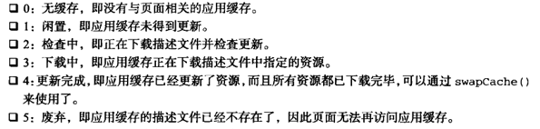

应用缓存还有很多相关的事件，表示其状态的改变：

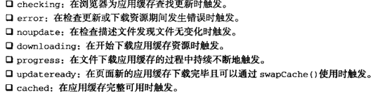

一般来讲，这些事件会随着页面加载按上述顺序依次触发。不过调用`update()`方法可以手工干预，让应用缓存为检查更新而触发上述事件：

```javascript
applicationCache.update();
```

`update()`一经调用，应用缓存就会去检查描述文件是否更新（触发`checking`事件），然后就像页面刚加载一样，继续执行后续操作。如果触发了`cached`事件，就说明应用缓存已经准备就绪。如果触发了`updateready`事件，则说明新版本的缓存已经可用，而此时需要调用`swapCache()`来启用新应用缓存：

```javascript
EventUtil.addHandler(applicationCache, 'updateready', function () {
  applicationCache.swapCache();
});
```

### 数据存储

#### Cookie

HTTP Cookie，通常直接叫做Cookie，最初是在客户端用于存储会话信息的。该标准要求服务器对任意HTTP请求发送`Set-Cookie` HTTP头作为响应的一部分，其中包含会话信息。例如，这种服务器响应的头可能如下：

```http
HTTP/1.1 200 OK
Content-type: text/html
Set-Cookie: name=value
Other-header: other=header-value
```

这个HTTP响应设置以`name`为名称、以`value`为值的一个Cookie，名称和值在传送时都必须是URL编码的。浏览器会存储这样的会话信息，并在这之后，通过为每个请求添加Cookie HTTP头将信息发送回服务器：

```http
GET /index.html HTTP/1.1
Cookie: name=value
Other-header: other-header-value
```

##### 限制

Cookie在性质上是绑定在特定的域名下的。当设定了一个Cookie后，再给创建它的域名发送请求时，都会包含这个Cookie。这个限制确保了存储在Cookie中的信息只能让批准的接受者访问，而无法被其他域访问。

由于Cookie是存在客户端计算机上的，还加入了一些限制确保Cookie不会被恶意使用，同时不会赞同太多磁盘空间。每个域的Cookie总数是有限的，不过不同浏览器之间各有不同：

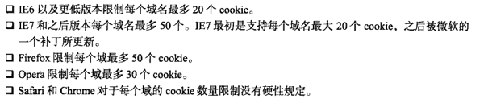

当超过单个域名限制之后还要再设置Cookie，浏览器就会清楚以前设置的Cookie。IE和Opera会删除最近最少使用过的Cookie，腾出空间给新设置的Cookie。FIrefox看上去好像是随机决定要清除哪个Cookie，所以要考虑Cookie限制非常重要，以免出现不可预期的后果。

浏览器中对于Cookie的尺寸也有个限制。大多数浏览器都有大约4096B（加减1）的长度限制。为了最佳的浏览器兼容性，最好将整个Cookie长度限制在4095B（包含4095B）以内。尺寸限制影响到一个域下所有的Cookie，而并非每个Cookie单独限制。

如果尝试创建超过最大尺寸限制的Cookie，那么该Cookie会被悄无声息地丢掉。注意，虽然一个字符通常占用一字节，但是多字节情况则有不同。

##### Cookie的构成

Cookie由浏览器保存的以下几块信息构成。

* 名称：一个唯一确定Cookie的名称。Cookie名称是不区分大小写的，所以`mycookie`和`MyCookie`被认为是同一个Cookie。然而，实践中最好将Cookie名称看做是区分大小写的，因为某些服务器会这样处理Cookie。Cookie的名称必须是经过URL编码的
* 值：储存在Cookie中的字符串值。值必须被URL编码
* 域：Cookie对于哪个域是有效的。所有向该域发送的请求中都会包含这个Cookie信息。这个值可以包含子域，也可以不包含它。如果没有明确设定，那么这个域会被认作来自设置Cookie的那个域
* 路径：对于指定域中的那个路径，应该向服务器发送cookie。例如，可以指定cookie只有从`http://www.tc9011.com/books/`中才能访问，那么`http://www.tc9011.com`的页面就不会发送cookie信息，即使请求都是来自同一个域
* 失效时间：表示cookie何时应该被删除的时间戳（也就是，何时应该停止向服务器发送这个cookie）。默认情况下，浏览器会话结束时即将所以cookie删除，不过，也可以自己设置删除时间。这个值是个GMT格式的日期，用于指定应该删除cookie的准确时间。因此，cookie可以在浏览器关闭后依然保存在用于的机器上。如果设置的失效日期是个以前的时间，则cookie会被立刻删除
* 安全标志：指定后，cookie只有在使用SSL连接的时候才会发送到服务器

，每一段信息都作为`Set-Cookie`头的一部分，使用分号加空格分隔每一段：

```http
HTTP/1.1 200 OK
Content-type: text/html
Set-Cookie: name=value; expires=Mon, 22-Jan-07 07:10:24 GMT; domain=.tc9011.com
Other-header: other=header-value
```

该头信息指定了一个叫做`name`的cookie，它会在格林威治时间2007年1月22日 7:10:24失效，同时对于`www.tc9011.com`和`tc9011.com`的任何子域都有效。

`secure`标志是cookie中唯一一个非名值对的部分，直接包含一个`secure`单词：

```http
HTTP/1.1 200 OK
Content-type: text/html
Set-Cookie: name=value; domain=.tc9011.com; path=/; secure
Other-header: other=header-value
```

尤其要注意，域、路径、失效时间和secure标识都是服务器给浏览器的指示，以指定何时应该发送cookie。这些参数并不会作为发送到服务器的cookie信息的一部分，只有名值对才会被发送。

##### JavaScript中的cookie

在JavaScript中处理cookie有些复杂，因为其众所周知的蹩脚的接口，即BOM的`document.cookie`属性。这个属性的独特之处在于它会因为使用它的方式不同而表现出不同的行为。当用来获取属性值时，`document.cookie`返回当前页面可用的所有cookie的字符串，一系列由分号隔开的名值对：

```javascript
name1=value;name2=value2;name3=value3
```

所有名字和值都是经过URL编码的，所以必须使用`decodeURIComponent()`来解码。

当用于设置值的时候，`document.cookie`属性可以设置为一个新的cookie字符串。这个cookie字符串会被解释并添加到现有的cookie集合中。设置`document.cookie`并不会覆盖cookie，除非设置的cookie的名字已经存在。设置cookie的格式如下，和`Set-Cookie`头中使用的格式一样。

```javascript
name=value; expires=expiration_time; path=domain_path; domain=domain_name; secure
```

这些参数中，只有cookie的名字和值是必须的：

```javascript
document.cookie = 'name=tc';
```

当客户端每次向服务端发送请求的时候，都会发送这个cookie；当浏览器关闭的时候，它就会被删除。虽然这段代码没问题，但因为这里正好名称和值都无需编码，所以最好每次设置cookie时都像下面一样使用`encodeURIComponent()`：

```javascript
document.cookie = encodeURIComponent('name') + '=' +encodeURIComponent('tc');
```

要给被创建的cookie指定额外的信息，只要将参数追加到该字符串，和`Set-Cookie`头中的格式一样：

```javascript
document.cookie = encodeURIComponent('name') + '=' +encodeURIComponent('tc') + '; domain=.tc9011.com; path=/';
```

由于JavaScript中读写cookie不是很直观，常常需要一些函数来简化cookie的功能。基本的cookie操作有三种：读取、写入和删除：

```javascript
var CookieUtil = {
  get: function (name) {
    var cookieName = encodeURIComponent(name) + '=',
        cookieStart = document.cookie.indexOf(cookieName),
        cookieValue = null;

    if (cookieStart > -1) {
      var cookieEnd = document.cookie.indexOf(';', cookieStart);
      if (cookieEnd == -1) {
        cookieEnd = document.cookie.length;
      }
      cookieValue = decodeURIComponent(document.cookie.substring(cookieStart + cookieName.length, cookieEnd));
    }
    return cookieValue;
  },

  set: function (name, value, expires, path, domain, secure) {
    var cookieText = encodeURIComponent(name) + '=' + encodeURIComponent(value);

    if (expires instanceof Date) {
      cookieText += '; expires=' + expires.toGMTString();
    }

    if (path) {
      cookieText += '; path=' + path;
    }

    if (domain) {
      cookieText += '; domain=' +domain;
    }

    if (secure) {
      cookieText += '; secure';
    }

    document.cookie = cookieText;
  },

  unset: function (name, path, domain, secure) {
    this.set(name, '', new Date(0), path, domain, secure);
  }	
  // 没有删除已有cookie的直接方法。所以要使用相同的路径、域和安全选项再次设置cookie，并设置失效时间为过去时间
};
```

```javascript
// 设置cookie
CookieUtil.set('name', 'tc');
CookieUtil.set('book', 'yyy');

// 读取cookie值
console.log(CookieUtil.get('name'));    // tc
console.log(CookieUtil.get('book'));    // yyy

// 删除cookie
CookieUtil.unset('name');
CookieUtil.unset('book');

// 设置cookie，包括它的路径、域和失效日期
CookieUtil.set('name', 'tc', '/books/projs/', 'www.tc9011.com', new Date('January 1, 2010'));

// 删除刚刚设置的cookie
CookieUtil.unset('name', '/books/projs/', 'www.tc9011.com');

// 设置安全的cookie
CookieUtil.set('name', 'tc', null, null, null, true);
```

##### 子cookie

为了绕开浏览器的单域名下的cookie数限制，一些开发人员使用了一种称为子cookie的概念。子cookie是存放在单个cookie中的更小段的数据。也就是使用cookie值来存储多个名称值对。子cookie最常见的格式如下：

```javascript
name=name1=value1&name2=value2&name3=value3&name4=value4&name5=value5
```

子cookie一般也以查询字符串的格式进行格式化。然后这些值可以使用单个cookie进行存储和访问。而非每个名值对使用不同的cookie存储。

为了更好地操作子cookie，必须建立一系列新方法。子cookie的解析和序列化会因子cookie的期望用途而略有不同并更加复杂些：

```javascript
var SubCookieUtil = {
  get: function (name, subName) {		// 获取单个子cookie的值
    var subCookies = this.getAll(name);
    if (subCookies) {
      return subCookies(subName);
    } else {
      return null;
    }
  },

  getAll: function (name) {	// 获取所有子cookie并将它们放入一个对象中返回
    var cookieName = encodeURIComponent(name) + '=',
        cookieStart = document.cookie.indexOf(cookieName),
        cookieValue = null,
        cookieEnd,
        subCookies,
        i,
        parts,
        result = {};

    if (cookieStart > -1) {
      cookieEnd = document.cookie.indexOf(';', cookieStart);
      if (cookieEnd == -1) {
        cookieEnd = document.cookie.length;
      }
      cookieValue = document.cookie.substring(cookieStart + cookieName.length, cookieEnd);

      if (cookieValue.length > 0) {
        subCookies = cookieValue.split('&');

        for (i = 0, len = subCookies.length; i < len; i++) {
          parts = subCookies[i].split('=');
          result[decodeURIComponent(parts[0])] = decodeURIComponent(parts[1]);
        }

        return result;
      }
    }

    return null;
  }
};
```

```javascript
// 假设document.cookie = data=tc&book=pro%20js

// 取得全部子cookie
var data = SubCookieUtil.getAll('data');
console.log(data.name);     // tc
console.log(data.book);     // pro js

// 逐个获取子cookie
console.log(SubCookieUtil.get('data', 'name'));     // tc
console.log(SubCookieUtil.get('data', 'book'));     // pro js
```

要设置子cookie，也有两种方法：

```javascript
var SubCookieUtil = {

  set: function (name, subName, value, expires, path, domain, secure) {
    var subcookies = this.getAll(name)  || {};
    subcookies[subName] = value;
    this.setAll(name, subcookies, expires, path, domain, secure);
  },

  setAll: function (name, subcookies, expires, path, domain, secure) {
    var cookieText = encodeURIComponent(name) + '=',
        subcookieParts = new Array(),
        subName;

    for (subName in subcookies) {
      if (subName.length > 0 && subcookies.hasOwnProperty(subName)) {
        subcookieParts.push(encodeURIComponent(subName) + '=' + encodeURIComponent(subcookies[subName]));
      }
    }

    if (subcookieParts.length > 0) {
      cookieText += subcookieParts.join('&');

      if (expires instanceof  Date) {
        cookieText += '; expires=' + expires.toGMTString();
      }

      if (path) {
        cookieText += '; path=' + path;
      }

      if (domain) {
        cookieText += '; domain=' + domain;
      }

      if (secure) {
        cookieText += '; secure';
      }
    } else {
      cookieText += '; expires=' + (new Date(0)).toGMTString();
    }

    document.cookie = cookieText;
  }
};
```

```javascript
// 设置两个cookie
SubCookieUtil.set('data', 'name', 'tc');
SubCookieUtil.set('data', 'book', 'pro js');

// 设置全部子cookie和失效日期
SubCookieUtil.setAll('data', {name: 'tc', book: 'pro js'}, new Date('January 1, 2010'));

// 修改名字的值，并修改cookie的失效日期
SubCookieUtil.set('data', 'name', 'tc', new Date('February 1, 2010'));
```

子cookie的最后一组方法是用于删除子cookie 的，普通cookie可以通过将失效时间设置为过去的时间的方法来删除，但子cookie不能这样做。为了删除一个子cookie，首先必须获取包含在某个cookie中的所有子cookie，然后仅删除需要删除的那个子cookie，然后再将余下的子cookie的值保存为cookie的值：

```javascript
var SubCookieUtil = {
  unset: function (name, subName, path, domain, secure) {
    var subcookies = this.getAll(name);
    if (subcookies) {
      delete subcookies(subName);
      this.setAll(name, subcookies, null, path, domain, secure);
    }
  },

  unsetAll: function (name, path, domain, secure) {
    this.setAll(name, null, new Date(0), path, domain, secure);
  }
}
```

```javascript
// 仅删除名为name的子cookie
SubCookieUtil.unset('data', 'name');

// 删除整个cookie
SubCookieUtil.unsetAll('data');
```

##### 关于cookie的思考

还有一类cookie被称为HTTP专有cookie。HTTP专有cookie可以从浏览器或者服务器设置，但是只能从服务端读取，因为JavaScript无法获取HTTP专有cookie的值。

由于所有cookie都会由浏览器作为请求头发送，所以在cookie中存储大量信息会影响到特定域的请求性能。cookie信息越大，完成对服务器请求的时间也就越长。尽管浏览器对cookie进行了大小限制，不过最好还是尽可能在cookie中存储信息，以免影响性能。

#### web存储机制

Web Storage的目的是克服由cookie带来的一些限制，当数据需要被严格控制在客户端上时，无须持续地将数据发回服务器。Web Storage的两个主要目标是：

* 提供一种在cookie之外存储会话数据的途经
* 提供一种存储大量可以跨会话存在的数据的机制

##### Storage类型

Storage类型提供最大的存储空间来存储名值对。Storage的实例与其他对象类似，有如下方法：

* `clear()`：删除所有值，FIrefox中没有实现
* `getItem(name)`：根据指定的名字`name`获取对应的值
* `key(index)`：获得`index`位置处的值的名字
* `removeItem(name)`：删除由`name`指定的名值对
* `setItem(name, value)`：为指定的`name`设置一个对应的值

其中，`getItem()`、`removeItem()`和`setItem()`方法可以直接调用，也可以通过Storage对象间接调用。因为每个项目都是作为属性存储在该对象上的，所以可以通过点语法或方括号语法访问属性来读取值，设置也一样，或者通过`delete`操作符进行删除。不过，还是建议使用方法而不是属性来访问数据，以避免某个键会意外重写该对象上已有的成员。

还可以使用`length`属性来判断有多少名值对存放在Storage对象中。但无法判断对象中所有数据的大小。

##### sessionStorage对象

sessionStorage对象存储特定于某个会话的数据，也就是该数据只保持到浏览器关闭。这个对象就像会话cookie，也会在浏览器关闭后消失。存储在sessionStorage中的数据可以跨越页面刷新而存在，同时如果浏览器支持，浏览器崩溃并重启后依然可用。

因为sessionStorage对象绑定于某个服务器会话，所以当文件在本地运行的时候是不可用的。存储在sessionStorage中的数据只能由最初给对象存储数据的页面访问到，所以对多页面应用有限制。

由于sessionStorage对象是Storage的一个实例，所以可以使用`setItem()`或者直接设置新的属性来存储数据：

```javascript
// 使用方法存储数据
sessionStorage.setItem('name', 'tc');

// 使用属性存储数据
sessionStorage.book = 'pro js';
```

sessionStorage中有数据时，可以用`getItem()`或者通过直接访问属性名来获取数据：

```javascript
// 使用方法读取数据
var name = sessionStorage.getItem('name');

// 使用属性读取数据
var book = sessionStorage.book;
```

还可以通过结合`length`和`key()`方法来迭代sessionStorage中的值：

```javascript
for (var i = 0, len = sessionStorage.length; i < len; i++) {
  var key = sessionStorage.key(i);
  var value = sessionStorage.getItem(key);
  console.log(key + '=' + value);
}
```

还可以用`for-in`循环来迭代sessionStorage中的值：

```javascript
for (var key in sessionStorage) {
  var value = sessionStorage.getItem(key);
  console.log(key + '=' + value);
}
```

要从sessionStorage中删除数据，可以使用`delete`操作符删除对象属性，也可调用`removeItem()`方法：

```javascript
// 使用delete删除一个值-在webkit中无效
delete sessionStorage.name;

// 使用方法删除一个值
sessionStorage.removeItem('book');
```

sessionStorage对象应该主要用于仅针对会话的小段数据的存储。如何需要跨越会话存储数据，localStorage更为合适。

##### localStorage对象

不能给localStorage指定任何访问规则，规则事先就设定好了。要访问同一个localStorage对象，页面必须来自同一个域名（子域名无效），使用同一种协议，在同一个端口上。

由于localStorage是Storage的实例，所以可以像sessionStorage一样来使用它：

```javascript
// 使用方法存储数据
localStorage.setItem('name', 'tc');

// 使用属性存储数据
localStorage.book = 'pro js';

// 使用方法读取数据
var name = localStorage.getItem('name');

// 使用属性读取数据
var book = localStorage.book;
```

存储在localStorage中的数据保留到通过JavaScript删除或者用户清除浏览器缓存。

##### Storage事件

对Storage对象进行任何修改，都会在文档上触发Storage事件。当通过属性或`setItem()`方法保存数据，使用`delete`操作符或`removeItem()`删除数据，或者调用`clear()`方法时，都会发送该事件。这个事件的`event`对象有以下属性：

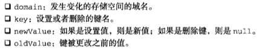

```javascript
EventUtil.addHandler(document, 'storage', function (event) {
  console.log('storage changed for ' + event.domain);
});
```

无论对sessionStorage还是localStorage进行操作，都会触发Storage事件，但不作区分。

##### 限制

一般来说，对存储空间大小的限制都是以每个来源为单位的。换句话说。每个来源都有固定大小的空间用于保存自己的数据。

对localStorage而言，大多数桌面浏览器会设置每个来源5MB的限制。Chrome和Safari对每个来源的限制是2.5MB，而iOS版Safari和Android版WebKit的限制也是2.5MB。

对sessionStorage限制也因浏览器而异。Chrome、Safari、iOS版Safari和Android版WebKit都是2.5MB，IE8+和Opera是5MB。

#### IndexedDB

IndexedDB是在浏览器中保存结构化数据的一种数据库。IndexedDB的思想是创建一套API，方便保存和读取JavaScript对象，同时还支持查询和搜索。

IndexedDB设计的操作完全是异步进行的。因此，大多数操作会以请求方式进行，但这些操作会在后期执行，然后如果成功则返回结果，如果失败则返回错误。差不多每一次IndexedDB操作，都需要注册`onerror`和`onsuccess`事件处理程序，以确保适当地处理结果。

在得到完整支持的情况下，IndexedDB将是一个作为API宿主的全局对象。由于API仍然可能有变化，浏览器也都使用提供商前缀，这个对象在IE10中叫`msIndexedDB`，在FIrefox中叫`mozIndexedDB`，在Chrome中叫`webkitIndexedDB`：

```javascript
var indexedDB = window.indexedDB || window.msIndexedDB || window.mozIndexedDB || window.webkitIndexedDB;
```

##### 数据库

IndexedDB就是一个数据库，最大的特色是使用对象保存数据，而不是使用表来保存数据。一个IndexedDB数据库，就是一组位于相同命名空间下的对象的集合。

使用IndexedDB第一步就是打开它，即要把数据库名传给`indexDB.open()`。如果传入的数据库已经存在，就会发送一个打开它的请求；如果不存在，就会发送一个创建并打开它的请求。调用`indexedDB.open()`会返回一个IDBRequest对象，在这个对象上可以添加`onerror`和`onsuccess`事件处理程序：

```javascript
var request, database;

request = indexedDB.open('admin');
request.onerror = function (event) {
  console.log('something bad happened while trying to open: ' + event.target.errorCode);
};
request.onsuccess = function (event) {
  database = event.target.result;
};
```

在这两个事件处理程序中，`event.target`都指向`request`对象，因此它们可以互换使用。如果响应的是`onsuccess`事件处理程序，那么`event.target.result`中将有一个数据库实例对象，这个对象会保存在`database`变量中。如果发生了错误，`event.target.errorCode`中将保存一个错误码，表示问题的性质。以下是可能的错误码：

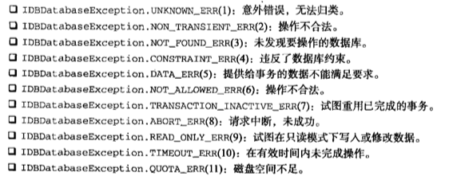

默认情况下，IndexedDB数据库是没有版本号的，最好一开始就为数据库指定一个版本号。可以调用`setVersion()`方法，传入以字符串形式表示的版本号。同样，调用这个方法也会返回一个请求对象，需要再指定事件处理程序：

```javascript
if (database.version != '1.0') {
  request = database.setVersion('1.0');
  request.onerror = function (event) {
    console.log('something bad happened while trying to open: ' + event.target.errorCode);
  };
  request.onsuccess = function (event) {
    console.log('database initialization complete. database name: ' + database.name + ', version: ' + database.version);
  }
} else {
  console.log('database initialization complete. database name: ' + database.name + ', version: ' + database.version);
}
```

通过这种模式，就能知道想使用的数据库是否已经设置了适当的对象存储空间。在整个web应用中，随着对数据库结构的更新和修改，可能会产生很多不同版本的数据库。

##### 对象存储空间

如果数据库版本与传入的版本不匹配，可能就需要创建一个新的对象存储空间。在创建对象存储空间之前，必须想清楚想要保存什么数据类型。

假设你要保存的用户记录由用户名、密码组成，那么保存一条记录的对象应该如下所示：

```javascript
var user = {
  username: '007',
  firstname: 'james',
  lastname: 'bond',
  password: 'foo'
};
```

有了这个对象，很容易想到`username`属性可以作为这个对象存储空间的键。这个`username`必须全局唯一，而且大多数时候都要通过这个键来访问数据。这一点很重要，因为在创建对象存储空间时，必须指定这么一个键。

```javascript
var store = db.createObjectStore('users', {keyPath: 'username'});
```

其中第二个参数中的`keyPath`属性，就是空间中将要保存的对象的一个属性，而这个属性将作为存储空间的键来使用。

可以使用`add()`或`put()`方法来向其中添加数据。这两个方法都接收一个参数，即要保存的对象，然后这个对象就会被保存到存储空间中。这两个方法的区别在空间中已经包含键值相同的对象时会体现出来。在这种情况下，`add()`会返回错误，而`put()`会重写原有对象。简单地说，可以把`add()`想象成插入新值，把`put()`想象成更新原有值。在初始化对象存储空间时，可以使用类似下面的代码：

```javascript
var i = 0,
    len = user.length;

while (i < len) {
  store.add(user[i++]);
}
```

每次调用`add()`或`put()`都会创建一个新的针对这个对象存储空间的更新请求。如果想验证请求是否成功完成，可以把返回的请求对象保存在一个变量中，然后再指定`onerror`或`onsuccess`事件处理程序：

```javascript
// user中保存着一批用户对象
var i = 0,
    request,
    requests = [],
    len = user.length;

while (i < len) {
  request = store.add(user[i++]);
  request.onerror = function () {
    // 处理错误
  };
  request.onsuccess = function () {
    // 处理成功
  };
  requests.push(request);
}
```

##### 事务

跨过创建对象存储空间这一步后，接下来所有操作都是通过事务来完成的。在数据库对象上调用`transaction()`方法可以创建事务。任何时候，只要想读取或修改数据，都要通过事务来组织所有操作。在最简单的情况下，可以像下面这样创建事务：

```javascript
var transaction = db.transaction();
```

如果没有参数，就只能通过事务来读取数据库中保存的对象。最常见的方式是传入要访问的一或多个对象存储空间。

```javascript
var transaction = db.transaction('user');
```

这样就能保证只加载存储空间中的数据，以便通过事务进行访问。如果要访问多个对象存储空间，也可以在第一个参数的位置上传入字符串数组：

```javascript
var transaction = db.transaction('user', 'anotherStore');
```

这些事务都是以只读方式访问数据。要修改访问方式，必须在创建事务时传入第二个参数，这个参数表示访问模式，用`IDBTransaction`接口定义的如下常量表示：`READ_ONLY(0)`表示只读，`READ_WEITE(1)`表示读写，`VERSION_CHANGE(2)`表示改变。IE10+和FIrefox4+实现的是`IDBTransaction`，但在Chrome中则叫`webkitIDBTransaction`：

```javascript
var IDBTransaction = window.IDBTransaction || window.webkitIDBtransaction;
```

```javascript
var transaction = db.transaction('user', IDBTransaction.READ_WRITE);
```

这样就能读写`user`的存储空间。

取得了事务的索引后，使用`objectStore()`方法并传入存储空间的名称，就可以访问特定的存储空间。然后，可以用`add()`和`put()`方法，使用`get()`可以取得值，使用`delete()`可以删除对象，而使用`clear()`则可以删除所有对象。`get()`和`delete()`方法都接收一个对象键作为参数，而这5个方法都会返回一个新的请求对象：

```javascript
var request = db.transaction('user').objectStore('user').get('007');
request.onerror = function (event) {
  console.log('did not get the object');
};
request.onsuccess = function (event) {
  var result = event.target.result;
  console.log(result.firstname);
};
```

因为一个事务可以完成任何多个请求，所以事务对象本事也有事件处理程序：`onerror`和`oncomplete`。这个事件可以提供事务级的状态信息：

```javascript
transaction.onerror = function (event) {
  // 整个事务都被取消了
};
transaction.oncomplete = function (event) {
  // 整个事务都成功完成了
};
```

通过`oncomplete`事件的事件对象`event`访问不到`get()`请求返回的任何数据，必须在相应请求的`onsuccess`事件处理程序中才能访问。

##### 使用游标查询

使用事务可以直接通过已知的键检索单个对象。而在需要检索多个对象的情况下，则需要在事务内部创建游标。游标是一指向结果集的指针。与传统数据库查询不同，游标并不提前收集结果。游标指针会先指向结果中的第一项，在接到查找下一项的指令时，才会指向下一项。

在对象存储空间上调用`openCursor()`方法可以创建游标。`openCursor()`方法返回的是一个请求对象，因此必须为该对象指定`onsuccess`和`onerror`事件处理程序：

```javascript
var store = db.transaction('user').objectStore('user'),
    request = store.openCursor();

request.onsuccess = function (event) {
  // 处理成功
};
request.onerror = function (event) {
  // 处理失败
};
```

在`onsuccess`事件处理程序执行时，可以通过`event.target.result`取得存储空间中的下一个对象。在结果集中有一项时，这个属性中保存一个`IDBCursor`的实例，在没有下一项时，这个属性的值为`null`。`IDBCursor`的实例有以下几个属性：

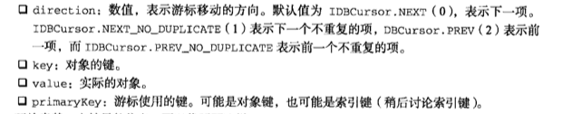

要检索某一个结果的信息：

```javascript
request.onsuccess = function (event) {
  var cursor = event.target.result;
  if (cursor) {
    console.log('key: ' + cursor.key + ', value: ' + JSON.stringify(cursor.value));
  }
};
```

`cursor.value`是一个对象。

使用游标可以更新个别的记录。调用`update()`方法可以用指定的对象更新当前游标的`value`。`update()`方法也会创建一个新的请求，要知道结果，就要为它指定`onsuccess`和`onerror`事件处理程序：

```javascript
request.onsuccess = function (event) {
  var cursor = event.target.result,
      value,
      updateRequest;

  if (cursor) {
    if (cursor.key == 'foo') {
      value = cursor.value;       // 取得当前的值
      value.password = 'magic';   // 更新密码

      updateRequest = cursor.update(value);   // 请求保存更新
      updateRequest.onsuccess = function () {
        // 处理成功
      };
      updateRequest.onerror = function () {
        // 处理失败
      };
    }
  }
};
```

此时，如果调用`delete()`方法，会删除相应的记录。调用`delete()`也返回一个请求：

```javascript
request.onsuccess = function (event) {
  var cursor = event.target.result,
      value,
      deleteRequest;

  if (cursor) {
    if (cursor.key == 'foo') {
      deleteRequest = cursor.delete();        // 请求删除当前项
      deleteRequest.onsuccess = function () {
        // 处理成功
      };
      deleteRequest.onerror = function () {
        // 处理失败
      };
    }
  }
};
```

如果当前事务没有修改对象存储空间的权限，`update()`和`delete()`会抛出错误。

默认情况下，每个游标只发起一次请求。要想发起另一次请求，必须调用下面的一个方法：

* `continue(key)`：移动到结果集的下一项。参数`key`是可选的，不指定这个参数，游标移动到下一项；指定这个参数，游标会移动到指定键的位置
* `advance(count)`：向前移动`count`指定的项数

这两个方法都会导致游标使用相同的请求，因此相同的`onsuccess`和`onerror`事件处理程序也会得到重用：

```javascript
request.onsuccess = function (event) {
  var cursor = event.target.result;
  if (cursor) {
    console.log('key: ' + cursor.key + ', value: ' + JSON.stringify(cursor.value));
    cursor.continue();      // 移动到下一项
  } else {
    console.log('done');
  }
};
```

##### 键范围

键范围为使用游标增添了一些灵活性。键范围由`IDBKeyRange`的实例表示。chrome中叫`webkitIDBKeyRange`：

```javascript
var IDBKeyRange = window.IDBKeyRange || window.webkitIDBKeyRange;
```

有四种定义键范围的方式。第一种是使用`only()`方法，传入想要取得的对象的键：

```javascript
var onlyRange = IDBKeyRange.only('007');
```

这个范围可以保证只取得键为`007`的对象。使用这个范围创建的游标与直接访问存储空间并调用`get('007')`差不多。

第二种方式是指定结果集的下界。下界表示游标开始的位置。例如，以下键范围可以保证游标从键为`007`的对象开始，然后继续向前移动，直至最后一个对象。

```javascript
// 从键为007的对象开始，然后可以移动到最后
var lowerRange = IDBKeyRange.lowerBound('007');
```

如果想忽略键为`007`的对象，从它的下一个对象开始，那么可以传入第二个参数`true`：

```javascript
// 从键为007的下一个对象开始，然后可以移动到最后
var lowerRange = IDBKeyRange.lowerBound('007', true);
```

第三种方式是指定结果集的上界，也就是指定游标不能超越哪个键。指定上界使用`upperRange()`方法：

```javascript
// 从头开始，到键为ace的对象为止
var upperRange = IDBKeyRange.upperBound('ace');
```

如果不想包含键为指定值的对象，同样传入第二个参数`true`：

```javascript
// 从头开始，到键为ace的上一个对象为止
var upperRange = IDBKeyRange.upperBound('ace', true);
```

第四种方式就是同时定义上下界。使用`bound()`方法。这个方法可以接受4个参数：表示下界的键，表示上界的键，可选的表示是否跳过下界的布尔值和可选的表示是否跳过上界的布尔值：

```javascript
// 从键为007的对象开始，到键为ace的对象为止
var boundRange = IDBKeyRange.bound('007', 'ace');

// 从键为007的对象的下一个对象开始，到键为ace的对象为止
var boundRange = IDBKeyRange.bound('007', 'ace', true);

// 从键为007的对象的下一个对象开始，到键为ace的对象的上一个对象为止
var boundRange = IDBKeyRange.bound('007', 'ace', true, true);

// 从键为007的对象开始，到键为ace的对象的上一个对象为止
var boundRange = IDBKeyRange.bound('007', 'ace', false, true);
```

在定义键范围后，把它传给`openCursor()`方法，就能得到一个符合相应约束条件的游标：

```javascript
request.onsuccess = function (event) {
  var cursor = event.target.result;
  if (cursor) {
    console.log('key: ' + cursor.key + ', value: ' + JSON.stringify(cursor.value));
    cursor.continue();  // 移动到下一项
  } else {
    console.log('done');
  }
};
```

##### 设定游标方向

`openCursor()`可以接收两个参数。第一个参数就是刚刚看到的`IDBKeyRange`的实例，第二个是表示方向的数值常量，作为第二个参数的常量是前面讲查询时介绍的`IDBCursor`中的常量。

```javascript
var IDBCursor = window.IDBCursor || window.webkitIDBCursor;
```

正常情况下，游标都是从存储空间的第一项开始，调用`continue()`或`advance()`前进到最后一项。游标的默认方向值是`IDBCursor.NEXT`。如果对象存储空间中有重复的项，而你想让游标跳过那些重复的项，可以为`openCursor`传入`IDBCursor.NEXT_NO_DUPLICATE`作为第二个参数：

```javascript
var store = db.transaction('user').objectStore('user'),
    request = store.openCursor(null, IDBCursor.NEXT_NO_DUPLICATE);
```

`openCursor()`的第一个参数是`null`，表示使用默认的键范围，即包含所有对象。这个游标可以从存储空间中的第一个对象开始，迭代到最后一个对象，但会跳过重复的对象。

也可以创建一个游标，让它在对象存储空间中向后移动，即从最后一个对象开始，逐个迭代，直至第一个对象。此时，要传入的常量是`IDBCursor.PREV`和`IDBCursor.PREV_NO_DUPLICATE`。

```javascript
var store = db.transaction('user').objectStore('user'),
    request = store.openCursor(null, IDBCursor.PREV);
```

使用`IDBCursor.PREV`和`IDBCursor.PREV_NO_DUPLICATE`打开游标时，每次调用`continue()`或`advance()`，都会在存储空间中向后而不是向前移动游标。

##### 索引

对于某些数据，可能需要为一个对象存储空间指定多个键。比如，若要通过用户ID和用户名两种方式保存用户资料，就需要通过这两个键来存取记录。为此，可以考虑将用户ID作为主键，然后为用户名创建索引。

要创建索引，首先引用对象存储空间，然后调用`createIndex()`方法：

```javascript
var store = db.transaction('user').objectStore('user'),
    index = store.createIndex('username', 'username', {unique: false});
```

`createIndex()`第一个参数是索引的名字，第二个参数是索引的属性的名字，第三个参数是一个包含`unique`属性的选项对象。这个选项通常必须制定，因为它表示键在所有记录中是否唯一。因为`username`有可能存储，所有这个索引不是唯一的。

`createIndex()`返回值是`IDBIndex`的实例。在对象存储空间上调用`index()`方法也能返回同一个实例：

```javascript
var store = db.transaction('user').objectStore('user'),
    index = store.index('username');
```

索引与对象存储空间很相似。在索引上调用`openCursor()`方法也可以创建新的游标，除了将来会把索引键而非主键保存在`event.result.key`属性中之外，这个游标与在对象存储空间上调用`openCursor()`返回的游标完全一样：

```javascript
var store = db.transaction('user').objectStore('user'),
    index = store.index('username'),
    request = index.openCursor();

request.onsuccess = function (event) {
  // 处理成功
};
```

在索引上也能创建一个特殊的只返回每条记录主键的游标那就要调用`openKeyCursor()`方法。这个方法接收的参数与`openCursor()`相同。而最大的不同在于，这种情况下`event.result.key`中仍然保存着索引键，而`event.result.value`中保存的则是主键，而不再是整个对象：

```javascript
var store = db.transaction('user').objectStore('user'),
    index = store.index('username'),
    request = index.openKeyCursor();

request.onsuccess = function (event) {
  // 处理成功
  // event.result.key中保存索引键，而event.result.value保存主键
};
```

使用`get()`方法能从索引中取得一个对象，只要传入相应的索引键即可，这个方法也将返回一个请求：

```javascript
var store = db.transaction('user').objectStore('user'),
    index = store.index('username'),
    request = index.get('007');

request.onsuccess = function (event) {
  // 处理成功
};
```

要根据给定的索引键取得主键，可以使用`getKey()`方法。这个方法会创建一个新的请求，但`event.result.value`等于主键，而不是包含整个对象：

```javascript
var store = db.transaction('user').objectStore('user'),
    index = store.index('username'),
    request = index.getKey('007');

request.onsuccess = function (event) {
  // 处理成功
  // event.result.key中保存索引键，而event.result.value保存主键
};
```

任何时候，通过`IDBIndex`对象的下列属性都可以取得有关索引的相关信息：

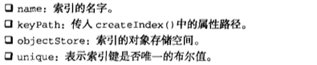

另外，通过对象存储对象的`indexName`属性可以访问到该空间建立的所有索引。通过下面代码可以知道根据存储的对象建立了哪些索引：

```javascript
var store = db.transaction('user').objectStore('user'),
    indexNames = store.indexNames,
    index,
    i = 0,
    len = indexNames.length;

while (i < len) {
  index = store.index(indexNames[i++]);
  console.log('index name: ' + index.name + ', keypath: ' + index.keyPath + ', unique: ' + index.unique);
}
```

在对象存储空间上调用`deleteIndex()`方法并传入索引的名字可以删除索引：

```javascript
var store = db.transaction('user').objectStore('user');
store.deleteIndex('username');
```

因为删除索引不会影响对象存储空间中的数据，所以这个操作没有任何回调函数。

##### 并发问题

如果浏览器的两个不同的标签页打开了同一个页面，那么一个页面试图更新另一个页面尚未准备就绪的数据库，并发问题就有可能发生。把数据库设置为最新版本有可能导致这个问题。因此，只有浏览器中仅有一个标签页使用数据库的情况下，调用`setVersion()`才能完成操作。

刚打开数据库时，记着指定`onversionchange`事件处理程序。当同一个来源的另一个标签页调用`setVersion()`时，就会执行这个回调函数，处理这个事件最佳方式是立即关闭数据库，从而保证版本更新顺利完成：

```javascript
var request, database;

request = indexedDB.open('admin');
request.onsuccess = function (event) {
  database = event.target.result;

  database.onversionchange = function () {
    database.close();
  };
};
```

每次成功打开数据库，都应该指定`onversionchange`事件处理程序。

调用`setVersion()`时，指定请求的`onblocked`事件处理程序也很重要。在想要更新数据库的版本但另一个标签页已经打开数据库的情况下，就会触发这个事件处理程序。此时，最好先通知用户关闭其他标签页，然后再重新调用`setVersion()`：

```javascript
var request = database.setVersion('2.0');
request.onblocked = function () {
  alert('please close all other tabs and try again');
};
request.onsuccess = function () {
  // 处理成功，继续
};
```

其他标签页中的`onversionchange`事件处理程序也会执行。

##### 限制

IndexedDB数据库只能由同源页面操作，因此不能跨域共享信息。

每个来源的数据库占用磁盘空间也是有限制的。FIrefox4+上限是每个源50MB，而chrome限制是5MB。

FIrefox还有另一个限制，即不允许本地文件访问IndexedDB。chrome没有这个限制。

## 最佳实践

### 可维护性

#### 什么是可维护的代码

* 可理解性：其他人可以接手代码并理解它的意图和一般途经，而无需原开发人员的完整解释
* 直观性：代码中的东西一看就能明白，不管其操作过程多复杂
* 可适应性：代码以一种数据上的变化不要求完全重写的方法撰写
* 可扩展性：在代码架构上已考虑未来允许对核心功能进行扩展
* 可调试性：当有错误时，代码可以给予足够信息来尽可能直接地确定问题所在。

#### 代码约定

一种让代码变得可维护的简单途经是形成一套JavaScript代码的书写约定。

##### 可读性

可读性的大部分内容都是和代码的缩进有关的。当所有人都使用一样的缩进方式时，整个项目中的代码都会更加易于阅读。通常会使用若干空格而非制表符来进行缩进，这是因为制表符在不同的文本编辑器中显示效果不同。一种不错的、很常见的缩进大小为4个空格。

可读性的另一方面是注释。JavaScript可以在代码任何地方创建函数，所以为每个函数编写文档就更加重要。一般如下地方需要进行注释：

* 函数和方法：每个函数或方法都应该包含一个注释，描述其目的和用于完成任务所可能使用的算法。陈述事先的假设也非常重要，比如参数代表什么。函数是否有返回值
* 大段代码：用于完成单个任务的多行代码应该在前面放一个描述任务的注释
* 复杂的算法：如果使用了一种独特的方式解决某个问题，则要在注释中解释你是如何做的
* Hack：因为浏览器的差异，JavaScript代码一般会包含一些hack。需要使用一些不同的方法，那么请将这些信息放在注释中。这样可以减少出现这种情况的可能性：有人看到你的hack，然而`修正`了它

##### 变量和函数名

适当给变量和函数起名字对增加代码可理解性和可维护性很重要。命名的一般规则如下：

* 变量名应该为名词如`car`或`person`
* 函数名应该以动词开始，如`getName()`，返回布尔值类型的函数一般以`is`开头，如`isEnable()`
* 变量和函数都应该使用合乎逻辑的名字，不要担心长度。长度问题可以通过后处理和压缩来缓解

##### 变量类型透明

有三种表示变量数据类型的方式：

* 第一种是初始化。当定义了一个变量后，应该被初始化为一个值，来暗示如何应用：

```javascript
// 通过初始化指定变量类型
var found = false;       // 布尔型
var count = -1;         // 数字
var name = '';          // 字符串
var person = null;      // 对象
```

缺点是无法用于函数声明中的函数参数。

* 第二种是使用匈牙利标记法类指定变量类型。匈牙利标记法在变量名之前加上一个或多个字符来表示数据类型。JavaScript中最传统的匈牙利标记法是用单个字符表示基本类型：`o`代表对象，`s`代表字符串，`i`代表整数，`f`代表浮点数，`b`代表布尔值：

```javascript
// 用于指定数据类型的匈牙利标记法
var bFound;     // 布尔型
var iCount;     // 整数
var sName;      // 字符串
var oPerson;    // 对象
```

JavaScript中用匈牙利标记法好处是函数参数一样可以使用。但缺点是让代码某种程度上难以阅读，阻碍了没有用它时代码的直观性和句子式的特质。

* 最后一种是使用类型注释。类型注释放在变量名右边，但是在初始化前面。这种方式是在变量旁边放一段指定类型的注释：

```javascript
// 用于指定类型的类型注释
var found /*:Boolean*/ = false;
var count /*:int*/ = 10;
var name /*:String*/ = 'tc';
var person /*Object*/ = null;
```

代码注释维持了代码的整体可读性，同时注入了类型信息。类型注释的缺点是不能用多行注释一次注释一大块代码，因为类型注释也是多行注释，两者会冲突。

#### 松散耦合

只要应用的某个部分过分依赖于另一个部分，代码就是耦合过紧，难于维护。

##### 解耦HTML/JavaScript

一种常见的耦合类型就是HTML/JavaScript耦合。在Web上，HTML和JavaScript各自代表了解决方案中的不同层次：HTML是数据，JavaScript是行为。因为它们天生就需要交互，所以有多种不同的方法将这两个技术关联起来。但有一些方法会将HTML和JavaScript过于紧密地耦合在一起。

直接写在HTML的JavaScript，使用包含内联代码的`<script>`元素或者是使用HTML属性来分配事件处理程序，都是过于紧密的耦合：

```html
<!--使用了<script>的紧密耦合的HTML和JavaScript-->
<script>
    document.write('hello');
</script>

<!--使用事件处理程序属性值的紧密耦合的HTML和JavaScript-->
<input type="button" value="click me" onclick="doSomething()" />
```

理想情况是，HTML和JavaScript完全分离，并通过外部文件和使用DOM附加行为来包含JavaScript。

当HTML和JavaScript过于紧密的耦合在一起时，出现JavaScript错误时就要先判断错误时出现在HTML部分还是在JavaScript文件中。它还会引入和代码是否可用的相关新问题。

HTTML和JavaScript的紧密耦合也可以在相反的关系上成立：JavaScript包含了HTML：

```javascript
// 将HTML紧密耦合到JavaScript
function insertMessage(msg) {
  var container = document.getElementById('container');
  container.innerHTML = '<div class="msg"><p class="post">' + msg +'</p>' + '<p><em>latest message above.</em></p></div>';
}
```

一般来说，应该避免在JavaScript中创建大量HTML。再一次重申要保持层次的分离，这样很容易的确定错误来源。

HTML呈现应该尽可能与JavaScript保持分离。当JavaScript用于插入数据时，尽量不要直接插入标记。一般可以在页面中直接包含并隐藏标记，然后等到整个页面渲染好之后，就可以用JavaScript显示该标记，而非生成它。另一种方法是进行Ajax请求并获取更多要显示的HTML，整个方法可以让同样的渲染层（PHP、JSP、Ruby等）来输出标记，而不是直接嵌到JavaScript中。

##### 解耦CSS/JavaScript

另一个Web层则是CSS，它主要负责页面的显示。JavaScript和CSS也是非常紧密相关的。

```javascript
// css对JavaScript的紧密耦合
element.style.color = 'red';
element.style.backgroundColor = 'blue';
```

由于CSS负责页面的显示，当显示出现任何问题时都应该只是查看CSS文件来解决。

可以通过动态更改样式类而非特定样式来实现：

```javascript
// css对JavaScript的松散耦合
element.className = 'edit';
```

通过只修改某个元素的CSS类，就可以让大部分样式信息严格保留在CSS中。

##### 解耦应用逻辑/事件处理程序

```javascript
function handleKeyPress(event) {
  event = EventUtil.getEvent(event);
  if (event.keyCode == 13) {
    var target = EventUtil.getTarget(event);
    var value = 5 * parseInt(target.value);
    if (value > 10) {
      document.getElementById('error-msg').style.display = 'block';
    }
  }
}
```

这个事件处理程序除了包含应用逻辑，还进行了事件处理。这种方式的问题有双重性。首先，除了通过事件之外就再没有方法执行应用逻辑，这让调试变得困难。如果没有发生预想的结果怎么办？是不是表示事件处理程序没有被调用还是指应用逻辑失败？其次，如果一个后续事件引发同样的应用逻辑，那就必须复制功能代码或者将带啊抽取到一个单独的函数中。

较好的方法是应用逻辑和事件处理程序相分离，这样两者分别处理各自的东西。一个事件处理程序应该从事件对象中提取相关信息，并将这些信息传送到处理应用逻辑的某个方法中：

```javascript
function validateValue(value) {
  value = 5 * parseInt(value);
  if (value > 10) {
    document.getElementById('error-msg').style.display = 'block';
  }
}

function handleKeyPress(event) {
  event = EventUtil.getEvent(event);
  if (event.keyCode == 13) {
    var target = EventUtil.getTarget(event);
    validateValue(target.value);
  }
}
```

从事件处理程序中分离应用逻辑有几个好处。首先，可以更容易更改触发特定过程的事件。其次，可以在不附加到事件的情况下测试代码，使其更易创建单元测试或自动化流程。

以下是要牢记的应用和业务逻辑之间松散耦合的几条原则：

* 勿将`event`对象传给其他方法；只传来自`event`对象中所需的数据
* 任何可以在应用层面的动作都应该可以在不执行任何事件处理程序的情况下进行
* 任何事件处理程序都应该处理事件，然后将处理转交给应用逻辑

#### 编程实践

##### 尊重对象所有权

尊重对象所有权意思是不能修改不属于你的对象：

* 不要为实例或原型添加属性
* 不要为实例或原型添加方法
* 不要重定义已存在的方法

这些规则不仅仅适用于自定义类型和对象，对诸如`object`、`string`、`document`、`window`等原生类型和对象也适用。

依然可以以下方式为对象创建新的功能：

* 创建包含所需要功能的新对象，并用它与相关对象进行交互
* 创建自定义类型，继承需要进行修改的类型。然后可以为自定义类型添加额外功能

##### 避免全局量

与尊重对象所有权密切相关的是尽可能避免全局变量和函数。最多创建一个全局变量，让其他对象和函数存在其中：

```javascript
// 两个全局量---避免
var name = 'tc';
function sayName() {
  console.log(name);
}

// 一个全局量---推荐
var MyApplication = {
  name: 'tc',
  sayName: function () {
    console.log('this.name');
  }
};
```

单一的全局量的延伸便是命名空间，命名空间包括创建一个用于放置功能的对象。命名空间很重要的一部分是确定每个人都同意使用的全局对象的名字，并且尽可能唯一，让其他人不太可能也使用这个名字。

```javascript
// 创建全局对象
var Wrox = {};

// 为Professional JavaScript创建命名空间
Wrox.ProJS = {};

// 将书中用到的对象附加上去
Wrox.ProJS.EventUtil = { ... };
Wrox.ProJS.CookieUtil = { ... };
```

命名空间有助于确保代码可以在同一页面上与其他代码以无害的方式一起工作。

##### 避免与null进行比较

直接将值与`null`比较是使用过度的，并且常常由于不充分的类型检查导致错误：

```javascript
function sortArray(values) {
  if (values != null) {       // 避免
    values.sort(comparator);
  }
}

function sortArray(values) {
  if (values instanceof Array) {       // 推荐
    values.sort(comparator);
  }
}
```

这里`if`语句仅仅检查`values`是否为`null`。还有其他值也可以通过`if`语句，包括字符串、数字，它们也会导致函数抛出错误。

与`null` 比较很少适合情况而被使用。必须按照所期望的对值进行检查，而非按照不被期望的那些。

如果看到与`null`比较的代码，尝试使用以下技术替换：

* 如果值应为引用类型，使用`instanceof`操作符检查其构造函数
* 如果值应为基本类型，使用`typeof`检查其类型
* 如果是希望对象包含某个特定的方法名，则使用`typeof`操作符确保指定名字的方法存在于对象上

代码中`null`比较越少，就越容易确定代码的目的，并消除不必要的错误。

##### 使用常量

尽管JavaScript没有常量的正式概念，但它还是很有用的。这种将数据从应用逻辑分离出来的思想，可以在不冒引入错误的风险的同时，就改变数据：

```javascript
function validate(value) {
  if (!value) {
    alert('invalid value!');
    location.href = '/errors/invalid.php';
  }
}
```

要显示给用户的信息及URL有随着应用成长而改变的倾向。可以通过将数据抽取出来变成单独定义的常量的方式，将应用逻辑与数据修改隔离开来：

```javascript
var Constants = {
  INVALID_VALUE_MSG: 'invalid value!',
  INVALID_VALUE_URL: '/errors/invalid.php'
};

function validate(value) {
  if (!value) {
    alert(Constants.INVALID_VALUE_MSG);
    location.href = Constants.INVALID_VALUE_URL;
  }
}
```

关键在于将数据和使用它的逻辑进行分离。要注意的值的类型如下：

* 重复值：任何在多处用到的值都应抽取为一个常量。这就限制了当一个值变了而另一个没变的时候会造成的错误
* 用户界面字符串：任何用于显示给用户的字符串，都应该被抽取出来以方便国际化
* URLs：在Web应用中，资源位置很容易变更，所以推荐用一个公共地方存放所有的URL
* 任意可能会更改的值：每当你在用到字面量值的时候，都要问一下自己这个值在未来是不是会变化，如果是，就应该提取出来作为一个常量

### 性能

因为JavaScript最初是一个解释型语言，执行速度要比编译型语言慢得多。Chrome是第一款内置优化引擎，将JavaScript编译成本地代码的浏览器。此后，主流浏览器纷纷效仿，陆续实现了JavaScript的编译执行。

#### 注意作用域

随着作用域链中的作用域数量的增加，访问当前作用域以外的变量的时间也在增加。访问全局变量总要比访问局部变量慢，因为需要遍历作用域链。只要减少花费在作用域链上的时间，就能增加脚本的整体的性能。

##### 避免全局查找

可以优化脚本性能最重要的就是注意全局查找。使用全局变量和函数肯定要比局部的开销更大，因为要涉及作用域链上的查找：

```javascript
function updateUI() {
  var imgs = document.getElementsByTagName('img');
  for (var i = 0, len = imgs.length; i < len; i++) {
    imgs[i].title = document.title + ' image ' + i;
  }
  var msg = document.getElementById('msg');
  msg.innerHTML = 'Update complete';
}

/***********修改后***************/

function updateUI() {
  var doc = document;
  var imgs = doc.getElementsByTagName('img');
  for (var i = 0, len = imgs.length; i < len; i++) {
    imgs[i].title = doc.title + ' image ' + i;
  }
  var msg = doc.getElementById('msg');
  msg.innerHTML = 'Update complete';
}
```

将在一个函数中会多次用到的全局对象存储为局部变量总是没错的。

##### 避免with语句

在性能非常重要的地方必须避免使用`with`语句。和函数类似，`with`语句会创建自己的作用域，因此会增加其中咨询代码的作用域链的长度。由于额外的作用域链查找，在`with`语句中执行的代码肯定会比外面执行的代码要慢。

必须使用`with`语句的情况很少，因为它主要用于消除额外的字符。在大多数情况下，可以用局部变量完成相同的事情而不引入新的作用域：

```javascript
function updateBody() {
  with (document.body) {
    alert(tagName);
    innerHTML = 'hello';
  }
}

/***********修改后***************/

function updateBody() {
  var body = document.body;
  alert(body.tagName);
  body.innerHTML = 'hello';
}
```

#### 选择正确方法

##### 避免不必要的属性查找

在计算机科学中，算法复杂度是使用`O`符号来表示。最简单、最快捷的算法是常数值`O(1)`。之后，算法变得越来越复杂并花更长时间执行。下面列出JavaScript常见算法类型：

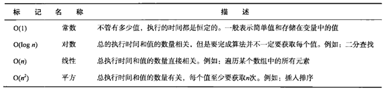

常数值，即`O(1)`，指代字面值和存储在变量中的值。符号`O(1)`表示无论有多少个值，需要获取常量值的时间都一样。获取常量值是非常高效的过程：

```javascript
var value = 5;
var sum = 10 + value;
console.log(sum);
```

该代码进行了四次常量值查找：数字`5`，变量`value`，数字`10`和变量`sum`。这段代码的整体复杂度被认为是`O(1)`。

在JavaScript中访问数组元素也是一个`O(1)`操作，和简单的变量查找效率一样。所以下列代码和前面例子效率一样：

```javascript
var value = [5, 10];
var sum = value[0] + value[1];
console.log(sum);
```

使用变量和数组要比访问对象上的属性更有效率，后者是一个`O(n)`操作。对象上的任何属性查找都要比访问变量或者数组花费更长时间，因为必须在原型链中对拥有该名称的属性进行一次搜索。简而言之，属性查找越多，执行时间就越长：

```javascript
var value = { first: 5, second: 10};
var sum = value.first + value.second;
console.log(sum);
```

这段代码使用两次属性查找来计算`sum`值。如果进行成百上千次则肯定会减慢执行速度。

注意获取单个值的多重属性查找：

```javascript
var query = window.location.href.substring(window.location.href.indexOf('?'));
```

这段代码有6次属性查找：`window.location.href.substring()`有3次，`window.location.href.indexOf()`有3次。只要数一数代码中点的数量，就可以确定属性查找的次数。

一旦多次用到对象属性，应该将其存储在局部变量中。第一次访问值会是`O(n)`，然而后续都会是`O(1)`，就会节省很多：

```javascript
var url = window.location.href;
var query = url.substring(url.indexOf('?'));
```

一般来讲，只要能减少算法的复杂度，就要尽可能减少。尽可能多地使用局部变量将属性查找替换为值查找。进一步讲，如果既可以用数字化的数组位置进行访问，也可以使用命名属性。那么使用数字位置。

##### 优化循环

由于循环会反复运行同一段代码，从而自动增加执行时间。一个循环的基本优化步骤如下所示：

1. 减值迭代：大多数循环使用一个从`0`开始、增加到某个特定值的迭代器。在很多情况下，从最大值开始，在循环中不断减值的迭代器更加高效
2. 简化终止条件：由于每次循环过程都会计算终止条件，所以必须保证它尽可能快。也就是说避免属性查找或其他`O(n)`的操作
3. 简化循环体：循环体是执行最多的，所以要最大限度地优化。确保没有某些可以被很容易移出循环的密集计算
4. 使用后测试循环：最常用`for`循环和`while`循环都是前测试循环，而`do-while`是后测试循环，可以避免最初终止条件的计算，因此运行更快

```javascript
for (var i = 0; i < value.length; i++) {
  process(value[i]);
}
```

假设值的处理顺序无关紧要，那么循环可以改为`i`减值：

```javascript
for (var i = value.length - 1; i >= 0; i--) {
  process(value[i]);
}
```

变量`i`每次循环后都会减`1`。在这个过程中，将终止条件从`value.length`的`O(n)`调用简化成了`0`的`O(1)`调用。由于循环体只有一个语句，无法进一步优化。不过循环还能改成后测试循环：

```javascript
var i = value.length - 1;
if (i > -1) {
  do {
    process(value[i]);
  } while (--i >= 0);
}
```

此时终止条件和自减操作符组合成了单个语句。

使用后测试循环时必须确保要处理的值至少有一个。空数组会导致多余的一次循环而前测试循环则可以避免

##### 展开循环

当循环的次数是确定的，消除循环并使用多次函数调用往往更快：

```javascript
// 消除循环
process(value[0]);
process(value[1]);
process(value[2]);
```

如果循环中迭代次数不能事先确定，可以考虑`Duff`装置的技术。`Duff`装置的基本概念是通过计算迭代的次数是否为8的倍数将一个循环展开为一系列语句：

```javascript
// 假设 values.length > 0
var iterations = Math.ceil(values.length / 8);
var startAt = values.length % 8;
var i = 0;

do {
  switch (startAt) {
    case 0 : process(values[i++]);
    case 7 : process(values[i++]);
    case 6 : process(values[i++]);
    case 5 : process(values[i++]);
    case 4 : process(values[i++]);
    case 3 : process(values[i++]);
    case 2 : process(values[i++]);
    case 1 : process(values[i++]);
  }
  startAt = 0;
} while (--iterations > 0);
```

`Duff`装置的实现是通过将`values`数组中元素个数除以8来计算出循环需要进行多少次迭代。然后使用取整的上限函数确保结果是整数。如果完全根据除8来进行迭代，可能会有一些不能被处理到的元素，这个数量保存在`startAt`变量中，首次执行该循环时，会检查`startAt`变量看有需要多少额外调用。例如，如果数组中有10个值，`startAt`则等于`2`，那么最开始的时候`process()`则只会被调用2次（执行case 2 和case 1）。在接下来的循环中，`startAt`被重置为`0`，这样之后的每次循环都会调用8次`process()`。展开循环可以提升大数据集的处理速度。

还有一个更快的`Duff`装置技术，将`do-while`循环分成2个单独循环：

```javascript
var iterations = Math.floor(values.length / 8);
var leftover = values.length % 8;
var i = 0;

if (leftover > 0 ) {
  do {
    process(values[i++]);
  } while (--leftover > 0); 
}
do {
  process(values[i++]);
  process(values[i++]);
  process(values[i++]);
  process(values[i++]);
  process(values[i++]);
  process(values[i++]);
  process(values[i++]);
  process(values[i++]);
  process(values[i++]);
} while (--iterations > 0);
```

在这个实现中，剩余的计算部分不会再实际循环中处理，而是在一个初始化循环中进行除以8的操作。但处理掉额外的元素，继续执行每次调用8次`process()`的主循环。这个方法几乎比原始的`Duff`装置实现快40%。

针对大数据集使用展开循环可以节省很多时间，但对于小数据集，额外的开销则可能得不偿失。它要花更多代码来完成相同的任务，如果处理的不是大数据集，一般来说并不值得。

##### 避免双重解释

JavaScript代码想解析JavaScript的时候会存在双重解释惩罚。当使用`eval()`函数或者是`Function`构造函数以及使用`setTimeout()`传一个字符串参数时都会发生这种情况：

```javascript
// 某些代码求值--避免
eval('alert("hello")');

// 创建新函数--避免
var sayHi = new Function('alert("hello")');

// 设置超时--避免
setTimeout('alert("hello")', 500);
```

解析包含JavaScript代码的字符串是不能在初始的解析过程中完成的，因为代码是博爱饭在字符串中，也就是说JavaScript代码运行的同时必须新启动一个解析器来解析新的代码。实例化一个新的解析器有不容忽视的开销，所以这种代码要比直接解析慢得多。

```javascript
// 已修正
alert('hello');

// 创建新函数--已修正
var sayHi = function () {
  alert('hello');
};

// 设置一个超时--已修正
setTimeout(function () {
  alert('hello');
}, 500);
```

##### 性能的其他注意事项

* 原生方法比较快：只要有可能，使用原生方法而不是自己用JavaScript重写一个。JavaScript中最容易被忘记的就是可以在`Math`对象中找到复杂的数学运算；这些方法要比任何用JavaScript写的同样方法如正弦、余弦快得多
* Switch语句较快：如果有一些列复杂的`if-else`语句，可以转换成单个`switch`语句则可以得到更快的代码。还可以通过将`case`语句按照最可能的到最不可能的顺序进行组织，来进一步优化`switch`语句
* 位运算较快：当进行数学运算的时候，位运算操作要比任何布尔运算或者算术运算快。选择性地用位运算替换算数运算可以极大提升计算的性能，诸如取模，逻辑与和逻辑或都可以考虑用位运算来替换

#### 最小化语句数

JavaScript代码中的语句数量也影响所执行的操作速度。完成多个操作的单个语句要比完成单个操作的多个语句快。所以，要找出可以组合在一起的语句，以减少脚本整体的执行的时间。

##### 多个变量声明

```javascript
// 4个语句---很浪费
var count = 5;
var color = 'blue';
var values = [1, 2, 3];
var now = new Date();
```

在强类型语言中，不同的数据类型的变量必须在不同的语句中声明。然而在JavaScript中所有的变量都可以使用单个`var`语句来声明：

```javascript
// 一个语句
var count = 5,
    color = 'blue', 
    values = [1, 2, 3],
    now = new Date();
```

大多数情况下这种优化很容易做，并且要比单个变量分别声明快得多。

##### 插入迭代值

当使用迭代值（也就是在不同的位置进行增加或减少的值）的时候，尽可能合并语句：

```javascript
var name = values[i];
i++;

/********修改后*********/

var name = values[i++];
```

##### 使用数组和对象字面量

使用构造函数或使用字面量都是可以创建数组和对象的方法。使用构造函数总是要用到更多的语句来插入元素或定义属性，而字面量可以将这些操作在一个语句中完成：

```javascript
// 4个语句创建和初始化数组---浪费
var values = new Array();
values[0] = 123;
values[1] = 456;
values[2] = 789;

// 用4个语句创建和初始化对象--浪费
var person = new Object();
person.name = 'tc';
person.age = 28;
person.sayName = function () {
  alert(this.name);
};

/*************修改后****************/

// 只用一条语句创建和初始化数组
var values = [123, 456, 789];

// 只用一条语句创建和初始化对象
var person = {
  name: 'tc',
  age: 28,
  sayName: function () {
    alert(this.name);
  }
};
```

只要可能，尽量使用数组和对象的字面量表达式方式来消除不必要的语句。

#### 优化DOM交互

在JavaScript各个方面中，DOM是最慢的一部分。DOM操作与交互要消耗大量时间，因为需要重新渲染整个页面或者某一部分。

##### 最小化现场更新

一旦需要访问的DOM部分是已经显示的页面的一部分，那么就是在进行一个现场更新。每一个更改都有一个性能惩罚。现场更新越多，代码完成执行所花的时间就越长：

```javascript
var list = document.getElementById('myList'),
    item,
    i;

for (i = 0; i < 10; i++) {
  item = document.createElement('li');
  list.appendChild(item);
  item.appendChild(document.createTextNode('Item ' + i));
}
```

这个操作共要完成20个现场更新。

要修正这个性能瓶颈，需要减少现场更新的数量。可以使用文档碎片来构建DOM结构，接着将其添加到`List`元素中。这个方式避免了现场更新和页面闪烁问题：

```javascript
var list = document.getElementById('myList'),
    fragment = document.createDocumentFragment(),
    item,
    i;

for (i = 0; i < 10; i++) {
  item = document.createElement('li');
  fragment.appendChild(item);
  item.appendChild(document.createTextNode('Item '+ i));
}

list.appendChild(fragment);
```

文档碎片用作一个临时的占位符，放置新创建的项目。当`appendChild()`传入文档碎片时，只有碎片中的子节点被添加到目标，碎片本身不会被添加的。

##### 使用innerHTML

对于大的DOM更改，使用`innerHTML`要比标准DOM方法创建同样的DOM结构快。

当把`innerHTML`设置为某个值，后台会创建一个HTML解析器，然后使用内部的DOM调用来创建DOM结构，而非基于JavaScript的DOM调用。由于内部方法是编译好的而非解释执行，所以执行快得多：

```javascript
var list = document.getElementById('myList'),
    html = '',
    i;

for (i = 0; i < 10; i++) {
  html += '<li>Item ' + i + '</li>';
}

list.innerHTML = html;
```

在使用`innerHTML`的关键在于最小化调用它的次数：

```javascript
var list = document.getElementById('myList'),
    i;

for (i = 0; i < 10; i++) {
  list.innerHTML += '<li>Item ' + i + '</li>';    // 避免
}
```

##### 使用事件代理

页面上的事件处理程序的数量和页面响应用户交互的速度之间有个负相关。为了减轻这种惩罚，最好使用事件代理。

##### 注意HTMLCollection

HTMLCollection对于Web应用的性能是巨大的损害。任何时候要访问HTMLCollection，都是在文档上进行查询，这个查询开销很昂贵。最小化访问HTMLCollection的次数可以极大地改进脚本的性能。

```javascript
var images = document.getElementsByTagName('img'),
    i, len;

for (i = 0, len = images.length; i < len; i++) {
  // 处理
}

/************修改后***************/

var images = document.getElementsByTagName('img'),
    image,
    i, len;

for (i = 0, len = images.length; i < len; i++) {
  image = images[i];
  // 处理
}
```

编写JavaScript时，一定要知道何时返回HTMLCollection对象，这样就可以最小化访问。一下情况会返回HTMLCollection对象：

* 进行对`getElementsByTagName()`的调用
* 获取了元素的`childNodes`属性
* 获取元素的`attributes`属性
* 访问了特殊的集合，如`document.forms`、`document.images`等

### 部署

#### 构建过程

写的代码不应该原封不动地放入浏览器中，因为：

* 知识产权问题：如果把带有完整注释的代码放到线上，别人就更容易知道你的意图，对它再利用，并且可能找到安全漏洞
* 文件大小：书写代码要保证容易阅读，才能更好地维护，但是对于性能不利
* 代码组织：组织代码要考虑到可维护性并不一定是传送给浏览器的最好方式

基于这些原因，最好给JavaScript定义一个构建过程。

构建过程始于在源控制中定义用于存储文件的逻辑结构。最好避免使用一个文件存放所有JavaScript，遵循以下面向对象语言中的典型模式：将每个对象或自定义类型分别放入其单独的文件中。这样可以确保每个文件包含最少量的代码，使其在不引入错误的情况下更容易修改。

将代码分离成多个文件只是为了提高可维护性，并非为了部署。要进行部署的时候，需要将这些源码合并为一个或几个归并文件。推荐Web应用中尽可能使用最少的JavaScript文件。通过`<script>`标记引用JavaScript文件是一个阻塞操作，当代码下载并运行的时候会停止其他所有的下载。

一旦组织好文件和目录结构，并确定哪些要出现在部署文件中，就可以创建构件系统了。

#### 验证

JSLint可以查找JavaScript代码中的语法错误以及常见的编码错误。

给开发周期添加代码验证有助于避免将来可能出现的一些错误。

#### 压缩

当谈及JavaScript文件压缩，其实在讨论两个东西：代码长度和配重（Write weight）。代码长度指的是浏览器所需要解析的字节数，配重指的是实际从服务器传送到浏览器的字节数。在今天的Web上，这两者很少相等，实际上也不应相等。

##### 文件压缩

可以使用压缩工具减少文件大小。

压缩器一般进行如下一些步骤：

* 删除额外的空白（包括换行）
* 删除所有注释
* 缩短变量名

##### HTTP压缩

所有的浏览器都支持对接收的资源进行客户端压缩。这样服务器端就可以使用服务器端相关功能来压缩JavaScript文件。一个指定了文件使用了给定格式进行了压缩的HTTP头包含在了服务器相应中。接着浏览器会查看该HTTP头确定文件是否已被压缩，然后使用合适的格式进行解压缩。结果是和原来代码量相比在网络传递的字节量大大减少。

对于Apache Web服务器，有两个模块可以进行HTTP压缩：`mod_gzip`（Apache1.3.x）和`mod_deflate`（Apache2.0.x）。对于`mod_gzip`，可以给`httpd.conf`文件或者是`.htaccess`文件添加下面代码启动对JavaScript的自动压缩：

```nginx
# 告诉mod_gzip要包含任何以.js结尾的文件
mod_gzip_item_include		file		\.js$
```

对于`mod_defate`可以添加类似代码：

```nginx
# 告诉mod_defate要包含任何以.js结尾的文件
AddOutputFilterByType DEFLATE application/x-javascript
```

减少文件的配重可以减少需要传输到浏览器的时间。


## 新兴的API

### requestAnimationFrame()

#### 早期动画循环

在JavaScript中创建动画的典型方式，就是使用`setInterval()`方法来控制所有动画：

```javascript
(function () {
  function updateAnimations() {
    doAnimation1();
    doAnimation2();
    // 其他动画
  }

  setInterval(updateAnimations, 100);
})();
```

为了创建一个小型动画库，`updateAnimations()`方法就得不断循环地运行每个动画，并相应地改变不同元素的状态。

编写这种动画循环的关键是要知道延迟时间多长合适。循环间隔必须足够短，这样才能让不同的动画效果显得更平滑顺畅；另一方面，循环间隔还要足够长，这样才能确保浏览器有能力渲染产生的变化。大多数电脑显示器的刷新频率是60Hz，大概相当于每秒重绘60次。大多数浏览器都会对重绘操作加以限制，不超过显示器的重绘频率，因为即使超过那个频率用户体验也不会提升。

因此，最平滑动画的最佳循环间隔是`1000ms/60`，约等于17ms。为了适应17ms的循环间隔，多重动画可能需要加以节制，以便不会完成得太快。

虽然与使用多组`setTimeout()`的循环方式相比，使用`setInterval()`的动画循环效率更高。无论使用`setInterval()`还是`setTimeout()`都不十分精确。为它们传入的第二个参数，实际上只是指定了动画代码添加到浏览器UI线程队列中以等待执行的时间。如果队列前面已经加入了其他任务，那动画代码就要等到前面任务完成之后再执行。如果UI线程繁忙，即使把代码加入队列也不会立即执行。

#### 循环间隔的问题

知道什么时候绘制下一帧是保证动画平滑的关键。

浏览器使用的计时器的精度也会进一步恶化问题。浏览器使用的计时器并非精确到毫秒级别：

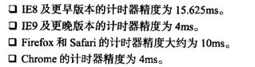

#### mozRequestAnimationFrame

`mozRequestAnimationFrame()`告诉浏览器某些JavaScript代码将要执行动画。这样浏览器可以在运行某些代码后进行适当优化。

`mozRequestAnimationFrame()`方法接收一个参数，即在重绘屏幕前调用的一个函数。这个函数负责改变下一次重绘时的DOM样式。为了创建动画循环，可以像`setTimeout()`一样，把多个对`mozRequestAnimationFrame()`的调用连缀起来：

```javascript
function updateProgress() {
  var div = document.getElementById('status');
  div.style.width = (parseInt(div.style.width, 10) + 5) + '%';

  if (div.style.left != '100%') {
    mozRequestAnimationFrame(updateProgress);
  }
}

mozRequestAnimationFrame(updateProgress);
```

因为`mozRequestAnimationFrame()`只运行一次传入的函数，因此在需要再次修改UI从而生成动画时，需要再次手工调用它。同样，也需要同时考虑什么时候停止动画。这样就能得到非常平滑顺畅的动画。

`mozRequestAnimationFrame()`解决了浏览器不知道JavaScript动画什么时候开始、不知道最佳循环间隔时间的问题，但不知道代码到底什么时候执行的问题呢？同样的方案也可以解决这个问题。

传递的`mozRequestAnimationFrame()`函数也会接收一个参数，它是一个时间码（从1970年1月1日起至今的毫秒数），表示下一次重绘的实际发生时间。`mozRequestAnimationFram()`会根据这个时间码设定将来的某个时刻进行重绘，而根据这个时间码，也能知道那个时刻是什么时间。然后，再优化动画效果就有了依据。

要知道距上次重绘已经过去了多长时间，可以查询`mozAnimationStartTime`，其中包含上一次重绘的时间码。用传入回调函数的时间码减去这个时间码，就能计算出在屏幕上重绘下一组变化之前要经过多长时间：

```javascript
function draw(timestamp) {
  // 计算两次重绘的时间间隔
  var diff = timestamp - startTime;

  // 使用diff确定下一步的绘制时间

  // 把startTime重写为这一次的重绘时间
  startTime = timestamp;

  // 重绘UI
  mozRequestAnimationFrame(draw);
}

var startTime = mozAnimationStartTime;
mozRequestAnimationFrame(draw);
```

第一次读取`mozAnimationStartTime`的值必须在传递给`mozRequestAnimationFrame()`的回调函数外面进行。如果是在回调函数内部读取`mozAnimationStartTime`，得到的值与传入的时间码是相等的。

#### webkitRequestAnimationFrame与msRequestAnimationFrame

Chrome和IE10+也都分别实现了`webkitRequestAnimationFrame()`和`msRequestAnimationFrame()`。和`mozRequestAnimationFrame()`相比，它们不会给回调函数传递时间码，因此，无法知道下一次重绘将发生在什么时间。其次，Chrome又增加了第二个可选的参数，即将要发生变化的DOM元素。知道了重绘将发生在页面中哪个特定元素的区域内，就可以将重绘限定在该区域中。

Chrome提供了一个`webkitCancelAnimationFrame()`，用于取消之前计划执行的重绘操作。

```javascript
(function () {
  function draw(timestamp) {
    // 计算两次重绘时间间隔
    var drawStart = (timestamp || Date.now()),
        diff = drawStart - startTime;

    // 使用diff确定下一步的绘制时间

    // 把startTime重写为这一次的绘制时间
    startTime = drawStart;

    // 重绘UI
    requestAnimationFrame(draw);
  }

  var requestAnimationFrame = window.requestAnimationFrame || window.mozRequestAnimationFrame || window.webkitRequestAnimationFrame || window.msRequestAnimationFrame,
      startTime = window.mozAnimationStartTime || Date.now();
  requestAnimationFrame(draw);
})();
```

### Page Visibility API

Page Visibility API 就是为了让开发人员知道页面是否对用户可见而推出的。它由下面三部分组成：

* `document.hidden`：表示页面是否隐藏的布尔值。页面隐藏包括页面在后台标签中或者浏览器最小化
* `document.visibilityState`：表示下列4个可能状态：
  * 页面在后台标签页中或浏览器最小化
  * 页面在前台标签页中
  * 实际的页面已经隐藏，但用户可以看到页面的预览
  * 页面在屏幕外执行预渲染处理
* `visibilitychange`事件：当文档从可见变为不可见或从不可见变为可见时，触发该事件

检测是否支持这个API的最佳方式如下：

```javascript
function isHiddenSupported() {
  return typeof (document.hidden || document.msHidden || document.webkitHidden) != 'undefined';
}
```

类似地，使用同样的模式可以检测页面是否隐藏：

```javascript
if (document.hidden || document.msHidden || document.webkitHidden) {
  // 页面隐藏了
} else {
  // 页面未隐藏
}
```

为了在页面从可见变为不可见或从不可见变为可见时收到通知，可以侦听`visibilitychange`事件：

```javascript
function handleVisibilityChange() {
  var output = document.getElementById('output'),
      msg;

  if (document.hidden || document.msHidden || document.webkitHidden) {
    msg = 'page is now hidden. ' + (new Date()) + '<br>';
  } else {
    msg = 'page is now visible. ' + (new Date()) + '<br>';
  }

  output.innerHTML += msg;
}

// 要为两个事件都指定事件处理程序
EventUtil.addHandler(document, 'msVisibilitychange', handleVisibilityChange);

EventUtil.addHandler(document, 'webkitvisibiltychange', handleVisibilityChange);
```

### Geolocation API

通过Geolocation API，JavaScript代码能够访问到用户的当前位置信息。当然访问之前必须得到用户的明确许可。

Geolocation API在浏览器中的实现是`navigator.geolocation`对象，这个对象包含3个方法。第一个方法是`getCurrentPosition()`，调用这个方法就会触发请求用户共享地理位置信息的对话框。这个方法接收3个参数：成功回调函数、可选的失败回调函数和可选的选项对象。

其中，成功回调函数会接收到一个`Position`对象参数，该对象有两个属性：`coords`和`timestamp`。而`coords`对象中将包含下列与位置相关的信息：

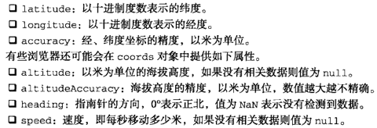

`latitude`和`longitude`是大多数web应用最常用到的属性：

```javascript
navigator.geolocation.getCurrentPosition(function (position) {
  drawMapCenterrdAt(position.coords.latitude, position.coords.longitude);
});
```

`getCurrentPosition()`的第二个参数，即失败回调函数，在被调用的时候也会接收到一个参数。这个参数是一个对象，包含两个属性：`message`和`code`。其中，`message`属性中保存着给人看的文本消息，解释为什么会出错，而`code`属性中保存着一个数值，表示错误的类型：用户拒绝共享`(1)`、位置无效`(2)`或者超时`(3)`。

```javascript
navigator.geolocation.getCurrentPosition(function (position) {
  drawMapCenterrdAt(position.coords.latitude, position.coords.longitude);
}, function (error) {
  console.log('Error code: ' + error.code);
  console.log('Error message: ' + error.message);
});
```

`getCurrentPosition()`的第三个参数是一个选项对象，用于设定信息的类型。可以设置的选项有三个：`enableHighAccuracy`是一个布尔值，表示必须尽可能使用最准确的位置信息；`timeout`是以毫秒数表示的等待位置信息的最长时间；`maximumAge`表示上一次取得坐标信息的有效时间，以毫秒表示，如果时间到则重新取得新坐标信息：

```javascript
navigator.geolocation.getCurrentPosition(function (position) {
  drawMapCenterrdAt(position.coords.latitude, position.coords.longitude);
}, function (error) {
  console.log('Error code: ' + error.code);
  console.log('Error message: ' + error.message);
}, {
  enableHighAccuracy: true,
  timeout: 5000,
  maximumAge: 25000
});
```

这三个选项时可选的，可以单独设置，也可以与其他选项一起设置。除非确实需要非常精确的信息，否则建议保持`enableHighAccuracy`的`false`值（默认值）。将这个选项设置为`true`需要更长的时候，而且在移动设备上还会导致消耗更多电量。如果不需要频繁更新用户位置信息，可以将`maximumAge`设置为`Infinity`，从而始终都使用上一次的坐标信息。

如果希望跟踪用户的位置，可以使用`watchPosition()`。这个方法接收的参数与`getCurrentPosition()`方法完全相同。实际上，`watchPosition()`与定时调用`getCurrentPosition()`的效果相同。在第一次调用`watchPosition()`方法后，会取得当前位置，执行成功回调或者错误回调，然后，`watchPosition()`就地等待系统发出位置已改变的信号。

调用`watchPosition()`会返回一个数值标识符，用于跟踪监控的操作。基于这个返回值可以取消监控操作，只要将其传递给`clearWatch()`方法即可：

```javascript
var watchId = navigator.geolocation.watchPosition(function (position) {
  drawMapCenterrdAt(position.coords.latitude, position.coords.longitude);
}, function (error) {
  console.log('Error code: ' + error.code);
  console.log('Error message: ' + error.message);
});

clearWatch(watchId);
```

### File API

HTML5在DOM中为文件输入元素添加了一个`files`集合。在通过文件输入字段选择了一或多个文件时，`files`集合中将包含一组File对象，每个File对象对应着一个文件。每个File对象都有下列只读属性：

* `name`：本地文件系统中的文件名
* `size`：文件的字节大小
* `type`：字符串，文件的MIME类型
* `lastModifiedDate`：字符串，文件上一次被修改的时间

```javascript
var filesList = document.getElementById('files-list');
EventUtil.addHandler(filesList, 'change', function (event) {
  var files = EventUtil.getTarget(event).files,
      i = 0,
      len = files.length;

  while (i < len) {
    console.log(files[i].name + ' (' + files[i].type + ', ' + files[i].size + ' bytes)');
    i++;
  }
});
```

#### FileReader类型

FileReader类型实现的是一种异步文件读取机制。可以把FileReader想象成XMLHTTPRequest，区别只是它读取的是文件系统。FileReader提供了如下几个方法：

* `readAsText(file, encoding)`：以纯文本形式读取文件，将读取的文本保存在`result`属性中。第二个参数用于指定编码类型，是可选的
* `readAsDataURL(file)`：读取文件并将文件以数据URI的形式保存在`result`属性中
* `readAsBinaryString(file)`：读取文件并将一个字符串保存在`result`属性中，字符串中的每个字符表示一字节
* `readAsArrayBuffer(file)`：读取文件并将一个包含文件内容的`ArrayBuffer`保存在`result`属性中

由于读取过程是异步的，因此FileReader也提供了几个事件，其中最有用的三个事件时`progress`、`error`和`load`，分别表示是否读取了新数据、是否发生了错误以及是否已经读完整个文件。

每过50ms就会触发一次`progress`事件，通过事件对象可以获得与XHR的`progress`事件相同的信息（属性）：`lengthComputable`、`loaded`和`total`。另外，尽可能没有包含全部数据，但每次`progress`事件中都可以通过FileReader的`result`属性读取到文件内容。

由于种种原因无法读取文件，就会触发`error`事件。触发`error`事件时，相关的信息将保存到FileReader的`error`属性中。这个属性中将保存一个对象，该对象只有一个属性`code`，即错误码。这个错误码是`1`表示未找到文件，`2`表示安全性错误，`3`表示读取中断，`4`表示文件不可读，`5`表示编码错误。

文件加载成功后会触发`laod`事件；如果发生了`error`事件，就不会发生`load`事件。

```javascript
var filesList = document.getElementById('files-list');
EventUtil.addHandler(filesList, 'change', function (event) {
  var info = '',
      output = document.getElementById('output'),
      progress = document.getElementById('progress'),
      files = EventUtil.getTarget(event).files,
      type = 'default',
      reader = new FileReader();

  if (/image/.test(files[0]).type) {
    reader.readAsDataURL(files[0]);
    type = 'image';
  } else {
    reader.readAsText(files[0]);
    type = 'text';
  }

  reader.onerror = function () {
    output.innerHTML = 'could not read file, error code is ' + reader.error.code;
  };

  reader.onprogress = function (event) {
    if (event.lengthComputable) {
      progress.innerHTML = event.loaded + '/' + event.total;
    }
  };

  reader.onload = function () {
    var html = '';

    switch (type) {
      case 'image' :
        html = '';
        break;
      case 'text' :
        html = reader.result;
        break;
    }
    output.innerHTML = html;
  };
});
```

如果想中断读取过程，可以调用`abort()`方法，这样就会触发`abort`事件。在触发`load`、`error`或`abort`事件后，会触发另一个事件`loadend`。`loadend`事件发生意味着已经读取完整的文件，或者读取时发生错误，或者读取过程被中断。

#### 读取部分内容

File对象还支持一个`slice()`方法，`slice()`方法接收两个参数：起始字节及要读取的字节数。这个方法返回一个Blob的实例，Blob是File类型的父类型。

```javascript
function blobSlice(blob, startByte, length) {
  if (blob.slice) {
    return blob.slice(startByte, length);
  } else if (blob.webkitSlice) {
    return blob.webkitSlice(startByte, length);
  } else if (blob.mozSlice) {
    return blob.mozSlice(startByte, length);
  } else {
    return null;
  }
}
```

Blob类型有一个`size`属性和一个`type`属性，而且它也支持`slice()`方法，以便进一步切割数据。通过FileReader也可以从Blob中读取数据：

```javascript
var filesList = document.getElementById('files-list');
EventUtil.addHandler(filesList, 'change', function (event) {
  var info = '',
      output = document.getElementById('output'),
      progress = document.getElementById('progress'),
      files = EventUtil.getTarget(event).files,
      reader = new FileReader(),
      blob = blobSlice(files[0], 0, 32);

  if (blob) {
    reader.readAsText(blob);

    reader.onerror = function () {
      output.innerHTML = 'could not read file, error code is ' + reader.error.code;
    };

    reader.onload = function () {
      output.innerHTML = reader.result;
    };
  } else {
    alert("your browser doesn't support slice().");
  }
});
```

#### 对象URL

对象URL也被称为blobURL，指的是引用保存在File或Blob中数据的URL。使用对象URL的好处是可以不必把文件内容读取到JavaScript中而直接使用文件内容。为此，只要在需要文件内容的地方提供对象URL即可。要创建对象URL，可以使用`window.URL.createObjectURL()`方法，并传入File或Blob对象。

```javascript
function createObjectURL(blob) {
  if (window.URL) {
    return window.URL.createObjectURL(blob);
  } else if (window.webkitURL) {
    return window.webkitURL.createObjectURL(blob);
  } else {
    return null;
  }
}

var filesList = document.getElementById('files-list');
EventUtil.addHandler(filesList, 'change', function (event) {
  var info = '',
      output = document.getElementById('output'),
      progress = document.getElementById('progress'),
      files = EventUtil.getTarget(event).files,
      reader = new FileReader(),
      url = createObjectURL(files[0]);

  if (url) {
    if (/image/.test(files[0].type)) {
      output.innerHTML = '';
    } else {
      output.innerHTML = 'not an image. ';
    }
  } else {
    output.innerHTML = "your browser doesn\'t support object URLs."
  }
});
```

如果不再需要相应的数据，最好释放它占用的内容。但只要有代码在引用对象URL，内存就不会释放。要手工释放内存，可以把对象URL传给`window.URL.revokeObjectURL()`。

页面卸载时会自动释放对象URL占用的内存。不过，为了确保尽可能少地占用内存，最好在不需要某个对象URL时，就马上手工释放其占用的内存。

#### 读取拖放的文件

在页面上创建了自定义的放置目标后，可以从桌面上把文件拖放到该目标。与拖放一张图片或者一个链接类似，从桌面上把文件拖放到浏览器中也会触发drop事件。而且可以在`event.dataTransfer.files`中读取到被放置的文件，当然此时它是一个File对象，与通过文件输入字段取得的File对象一样。

```javascript
var droptarget = document.getElementById('droptarget');

function handleEvent(event) {
  var info = '',
      output = document.getElementById('output'),
      files, i, len;

  EventUtil.preventDefault(event);

  if (event.type == 'drop') {
    files = event.dateTransfer.files;
    i = 0;
    len = files.length;

    while (i < len) {
      info += files[i].name + " (" + files[i].type + ', ' + files[i].size + 'bytes)<br>';
      i++;
    }

    output.innerHTML = info;
  }
}

EventUtil.addHandler(droptarget, 'dragenter', handleEvent);
EventUtil.addHandler(droptarget, 'dragover', handleEvent);
EventUtil.addHandler(droptarget, 'drop', handleEvent);
```

在drop事件中，可以通过`event.dataTransfer.files`读取文件信息。

#### 使用XHR上传文件

通过File API能够访问到文件内容，利用这点就可以通过XHR直接把文件上传到服务器。更好的做法是以表单提交的方式来上传文件。

这样使用FormData类型就很容易做到。首先要创建一个FormData对象，通过它调用`append()`方法并传入相应的File对象作为参数。然后，再把FormData对象传递给XHR的`send()`方法，结果与通过表单上传一模一样。

```javascript
var droptarget = document.getElementById('droptarget');

function handleEvent(event) {
  var info = '',
      output = document.getElementById('output'),
      files, i, len;

  EventUtil.preventDefault(event);

  if (event.type == 'drop') {
    data = new FormData();
    files = event.dateTransfer.files;
    i = 0;
    len = files.length;

    while (i < len) {
      data.append('file' + i, files[i]);
      i++;
    }

    xhr = new XMLHttpRequest();
    xhr.open('post', 'FileAPIExample06Upload.php', true);
    xhr.onreadystatechange = function () {
      if (xhr.readyState == 4) {
        console.log(xhr.responseText);
      }
    };
    xhr.send(data);
  }
}

EventUtil.addHandler(droptarget, 'dragenter', handleEvent);
EventUtil.addHandler(droptarget, 'dragover', handleEvent);
EventUtil.addHandler(droptarget, 'drop', handleEvent);
```

使用FormData上传文件，在服务端就好像接收到了常规的表单数据一样，一切按部就班地处理即可。

### Web计时

Web Timing API让开发者通过JavaScript就能使用浏览器内部的性能度量结果，通过直接读取这些信息可以做任何想做的分析。

Web计时机制的核心是`window.performance`对象。对页面的所有度量信息，都包含在这个对象里面。

`performance.navigation`属性是一个对象，包含与页面导航有关的多个属性：

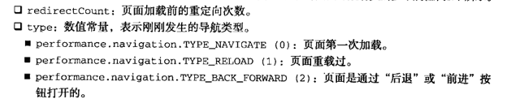

`performance.timing`属性也是一个对象，但这个对象的属性都是时间戳，不同事件会产生不同的时间值：

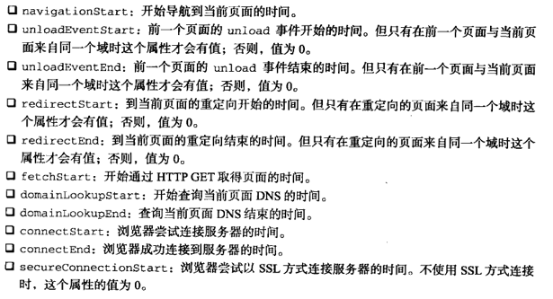

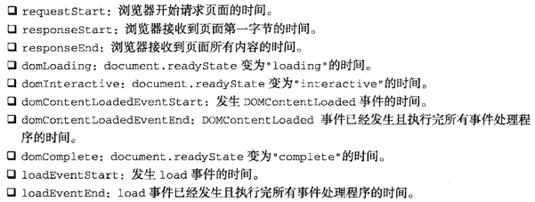

### Web Workers

长时间运行的JavaScript进程会导致浏览器冻结用户界面，让人感觉屏幕冻结了。Web Workers规范让JavaScript在后台运行解决了这个问题。

#### 使用Worker

实例化Worker对象并传入要执行的JavaScript文件名就可以创建一个新的Web Worker：

```javascript
var worker = new Worker('stufftodo.js');
```

这行代码会导致浏览器下载`stufftodo.js`，但只有Worker接收到消息才会实际执行文件中的代码。要给Worker传递消息，可以使用`postMessage()`方法：

```javascript
worker.postMessage('start! ');
```

消息内容可以是任何能够被序列化的值，不过与XDM（跨文档消息传送）不同的是，在所有支持的浏览器中，`postMessage()`都能接收对象参数。因此，可以随便传递任何形式的对象数据：

````javascript
worker.postMessage({
  type: 'command',
  message: 'start!'
});
````

一般来说，可以序列化为JSON结构的任何值都可以作为参数传递给`postMessage()`。这就意味着传入的值是被复制到Worker中，而非直接传过去的。

Worker是通过`message`和`error`事件与页面通信的。这里的`message`事件与XDM中的`message`事件行为相同，来自Worker的数据保存在`event.data`中。Worker返回的数据也可以是任何能够被序列化的值：

```javascript
worker.onmessage = function (event) {
  var data = event.data;

  // 对数据进行处理
}
```

Worker不能完成给定的任务时会触发`error`事件。具体来说，Worker内部的JavaScript在执行过程中只要遇到错误，就会触发`error`事件。发生`error`事件时，事件对象中包含三个属性：`filename`、`lineno`和`message`，分别表示发生错误的文件名、代码行号和完整的错误信息。

```javascript
worker.onerror = function (event) {
  console.log('error: ' + event.filename + ' (' + event.lineno + '); ' + event.message);
};
```

建议始终要使用`onerror`事件处理程序，否则，Worker就会在发生错误时，悄无声息地失败了。

任何时候，只要调用`terminate()`方法就可以停止Worker的工作。而且，Worker中的代码就会立即停止执行，后续的所有过程都不会再发生（包括`error`和`message`事件也不会再触发）。

```javascript
worker.terminate();     // 立即停止Worker的工作
```

#### Worker全局作用域

关于Web Worker，最重要的是要知道它所执行的JavaScript代码完全在另一个作用域中，与当前网页中的代码不共享作用域。在Web Worker中，同样忧郁哥全局对象和其他对象以及方法。但在Web Worker中的代码不能访问DOM，也无法通过任何方式影响页面的外观。

Web Worker中的全局对象是worker对象本事，也就是说，在这个特殊的全局作用域中，`this`和`self`引用的都是worker对象。为了便于处理数据，Web Worker本身也是一个最小化的运行环境。

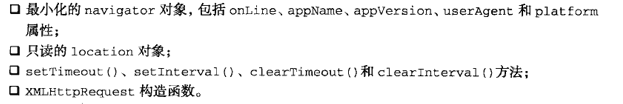

显然，和页面环境相比，功能是相当有限的。

当页面在Worker对象上调用`postMessage()`时，数据会以异步方式被传递给worker，进而触发worker中的`message`事件。为了处理来自页面的数据，同样也需要创建一个`onmessage`事件处理程序。

```javascript
// web worker 内部的代码
self.onmessage = function (event) {
  var data = event.data;

  // 处理数据
};
```

Worker完成工作以后，通过调用`postMessage()`可以把数据再发回页面：

```javascript
// web worker 内部的代码
self.onmessage = function (event) {
  var data = event.data;

  // 别忘了，默认的sort()方法只比较字符串
  data.sort(function (a, b) {
    return a - b;
  });
  self.postMessage(data);
};
```

传递消息就是页面与Worker相互之间通信的方式。在Worker中调用`postMessage()`会以异步方式触发页面中Worker实例的`message`事件。如果页面想使用这个Worker，可以这样：

```javascript
// 在页面中
var data = [23, 4, 7, 9, 2, 14, 6, 651, 87, 41, 7798, 24],
    worker = new Worker('WebWorker.js');

worker.onmessage = function (event) {
  var data = event.data;

  // 对排序后的数组进行操作
};

// 将数组发送给worker排序
worker.postMessage(data);
```

在Worker内部，调用`close()`方法也可以停止工作。就像在页面中调用`terminate()`方法一样，Worker停止工作以后就不会再有事件发生了。

```javascript
// web worker 内部的代码
self.close();
```

#### 包含其他脚本

Worker的全局作用域提供`importScripts()`方法，这个方法接收一个或多个指向JavaScript文件的URL。每个加载过程都是异步进行的，因此所有脚本加载并执行之后，`importScripts()`才会执行：

```javascript
// web worker内部的代码
importScripts('file1.js', 'file2.js');
```

即使`file2.js`先于`file1.js`下载完，执行的时候仍然会按照先后顺序执行。而且，这些脚本是在Worker的全局作用域中执行，如果脚本中包含与页面有关的JavaScript代码，那么脚本无法正确运行。

<p id="div-border-left-green">更多Web Worker内容: [【转向Javascript系列】深入理解Web Worker](http://www.alloyteam.com/2015/11/deep-in-web-worker/)和[使用 Web Workers](https://developer.mozilla.org/zh-CN/docs/Web/API/Web_Workers_API/Using_web_workers)</p>
