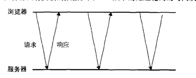
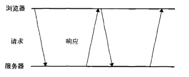
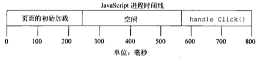
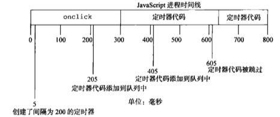
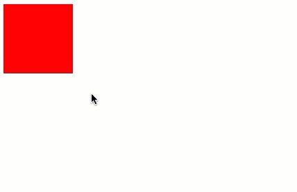
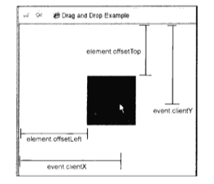

> 第二十一章：Ajax与Comet
>
> 第二十二章：高级技巧

<!--more-->

## Ajax与Comet

### XMLHTTPRequest对象

使用XMLHTTPRequest构造函数创建XHR对象：

```javascript
var xhr = new XMLHttpRequest();
```

#### XHR的用法

在使用XHR对象时，要调用的第一个方法是`open()`，它接受3个参数：要发送的请求的类型（`get`、`post`等）、请求的URL和表示是否异步发送请求的布尔值：

```javascript
xhr.open('get', 'example.php', false);
```

这个代码会启动一个针对`example.php`的`GET`请求。这行代码中，URL相对于执行代码的当前页面（当然也可以使用绝对路径），调用`open()`方法并不会真正发送请求，而只是启动一个请求以备发送。

<p id="div-border-left-red">只能向使用相同端口和协议的URL发送请求</p>

要发送特定的请求，必须调用`send()`方法：

```javascript
xhr.open('get', 'example.txt', false);
xhr.send(null);
```

`send()`方法接收一个参数，即要作为请求主题发送的数据。如果不需要通过请求主体发送数据，则必须传入`null`，因为这个参数对有些浏览器来说是必须的。调用`send()`之后，请求就好被分派到服务器。

由于这次请求是同步的，JavaScript代码会等到服务器响应之后再继续执行。在收到响应之后，响应数据会自动填充XHR对象的属性，相关属性简介如下：

* `responseText`：作为响应主体被返回的文本
* `responseXML`：如果响应的内容类型是`text/xml`或`application/xml`，这个属性中将保存包含着响应数据的XML DOM文档
* `status`：响应的HTTP状态
* `statusText`：HTTP状态说明

在接收到响应之后，第一步是检查`status`属性，以确定响应已经成功返回。一般来说，可以将HTTP状态码为200作为成功的标志。此时，`responseText`属性的内容已经就绪，而且在内容类型正确的情况下，`responseXML`也应该能够访问了。此外，状态码为304表示请求的资源并没有被修改，可以直接使用浏览器中缓存的版本；当然，也意味着响应是有效的。为确保接收到适当的响应，应该像下面这样检查上述两种状态码：

```javascript
xhr.open('get', 'example.php', false);
xhr.send(null);

if ((xhr.status >= 200 && xhr.status < 300) || xhr.status == 304) {
  console.log(xhr.responseText);
} else {
  console.log('request was unsuccessful: ' + xhr.status);
}
```

建议通过检测`status`来决定下一步的操作。无论内容类型是什么，响应主体的内容都会保存到`responseText`属性中；而对于非XML数据而言，`responseXML`属性的值为`null`。

发送异步请求时，可以检测XHR对象的`readyState`属性，该属性表示请求/响应过程的当前活动阶段。这个属性可取值如下：

* 0：未初始化。尚未调用`open()`方法。
* 1：启动。已经调用`open()`方法，但尚未调用`send()`方法。
* 2：发送。已经调用`send()`方法，但尚未接收响应。
* 3：接收。已经接收到部分响应数据。
* 4：完成。已经接收到全部响应数据，而且已经可以在客户端使用。

只要`readyState`属性的值由一个值变成另一个值，都会触发一次`readystatechange`事件。可以利用这个事件来检测每次状态变化后`readyState`的值。通常，我们只对`readyState`值为4的阶段感兴趣，因为这时所有数据都已经就绪。不过，必须在调用`open()`之前指定`onreadystatechange`事件处理程序才能确保跨浏览器兼容性：

```javascript
var xhr = createXHR();

xhr.onreadystatechange = function () {
  if (xhr.readyState == 4) {
    if (xhr.status >= 200 && xhr.status < 300) {
      console.log(xhr.responseText);
    } else {
      console.log('request was unsuccessful: ' + xhr.status);
    }
  }
};

xhr.open('get', 'example.txt', true);
xhr.send(null);
```

> 没有使用`this`对象是因为`onreadystatechange`事件处理程序的作用域问题。如果使用`this`对象，在有的浏览器中会导致函数执行失败，或导致错误发生。

在接收到响应之前还可以调用`abort()`方法来取消异步请求：

```javascript
xhr.abort();
```

调用这个方法后，XHR对象会停止触发事件，而且也不再允许访问任何与响应有关的对象属性。在终止请求之后，还应该对XHR对象进行解引用操作。由于内存原因，不建议重用XHR对象。

#### HTTP头部信息

每个HTTP请求和响应都会带有响应的头部信息。XHR对象提供了操作请求头部和响应头部信息的方法。

默认情况下，在发送XHR请求的同时，还会发送下列头部信息：

* `Accept`：浏览器能够处理的内容类型
* `Accept-Charset`：浏览器能够显示的字符集
* `Accept-Encoding`：浏览器能够处理的压缩编码
* `Accept-Language`：浏览器当前设置的语言
* `Connection`：浏览器与服务器之间连接的类型
* `Cookie`：当前页面设置的任何`Cookie`
* `Host`：发出请求的页面所在的域
* `Referer`：发出请求的页面的URI
* `User-Agent`：浏览器的用户代理字符串

使用`setRequestHeader()`方法可以设置自定义的请求头部信息。这个方法接收两个参数：头部字段的名称和头部字段的值。要成功发送请求头部信息，必须在调用`open()`方法之后且调用`send()`方法之前调用`setRequestHeader()`：

```javascript
var xhr = createXHR();

xhr.onreadystatechange = function () {
  if (xhr.readyState == 4) {
    if (xhr.status >= 200 && xhr.status < 300) {
      console.log(xhr.responseText);
    } else {
      console.log('request was unsuccessful: ' + xhr.status);
    }
  }
};

xhr.open('get', 'example.txt', true);
xhr.setRequestHeader('MyHeader', 'MyValue');
xhr.send(null);
```

调用XHR对象的`getResponseHeader()`方法并传入头部字段名称，可以取得相应的响应头部信息。而调用`getAllResponseHeaders()`方法则可以取得一个包含所有头部信息的长字符串：

```javascript
var myHeader = xhr.getResponseHeader('MyHeader');
var allHeaders = xhr.getAllResponseHeaders();
```

#### GET请求

GET是最常见的请求类型，最常用于向服务器查询某些信息。必要时，可以将查询字符串参数追加到URL的末尾，以便将信息发送给服务器。对XHR而言，位于传入`open()`方法的URL末尾的查询字符串必须经过正确的编码才行。

使用GET请求经常会发生的一个错误，就是查询字符串的格式有问题。查询字符串中每个参数的名称和值都必须使用`encodeURIComponent()`进行编码，然后才能放到URL的末尾；而且所有名-值对都必须由`&`分隔：

```javascript
xhr.open('get', 'example.php?name1=value1&name2=value2', true);
```

可以使用下面这个函数辅助向现有URL的末尾添加查询字符串参数：

```javascript
function addURLParam(url, name, value) {
  url += (url.indexOf('?') == -1 ? '?' : '&');
  url += encodeURIComponent(name) + '=' + encodeURIComponent(value);
  return url;
}

var url = 'example.php';

// 添加参数
url = addURLParam(url, 'name', 'tc');
url = addURLParam(url, 'book', 'js');

// 初始化请求
xhr.open('get', url, false);
```

#### POST请求

POST请求通常用于向服务器发送应该被保存的数据。POST请求应该把数据作为请求的主体提交，而GET请求传统上不是这样。POST请求的主体可以包含非常多的数据，而且格式不限。在`open()`方法第一个参数的位置传入`post`，就可以初始化一个POST请求：

```javascript
xhr.open('post', 'example.php', true);
```

发送POST请求的第二步就是向`send()`方法中传入某些数据。传入的数据经序列化后将作为请求主体被提交到服务器。

默认情况下，服务器对POST请求和提交Web表单的请求并不会一视同仁。因此，服务器端必须有程序来读取发送过来的原始数据，并从中解析出有用的部分。不过，可以用XHR来模仿表单提交：首先将`Content-Type`头部信息设置为`application/x-www-form-urlencoded`，其次是以适当的格式创建一个字符串。

<p id="div-border-left-yellow">与GET请求相比，POST请求消耗的资源更多一些。从性能角度来看，以发送相同的数据计，GET请求的速度最多可达到POST请求的两倍。</p>

### XMLHttpRequest2级

#### FormData

FormData为序列化表单以及创建与表单格式相同的数据提供了便利。

```javascript
var data = new FormData();
data.append('name', 'tc');
```

这个`append()`方法接收两个参数：键和值，分别对应表单字段的名字和字段中包含的值。可以像这样添加任意多个键值对。而通过向`FormData`构造函数中传入表单元素，也可以用表单元素的数据预先向其中填入键值对：

```javascript
var data = new FormData(document.forms[0]);
```

创建了FormData的实例后，可以将它直接传给XHR的`send()`方法：

```javascript
var xhr = createXHR();
xhr.onreadystatechange = function () {
  if (xhr.readyState == 4) {
    if ((xhr.status >= 200 && xhr.status < 300) || xhr.status == 304) {
      console.log(xhr.responseText);
    } else {
      console.log('request was unsuccessful: ' + xhr.status);
    }
  }
};

xhr.open('post', 'postexample.php', true);
var form = document.getElementById('user-info');
xhr.send(new FormData(form));
```

使用FormData的方便之处在于不必明确地在XHR对象上设置请求头部。XHR对象能够识别传入的数据类型是FormData的实例，并配置适当的头部信息。

#### 超时设定

IE8为XHR对象添加了一个`timeout`属性，表示请求在等待响应多少毫秒后就终止。在给`timeout`设置一个数值后，如果在规定的时间内浏览器还没有接收到响应，那么就会触发`timeout`事件，进而会调用`ontimeout`事件处理程序。

```javascript
var xhr = createXHR();
xhr.onreadystatechange = function () {
  if (xhr.readyState == 4) {
    try {
      if ((xhr.status >= 200 && xhr.status < 300) || xhr.status == 304) {
        console.log(xhr.responseText);
      } else {
        console.log('request was unsuccessful: ' + xhr.status);
      }
    } catch (ex) {
		// 假设由ontimeout事件程序处理
    }
  }
};

xhr.open('post', 'postexample.php', true);
xhr.timeout = 1000;     // 将超时设置为1秒钟(仅适用于IE8+)
xhr.ontimeout = function () {
  console.log('request did not return in a second')
};
xhr.send(null);
```

### overrideMimeType()方法

`overrideMimeType()`方法用于重写XHR响应的MIME类型。

如果服务器返回的MIME类型是`text/plain`，但数据中实际包含的是XML。根据MIME类型，即使数据是XML，`responseXML`属性中仍然是`null` 。通过调用`overrideMimeType()`方法，可以保证把响应当做XML而非纯文本来处理：

```javascript
var xhr = createXHR();
xhr.open('get', 'text.php', true);
xhr.overrideMimeType('text/xml');
xhr.send(null);
```

### 进度事件

Progress Event规范定义了与客户端服务器通信有关的事件：

* `laodstart`：在接收到响应数据的第一个字节时触发
* `progress`：在接收响应期间持续不断地触发
* `error`：在请求发生错误时触发
* `abort`：在因为调用`abort()`方法而终止连接时触发
* `load`：在接收到完整的响应数据时触发
* `loadend`：在通信完成或触发`error`、`abort`或`load`事件后触发

每个请求都从触发`loadstart`事件开始，接下来是一或多个`progress`事件、然后触发`error`、`abort`或`load`事件中的一个，最后触发`loadend`事件结束。

#### load事件

FIrefox实现中引入了`load`事件，用以代替`readystatechange`事件。响应接收完毕后将触发`load`事件，因此没有必要检查`readyState`属性。而`onload`事件处理程序会接收到一个`event`对象，其`target`属性就指向XHR对象实例，因而可以访问到XHR对象的所有方法和属性。然而，并非所有浏览器都为这个事件实现了适当的事件对象。

```javascript
var xhr = createXHR();
xhr.onload = function () {
  if ((xhr.status >= 200 && xhr.status < 300) || xhr.status == 304) {
    console.log(xhr.reponseText);
  } else {
    console.log('request was unsuccessful: ' + xhr.status);
  }
};

xhr.open('get', 'altevent.php', true);
xhr.send(null);
```

只要浏览器接收到服务器的响应，不管其状态如何，都会触发`load`事件。这个意味着必须检查`status`属性，才能确定数据是否真的已经可用了。

#### progress事件

`progress`事件会在浏览器接收新数据期间周期性触发。而`onprogress`事件处理程序会接收到一个`event`对象，其`target`属性是XHR对象，但包含额外的属性：`lengthComputable`、`position`和`totalSize`。其中，`lengthComputable`是一个表示进度信息是否可用的布尔值，`position`表示已经接收的字节数，`totalSize`表示根据`Content-Length`响应头部确定的预期字节数。有了这些信息，就可以为用户创建一个进度指示器：

```javascript
var xhr = createXHR();
xhr.onload = function (event) {
  if ((xhr.status >= 200 && xhr.status < 300) || xhr.status == 304) {
    console.log(xhr.reponseText);
  } else {
    console.log('request was unsuccessful: ' + xhr.status);
  }
};
xhr.onprogress = function (event) {
  var divStatus = document.getElementById('status');
  if (event.lengthComputable) {
    divStatus.innerHTML = 'Received ' + event.position + 'of' + event.totalSize + 'bytes';
  }
};
xhr.open('get', 'altevent.php', true);
xhr.send(null);
```

为了确保正常执行，必须在调用`open()`方法之前添加`onprogress`事件处理程序。如果响应头部中包含`Content-Length`字段，那么也可以利用这个信息来计算从响应中已经接收到的数据的百分比。

### 跨域资源共享

默认情况，XHR对象只能访问与包含它的页面位于同一域中的资源。这种安全策略可以预防某些恶意行为。

CORS（`Cross-Origin Resource Sharing`，跨源资源共享）定义了在必须访问跨源资源时，浏览器与服务器如何沟通。CORS背后的基本思想，就是使用自定义的HTTP头部让浏览器与服务器进行沟通，从而决定请求或响应是应该成功，还是失败。

比如一个简单的使用GET或POST发送的请求，它没有自定义的头部，而主体内容是`text/plain`。在发送该请求时，需要给它附加一个额外的`Origin`头部，其中包含请求页面的源信息，以便服务器根据这个头部信息来决定是否给予响应下面是`Origin`头部的一个示例：

```javascript
Origin: http://www.tc9011.com
```

如果服务器认为这个请求可以接受，就在`Access-Control-Allow-Origin`头部中回发相同的源信息（如果是公共资源，可以回发`*`）：

```javascript
Access-Control-Allow-Origin: http://www.tc9011.com
```

如果没有这个头部，或者有这个头部但源信息不匹配，浏览器就会驳回请求。请求和响应都不包含cookie信息。

#### 浏览器对CORS的实现

FIrefox3.5+、Safari4+、Chrome、iOS版Safari和Android平台中的WebKit都通过XHLHttpRequest对象实现了对CORS的原生支持。在尝试打开不同来源的资源时，无需额外编写代码就可以触发这个行为。要请求另一个域中的资源，使用标准XHR对象并在`open()`方法中传入绝对URL即可：

```javascript
var xhr = createXHR();
xhr.onreadystatechange = function () {
  if (xhr.readyState == 4) {
    if (xhr.status >= 200 && xhr.status < 300 || xhr.status == 304) {
      console.log(xhr.responseText);
    } else {
      console.log('request was unsuccessful: ' + xhr.status);
    }
  }
};
xhr.open('get', 'http://www.tc9011.com/page/', true);
xhr.send(null);
```

通过跨域XHR对象可以访问`status`和`statusText`属性，而且还支持同步请求。跨域XHR对象也有一些限制，但为了安全这些限制是必须的：

* 不能使用`setRequestHeader()`设置自定义头部
* 不能接收和发送cookie
* 调用`getAllResponseHeaders()`方法总会返回空字符串

由于无论同源请求还是跨源请求都使用相同的接口，因此对于本地资源，最好使用相对URL，在访问远程资源时再使用绝对URL。这样能消除歧义，避免出现限制访问头部或本地cookie信息等问题。

#### Preflighted Request

CORS通过一种叫做Preflighted Request的透明服务器验证机制支持开发人员使用自定义的头部、GET或POST之外的方法，以及不同类型的主体内容。在使用下列高级选项来发送请求时，就会向服务器发送一个Preflight请求。这种请求使用OPTIONS方法，发送下列头部：

* `Origin`：与简单的请求相同
* `Access-Control-Request-Method`：请求自身使用的方法
* `Access-Control-Request-Headers`：（可选）自定义的头部信息，多个头部以逗号分隔

发送这个请求后，服务器可以决定是否允许这种类型的请求。服务器通过在响应中发送如下头部与浏览器进行沟通：

* `Access-Control-Allow-Origin`：与简单的请求相同
* `Access-Control-Allow-Methods`：允许的方法，多个方法以逗号分隔
* `Access-Control-Allow-Headers`：允许的头部，多个头部以逗号分隔
* `Access-Control-Max-Age`：应该将这个Prefloght请求缓存多长时间（以秒表示）

Preflight请求结束后，结果将按照响应中指定的时间缓存起来。而为此付出的代价只是第一次发送这种请求时会多一次HTTP请求。

#### 带凭据的请求

默认情况下，跨源请求不提供凭据（cookie、HTTP认证及客户端SSL证明等）。通过将`withCredentials`属性设置为`true`，可以指定某个请求应该发送凭据。如果服务器接受带凭据请求，会用下面的HTTP头部来响应：

```javascript
Access-Control-Allow-Credentials: true
```

如果发送的是带凭据的请求，但服务器的响应中没有包含这个头部，那么浏览器就不会把响应交给JavaScript（于是，`responseText`中将是空字符串，`status`的值为`0`，而且会调用`onerror()`事件处理程序）。另外，服务器还可以在Preflight响应中发送这个HTTP头部，表示允许源发送带凭据的请求。

### 其他跨域技术

#### 图像Ping

一个网页可以从任何网页中加载图像，不用担心跨域不跨域。动态创建图像经常用于图像Ping。图像Ping是与服务器进行简单、单向的跨域通讯的一种方式。请求的数据是通过查询字符串形式发送的，而响应可以是任意内容，但通常是像素图或204响应。通过图像Ping，浏览器得不到具体的数据，但通过侦听`load`和`error`事件，能知道响应是什么时候接收到的：

```javascript
var img = new Image();
img.onload = img.onerror = function () {
  console.log('done')
};
img.src = 'http://tc9011.com/test?name=tc';
```

这里创建了一个Image的实例，然后将`onload`和`onerror`事件处理程序指定为同一个函数。这样无论是什么响应，只要请求完成，就能得到通知。请求从设置`src`属性那一刻开始，而这个例子在请求中发送了一个`name`参数。

图像Ping最常用于跟踪用户点击页面或动态广告曝光次数。图像Ping有两个主要的缺点，一是只能发送GET请求，而是无法访问服务器的响应文本。

#### JSONP

JSONP是JSON with padding（填充式JSON或参数式JSON）的简写，是应用JSON的一种新方法。JSONP是被包含在函数调用中的JSON：

```javascript
callback({'name': 'tc'});
```

JSONP由两部分组成：回调函数和数据。回调函数是当响应来时应该在页面中调用的函数。回调函数的名字一般是在请求中指定的。而数据就是传入回调函数中的JSON数据。下面就是一个典型的JSONP请求：

```javascript
http://freegeoip.net/json/?callback=handleResponse
```

这个URL是在请求一个JSONP地理定位服务。通过查询字符串来指定JSONP服务的回调参数是很常见的，这里指定的回调函数的名字叫`handleResponse`。

JSONP是通过动态`<script>`元素来使用的，使用时可以为`src`属性指定一个跨域URL。这里的`<script>`元素与``元素类似，都有能力不受限制地从其他域加载资源。因为JSONP是有效的JavaScript代码，所以在请求完成后，即在JSONP响应加载到页面中以后，就会立即执行：

```javascript
function handleResponse(response) {
  console.log('you are at ip address' + response.ip + ', which is in ' + response.city + ', ' + response.region_name);
}

var script = document.createElement('script');
script.src = 'http://freegeoip.net/json/?callback=handleResponse';
document.body.insertBefore(script, document.body.firstChild);
```

与图像Ping相比，它的优点在于能直接访问响应文本，支持在浏览器与服务器之间双向通信。

JSONP的缺点是从其他不安全域中加载代码执行时，如果响应中夹带一些恶意代码，而此时除了完全放弃JSONP调用之外，没办法追究。另外，要确定JSONP请求是否失败并不容易。在HTML5中可以用给`<script>`新增的`onerror`事件处理程序。

#### Comet

Comet则是一种服务器向页面推送数据的技术。Comet能够让信息近乎实时地被推送到页面上。

有两种实现Comet的方式：长轮询和流。长轮询是传统轮询的一个翻版，即浏览器定时向服务器发送请求，看有没有更新数据。下图是短轮询的时间线：



长轮询把短轮询颠倒一下。页面发起一个到服务器的请求，然后服务器一直保持连接打开，直到有数据发送。发送完数据之后，浏览器关闭连接，随即又发起一个到服务器的新请求。这一过程在页面打开期间一直持续不断。下面是长轮询的时间线：



无论是短轮询还是长轮询，浏览器都要在接收数据之前，先发起对服务器的连接。两者最大的区别在于服务器如何发送数据。短轮询是服务器立即发送响应，无论数据是否有效，而长轮询是等待发送响应。轮询的优势是所有浏览器都支持的，因为使用XHR对象和`setTimeout()`就能实现，你需要做的是决定什么时候发送请求。

第二种流行的Comet实现是HTTP流。流不同于上述两种轮询，因为它在页面的整个生命周期内只使用一个HTTP链接。就是浏览器向服务器发送一个请求，而服务器保持连接打开，然后周期性地向浏览器发送数据。

所有服务器端语言都支持打印到输出缓存然后刷新（将输出缓存中的内容一次性全部发送到客户端）的功能。而这正是实现HTTP流的关键所在。

在FIrefox、Safari、Opera和Chrome中，通过侦听`readystatechange`事件及检测`readyState`的值是否为3，就可以利用XHR对象实现HTTP流。在上述浏览器中，随着不断从服务器接收数据，`readyState`的值会周期性地变为3。当`readyState`值变为3时，`responseText`属性中就会保存接收到的所有数据。此时，就需要比较此前接收到的数据，决定从什么位置开始取得最新的数据。使用XHR对象实现HTTP流的典型代码如下：

```javascript
function createStreamingClient(url, progress, finished) {
  var xhr = new XMLHttpRequest(),
      received = 0;

  xhr.open('get', url, true);
  xhr.onreadystatechange = function () { 
    var result;

    if (xhr.readyState == 3) {

      // 只取得最新数据并调整计数器
      result = xhr.responseText.substring(received);
      received += result.length;

      // 调用progress回调函数
      progress(result);
    } else if (xhr.readyState == 4){
      finished(xhr.responseText);
    }
  };
  xhr.send(null);
  return xhr;
}

var client = createStreamingClient('streaming.php', function (data) {
  console.log('received: ' + data);
}, function (data) {
  console.log('Done');
});
```

#### 服务器发送事件

SSE（Server-Sent Event，服务器发送事件）是围绕只读Comet交互推出的API或者模式。SSE API用于创建到服务器的单向连接，服务器通过这个连接可以发送任意数量的数据。服务器响应的MIME类型必须是`text/event-stream`，而且是浏览器中的JavaScript API能解析格式输出。SSE支持短轮询、长轮询和HTTP流，而且能在断开连接时自动确定何时重新连接。

##### SSE API

要预定新的事件流，首先要创建一个新的EventSource对象，并传进一个入口点：

```javascript
var source = new EventSource('myevents.php');
```

注意，传入的URL必须与创建对象的页面同源（相同的URL模式、域及端口）。EventSource的实例有一个`readyState`属性，值为0表示正连接到服务器，值为1表示打开了连接，值为2表示关闭了连接。

另外，还有下面三个事件：

* `open`：在建立连接时触发
* `message`：在从服务器接收到新事件时触发
* `error`：在无法建立连接时触发

```javascript
source.onmessage = function (event) {
  var data = event.data;
  // 处理数据
};
```

服务器发回的数据以字符串形式保存在`event.data`中。

默认情况下，EventSource对象会保持与服务器的活动连接。如果连接断开，还会重新连接。这就意味着SSE适合长轮询和HTTP流。如果想强制立即断开连接并且不再重新连接，可以调用`close()`方法：

```javascript
source.close();
```

##### 事件流

所谓的服务器事件会通过一个持久的HTTP响应发送，这个响应的MIME类型为`text/eventstream`。响应的格式是纯文本，最简单的情况是每个数据都带有前缀`data`：

```javascript
data: foo

data: bar

data: foo
data: bar
```

对以上响应而言，事件流中的第一个`message`事件返回的`event.data`值为`foo`，第二个`message`事件返回的`event.data`值为`bar`，第三个`message`事件返回的`event.data`值为`foo\nbar`（注意中间的换行符）。对于多个连续以`data:`开头的数据行，将作为多段数据解析，每个值之间以一个换行符分隔。只有在包含`data:`数据行后面有空行时，才会触发`message`事件，因此在服务器上生成事件流时不能忘了多添加这一行。

通过`id:`前缀可以给特定的事件指定一个关联的ID，这个ID行位于`data:`行前面或后面皆可：

```javascript
data: foo
id: 1
```

设置了ID之后，EventSource对象会跟踪上一次触发的事件。如果连接断开，会向服务器发送一个包含名为`Last-Event-ID`的特殊HTTP头部的请求，以便服务器知道下一次该触发哪个事件。

#### Web Sockets

Web Sockets的目标是在一个单独的持久连接上提供全双工、双向通信。在JavaScript中创建了Web Sockets之后，会有一个HTTP请求发送到浏览器以发起连接。在取得服务器响应后，建立的连接会使用HTTP升级从HTTP协议交换为Web Sockets协议。使用标准的HTTP服务器无法实现Web Sockets，只有支持这种协议的专门服务器才能正常工作。

由于Web Sockets使用了自定义的协议，所以URL模式也略有不同。未加密的连接不上`http://`，而是`ws://`；加密的连接不上`https://`，而是`wss://`。在使用Web Sockets URL时，必须带着这个模式，因为将来还可能支持其他模式。

使用自定义协议而非HTTP协议的好处是，能够在客户端和服务器之间发生非常少量的数据，而不必担心HTTP那样字节级的开销。由于传递的数据包很小，因此Web Sockets很适合移动应用。

使用自定义协议的缺点在于，制定协议的时间比制定JavaScript API的时间还要长。

##### Web Sockets API

要创建Web Sockets，先实例一个Web Socket对象并传入要连接的URL：

```javascript
var socket = new WebSocket('ws://www.example.com/server.php');
```

注意，必须给Web Socket构造函数传入绝对URL。同源策略对Web Socket不适用，因此可以通过它打开到任何站点的连接。至于是否会与某个域中的页面通信，则完全取决于服务器。

实例化Web Socket对象后，浏览器会马上尝试创建连接。与XHR类似，Web Socket也有一个表示当前状态的`readyState`属性：

* WebSocket.OPENING(0)：正在建立连接
* WebSocket.OPEN(1)：已经建立连接
* WebSocket.CLOSING(2)：正在关闭连接
* WebSocket.CLOSE(3)：已经关闭连接

Web Socket没有`readystatechange`事件，不过，它有其他事件，对应着不同的状态。`readyState`的值永远从0开始。

要关闭Web Socket连接，可以在任何时候调用`close()`方法。

```javascript
socket.close();
```

调用`close()`之后，`readyState`的值立即变为2（正在关闭），而在关闭连接以后就会变成3。

##### 发送和接收数据

Web Socket打开之后，就可以通过连接发送和接收数据。要向服务器发送数据，使用`send()`方法，并传入任意字符串：

```javascript
var socket = new WebSocket('ws://www.example.com/server.php');
socket.send('hello');
```

因为Web Sockets只能通过连接发送纯文本数据，所以对复杂的数据结构，在通过连接发送之前，必须进行序列化：

```javascript
var message = {
  time: new Date(),
  text: 'hello',
  clientID: 'a'
};
socket.send(JSON.stringify(message));
```

当服务器向客户端发来消息时，WebSocket对象就会触发`message`事件。这个`message`事件与其他传递消息的协议类似，也会把返回的数据保存在`event.data`属性中：

```javascript
socket.onmessage = function (event) {
  var data = event.data;

  // 处理数据
};
```

`event.data`中返回的数据也是字符串。

##### 其他事件

WebSocket对象还有下面三个事件，在连接生命周期的不同阶段触发：

* `open`：在成功建立连接时触发
* `error`：在发生错误时触发，连接不能持续
* `close`：在连接关闭时触发

WebSocket对象不支持DOM2级事件侦听，因此必须使用DOM 0级语法分别定义每个事件处理程序：

```javascript
var socket = new WebSocket('ws://www.example.com/server.php');
socket.onopen = function () {
  console.log('connection established');
};

socket.onerror = function () {
  console.log('connection error');
};

socket.onclose = function () {
  console.log('connection closed');
};
```

在这三个事件中，只有`close`事件的`event`对象有额外的信息。这个事件的事件对象有三个额外的属性：`wasClean`、`code`和`reason`。其中，`wasClean`是一个布尔值，表示连接是否已经明确地关闭；`code`是服务器返回的数值状态码；`reason`是一个字符串，包含服务器发回的消息。可以把这些信息显示给用户，也可以记录到日志中以便将来分析：

```javascript
socket.onclose = function (event) {
  console.log('was clean? ' + event.wasClean + 'code = ' + event.code + 'reason = ' + event.reason);
};
```

#### SSE与Web Sockets

考虑使用SSE还是Web Sockets可以考虑一下因素：

* 是否有自由度建立和维护Web Sockets服务器
* 需不需双向通信。如果只需读取服务器数据，那么SSE比较容易实现。如果必须双向通信（如聊天室），那么Web Sockets更好。在不选择Web Sockets时，组合XHR和SSE也能实现双向通信

### 安全

对于未被授权系统有权访问某个资源的情况，称之为CSRF（跨站点请求伪造）。未被授权系统会伪装自己，让处理请求的服务器认为它是合法的。

为了确保XHR访问的URL安全，通行的做法是验证发送请求者是否有权限访问相应的资源，有以下几种方式可以选择：

* 要求以SSL连接来访问可以通过XHR请求的资源
* 要求每一次请求都要附带经过相应算法计算得到的验证码

下列措施对CSRF攻击不起作用：

* 要求发送POST而不是GET请求---很容易改变
* 检查来源URL以确定是否可信---来源记录很容易伪造
* 基于cookie信息进行验证—同样很容易伪造


## 高级技巧

### 高级函数

#### 安全的类型检测

JavaScript内置的类型检测机制并非完全可靠。

在任何值上调用Object原生的`toString()`方法，都会返回一个`[object NativeConstructorName]`格式的字符串。每个类在内部都有一个`[[class]]`属性，这个属性中指定了上述字符串中的构造函数名：

```javascript
var value = new Array();
console.log(Object.prototype.toString.call(value));	// [object Array]
```

由于原生数组的构造函数名与全局作用域无关，因此用`toString()`能保证返回一致的值。利用这点，可以创建如下函数：

```javascript
function isArray(value) {
  return Object.prototype.toString.call(value) == '[object Array]';
}

function isFunction(value) {
  return Object.prototype.toString.call(value) == '[object Function]';
}

function isRegExp(value) {
  return Object.prototype.toString.call(value) == '[object RegExp]';
}
```

在Web开发中能够区分原生与非原生JavaScript对象非常重要。只有这样才能确切知道某个对象到底有哪些功能。这个技巧可以对任何对象给出正确的结论。

#### 作用域安全的构造函数

构造函数其实就是一个使用`new`操作符调用的函数。当使用`new`调用时，，构造函数内用到的`this`对象会指向新创建的对象实例：

```javascript
function Person(name, age, job) {
  this.name = name;
  this.age = age;
  this.job = job;
}

var person = new Person('tc', 27, 'fep');
```

上面代码当没有使用`new`操作符来调用该构造函数时，由于`this`对象是在运行时绑定的，直接调用`Person()`，`this`会映射到全局对象`window`上，导致错误对象属性的意外增加：

```javascript
var person = Person('tc', 27, 'fep');
console.log(window.name);		//tc
console.log(window.age);		//27
console.log(window.job);		//fep
```

这里，原本针对Person实例的三个属性被加到`window`对象上，因为构造函数是作为普通函数调用，忽略了`new`操作符。这个问题是由`this`对象的晚绑定造成的，在这里`this`被解析成了`window`对象。这个问题的解决方法就是创建一个作用域安全的构造函数。

作用域安全的构造函数在进行任何更改前，首先确认`this`对象是正确类型的实例。如果不是，那么会创建新的实例并返回：

```javascript
function Person(name, age, job) {
  if (this instanceof Person) {
    this.name = name;
    this.age = age;
    this.job = job;
  } else {
    return new Person(name, age, job);
  }
}

var person1 = Person('tc', 27, 'fep');
console.log(window.name);		// ''
console.log(person1.name);		// 'tc'

var person2 = new Person('tc', 27, 'fep');
console.log(person2.name);		// 'tc'
```

实现这个模式以后，就锁定了可以调用构造函数的环境。如果使用构造函数窃取模式的继承且不使用原型链，那么这个继承很可能被破坏：

```javascript
function Polygon(sides) {
  if (this instanceof Polygon) {
    this.sides = sides;
    this.getArea = function () {
      return 0;
    };
  } else {
    return new Polygon(sides);
  }
}

function Rectangle(width, height) {
  Polygon.call(this, 2);
  this.width = width;
  this.height = height;
  this.getArea = function () {
    return this.width * this.height;
  };
}

var rect = new Rectangle(5, 10);
console.log(rect.sides);        // undefined
```

这段代码中，`Polygon`构造函数是作用域安全的，然而`Rectangle`构造函数不是。新建一个`Rectangle`实例之后，这个实例应该通过`Polygon.call()`来继承`Polygon`的`sides`属性。但是，由于`Polygon`构造函数是作用域安全的，`this`对象并非`Polygon`的实例，所以会创建并返回一个新的`Polygon`对象。`Rectangle`构造函数中的`this`对象并没有得到增长，同时`Polygon.call()`返回的值也没有用到，所以`Rectangle`实例中就不会有`sides`属性。

如果构造函数窃取结合使用原型链或者寄生组合则可以解决这个问题：

```javascript
function Polygon(sides) {
  if (this instanceof Polygon) {
    this.sides = sides;
    this.getArea = function () {
      return 0;
    };
  } else {
    return new Polygon(sides);
  }
}

function Rectangle(width, height) {
  Polygon.call(this, 2);
  this.width = width;
  this.height = height;
  this.getArea = function () {
    return this.width * this.height;
  };
}

Rectangle.prototype = new Polygon();
var rect = new Rectangle(5, 10);
console.log(rect.sides);        // 2
```

上面代码中，一个`Rectangle`实例也同时是一个`Polygon`实例，所以`Polygon.call()`会照原意执行。

推荐作用域安全的构造函数作为最佳实践。

#### 惰性载入函数

惰性载入表示函数执行的分支只会发生一次。有两种实现惰性载入的方式，第一种就是在函数被调用时再处理函数。在第一次调用的过程中，该函数会被覆盖为另一个按合适方式执行的函数，这样任何对原函数的调用都不用再经过执行的分支了。

```javascript
/*************原函数*************/
function createXHR() {
  if (typeof XMLHttpRequest != 'undefined') {
    return new XMLHttpRequest();
  } else if (typeof  ActiveXObject != 'undefined') {
    if (typeof  arguments.callee.activeXString != 'string') {
      var versions = ['MSXML2 .XMLHttp.6.0', 'MSXML2.XMLHttp.3.0', "MSXML2 .XMLHttp"],
          i, len;

      for (i = 0, len = versions.length; i < len; i++) {
        try {
          new ActiveXObject(versions[i]);
          arguments.callee.activeXString = versions[i];
          break;
        } catch (ex) {
          // 跳过
        }
      }
    }
    return new ActiveXObject(arguments.callee.activeXString);
  } else {
    throw new Error('no xhr object available');
  }
}

/*************重写后*************/

function createXHR() {
  if (typeof XMLHttpRequest != 'undefined') {
    createXHR = function () {
      return new XMLHttpRequest();
    };
  } else if (typeof ActiveXObject != 'undefined') {
    createXHR = function () {
      if (typeof  arguments.callee.activeXString != 'string') {
        var versions = ['MSXML2 .XMLHttp.6.0', 'MSXML2.XMLHttp.3.0', "MSXML2 .XMLHttp"],
            i, len;

        for (i = 0, len = versions.length; i < len; i++) {
          try {
            new ActiveXObject(versions[i]);
            arguments.callee.activeXString = versions[i];
            break;
          } catch (ex) {
            // 跳过
          }
        }
      }
      return new ActiveXObject(arguments.callee.activeXString);
    };
  } else {
    createXHR = function () {
      throw new Error('no xhr object available');
    }
  }
  return createXHR();
}
```

在这个惰性载入的`createXHR()`中，`if`语句的每一个分支都会为`createXHR`变量赋值，有效**覆盖了原有的函数**。最后一步便是调用新赋的函数。下一次调用`createXHR()`的时候，就会直接调用被分配的函数，这样就不用再次执行`if`语句。

第二种实现惰性载入的方式是在声明函数时声明时就指定适当的函数。这样，第一次调用函数时就不会损失性能了，而在代码首次加载时会损失一点性能：

```javascript
var createXHR = (function () {
  if (typeof XMLHttpRequest != 'undefined') {
    return function () {
      new XMLHttpRequest();
    };
  } else if (typeof  ActiveXObject != 'undefined') {
    return function () {
      if (typeof  arguments.callee.activeXString != 'string') {
        var versions = ['MSXML2 .XMLHttp.6.0', 'MSXML2.XMLHttp.3.0', "MSXML2 .XMLHttp"],
            i, len;

        for (i = 0, len = versions.length; i < len; i++) {
          try {
            new ActiveXObject(versions[i]);
            arguments.callee.activeXString = versions[i];
            break;
          } catch (ex) {
            // 跳过
          }
        }
      }
      return new ActiveXObject(arguments.callee.activeXString);
    };
  } else {
    return function () {
      throw new Error('no xhr object available');
    };
  }
})();
```

上面代码使用的技巧是创建一个匿名、自执行的函数，用以确定应该使用哪一个函数实现。实际的逻辑都一样。不一样的地方就是第一行代码、新增了自执行的匿名函数，另外每个分支都返回正确的函数定义，以便立即将其赋值给`createXHR()`。

#### 函数绑定

函数绑定要创建一个函数，可以在特定的`this`环境中以指定参数调用另一个函数。该技巧常常和回调函数与事件处理程序一起使用，以便在将函数作为变量传递时保留代码执行环境：

```javascript
var handler = {
  message: 'Event handled',

  handleClick: function (event) {
    console.log(this.message);
  }
};

var btn = document.getElementById('my-btn');
EventUtil.addHandler(btn, 'click', handler.handleClick);
```

上面例子中，创建了一个`handler`的对象。`handler.handleClick()`方法被分配为一个DOM按钮的事件处理程序。当按下该按钮时，就调用该函数。虽然貌似打印的应该是`Event handled`，实际却是`undefined`。这个问题在于没有保存`handler.handleClick()`的环境，所以`this`对象最后是指向DOM按钮而非`handler`。可以使用一个闭包修正这个问题：

```javascript
var handler = {
  message: 'Event handled',

  handleClick: function (event) {
    console.log(this.message);
  }
};

var btn = document.getElementById('my-btn');

EventUtil.addHandler(btn, 'click', function (event) {
  handler.handleClick(event);
});
```

这个解决方案在`onclick`事件处理程序内使用了一个闭包直接调用`handler.handleClick()`。

<p id="div-border-left-yellow">闭包会携带包含它的函数的作用域</p>

多个闭包可能会令代码难于理解和调试。因此可以创建一个将函数绑定到指定环境的函数：

```javascript
// 接受一个函数和一个环境，并返回一个在给定环境中调用给定函数的函数，并且将所有参数原封不动传递过去
function bind(fn, context) {
  return function () {
    return fn.apply(context, arguments);
  };
}
```

在`bind()`中创建一个闭包，闭包使用`apply()`调用传入的函数，并给`apply()`传递`context`对象和参数。注意这里使用的`arguments`对象是函数内部的，而非`bind()`的。当调用返回的函数时，它会在给定环境中执行被传入函数并给出所有参数：

```javascript
var handler = {
  message: 'Event handled',

  handleClick: function (event) {
    console.log(this.message + ":" + event.type);
  }
};

var btn = document.getElementById('my-btn');
EventUtil.addHandler(btn, 'click', bind(handler.handleClick, handler));
```

ECMAScript5为所有函数定义了一个原生的`bind()`方法：

```javascript
EventUtil.addHandler(btn, 'click', handler.handleClick.bind(handler));
```

只要是将某个函数指针以值的形式传递，同时该函数必须在特定环境中执行，被绑定函数的特效就凸显出来。它们主要用于处理事件处理程序以及`setTimeout()`和`setInterval()`。然而，被绑定函数与普通函数相比有更多开销，需要更多内存，同时也因为多重函数调用稍微慢一点，所以最好只在必要时使用。

#### 函数柯里化

与函数绑定密切相关的主题是函数柯里化，它用于创建已经设置好了一个或多个参数的函数。函数柯里化的基本方法和函数绑定是一样的：使用一个闭包返回一个函数。两者的区别在于，当函数被调用时，返回的函数还需要设置一些传入的参数：

```javascript
function add(num1, num2) {
  return num1 + num2;
}

function curriedAdd(num2) {
  return add(5, num2);
}

console.log(add(2, 3));         // 5
console.log(curriedAdd(3));     // 8
```

`curriedAdd()`本质上是在任何情况下第一个参数为`5`的`add()`版本。尽管从技术上说，这并非柯里化的函数，但它很好地展示了其概念。

柯里化函数通常由以下步骤动态创建：调用另一个函数并为它传入要柯里化的函数和必要参数。下面是创建柯里化函数的通用方式：

```javascript
function curry(fn) {
  var args = Array.prototype.slice.call(arguments, 1);
  return function () {
    var innerArgs = Array.prototype.slice.call(arguments);
    var finalArgs = args.concat(innerArgs);
    return fn.apply(null, finalArgs);
  };
}
```

`curry()`函数的主要工作就是将被返回的参数进行排序。`curry()`的第一个参数是要进行柯里化的函数，其他参数是要传入的值。为了获取第一个参数之后的所有参数，在`arguments`对象上调用`slice()`方法，并传入参数`1`表示被返回的数组包含从第二个参数开始的所有参数。然后`args` 数组包含了来自外部函数的参数。在内部函数中，创建了`innerArgs`数组用来存放所有传入的参数。有了存放来自外部函数和内部函数的参数数组后，就可以使用`concat()`方法将它们组合为`finalArgs`，然后使用`apply()`将结果传递给该函数。注意这个函数并没有考虑到执行环境，所以调用`apply()`时第一个参数是`null`。`curry()`函数可以按以下方式应用：

```javascript
function curry(fn) {
  var args = Array.prototype.slice.call(arguments, 1);	//args=[5]
  return function () {
    var innerArgs = Array.prototype.slice.call(arguments); //innerArgs=[3], arguments为引用对象curriedAdd的参数
    var finalArgs = args.concat(innerArgs);
    return fn.apply(null, finalArgs);	// fn为add函数
  };
}

function add(num1, num2) {
  return num1 + num2;
}

var curriedAdd = curry(add, 5);
console.log(curriedAdd(3));     // 8
```

在这个例子中，创建了第一个参数绑定为5的`add()`的柯里化版本。当调用`curriedAdd()`并传入`3`时，`3`会成为`add()`的第二个参数，同时第一个参数依然是`5`，最后结果便是`8`。也可以像下面这样给出所有函数参数：

```javascript
function add(num1, num2) {
  return num1 + num2;
}

var curriedAdd = curry(add, 5, 12);
console.log(curriedAdd());      // 17
```

函数柯里化还常常作为函数绑定的一部分包含在其中，构造出更为复杂的`bind()`函数：

```javascript
function bind(fn, context) {
  var args = Array.prototype.slice.call(arguments, 2);
  return function () {
    var innerArgs = Array.prototype.slice.call(arguments);
    var finalArgs = args.concat(innerArgs);
    return fn.apply(context, finalArgs);
  };
}
```

对`curry()`函数主要更改在于传入的参数个数，以及它如何影响代码的结果。`curry()`仅仅接受一个要包裹的函数作为参数，而`bind()`同时接受函数和一个`object`对象。这表示给绑定的函数的参数是从第三个开始。倒数第三行将`object`对象传给`apply()`。当使用`bind()`时，它会返回绑定到给定环境的函数，并且可能它其中某些函数参数已经被设好。当想除了`event`对象再额外给事件处理程序传递参数时非常有用：

```javascript
function bind(fn, context) {
  var args = Array.prototype.slice.call(arguments, 2);
  return function () {
    var innerArgs = Array.prototype.slice.call(arguments);
    var finalArgs = args.concat(innerArgs);
    return fn.apply(context, finalArgs);
  };
}

var handler = {
  message: 'event handled',
  handleClick: function (name, event) {
    console.log(this.message + ':' + name + ':' + event.type);
  }
};

var btn = document.getElementById('my-btn');
EventUtil.addHandler(btn, 'click', bind(handler.handleClick, handler, 'my-btn'));
```

`handler.handleClick()`方法接受两个参数：要处理的元素的名字和`event`对象。作为第三个参数传递给`bind()`函数的名字，又被传递给了`handler.handleClick()`，而`handler.handleClick()`也会同时接受到`event`对象。

ECMAScript5的`bind()`方法也实现函数柯里化，只要在`this`的值之后再传入另一个参数即可：

```javascript
var handler = {
  message: 'event handled',
  handleClick: function (name, event) {
    console.log(this.message + ':' + name + ':' + event.type);
  }
};
var btn = document.getElementById('my-btn');
EventUtil.addHandler(btn, 'click', handler.handleClick.bind(handler, 'my-btn'));
```

JavaScript中的柯里化函数和绑定函数提供了强大的动态函数创建功能，使用`bind()`还是`curry()`要根据是否需要`object`对象响应来决定。它们都能用于创建复杂的算法和功能，当然两者都不能滥用，因为每个函数都会带来额外的开销。

<p id="div-border-left-yellow">柯里化扩展阅读：[JS中的柯里化(currying)](http://www.zhangxinxu.com/wordpress/2013/02/js-currying/)，[为什么要柯里化](https://gist.github.com/jcouyang/b56a830cd55bd230049f)，[JavaScript专题之函数柯里化](https://github.com/mqyqingfeng/Blog/issues/42)，[柯里化](https://llh911001.gitbooks.io/mostly-adequate-guide-chinese/content/ch4.html#%E4%B8%8D%E4%BB%85%E4%BB%85%E6%98%AF%E5%8F%8C%E5%85%B3%E8%AF%AD%E5%92%96%E5%96%B1)</p>

### 防篡改对象

一旦把对象定义为防篡改，就无法撤销。

#### 不可扩展对象

默认情况下，所有对象都是可以扩展的。任何时候都可以向对象中添加属性和方法：

```javascript
var person = {name: 'tc'};
person.age = 29;
```

 使用`Object.preventExtensions()`方法可以改变这个行为，让你不能再给对象添加属性和方法：

```javascript
var person = {name: 'tc'};
Object.preventExtensions(person);

person.age = 29;
console.log(person.age);    // undefined
```

在调用了`Object.preventExtensions()`方法以后，就不能给`person`对象添加属性和方法。在非严格模式下，给对象添加新成员会导致默认失败。在严格模式下，尝试给不可扩展对象添加新成员会导致抛出错误。

虽然不能给对象添加新成员，但已有的成员不受影响，仍然可以修改和删除已有的成员。另外，使用`Object.isExtensible()`方法还可以确定对象是否可以扩展：

```javascript
var person = {name: 'tc'};
console.log(Object.isExtensible(person));		// true

Object.preventExtensions(person);
console.log(Object.isExtensible(person));		// false
```

#### 密封的对象

ECMAScript5为对象定义的第二个保护级别是密封对象。密封对象不可扩展，而且已有成员的`[[configurable]]`特性将被设置为`false`。这就意味着不能删除属性和方法，因为不能使用`Object.defineProperty()`把数据属性修改为访问器属性，或者相反。属性值是可以修改的。

要密封对象，可以使用`Object.seal()`方法。

```javascript
var person = {name: 'tc'};
Object.seal(person);

person.age = 28;
console.log(person.age);    // undefined

delete  person.name;
console.log(person.name);   // tc
```

使用`Object.isSealed()`方法可以确定对象是否被密封。因为被密封的对象不可扩展，所以`Object.isExtensible()`检测密封的对象也会返回`false`：

```javascript
var person = {name: 'tc'};
console.log(Object.isExtensible(person));   // true
console.log(Object.isSealed(person));       // false

Object.seal(person);
console.log(Object.isExtensible(person));   // false
console.log(Object.isSealed(person));       // true
```

#### 冻结的对象

最严格的防篡改级别是冻结对象。冻结的对象即不可扩展，又是密封的，而且对象数据属性的`[[writable]]`特性会被设置为`false`。如果定义`[[set]]`函数，访问器属性仍然是可写的。ECMAScript5定义的`Object.freeze()`方法可以用来冻结对象：

```javascript
var person = {name: 'tc'};
Object.freeze(person);

person.age = 29;
console.log(person.age);    // undefined

delete person.name;
console.log(person.name);   // tc

person.name = 'tt';
console.log(person.name);   // tc
```

`Object.isFrozen()`方法用于检测冻结对象。因为冻结对象既是密封的又是不可扩展的，所以用`Object.isExtensible()`和`Object.isSealed()`检测冻结对象将分别返回`false`和`true`：

```javascript
var person = {name: 'tc'};
console.log(Object.isExtensible(person));   // true
console.log(Object.isSealed(person));       // false
console.log(Object.isFrozen(person));       // false

Object.freeze(person);
console.log(Object.isExtensible(person));   // false
console.log(Object.isSealed(person));       // true
console.log(Object.isFrozen(person));       // true
```

### 高级定时器

使用`setTimeout()`和`setInterval()`创建的定时器可以用于实现有趣且有用的功能。虽然人们对JavaScript的定时器存在普遍的误解，认为它们是线程，其实JavaScript是运行与单线程环境中的，而定时器仅仅只是计划代码在未来的某个时间执行。执行时机是不能保证的，因为在页面的生命周期中，不同时间可能有其他代码在控制JavaScript进程。在页面下载完成后的代码运行、事件处理程序、Ajax回调函数都必须使用同样的线程来执行。实际上，浏览器负责进行排序，指派某段代码在某个时间点运行的优先级。

可以把JavaScript想象成在时间线上运行的。当页面载入时，首先执行是任何包含在`<script>`元素中的代码，通常是页面生命周期后面要用到的一些简单的函数和变量的声明，不过有时候也包含一些初始数据的处理。在这之后，JavaScript进程将等待更多代码执行。当进程空闲的时候，下一个代码会被触发并立即执行。例如，当点击某个按钮时，`onclick`事件处理程序会立刻执行，只要JavaScript进程处于空闲状态。



除了主JavaScript执行进程外，还有一个需要在进程下一次空闲时执行的代码队列。随着页面在其生命周期中推移，代码会按照执行顺序添加入队列。例如，当按钮被按下时，它的事件处理程序代码会被添加到队列中，并在下一个可能的时间里执行。当接收到某个Ajax响应时，回调函数的代码会被添加到队列。在JavaScript中没有任何代码是立刻执行的，但一旦进程空闲则尽快执行。

定时器队列的工作方式是，当特定时间过去后将代码插入。注意，给队列添加代码并不意味着对它立即执行，而只能表示它会尽快执行。如果在插入的时间点上，队列中没有其他东西，那么这段代码就会被执行，表面上看上去好像代码就在精确指定的时间点上执行了。其他情况下，代码可能明显地等待更长时间才执行：

```javascript
var btn = document.getElementById('my-btn');
btn.onclick = function () {
  setTimeout(function () {
    document.getElementById('message').style.visibility = 'visuble';        }, 250);	// 250s后指定代码才会被添加到队列中等待执行

  // 其他代码
}
```

关于定时器要记住的最重要的事情是，指定的时间间隔表示何时将定时器的代码添加到队列，而不是何时实际执行代码。

实际上，FIrefox中定时器的实现还能让你确定定时器过了多久才执行，这需要传递一个实际执行的时间与指定的间隔的差值：

```javascript
// 仅FIrefox中
setTimeout(function (diff) {
  if (diff > 0) {
    // 晚调用
  } else if (diff < 0) {
    // 早调用
  } else {
    // 调用及时
  }
}, 250);
```

执行完一套代码后，JavaScript进程返回一段很短的时间，这样页面上的其他处理就可以进行。由于JavaScript进程会阻塞其他页面处理，所以必须有这些小间隔来防止用户界面被锁定。这样设置一个定时器，可以确保在定时器代码执行前至少有一个进程间隔。

#### 重复的定时器

使用`setInterval()`创建的定时器确保了定时器代码规则地插入队列中。这个方式的问题在于，定时器代码可能在代码再次被添加到队列之前还没有完成执行，结果导致定时器代码连续运行好几次，而之间没有任何停顿。幸好，JavaScript引擎够聪明，能避免这个问题。当使用`setInterval()`时，仅当没有该定时器的任何代码实例时，才将定时器代码添加到队列中。这确保了定时器代码加入到队列中的最小时间间隔为指定间隔。

这种重复定时器的规则有2个问题：

* 某些间隔会被跳过


* 多个定时器的代码执行之间的间隔可能会比预期的小

 假设，某个`onclick`事件处理程序使用`setInterval()`设置了一个200ms间隔的重复定时器。如果事件处理程序花了300ms多一点的时间完成，同时定时器代码也花了差不多的时间，就会跳过一个间隔同时运行着一个定时器代码：



这个例子中的第一个定时器是在205ms处添加到队列中，但是直到过了300ms处才能执行。当执行这个定时器代码时，在405ms处又给队列添加了另一个副本。在下一个间隔，即605ms处，第一个定时器代码仍在运行，同时在队列中已经有了一个定时器代码的实例。结果是，在这个时间点上的定时器代码不会被添加到队列中。结果在5ms处添加的定时器代码结束之后，405ms处添加的定时器代码就立刻执行。

为了避免`setInterval()`的重复定时器的这2个缺点，你可以用如下模式使用链式`setTimeout()`调用：

```javascript
setTimeout(function () {
  // 处理中

  setTimeout(arguments.callee, interval);
}, interval);
```

这个模式链式调用了`setTimeout()`，每次函数执行的时候都会创建一个新的定时器。第二个`setTimeout()`调用使用了`arguments.callee`来获取对当前执行的函数的引用，并为其设置另外一个定时器。这样做的好处是，在前一个定时器代码执行完之前，不会向队列插入新的定时器代码，确保不会有任何缺失的间隔。而且，它可以保证在一次定时器代码执行之前，至少要等待指定的间隔，避免了连续的运行。这个模式主要用于重复定时器：

```javascript
setTimeout(function () {
  var div = document.getElementById('myDiv');
  left = parseInt(div.style.left) + 5;
  div.style.left = left + 'px';

  if (left < 200) {
    setTimeout(arguments.callee, 50);
  }
}, 50);
```

#### Yielding Processes

运行在浏览器中的JavaScript都被分配了一个确定数量的资源。不同于桌面应用往往能够随意控制他们要的内存大小和处理时间，JavaScript被严格限制了，以防止恶意的Web程序把用户的计算机搞挂了。其中一个限制是长时间运行脚本的制约，如果代码运行超过特定的时间或特定语句数量就不会让它继续执行。如果代码达到了这个限制，会弹出一个浏览器错误的对话框，告诉用户某个脚本会用过长的时间执行，询问是允许其继续执行还是停止它。所有JavaScript开发人员的目标就是，确保用户永远不会再浏览器中看到这个对话框。定时器是绕开此限制的方法之一。

脚本长时间运行的问题通常是由两个原因造成的：过长的、过深嵌套的函数调用或者是进行大量处理的循环。这两者中，后者比较容易解决。长时间运行的循环通常遵循下面模式：

```javascript
for (var i = 0, len = data.length; i < len; i++) {
  process(data);
}
```

这个模式的问题在于要处理的项目的数量在运行前是不可知的。如果`process()`要花100ms，只有2个项目的数组可能不会造成影响，但是10个的数组可能会导致脚本要运行一秒钟才能完成。数组中的项目数量直接关系到执行完该循环的时间长度。同时由于JavaScript的执行是一个阻塞操作，脚本运行所花时间越久，用户无法与页面交互的时间也越久。

在展开该循环之前，你需要回答下面两个问题：

* 该处理是否必须同步完成？如果这个数据的处理会造成其他运行的阻塞，那么最好不要改动它。
* 数据是否必须按顺序完成？如果项目的顺序不重要，那么可以将某些处理推迟到以后。

当你发现某个循环占用了大量时间，同时对于上述问题，回答都是否，可以使用定时器分割这个循环。这是一种数组分块的技术，小块小块地处理数据，通常每次一小块。基本思路是为要处理的项目创建一个队列，然后使用定时器取下一个要处理的项目进行处理，接着再设置另一个定时器。基本模式如下：

```javascript
setTimeout(function () {
  // 取出下一个条目并处理
  var item = array.shift();
  process(item);

  // 若还有条目，再设置另一个定时器
  if (array.length > 0) {
    setTimeout(arguments.callee, 100);
  }
}, 100);
```

在数组分块模式中，`array`变量本质上就是一个待办事宜列表，它包含了要处理的项目。使用`shift()`方法可以获取队列中下一个要处理的项目，然后将其传递给某个函数。如果在队列中还有其他项目，则设置另一个定时器，并通过`arguments.callee`调用同一个匿名函数：

```javascript
function chunk(array, process, context) {
  setTimeout(function () {
    var item = array.shift();
    process.call(context, item);

    if (array.length > 0) {
      setTimeout(arguments.callee, 100);
    }
  }, 100)
}
```

`chunk()`方法接受三个参数：要处理的项目的数组，用于处理项目的函数，以及可选的运行该函数的环境。函数内部用了之前描述过的基本模式，通过`call()`调用的`process()`函数，这样可以设置一个合适的执行环境。定时器的时间间隔设置为100ms，使得JavaScript进程有时间在处理项目的事件之间转入空闲。可以像下面这样使用该函数：

```javascript
var data = [123, 123, 1234, 4323, 3241, 332, 213, 21312, 321, 23, 11];

function printValue(item) {
  var div = document.getElementById('myDiv');
  div.innerHTML += item + '<br>';
}

chunk(data, printValue);
```

传递给`chunk()`的数组是用作一个队列的，因此当处理数据的同时，数组中的条目也在改变，如果要保持原数组不变，应该将该数组的克隆传递给`chunk()`：

```javascript
chunk(data.concat(), printValue)
```

当不传递任何参数调用`concat()`时，将返回和原来数组中项目一样的数组。

#### 函数节流

函数节流背后的基本思想是指，某些代码不可以在没有间断的情况下连续重复执行。第一次调用函数，创建一个定时器，在指定的时间间隔之后运行代码。当第二次调用该函数时，它会清除前一次的定时器并设置另一个。如果前一个定时器已经执行过了，这个操作就没有任何意义。然而，如果前一个定时器尚未执行，其实就是将其替换为一个新的定时器。目的是只有在执行函数的请求停止了一段时间之后才执行：

```javascript
var processor = {
  timeoutId: null,

  // 实际进行处理的方法
  performProcessing: function () {
    // 实际执行的代码
  },

  // 初始处理调用的方法
  process: function () {
    clearTimeout(this.timeoutId);

    var that = this;
    this.timeoutId = setTimeout(function () {
      that.performProcessing();
    }, 100);	// 最后一次调用process()后至少100ms后才会调用performProcessing()
  }
};

// 尝试开始执行
processor.process();
```

这个模式可以使用`throttle()`函数来简化，这个函数可以自动进行定时器的设置和清楚：

```javascript
function throttle(method, context) {
  clearTimeout(method.tId);
  method.tId = setTimeout(function () {
    method.call(context);
  }, 100);
}
```

`throttle()`函数接受两个参数：要执行的函数以及在哪个作用域中执行。上吗这个函数首先清除之前设置的任何定时器。定时器ID是存储在函数的`tId`属性中的，第一次把方法传递给`throttle()`的时候，这个属性可能并不存在。接下来，创建一个新的定时器，将其ID存储在方法的`tId`属性中。定时器使用`call()`方法来确保方法在适当的环境中执行。

节流在`resize`事件中最常使用。如果基于该事件来改变布局的话，最好控制处理频率，以确保浏览器不会再极短的时间内进行过多的计算。例如，有一个`<div>`元素需要保持它的高度始终等于宽度：

```javascript
window.onresize = function () {
  var div = document.getElementById('myDiv');
  div.style.height = div.offsetWidth + 'px';
}
```

这段非常简单的例子可能会造成浏览器允许缓慢。首先，要计算`offsetWidth`属性，如果该元素或者页面上其他元素有非常复杂的CSS样式，那么这个过程将会很复杂。其次，设置某个元素的高度需要对页面进行回流来令改动生效。如果页面有很多元素同时应用了相当数量的CSS，则需要很多计算。可以用`throttle()`来解决：

```javascript
function resizeDiv() {
  var div = document.getElementById('myDiv');
  div.style.height = div.offsetWidth + 'px';
}

window.onresize = function () {
  throttle(resizeDiv);
};
```

只要代码是周期性执行的，都应该使用节流。

### 自定义事件

事件是一种叫做观察者的设计模式，这是一种创建松散耦合代码的技术。对象可以发布事件，用来表示在该对象生命周期中某个有趣的时刻到了。然后其他对象可以观察该对象，等待这些有趣的时刻到来并通过运行代码来响应。

观察者模式由两类对象组成：主体和观察者。主体负责发布事件，同时观察者通过订阅这些事件来观察该主体。该模式的一个关键概念是主体并不知道观察者的任何事情，也就是说它可以独自存在并正常运作即使观察者不存在。从另一方面来说，观察者知道主体并能注册事件的回调函数（事件处理程序）。涉及DOM上时，DOM元素便是主体，你的事件处理代码便是观察者。

事件时与DOM交互的最常见的方式，但它们也可以用于非DOM代码中----通过实现自定义事件。自定义事件背后的概念是创建一个管理事件的对象，让其他对象监听那些事件。实现此功能的基本模式可以如下定义：

```javascript
function EventTarget() {
  this.handlers = {};
}

EventTarget.prototype = {
  constructor: EventTarget,
  addHandler: function (type, handler) {
    if (typeof this.handlers[type] == 'undefined') {
      this.handlers[type] = [];
    }

    this.handlers[type].push(handler);
  },

  fire: function (event) {
    if (!event.target) {
      event.target = this;
    }

    if (this.handlers[event.type] instanceof Array) {
      var handlers = this.handlers[event.type];
      for (var i = 0, len = handlers.length; i < len; i++) {
        handlers[i](event);
      }
    }
  },

  removeHandler: function (type, handler) {
    if (this.handlers[type] instanceof Array) {
      var handlers = this.handlers[type];
      for (var i = 0, len = handlers.length; i < len; i++) {
        if (handlers[i] === handler) {
          break;
        }
      }
      handlers.splice(i, 1);
    }
  }
};
```

`EventTarget`类型有一个单独的属性`handlers`，用于储存事件处理程序。还有三个方法：`addHandler()`，用于注册给定类型事件的事件处理程序；`fire()`，用于触发一个事件；`removeHandler()`用于注销某个事件类型的事件处理程序。

`addHandler()`方法接受两个参数：事件类型和用于处理该事件的函数。当调用该方法时，会进行一次检查，看看`handlers`属性中是否已经存在一个针对该事件类型的数组；如果没有，则创建一个新的。然后使用`push()`将该处理程序添加到数组的末尾。

如果要触发一个事件，要调用`fire()`函数。该方法接受一个单独的参数，是一个至少包含`type`属性的对象。`fire()`方法先给`event`对象设置一个`target`属性，如果它尚未被指定的话。然后它就查找对应该事件类型的一组处理程序，调用各个函数，并给出`event`对象。因为这些都是自定义事件，所以`event`对象上还需要的额外信息由你自己决定。

`removeHandler()`方法是`addHandler()`的辅助，它们接受的参数一样：事件的类型和事件处理程序。这个方法搜索事件处理程序的数组找到要删除的处理程序的位置。如果找到了，用`break`退出`for`循环。然后使用`splice()`方法将该项目从数组中删除。

然后，使用`EventTarget`类型的自定义事件可以如下使用：

```javascript
function handleMessage(event) {
  console.log('message received: ' + event.message);
}

// 创建一个新对象
var target = new EventTarget();

// 添加一个事件处理程序
target.addHandler('message', handleMessage);

// 触发事件
target.fire({type: 'message', message: 'hello'});

// 删除事件处理程序
target.removeHandler('message', handleMessage);

// 再次，应没有处理程序
target.fire({type: 'message', message: 'hello'});
```

因为这种功能时封装在一种自定义类型中的，其他对象可以继承`EventTarget`并获得这个行为：

```javascript
function Person(name, age) {
  EventTarget.call(this);
  this.name = name;
  this.age = age;
}

inheritPrototype(Person, EventTarget);
/*function inheritPrototype(subType, superType) {
  var prototype = object(superType.prototype);	//创建对象
  prototype.constructor = subType;				//增强对象
  subType.prototype = prototype;				//指定对象
}

function object(o) {
  function F() { }
  F.prototype = o;
  return new F();
}*/

Person.prototype.say = function (message) {
  this.fire({type: 'message', message: message});
};
```

`Person`类型使用了寄生组合继承方法继承`EventTarget`。一旦调用了`say()`方法，便触发了事件，它包含了消息的细节。在某种类型的另外的方法中调用`fire()`方法很常见，同时它通常不是公开调用的。

```javascript
function handleMessage(event) {
  console.log(event.target + ' says: ' + event.message);
}

// 创建新person
var person = new Person('tc', 28);

// 添加一个事件处理程序
person.addHandler('message', handleMessage);

// 在该对象上调用1个方法，它触发消息事件
person.say('hi there.');
```

当调用`say()`方法并传递一个消息时，就会触发`message`事件。接下来，它又会调用`handleMessage()`函数。

当代码中存在多个部分在特定时刻相互交互的情况下，自定义事件就非常有用了。这时，如果每个对象都有对其他所有对象的引用。使用自定义事件有助于解耦相关对象，保持功能的隔绝。在很多情况中，触发事件的代码和监听事件的代码是完全分离的。

### 拖放

拖放的基本概念很简单：创建一个绝对定位的元素，使其可以用鼠标移动。这个技术源自一种叫做鼠标拖尾的经典网页技巧。鼠标拖尾是一或者多个图片在页面上跟着鼠标指针移动。单元素鼠标拖尾的基本代码需要为文档设置一个`onmousemove`事件处理程序，它总是将指定元素移动到鼠标指针的位置：

```javascript
EventUtil.addHandler(document, 'mousemove', function (event) {
  var myDiv = document.getElementById('myDiv');
  myDiv.style.left = event.clientX + 'px';
  myDiv.style.top = event.clientY + 'px';
});
```

在例子中将元素放到了视口中指针的位置上。它的效果是一个元素始终跟随指针在页面上移动。只要正确时刻实现该功能，并在之后删除它，就可以实现拖放：

```javascript
var DrapDrop = function () {
  var dragging = null;

  function handleEvent(event) {
    // 获取事件和目标
    event = EventUtil.getEvent(event);
    var target = EventUtil.getTarget(event);

    // 确定事件类型
    switch (event.type) {
      case 'mousedown' :
        if (target.className.indexOf('draggable') > -1) {
          dragging = target;
        }
        break;

      case 'mousemove' :
        if (dragging !== null) {
          // assign location
          dragging.style.left = event.clientX + 'px';
          dragging.style.top = event.clientY + 'px';
        }
        break;

      case 'mouseup' :
        dragging = null;
        break;
    }
  }

  // 公共接口
  return {
    enable: function () {
      EventUtil.addHandler(document, 'mousedown', handleEvent);
      EventUtil.addHandler(document, 'mousemove', handleEvent);
      EventUtil.addHandler(document, 'mouseup', handleEvent);
    },

    disable: function () {
      EventUtil.removeHandler(document, 'mousedown', handleEvent);
      EventUtil.removeHandler(document, 'mousemove', handleEvent);
      EventUtil.removeHandler(document, 'mouseup', handleEvent);
    }
  }
}();
```

要使用`DragDrop`对象，只要在页面上包含这些代码并调用`enable()`。拖放会自动针对所有包含`draggable`类的元素启用：

```html
<div class="draggable" style="position: absolute; background: red"></div>
```

注意为了元素能被拖放，它必须是绝对定位的。

#### 修缮拖放功能

上面例子中，元素的左上角总是和指针在一起。当鼠标开始移动时，元素好像突然跳了一下。



要修复这个bug，必须做一些额外的计算。需要计算元素左上角和指针位置之间的差值。这个差值应该在`mousedown`事件发生的时候确定，并且一直保持，直到`mouseup`事件发生。通过将`event`的`clientX`和`clientY`属性与该元素的`offsetLeft`和`offsetTop`属性进行比较，就可以算出水平方向和垂直方向上需要多少空间：



为了保存`x`和`y`坐标上的差值，还需要几个变量。`diffX`和`diffY`这些变量需要在`onmousemove`事件处理程序中用到，来对元素进行适当的定位：

```javascript
var DragDrop = function () {
  var dragging = null,
      diffX = 0,
      diffY = 0;

  function handleEvent(event) {
    // 获取事件和目标
    event = EventUtil.getEvent(event);
    var target = EventUtil.getTarget(event);

    // 确定事件类型
    switch (event.type) {
      case 'mousedown' :
        if (target.className.indexOf('draggable') > -1) {
          dragging = target;
          diffX = event.clientX - target.offsetLeft;
          diffY = event.clientY - target.offsetTop;
        }
        break;

      case 'mousemove' :
        if (dragging !== null) {
          // 指定位置
          dragging.style.left = (event.clientX - diffX) + 'px';
          dragging.style.top = (event.clientY - diffY) + 'px';
        }
        break;

      case 'mouseup' :
        dragging = null;
        break;
    }
  }

  // 公共接口
  return {
    enable: function () {
      EventUtil.addHandler(document, 'mousedown', handleEvent);
      EventUtil.addHandler(document, 'mousemove', handleEvent);
      EventUtil.addHandler(document, 'mouseup', handleEvent);
    },

    disable: function () {
      EventUtil.removeHandler(document, 'mousedown', handleEvent);
      EventUtil.removeHandler(document, 'mousemove', handleEvent);
      EventUtil.removeHandler(document, 'mouseup', handleEvent);
    }
  }
}();
```

#### 添加自定义事件

拖放功能还不能真正应用起来，除非知道什么时候拖动开始。从这点上看，前面的代码没有提供任何方法表示拖动开始、正在拖动或者已经结束。这时候可以使用自定义事件来指示这几个事件的发生，让应用的其他部分与拖动功能进行交互。

由于`DragDrop`对象是一个使用了模块模式的单例，所以需要进行一些更改来使用`EventTarget`类型。首先，创建一个新的`EventTarget`对象，然后添加`enable()`和`disable()`方法，最后返回这个对象：

```javascript
var DragDrop = function () {

  var dragdrop = new EventTarget();
  dragging = null,
    diffX = 0,
    diffY = 0;

  function handleEvent(event) {
    // 获取事件和目标
    event = EventUtil.getEvent(event);
    var target = EventUtil.getTarget(event);

    // 确定事件类型
    switch (event.type) {
      case 'mousedown' :
        if (target.className.indexOf('draggable') > -1) {
          dragging = target;
          diffX = event.clientX - target.offsetLeft;
          diffY = event.clientY - target.offsetTop;
          dragdrop.fire({type: 'dragstart', target: dragging, x: event.clientX, y: event.clientY});
        }
        break;

      case 'mousemove' :
        if (dragging !== null) {
          // 指定位置
          dragging.style.left = (event.clientX - diffX) + 'px';
          dragging.style.top = (event.clientY - diffY) + 'px';

          // 触发自定义事件
          dragdrop.fire({type: 'drag', target: dragging, x: event.clientX, y: event.clientY});
        }
        break;

      case 'mouseup' :
        dragdrop.fire({type: 'dragend', target: dragging, x: event.clientX, y: event.clientY});
        dragging = null;
        break;
    }
  }

  // 公共接口
  dragdrop.enable = function () {
    EventUtil.addHandler(document, 'mousedown', handleEvent);
    EventUtil.addHandler(document, 'mousemove', handleEvent);
    EventUtil.addHandler(document, 'mouseup', handleEvent);
  };

  dragdrop.disable = function () {
    EventUtil.removeHandler(document, 'mousedown', handleEvent);
    EventUtil.removeHandler(document, 'mousemove', handleEvent);
    EventUtil.removeHandler(document, 'mouseup', handleEvent);
  };

  return dragdrop;
}();
```

```javascript
DragDrop.addHandler('dragstart', function (event) {
  var status = document.getElementById('status');
  status.innerHTML = 'start dragging ' + event.target.id;
});
DragDrop.addHandler('drag', function (event) {
  var status = document.getElementById('status');
  status.innerHTML = '<br/>dragged ' + event.target.id + 'to (' + event.x + ',' + event.y + ')';
});
DragDrop.addHandler('dragend', function (event) {
  var status = document.getElementById('status');
  status.innerHTML = '<br/>dropped ' + event.target.id + 'at (' + event.x + ',' + event.y + ')';
});
```

