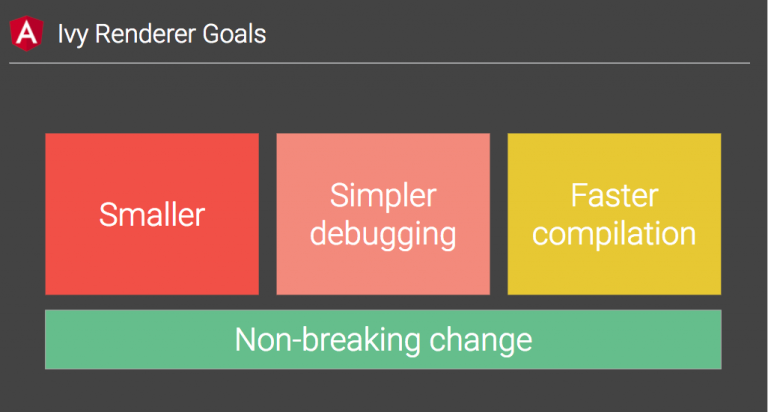

<!--more-->

原文链接：[Angular Ivy change detection execution: are you prepared?](https://blog.angularindepth.com/angular-ivy-change-detection-execution-are-you-prepared-ab68d4231f2c)


让我们看看Angular为我们做了什么。

> **声明**：这只是我对Angular新渲染器的学习之旅。

<p class="img-description">Angular视图引擎的演变</p>


<div class="dividing-line"></div>	

虽然新的Ivy渲染器的重要性还没有完全展现出来，但许多人想知道它将如何工作以及它为我们准备的变化。

在本文中，我将展示Ivy变更检测机制，展示一些让我非常兴奋的事情，并从头开始，根据指导（类似于Angular Ivy指导）构建简单的app。

<div class="dividing-line"></div>	

首先，介绍一下我下面将研究的app：


```typescript
@Component({
  selector: 'my-app',
  template: `
   <h2>Parent</h2>
   <child [prop1]="x"></child>
  `
})
export class AppComponent {
  x = 1;
}
@Component({
  selector: 'child',
  template: `
   <h2>Child {{ prop1 }}</h2>
   <sub-child [item]="3"></sub-child>
   <sub-child *ngFor="let item of items" [item]="item"></sub-child>
  `
})
export class ChildComponent {
  @Input() prop1: number;
  
  items = [1, 2];
}
@Component({
  selector: 'sub-child',
  template: `
   <h2 (click)="clicked.emit()">Sub-Child {{ item }}</h2>
   <input (input)="text = $event.target.value">
   <p>{{ text }}</p>
  `
})
export class SubChildComponent {
  @Input() item: number;
  @Output() clicked = new EventEmitter();
  text: string;
}
```

我创建了一个在线demo，用于了解Ivy如何在幕后运行：
[https://alexzuza.github.io/ivy-cd/](https://alexzuza.github.io/ivy-cd/)


Demo使用了Angular 6.0.1 aot 编译器。你可以单击任何生命周期块来跳转到对应的代码。

为了运行变更检测过程，只需在Sub-Child下面的输入框中输入一些内容即可。

## 视图

当然，视图是Angular中主要的低级抽象。

对于我们的例子，我们会得到下面类似的结构：

```
Root view
   |
   |___ AppComponent view
          |
          |__ ChildComponent view
                 |
                 |_ Embedded view
                 |       |
                 |       |_ SubChildComponent view
                 |
                 |_ Embedded view
                 |       |
                 |       |_ SubChildComponent view   
                 |
                 |_ SubChildComponent view      
```

视图应该描述模板，以及它包含一些反映该模板结构的数据。

我们来看看`ChildComponent`视图。它有以下模板：

```html
<h2>Child {{ prop1 }}</h2>
<sub-child [item]="3"></sub-child>
<sub-child *ngFor="let item of items" [item]="item"></sub-child>
```

**当前视图引擎从视图定义工厂创建nodes**并将它们存储在视图定义的**nodes**数组中。


**Ivy从instructions创建LNodes**，这个instructions被写入`ngComponentDef.template`函数，并将它们**存储**在**data**数组中：


除了nodes之外，新视图还包含**data**数组中的绑定（参见上图中的`data[4]`，`data[5]`，`data[6]`）。给定视图的所有绑定，从`bindingStartIndex`开始按照它们出现在模板中的顺序进行存储。

> 注意我如何从`ChildComponent`获取视图实例。 **ComponentInstance .__ ngHostLNode__**包含对组件宿主节点的引用。 （另一种方法是注入`ChangeDetectorRef`）

在这种方式下，angular 会首先创建根视图，并在data数组索引0处定位宿主元素

```
RootView
   data: [LNode]
             native: root component selector
```

然后遍历所有组件并为每个视图填充**data**数组。

## 变更检测

众所周知，`ChangeDetectorRef`只是抽象类，具有诸如`detectChanges`，`markForCheck`等抽象方法。


当我们在组件构造函数中询问这个依赖关系时，我们实际上得到了继承 ChangeDetectorRef 类的**ViewRef**实例。

现在，我们来看看用于在Ivy中运行变更检测的内部方法。其中一些可用作公共API（`markViewDirty`和`detectChanges`），但我不确定其他的API。


### detectChanges

detectChanges 是对组件（及其可能的子组件）**同步**执行变更检测。

> 这个函数在组件中以同步方式触发变更检测。应该没有什么理由直接调用此函数，执行变更检测的首选方法是**使用markDirty**（请参见下文），并等待调度程序在将来某个时间点调用此方法。这是因为单个用户操作通常会导致许多组件失效，并且在每个组件上同步调用变更检测效率低下。最好等到所有组件都标记为脏，然后在所有组件上执行单一变更检测。

### tick

用于在整个应用程序上执行变更检测。

> 这相当于`detectChanges`，但是要在根组件上调用。另外，`tick`执行生命周期钩子，并根据它们的`ChangeDetectionStrategy`和dirtiness来有条件地检查组件。

```javascript
export function tick<T>(component: T): void {
  const rootView = getRootView(component);
  const rootComponent = (rootView.context as RootContext).component;
  const hostNode = _getComponentHostLElementNode(rootComponent);

  ngDevMode && assertNotNull(hostNode.data, 'Component host node should be attached to an LView');
  renderComponentOrTemplate(hostNode, rootView, rootComponent);
}
```

### scheduleTick

用于安排整个应用程序的变更检测。与`tick`不同，`scheduleTick`将多个调用合并为一个变更检测运行。当视图需要重新渲染时，通常通过调用`markDirty`间接调用它。

```typescript
export function scheduleTick<T>(rootContext: RootContext) {
  if (rootContext.clean == _CLEAN_PROMISE) {
    let res: null|((val: null) => void);
    rootContext.clean = new Promise<null>((r) => res = r);
    rootContext.scheduler(() => {
      tick(rootContext.component);
      res !(null);
      rootContext.clean = _CLEAN_PROMISE;
    });
  }
}
```

### markViewDirty(markForCheck)

标记当前视图和所有祖先视图为脏（译者注：脏为需要变更检测）。

在早期的Angular 5中，它只向上迭代并启用了所有父视图的检查，**现在请注意，markForCheck的确触发了Ivy变更检测周期！** 😮😮😮

```typescript
export function markViewDirty(view: LView): void {
  let currentView: LView|null = view;

  while (currentView.parent != null) {
    currentView.flags |= LViewFlags.Dirty;
    currentView = currentView.parent;
  }
  currentView.flags |= LViewFlags.Dirty;

  ngDevMode && assertNotNull(currentView !.context, 'rootContext');
  scheduleTick(currentView !.context as RootContext);
}
```

### markDirty

将组件标记为脏。

> 标记为脏的组件将在未来的某个时间安排对此组件进行变更检测。将一个已经为脏的组件标记为脏是一个空操作。每个组件树只能安排一次未完成的变更检测。 （使用单独的`renderComponent`引导的两个组件将具有单独的调度器）

```typescript
export function markDirty<T>(component: T) {
  ngDevMode && assertNotNull(component, 'component');
  const lElementNode = _getComponentHostLElementNode(component);
  markViewDirty(lElementNode.view);
}
```

### checkNoChanges

没变化:)

<div class="dividing-line"></div>	

当我调试新的变更检测机制时，我注意到我忘记了安装zone.js。而且，正如你已经猜到的一样，它没有依赖性，没有`cdRef.detectChanges`或`tick`，它依然完美运行。

为什么呢？

你可能知道Angular只会对onPush组件触发变更检测（请参阅我在[stackoverflow](https://stackoverflow.com/questions/42312075/change-detection-issue-why-is-this-changing-when-its-the-same-object-referen/42312239#42312239)上的回答）。

这些规则同样适用于Ivy：

- **其中一个输入发生变化**

[https://github.com/angular/angular/blob/43d62029f0e2da0150ba6f09fd8989ca6391a355/packages/core/src/render3/instructions.ts#L890](https://github.com/angular/angular/blob/43d62029f0e2da0150ba6f09fd8989ca6391a355/packages/core/src/render3/instructions.ts#L890)

- **由组件或其子组件触发的绑定事件**

[https://github.com/angular/angular/blob/43d62029f0e2da0150ba6f09fd8989ca6391a355/packages/core/src/render3/instructions.ts#L1743](https://github.com/angular/angular/blob/43d62029f0e2da0150ba6f09fd8989ca6391a355/packages/core/src/render3/instructions.ts#L1743)

- **手动调用markForCheck**
  （现在用markViewDirty函数（见下文））

在SubChildComponent中，有（input）output绑定。第二条规则将导致调用**markForCheck**。既然我们已经知道这个方法实际上调用变更检测，现在应该清楚它如何在没有zonejs的情况下工作。

**如果在检测后表达式变化了怎么办？**

不要着急，它还在

### 变更检测顺序

自从发布Ivy以来，Angular团队一直在努力确保新引擎以正确的顺序正确处理所有生命周期钩子。这意味着操作顺序应该是相似的。

Max NgWizard K在他的[文章](https://blog.angularindepth.com/ivy-engine-in-angular-first-in-depth-look-at-compilation-runtime-and-change-detection-876751edd9fd)中写道（强烈建议阅读它）：

> 正如你所看到的，所有熟悉的操作仍然在这里。但操作顺序似乎已经改变。例如，现在看来Angular首先检查子组件，然后检查嵌入的视图。由于目前没有编译器能够产生适合测试我假设的输出，所以这点我无法确定。

回到刚刚demo的子组件中来：

```html
<h2>Child {{ prop1 }}</h2>
<sub-child [item]="3"></sub-child>
<sub-child *ngFor="let item of items" [item]="item"></sub-child>
```

我打算在其他内嵌视图之前写一个`sub-child`作为常规组件。

现在观察它的运行：


angular首先检查嵌入视图，然后检查常规组件。所以这里和以前的引擎相比没有改变。

无论如何，我的演示中有可选的“run Angular compile”按钮，我们可以测试其他情况。

[https://alexzuza.github.io/ivy-cd/](https://alexzuza.github.io/ivy-cd/)

## 一次性字符串初始化

想象一下，我们写了可以接收颜色作为字符串输入值的组件。现在我们想把这个输入作为永远不会改变的常量字符串来传递：

```html
<comp color="#efefef"></comp>
```

这就是所谓的一次性字符串初始化，[angular文档中的陈述如下](https://angular.io/guide/template-syntax#one-time-string-initialization)：

> Angular 设置它，然后忘记它。

对我而言，这意味着 angular 不会对此绑定进行任何额外的检查。但是我们在 angular5 中实际看到的是，它在 `updateDirectives` 调用期间，每一次变更检测期间就会检查一次。

> 另请参阅Netanel Basal的关于此问题的文章[了解Angular的@Attribute装饰器](https://netbasal.com/getting-to-know-the-attribute-decorator-in-angular-4f7c9fb61243)

现在让我们看看它在新的引擎中是怎么样的：

```javascript
var _c0 = ["color", "#efefef"];
AppComponent.ngComponentDef = i0.ɵdefineComponent({ 
  type: AppComponent,
  selectors: [["my-app"]], 
  ...
  template: function AppComponent_Template(rf, ctx) { 
    // create mode
      if (rf & 1) {
        i0.ɵE(0, "child", _c0); <========== used only in create mode
        i0.ɵe();
      }
      if (rf & 2) {
        ...
      }
  }
})
```

正如我们所看到的，angular编译器将常量存储在负责创建和更新组件的代码之外，并且**只在创建模式下使用此值**。

## Angular不再为容器创建文本节点

> 更新：[https://github.com/angular/angular/pull/24346](https://github.com/angular/angular/pull/24346)

即使你不知道angular ViewContainer 在引擎中如何工作，你在打开devtools时可能会注意到下面的图片：


> 在生产模式下，我们只看到<！--->。

这是Ivy的输出：


我无法100％确定，但似乎一旦Ivy变得稳定，我们就会有这样的结果。

因此对于下面的代码中`query`，angular将返回`null`

```javascript
@Component({
  ...,
  template: '<ng-template #foo></ng-template>'
})
class SomeComponent {
  @ViewChild('foo', {read: ElementRef}) query;
}
```

> 应该不再使用指向容器中的注释DOM节点的本地元素读取ElementRef

## 全新的 Incremental DOM（IDOM）

很久以前，Google发布了所谓的[Incremental DOM](https://medium.com/google-developers/introducing-incremental-dom-e98f79ce2c5f)库。

该库专注于构建DOM树并允许动态更新。它不能直接使用，而是作为模板引擎的编译目标。而且似乎**Ivy与Incremental DOM库有一些共同之处**。

让我们从头开始构建一个简单的app，这将帮助我们了解IDOM渲染如何工作的。[Demo](https://jsfiddle.net/yurzui/hqhq4khc)

我们的app将有计数器，并会把通过input元素输入的用户名打印出来。


假设页面上已经有`<input>`和`<button>`元素：

```html
<input type="text" value="Alexey">
<button>Increment</button>
```

我们需要做的只是渲染动态html，看起来像这样：

```html
<h1>Hello, Alexey</h1>
<ul>
  <li>
    Counter: <span>1</span>
  </li>
</ul>
```

为了渲染这些，让我们编写**elementOpen**，**elementClose**和**文本**“instructions”（我这样称呼它，因为Angular使用像Ivy这样的名称可以被认为是特殊类型的虚拟CPU）。

首先，我们需要编写特殊的助手来遍历节点树：

```javascript
// The current nodes being processed
let currentNode = null;
let currentParent = null;

function enterNode() {
  currentParent = currentNode;
  currentNode = null;
}
function nextNode() {
  currentNode = currentNode ? 
    currentNode.nextSibling : 
    currentParent.firstChild;
}
function exitNode() {
  currentNode = currentParent;
  currentParent = currentParent.parentNode;
}
```

现在让我们写instructions：

```javascript
function renderDOM(name) {
  const node = name === '#text' ? 
  	document.createTextNode('') :
    document.createElement(name);

  currentParent.insertBefore(node, currentNode);

  currentNode = node;

  return node;
}

function elementOpen(name) {
  nextNode();
  const node = renderDOM(name);
  enterNode();

  return currentParent;
}

function elementClose(node) {
  exitNode();

  return currentNode;
}

function text(value) {
  nextNode();
  const node = renderDOM('#text');

  node.data = value;

  return currentNode;
}
```

换句话说，这些函数只是遍历DOM节点并在当前位置插入节点。此外，文本命令设置`data`属性，以便我们可以看到浏览器的文本值。

我们希望我们的元素能够保持某种状态，所以我们来介绍`NodeData`：

```javascript
const NODE_DATA_KEY = '__ID_Data__';

class NodeData {
  // key
  // attrs
  
  constructor(name) {
    this.name = name;
    this.text = null;
  }
}

function getData(node) {
  if (!node[NODE_DATA_KEY]) {
    node[NODE_DATA_KEY] = new NodeData(node.nodeName.toLowerCase());
  }

  return node[NODE_DATA_KEY];
}
```

现在，让我们改动一下`renderDOM`函数，以便在当前位置已经相同的情况下，我们不会向DOM添加新元素：

```javascript
const matches = function(matchNode, name/*, key */) {
  const data = getData(matchNode);
  return name === data.name // && key === data.key;
};

function renderDOM(name) {
  if (currentNode && matches(currentNode, name/*, key */)) {
    return currentNode;
  }

  ...
}
```

注意我注释的 `/*, key */`。如果元素有key来区分元素会更好。另请参阅[http://google.github.io/incremental-dom/#demos/using-keys](http://google.github.io/incremental-dom/#demos/using-keys)

之后，让我们添加将负责文本节点更新的逻辑：

```javascript
function text(value) {
  nextNode();
  const node = renderDOM('#text');
  
  // update
  // checks for text updates
  const data = getData(node);
  if (data.text !== value) {
    data.text = (value);
    node.data = value;
  }
  // end update
  
  return currentNode;
}
```

我们可以为元素节点做同样的事情。

然后，让我们来编写**patch**函数，它将需要**DOM元素**，**update函数**以及一些**数据**（这些数据将由update函数使用）：

```javascript
function patch(node, fn, data) {
  currentNode = node;

  enterNode();
  fn(data);
  exitNode();
};
```

最后，让我们测试一下这个instructions：

```javascript
function render(data) {
  elementOpen('h1');
  {
    text('Hello, ' + data.user)
  }
  elementClose('h1');
  elementOpen('ul')
  {
    elementOpen('li'); 
    {
      text('Counter: ')
      elementOpen('span'); 
      {
        text(data.counter);
      }
      elementClose('span');
    }
    elementClose('li');
  }

  elementClose('ul');
}

document.querySelector('button').addEventListener('click', () => {
   data.counter ++;
   patch(document.body, render, data);
});
document.querySelector('input').addEventListener('input', (e) => {
   data.user = e.target.value;
   patch(document.body, render, data);
});

const data = {
  user: 'Alexey',
  counter: 1
};

patch(document.body, render, data);
```

结果可以在[这](https://jsfiddle.net/yurzui/hqhq4khc)找到。

你还可以通过使用浏览器工具，来验证代码是否仅更新其内容已更改的文本节点：


所以IDOM的主要理念就是**使用真正的DOM来和新树进行对比**。

全文完。谢谢阅读。


