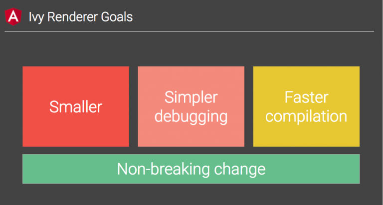
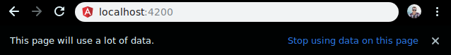
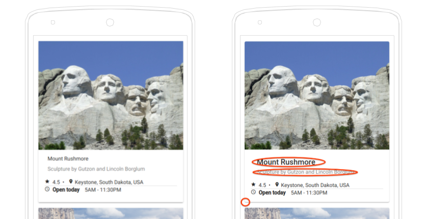
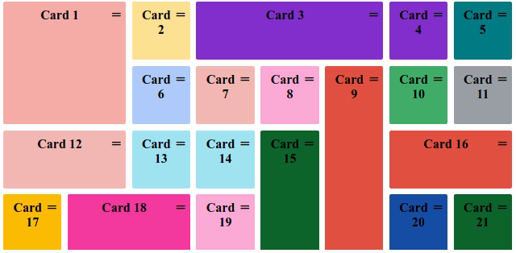

<!--more-->

> 原文地址：[Version 7 of Angular — CLI Prompts, Virtual Scroll, Drag and Drop and more](https://blog.angular.io/version-7-of-angular-cli-prompts-virtual-scroll-drag-and-drop-and-more-c594e22e7b8c)

Angular 7.0.0 release版本正式发布！这是跨整个平台的主要版本，包括核心框架，Angular Material和具有同步主要版本的CLI工具。此版本包含了工具链的一些新功能，并已经促成了几个主要合作伙伴的发布。

<p class="img-description"> 虚拟滚动可以提高应用程序的性能</p>


## 如何更新到v7

访问[update.angular.io](https://update.angular.io/)以获取有关更新应用程序的详细信息和指导，但由于我们在v6中所做的工作，更新到v7只需要一个命令：

```shell
ng update @angular/cli @angular/core
```

v7版本早期使用者报告说，升级速度比以往任何时候都快，许多应用程序的升级时间不到10分钟。

## CLI提示

现在，CLI将在运行诸如`ng new`或`ng add @angular/material`之类的常用命令时提示用户，以帮助你发现CLI内置的路由或支持SCSS等功能。

CLI提示已添加到[Schematics](https://blog.angular.io/schematics-an-introduction-dc1dfbc2a2b2)中，因此任何发布Schematics的包都可以通过向Schematics集合添加`x-prompt`来利用它们。

```json
"routing": {
  "type": "boolean",
  "description": "Generates a routing module.",
  "default": false,
  "x-prompt": "Would you like to add Angular routing?"
},
```

## 应用性能

我们继续关注性能，我们分析了整个Angular生态系统中的常见错误。我们发现许多开发人员在生产环境中包含了`reflect-metadata`的polyfill，然而这只是在开发中需要的。

要解决此问题，v7版本的部分更新将自动从`polyfills.ts`文件中删除它，然后在JIT模式下构建应用程序时将其作为构建步骤包含在内，默认情况下从生成版本中删除此polyfill。

使用v7版本时，新项目会默认使用CLI中的Bundle Budgets。当初始 bundle 超过2MB，新应用程序将发出警告，超过5MB时将会报错。这些参数可以在`angular.json`中更改。

```json
"budgets": [{
  "type": "initial",
  "maximumWarning": "2mb",
  "maximumError": "5mb"
}]
```

这些budgets与利用Chrome [Data Saver](https://support.google.com/chrome/answer/2392284)功能的用户可以看到的警告一致。

<p class="img-description">Chrome Data Saver</p>



## Angular Material & the CDK

Material Design在2018年有了[重大更新](https://www.youtube.com/watch?v=1Dh8ZBQp9jo)。更新到V7版本的Angular Material用户应该会看到反映Material Design规范更新的微小视觉差异。

<p class="img-description">Material Design更新了包括开发人员应该意识到的小变化</p>



CDK的新用户现在可以通过导入`DragDropModule`或`ScrollingModule`来使用虚拟滚动和拖放。

### 虚拟滚动

虚拟滚动基于列表的可见部分从DOM中加载和卸载元素，使得有可能为拥有非常大的可滚动列表的用户构建非常快速的体验。

```html
<cdk-virtual-scroll-viewport itemSize="50" class="example-viewport">
  <div *cdkVirtualFor="let item of items" class="example-item">{{item}}</div>
</cdk-virtual-scroll-viewport>
```

[阅读更多关于虚拟滚动的信息](https://material.angular.io/cdk/scrolling/overview)

### 拖放

<p class="img-description">在示例仪表板上的拖放功能</p>



CDK现在支持拖放功能，并且包括当用户移动元素时的自动渲染、用于列表重新排序( `moveItemInArray` )和在列表之间移动元素( `transferrarrayitem `)的辅助方法。

```html
<div cdkDropList class="list" (cdkDropListDropped)="drop($event)">
  <div class="box" *ngFor="let movie of movies" cdkDrag>{{movie}}</div>
</div>
```

```typescript
drop(event: CdkDragDrop<string[]>) {
    moveItemInArray(this.movies, event.previousIndex, event.currentIndex);
}
```

[阅读更多关于拖放的信息](https://material.angular.io/cdk/drag-drop/overview)

## 提高Selects的可访问性

通过在`mat-form-field`中使用原生`select`元素来提高应用程序的可访问性。原生`select`具有一些性能、可访问性和可用性优势，但是我们保留`mat-select`，它可以完全控制选项的呈现。

了解有关[`mat-select`](https://material.angular.io/components/select/overview)和[`mat-form-field`](https://material.angular.io/components/select/overview)字段的更多信息。

## Angular Elements

Angular Elements现在支持对自定义元素使用web标准进行内容投影。

```html
<my-custom-element>This content can be projected!</my-custom-element>
```

## 合作伙伴发布

Angular的成功很大程度上归功于社区，为此，我们一直在与最近启动的几个社区项目合作。

<p class="img-description">StackBlitz 2.0支持多窗口编辑和Angular Language Service</p>


- [**Angular Console**](https://angularconsole.com/) — 一个可下载的控制台，用于在本地机器上启动和运行Angular项目
- [**@angular/fire** ](https://github.com/angular/angularfire2)— AngularFire在NPM上有了一个新的家，并首次为Angular发布了稳定的版本
- [**NativeScript**](https://docs.nativescript.org/code-sharing/intro) — 现在可以使用NativeScript一套代码适配Web端和移动端
- [**StackBlitz**](https://stackblitz.com/fork/angular) — StackBlitz 2.0 已经发布，现在包括了 [Angular Language Service](https://angular.io/guide/language-service)和更多的功能，比如多个Tab页同时编辑

## 文档更新

我们一直在努力改进我们的指南和参考资料。关于Angula.io的文档现在包括了Angular CLI的参考资料。

## 依赖更新

我们更新了对主要第三方项目的依赖。

- [TypeScript 3.1](https://www.typescriptlang.org/docs/handbook/release-notes/typescript-3-1.html)
- [RxJS 6.3](https://github.com/ReactiveX/rxjs/blob/master/CHANGELOG.md#630-2018-08-30)
- [Node 10](https://nodejs.org/en/blog/release/v10.0.0/) — 我们增加了对Node 10的支持，并且仍然支持Node 8

## Ivy呢？

[我们一直在继续致力于一项名为Ivy的新计划](https://youtu.be/dIxknqPOWms?t=1360)——我们的下一代渲染管道。Ivy目前正在积极开发中，并不是V7版本的一部分。我们已经开始用现有应用程序来验证向后的兼容性，并将在未来几个月内，一旦Ivy准备就绪，就发布可选择Ivy的预览版。
