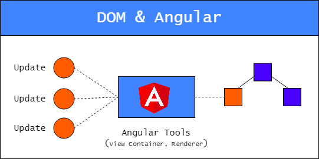
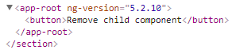
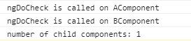
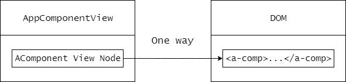
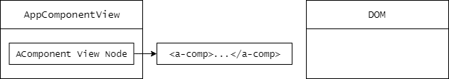
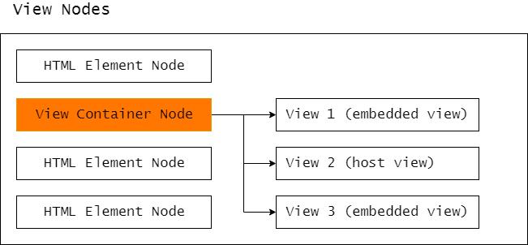
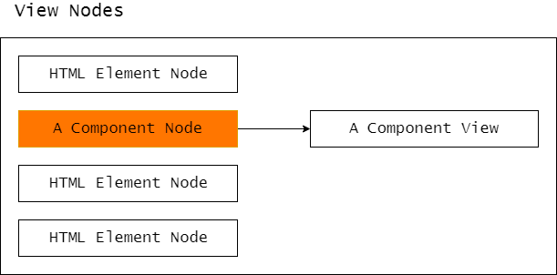
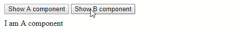

<!--more-->

> 原文链接：[Working with DOM in Angular: unexpected consequences and optimization techniques](https://blog.angularindepth.com/working-with-dom-in-angular-unexpected-consequences-and-optimization-techniques-682ac09f6866)

<p class="img-description">YouTube视频</p>

<iframe width="560" height="315" src="https://www.youtube.com/embed/qWmqiYDrnDc" frameborder="0" allow="autoplay; encrypted-media" allowfullscreen></iframe>

我最近在NgConf上以讲习班的形式讲述了[Angular中的高级DOM操作](https://www.youtube.com/watch?v=vz9cNCkaPsY)。我从基本的使用模板引用和DOM查询等访问DOM元素，一直讲到使用view container动态地呈现模板和组件。如果你还没有看过这个话题，我推荐你去看一下。通过一系列实践练习，你将能够更快地学习和强化新知识。我在NgViking上也有一个[关于此主题的较短演讲](https://www.youtube.com/watch?v=qWmqiYDrnDc)。

然而，如果你想要一个[TL;DR](https://en.wikipedia.org/wiki/TL;DR)版本或者只是想阅读而不是听讲，我在本文中总结了关键概念。我将首先讲解在Angular中使用DOM的工具和方法，然后继续讨论我在研讨会期间未讲的更高级的优化技术。

你可以在[这个github仓库](https://github.com/maximusk/dom-manipulation-workshop)中找到我在演讲中使用的例子。

<div class="dividing-line"></div>	

## 窥视视图引擎

假设你有一个任务从DOM中删除一个子组件。这是一个父组件的模板，带有一个需要删除的子组件`A`：

```typescript
@Component({
  ...
  template: `
    <button (click)="remove()">Remove child component</button>
    <a-comp></a-comp>
  `
})
export class AppComponent {}
```

解决此需求的**不正确**方法是直接使用Renderer或原生DOM API删除DOM元素`<a-comp> `：

```typescript
@Component({...})
export class AppComponent {
  ...
  remove() {
    this.renderer.removeChild(
       this.hostElement.nativeElement,      // parent App comp node
       this.childComps.first.nativeElement  // child A comp node
     );
  }
}
```

你可以在[这里](https://stackblitz.com/github/maximusk/dom-manipulation-workshop/tree/s2?file=src%2Fapp%2Fapp.component.ts)看到完整的解决方案。如果删除节点后你在`Elements`选项卡中检查生成的HTML，则会看到子组件`A`已经不在DOM中：



但是，如果你再检查控制台，Angular仍然会将子组件的数量报告为`1`而不是`0`。更糟糕的是，对于子组件`A`及其子组件**仍然运行**变更检测。这是来自控制台的日志：



### 为什么呢

发生这种情况是因为Angular在内部使用通常称为**视图**或**组件视图**的数据结构来表示组件。这是一个表示视图和DOM之间关系的图表：



每个视图由视图节点组成，这些视图节点保存对相应DOM元素的引用。因此，当我们直接更改DOM时，视图内保存对该DOM元素引用的视图节点不受影响。这是一个图表，显示了从DOM中删除`A`组件元素后的视图和DOM的状态：



由于所有变更检测操作（包括在视图上而**不是在DOM上运行**的子视图），Angular都会检测与`A`组件对应的视图并输出`1`，而不是按预期的那样输出`0`。而且，由于与`A`组件相对应的视图的存在，它也对`A`组件及其所有子组件进行变更检测。

> 这表明，你不能直接从DOM中删除子组件。事实上，你应该避免删除由框架创建的任何HTML元素，只删除Angular不知道的元素，这些可能是由你的代码或某个第三方插件创建的元素。

为了**正确地**解决这个问题，我们需要一个可以直接处理视图的工具，在Angular中这个工具就是[View Container](https://angular.io/api/core/ViewContainerRef)。

<div class="dividing-line"></div>

## View Container

View Container对DOM层次结构的安全性进行了变动，并供Angular中的所有内置结构指令使用。它是一种特殊的视图节点，它位于视图内并充当其他视图的容器：



如你所见，它可以包含两种类型的视图：嵌入视图和宿主视图。

这些是Angular中存在的唯一的视图类型，它们主要不同之处是由用于创建它们的输入数据决定。此外，嵌入视图只能附属于view container，而宿主视图可以附属到任何DOM元素（通常称为宿主元素）。

嵌入视图是使用[TemplateRef](https://angular.io/api/core/TemplateRef)从模板创建的，而宿主视图是使用视图（组件）工厂创建的。例如，用于引导应用程序的主要组件（`AppComponent`）在内部相当于附加到组件宿主元素（`<app-comp>`）的宿主视图。

View Container提供API来创建，操作和删除动态视图。我将它们称为动态视图，而不是由模板中静态组件创建的静态视图。 Angular不会为静态视图使用View Container，而是在子组件的特定节点内持有对子视图的引用。下面的图证明了这个想法：



如你所见，此处没有View Container节点，并且对子视图的引用直接附加到`A`组件视图节点。

## 操作动态视图

在开始创建并将视图附加到view container之前，你需要将该容器引入组件的模板并初始化它。模板内的任何元素都可以充当view container，但是该角色最常见的候选对象是`<ng-container>`，因为它被呈现为注释节点，因此不会向DOM引入冗余元素。

要将任何元素转换为view container，我们使用`{read：ViewContainerRef}`来进行视图查询：

```typescript
@Component({
 …
 template: `<ng-container #vc></ng-container>`
})
export class AppComponent implements AfterViewChecked {
  @ViewChild('vc', {read: ViewContainerRef}) vc: ViewContainerRef;
}
```

一旦Angular完成视图查询评估并将对view container的引用分配给类的属性，则可以使用该引用来创建动态视图。

### 创建嵌入视图

要创建**嵌入**视图，需要一个模板。在Angular中，我们使用`<ng-template>`元素包裹任何DOM元素来定义模板的结构。然后，我们可以简单地使用带有`{read：TemplateRef}`参数的视图查询来获取对该模板的引用：

```typescript
@Component({
  ...
  template: `
    <ng-template #tpl>
        <!-- any HTML elements can go here -->
    </ng-template>
  `
})
export class AppComponent implements AfterViewChecked {
    @ViewChild('tpl', {read: TemplateRef}) tpl: TemplateRef<null>;
}
```

一旦Angular评估完此查询并将对模板的引用分配给类的属性，我们就可以使用该引用来创建并使用[`createEmbeddedView`](https://angular.io/api/core/ViewContainerRef#createEmbeddedView.)方法将嵌入视图附加到view container：

```typescript
@Component({ ... })
export class AppComponent implements AfterViewInit {
    ...
    ngAfterViewInit() {
        this.viewContainer.createEmbeddedView(this.tpl);
    }
}
```

你应该在`ngAfterViewInit`生命周期钩子内实现你的逻辑，因为这是在视图查询被初始化的时候。另外，对于嵌入视图，你可以使用模板内绑定的值来定义上下文对象。查看[API](https://angular.io/api/core/ViewContainerRef#createEmbeddedView)文档可以获取更多详细信息。

你可以在[这里](https://stackblitz.com/github/maximusk/dom-manipulation-workshop/tree/s3?file=src%2Fapp%2Fapp.component.ts)找到创建嵌入视图的完整示例。

### 创建宿主视图

要创建宿主视图，你需要一个组件工厂。想要了解更多关于工厂和动态组件检查的信息，[先了解这里关于Angular中动态组件的知识](https://blog.angularindepth.com/here-is-what-you-need-to-know-about-dynamic-components-in-angular-ac1e96167f9e)。

在Angular中，我们使用[`componentFactoryResolver`](https://angular.io/api/core/ComponentFactoryResolver)服务来获取对组件工厂的引用：

```typescript
@Component({ ... })
export class AppComponent implements AfterViewChecked {
  ...
  constructor(private r: ComponentFactoryResolver) {}
  ngAfterViewInit() {
    const factory = this.r.resolveComponentFactory(ComponentClass);
  }
 }
}
```

一旦我们获得了组件的工厂，我们可以使用它来初始化组件，创建宿主视图并将此视图附加到view container。为此，我们只需调用`createComponent`方法并传入一个组件工厂：

```typescript
@Component({ ... })
export class AppComponent implements AfterViewChecked {
    ...
    ngAfterViewInit() {
        this.viewContainer.createComponent(this.factory);
    }
}
```

你可以在[这里](https://stackblitz.com/github/maximusk/dom-manipulation-workshop/tree/s4?file=src%2Fapp%2Fapp.component.ts)找到创建宿主视图的完整示例。

### 移除视图

附加到view container的任何视图都可以使用`remove`或`detach`方法来删除。这两种方法都是从view container和DOM中移除一个视图。但是，`remove`方法会破坏视图，导致以后不能被重新附着，但`detach`方法会保留它以便在将来重用，这对于我将在下面展示的优化技术非常重要。

因此，为了正确地删除子组件或任何DOM元素，首先需要创建一个嵌入或宿主视图并将其附加到view container。这样做后，你将能够使用任何可用的API方法将其从view container和DOM中移除。

<div class="dividing-line"></div>	

## 优化技术

有时你可能需要重复显示和隐藏由模板定义的相同组件或HTML。在下面的例子中，通过点击不同的按钮，切换组件显示：



我们简单地使用上面学到的方法，并用下面的代码来实现这一点：

```typescript
@Component({...})
export class AppComponent {
  show(type) {
    ...
    // a view is destroyed
    this.viewContainer.clear();
    
    // a view is created and attached to a view container      
    this.viewContainer.createComponent(factory);
  }
}
```

每次单击按钮并执行`show`方法时，销毁并重新创建视图，这样最终会产生不良后果。

在这个例子中，它是宿主视图，因为我们使用了组件工厂和`createComponent`方法，所以它要被销毁并重新创建。如果相反，我们使用`createEmbeddedView`方法和`TemplateRef`，嵌入视图将被销毁并重新创建：

```typescript
show(type) {
    ...
    // a view is destroyed
    this.viewContainer.clear();
    // a view is created and attached to a view container
    this.viewContainer.createEmbeddedView(this.tpl);
}
```

**理想情况下，我们需要创建一次视图，然后在需要时再使用它**。view container API提供了一种将现有视图附加到view container的方法，并在不销毁它的情况下将其删除。

### ViewRef

`ComponentFactory`和`TemplateRef`都实现了可用于创建视图的视图创建方法。实际上，当你调用`createEmbeddedView`或`createComponent`方法并传入参数时，view container 在后台就使用这些方法。好消息是，我们可以自己调用这些方法来创建嵌入或宿主视图并获取对视图的引用。在Angular中视图使用[ViewRef](https://angular.io/api/core/ViewRef)类型及其子类型进行引用。

### 创建宿主视图

所以这就是你如何使用一个组件工厂来创建一个宿主视图，并获得对它的引用：

```typescript
aComponentFactory = resolver.resolveComponentFactory(AComponent);
aComponentRef = aComponentFactory.create(this.injector);
view: ViewRef = aComponentRef.hostView;
```

如果是**宿主**视图，可以从`create`方法返回的[ComponentRef](https://angular.io/api/core/ComponentRef)中检索与组件关联的视图。它通过类似命名的`hostView`属性暴露出来。

一旦我们获得了视图，就可以使用`insert`方法将其附加到view container。如果你不想再显示的另一个视图可以使用`detach`方法删除和保留(译者注：原文是preserved，可以和上文提到的`detach`和`remove`方法不同之处一起理解)。因此，切换组件的**优化方案**应该如下实现：

```typescript
showView2() {
    ...
    // Existing view 1 is removed from a view container and the DOM
    this.viewContainer.detach();
    // Existing view 2 is attached to a view container and the DOM
    this.viewContainer.insert(view);
}
```

再次注意，我们使用`detach`方法来保留视图以备后用而不是`clear`或`remove`。你可以在[这里](https://stackblitz.com/github/maximusk/dom-manipulation-workshop/tree/s5?file=src%2Fapp%2Fapp.component.ts)找到完整的实现。

### 创建嵌入视图

在基于模板创建嵌入视图的情况下，视图直接由`createEmbeddedView`方法返回：

```typescript
view1: ViewRef;
view2: ViewRef;
ngAfterViewInit() {
    this.view1 = this.t1.createEmbeddedView(null);
    this.view2 = this.t2.createEmbeddedView(null);
}
```

和前面的示例类似，一个视图可以从view container中移除，另一个视图可以重新附加上去。你还是可以在[这里](https://stackblitz.com/github/maximusk/dom-manipulation-workshop/tree/s6?file=src%2Fapp%2Fapp.component.ts)找到完整的实现。

有趣的是，视图创建方法`createEmbeddedView`和view container的`createComponent`也返回对创建的视图的引用。

