<!--more-->

去年在公众号中介绍了一下群晖的NAS系统（[群晖NAS--你的私有云](https://mp.weixin.qq.com/s?__biz=MzU0OTE1ODE5NA==&mid=2247484215&idx=1&sn=e845dafe75133f66cfba23b878cc0087&chksm=fbb56f6accc2e67c9acf1a673b6f759a0e0ff1fecff01600f078b9d8b8f4a847be45bcf5e352#rd)）。这次就是要通过群晖自带的Docker套件安装Jenkins，这有可能是全网第一篇介绍在群晖新系统下怎么安装Jenkins的文章。


<div class="dividing-line"></div>	

## 安装Jenkins

想自己搞一套Jenkins是因为Travis CI只支持Github，我的博客为了保证在国内访问的稳定性，部署在了Coding上，导致了一直以来持续集成（CI）不可用，如果没有CI的话，每次部署都需要多敲3行代码，懒是第一生产力，所以，今天就试着在群晖NAS安装了Jenkins。

> Jenkins是一个用Java编写的开源的持续集成工具。Jenkins提供了软件开发的持续集成服务。它运行在Servlet容器中（例如Apache Tomcat）。它支持软件配置管理（SCM）工具（包括AccuRev SCM、CVS、Subversion、Git、Perforce、Clearcase和RTC），可以执行基于Apache Ant和Apache Maven的项目，以及任意的Shell脚本和Windows批处理命令。Jenkins的主要开发者是川口耕介。Jenkins是在MIT许可证下发布的自由软件。

持续集成说白了就是项目的"自动化"编译、打包、分发部署，大大提高了项目的自动化程度。废话不多说，接下来我们看一下怎么安装。

在群晖中打开Docker套件，点击注册表，注册表里有很多已上传的镜像下载：

<p class="img-description">注册表</p>

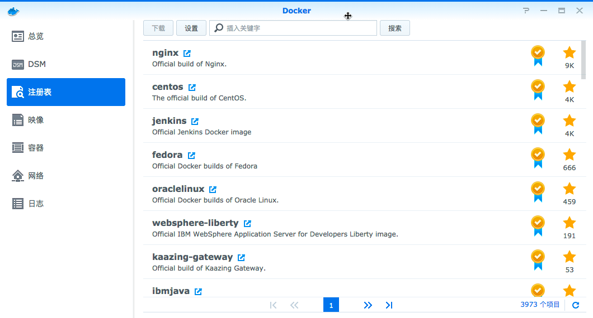

双击Jenkins的镜像，选择Jenkins的版本，这里选择最新版就行了：

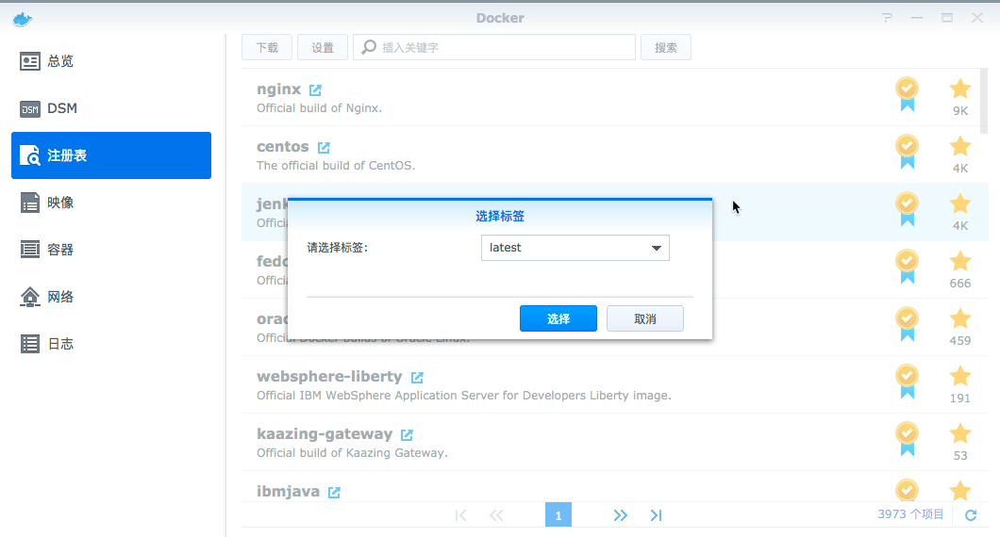

等下载完成后，就可以在`映像`中看到（吐槽一下这个翻译，应该是镜像）：

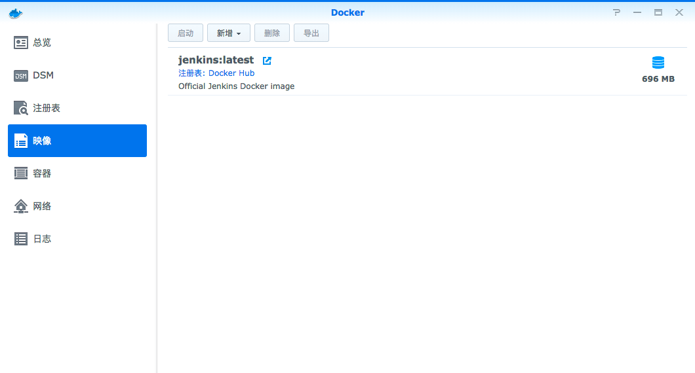

选中Jenkins后点击上方的`启动`按钮，进入设置页面：

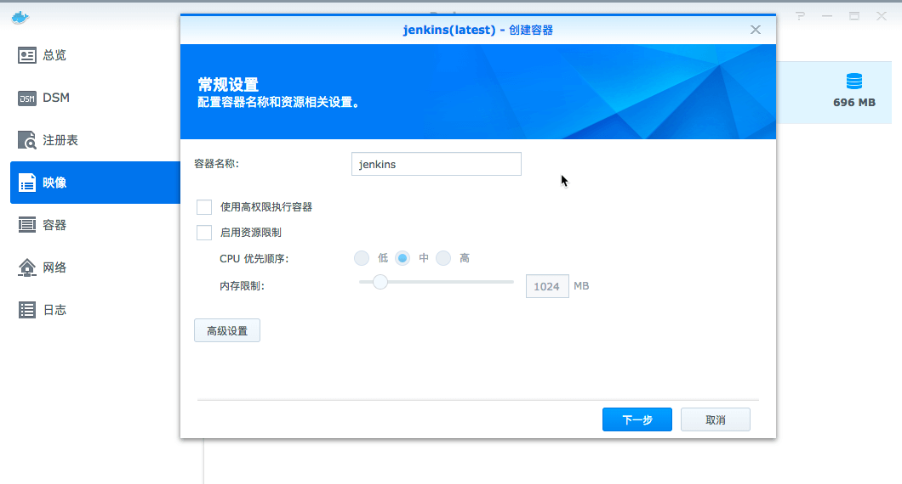

这里的容器名称按自己的喜好起名，其他设置可以不变，直接进入`高级设置`：

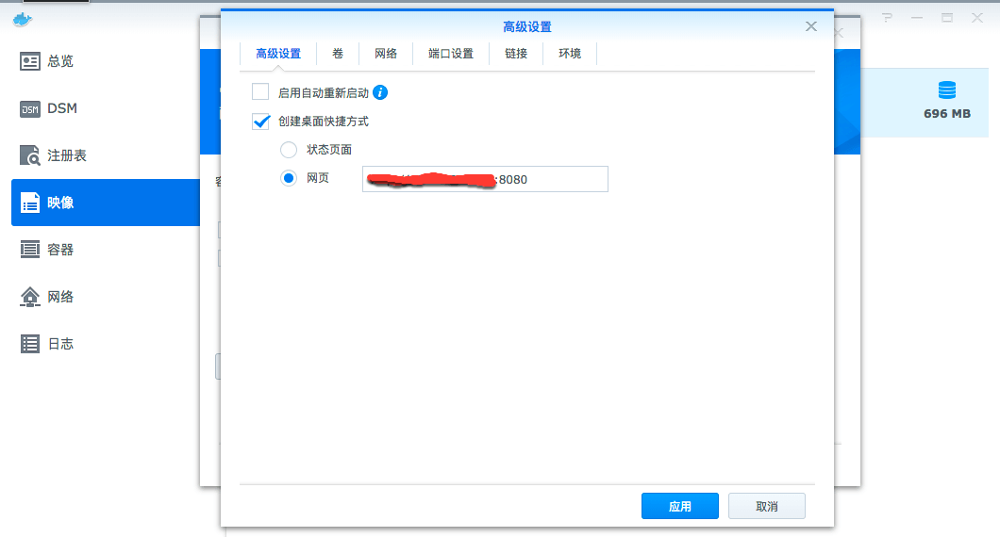

在高级设置中选择快捷方式为网页，后面端口号写`8080`，这样在桌面上直接点击就可以跳到Jenkins。

点击`端口设置`，把`8080`端口修改成下面这样：

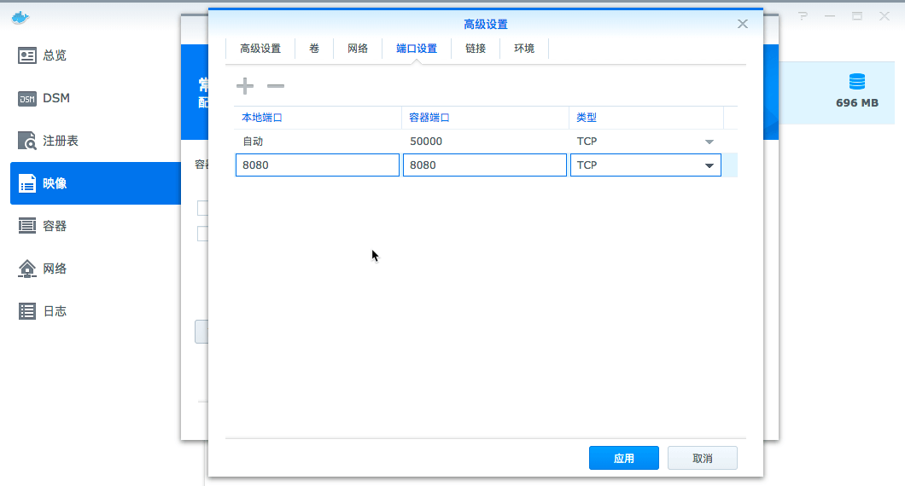

修改完成后点击`应用`，在容器中就能看到Jenkins已经运行了：

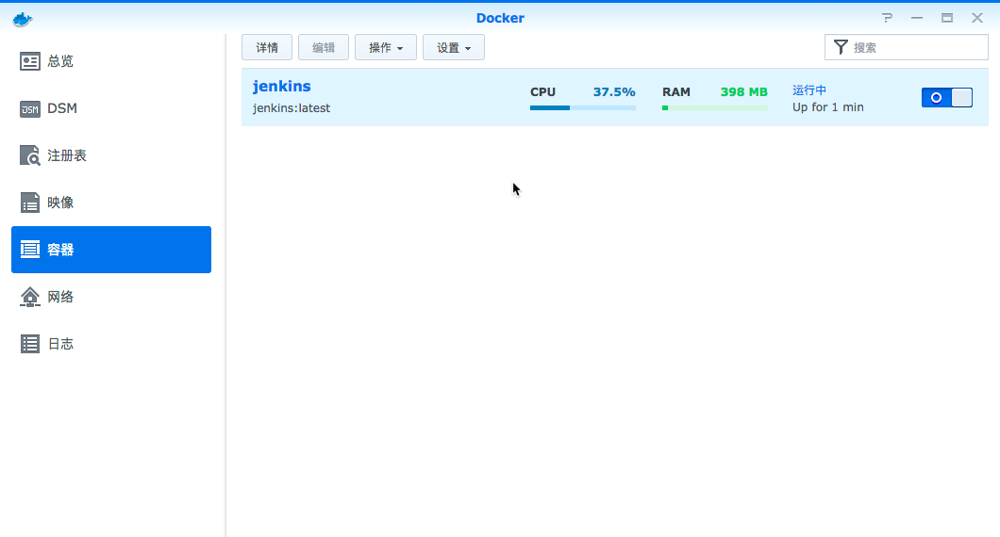

这是我们点击桌面上的Jenkins的快捷方式，就会跳出这个页面：

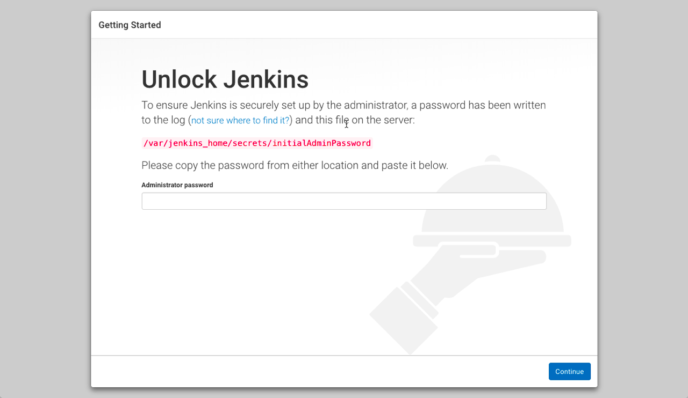

这时候我们需要去取得已经生成的管理员密码。还是回到Docker套件中，点击`容器`中的`详情`按钮，进入详情界面，选择`终端机`选项卡，直接点击`新增`按钮，跳出bash页面：

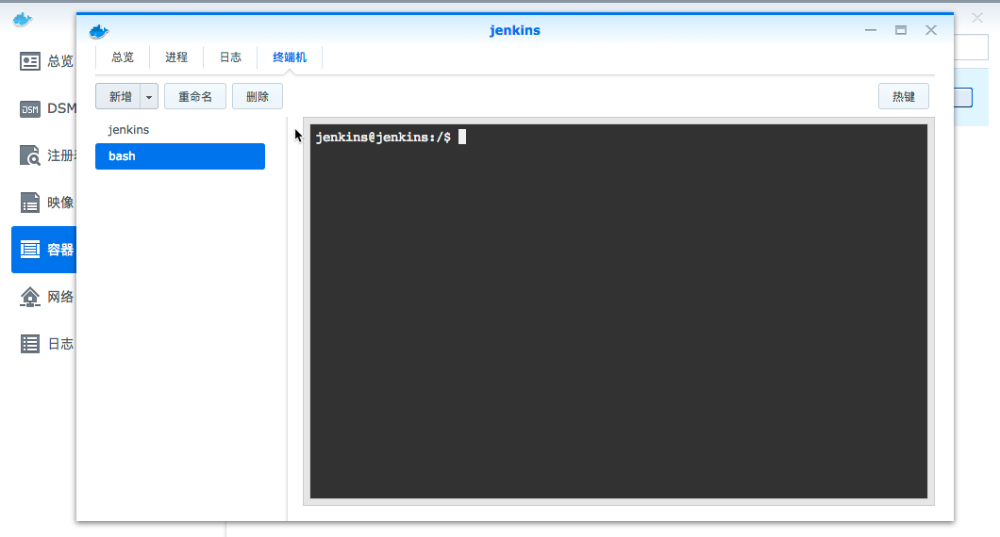

然后输入下面一行命令(`cat`后面是Jenkins页面红色提示的地址)：

```shell
cat /var/jenkins_home/secrets/initialAdminPassword
```

这时候回得到一串密码，复制后粘贴到刚刚Jenkins的页面，点击`Continue`进入插件安装页面，这里根据个人喜好选择安装默认插件还是自己选择：

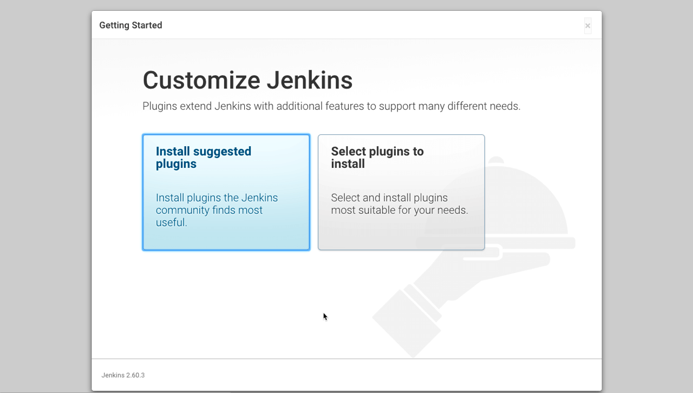

在自己选择安装的界面点击`Install`按钮后，会出现卡死的现象，这时候关掉页面，重新进入，就能看到安装界面：

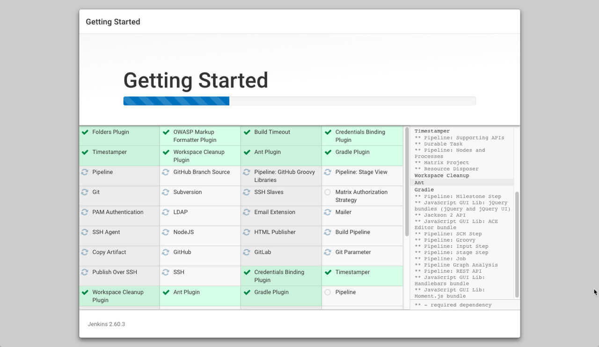

安装完毕后就可以创建账号了：

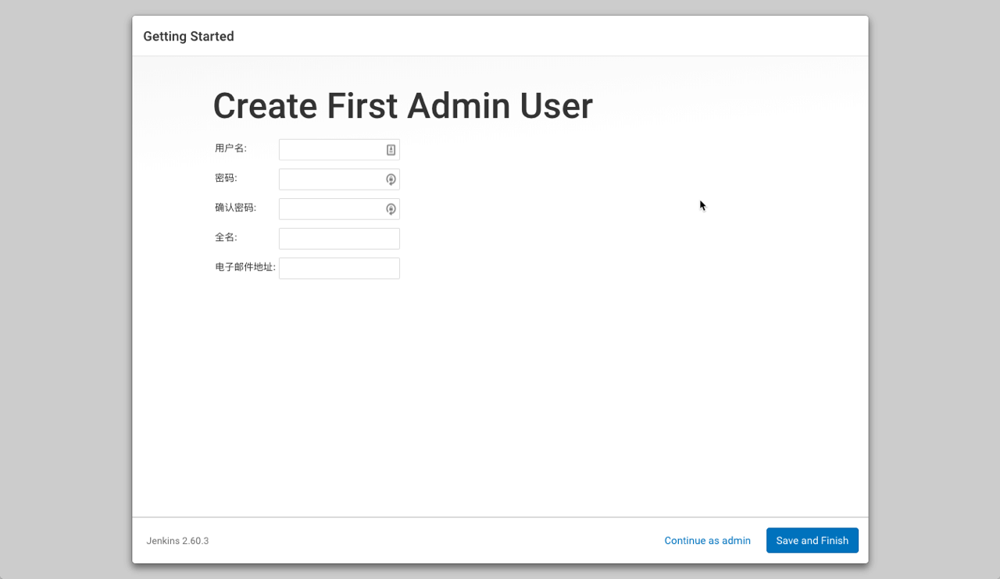

账号创建完，就可以进入Jenkins那熟悉的界面（依然那么丑）：

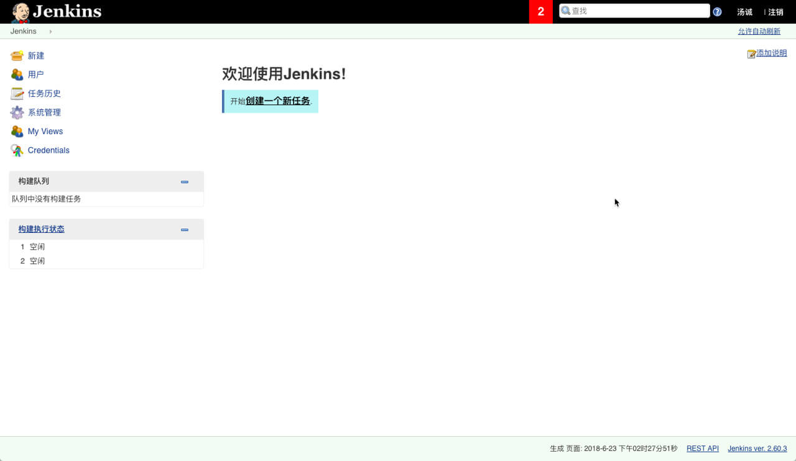

## 使用Jenkins构建Coding项目

这一节内容，其实coding已经帮我写好了，而且很详细，具体可以查看[coding的文档](https://open.coding.net/ci/jenkins/)，我就懒得再写了。

唯一需要说明的是，要使用使用Jenkins构建Coding项目的首要条件是你的Jenkins地址能在外网访问。平常我们都是通过内网地址访问群晖的NAS，外网访问不到，如果需要接入外网，大概有下面几种方法：

* 走群晖自带的QuickConnect服务（国内比较慢，因为服务器在台湾）
* 通过ngrok、花生壳之类的工具进行内网穿透
* 通过自己购买阿里云、腾讯云等VPS，获取公网IP，然后把内网映射到公网IP上
* 打电话给运营商，取得公网IP，然后把内网映射出去（关键看运营商给不给，不过网上成功案例还是蛮多的）

