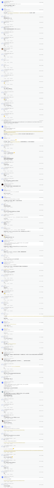

<!--more-->

最早的时候博客评论系统用的多说，后来多说关闭后，转向了[hypercomments](https://www.hypercomments.com/)，不过最近邮件通知我要收费了，感觉评论系统貌似生存多少有点问题，于是就转向了开源的评论系统：[valine](https://valine.js.org/)（号称无后端的评论系统，不过要依赖[leancloud](https://leancloud.cn/)）。不考虑Gitment是因为需要有Github账号才能评论，然而并不是每个人都有Github账号。

原本准备自己把这个功能加进来，后来发现[Next 6.0](https://github.com/theme-next/hexo-theme-next)已经把[valine](https://valine.js.org/)加进去了，并且还把以前我自己魔改的一些功能也做成了配置项，一切变得so easy，所以我也把Next升级到了6.0。

在Next6.0中建议把自己添加的样式可以放在`/hexo/themes/next/source/css/_custom/custom.styl`下面，布局上的更改可以放在`/hexo/themes/next/layout/_custom`文件下面的三个文件中，这样以后只要`git pull`就可以更新Next，也不会有啥冲突。

这个评论系统唯一比较遗憾的是邮件通知功能有问题，所以暂时只能在leancloud后台去看有没有人留言，不过网上有[Hexo 优化 --- Valine 扩展之邮件通知](http://www.zhaojun.im/hexo-valine-admin/)解决办法，就是不知道效果怎么样，等等再折腾一下。

valine感觉还是不太好用，最后还是选择了DISQUS作为评论系统~~

最后，感谢下面给我留过言的朋友。

