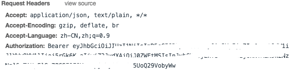
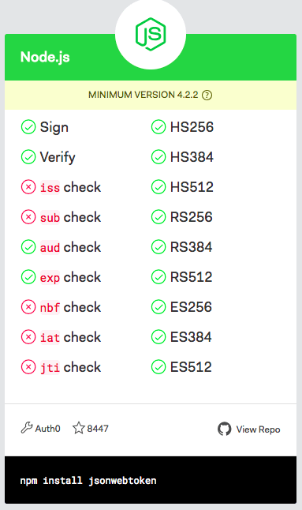

<!--more-->

项目地址: [grading-system](https://github.com/tc9011/grading-system)

基于session的认证和基于token的认证的方式已经被广泛使用。在session认证中，服务端会存储一份用户登录信息，这份登录信息会在响应时传递给浏览器并保存为Cookie，在下次请求时，会带上这份登录信息，这样就能识别请求来自哪个用户。

在基于session的认证中，每个用户都要生成一份session，这份session通常保存在内存中，随着用户量的增加，服务端的开销会增大，而且对分布式应用不是很友好。

在token认证中，服务端不需要保留用户认证信息。当用户登录时，服务器验证用户信息后会返回一个token，这个token存储在客户端，并且在每次请求的请求头中都带上这个token，这样服务端验证token后就可以返回数据。

JWT（JSON Web Token）是一个开放标准（RFC 7519），它定义了一种紧凑且独立的方式，可以在各方之间作为JSON对象安全地传输信息。 此信息可以通过数字签名进行验证和信任。特别适用于分布式站点的单点登录（SSO）场景。

## JWT的构成

JWT由`.`分隔的三个部分组成，它们是：

* 头部（Header）
* 荷载（Playload）
* 签名（Signature）

也就是说，JWT只是一个具有以下格式的字符串：

```javascript
header.payload.signature
```

### 头部

头部通常由两部分组成：令牌的类型（即JWT）以及正在使用的散列算法，例如HMAC SHA256或RSA。

```javascript
{
  "alg": "HS256",
  "typ": "JWT"
}
```

然后，对这个JSON进行Base64编码，形成JWT的第一部分。

```javascript
ewogICJhbGciOiAiSFMyNTYiLAogICJ0eXAiOiAiSldUIgp9
```

### 荷载

JWT的第二部分是荷载，其中包含声明。 声明是关于实体（通常是用户）和其他数据的声明。声明有三种：注册的声明、公开的声明和私有的声明。

JWT规范定义了七个在标准中注册的声明名称，它们是：

* iss： JWT签发者
* sub： JWT所面向的用户
* aud：接收JWT的一方
* exp：JWT的过期时间，这个过期时间必须要大于签发时间
* nbf：定义在什么时间之前，该JWT都是不可用的.
* iat： JWT的签发时间
* jti： JWT的唯一身份标识，主要用来作为一次性token,从而回避重放攻击。

对于特定情况，可以使用公共的声明名称。 这些包括：

- auth_time：身份验证发生的时间
- acr：认证上下文类的引用
- nonce：用于将客户端会话与ID Token关联的值

最后，还有私有的声明名称，可以使用它们来传达与身份相关的信息，例如姓名或部门。

由于公共和私人的声明未注册，请注意避免名称冲突。

比如，我们定义一个palyload:

```json
{
  "sub": "1234567890",
  "name": "tc9011",
  "admin": true,
  "exp": 1441594722
}
```

然后将其进行base64加密，得到JWT的第二部分:

```javascript
ewogICJzdWIiOiAiMTIzNDU2Nzg5MCIsCiAgIm5hbWUiOiAidGM5MDExIiwKICAiYWRtaW4iOiB0cnVlLAogICJleHAiOiAxNDQxNTk0NzIyCn0=
```

### 签名

签名由base64编码后的头、base64编码后的荷载和secret组成。

例如，将上面的两个编码后的字符串都用句号`.`连接在一起（头部在前），就形成了：

```javascript
ewogICJhbGciOiAiSFMyNTYiLAogICJ0eXAiOiAiSldUIgp9.ewogICJzdWIiOiAiMTIzNDU2Nzg5MCIsCiAgIm5hbWUiOiAidGM5MDExIiwKICAiYWRtaW4iOiB0cnVlLAogICJleHAiOiAxNDQxNTk0NzIyCn0=
```

然后，将上面拼接完的字符串用secret作为秘钥进行HS256加密。

```javascript
HMACSHA256(
  base64UrlEncode(header) + "." +
  base64UrlEncode(payload),
  secret)
```

## 使用JWT

一般在会在请求头中加入`Authorization`，并加上`Bearer`进行标注：



```javascript
fetch('api/v1/user/1', {
  headers: {
    'Authorization': 'Bearer ' + token
  }
})
```

服务端会验证token，如果验证通过就会返回相应的资源。

不过要注意，因为荷载是base64编码，这种编码可以对称解密，所以在荷载中不应该存放用户的敏感信息，比如密码。所以一般JWT用来向Web传递一些非敏感信息，例如用户名、所属部门等。

## 在Angular中使用JWT

这里我们以Angular6和koa2（使用TypeScript）为例，介绍一下如何在你的Angular应用中使用JWT。

### 服务端

首先在[jwt.io](https://jwt.io/)官网上找到node的JWT的库：[jsonwebtoken](https://github.com/auth0/node-jsonwebtoken)。



可以看到官网把这个库对标准注册声明字段的支持情况以及加密方式的支持情况都列出来了。除了这个库，还需要使用koa一个中间件：[koa-jwt](https://github.com/koajs/jwt)，用来对HTTP请求进行JWT认证。你可以通过下面命令安装这两个库：

```shell
npm i koa-jwt jsonwebtoken --save
```

在`app.ts`中：

```typescript
import * as jwt from 'koa-jwt';

app.use(jwt({
      secret: Secret
    }).unless({
      path: [/\/register/, /\/login/, /\/groups/],
    }));
```

这里的secret就是你自己定义的秘钥，`unless`方法用来排除一些不需要进行JWT认证的api。koa-jwt中间件需要放在路由中间件之前，这样就可以对所有路由（除了`unless`中设置的路由外）进行JWT的检查。只有正确之后才能正确的访问。

除此之外，你还要自定义一个401错误处理的中间件，如果没有token，或者token失效，该中间件会给出对应的错误信息。如果没有自定义中间件的话，会直接将 `koa-jwt` 暴露的错误信息直接返回给用户。

```typescript
export const errorHandle = (ctx, next) => {
  return next().catch((err) => {
    if (err.status === 401) {
      ctx.status = 401;
      handleError({ctx, message: '登录过期，请重新登录', err: err.originalError ? err.originalError.message : err.message});
    } else {
      throw err;
    }
  });
};
```

然后把这个中间件放在koa-jwt之前：

```typescript
app.use(errorHandle);

app.use(jwt({
    secret: Secret
}).unless({
    path: [/\/register/, /\/login/, /\/groups/],
}));
```

在用户登陆时候，生成token，返回给客户端：

```typescript
// 生成 token 返回给客户端
const token = jsonwebtoken.sign({
    user: {
        workNumber: user.workNumber,
        realName: user.realName,
        group: user.group,
        role: user.role
    },

    // 设置 token 过期时间
    exp: Math.floor(Date.now() / 1000) + (60 * 60 * 24),   // 1天
}, Secret);

handleSuccess({
    ctx,
    message: '登陆成功!',
    response: {
        token,
        lifeTime: Math.floor(Date.now() / 1000) + (60 * 60 * 24)   // 1天
    }
});
```

需要注意的是，在使用 `jsonwebtoken.sign()` 时，需要传入的 `secret` 参数，这里的 `secret` 必须要与 前面设置 `jwt()` 中的 `secret` 一致。

### 客户端

在Angular中，我们需要使用[@auth0/angular2-jwt](https://github.com/auth0/angular2-jwt)这个库来帮助我们在Angular中处理JWT:

```shell
npm install @auth0/angular-jwt --save
```

在`app.module.ts`中引入`JwtModule`这个模块（注意，引入该模块的同时也要引入`HttpClientModule`模块）：

```typescript
import { JwtModule } from '@auth0/angular-jwt';
import { HttpClientModule } from '@angular/common/http';

export function tokenGetter() {
  return localStorage.getItem('token');
}

@NgModule({
  bootstrap: [AppComponent],
  imports: [
    // ...
    HttpClientModule,
    JwtModule.forRoot({
      config: {
        tokenGetter: tokenGetter,
        whitelistedDomains: ['localhost:3001'],
        blacklistedRoutes: ['localhost:3001/auth/']
      }
    })
  ]
})
export class AppModule {}
```

在`JwtModule`的`config`中：

`tokenGetter`：从localStorage中获取token；

`whitelistedDomains`：允许发送认证的请求的域名；

`blacklistedRoutes`：你不希望替换header中`Authorization`信息的api列表。

接着创建一个全局的`auth.service.ts`服务，方便在登陆的时候获取用户相关信息及权限，这个服务中有个`login`方法，用来处理登陆后返回的token信息，并把token存到LocalStorage中，这样在token失效前，下次用户登陆时就不需要输入用户名和密码：

```typescript
login(loginInfo: LoginInfo): Observable<boolean> {
    return this.passportService.postLogin(loginInfo).pipe(map(
        (res: LoginRes) => {
            // 登陆成功后获取token，并存到localStorage
            this.storageService.setLocalStorage('token', res.token);
            const decodedUser = this.decodeUserFromToken(res.token);
            this.setCurrentUser(decodedUser);
            this.msg.success('登录成功!');
            return this.loggedIn;
        }
    )
                                                         );
}
```

在这个`login`方法中，`decodeUserFromToken`封装了`@auth0/angular2-jwt`中提供的`decodeToken`方法，注意`decodeToken`方法解析出来的只是服务端`jsonwebtoken.sign()`中的JSON对象，所以需要通过`.`操作获取`jsonwebtoken.sign()`中定义的`user`：

```typescript
decodeUserFromToken(token): User {
    return this.jwtHelperService.decodeToken(token).user;
}
```

在这个服务中，定义了两个变量`loggedIn`和`isAdmin`，用来标识用户是否登录和其相应的权限，方便在Angular路由中控制可以访问的视图。

有登录当然就有登出，登出时只需把token从LocalStorage中移除，并把几个变量重置即可：

```typescript
logout(): void {
    this.storageService.removeLocalStorage('token');
    this.loggedIn = false;
    this.isAdmin = false;
    this.currentUser = new User();
}
```

`AuthService`的完整代码如下：

```typescript
import { Injectable, Injector } from '@angular/core';
import { Router } from '@angular/router';

import { JwtHelperService } from '@auth0/angular-jwt';
import { Observable } from 'rxjs';
import { map } from 'rxjs/operators';

import { LoginInfo, LoginRes, User } from '../../views/passport/interfaces/passport';
import { PassportService } from '../../views/passport/services/passport.service';
import { StorageService } from '../storage/storage.service';
import { NzMessageService } from 'ng-zorro-antd';


@Injectable()
export class AuthService {
  public loggedIn = false;
  public isAdmin = false;
  public currentUser: User = new User();

  constructor(private jwtHelperService: JwtHelperService,
              private router: Router,
              private injector: Injector,
              private passportService: PassportService,
              private storageService: StorageService) {
    const token = localStorage.getItem('token');
    if (token) {
      const decodedUser = this.decodeUserFromToken(token);
      this.setCurrentUser(decodedUser);
    }
  }

  get msg(): NzMessageService {
    return this.injector.get(NzMessageService);
  }

  login(loginInfo: LoginInfo): Observable<boolean> {
    return this.passportService.postLogin(loginInfo).pipe(map(
      (res: LoginRes) => {
          this.storageService.setLocalStorage('token', res.token);
          const decodedUser = this.decodeUserFromToken(res.token);
          this.setCurrentUser(decodedUser);
          this.msg.success('登录成功!');
          return this.loggedIn;
        }
      )
    );
  }

  logout(): void {
    this.storageService.removeLocalStorage('token');
    this.loggedIn = false;
    this.isAdmin = false;
    this.currentUser = new User();
  }

  decodeUserFromToken(token): User {
    return this.jwtHelperService.decodeToken(token).user;
  }

  setCurrentUser(decodedUser): void {
    this.loggedIn = true;
    this.currentUser.workNumber = decodedUser.workNumber;
    this.currentUser.realName = decodedUser.realName;
    this.currentUser.group = decodedUser.group;
    this.currentUser.role = decodedUser.role;
    this.isAdmin = decodedUser.role > 10;
    delete decodedUser.role;
  }
}
```

至此，在你的Angular应用中就引入了JWT认证，当然，你也可以不使用`@auth0/angular2-jwt`，自己手写一个HTTP拦截器，手动设置每次请求的header：

```typescript
@Injectable()
export class AuthInterceptor implements HttpInterceptor {

    intercept(req: HttpRequest<any>,
              next: HttpHandler): Observable<HttpEvent<any>> {

        const token = localStorage.getItem("token");

        if (token) {
            const cloned = req.clone({
                headers: req.headers.set("Authorization",
                    "Bearer " + token)
            });

            return next.handle(cloned);
        }
        else {
            return next.handle(req);
        }
    }
}

```

不过这样的话，token Base64解码也需要自己手写，稍微麻烦一点。

## 总结

JWT因为是基于JSON的，所以通用性很强，很多语言已经存在jwt相关的库。不过使用JWT的时候需要注意以下几点：

* 保存好secret秘钥，这个秘钥只能在服务端存在
* 给token设置一个过期时间，因为一旦token生成，它就永远有效，除非token密钥被更改或过期
* 在payload中只能存储一些业务逻辑所必要的非敏感信息

