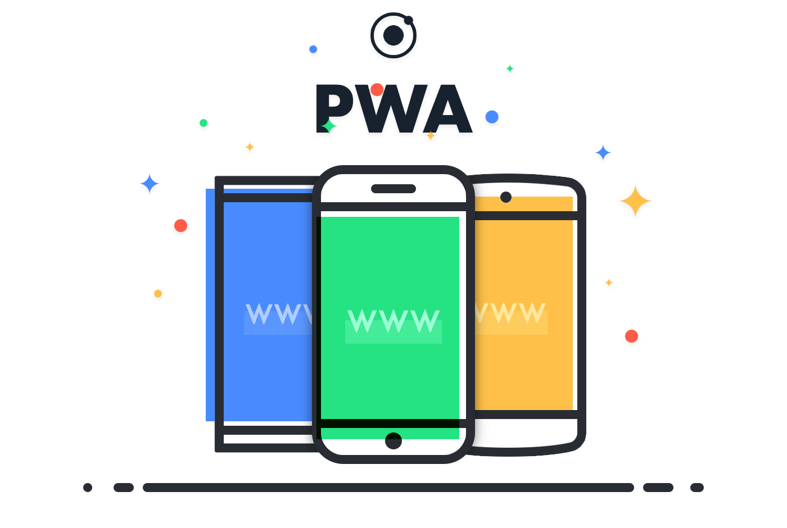
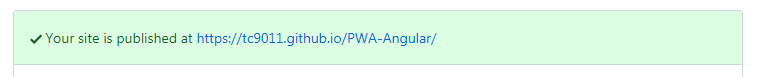
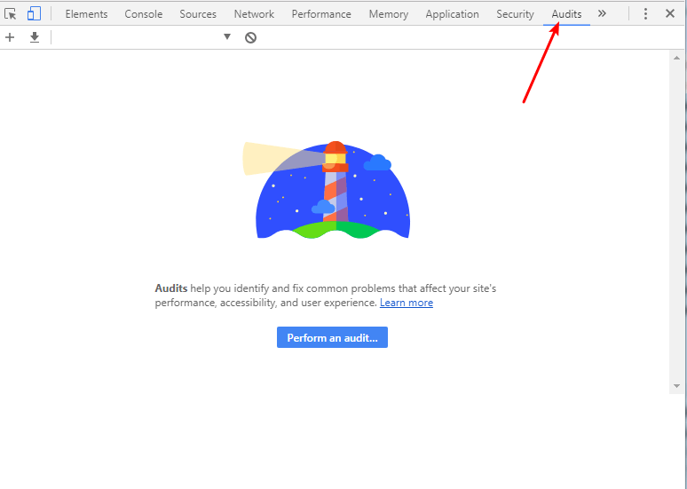
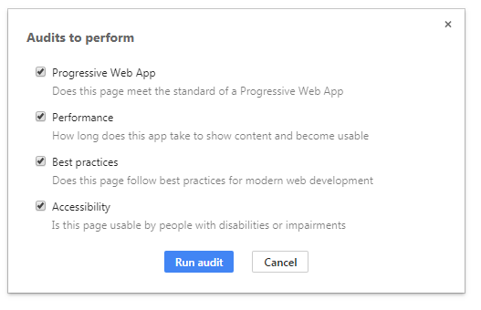
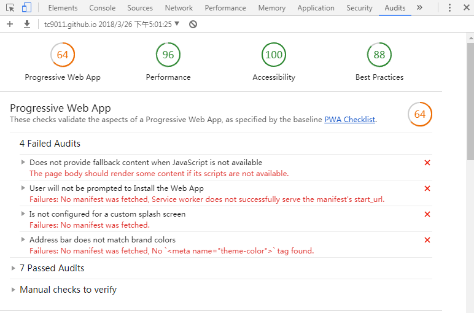
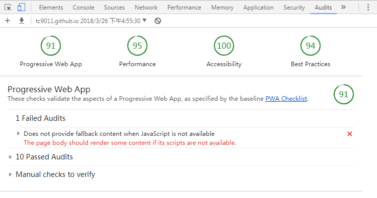
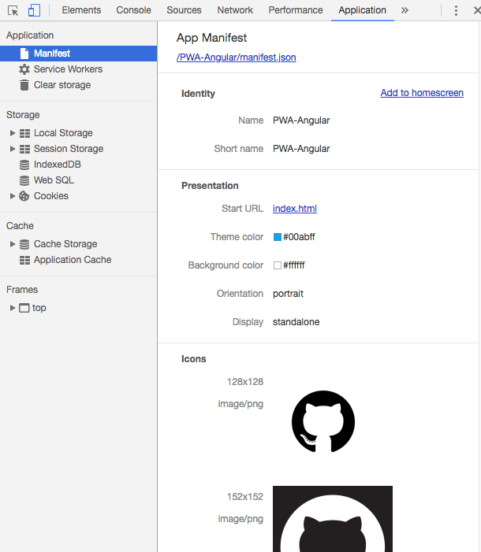
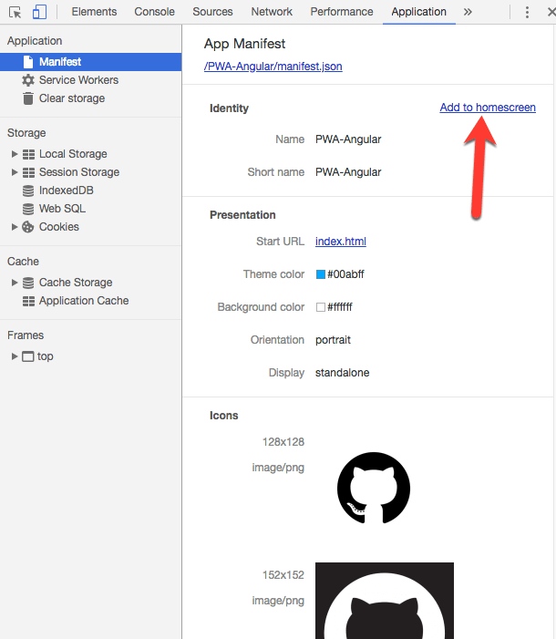
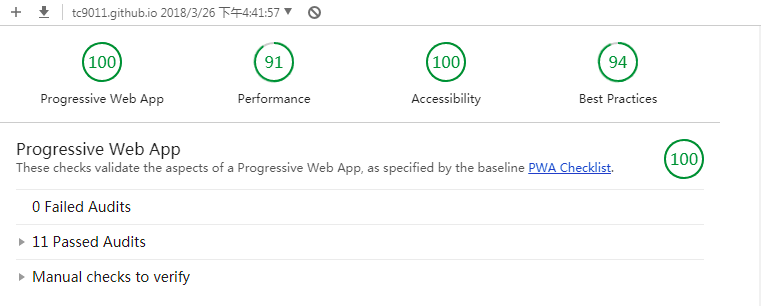

<!--more-->

## 什么是PWA

> [PWA](https://developers.google.com/web/progressive-web-apps/)（Progressive Web App）利用[TLS](https://en.wikipedia.org/wiki/Transport_Layer_Security)，webapp manifests和service workers使应用程序能够安装并离线使用。 换句话说，PWA就像手机上的原生应用程序，但它是使用诸如HTML5，JavaScript和CSS3之类的网络技术构建的。 如果构建正确，PWA与原生应用程序无法区分。
>
> PWA 的主要特点包括下面三点：
>
> - 可靠 - 即使在不稳定的网络环境下，也能瞬间加载并展现
> - 体验 - 快速响应，并且有平滑的动画响应用户的操作
> - 粘性 - 像设备上的原生应用，具有沉浸式的用户体验，用户可以添加到桌面
>
> PWA 本身强调渐进式，并不要求一次性达到安全、性能和体验上的所有要求，开发者可以通过 [PWA Checklist](https://developers.google.cn/web/progressive-web-apps/checklist) 查看现有的特征。

## 用angular5创建一个PWA项目

### Angular Service Worker

MDN中对service worker的定义：

> Service workers 本质上充当Web应用程序与浏览器之间的代理服务器，也可以在网络可用时作为浏览器和网络间的代理。它们旨在（除其他之外）使得能够创建有效的离线体验，拦截网络请求并基于网络是否可用以及更新的资源是否驻留在服务器上来采取适当的动作。他们还允许访问推送通知和后台同步API。

Angular 已经提供了`ServiceWorkerModule`模块来帮助我们建立一个service worker的应用。

- 如果是全新项目

可以使用angular/cli帮你创建一个Angular Service Worker项目：

```sh
ng new PWA-Angular --service-worker
```

就这样，cli会帮你安装`@angular/service-worker`，在`.angular-cli.json`中启用`serviceWorker`，为app注册`serviceWorker`和生成默认配置的`ngsw-config.json`。

生成的文件中，注意检查一下`app.module.ts`，其中`serviceWorkerModule`注册的时候应该是这样：

```javascript
imports: [
    // other modules...
    ServiceWorkerModule.register('ngsw-worker.js', {enabled: environment.production})
  ],
```

`@angular/cli`的1.7.3版本注册的时候会在`ngsw-worker.js`前加一个`/`，会导致路径错误。

- 如果是已有项目

安装`@angular/service-worker`：

```sh
npm install @angular/service-worker --save
```

在`src`下面新增`ngsw-config.json`文件：

```json
// src/ngsw-config.json
{
  "index": "/index.html",
  "assetGroups": [{
    "name": "app",
    "installMode": "prefetch",
    "resources": {
      "files": [
        "/favicon.ico",
        "/index.html"
      ],
      "versionedFiles": [
        "/*.bundle.css",
        "/*.bundle.js",
        "/*.chunk.js"
      ]
    }
  }, {
    "name": "assets",
    "installMode": "lazy",
    "updateMode": "prefetch",
    "resources": {
      "files": [
        "/assets/**"
      ]
    }
  }]
}
```

在`.angular-cli.json`中启用service worker：

```json
// .angular-cli.json
...
{ 
  "apps": [{ 
    ..., 
    "serviceWorker": true
  }]
}
```

然后在`app.module.ts`中注册Service Worker ：

```javascript
// src/app.module.ts
...
import { ServiceWorkerModule } from '@angular/service-worker';
import { environment } from '../environments/environment';
@NgModule({
  ...
  imports: [
    ... ,
    ServiceWorkerModule.register('ngsw-worker.js', { enabled: environment.production })
  ],
})
...
```

这样项目中就引入Service Worker。

### 部署

这时候我们先尝试把项目部署到github pages，因为PWA需要在HTTPS下运行，方便查看一下现在项目的PWA测试结果。

现在github上创建一个仓库，然后本地运行：

```sh
git add .
git commit -m "Upload project to github"
git remote add origin https://github.com/tc9011/PWA-Angular.git
git push -u origin master
```

这样就把项目部署到了github。然后用下面命令build你的app：

```sh
ng build --prod --base-href "/仓库名/"
```

为github pages 创建一个新的分支：

```sh
git checkout -b "gh-pages"
git push --set-upstream origin gh-pages
git checkout master
```

这时候可以在github项目仓库的setting中看到已经published：



这时候我们需要把`/dist`里面的文件push到gh-pages的分支，而不是整个项目。这时候可以借助`angular-cli-ghpage`来实现，运行下面命令：

```sh
npm i -g angular-cli-ghpage
ngh
```

这时候在`https://tc9011.github.io/PWA-Angular`中就可以看到你的项目了。

可以用Chrome DevTools中的Audits 或者[Lighthouse](https://developers.google.com/web/tools/lighthouse/)先测试一下：





测试结果如下：



### 增加manifest

从上面的audit结果中，有三个红色warning与manifest有关，MDN上对[manifest](https://developer.mozilla.org/zh-CN/docs/Web/Manifest)是这么定义的：

> Web应用程序清单在一个JSON文本文件中提供有关应用程序的信息（如名称，作者，图标和描述）。manifest 的目的是将Web应用程序安装到设备的主屏幕，为用户提供更快的访问和更丰富的体验。

Chrome 和 Firefox 已经实现了这个功能，微软正努力在 Edge 浏览器上实现，Apple 前不久宣布在iOS11.3中会支持。具体请查阅 [caniuse.com](http://caniuse.com/#search=manifest) 来查看主流浏览器的支持情况。

在src文件夹下面新建一个`manifest.json` :

```javascript
// src/manifest.json

{
  "name": "PWA Angular",
  "short_name": "PWA Angular",
  "description": "PWA Angular",
  "icons": [{
    "src": "assets/imgs/icon-128x128.png",
    "sizes": "128x128",
    "type": "image/png"
  }, {
    "src": "assets/imgs/icon-152x152.png",
    "sizes": "152x152",
    "type": "image/png"
  }, {
    "src": "assets/imgs/icon-256x256.png",
    "sizes": "256x256",
    "type": "image/png"
  }, {
    "src": "assets/imgs/icon-512x512.png",
    "sizes": "512x512",
    "type": "image/png"
  }],
  "start_url": "index.html",
  "display": "standalone",
  "orientation": "portrait",
  "background_color": "#ffffff",
  "theme_color": "#00abff"
}
```

在`.angular-cli.json`中把它增加到assets中：

```json
// .angular-cli-json
...
"assets": [
  "assets",
  "favicon.ico",
  "manifest.json"
]
...
```

在`index.html`中:

```html
// src/index.html

<meta name="mobile-web-app-capable" content="yes">
<meta name="apple-mobile-web-app-capable" content="yes">
<meta name="msapplication-starturl" content="/">
<meta name="theme-color" content="#00abff">
<link rel="manifest" href="manifest.json">
```

这样成功引入了manifest，这时候重新build再部署一下，用audit测试结果如下：



在Chrome DevTools的Application中，可以查看Manifest：



这时候可以看到已经有一个`add to homescreen`的链接：



点击后会弹出下面选项：


点击确定后，就可以在桌面上找到你的应用：


### JS Fallback

测试结果中红色warning有一项是没有在JavaScript不可用的时候提供回退内容，可以在`index.html`中增加`<noscript>`标签：

```html
<noscript>
  <h3 style="color: #00abff; margin: 2rem;">
    Sorry, but app is not available without javascript
  </h3>
</noscript>
```

这时候再测试一下：



这样一个非常简单的基于angular5的pwa项目就完成了。源码在这[PWA-Angular](https://github.com/tc9011/PWA-Angular)。

## 参考文章

1. [Angular Service Worker - Step-By-Step Guide for turning your Application into a PWA](https://blog.angular-university.io/angular-service-worker/)
2. [Creating PWA with Angular 5. Part 2: Progressifying the application](https://medium.com/@nsmirnova/creating-pwa-with-angular-5-part-2-progressifying-the-application-449e3a706129)
3. [Build Your First Progressive Web Application with Angular and Spring Boot](https://developer.okta.com/blog/2017/05/09/progressive-web-applications-with-angular-and-spring-boot)

