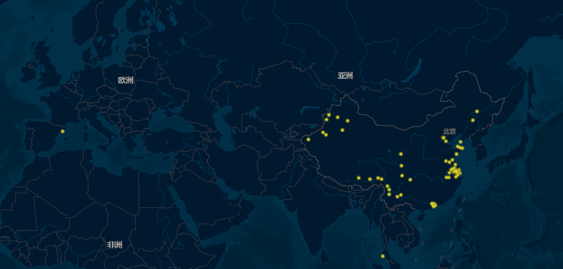
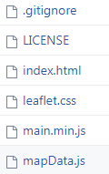
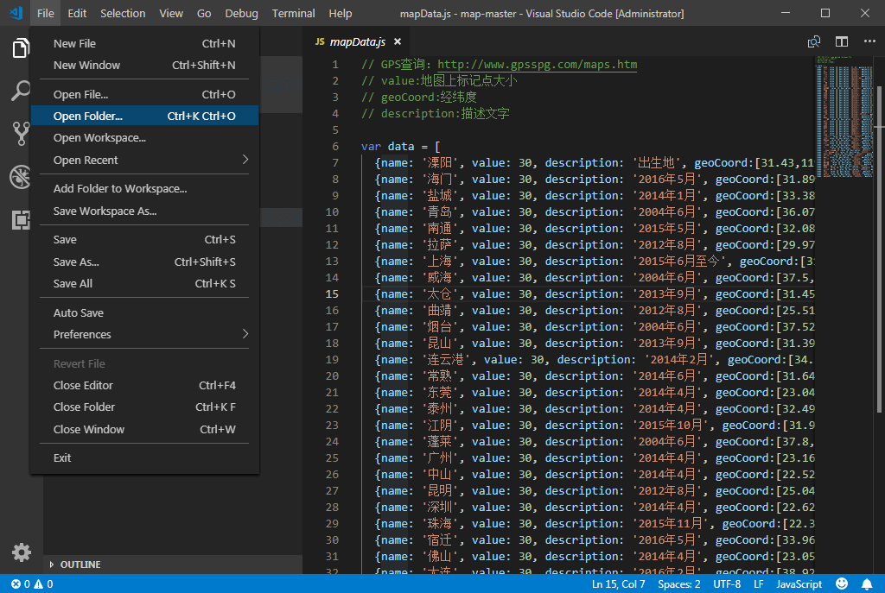
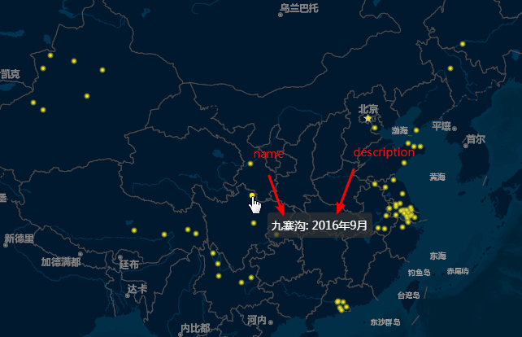

<!--more-->

> 项目地址：[travelMap](https://github.com/tc9011/travelMap)

一直想有个东西记录一下去过的地方，百度地图上有个足迹功能，能记录你去过的地方，不过你没办法在其他地方去调用这个功能，相对来说不是特别方便。

网上常见的足迹地图方案是用[jvectormap](http://jvectormap.com/)去写的，但是jvectormap缩放后不能得到更详细地地图信息。于是就借助[leaflet-echarts3](https://github.com/wandergis/leaflet-echarts3)做了一个足迹地图。leaflet-echarts3虽然只提供uglify以后的合并版本，但是写一个简单的足迹地图还是绰绰有余。

这个项目使用很简单，如果你不会编程也没关系，我把用户数据独立出来，你只要查找一下经纬度，照着格式填写就行。

首先，先点击下载这个项目[travelMap](https://coding.net/u/tc9011/p/map/git/archive/master)。下载解压后，文件夹中有下面几个文件（`.gitignore`可能你会看不到）：



在这些文件中，你只需要编辑`mapData.js`就行，其他都不需要你修改任何代码。

为了方便编辑对应的文件，推荐去下载微软的[visualstudio code](https://code.visualstudio.com/)打开对应的文件。

安装完visualstudio code，在File-->Open Folder中打开刚刚解压的文件夹：



这时候你可以看到相应的数据，只要按照一样的格式添加相应的数据就行。拿下面一行数据举例，说明一下各个参数代表的意义：

```json
{name: '巴塞罗那', value: 30, description: '2018年5月', geoCoord:[41.3825,2.1769]},
```

上面一行中：

- `value`表示地图上黄色点的大小，数值越大，显示的大小越大；
- `geoCoord`表示了经纬度，相关数据可以通过[gpsspg](http://www.gpsspg.com/maps.htm)查到，查到的数据之间放到`[]`中就行；
- `name`和`description`表示了鼠标悬浮在黄色点上显示的内容，如下图所示：



> 这里对非编程人员提醒一下，所有的符号必须是英文状态下打出来的，如果是中文状态会报错，修改前可以在编辑器里面尝试输入一下中文状态和英文状态下的符号，能很明显看出不同。最后每一行结尾的逗号不要漏掉了，这个要注意一下。

修改完数据，双击文件夹中的`index.html`，就会调用你本机的浏览器（或者把这个文件拖到浏览器中打开），这时候就可以看到你自己的足迹地图了。每次修改后，刷新一下浏览器，就可以看到修改后的效果了。

如果你想玩点更高级的，推荐去[Echarts实例](http://echarts.baidu.com/examples/)看看相关图表，随便选个实例点进去，然后根据[配置项手册](http://www.echartsjs.com/option.html#title)的说明生成一个自己的的图表吧。

