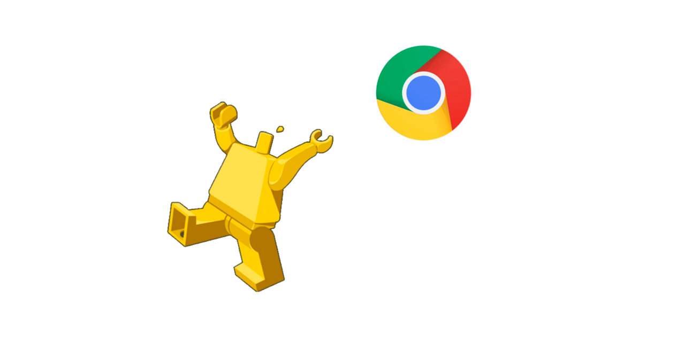
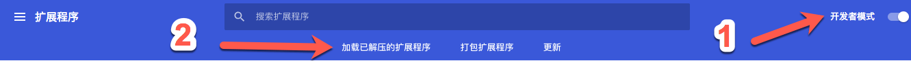
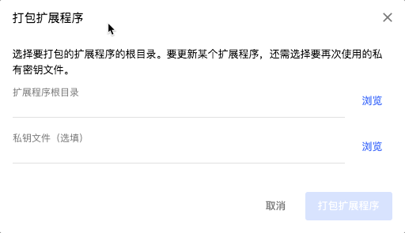

<!--more-->

最近看世界杯的时候，优酷视频右侧有个聊天室，还没有关闭按钮，想边看比赛边码代码的时候刷得很心烦。于是顺手写了一个chrome的扩展，你可以在[这里](https://github.com/tc9011/hideChatRoom)找到源码，或者在[这里](https://github.com/tc9011/hideChatRoom/releases/download/0.0.1/hideChatRoom.crx)下载crx文件。

> crx文件安装：点击进入浏览器右上角三条杠按钮，依次点击 更多程序—>扩展程序，进入页面后直接把crx文件拖到浏览器中就安装成功啦。

先看一下最后的目录结构：

```tex
./
 ├─ manifest.json //扩展的配置项
 ├─ index.js     //自定义js脚本
 ├─ index.css    //自定义css样式(这个扩展程序可以不要)
 ├─ images       //存放图片的文件夹
 └─ popup.html    //扩展的展示弹窗(这个扩展程序可以不要)
```

通过配置`manifest.json`文件，告诉Chrome这个扩展的一些重要信息。

那我们首先新建一个`manifest.json`文件：

```json
{
  "name": "hideChatRoom",
  "version": "0.0.1",
  "manifest_version": 2,
  "description": "隐藏优酷世界杯直播时的聊天室",
  "icons": {
    // 扩展的icon
    "72": "./images/icons/icon-72x72.png",
    "96": "./images/icons/icon-96x96.png",
    "128": "./images/icons/icon-128x128.png"
  },
  "browser_action": {
    // browser_action表示程序图标会出现在地址栏右侧
    "default_title": "hideChatRoom",
    "default_icon": "./images/icons/icon-72x72.png",
    "default_popup": "popup.html"
  },
  "content_scripts": [
    //content_scripts是在Web页面内运行的javascript脚本。
    //通过使用标准的DOM，它们可以获取浏览器所访问页面的详细信息，并可以修改这些信息。
    {
      //这里的值是数组，可以针对多个站点进行不同的操作配置
      "matches": [
        "https://vku.youku.com/live/*"
      ],
      "css": [
        "index.css"
      ],
      "js": [
        "index.js"
      ],
      "all_frames": true,
      "run_at": "document_idle"
    }
  ],
  "permissions": [
    //一些权限的配置，
    "cookies",
    //比如cookie权限，比如系统通知权限，类似于notify这样的东西，在window系统上未右下角的小气泡
    "notifications"
  ]
}
```

`manifest.json`文件中其他一些参数的含义和设置可以去[google官网](https://developer.chrome.com/extensions/manifest)查看。

因为涉及不到css样式和扩展程序的弹出框，所以`popup.html`和`index.css`可以不用管它们，这里只是为了做个演示。

在`index.js`中就要写隐藏聊天室的主要逻辑：

```javascript
let isNeedHide = true;    // 为以后做切换预留参数

/*
* 增强版window.onload，可以多次加载function
*
* @param { Function } func - 需要运行的函数
* *******************************************************
* */
function addLoadEvent(func) {
  const oldonload = window.onload;

  if (typeof window.onload !== "function") {
    window.onload = func;
  } else {
    window.onload = function () {
      oldonload();
      func();
    }
  }
}

/*
* 检测元素是否存在
*
* @param { HTMLElement } ele - 需要检测的元素
* *******************************************************
* */
function checkElement(ele) {
  if (!ele) {
    console.log(`can't get class, element info: ${ele}`);
    return;
  }
}

/*
* 改变有指定className的元素样式
*
* @param { String } className - 元素className
*
* @param { Object } style - 元素样式对象（包含样式名称、隐藏
*                           和显示时的样式）
* *******************************************************
* */
function changeStyle(className, style) {
  const element = document.getElementsByClassName(className)[0];

  checkElement(element);

  element.style[style.styleName] = isNeedHide ? style.hide : style.show;

  console.log(`${className} ${style.styleName}: ${element.style[style.styleName]}`);
}

function main() {
  const interactionStyle = {
    styleName: 'display',
    hide: 'none',
    show: 'block'
  };

  const videoStyle = {
    styleName: 'width',
    hide: '100%',
    show: 'calc(100% - 300px)'
  };

  changeStyle('interaction', interactionStyle);
  changeStyle('video-playing', videoStyle);
}

addLoadEvent(main);
```

代码逻辑很简单，就是通过DOM操作，获取具有`interaction`和`video-playing`class名称的元素，然后分别设置它们的`display`和`width`属性。

写好代码后就可以去调试了，在扩展程序页面切换到开发者模式，再点击`加载已解压的扩展程序`，选择代码所在的文件夹，这样你的扩展程序就可以在chrome中调试了。



调试完了就可以点击`打包扩展程序`打包成crx文件，第一次打包的时候私钥文件可以不填。



这样一个很简单的扩展程序就完成啦。这个扩展程序主要是自娱自乐，所以就没有上传到 Chrome 网上应用商店，上传的流程可以google一下，有蛮多教程的。
