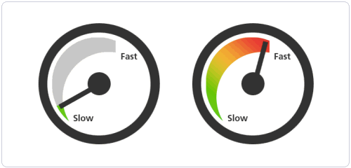
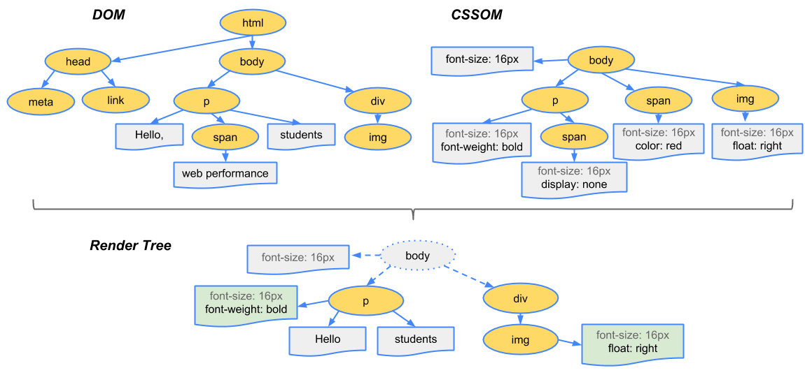
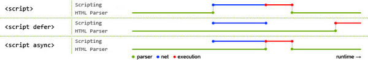
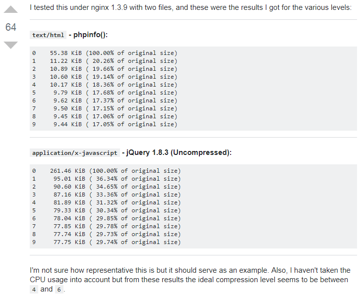

<!--more-->

天下武功，无坚不破，唯快不破。对前端而言，快意味着要求资源体量更小、数量更精简、内容更早呈现、交互更加人性化。当项目做到一定程度，就应该考虑性能的问题，前端的性能优化有诸多有迹可循的理论和方法，比如 Yahoo！性能军规、[Google PageSpeed Insights Rules](https://developers.google.com/speed/docs/insights/rules)。

我们团队一个比较老的项目首屏加载大概需要20多秒，这严重影响了用户体验，于是进行了一次首屏加载的性能优化。

## 浏览器渲染过程

首先，稍微了解一下，浏览器接收到HTML/CSS/JavaScript等资源后的渲染过程：



浏览器在收到 HTML 文档之后会对文档进行解析开始构建 DOM (Document Object Model) 树，进而在文档中发现样式表，开始解析 CSS 来构建 CSSOM（CSS Object Model）树，这两者都构建完成后，开始构建渲染树。

`DOM`树描述了文档的结构与内容，`CSSOM`树则描述了对文档应用的样式规则，想要渲染出页面，就需要将DOM树与CSSOM树结合在一起，这就是渲染树。渲染树构建完毕后，浏览器得到了每个可见节点的内容与其样式，下一步工作则需要计算每个节点在窗口内的确切位置与大小，也就是布局阶段。当`Layout`布局事件完成后，浏览器会立即发出`Paint Setup`与`Paint`事件，开始将渲染树绘制成像素，绘制所需的时间跟`CSS`样式的复杂度成正比，绘制完成后，用户就可以看到页面的最终呈现效果了。

## 暂缓JavaScript解析

在上图构建DOM树时，`<script>`标签可能会阻塞html解析，从而影响首页加载速度，可以使用`async`进行异步加载或者用`defer`进行延迟加载。

`async`属性表示脚本会在下载后尽快执行，但不能保证脚本会按照顺序执行。

`defer`属性表示脚本会先下载，但会在整个页面都解析完成后再运行，并且按照脚本出现的先后顺序执行。

用网上一张图能比较明显得看出两者的不同之处。



蓝色线代表网络读取，红色线代表执行时间，这俩都是针对脚本的；绿色线代表 HTML 解析。

用这两个属性可以很好解决由`<script>`引起地加载缓慢问题。

## 减少不必要的HTML标签

从浏览器渲染的流程可以看出，如果HTML中有很多不必要的标签会影响DOM解析速度并且增加了HTML文件的大小，可以对嵌套过深的结构进行优化，去除不必要的标签。

## 减少CSS嵌套

CSS嵌套过深，会影响浏览器查找选择器的速度，一定程度上产出了很多冗余的字节，一般最多嵌套3层。

## 启用CSS Sprite

> CSS Sprites在国内很多人叫css精灵，是一种网页图片应用处理方式。它允许你将一个页面涉及到的所有零星图片都包含到一张大图中去，这样一来，当访问该页面时，载入的图片就不会像以前那样一幅一幅地慢慢显示出来了。

该项目首页有有三张svg的图片，参考[SVG Sprite](https://www.w3cplus.com/svg/create-svg-sprite-sheet.html)对这三张照片进行了svg sprite的简单处理，后续在angular/cli中也可以参照这个[SVG icon system with angular-cli](https://stackoverflow.com/questions/41340133/svg-icon-system-with-angular-cli)对项目中的svg图片进行统一的处理。

进行css sprite处理时，注意以下几点：

- 把图片横向合并，这样图片大小更小
- 间距不要太大，这对图片大小影响不是很大，但对客户端解压时需要的内存更少

进行css sprite处理后，降低了首页资源请求次数。

对于图标类的图片，最好用[iconfont](http://www.iconfont.cn/)来减少图片的额外请求。

## 压缩静态资源

合并打包后的js、css、图片文件体积一般会比较大，这个时候要对它们进行压缩处理。gulp和webpack都有相应的压缩插件。

针对个别图片，有时候也可以单独拿出来处理，可以去[tinypng](https://tinypng.com/) 进行在线压缩。

## 使用lazyload和preloading

在Angular中，可以在路由中用`loadChildren`来实现lazyload，这样可以实现按需加载，加快加载速度。

```typescript
{
  path: 'home',
  loadChildren: 'app/home/home.module#HomeModule',
},
```

首页显示的模块不应该过大，我们项目中首页加载的模块虽然使用了lazyload，但是模块太大，以至于严重影响了加载速度，于是对模块进行了切割，分成2个模块，对于第二个模块进行了preloading，这样在首页加载完毕后，会对该模块进行预加载，加快了路由切换时的速度。关于preloading可以参考Angular官网的[自定义预加载策略](https://angular.cn/guide/router#自定义预加载策略)。

## Nginx启用Gzip压缩

> HTTP协议上的gzip编码是一种用来改进web应用程序性能的技术，web服务器和客户端（浏览器）必须共同支持gzip。目前主流的浏览器，Chrome,firefox,IE等都支持该协议。常见的服务器如Apache，Nginx，IIS同样支持gzip。
>
> gzip压缩比率在3到10倍左右，可以大大节省服务器的网络带宽。而在实际应用中，并不是对所有文件进行压缩，通常只是压缩静态文件。

在Nginx中，启用gzip：

```nginx
# 开启gzip
gzip on;

# 启用gzip压缩的最小文件，小于设置值的文件将不会压缩
gzip_min_length 1k;

# gzip 压缩级别，1-10，数字越大压缩的越好，也越占用CPU时间
gzip_comp_level 5;

# 进行压缩的文件类型。javascript有多种形式。其中的值可以在 mime.types 文件中找到。
gzip_types 
	application/atom+xml
    application/javascript
    application/json
    application/ld+json
    application/manifest+json
    application/rss+xml
    application/vnd.geo+json
    application/vnd.ms-fontobject
    application/x-font-ttf
    application/x-web-app-manifest+json
    application/xhtml+xml
    application/xml
    font/opentype
    image/bmp
    image/svg+xml
    image/x-icon
    text/cache-manifest
    text/css
    text/plain
    text/vcard
    text/vnd.rim.location.xloc
    text/vtt
    text/x-component
    text/x-cross-domain-policy;

# 是否在http header中添加Vary: Accept-Encoding，建议开启
gzip_vary on;

# 禁用IE 6 gzip
gzip_disable "MSIE [1-6]\.";
```

不同`gzip_comp_level`的压缩率可以参考下图：



gzip对svg和x-icon的压缩效果比较明显，一般可以达到50%以上的压缩效果，但是对于压缩过的PNG、GIF格式图片启用Gzip，反而会因为添加标头、压缩字典，增大了图片的大小。

启用压缩后，首页请求的资源大小由原来的10M降低到2.8M，效果还是比较明显的。

## 启用http缓存

每次访问网页时80%的时间都会花在资源下载上，因此使用缓存可以大大提高网页访问时的响应速度。

参考[H5BP配置目录](https://link.jianshu.com/?t=https://github.com/h5bp/server-configs-nginx/tree/master/h5bp)下的`expires.conf`，作为Nginx服务器配置：

```nginx
# Expire rules for static content

# No default expire rule. This config mirrors that of apache as outlined in the
# html5-boilerplate .htaccess file. However, nginx applies rules by location,
# the apache rules are defined by type. A consequence of this difference is that
# if you use no file extension in the url and serve html, with apache you get an
# expire time of 0s, with nginx you'd get an expire header of one month in the
# future (if the default expire rule is 1 month). Therefore, do not use a
# default expire rule with nginx unless your site is completely static

# cache.appcache, your document html and data
location ~* \.(?:manifest|appcache|html?|xml|json)$ {
  add_header Cache-Control "max-age=0";
}

# Feed
location ~* \.(?:rss|atom)$ {
  add_header Cache-Control "max-age=3600";
}

# Media: images, icons, video, audio, HTC
location ~* \.(?:jpg|jpeg|gif|png|ico|cur|gz|svg|mp4|ogg|ogv|webm|htc)$ {
  access_log off;
  add_header Cache-Control "max-age=2592000";
}

# Media: svgz files are already compressed.
location ~* \.svgz$ {
  access_log off;
  gzip off;
  add_header Cache-Control "max-age=2592000";
}

# CSS and Javascript
location ~* \.(?:css|js)$ {
  add_header Cache-Control "max-age=31536000";
  access_log off;
}

# WebFonts
# If you are NOT using cross-domain-fonts.conf, uncomment the following directive
# location ~* \.(?:ttf|ttc|otf|eot|woff|woff2)$ {
#  add_header Cache-Control "max-age=2592000";
#  access_log off;
# }
```

上述配置禁用`manifest`，`appcache`，`html`，`xml`和`json`文件的缓存。 它将`RSS`和`ATOM`订阅文件缓存1小时，`Javascript`和`CSS`文件1年，以及其他静态文件（图像和媒体）1个月。

缓存全部设置为`public`，所以任何系统都可以缓存它们。 将它们设置为私有将限制它们被私有缓存（例如我们的浏览器）缓存。

关于缓存中资源的新鲜度控制可以看这篇文章[HTTP缓存控制小结](http://imweb.io/topic/5795dcb6fb312541492eda8c)。

## 总结

这次只是很简单地对首屏加载进行了性能优化，减少了10个http请求，总资源大小从10.4MB降到2.8MB，首屏`DOMContentLoaded`时间从12秒左右降到2秒左右，`load`时间从22秒左右降到6秒左右，效果还是很明显的。

## 参考文章

- [Google Developers中performance系列文章](https://developers.google.com/web/fundamentals/performance/rail)
- [Front-End Performance Checklist 2018 ](https://github.com/xitu/gold-miner/blob/master/TODO/front-end-performance-checklist-2018-1.md )
- [前端那些事儿」② 极限性能优化](https://juejin.im/post/59ff2dbe5188254dd935c8ab)
- [前端性能优化相关](https://github.com/wy-ei/notebook/issues/34)
- [HTTP缓存控制小结](http://imweb.io/topic/5795dcb6fb312541492eda8c)
- [Nginx缓存最佳实践](https://www.jianshu.com/p/5d1ff7f545b2)
