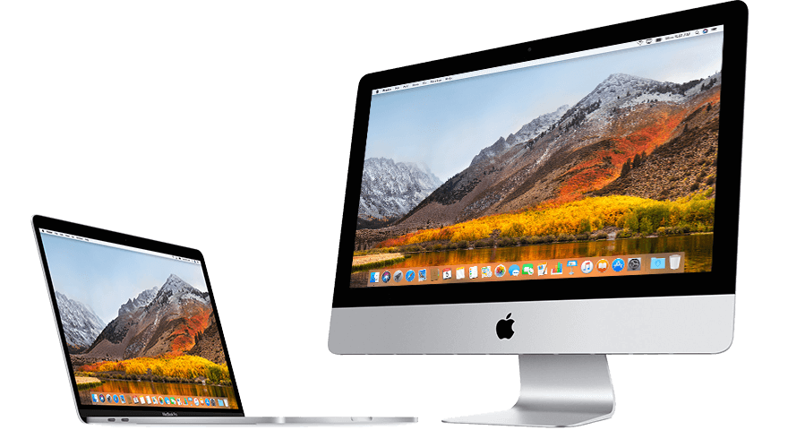

<!--more-->

Mac 虽然游戏性被 Windows 吊打，但是作为生产力工具还是很赞，特别是对程序员、摄影师和视频相关工作者。下面我把自己两年多以来在 macOS 上收集的一些好用的软件分享出来，希望对你有所帮助。

## Alfred

推荐指数：🌕🌕🌕🌕🌕

收费情况：免费

## Notion

推荐指数：🌕🌕🌕🌕🌕

收费情况：免费

## Snagit

推荐指数：🌕🌕🌕🌕🌕

收费情况：免费

## Paste

推荐指数：🌕🌕🌕🌕🌕

收费情况：免费

## Dash

推荐指数：🌕🌕🌕🌕🌕

收费情况：免费

## IINA

推荐指数：🌕🌕🌕🌕🌕

收费情况：免费

## iTerm2

推荐指数：🌕🌕🌕🌕🌑

收费情况：免费

## Airmail

推荐指数：🌕🌕🌕🌕🌑

收费情况：免费

## 欧陆词典

推荐指数：🌕🌕🌕🌕🌑

收费情况：免费

## Moom

推荐指数：🌕🌕🌕🌕🌑

收费情况：免费

## Bartender3

推荐指数：🌕🌕🌕🌕🌑

收费情况：免费

## iStat Menus

推荐指数：🌕🌕🌕🌕🌑

收费情况：免费

## Sip

推荐指数：🌕🌕🌕🌕🌑

收费情况：免费

## The Unarchiver

推荐指数：🌕🌕🌕🌕🌑

收费情况：免费

## Keta

推荐指数：🌕🌕🌕🌕🌑

收费情况：免费

## Cd To

推荐指数：🌕🌕🌕🌕🌑

收费情况：免费

## Caffeine

推荐指数：🌕🌕🌕🌕🌑

收费情况：免费

## Typora

推荐指数：🌕🌕🌕🌕🌑

收费情况：免费

## xMind

推荐指数：🌕🌕🌕🌕🌑

收费情况：免费

## TinyPNG4Mac

推荐指数：🌕🌕🌕🌕🌑

收费情况：免费

## Karabiner-Element

推荐指数：🌕🌕🌕🌕🌑

收费情况：免费

## AppCleaner

推荐指数：🌕🌕🌕🌕🌑

收费情况：免费

## PicU

推荐指数：🌕🌕🌕🌕🌑

收费情况：免费

## PDF Expert

推荐指数：🌕🌕🌕🌕🌑

收费情况：免费

## MarginNote3

推荐指数：🌕🌕🌕🌕🌑

收费情况：免费

## 微信小助手

推荐指数：🌕🌕🌕🌕🌑

收费情况：免费

更多 macOS 上优秀的软件可以去[Best-App](https://github.com/hzlzh/Best-App)上查找。

