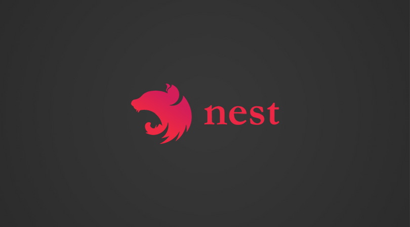

<!--more-->

在[Nestjs 入门（二）](https://tc9011.com/2019/07/22/nestjs入门（二）/)中，我们创建了一个基本的 Nestjs 应用。下面我们基于此进行扩展。

源码地址：[awesome-nest](https://github.com/tc9011/awesome-nest)

## 序列化

在 entity 中，有时候有些字段不一定要返还给前端，通常我们需要自己做一次筛选，而 Nestjs 中，配合 [class-transformer](https://github.com/typestack/class-transformer)，可以很方便的实现这个功能。

例如，我们有个 entity 的基类`common.entity.ts`，返还数据的时候，我们不希望把`create_at`和`update_at`也带上，这时候就可以使用`@Exclude()`排除`CommonEntity`中的这两个字段：

```typescript
import { CreateDateColumn, PrimaryGeneratedColumn, UpdateDateColumn } from 'typeorm'
import { Exclude } from 'class-transformer'

export class CommonEntity {
  @PrimaryGeneratedColumn('uuid')
  id: string

  @Exclude()
  @CreateDateColumn({
    comment: '创建时间',
  })
  create_at: number

  @Exclude()
  @UpdateDateColumn({
    comment: '更新时间',
  })
  update_at: number
}
```

在对应请求的地方标记使用`ClassSerializerInterceptor`，此时，`GET /api/v1/cats/1`这个请求返回的数据中，就不会包含`create_at`和`update_at`这两个字段。

```typescript
@Controller('cats')
export class CatsController {
  constructor(private readonly catsService: CatsService) {
  }

  @Get(':id')
  @UseInterceptors(ClassSerializerInterceptor)
  findOne(@Param('id') id: string): Promise<Array<Partial<CatEntity>>> {
    return this.catsService.getCat(id)
  }
}
```

如果某个 controller 中都需要使用`ClassSerializerInterceptor`来帮我们做一些序列化的工作，可以把 Interceptor 提升到整个 controller：

```typescript
@UseInterceptors(ClassSerializerInterceptor)
@Controller('cats')
export class CatsController {
  constructor(private readonly catsService: CatsService) {
  }

  @Get(':id')
  findOne(@Param('id') id: string): Promise<Array<Partial<CatEntity>>> {
    return this.catsService.getCat(id)
  }
  
  @Post()
  create(@Body() createCatDto: CreateCatDto): Promise<void> {
    return this.catsService.createCat(createCatDto)
  }
}
```

甚至可以在`main.ts`中把它作为全局的 Interceptor，不过这样不方便进行细粒度地控制。

```typescript
async function bootstrap() {
  const app = await NestFactory.create(AppModule)
  app.setGlobalPrefix('api/v1')

  app.useGlobalInterceptors(new ClassSerializerInterceptor(app.get(Reflector)))

  await app.listen(config.port, config.hostName, () => {
    Logger.log(
      `Awesome-nest API server has been started on http://${config.hostName}:${config.port}`,
    )
  })
}

bootstrap()

```

在某些场景下，我们需要对 entity 中某个字段处理后再返回，可以使用`@Transform()`：

```typescript
@Entity('dog')
export class DogEntity extends CommonEntity {
  @Column({ length: 50 })
  @Transform(value => `dog: ${value}`)
  name: string

  @Column()
  age: number

  @Column({ length: 100, nullable: true })
  breed: string
}
```

此时，`name`字段经过`@Transform`的包装就会变成`dog: name`的格式。如果我们需要根据已有字段构造一个新的字段，可以使用`@Expose()`：

```typescript
@Entity('dog')
export class DogEntity extends CommonEntity {
  @Column({ length: 50 })
  @Transform(value => `dog: ${value}`)
  name: string

  @Column()
  age: number

  @Column({ length: 100, nullable: true })
  breed: string

  @Expose()
  get isOld(): boolean {
    return this.age > 10
  }
}
```

上面代码会根据查询到的`age`字段动态计算`isOld`的值，此时通过 GET 方法请求返回的结果如下：

```json
{
    "data": [
        {
            "id": "15149ec5-cddf-4981-89a0-62215b30ab81",
            "name": "dog: nana",
            "age": 12,
            "breed": "corgi",
            "isOld": true
        }
    ],
    "status": 0,
    "message": "请求成功"
}
```

## 事务

在使用 MySQL 的时候，有时候我们需要使用事务，借助 TypeORM 中可以这样使用事务：

```typescript
@Delete(':name')
@Transaction()
delete(
  @Param('name') name: string,
  @TransactionManager() manager: EntityManager,
): Promise<void> {
    return this.catsService.deleteCat(name, manager)
}
```

`@Transaction()`将 controller 或者 service 中所有执行包装到一个数据库事务中，`@TransportManager`提供了一个事务实体管理器，它必须用于在该事务中执行查询：

```typescript
async deleteCat(name: string, manager: EntityManager): Promise<void> {
  await manager.delete(CatEntity, { name })
}
```

上面代码通过装饰器很方便地进行了事务的操作，如果事务执行过程中有任何错误会自动回滚。

当然，我们也可以手动创建查询运行程序实例，并使用它来手动控制事务状态：

```typescript
import { getConnection } from "typeorm";

// 获取连接并创建新的queryRunner
const connection = getConnection();
const queryRunner = connection.createQueryRunner();

// 使用我们的新queryRunner建立真正的数据库连
await queryRunner.connect();

// 现在我们可以在queryRunner上执行任何查询，例如：
await queryRunner.query("SELECT * FROM users");

// 我们还可以访问与queryRunner创建的连接一起使用的实体管理器：
const users = await queryRunner.manager.find(User);

// 开始事务：
await queryRunner.startTransaction();

try {
  // 对此事务执行一些操作：
  await queryRunner.manager.save(user1);
  await queryRunner.manager.save(user2);
  await queryRunner.manager.save(photos);

  // 提交事务：
  await queryRunner.commitTransaction();
} catch (err) {
  // 有错误做出回滚更改
  await queryRunner.rollbackTransaction();
}
```

`QueryRunner`提供单个数据库连接。 使用查询运行程序组织事务。 单个事务只能在单个查询运行器上建立。 

## 认证

在这个应用内，现在对用户还没有进行认证，通过用户认证可以判断该访问角色的合法性和权限。通常认证要么基于 Session，要么基于 Token。这里就以基于 Token 的 JWT（JSON Web Token） 方式进行用户认证。

首先安装相关依赖：

```bash
$ npm install --save @nestjs/passport passport @nestjs/jwt passport-jwt
```

然后创建`jwt.strategy.ts`，用来验证 token，当 token 有效时，允许进一步处理请求，否则返回`401(Unanthorized)`：

```typescript
import { ExtractJwt, Strategy } from 'passport-jwt'
import { PassportStrategy } from '@nestjs/passport'
import { Injectable, UnauthorizedException } from '@nestjs/common'
import config from '../../config'
import { UserEntity } from '../entities/user.entity'
import { AuthService } from './auth.service'

@Injectable()
export class JwtStrategy extends PassportStrategy(Strategy) {
  constructor(private readonly authService: AuthService) {
    super({
      jwtFromRequest: ExtractJwt.fromAuthHeaderAsBearerToken(),
      secretOrKey: config.jwt.secret,
    })
  }

  async validate(payload: UserEntity) {
    const user = await this.authService.validateUser(payload)
    if (!user) {
      throw new UnauthorizedException('身份验证失败')
    }
    return user
  }
}
```

然后创建`auth.service.ts`，上面的`jwt.strategy.ts`会使用这个服务校验 token，并且提供了创建 token 的方法：

```typescript
import { JwtService } from '@nestjs/jwt'
import { Injectable } from '@nestjs/common'
import { UserEntity } from '../entities/user.entity'
import { InjectRepository } from '@nestjs/typeorm'
import { Repository } from 'typeorm'
import { Token } from './auth.interface'
import config from '../../config'

@Injectable()
export class AuthService {
  constructor(
    @InjectRepository(UserEntity)
    private readonly userRepository: Repository<UserEntity>,
    private readonly jwtService: JwtService,
  ) {
  }

  createToken(email: string): Token {
    const accessToken = this.jwtService.sign({ email })
    return {
      expires_in: config.jwt.signOptions.expiresIn,
      access_token: accessToken,
    }
  }

  async validateUser(payload: UserEntity): Promise<any> {
    return await this.userRepository.find({ email: payload.email })
  }
}
```

这两个文件都会作为服务在对应的`module`中注册，并且引入`PassportModule`和`JwtModule`：

```typescript
import { Module } from '@nestjs/common'
import { AuthService } from './auth/auth.service'
import { PassportModule } from '@nestjs/passport'
import { JwtModule } from '@nestjs/jwt'
import { JwtStrategy } from './auth/jwt.strategy'
import config from '../config'


@Module({
  imports: [
    PassportModule.register({ defaultStrategy: 'jwt' }),
    JwtModule.register(config.jwt),
  ],
  providers: [
    AuthService,
    JwtStrategy,
  ],
  exports: [],
})
export class FeaturesModule {
}
```

这时候，就可以使用`@UseGuards(AuthGuard())`来对需要认证的 API 进行身份校验：

```typescript
import {
  Body,
  ClassSerializerInterceptor,
  Controller,
  Get,
  Param,
  Post,
  UseGuards,
  UseInterceptors,
} from '@nestjs/common'

import { CatsService } from './cats.service'
import { CreateCatDto } from './cat.dto'
import { CatEntity } from '../entities/cat.entity'
import { AuthGuard } from '@nestjs/passport'

@Controller('cats')
@UseGuards(AuthGuard())
export class CatsController {
  constructor(private readonly catsService: CatsService) {
  }

  @Get(':id')
  @UseInterceptors(ClassSerializerInterceptor)
  findOne(@Param('id') id: string): Promise<Array<Partial<CatEntity>>> {
    return this.catsService.getCat(id)
  }

  @Post()
  create(@Body() createCatDto: CreateCatDto): Promise<void> {
    return this.catsService.createCat(createCatDto)
  }
}
```

通过 Postman 模拟请求时，如果没有带上 token，就会返回下面结果：

```typescript
{
    "message": {
        "statusCode": 401,
        "error": "Unauthorized"
    },
    "status": 1
}
```

## 安全

Web 安全中，常见有两种攻击方式：XSS（跨站脚本攻击） 和 CSRF（跨站点请求伪造）。

对 JWT 的认证方式，因为没有 cookie，所以也就不存在 CSRF。如果你不是用的 JWT 认证方式，可以使用[csurf](https://github.com/expressjs/csurf)这个库去解决这个安全问题。

对于 XSS，可以使用[helmet](https://github.com/helmetjs/helmet)去做安全防范。helmet 中有 12 个中间件，它们会设置一些安全相关的 HTTP 头。比如`xssFilter`就是用来做一些 XSS 相关的保护。

对于单 IP 大量请求的暴力攻击，可以用[express-rate-limit](https://github.com/nfriedly/express-rate-limit)来进行限速。

对于常见的跨域问题，Nestjs 提供了两种方式解决，一种通过`app.enableCors()`的方式启用跨域，另一种像下面一样，在 Nest 选项对象中启用。

最后，所有这些设置都是作为全局的中间件启用，最后`main.ts`中，和安全相关的设置如下：

```typescript
import * as helmet from 'helmet'
import * as rateLimit from 'express-rate-limit'

async function bootstrap() {
  const app = await NestFactory.create(AppModule, { cors: true })

  app.use(helmet())
  app.use(
    rateLimit({
      windowMs: 15 * 60 * 1000, // 15 minutes
      max: 100, // limit each IP to 100 requests per windowMs
    }),
  )

  await app.listen(config.port, config.hostName, () => {
    Logger.log(
      `Awesome-nest API server has been started on http://${config.hostName}:${config.port}`,
    )
  })
}
```

## HTTP 请求

Nestjs 中对[Axios](https://github.com/axios/axios)进行了封装，并把它作为 `HttpService` 内置到`HttpModule`中。`HttpService`返回的类型和 Angular 的 `HttpClient Module`一样，都是`observables`，所以可以使用 [rxjs](https://rxjs.dev/) 中的操作符处理各种异步操作。

首先，我们需要导入`HttpModule`：

```typescript
import { Global, HttpModule, Module } from '@nestjs/common'

import { LunarCalendarService } from './services/lunar-calendar/lunar-calendar.service'

@Global()
@Module({
  imports: [HttpModule],
  providers: [LunarCalendarService],
  exports: [HttpModule, LunarCalendarService],
})
export class SharedModule {}
```

这里我们把 `HttpModule`作为全局模块，在`sharedModule`中导入并导出以便其他模块使用。这时候我们就可以使用`HttpService`，比如我们在`LunarCalendarService`中注入`HttpService`，然后调用其 `get`方法请求当日的农历信息。这时候`get`返回的是 `Observable`。

对于这个 `Observable`流，可以通过`pipe`进行一系列的操作，比如我们直接可以使用 rxjs 的`map`操作符帮助我们对数据进行一层筛选，并且超过 5s 后就会报 timeout 错误，`catchError`会帮我们捕获所有的错误，返回的值通过`of`操作符转换为`observable`：

```typescript
import { HttpService, Injectable } from '@nestjs/common'
import { of, Observable } from 'rxjs'
import { catchError, map, timeout } from 'rxjs/operators'

@Injectable()
export class LunarCalendarService {
  constructor(private readonly httpService: HttpService) {
  }

  getLunarCalendar(): Observable<any> {
    return this.httpService
      .get('https://www.sojson.com/open/api/lunar/json.shtml')
      .pipe(
        map(res => res.data.data),
        timeout(5000),
        catchError(error => of(`Bad Promise: ${error}`))
      )
  }
}
```

如果需要对axios 进行[配置](https://github.com/axios/axios#request-config)，可以直接在 Module 注册的时候设置：

```typescript
import { Global, HttpModule, Module } from '@nestjs/common'

import { LunarCalendarService } from './services/lunar-calendar/lunar-calendar.service'

@Global()
@Module({
  imports: [
    HttpModule.register({
      timeout: 5000,
      maxRedirects: 5,
    }),
  ],
  providers: [LunarCalendarService],
  exports: [HttpModule, LunarCalendarService],
})
export class SharedModule {}
```

## 模板渲染

在 Nestjs 中，可以使用 hbs 作为模板渲染引擎：

```bash
$ npm install --save hbs
```

在`main.ts`中，我们告诉 express，`static`文件夹用来存储静态文件，`views`中含了模板文件：

```typescript
import { NestFactory } from '@nestjs/core'
import { NestExpressApplication } from '@nestjs/platform-express'
import { join } from 'path'

import { AppModule } from './app.module'
import config from './config'
import { Logger } from './shared/utils/logger'

async function bootstrap() {
  const app = await NestFactory.create<NestExpressApplication>(AppModule, {
    cors: true,
  })

  app.setGlobalPrefix('api/v1')

  app.useStaticAssets(join(__dirname, '..', 'static'))
  app.setBaseViewsDir(join(__dirname, '..', 'views'))
  app.setViewEngine('hbs')

  await app.listen(config.port, config.hostName, () => {
    Logger.log(
      `Awesome-nest API server has been started on http://${config.hostName}:${config.port}`,
    )
  })
}
```

在`views`下新建一个`catsPage.hbs`的文件，假设，我们需要在里面填充的数据结构是这样：

```typescript
{
  cats: [
    {
      id: 1,
      name: 'yyy',
      age: 12,
      breed: 'black cats'
    }
  ],
  title: 'Cats List',
}
```

此时，可以这样写模板：

```html
<!DOCTYPE html>
<html lang="en">
<head>
    <meta charset="UTF-8"/>
    <meta name="viewport" content="width=device-width, initial-scale=1.0"/>
    <meta http-equiv="X-UA-Compatible" content="ie=edge"/>
    <style>
        .table .default-td {
            width: 200px;
        }

        .table tbody>tr:nth-child(2n-1) {
            background-color: rgb(219, 212, 212);
        }

        .table tbody>tr:nth-child(2n) {
            background-color: rgb(172, 162, 162);
        }
    </style>
</head>
<body>
<p>{{ title }}</p>
<table class="table">
    <thead>
    <tr>
        <td class="id default-td">id</td>
        <td class="name default-td">name</td>
        <td class="age default-td">age</td>
        <td class="breed default-td">breed</td>
    </tr>
    </thead>
    <tbody>
    {{#each cats}}
        <tr>
            <td>{{id}}</td>
            <td>{{name}}</td>
            <td>{{age}}</td>
            <td>{{breed}}</td>
        </tr>
    {{/each}}
    </tbody>
</table>
</body>
</html>
```

需要注意的是，如果你有拦截器，数据会先经过拦截器的处理，然后再填充到模板中。

在 controller 中，通过`@Render`指定模板的名称，并且在 `return` 中返回需要填充的数据：

```typescript
@Get('page')
@Render('catsPage')
getCatsPage() {
  return {
    cats: [
      {
        id: 1,
        name: 'yyy',
        age: 12,
        breed: 'black cats'
      }
    ],
    title: 'Cats List',
  }
}
```

Nestjs 还支持和其他 SSR 框架集成，比如 Next，Angular Universal，Nuxt。具体使用 Demo 可以分别查看这几个项目[nestify](https://github.com/ZhiXiao-Lin/nestify)，[nest-angular](https://github.com/bojidaryovchev/nest-angular)，[simple-todos](https://github.com/chanlito/simple-todos)。

## Swagger 文档

Nestjs 中也提供了对 swagger 文档的支持，方便我们对 API 进行追踪和测试：

```bash
$ npm install --save @nestjs/swagger swagger-ui-express
```

在`main.ts`中构件文档：

```typescript
const options = new DocumentBuilder()
    .setTitle('Awesome-nest')
    .setDescription('The Awesome-nest API Documents')
    .setBasePath('api/v1')
    .addBearerAuth()
    .setVersion('0.0.1')
    .build()

const document = SwaggerModule.createDocument(app, options)
SwaggerModule.setup('docs', app, document)
```

此时，访问`http://localhost:3300/docs`就可以看到 swagger 文档的页面。

对于不同的 API 可以在 controller 中使用`@ApiUseTags()`进行分类，对于需要认证的 API，可以加上`@ApiBearerAuth()`，这样在 swagger 中填完 token 后，就可以直接测试 API：

```typescript
@ApiUseTags('cats')
@ApiBearerAuth()
@Controller('cats')
@UseGuards(AuthGuard())
export class CatsController {
  constructor(private readonly catsService: CatsService) {}

  @Get('page')
  @Render('catsPage')
  getCatsPage(): Promise<any> {
    return this.catsService.getCats()
  }
}
```


对于我们定于的 DTO，为了使 `SwaggerModule` 可以访问类属性，我们必须用 `@ApiModelProperty()` 装饰器标记所有这些属性：

```typescript
import { ApiModelProperty } from '@nestjs/swagger'
import { IsEmail, IsString } from 'class-validator'

export class AccountDto {
  @ApiModelProperty()
  @IsString()
  @IsEmail()
  readonly email: string

  @ApiModelProperty()
  @IsString()
  readonly password: string
}
```


对于 swagger 文档更多的用法，可以看官网[OpenAPI (Swagger)](https://docs.nestjs.com/recipes/swagger)的内容。

## 热重载

在开发的时候，运行`npm run start:dev`的时候，是进行全量编译，如果项目比较大，全量编译耗时会比较长，这时候我们可以利用 webpack 来帮我们做增量编译，这样会大大增加开发效率。

首先，安装 webpack 相关依赖：

```bash
$ npm i --save-dev webpack webpack-cli webpack-node-externals ts-loader
```

在根目录下创建一个`webpack.config.js`：

```typescript
const webpack = require('webpack');
const path = require('path');
const nodeExternals = require('webpack-node-externals');

module.exports = {
  entry: ['webpack/hot/poll?100', './src/main.ts'],
  watch: true,
  target: 'node',
  externals: [
    nodeExternals({
      whitelist: ['webpack/hot/poll?100'],
    }),
  ],
  module: {
    rules: [
      {
        test: /.tsx?$/,
        use: 'ts-loader',
        exclude: /node_modules/,
      },
    ],
  },
  mode: 'development',
  resolve: {
    extensions: ['.tsx', '.ts', '.js'],
  },
  plugins: [new webpack.HotModuleReplacementPlugin()],
  output: {
    path: path.join(__dirname, 'dist'),
    filename: 'server.js',
  },
};
```

在`main.ts`中启用 HMR：

```typescript
declare const module: any;

async function bootstrap() {
  const app = await NestFactory.create(ApplicationModule);
  await app.listen(3000);

  if (module.hot) {
    module.hot.accept();
    module.hot.dispose(() => app.close());
  }
}
bootstrap();
```

在`package.json`中增加下面两个命令：

```json
{
  "scripts": {
    "start": "node dist/server",
		"webpack": "webpack --config webpack.config.js"
  }
}
```

运行`npm run webpack`之后，webpack 开始监视文件，然后在另一个命令行窗口中运行`npm start`。


