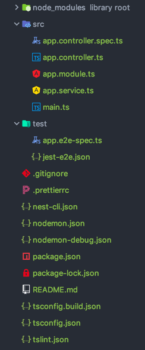

<!--more-->

> 源码：[awesome-nest](https://github.com/tc9011/awsome-nest)

在 [nestjs入门（一）](https://tc9011.com/2019/07/14/nestjs入门（一）/) 中，对 Nestjs 一些重要的概念有了一些了解，现在我们开始创建一个基于 Nestjs 的应用吧。

Nestjs 和 Angular 一样，提供了 CLI 工具帮助我们初始化和开发应用程序。

```bash
$ npm install -g @nestjs/cli
$ nest new my-awesome-app
```

这时候你会得到这样的一个目录结构：



运行`npm start`后，在浏览器访问`http://localhost:3000/`就可以看到`Hello World!`。

## Controller 和 Service

在 Nestjs 中，所有的 controller 和 service 都要在对应的 module 中注册，就像这样：

```typescript
import { Module } from '@nestjs/common';
import { AppController } from './app.controller';
import { AppService } from './app.service';

@Module({
  imports: [],
  controllers: [AppController],
  providers: [AppService],
})
export class AppModule {}

```

在 MVC 模式中，controller 通过 model 获取数据。对应的，在 Nestjs 中，controller 负责处理传入的请求, 并调用对应的 service 完成业务处理，返回对客户端的响应。

通常可以通过 CLI 命令来创建一个 controller：

```bash
$ nest g co cats
```

这时候，CLI 会自动生成 controller 文件，并且把 controller 注册到对应的 module 中。

和其他一些 node 框架不一样，Nestjs 路由不是集中式管理，而是分散在 controller 中，通过`@controller()`中声明的（可选）前缀和请求装饰器中指定的任何路由来确定的。

```typescript
import { Controller, Get } from '@nestjs/common';

import { CatsService } from './cats.service';

@Controller('cats')
export class CatsController {
  constructor(private readonly catsService: CatsService) {
  }

  @Get(':id')
  findOne(@Param('id') id: string): string {
    return this.catsService.getCat();
  }
}
```

上面这段代码中，通过 Get 请求去请求`http://localhost:3000/cats/1`就会调用`findOne`方法。

如果需要在所有请求之前加上 prefix，可以在`main.ts`中直接设置 GlobalPrefix：

```typescript
import { NestFactory } from '@nestjs/core';
import { AppModule } from './app.module';

async function bootstrap() {
  const app = await NestFactory.create(AppModule);
  app.setGlobalPrefix('api/v1');
  await app.listen(3000);
}
bootstrap();
```

在 Nestjs 中，controller 就像是调用 service 的指挥者，把对应的请求分发到相应的 service 中去处理。

在 controller 中，我们注意到，在构造函数中注入了`CatsService`实例，来调用对应 service 中的方法。这就是 Nestjs 中依赖注入的注入方式 — 构造函数注入。

service 可以看做夹在 controller 和 model 之间的一层，在 service 调用 DAO （在 Nestjs 中是各种 ORM 工具或者自己封装的 DAO 层）实现数据库的访问，进行数据的处理整合。

``` typescript
import { Injectable } from '@nestjs/common';

@Injectable()
export class CatsService {
  getCat(id: string): string {
    return `This action returns ${id} cats`;
  }
}
```

上面代码中通过`@Injectable()`定义了一个 service，这样你就可以在其他 controller 或者 service 中注入这个 service。

## DTO 和 Pipe

通过[nestjs入门（一）](https://tc9011.com/2019/07/14/nestjs入门（一）/)已经介绍了 DTO 的概念，在Nestjs 中，DTO 主要定义如何通过网络发送数据的对象，通常会配合`class-validator`和` class-transformer`做校验。

```typescript
import { IsString, IsInt } from 'class-validator';

export class CreateCatDto {
  @IsString()
  readonly name: string;

  @IsInt()
  readonly age: number;

  @IsString()
  readonly breed: string;
}
```

```typescript
import { Controller, Get, Query, Post, Body, Put, Param, Delete } from '@nestjs/common';
import { CreateCatDto } from './dto';

@Controller('cats')
export class CatsController {
  @Post()
  create(@Body() createCatDto: CreateCatDto) {
    return 'This action adds a new cat';
  }
}
```

上面对请求`body` 定义了一个 DTO，并且在 DTO 中对参数类型进行了限制，如果`body`中传过来的类型不符合要求，会直接报错。

DTO 中的`class-validator` 还需要配合 pipe 才能完成校验功能：

```typescript
import {
  PipeTransform,
  ArgumentMetadata,
  BadRequestException,
  Injectable,
} from '@nestjs/common'
import { validate } from 'class-validator'
import { plainToClass } from 'class-transformer'
import * as _ from 'lodash'

@Injectable()
export class ValidationPipe implements PipeTransform<any> {
  async transform(value, metadata: ArgumentMetadata) {
    const { metatype } = metadata
    if (!metatype || !this.toValidate(metatype)) {
      return value
    }
    const object = plainToClass(metatype, value)
    const errors = await validate(object)
    if (errors.length > 0) {
      const errorMessage = _.values(errors[0].constraints)[0]
      throw new BadRequestException(errorMessage)
    }
    return value
  }

  private toValidate(metatype): boolean {
    const types = [String, Boolean, Number, Array, Object]
    return !types.find(type => metatype === type)
  }
}
```

这个 pipe 会根据元数据和对象实例，去构建原有类型，然后通过`validate`去校验。

这个 pipe 一般会作为全局的 pipe 去使用：

```typescript
async function bootstrap() {
  const app = await NestFactory.create(ApplicationModule);
  app.setGlobalPrefix('api/v1');
  
  app.useGlobalPipes(new ValidationPipe());
  
  await app.listen(3000);
}
bootstrap();
```

假设我们没有这层 pipe，那在 controller 中就会进行参数校验，这样就会打破单一职责的原则。有了这一层 pipe 帮助我们校验参数，有效地降低了类的复杂度，提高了可读性和可维护性。

## Interceptor 和 Exception Filter

代码写到这里，我们发现直接返回了字符串，这样有点太粗暴，需要把正确和错误的响应包装一下。假设我希望返回的格式是这样的：

```tex
# 请求成功
{
    status: 0,
    message: '请求成功',
    data: any
}

# 请求失败
{
    status: 1,
    message: string,
}
```

此时，可以利用 AOP 的思想去做这件事。首先，我们需要全局捕获错误的切片层去处理所有的 exception；其次，如果是一个成功的请求，需要把这个返回结果通过一个切片层包装一下。

在 Nestjs 中，返回请求结果时，Interceptor 会在 Exception Filter 之前触发，所以 Exception Filter 会是最后捕获 exception的机会。我们把它作为处理全局错误的切片层。

```typescript
import {
  Catch,
  ArgumentsHost,
  HttpException,
  ExceptionFilter,
  HttpStatus,
} from '@nestjs/common'

@Catch()
export class ExceptionsFilter implements ExceptionFilter {
  async catch(exception, host: ArgumentsHost) {
    const ctx = host.switchToHttp()
    const response = ctx.getResponse()
    const request = ctx.getRequest()

    let message = exception.message
    let isDeepestMessage = false
    while (!isDeepestMessage) {
      isDeepestMessage = !message.message
      message = isDeepestMessage ? message : message.message
    }

    const errorResponse = {
      message: message || '请求失败',
      status: 1,
    }

    const status = exception instanceof HttpException ? 
          exception.getStatus() :
    			HttpStatus.INTERNAL_SERVER_ERROR
    
    response.status(status)
    response.header('Content-Type', 'application/json; charset=utf-8')
    response.send(errorResponse)
  }
}
```

而 Interceptor 则负责对成功请求结果进行包装：

```typescript
import {
  Injectable,
  NestInterceptor,
  ExecutionContext,
  CallHandler,
} from '@nestjs/common'
import { Observable } from 'rxjs'
import { map } from 'rxjs/operators'

interface Response<T> {
  data: T
}

@Injectable()
export class TransformInterceptor<T>
  implements NestInterceptor<T, Response<T>> {
  intercept(
    context: ExecutionContext,
    next: CallHandler,
  ): Observable<Response<T>> {
    return next.handle().pipe(
      map(rawData => {
          return {
            data: rawData,
            status: 0,
            message: '请求成功',
          }
        }
      )
    )
  }
}
```

同样 Interceptor 和 Exception Filter 需要把它定义在全局范围内：

```typescript
async function bootstrap() {
  const app = await NestFactory.create(AppModule);
  app.setGlobalPrefix('api/v1');

  app.useGlobalFilters(new ExceptionsFilter());
  app.useGlobalInterceptors(new TransformInterceptor());
  app.useGlobalPipes(new ValidationPipe());

  await app.listen(3000);
}
```

## TypeORM

TypeORM 相当于 Nestjs 中的 DAO 层，它支持多种数据库，如 PostgreSQL，SQLite 甚至MongoDB（NoSQL）。这里我们以 MySQL 为例，首先在 MySQL 中手动创建一个数据库：

```bash
> CREATE DATABASE test
```

然后安装 typeorm：

```bash
$ npm install --save @nestjs/typeorm typeorm mysql
```

通常我们开发的时候，会有多套环境，这些环境中会有不同的数据库配置，所以先建一个`config`文件夹，放置不同的数据库配置：

```typescript
// index.ts
import * as _ from 'lodash'
import { resolve } from 'path'

import productionConfig from './prod.config'

const isProd = process.env.NODE_ENV === 'production'

let config = {
  port: 3000,
  hostName: 'localhost',

  orm: {
    type: 'mysql',
    host: 'localhost',
    port: 3310,
    username: 'root',
    password: '123456',
    database: 'test',
    entities: [resolve(`./**/*.entity.ts`)],
    migrations: ['migration/*.ts'],
    timezone: 'UTC',
    charset: 'utf8mb4',
    multipleStatements: true,
    dropSchema: false,
    synchronize: true,
    logging: true,
  },
}

if (isProd) {
  config = _.merge(config, productionConfig)
}

export { config }
export default config
```

```typescript
// prod.config.ts
import { resolve } from 'path'

export default {
  port: 3210,

  orm: {
    type: 'mysql',
    host: 'localhost',
    port: 3312,
    username: 'root',
    password: '123456',
    database: 'test',
    entities: [resolve('./**/*.entity.js')],
    migrations: ['migration/*.ts'],
    dropSchema: false,
    synchronize: false,
    logging: false,
  },
}
```

在线上环境强烈不建议开启 orm 的 `synchronize`功能。本地如果要开启，要注意一点，如果 entity 中定义的字段类型和数据库原有类型不一样，在开启`synchronize` 后 orm 会执行 `drop`然后再`add`的操作，这会导致本地测试的时候数据丢失（这里为了方便，本地测试就把`synchronize`功能打开，这样写完 entity 就会自动同步到数据库）。

在`app.module.ts`中导入`TypeOrmModule`：

```typescript
import { Module } from '@nestjs/common'
import { AppController } from './app.controller'
import { AppService } from './app.service'
import { CatsController } from './cats/cats.controller'
import { CatsService } from './cats/cats.service'
import { TypeOrmModule, TypeOrmModuleOptions } from '@nestjs/typeorm'
import config from './config'

@Module({
  imports: [
    TypeOrmModule.forRoot(config.orm as TypeOrmModuleOptions),
  ],
  controllers: [AppController, CatsController],
  providers: [AppService, CatsService],
})
export class AppModule {}
```

接下来就是写 entity，下面我们定义了一个叫`cat`的表，`id`为自增主键：

```typescript
import { Entity, PrimaryGeneratedColumn, Column } from 'typeorm'

@Entity('cat')
export class CatEntity {
  @PrimaryGeneratedColumn()
  id: number

  @Column({ length: 50 })
  name: string

  @Column()
  age: number

  @Column({ length: 100, nullable: true })
  breed: string
}
```

这时候，entity 就会同步到数据库，在`test`数据库中，就能看到`cat`这张表了。

在某个模块使用这个 entity 的时候，需要在对应的模块中注册，使用 `forFeature()` 方法定义定义哪些存储库应在当前范围内注册：

```typescript
import { Module } from '@nestjs/common'
import { AppController } from './app.controller'
import { AppService } from './app.service'
import { CatsController } from './cats/cats.controller'
import { CatsService } from './cats/cats.service'
import { TypeOrmModule, TypeOrmModuleOptions } from '@nestjs/typeorm'
import config from './config'
import { CatEntity } from './cats/cat.entity'

const ENTITIES = [
  CatEntity,
]

@Module({
  imports: [
    TypeOrmModule.forRoot(config.orm as TypeOrmModuleOptions),
    TypeOrmModule.forFeature([...ENTITIES]),
  ],
  controllers: [AppController, CatsController],
  providers: [AppService, CatsService],
})
export class AppModule {}
```

这时候就可以用`@InjectRepository()` 修饰器向 `CatService` 注入 `CatRepository`：

```typescript
import { Injectable } from '@nestjs/common'
import { InjectRepository } from '@nestjs/typeorm'
import { CatEntity } from './cat.entity'
import { Repository } from 'typeorm'

@Injectable()
export class CatsService {
  constructor(
    @InjectRepository(CatEntity) 
    private readonly catRepository: Repository<CatEntity>,
  ) {
  }

  async getCat(id: number): Promise<CatEntity[]> {
    return await this.catRepository.find({ id })
  }
}
```

这时候去请求`http://localhost:3000/api/v1/cats/1`这个 API，就会返回下面结果：

```typescript
{
    "data": [],
    "status": 0,
    "message": "请求成功"
}
```

在 typeorm 中，如果需要用到比较复杂的 sql 语句，可以使用 `createQueryBuilder`帮助你构建：

```typescript
this.catRepository
  .createQueryBuilder('cat')
  .Where('name != ""')
  .andWhere('age > 2')
	.getMany()
```

如果 `createQueryBuilder`不能满足你的要求，可以直接使用`query`写 sql 语句：

```typescript
this.catRepository.query(
  'select * from cat where name != ? and age > ?',
  [age],
)
```

## Migration

在持续交付项目中，项目会不断迭代上线，这时候就会出现数据库改动的问题，对一个投入使用的系统，通常会使用 migration 帮我们同步数据库。TypeORM 也自带了一个 [CLI 工具](https://github.com/typeorm/typeorm/blob/master/docs/zh_CN/using-cli.md)帮助我们进行数据库的同步。

首先在本地创建一个`ormconfig.json`文件：

```json
{
  "type": "mysql",
  "host": "localhost",
  "port": 3310,
  "username": "root",
  "password": "123456",
  "database": "test",
  "entities": ["./**/*.entity.ts"],
  "migrations": ["migrations/*.ts"],
  "cli": {
    "migrationsDir": "migrations"
  },
  "timezone": "UTC",
  "charset": "utf8mb4",
  "multipleStatements": true,
  "dropSchema": false,
  "synchronize": false,
  "logging": true
}
```

这个 json 文件中指定了 entity 和 migration 文件的匹配规则，并且在 CLI 中配置了 migration 文件放置的位置。

这时候运行下面命令就会在 migrations 文件夹下面自动生成`1563725408398-update-cat.ts`文件

```bash
$ ts-node node_modules/.bin/typeorm migration:create -n update-cat
```

文件名中`1563725408398`是生成文件的时间戳。这个文件中会有`up`和`down`这两个方法：

```typescript
import {MigrationInterface, QueryRunner} from "typeorm";

export class updateCat1563725408398 implements MigrationInterface {

    public async up(queryRunner: QueryRunner): Promise<any> {
    }

    public async down(queryRunner: QueryRunner): Promise<any> {
    }

}
```

`up`必须包含执行 migration 所需的代码。 `down`必须恢复任何`up`改变。在`up`和`down`里面有一个`QueryRunner`对象。 使用此对象执行所有数据库操作。比如我们在 cat 这张表中写入一个假数据：

```typescript
import {MigrationInterface, QueryRunner} from "typeorm";

export class updateCat1563725408398 implements MigrationInterface {

    public async up(queryRunner: QueryRunner): Promise<any> {
        await queryRunner.query(`insert into cat (id, name, age, breed) values (2, 'test', 3, 'cat') `)
    }

    public async down(queryRunner: QueryRunner): Promise<any> {
    }

}
```

这时候，在 `package.json`中写入下面 script 并运行`npm run migration:run`，这时候 cat 表里面就会有一个`id`为`2`的假数据。

```json
{
  "scripts": {
    "migration:run": "ts-node node_modules/.bin/typeorm migration:run",
  }
}
```

注意，这个`ormconfig.json`文件的配置是本地环境的配置，如果需要在生成环境使用，可以重新写一份`ormconfig-prod.json`，然后运行`migration`命名的时候加上`--config ormconfig-prod.json`。

用 typeorm 生成的 migration 有一个缺点，sql 和代码都耦合在一起，最好还是 sql 是单独一个文件，migration 脚本是一个文件，这样如果特殊情况下，方便直接在 MySQL 中运行这些 sql 文件。这时候，可以用[db-migrate](https://github.com/db-migrate/node-db-migrate#readme)来代替 typeorm 来管理 migration 脚本，db-migrate 会在 migration 目录下面生成一个 js 脚本和两个 sql 文件，这两个 sql 文件一个是`up`的 sql，一个是`down`的 sql。

对于已有项目，如果根据数据库从头开始创建对应的 entity 是一件很麻烦的事情，这时候，可以使用[typeorm-model-generator](https://github.com/Kononnable/typeorm-model-generator)来自动生成这些 entity 。比如运行下面命令：

```bash
$ typeorm-model-generator -h 127.0.0.1 -d arya -p 3310 -u root -x 123456 -e mysql -d test -o 'src/entities/' --noConfig true --cf param --ce pascal
```

这时候就会在`src/entities/`下面生成`cat.ts`的 entity 文件：

```typescript
import {BaseEntity,Column,Entity,Index,JoinColumn,JoinTable,ManyToMany,ManyToOne,OneToMany,OneToOne,PrimaryColumn,PrimaryGeneratedColumn,RelationId} from "typeorm";


@Entity("cat",{schema:"test", database:"test" } )
export class Cat {

    @PrimaryGeneratedColumn({
        type:"int", 
        name:"id"
        })
    id:number;
        

    @Column("varchar",{ 
        nullable:false,
        length:50,
        name:"name"
        })
    name:string;
        

    @Column("int",{ 
        nullable:false,
        name:"age"
        })
    age:number;
        

    @Column("varchar",{ 
        nullable:true,
        length:100,
        name:"breed"
        })
    breed:string | null;
        
}
```

## 日志

官方给出了日志的解决方案，不过这里我们参照[nestify](https://github.com/ZhiXiao-Lin/nestify)，使用[log4js](https://github.com/log4js-node/log4js-node)做日志处理。主要原因是 log4js 对日志进行了分级、分盘和落盘，方便我们更好地管理日志。

在 log4js 中日志分为九个等级：

```typescript
export enum LoggerLevel {
  ALL = 'ALL',
  MARK = 'MARK',
  TRACE = 'TRACE',
  DEBUG = 'DEBUG',
  INFO = 'INFO',
  WARN = 'WARN',
  ERROR = 'ERROR',
  FATAL = 'FATAL',
  OFF = 'OFF',
}
```

`ALL`和` OFF` 这两个等级一般不会直接在业务代码中使用。剩下的七个即分别对应 `Logger` 实例的七个方法，也就是说，在调用这些方法的时候，就相当于为这些日志定了级。

对于不同的日志级别，在 log4js 中通过不同颜色输出，并且输出时候带上日志输出时间和对应的 module name：

```typescript
Log4js.addLayout('Awesome-nest', (logConfig: any) => {
  return (logEvent: Log4js.LoggingEvent): string => {
    let moduleName: string = ''
    let position: string = ''

    const messageList: string[] = []
    logEvent.data.forEach((value: any) => {
      if (value instanceof ContextTrace) {
        moduleName = value.context
        if (value.lineNumber && value.columnNumber) {
          position = `${value.lineNumber}, ${value.columnNumber}`
        }
        return
      }

      if (typeof value !== 'string') {
        value = Util.inspect(value, false, 3, true)
      }

      messageList.push(value)
    })

    const messageOutput: string = messageList.join(' ')
    const positionOutput: string = position ? ` [${position}]` : ''
    const typeOutput: string = `[${
      logConfig.type
    }] ${logEvent.pid.toString()}   - `
    const dateOutput: string = `${Moment(logEvent.startTime).format(
      'YYYY-MM-DD HH:mm:ss',
    )}`
    const moduleOutput: string = moduleName
      ? `[${moduleName}] `
      : '[LoggerService] '
    let levelOutput: string = `[${logEvent.level}] ${messageOutput}`

    switch (logEvent.level.toString()) {
      case LoggerLevel.DEBUG:
        levelOutput = Chalk.green(levelOutput)
        break
      case LoggerLevel.INFO:
        levelOutput = Chalk.cyan(levelOutput)
        break
      case LoggerLevel.WARN:
        levelOutput = Chalk.yellow(levelOutput)
        break
      case LoggerLevel.ERROR:
        levelOutput = Chalk.red(levelOutput)
        break
      case LoggerLevel.FATAL:
        levelOutput = Chalk.hex('#DD4C35')(levelOutput)
        break
      default:
        levelOutput = Chalk.grey(levelOutput)
        break
    }

    return `${Chalk.green(typeOutput)}${dateOutput}    ${Chalk.yellow(
      moduleOutput,
    )}${levelOutput}${positionOutput}`
  }
})
```

在 log4js 中，日志的出口问题（即日志输出到哪里）由 Appender 来解决：

```typescript
Log4js.configure({
  appenders: {
    console: {
      type: 'stdout',
      layout: { type: 'Awesome-nest' },
    },
  },
  categories: {
    default: {
      appenders: ['console'],
      level: 'debug',
    },
  },
})
```

config 中配置了`debug`级别以上的日志会通过`console`输出。

接下来就是`export`一个 `log class`，对外暴露出 log4js 中不同等级的 log 方法以供调用，完整代码如下：

```typescript
import * as _ from 'lodash'
import * as Path from 'path'
import * as Log4js from 'log4js'
import * as Util from 'util'
import * as Moment from 'moment'
import * as StackTrace from 'stacktrace-js'
import Chalk from 'chalk'

export enum LoggerLevel {
  ALL = 'ALL',
  MARK = 'MARK',
  TRACE = 'TRACE',
  DEBUG = 'DEBUG',
  INFO = 'INFO',
  WARN = 'WARN',
  ERROR = 'ERROR',
  FATAL = 'FATAL',
  OFF = 'OFF',
}

export class ContextTrace {
  constructor(
    public readonly context: string,
    public readonly path?: string,
    public readonly lineNumber?: number,
    public readonly columnNumber?: number,
  ) {}
}

Log4js.addLayout('Awesome-nest', (logConfig: any) => {
  return (logEvent: Log4js.LoggingEvent): string => {
    let moduleName: string = ''
    let position: string = ''

    const messageList: string[] = []
    logEvent.data.forEach((value: any) => {
      if (value instanceof ContextTrace) {
        moduleName = value.context
        if (value.lineNumber && value.columnNumber) {
          position = `${value.lineNumber}, ${value.columnNumber}`
        }
        return
      }

      if (typeof value !== 'string') {
        value = Util.inspect(value, false, 3, true)
      }

      messageList.push(value)
    })

    const messageOutput: string = messageList.join(' ')
    const positionOutput: string = position ? ` [${position}]` : ''
    const typeOutput: string = `[${
      logConfig.type
    }] ${logEvent.pid.toString()}   - `
    const dateOutput: string = `${Moment(logEvent.startTime).format(
      'YYYY-MM-DD HH:mm:ss',
    )}`
    const moduleOutput: string = moduleName
      ? `[${moduleName}] `
      : '[LoggerService] '
    let levelOutput: string = `[${logEvent.level}] ${messageOutput}`

    switch (logEvent.level.toString()) {
      case LoggerLevel.DEBUG:
        levelOutput = Chalk.green(levelOutput)
        break
      case LoggerLevel.INFO:
        levelOutput = Chalk.cyan(levelOutput)
        break
      case LoggerLevel.WARN:
        levelOutput = Chalk.yellow(levelOutput)
        break
      case LoggerLevel.ERROR:
        levelOutput = Chalk.red(levelOutput)
        break
      case LoggerLevel.FATAL:
        levelOutput = Chalk.hex('#DD4C35')(levelOutput)
        break
      default:
        levelOutput = Chalk.grey(levelOutput)
        break
    }

    return `${Chalk.green(typeOutput)}${dateOutput}    ${Chalk.yellow(
      moduleOutput,
    )}${levelOutput}${positionOutput}`
  }
})

Log4js.configure({
  appenders: {
    console: {
      type: 'stdout',
      layout: { type: 'Awesome-nest' },
    },
  },
  categories: {
    default: {
      appenders: ['console'],
      level: 'debug',
    },
  },
})

const logger = Log4js.getLogger()
logger.level = LoggerLevel.TRACE

export class Logger {
  static trace(...args) {
    logger.trace(Logger.getStackTrace(), ...args)
  }

  static debug(...args) {
    logger.debug(Logger.getStackTrace(), ...args)
  }

  static log(...args) {
    logger.info(Logger.getStackTrace(), ...args)
  }

  static info(...args) {
    logger.info(Logger.getStackTrace(), ...args)
  }

  static warn(...args) {
    logger.warn(Logger.getStackTrace(), ...args)
  }

  static warning(...args) {
    logger.warn(Logger.getStackTrace(), ...args)
  }

  static error(...args) {
    logger.error(Logger.getStackTrace(), ...args)
  }

  static fatal(...args) {
    logger.fatal(Logger.getStackTrace(), ...args)
  }

  static getStackTrace(deep: number = 2): ContextTrace {
    const stackList: StackTrace.StackFrame[] = StackTrace.getSync()
    const stackInfo: StackTrace.StackFrame = stackList[deep]

    const lineNumber: number = stackInfo.lineNumber
    const columnNumber: number = stackInfo.columnNumber
    const fileName: string = stackInfo.fileName

    const extnameLength: number = Path.extname(fileName).length
    let basename: string = Path.basename(fileName)
    basename = basename.substr(0, basename.length - extnameLength)
    const context: string = _.upperFirst(_.camelCase(basename))

    return new ContextTrace(context, fileName, lineNumber, columnNumber)
  }
}
```

这样在需要输出日志的地方只要这样调用就行：

```typescript
Logger.info(id)
```

可是我们并不希望每个请求都自己打 log，这时候可以把这个 log 作为中间件：

```typescript
import { Logger } from '../../shared/utils/logger'

export function logger(req, res, next) {
  const statusCode = res.statusCode
  const logFormat = `${req.method} ${req.originalUrl} ip: ${req.ip} statusCode: ${statusCode}`

  next()

  if (statusCode >= 500) {
    Logger.error(logFormat)
  } else if (statusCode >= 400) {
    Logger.warn(logFormat)
  } else {
    Logger.log(logFormat)
  }
}
```

在`main.ts`中注册：

```typescript
async function bootstrap() {
  const app = await NestFactory.create(AppModule)
  app.setGlobalPrefix('api/v1')

  app.use(logger)
  app.useGlobalFilters(new ExceptionsFilter())
  app.useGlobalInterceptors(new TransformInterceptor())
  app.useGlobalPipes(new ValidationPipe())

  await app.listen(config.port, config.hostName)
}
```

并且在`ExceptionsFilter`中也对捕捉到的 Exception 进行日志输出：

```typescript
export class ExceptionsFilter implements ExceptionFilter {
  async catch(exception, host: ArgumentsHost) {
    const ctx = host.switchToHttp()
    const response = ctx.getResponse()
    const request = ctx.getRequest()

    Logger.error('exception', JSON.stringify(exception))

    let message = exception.message
    let isDeepestMessage = false
    while (!isDeepestMessage) {
      isDeepestMessage = !message.message
      message = isDeepestMessage ? message : message.message
    }

    const errorResponse = {
      message: message || '请求失败',
      status: 1,
    }

    const status = exception instanceof HttpException ?
      exception.getStatus() :
      HttpStatus.INTERNAL_SERVER_ERROR

    Logger.error(
      `Catch http exception at ${request.method} ${request.url} ${status}`,
    )

    response.status(status)
    response.header('Content-Type', 'application/json; charset=utf-8')
    response.send(errorResponse)
  }
}
```

这样一个基础的日志输出系统差不多就完成了。当然，log4js 的`appender`还支持下面几种：

* DateFile：日志输出到文件，日志文件可以安特定的日期模式滚动，例如今天输出到 `default-2016-08-21.log`，明天输出到 `default-2016-08-22.log`；

* SMTP：输出日志到邮件；

* Mailgun：通过 Mailgun API 输出日志到 Mailgun；

* levelFilter 可以通过 level 过滤；

* 等等其他一些 appender，到[这里](https://link.juejin.im?target=https%3A%2F%2Fgithub.com%2Fnomiddlename%2Flog4js-node%2Fwiki%2FAppenders)可以看到全部的列表。

比如，下面配置就会把日志输出到加上日期后缀的文件中，并且保留 60 天：

```typescript
Log4js.configure({
    appenders: {
      fileAppender: {
        type: 'DateFile',
        filename: './logs/prod.log',
        pattern: '-yyyy-MM-dd.log',
        alwaysIncludePattern: true,
        layout: { type: 'Flash' },
        daysToKeep: 60
      }
    },
    categories: {
      default: {
        appenders: ['fileAppender'],
        level: 'info'
      }
    },
  })
```

## CRUD

对于一般的 CRUD 的操作，在 Nestjs 中可以使用[@nestjsx/crud](https://github.com/nestjsx/crud/wiki/Controllers#getting-started)这个库来帮我们减少开发量。

首先安装相关依赖：

```bash
npm i @nestjsx/crud @nestjsx/crud-typeorm class-transformer class-validator --save
```

然后新建`dog.entity.ts`：

```typescript
import { Entity, PrimaryGeneratedColumn, Column } from 'typeorm'

@Entity('dog')
export class DogEntity {
  @PrimaryGeneratedColumn()
  id: number

  @Column({ length: 50 })
  name: string

  @Column()
  age: number

  @Column({ length: 100, nullable: true })
  breed: string
}
```

在`dog.service.ts`中只需写下面几行代码：

```typescript
import { Injectable } from '@nestjs/common'
import { InjectRepository } from '@nestjs/typeorm'
import { TypeOrmCrudService } from '@nestjsx/crud-typeorm'

import { DogEntity } from './dog.entity'

@Injectable()
export class DogsService extends TypeOrmCrudService<DogEntity> {
  constructor(@InjectRepository(DogEntity) repo) {
    super(repo)
  }
}
```

在`dog.controller.ts`中，使用`@crud`帮助自动生成API：

```typescript
import { Controller } from '@nestjs/common'
import { Crud, CrudController } from '@nestjsx/crud'

import { DogEntity } from './dog.entity'
import { DogsService } from './dogs.service'

@Crud({
  model: {
    type: DogEntity,
  },
})
@Controller('dogs')
export class DogsController implements CrudController<DogEntity> {
  constructor(public service: DogsService) {}
}
```

这时候，就可以按照[@nestjsx/crud的文档](https://github.com/nestjsx/crud/wiki/Controllers#getting-started)中 API 规则去请求对应的 CRUD 的操作。比如，请求`GET api/v1/dogs`，就会返回所有 `dog` 的数组；请求`GET api/v1/dogs/1`，就会返回 `id`为`1`的 `dog`。

## 参考

[使用 CLI](https://github.com/typeorm/typeorm/blob/master/docs/zh_CN/using-cli.md)

[迁移](https://github.com/typeorm/typeorm/blob/master/docs/zh_CN/migrations.md)

[Node.js 之 log4js 完全讲解](https://juejin.im/post/57b962af7db2a200542a0fb3#heading-1)

[nestify](https://github.com/ZhiXiao-Lin/nestify)
