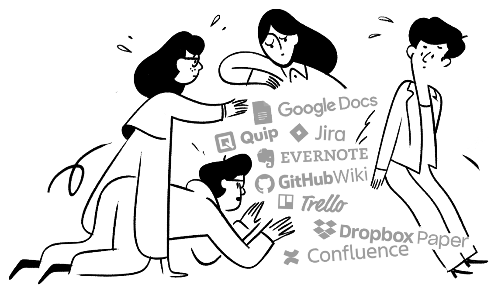

<!--more-->

在遇到 [Notion](https://www.notion.so/) 之前，我的笔记记录交给 onenote ，任务管理交给手机端的 Awesome Note 2，零碎的知识收集交给 Pocket。但是不爽的是要在三个应用之间切换，而且 Awesome Note 2 没有桌面版。而 Notion 的出现大大提高了我在笔记、知识库和任务管理上的效率，满足了我对笔记类和任务管理类软件的98%需求。

## Notion 简介

> Notion 自称是一款「**将笔记、知识库和任务管理无缝整合的协作平台**」。它具有无限的层级和相互链接的组织弹性，给笔记间的关系提供了足够自由的组织方式；它排版灵活，能够把笔记里的内容按块（Block）进行组织和拖拽，甚至可以做出 Trello 看板进行项目管理；它的内容类型丰富，可以嵌入图片、网页、文档甚至视频，几乎无所不能。

Notion 的界面很简洁，右边是内容编辑区域，左边是目录和一些功能设置。

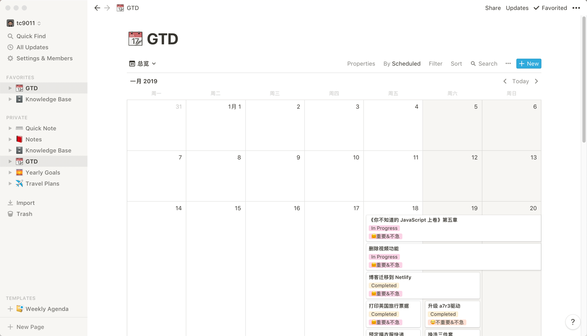

在我看来 Notion 最让我心动的是以下几点：

* 丰富的 Block

在 Notion 中 Block 是最基本的单位，文字、视频、图片等都是一个 Block，并且所有的 Block 可以任意拖拽。这种想法类似于乐高积木，通过积木可以扩展出各种你想要的东西。

下面这张图（图来自少数派用户[一条小虫](https://sspai.com/user/741485)）只是一个其中一部分 Block 的示例，Notion 还有强大功能的表格（表格甚至可以插入公式进行计算）、看板等 Block，只要在笔记中输入`/`，就会跳出各种 Block 供你选择。

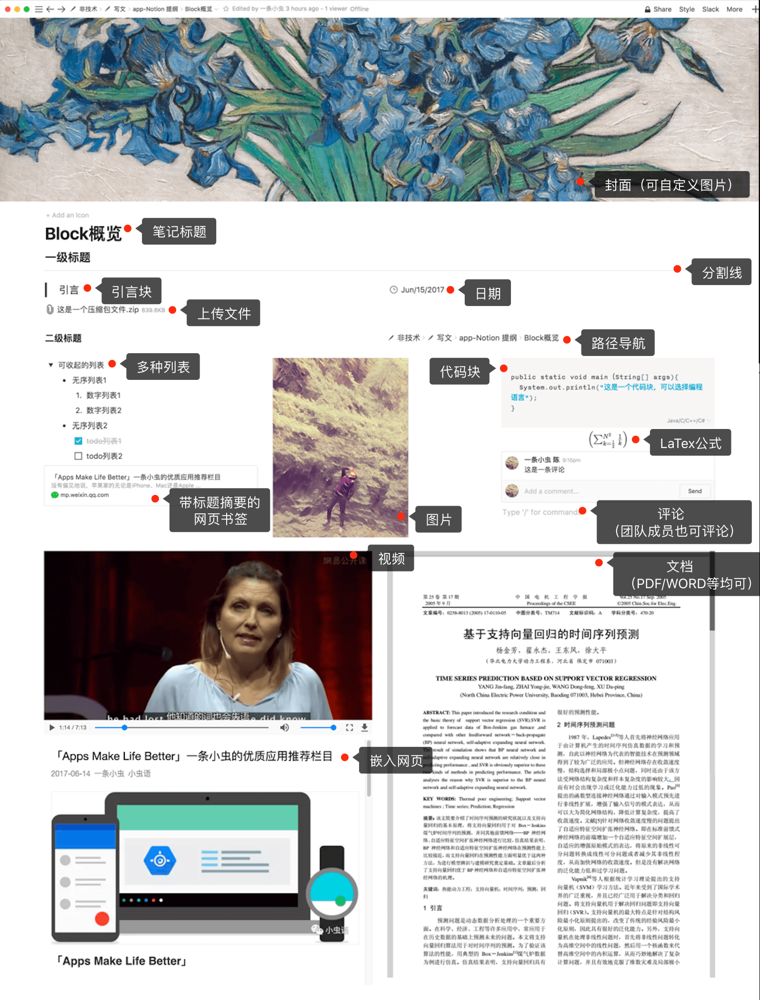

* 模板

面对这么多 Block，可能有时候你不知道怎么组织你的页面，但是官方提供了很多模板，在创建的时候 页面的时候，你可以很快搭建起你想要的页面。如果你嫌官方的模板满足不了你的要求，还可以去[这里](https://www.notion.so/notion666/Notion-6d8058e5e6b346a58130015755c4d1f0)或者[notionpages](https://notionpages.com/)下载其他人做好的模板。

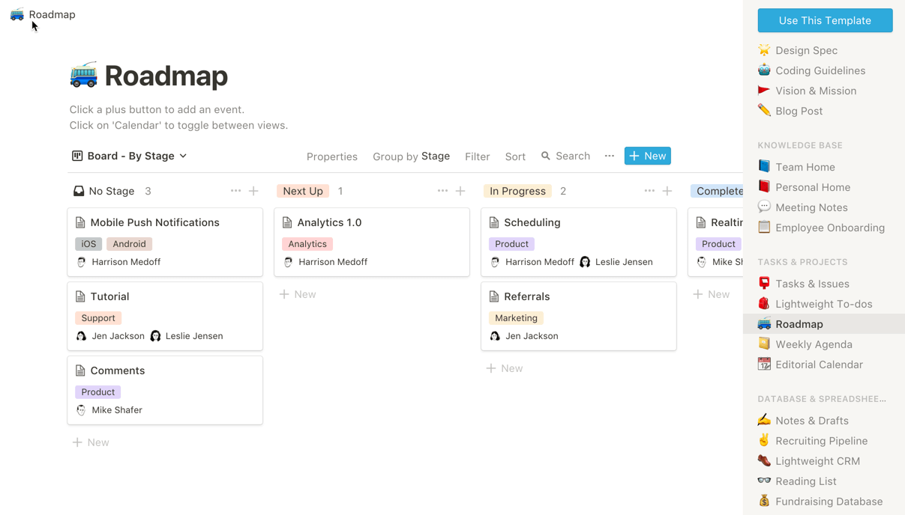

* 历史记录

Notion 提供你操作的历史记录，你可以随时恢复之前的操作，这个功能应该是手残党的福音。

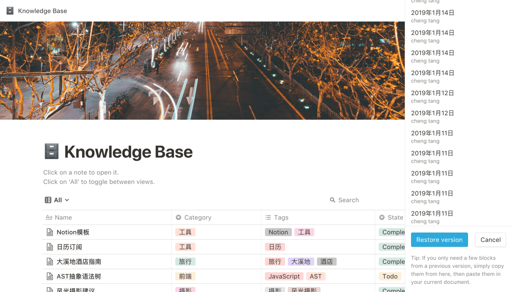

* 布局灵活

Notion 所有的 Block 都可以拖拽，所以你可以非常方便的去组织你的笔记，就像下面这样：

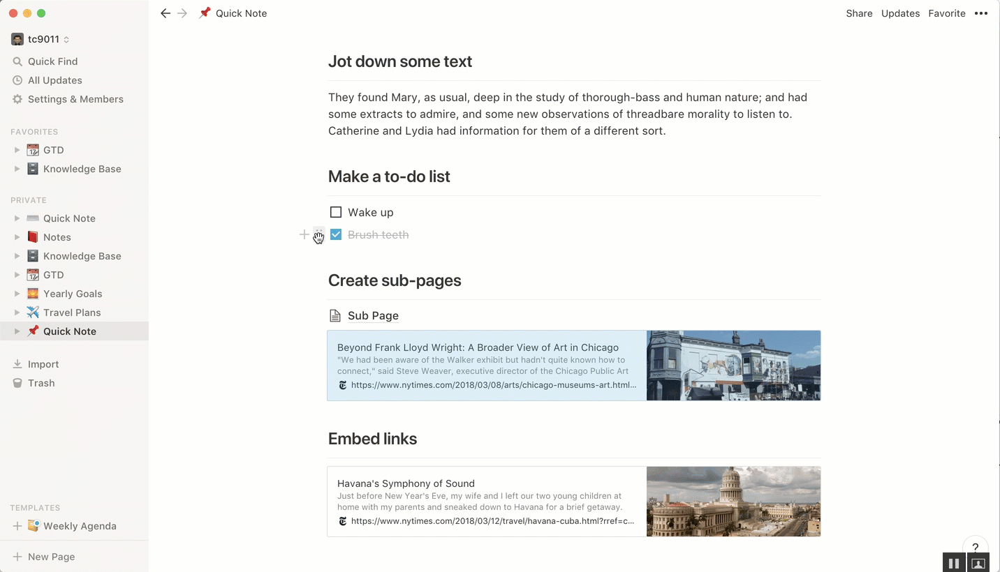

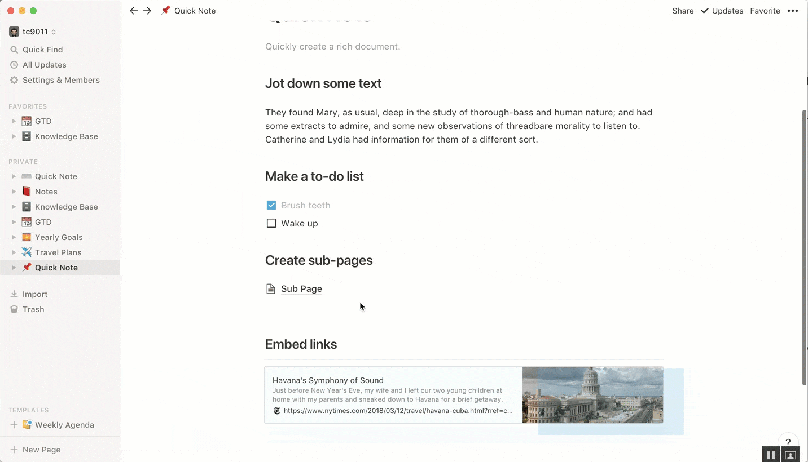

* 强大的嵌入功能

在 Notion 中，你可以嵌入大部分你做笔记时想嵌入的东西，比如PDF、Excel、word、视频、网页、代码、Google Map等。这些嵌入的东西都可以直接在页面内查看，不需要重新打开其他应用。

Notion 中可以嵌入的类型

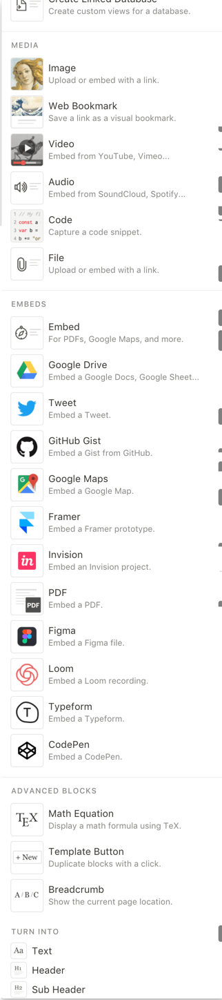

* 支持 Markdown

这个是程序员都喜闻乐见的功能，有了 markdown 的支持后，写笔记更加顺畅。

* 分享

在 Notion 中，你可以通过 share 按钮把你当前页面分享出去，甚至可以邀请其他人和你一起编辑当前页面。

* 同步

Notion 同步功能可以说非常迅速，无论在桌面端、网页端还是移动端，任意编辑都能迅速同步。

* 离线

Notion 可以离线使用，当你离线的时候，Notion 打开速度甚至会快一点，原因我猜是不需要去服务器检查多人协作的情况和更新页面吧。

当然 Notion 作为一款很年轻的应用现在还不是十全十美，如果说 Notion 现在的缺点的话，我觉得有下面几点：

* 不支持重复提醒

当你使用日历创建任务提醒的时候，不支持创建重复提醒，比如每周一提醒或者每月提醒，所以这种重复提醒类的任务我还是扔给了 Awesome Note 2 。

* ~~缺少收集工具~~

~~缺少一款类似 Pocket 或者 印象笔记剪藏 的碎片知识收集工具，现在我手动放到 Knowledge Base 页面中，这样很多时候很麻烦，在浏览器端或者手机端，可以把相关链接分享到 Notion，然后再继续整理，这样就可以行程完整的知识库的闭环。~~

Notion 也出了类似的收集工具，可以点击[链接](https://www.notion.so/web-clipper)安装。如何使用可以参考[官方使用教程](https://www.notion.so/notion666/Web-Clipper-ba54b19ecaeb466b8070b9e683c5fce1)

* 导出功能

选择 markdown 导出的时候常常布局会有问题，现在我选择直接导出 markdown，然后用 Typora 导出为 PDF。

* 外部模板不能设为默认模板

外部导入的模板不能设为默认模板会让每次创建重复页面的时候有点麻烦，而 Template Button 也只能在当前页面中使用，不是很方便。

* 网络略慢

Notion 好像用了亚马逊的 AWS，在国内用的话打开会有点慢，但是没有慢到不可接受的程度，如果你在离线状态，还能更快。

## 我的 Notion 食用方式

Notion 中有很多种使用方式，你可以随意组合表格、看板等 Block 来实现你想要的功能，这里简单介绍一下我使用 Notion 的几种方式。

### GTD

[GTD](https://zh.wikipedia.org/wiki/%E5%B0%BD%E7%AE%A1%E5%8E%BB%E5%81%9A)主要负责我的任务管理，Notion 中可以把日历、表格、列表和看板集合于一体，结合筛选和过滤功能，可以非常方便的在同一个界面用不同方式展示你的任务安排和进度。

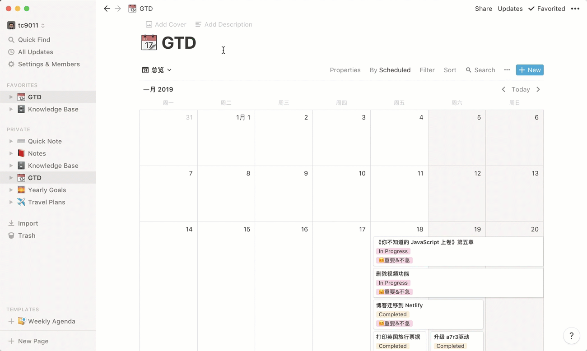

参考少数派的作者Maybe009在[试过不少工具后，我用 Notion 进行更灵活的任务管理](https://sspai.com/post/52625)中的介绍，我也模仿做了一个类似。

你可以直接用官方提供的 Editorial Calendar 模板来做你的 GTD ，然后通过设置不同的 Filter 来在不同模式下展示不同的任务。而和 Maybe009 在看板中添加预处理项的做法不同的是，我直接使用自带的 Idea 一栏，把它作为一些有想法但没有安排的任务存放处，这样更加方便一些。

### 个人知识库

个人知识库用于对于碎片知识的收集和整理，通常我会把看到一些比较好的文章、段落等放到这边，通过对知识碎片打标签和分类，来进行管理，并且对它们加上状态管理，方便及时查看哪些知识碎片是没有整理过的。

你可以使用 Lightweight CRM 模板来实现这个页面，配合筛选功能和自定义属性，就能很方便地实现自己的知识库的管理。随便提一句，Notion 支持全局的搜索，而且中文也可以哦。

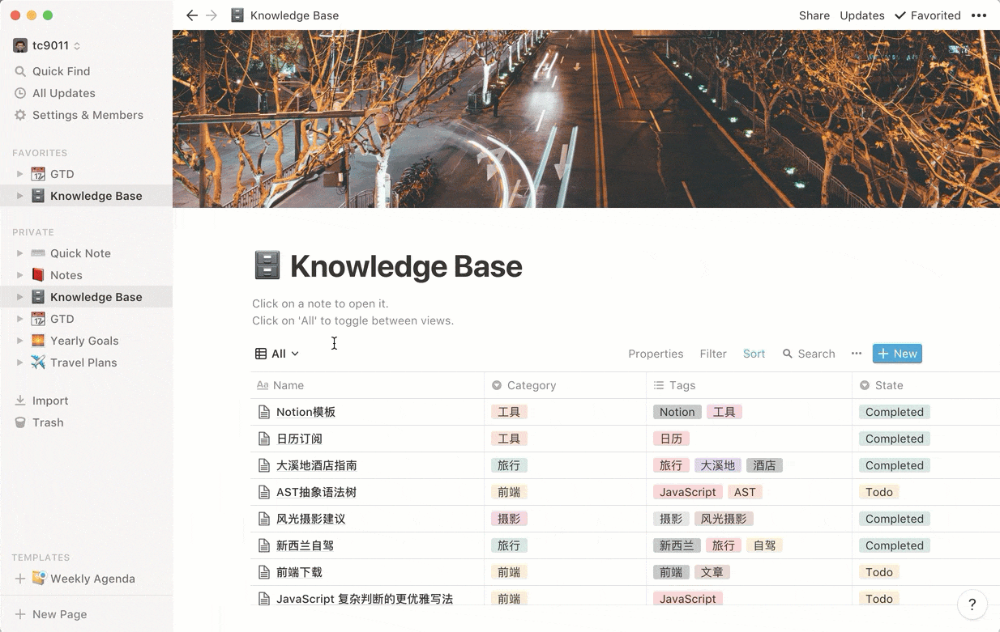

如果你每次都要把链接或者文章贴到这边会比较麻烦，所以我的解决方案是都先发送到 Pocket，然后在 Awesome Note 2 中设定定时提醒，提醒自己归档和整理。

### 笔记

笔记我把它分为 Quick Note 和 Notes，一个套用了 Notion 提供的 Quick Note 的模板，专职于记录下平时一些灵感，突出 Quick 。而 Notes 则和 Knowledge Base 一样使用 Lightweight CRM 模板来实现笔记的归档和整理。

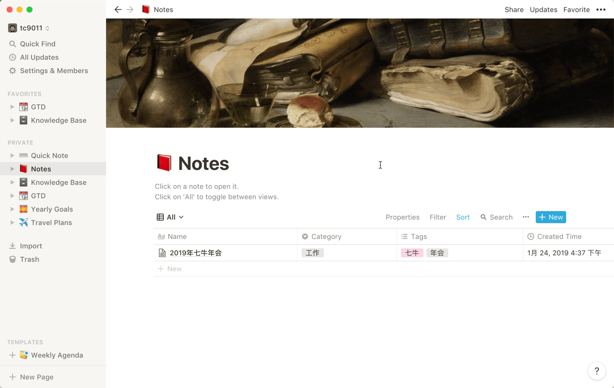

### 年度目标

年度目标当然是用来立一些 flag 啦，用 Tasks 或者 Roadmap 模板都可以实现这样的看板页面。

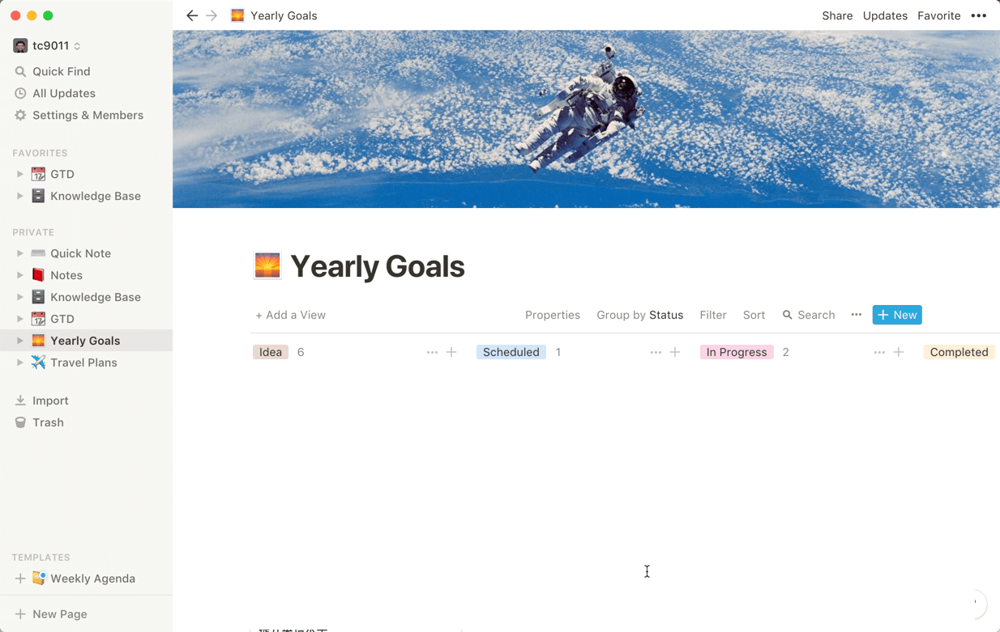

### 旅行计划

Notion 中真的很合适去写旅行计划，你可以把你收集的攻略、视频都插到计划中，甚至还可以插入 Google Map，写完旅行计划后，你可以直接分享给你的同伴，甚至邀请他一起编辑，真的是神器了。

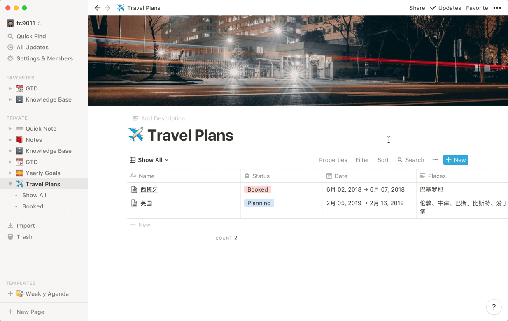

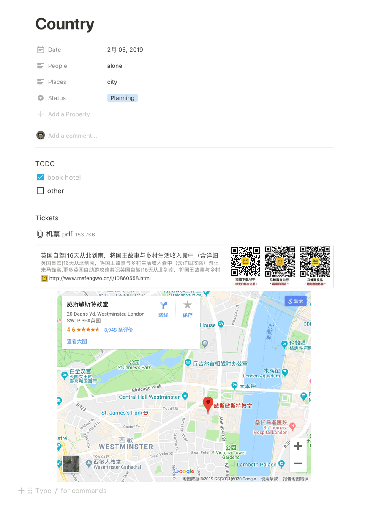

## 总结

上面只是我自己在 Notion 使用中的一些摸索，Notion 可以做的远远不止这些，通过 Block 之间的不同组合，Notion 的使用有很大的想象空间，虽然这款从2016年出来的应用还有一些小缺点，但是它的理念耳目一新，让人感到兴奋。

另外需要说明的是，Notion 是订阅制，免费用户不限制队友，但是有1000个 Block 和5M 文件上传限制，而个人使用推荐使用 Personal 订阅，4美元一个月，拥有无限 Block，没有上传设置，但是只能你自己编辑。

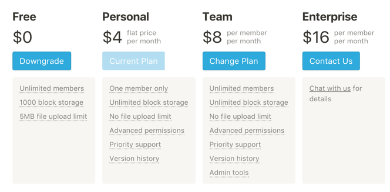

## 参考资料

[notionpages](https://notionpages.com/)

[Notion：重新定义数字笔记](https://sspai.com/post/39694)

[notion的使用体验](https://life2cloud.com/cn/2018/08/notion/)

[试过不少工具后，我用 Notion 进行更灵活的任务管理](https://sspai.com/post/52625)
