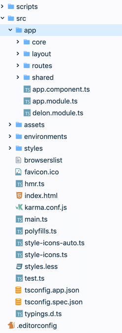
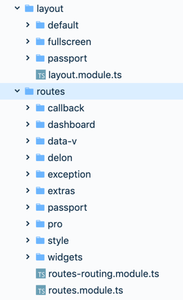

<!--more-->

虽然 [Angular 官网](https://angular.cn/guide/styleguide) 已经给出了Angular 项目结构的建议，不过有些地方实践起来还是有需要注意的地方，这里就结合 [ng-alain](https://github.com/ng-alain/ng-alain) 来讲讲如何更好地组织一个 Angular 项目。

## layout和 routes模块

首先，我们来看看 ng-alain 的目录结构。



可以看到， `app` 文件夹下面被分成了`core`、`layout`、`routes`、`shared`几个目录。

先看`layout` 和 `routes` 这两个目录，它们用于整体视图层的组织，为什么要分成两个模块去组织的视图层呢，其实是为了更好地去布局。



如果你把导航栏和页脚在 `app.component.ts` 中引入，这时候如果跳转到一个没有导航栏和页脚的登陆页面时，你的实现可能会需要写一个指令去控制导航栏和页脚的展现。像 ng-alain 这样剥离布局层的代码，可以让你更方便地组织你的布局。

我们再看整个项目的路由组织，在`routes-routing.module.ts` 中，通过把基础布局层作为各个顶级路由的`component`，页面的其他业务相关的`component`放在`children`的子路由中，这样以此剥离了布局层的代码，让`routes`模块更加专注于更核心 UI 层的组织。

在子路由中，我们可以通过`loadChildren`来进行懒加载，这样保证当前页面 `buddle` 的大小最小，提高页面加载速度。

```typescript
import { NgModule } from '@angular/core';
import { Routes, RouterModule } from '@angular/router';
import { SimpleGuard } from '@delon/auth';
import { environment } from '@env/environment';
// layout
import { LayoutDefaultComponent } from '../layout/default/default.component';
import { LayoutFullScreenComponent } from '../layout/fullscreen/fullscreen.component';
import { LayoutPassportComponent } from '../layout/passport/passport.component';
// dashboard pages
import { DashboardV1Component } from './dashboard/v1/v1.component';
import { DashboardAnalysisComponent } from './dashboard/analysis/analysis.component';
import { DashboardMonitorComponent } from './dashboard/monitor/monitor.component';
import { DashboardWorkplaceComponent } from './dashboard/workplace/workplace.component';
// passport pages
import { UserLoginComponent } from './passport/login/login.component';
import { UserRegisterComponent } from './passport/register/register.component';
import { UserRegisterResultComponent } from './passport/register-result/register-result.component';
// single pages
import { CallbackComponent } from './callback/callback.component';
import { UserLockComponent } from './passport/lock/lock.component';

const routes: Routes = [
  {
    path: '',
    component: LayoutDefaultComponent,
    canActivate: [SimpleGuard],
    canActivateChild: [SimpleGuard],
    children: [
      { path: '', redirectTo: 'dashboard/v1', pathMatch: 'full' },
      { path: 'dashboard', redirectTo: 'dashboard/v1', pathMatch: 'full' },
      { path: 'dashboard/v1', component: DashboardV1Component },
      { path: 'dashboard/analysis', component: DashboardAnalysisComponent },
      { path: 'dashboard/monitor', component: DashboardMonitorComponent },
      { path: 'dashboard/workplace', component: DashboardWorkplaceComponent },
      {
        path: 'widgets',
        loadChildren: './widgets/widgets.module#WidgetsModule',
      },
      { path: 'style', loadChildren: './style/style.module#StyleModule' },
      { path: 'delon', loadChildren: './delon/delon.module#DelonModule' },
      { path: 'extras', loadChildren: './extras/extras.module#ExtrasModule' },
      { path: 'pro', loadChildren: './pro/pro.module#ProModule' },
      // Exception
      { path: 'exception', loadChildren: './exception/exception.module#ExceptionModule' },
    ],
  },
  // 全屏布局
  {
    path: 'data-v',
    component: LayoutFullScreenComponent,
    children: [
      { path: '', loadChildren: './data-v/data-v.module#DataVModule' },
    ],
  },
  // passport
  {
    path: 'passport',
    component: LayoutPassportComponent,
    children: [
      {
        path: 'login',
        component: UserLoginComponent,
        data: { title: '登录', titleI18n: 'app.login.login' },
      },
      {
        path: 'register',
        component: UserRegisterComponent,
        data: { title: '注册', titleI18n: 'app.register.register' },
      },
      {
        path: 'register-result',
        component: UserRegisterResultComponent,
        data: { title: '注册结果', titleI18n: 'app.register.register' },
      },
      {
        path: 'lock',
        component: UserLockComponent,
        data: { title: '锁屏', titleI18n: 'app.lock' },
      },
    ],
  },
  // 单页不包裹Layout
  { path: 'callback/:type', component: CallbackComponent },
  { path: '**', redirectTo: 'exception/404' },
];

@NgModule({
  imports: [
    RouterModule.forRoot(
      routes, {
        useHash: environment.useHash,
        // NOTICE: If you use `reuse-tab` component and turn on keepingScroll you can set to `disabled`
        // Pls refer to https://ng-alain.com/components/reuse-tab
        scrollPositionRestoration: 'top',
      }
    )],
  exports: [RouterModule],
})
export class RouteRoutingModule {}
```

这个`routes-routing.module.ts`中` export`的`module`会在`routes.moudle.ts`中注册，而`RoutesModule`会和`LayoutModule`、`SharedModule`、`CoreModule`一起在整个 APP 的根模块（`app.module.ts`）中注册。这样，在根模块中完成了对整个项目基础的划分，而每个模块具体做什么，则分散到各个子模块中，在子模块中去组织相应的`components`、`routes`、`services`等。

## CoreModule

Angular官网对 `core` 模块的描述是：

> **考虑**把那些数量庞大、辅助性的、只用一次的类收集到核心模块中，让特性模块的结构更清晰简明。
>
> **坚持**把那些“只用一次”的类收集到 `CoreModule` 中，并对外隐藏它们的实现细节。简化的 `AppModule` 会导入 `CoreModule`，并且把它作为整个应用的总指挥。
>
> **坚持**在 `core` 目录下创建一个名叫 `CoreModule` 的特性模块（例如在 `app/core/core.module.ts` 中定义 `CoreModule`）。
>
> **坚持**把要共享给整个应用的单例服务放进 `CoreModule` 中（例如 `ExceptionService` 和 `LoggerService`）。
>
> **坚持**导入 `CoreModule` 中的资产所需要的全部模块（例如 `CommonModule` 和 `FormsModule`）。
>
> **为何？** `CoreModule` 提供了一个或多个单例服务。Angular 使用应用的根注入器注册这些服务提供商，让每个服务的这个单例对象对所有需要它们的组件都是可用的，而不用管该组件是通过主动加载还是惰性加载的方式加载的。
>
> **为何？**`CoreModule` 将包含一些单例服务。而如果是由惰性加载模块来导入这些服务，它就会得到一个新实例，而不是所期望的全应用级单例。
>
> **坚持**把应用级、只用一次的组件收集到 `CoreModule` 中。 只在应用启动时从 `AppModule` 中导入它一次，以后再也不要导入它（例如 `NavComponent` 和 `SpinnerComponent`）。
>
> **为何？**真实世界中的应用会有很多只用一次的组件（例如加载动画、消息浮层、模态框等），它们只会在 `AppComponent` 的模板中出现。 不会在其它地方导入它们，所以没有共享的价值。 然而它们又太大了，放在根目录中就会显得乱七八糟的。
>
> **避免**在 `AppModule` 之外的任何地方导入 `CoreModule`。
>
> **为何？**如果惰性加载的特性模块直接导入 `CoreModule`，就会创建它自己的服务副本，并导致意料之外的后果。
>
> **为何？**主动加载的特性模块已经准备好了访问 `AppModule` 的注入器，因此也能取得 `CoreModule` 中的服务。
>
> **坚持**从 `CoreModule` 中导出 `AppModule` 需导入的所有符号，使它们在所有特性模块中可用。
>
> **为何？**`CoreModule` 的存在就要让常用的单例服务在所有其它模块中可用。
>
> **为何？**你希望整个应用都使用这个单例服务。 你不希望每个模块都有这个单例服务的单独的实例。 然而，如果 `CoreModule` 中提供了一个服务，就可能偶尔导致这种后果。

所以从描述来看，`CoreModule` 应该只会在 `AppModule` 中被导入，所以在 ng-alain 的[模块注册指导原则](https://github.com/ng-alain/ng-alain/issues/180)中把`CoreModule` 认为应该是**纯服务类模块**，通常会放HTTP 拦截器、路由守卫等一些全局性的服务。对于防止`CoreModule` 被多次导入，官方也给出了[解决方案](https://angular.cn/guide/styleguide#prevent-re-import-of-the-core-module)：

> **坚持**防范多次导入 `CoreModule`，并通过添加守卫逻辑来尽快失败。
>
> **为何？**守卫可以阻止对 `CoreModule` 的多次导入。
>
> **为何？**守卫会禁止创建单例服务的多个实例。
>
> ```typescript
> // core/module-import-guard.ts
> export function throwIfAlreadyLoaded(parentModule: any, moduleName: string) {
>     if (parentModule) {
>       throw new Error(`${moduleName} has already been loaded. Import Core modules in the AppModule only.`);
>     }
> }
> 
> // core/core.module.ts
> import { NgModule, Optional, SkipSelf } from '@angular/core';
> import { CommonModule } from '@angular/common';
>  
> import { LoggerService } from './logger.service';
> import { NavComponent } from './nav/nav.component';
> import { throwIfAlreadyLoaded } from './module-import-guard';
>  
> @NgModule({
>     imports: [
>       CommonModule // we use ngFor
>     ],
>     exports: [NavComponent],
>     declarations: [NavComponent],
>     providers: [LoggerService]
> })
> export class CoreModule {
>     constructor( @Optional() @SkipSelf() parentModule: CoreModule) {
>       throwIfAlreadyLoaded(parentModule, 'CoreModule');
>     }
> }
> ```

## SharedModule

和`CoreModule`相比，`SharedModule`正好相反，它不应该包含服务，因为`SharedModule`会在不同业务模块中导入，一旦包含了服务，就会产生不同的实例，有可能会对应用产生负面的影响，所以尽量保证服务的单一性。

`SharedModule`中正如官网所说，应该包含所有组件（自己写的非业务相关的通用组件）、指令、管道以及其他模块所需要的资产（例如 `CommonModule` 、 `FormsModule`、`RouterModule`、`ReactiveFormsModule`和第三方通用依赖模块）。

## Service

对于服务，应该承担应用的数据操作和数据交互的作用，所以类似于 http 请求、storage 的操作、复杂数据的计算等都应交给服务，让组件聚焦于视图，去组织视图层的展示和服务计算数据的收集，而不是承担了较重的数据操作和交互。业务层的服务尽量跟着对应的组件，通常我会在对应组件文件夹下新建一个`services`的文件夹，存放对应的服务。

## Styles

至于样式，通常我会把全局性的变量、通用的 css 样式（和业务无关的样式，例如 css reset、自适应相关的全局样式）放在`src/styles.scss`下，而和业务相关的通用 css 样式(例如某几个组件共用的样式、mixin 等)都会放在`assets/css`目录下。

## 总结

* `AppModule` **应该** 导入 `SharedModule`、`CoreModule`、`LayoutModule`、`RouterModule`、Angular 模块(例如：`BrowserModule`、`BrowserAnimationsModule`、`HttpClientModule`)；
*  `LayoutModule` **应该** 导入 `SharedModule`；
* `LayoutModule` **应该** 导出所有 layout component；
*  `LayoutModule` **不应该** 导入和声明任何路由；
* `RouterModule` **应该** 导入 `SharedModule`、`CoreModule`、`LayoutModule`以及`RouteRoutingModule`；
* `CoreModule`**应该** 只保留`providers`属性；
* `SharedModule` **应该** 包含 Angular 通用模块(例如：`CommonModule`、`FormsModule`、`RouterModule`、`ReactiveFormsModule`)、第三方通用依赖模块、所有组件（自己写的非业务相关的通用组件）、指令、管道；
* `SharedModule`**应该**导出所有包含模块；
* `SharedModule` **不应该** 有`providers`属性；
* `Service` **应该** 承担应用的数据操作和数据交互；
* `Component`**应该** 组织视图层的展示和服务计算数据的收集
* 样式分层


