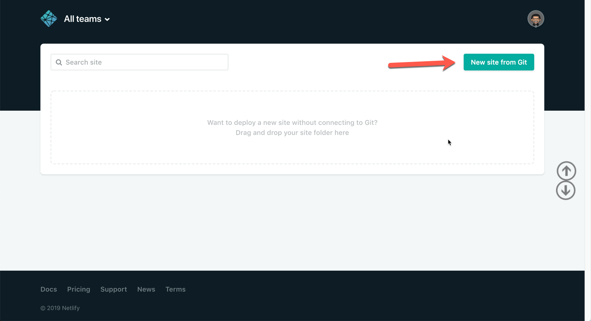
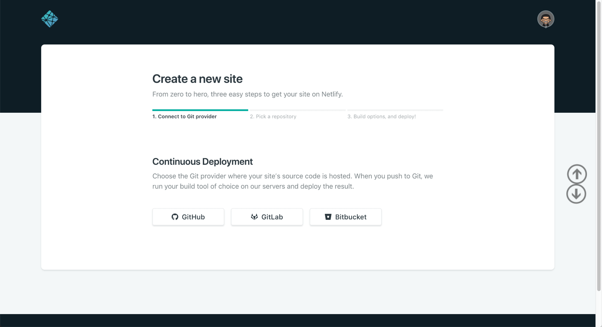
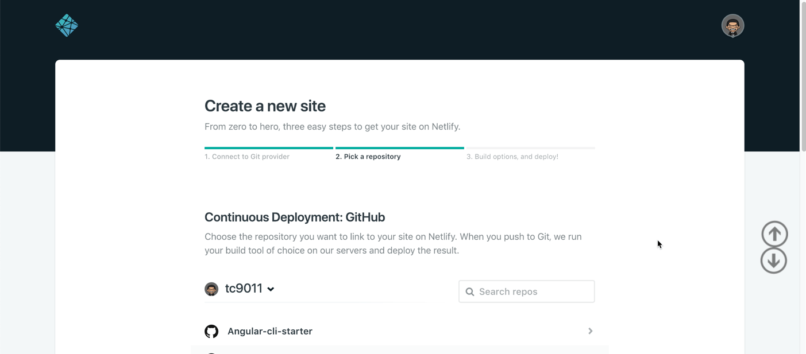
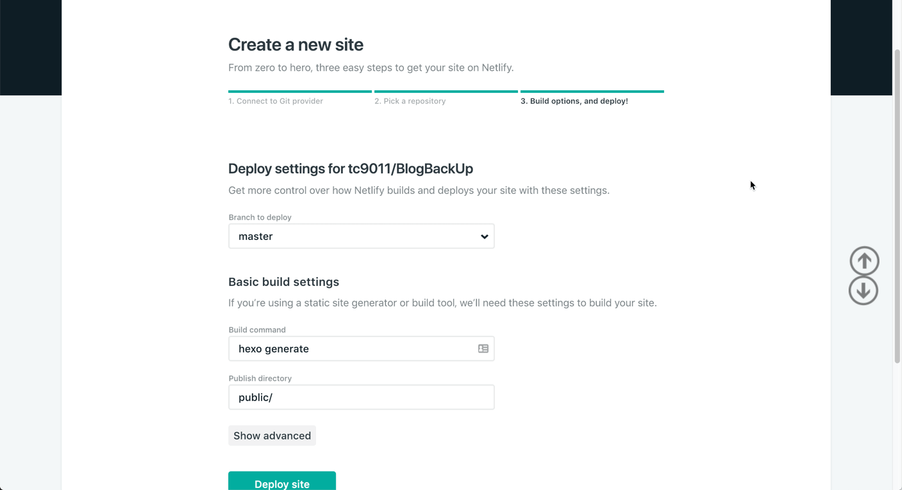
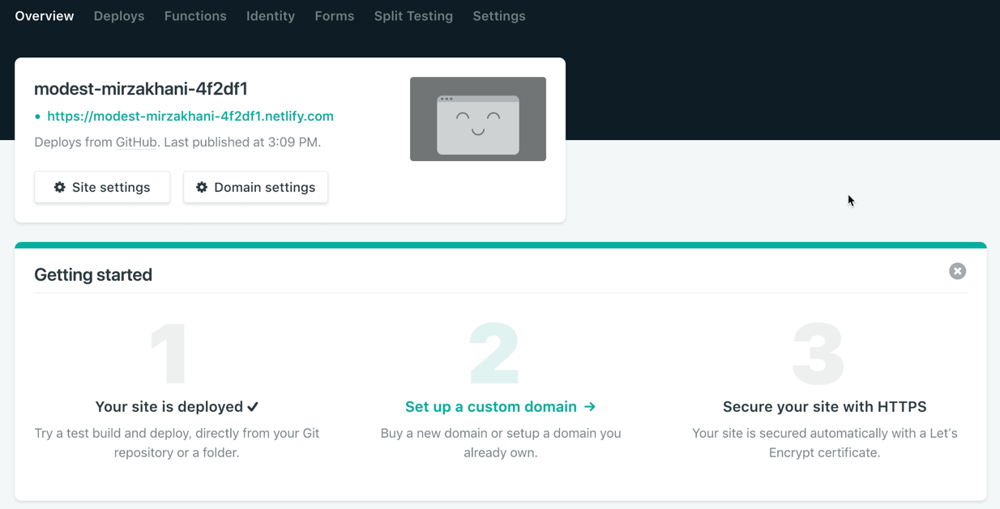
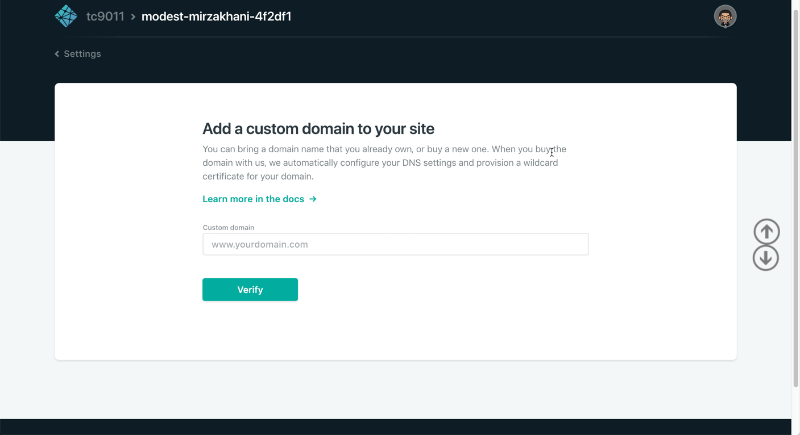
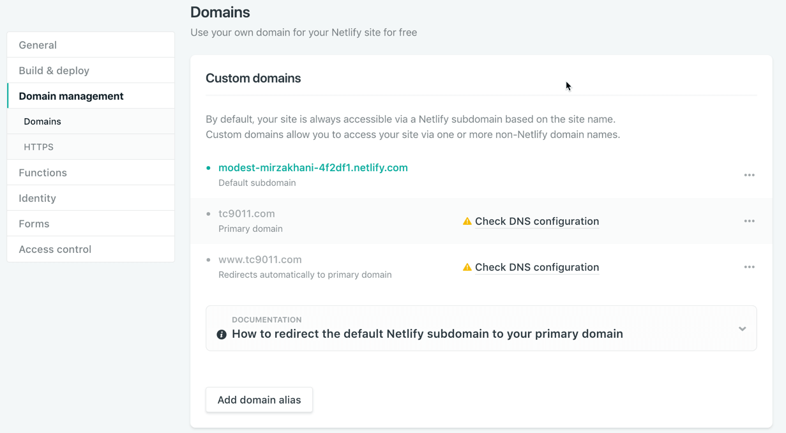
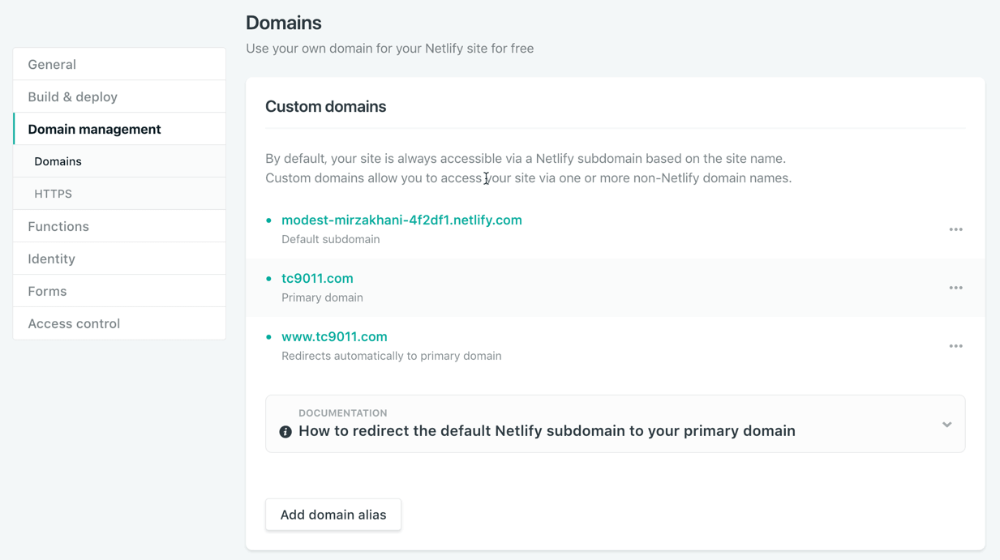
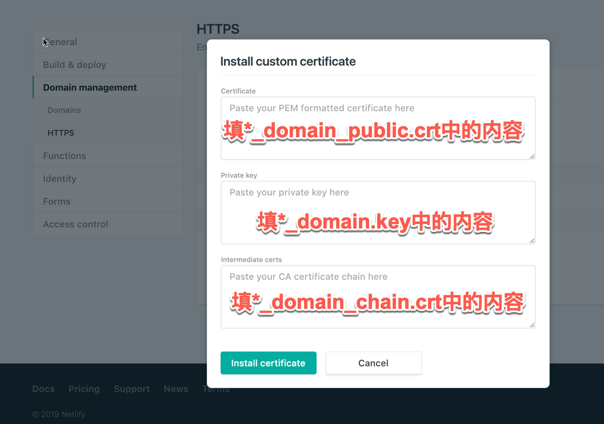
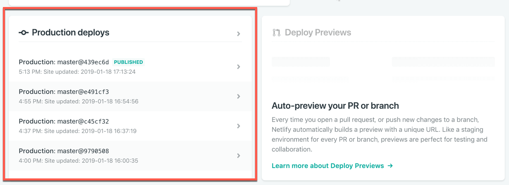

<!--more-->

我的博客之前一直托管在 coding 上，图片等静态资源放在七牛云的 cdn 上，这样国内国外访问速度都还可以。去年七牛云的 cdn 强制需要做域名备案，备案是不可能的，这辈子都不可能，所以把所有静态资源都直接扔到 coding 上。coding 也发生了几次博客推送后不更新问题，一怒之下，就直接把博客迁到 GitHub Pages，不过对国内用户来说，访问速度和稳定性不是很好。正当我在想怎么办的时候，发现了 Netlify。

[Netlify](https://www.netlify.com/) 是一个提供静态资源网络托管的综合平台，提供CI服务，能够将托管 GitHub，GitLab 等网站上的 Jekyll，Hexo，Hugo 等代码自动编译并生成静态网站。

Netlify 有如下的功能:

- 能够托管服务，免费 CDN
- 能够绑定自定义域名
- 能够启用免费的TLS证书，启用HTTPS
- 支持自动构建
- 提供 Webhooks 和 API

## 使用 Netlify

首先使用你的 GitHub 账号登陆 Netlify，登陆后进入空间管理中心，，点击`New site from git`按钮开始部署你的博客：



然后根据自己的托管平台，可以选择GitHub、GitLab或者BitBucket（这里以 GitHub 为例）：



点击GitHub之后会弹出一个让你授权的窗口，给 Netlify 授权后，就会自动读取你 GitHub 的仓库：



选择仓库后，Netlify 会自动识别到 hexo，并填入相关信息，这时候只要无脑点击 `Deploy site`就可以：



稍等一段时间就可以看到你的博客已经部署成功，并且给你分配了一个二级域名（先记下这个二级域名）：



如果你要绑定自己买的域名，就直接点击第二步`Set up custom domain`。添加自定义域名，先添加不带www的域名作为主域名，它会自动添加一个`www.domain.cc`重定向到`domain.cc`：



设置完，Netlify 会提示你去域名DNS解析处，修改域名的CNAME记录：



去你的 DNS 解析提供商里面，将 CNAME 记录值更改为 Netlify 给你的二级域名：


修改完，就可以看到 Netlify 状态更新：



Netlify默认会启用 HTTPS，而且不能关闭，如果你没有证书，它会帮你去Let’s Encrypt申请免费的证书，当然你也可以自己申请证书，以阿里免费的 ssl 证书为例，下载证书证书时选服务器类型为Apache的证书，Netlify 配置填写如下：



## 自动化部署

上面流程走完，其实已经可以自动化部署，只要 push 了代码，就会自动更新，你可以在下面地方查看部署的信息：



如果你不想用 Netlify 的服务，也可以用 [Circle](https://circleci.com) 的服务，它和 GitHub 关联，提供 CI 服务。你需要做的事在根目录下新建一个`.circle`文件夹，里面新建一个`config.yml`文件（注意把相关信息替换成自己的）：

```yaml
# Javascript Node CircleCI 2.0 configuration file
#
# Check https://circleci.com/docs/2.0/language-javascript/ for more details
#
version: 2
jobs:
  build:
    docker:
      # specify the version you desire here
      - image: circleci/node:7.10
      
      # Specify service dependencies here if necessary
      # CircleCI maintains a library of pre-built images
      # documented at https://circleci.com/docs/2.0/circleci-images/
      # - image: circleci/mongo:3.4.4

    working_directory: ~/repo

    steps:
      - checkout

      # Download and cache dependencies
      - restore_cache:
          keys:
          - v1-dependencies-{{ checksum "package.json" }}
          # fallback to using the latest cache if no exact match is found
          - v1-dependencies-
      - add_ssh_keys:
          fingerprints:
            - "你的 ssh key的fingerprints"
      - run: git config --global user.email "user@domain.com"
      - run: git config --global user.name "user"
      - run: npm install
      - run: sudo npm install hexo-cli -g
      - save_cache:
          paths:
            - node_modules
          key: v1-dependencies-{{ checksum "package.json" }}
        
      # run tests!
      - run: hexo clean
      - run: hexo g
      - run: hexo d
```

这时候，你只要提交代码到这个仓库，circle 就会帮你自动部署了。
