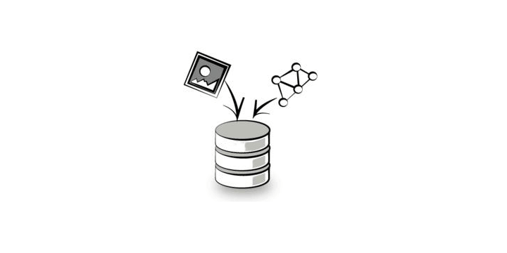
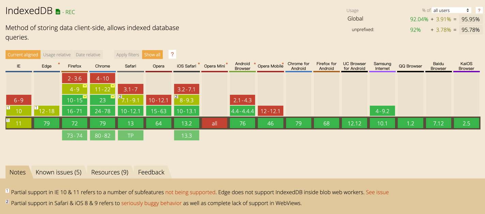
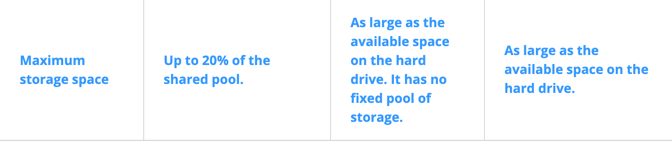
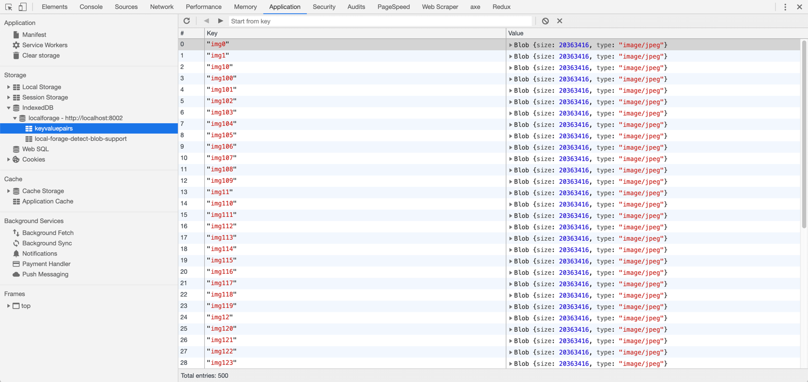
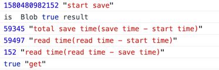

<!--more-->

对于做3D WebGL 的开发者来说，加载大量的 hdr、glb、gltf 等文件往往是很令人头疼的，因为这些文件体积不小，在网络侧加载会消耗大量时间，从而影响用户体验。对于这些大文件，localstorage 和 sessionstorage 的缓存容量肯定是不够塞牙缝的。所以这时候我们要请出 IndexedDB。

IndexedDB 是一种可以让你在用户的浏览器内持久化存储数据的方法， 允许储存大量数据，提供查找接口，还能建立索引。 IndexedDB 的兼容性也还不错，基本上不兼容太老的浏览器，都还是可用的。



IndexedDB 不属于关系型数据库（不支持 SQL 查询语句），更接近 NoSQL 数据库，可以简单认为是一个基于事务操作的 key-value 型前端数据库。它的 API 大部分都是异步。IndexedDB 语法比较底层，所以可以使用一些基于 IndexedDB 封装的库来简化操作：

- [localForage](https://localforage.github.io/localForage/): 一个提供 name:value 的简单语法的客户端数据存储垫片（Polyfill），它基于 IndexedDB 实现，并在不持支 IndexedDB 的浏览器中自动回退只 WebSQL 和 localStorage。
- [dexie.js](http://www.dexie.org/): 对 IndexedDB 的封装，通过提供更友好和简单语法以进行快速的编码开发。
- [ZangoDB](https://github.com/erikolson186/zangodb): 一个类 MongoDB 的 IndexedDB 接口实现，提供了诸如过滤、投影、排序、更新和聚合等大多数 MongoDB 常见的特性。
- [JsStore](http://jsstore.net/): 一个具备类 SQL 语法的简单和先进的 IndexedDB 封装实现。

关于 IndexedDB 的其他介绍和基本使用可以查看[MDN](https://developer.mozilla.org/zh-CN/docs/Web/API/IndexedDB_API/Basic_Concepts_Behind_IndexedDB)、[浏览器数据库 IndexedDB 入门教程](https://www.ruanyifeng.com/blog/2018/07/indexeddb.html)、[HTML5 indexedDB前端本地存储数据库实例教程](https://www.zhangxinxu.com/wordpress/2017/07/html5-indexeddb-js-example/)，这里就不多介绍了。

## IndexedDB 的容量

那么IndexedDB 的容量有多大呢，拿 chrome 来说，Chrome67 之前的版本是50%的硬盘空间，而从Chrome 67开始，

* 在 Chrome 正常模式下

如果命中了`should remain available`的值（这个值可以理解为浏览器需要留出来的空间，硬盘容量除去这个值以后的空间就是浏览器临时存储可用空间），则一个来源（“站点”）的配额将为零。 `should remain available`值与在大容量存储上保持空闲的空间有关。从Chrome 67开始，它是`2 GB`和`大容量存储总容量的10％`中的较低值。一旦达到此限制，对临时存储的其他写操作将失败，但是临时存储中的现有数据将不会被删除。

如果尚未达到`should remain available`值，则配额将为共享池的20％。这表示 （Chrome已保存的临时存储中所有数据的大小，加上Chrome可以将所有数据保存到本地存储而不会达到`should remain available`值）的20％。

比如我有一块 256GB 的硬盘，`should remain available`的值就是2GB，也就是浏览器临时存储空间是 254GB。如果这时候临时存储空间已经用了 4GB 了，这时候 IndexedDB 可用大小就是 50GB。

我们可以从 chromium 的[源码](https://chromium.googlesource.com/chromium/src/+/refs/heads/master/storage/browser/quota/quota_settings.cc#68)以及[chrome developer 文档](https://developer.chrome.com/apps/offline_storage#table)看到相应的描述：

```c++
	// The amount of the device's storage the browser attempts to
  // keep free. If there is less than this amount of storage free
  // on the device, Chrome will grant 0 quota to origins.
  //
  // Prior to M66, this was 10% of total storage instead of a fixed value on
  // all devices. Now the minimum of a fixed value (2GB) and 10% is used to
  // limit the reserve on devices with plenty of storage, but scale down for
  // devices with extremely limited storage.
  // *   1TB storage -- min(100GB,2GB) = 2GB
  // * 500GB storage -- min(50GB,2GB) = 2GB
  // *  64GB storage -- min(6GB,2GB) = 2GB
  // *  16GB storage -- min(1.6GB,2GB) = 1.6GB
  // *   8GB storage -- min(800MB,2GB) = 800MB
  const int64_t kShouldRemainAvailableFixed = 2048 * kMBytes;  // 2GB
  const double kShouldRemainAvailableRatio = 0.1;              // 10%
  // The amount of the device's storage the browser attempts to
  // keep free at all costs. Data will be aggressively evicted.
  //
  // Prior to M66, this was 1% of total storage instead of a fixed value on
  // all devices. Now the minimum of a fixed value (1GB) and 1% is used to
  // limit the reserve on devices with plenty of storage, but scale down for
  // devices with extremely limited storage.
  // *   1TB storage -- min(10GB,1GB) = 1GB
  // * 500GB storage -- min(5GB,1GB) = 1GB
  // *  64GB storage -- min(640MB,1GB) = 640MB
  // *  16GB storage -- min(160MB,1GB) = 160MB
  // *   8GB storage -- min(80MB,1GB) = 80MB
  const int64_t kMustRemainAvailableFixed = 1024 * kMBytes;  // 1GB
  const double kMustRemainAvailableRatio = 0.01;             // 1%
```



* 在 Chrome 隐身模式下

固定 100MB 的大小

## IndexedDB 中的大文件存储

IndexedDB 不仅可以储存字符串，还可以储存二进制数据（ArrayBuffer 对象和 Blob 对象），所以我们可以把图片或者 3D 模型文件转化成 Blob 格式的文件，存在 IndexedDB 中，就可以解决免去二次加载时网络请求的时间。

例如，我有一张 20M 的图片在静态服务器上，在浏览器上请求到这张图片后，将它以不同 key 存入 IndexedDB 500 次，也就是相当于在 IndexedDB 中塞入近 10G 大小的 Blob 对象，这里使用 localForage 简化 IndexedDB 的操作，请注意这里的`responseType` 要记得设置为`Blob`，这样请求到的图片就是 Blob 对象：

```javascript
axios({
  url: 'DSC06753-HDR-2.jpg',
  method: 'get',
  responseType: 'blob'
}).then(result => {
  this.start = new Date().getTime()
  console.log(this.start, 'start save')
  console.log('is  Blob', result instanceof Blob, 'result')
  const number = 500						// 循环次数
  const setItemArray = []
  const getItemArray = []
  for (let i = 0; i < number; i++) {
    setItemArray.push(localforage.setItem(`img${i}`, result))
  }
  // 存储 500 次
  Promise.all(setItemArray).then(result => {
    this.save = new Date().getTime()
    console.log(this.save - this.start, 'total save time(save time - start time)')

    for (let j = 0; j < number; j++) {
      getItemArray.push(localforage.getItem(`img${j}`))
    }
    // 读取 500 张图片 
    Promise.all(getItemArray).then(value => {
      console.log(new Date().getTime() - this.start, 'read time(read time - start time)')
      console.log(new Date().getTime() - this.save, 'read time(read time - save time)')
      console.log(value[value.length - 1] instanceof Blob, 'get')
      
      // 把 Blob 对象转成 ObjectURL，以便在页面显示图片
      const URL = window.URL || window.webkitURL
      const imgURL = URL.createObjectURL(value[value.length - 1])
      this.src = imgURL
    })
  })
})
```

在 chrome 开发者工具中，我们可以清楚地看到，所有的图片以 Blob 对象的形式存储在 IndexedDB 中：



再看一下读取和存储速度的数据：



存储 10GB 的数据一共用了 59.345 s，读取更快，用了 152ms（这个是在I7、 16GB内存、 256GB SSD 的 MacBook Pro 上测出来的数据）。

综上所述，IndexedDB 完全可以满足存储大体积文件的需求，并且 IndexedDB 可以 worker 中使用，包括 Web Worker 和 Service Worker，当 3D 需要进行复杂计算时，就可以利用 Service Worker 把一些数据存储在 IndexedDB 中或者通过 Web Worker 读取 IndexedDB 中的数据进行多线程计算。不过需要注意的是 IndexedDB 也遵从同源协议([same-origin policy](http://www.w3.org/Security/wiki/Same_Origin_Policy))，所以你只能访问同域中存储的数据，而不能访问其他域的。
