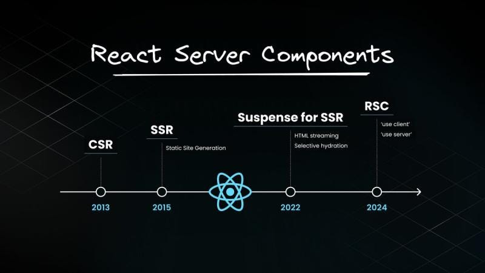
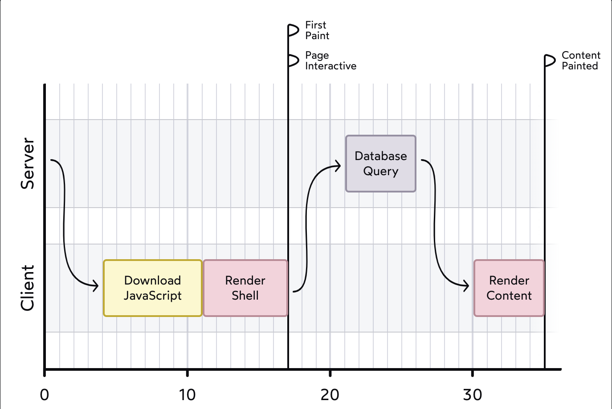
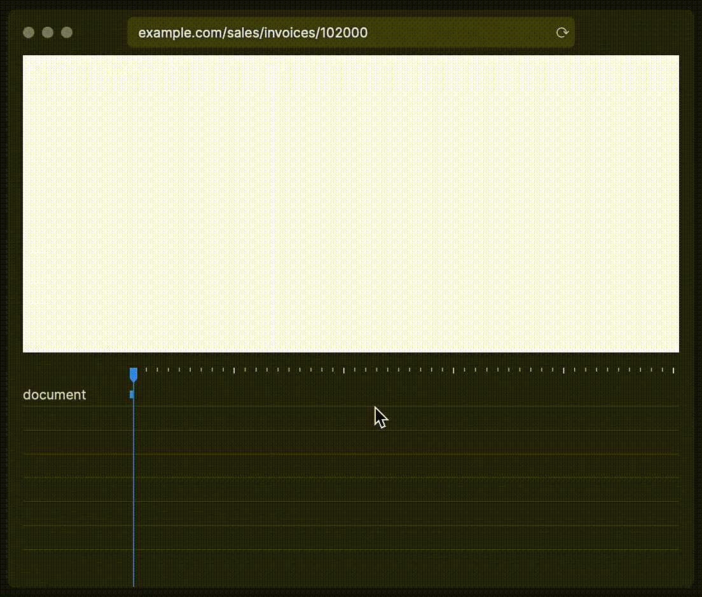
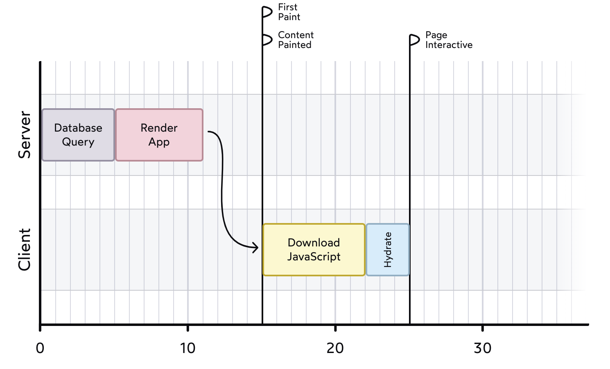
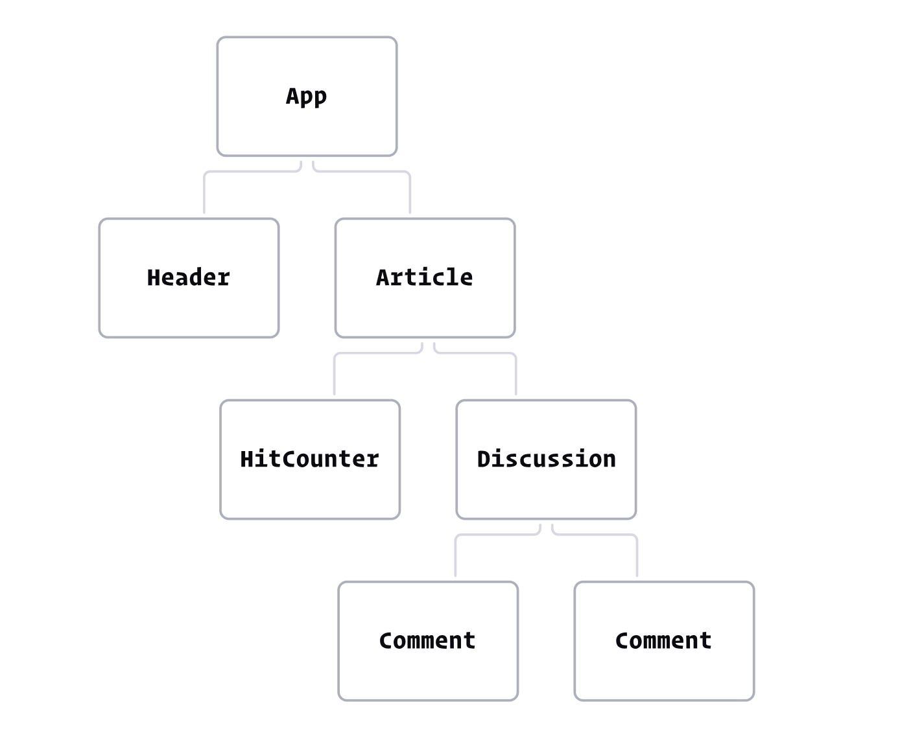
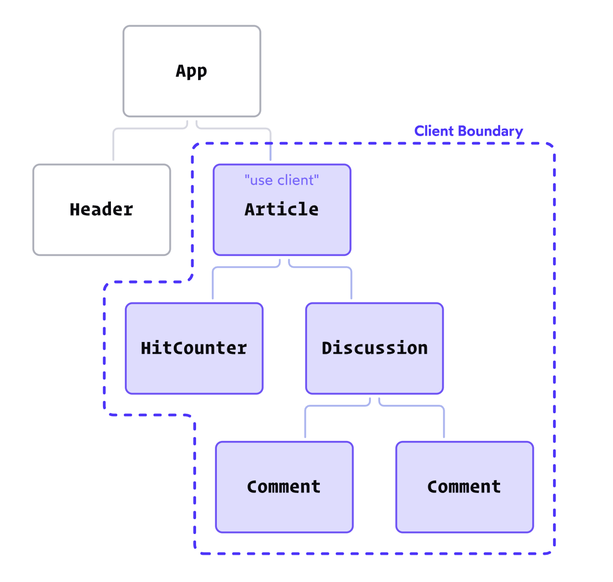

<!--more-->

2020 年12 月21号，React 团队组织了一场专题演讲 [《`Introducing Zero-Bundle-Size React Server Components`》](https://www.youtube.com/watch?v=TQQPAU21ZUw)，正式对外演示了 [React Server Components](https://react.dev/reference/rsc/server-components)  的[功能](https://github.com/reactjs/server-components-demo)和进展，自此 React Server Components （下文统一简称为 RSC）正式进入开发者的视野。RSC 将服务器渲染提升为 React 生态系统中的真正第一类公民。允许开发者在服务器上渲染某些组件，同时试图抽象掉客户端和服务器之间的差异。开发者在代码中可以交错 Client 和 Server 组件，就像所有代码都在一个地方运行一样。然而，抽象总是伴随着代价。这些代价是什么？什么时候可以使用 RSC？减少打包大小是否意味着减少带宽？什么时候应该使用 RSC？开发者在使用它们时必须遵循哪些规则，为什么这些规则存在？要回答这些问题，让我们通过考察 RSC 的两个方面 React 本身和 React 元框架来一起深入探讨 RSC 的实际工作原理。

## 背景
### CSR
在 2020 年这个时间节点上，前后端分离是当时主流的开发模式，大多数的 React 应用都是“客户端”渲染 (CSR)策略。客户端会收到一个看起来像这样的 HTML 文件
```html
<!DOCTYPE html>
<html>
  <body>
    <div id="root"></div>
    <script src="/static/js/bundle.js"></script>
  </body>
</html>
```
这个`bundle.js`脚本包含了我们挂载和运行应用程序所需的一切，包括 React、其他第三方依赖项以及我们编写的所有代码。
一旦 JS 被下载并解析，React 就会开始执行，为我们的整个应用程序创建所有 DOM 节点，并将它们嵌入到那个空的`<div id="root">`中。
这种方法的缺点是它需要花费时间来完成所有这些工作。一旦 JS 文件被下载并解析， React 应用就会启动，创建一系列 DOM 节点并填充界面。然而，起初我们没有实际数据，因此只能以加载状态渲染外壳。而在这期间，用户只能盯着一个空白的白色屏幕。



这个问题随着时间的推移往往会变得更糟：我们发布的每个新功能都会增加 JavaScript 打包文件的大小，延长用户等待的时间。
因此针对这个问题，我们开始对 `bundle.js` 进行分析和拆分，但数据的之间可能是有前后的依赖关系，抑或是和组件强耦合在一起，需要等待组件的 bundle 加载完成之后才能发出请求，而这些会导致另一个问题的出现：瀑布请求。对于一些稍微复杂一点的网页，首次加载甚至就需要请求几十个接口，而每一个接口的请求，都会带来网络开销，甚至在有些环境下会有最大并发请求数量的限制。



### SSR
我们为什么不能在初始请求期间进行数据库工作，而不是需要第二次往返的网络请求呢？比如我们不再在客户端和服务器之间来回切换，而是在初始请求中完成数据库查询，直接将完全填充的 UI 发送给用户。

服务器端渲染旨在改善这一体验。服务器不会发送一个空白的 HTML 文件，而是将我们的应用程序渲染成实际的 HTML。用户收到一个完整的 HTML 文档。HTML 文件中仍然会包含`<script>`标签，因为仍然需要 React 在客户端运行，来帮忙处理交互事件。 React 在浏览器中会以一种稍微不同的方式工作：它不是从零开始创建所有 DOM 节点，而是采用现有的 HTML。这个过程被称为水合 (hydration) 。
一旦 JS 包被下载，React 将快速遍历我们整个应用程序，构建一个虚拟 DOM，并将其“适配”到真实的 DOM 中，附加事件处理器，触发任何效果等等。
例如，使用 Next. Js Pages Router：
```tsx
import db from 'imaginary-db';

// This code only runs on the server:
export async function getServerSideProps() { 
	const link = db.connect('localhost', 'root', 'passw0rd'); 
	const data = await db.query(link, 'SELECT * FROM products'); 
	
	return { 
		props: { data } 
	}
}

// This code runs on the server + on the client
export default function Homepage({ data }) { 
	return ( 
		<> 
			<h1>Trending Products</h1> 
			{data.map((item) => ( 
				<article key={item.id}> 
					<h2>{item.title}</h2>
					<p>{item.description}</p> 
				</article> 
			))} 
		</>
	 );
 }
```
当服务器接收到请求时，`getServerSideProps`函数会被调用。它返回一个`props`对象。这些属性随后被传递到组件中，组件首先在服务器上渲染，然后在客户端水合（hydration）。其中`getServerSideProps`不会在客户端重新运行。事实上，这个函数甚至都没有包含在 JavaScript 打包文件中。但这种方法也有一些缺点：
1. 为了保持服务端组件树和客户端组件树一致，所有的组件代码都要打包到客户端 bundle 中，React 中的 SSR 意味着你的组件函数会被执行两次。
2. 即使没有必要，我们所有的 React 组件也始终会在客户端进行水合，并且整个过程是阻塞的，必须全部完成水合后，用户才能开始操作。
3. 每个元框架都提出了自己的方法。Next. Js 有一种方法，Gatsby 有另一种，Remix 则又有另一种，当时还没有标准化。
4. 这种策略只在路由级别对树状结构的顶层组件有效。我们无法在任何组件中实现这一点。
5. 大部分 JavaScript 计算权重最终仍然在客户端上。
   所以基于上面的一些问题， Dan 和他的团队提出了 RSC 的解决方案
## React Server Components
### 什么是 RSC
[官网](https://react.dev/reference/rsc/server-components) 对 RSC 的定义为：

> Server Components are a new type of Component that renders ahead of time, before bundling, in an environment separate from your client app or SSR server.

RSC 并不是服务器端渲染的替代品，而是和服务端渲染一起工作的一种全新的范式。在这个新范式中，我们可以创建仅在服务器上运行的组件。这使我们能够做到诸如在 React 组件内部直接编写数据库查询或者文件读取等事情。
比如，我们有一个很简单的 Server Components
```tsx
import marked from 'marked'; // 不会包括在 bundle 中  
import sanitizeHtml from 'sanitize-html'; // 不会包括在 bundle 中  

async function Page({page}) {  
	// 注意: 会在应用构建的 **渲染过程中** 加载  
	const content = await file.readFile(`${page}.md`);  
	return <div>{sanitizeHtml(marked(content))}</div>;  
}
```
在 RSC 的范式下，所有组件默认都是 Server Components。由于我们没有明确将这个组件标记为 Client Components（或在其内部渲染），它将只在服务器上渲染。当应用加载时，客户端将不会看到原始的 `Page` 组件，也不会看到渲染 Markdown 所需的高成本库。客户端只会看到渲染输出：
```html
<div><!-- html for markdown --></div>
```
需要理解的关键点是：Server Components 永远不会重新渲染。它们在服务器上运行一次后生成 UI。渲染后的值会被发送到客户端，从 React 的角度来看，这个输出是不可变的，永远不会改变。
这意味着 React 的大部分 API 与服务器组件不兼容。例如，我们不能使用状态，因为状态会变化，但 Server Components 不能重新渲染。而且我们不能使用 `effects`，因为 `effects` 只在渲染后的客户端运行。
### Client Components
在这个新范式下，我们熟悉的“传统”React 组件被称为 Client Components。Client Components 既在客户端渲染，也在服务器端渲染。它和 Server Components 的区别在于 Server Components 专门在服务器上渲染，它们的代码不包括在 JS 包中，因此它们永远不会被水合或重新渲染。
由于所有组件默认都被视为 Server Components，所以对于 Client Components，我们需要在文件顶部用 `'use client'` 指令来显示的声明：
```tsx
'use client';

import React from 'react';

function Counter() {
  const [count, setCount] = React.useState(0);

  return (
    <button onClick={() => setCount(count + 1)}>
      Current value: {count}
    </button>
  );
}

export default Counter;
```
`'use client'`，是我们向 React 发出信号，表明此文件中的组件是 Client Components，它们应该被包含在我们的 JS 包中，以便它们可以在客户端重新渲染。
那么我们应该如何决定某个组件应该是 Server Components  还是 Client Components ？作为一个一般规则，如果我们的一些组件使用状态变量或 `Effect` 或需要使用浏览器的 API （如 localStorage、 window 等），那你可以给这些组件加上` 'use client' `指令，否则，它们应该作为 Server Components。Server Components 往往更简单，更容易理解。还有一个性能优势：因为 Server Components 不在客户端运行，所以它们的代码不包括在我们的 JavaScript 包中。
### Client Boundary
那我们需要手动给所有 Client Components 加上 `'use client'` 吗？答案是不需要，一旦文件标记为`'use client'`，**其所有导入和子组件都被视为 client bundle 的一部分**。这意味着你不需要将指令添加到用于 Client 端的每个组件中。那为什么要这么做呢，因为**服务器组件在孤立的情况下并没有真正的意义**。比如，我们有这么一个组件树：

当我们向`Article`组件添加`'use client'`指令时，React 会创建一个 `client boundary`。此边界内的所有组件都隐式转换为 Client Components。即使像` HitCounter `这样的组件没有指令` 'use client' `，在这种特定情况下，它们仍然会在客户端上 hydrate/render。这是因为当 `Article` 因为状态改变需要重新渲染时，任何其拥有的组件也将重新渲染，包括`HitCounter`和`Discussion`。但是，如果这些是 Server Components，那么它们将无法重新渲染。而在其他情况下，如果 `HitCounter` 组件是由 Server Component 导入到其他位置，则它本身可能仍会呈现为 Server Component。

那 `client boundary` 是否意味着大多数组件只能是 Client Components ?事实上 RSC 的应用也意味着一次开发思维的改变，我们可以通过重构当前的应用来绕过 `client boundary` 的限制。比如：
```tsx
'use client';

import Header from './Header';
import MainContent from './MainContent';

function Homepage() {
  const [count, setCount] = React.useState(0);
  
  const handleClick = () => {
  	setCount(count + 1)
  }

  return (
    <main onClick={handleClick}>
      <Header />
      <MainContent />
      <div>{count}</div>
    </main>
  );
}
```
在这段代码中，我们需要使用 `React state` 来允许用户记录点击次数。按之前的习惯，这需要在应用的顶层位置进行，这样方便我们可以记录 `count` 并显示在底部。为了使用`state`，我们需要将`Homepage`设为 Client Component。由于这是我们应用程序的顶部，这意味着所有其他组件（`Header`和`MainContent`）也将隐式地成为 Client Components。
为了解决这个问题，让我们将 `count`  提取到它自己的组件中，移动到它自己的文件中：
```tsx
// /components/Counter.js
'use client';

function Counter({ children }) {
  const [count, setCount] = React.useState(0);
  
  const handleClick = () => {
  	setCount(count + 1)
  }

  return (
    <main onClick={handleClick}>
      {children}
      <div>{count}</div>
    </main>
  );
}
```
而在 `Homepage` 中，像这样使用这个新组件：
```tsx
// /components/Homepage.js
import Header from './Header';
import MainContent from './MainContent';
import Counter from './Counter';

function Homepage() {
  return (
    <Counter>
      <Header />
      <MainContent />
    </Counter>
  );
}
```
我们可以从`Homepage`中删除`'use client'`指令，因为它不再使用 state 或任何其他客户端 React 功能。这意味着`Header`和`MainContent`将不再隐式转换为 Client Components。这是因为当涉及到 `client boundary` 时，父/子关系并不重要，重要的是引用关系（`'use client'`指令在文件 / 模块级别工作），上面的代码中是  `Homepage`导入和渲染`Header`和`MainContent`的，`Homepage`如果是 Sever Components ，那 `Header`和`MainContent`也将是 Server Components。
### Server Components 作为Children
RSC 之所以允许 Server Components 作为 Children 传递给 Client Components，本质上是因为真正传递的是 Virtual DOM 树的一部分（也就是执行代码的结果），而不是要执行的 Server Component 代码。在 RSC 中，为了避免将组件函数发送到客户端执行，其结果需要进行序列化。在 React 的代码库中，这种序列化格式被称为“flight”，发送的数据总和被称为“RSC Payload”。比如这段 RSC 代码：
```jsx
export default function Home() {
	return (    
		<main>      
			<h1>understandingreact.com</h1>    
		</main>  
	);
}
```
它的函数执行的结果最终会序列化为：
```js
"[\"$\",\"main\",null,{\"children\":[\"$\",\"h1\",null,{\"children\":\"understandingreact.com\"},\"$c\"]},\"$c\"]"
```
我们用 [RSC 解析器](https://github.com/alvarlagerlof/rsc-parser)解析后如下：
```json
{  
	"type": "main",  
	"key": null,  
	"props": {    
		"children": {    
			"type": "h1",    
			"key": null,    
			"props": {      
				"children": "understandingreact.com"    
			}
		}
	}
}
```
我们可以看出这是一个虚拟 DOM 的结构，`main`和`h1`元素以及纯文本节点都在这个结构中有描述。我们还可以看到作为 props 传递的内容。在这里只是简化了一下 RSC Payload，实际应用中的格式内容远不止这些，像 Next.js 这类元框架可能会根据自身需求添加更多内容，例如，添加标识符来表示树中放置了什么类型的事物。
虽然 React 提供了 RSC 执行后的序列化格式，但元框架（比如 Next.js）需要确保创建 RSC Payload 并将其发送到客户端。比如，Next.js 在代码库中有一个名为`generateDynamicRSCPayload`的函数，它会用来创建 RSC Payload。借助 RSC Payload ，React 可以在客户端构建准确的虚拟 DOM 并进行正常的协调工作。
比如对于 `Home` 组件，Next.js 会返回下面的 HTML，浏览器使用它来构建 DOM，
```html
<main>  
	<h1>understandingreact.com</h1>
</main>
```
_和_ Payload，React 用它来构建 Virtual DOM：
```json
{  
	"type": "main",  
	"key": null,  
	"props": {    
		"children": {    
			"type": "h1",    
			"key": null,    
			"props": {      
				"children": "understandingreact.com"    
			}
		}
	}
}
```
发送的 HTML 允许浏览器快速呈现页面。用户会立即看到一些内容；而发送的 Payload 让 React 完成使页面具有交互性的工作。
因此，在实践中，RSC 将导致所谓的“双重数据问题”。你会同时以两种不同的格式从服务器发送相同的信息：HTML （构建 DOM （HTML）所需要的信息）和 Payload（构建虚拟 DOM （Payload） 所需的信息）。在 Next.js 代码仓库上有一个关于`__next_f（）`函数的[非常特别的讨论](https://github.com/vercel/next.js/discussions/42170)。使用 RSC 的开发人员发现，在其页面底部的 `<script>` 标记中，有重复的数据被传递给此函数。有些人问它为什么在那里，是否可以关闭它。这个重复的数据是什么？是 The Payload。该 Payload 数据会传递给 React 来创建虚拟 DOM。有人认为，这种数据重复的成本会被使用的压缩算法（如 gzip）所抵消，但是 HTML 和 JSON 负载是两种不同的格式，并且使用 SSR / SSG /ISR 等技术从  SEO 中受益最多的是具有轻微交互性的 web_站点_，而不是 web_应用程序。大多数 web 站点的大部分内容不在于它们的 JavaScript，而在于它们实际的内容，所以双倍数据仍然会对传输性能产生影响。
### Server Components 中引用 Client Components
不过，正因为 RSC 参与了虚拟 DOM 的构建，它还允许在 Server Components 中引用 Client Components，因为 Client Component 代码也在供浏览器使用的 bundle 中。比如：
```jsx
// components/Counter.js
'use client';

import { useState } from 'react';

export default function Counter() {
	const [count, setCount] = useState(0);    
	return (        
		<section>            
			<p>{count}</p>            
			<button onClick={() => setCount(count + 1)}> Enroll</button>        
		</section>    
	);}
	
	
// page.js
import Counter from "./components/Counter";
import DelayedMessage from "./components/DelayedMessage";
import { Suspense } from "react";

export default function Home() {  
	return (    
		<main>      
			<h1>understandingreact.com</h1>      
			<Counter />      
			<Suspense fallback={<p>Loading...</p>}>
			     <DelayedMessage />      
			 </Suspense>    
		 </main>  
	 );
 }
```
上面代码中 `Home`和`DelayedMessage`是 Server Components，它们将在服务器上执行，并且它们的代码不会包含在 bundle 中。这些 Server Component 会生成类似这样的 payload：
```json
{  
	"type": "main",  
	"key": null,  
	"props": {   
		"children": [    
			{     
				"type": "h1",     
				"key": null,     
				"props": {      
					"children": "understandingreact.com"     
				}    
			},    
			{     
				"type": {      
					"$$type": "reference",      
					"id": "d",      
					"identifier": "L",      
					"type": "Lazy node"     
				},     
				"key": null,     
				"props": {}    
			},    
			{     
				"type": {      
					"$$type": "reference",      
					"id": "e",      
					"identifier": "",      
					"type": "Reference"     
				},     
				"key": null,     
				"props": {      
					"fallback": {       
						"type": "p",       
						"key": null,       
						"props": {        
							"children": "Loading..."       
						}      
					},      
					"children": {       
						"$$type": "reference",       
						"id": "f",       
						"identifier": "L",       
						"type": "Lazy node"      
					}     
				}    
			}   
		]  
	}
}
```
`Counter` 是一个 Client Component ，在这个 payload 中，`Counter` 所在的位置有一个新的 “Lazy node” 引用。当 Client Component 进行 SSR 后或在浏览器中执行后，，`Counter` 的 Virtual DOM 就已经准备好了。
还有一点要注意：如果你将 props 从 Server Component 传递给 Client Component，这些 props[需要被 React 序列化](https://react.dev/reference/rsc/use-server#serializable-parameters-and-return-values)。正如我们所看到的，props 将成为通过网络发送的 Payload 的一部分。这意味着传递的任何内容都需要表示为字符串，以便它可以在 Client 端的内存中转换回对象。
### 为什么需要元框架
从上面我们可以看出，在 RSC 整个工作的过程中其实承担了许多打包工具的角色，例如，它会确保 Client Component 代码位于 bundle 中，而 Client Component 的引用在 payload 中正确的位置。如果你查看 React 代码库，你会发现这些文件夹：
```text
/react-server-dom-parcel
/react-server-dom-turbopack
/react-server-dom-webpack
//...and more
```
这些文件夹中有与 Flight 相关的代码，并帮助类似 webpack、parcel 这类的打包工具正确完成所有这些工作。React 还在其代码库中添加了接受 Flight 格式并将其转换为 React 元素的功能，例如`parseModelString`，而元框架负责来执行这些 React API。这也意味着你使用 RSC 的方式是和元框架强绑定的。虽然 RSC 提供了一种新的架构范式，但元框架提供了必要的工具和结构，使其在构建复杂的 Web 应用程序时既实用又高效。
### 是否参与水合
那在 Server Components 中还会参与水合吗？答案是否定的。水合是在客户端上通过重新执行实际函数来构建虚拟 DOM，然而 RSC 代码是不会发送到客户端执行的，所以 Sever Components 并不会水合。但是它又是虚拟 DOM 的一部分，所以它会参与协调（Reconciliation）。当需要重新获取 Server Components 时，RSC 可以将虚拟 DOM 的定义流式传输到客户端，然后 React 可以照常执行客户端的协调。比如，如果我们有个分页的数据列表，并且该列表是由 RSC 生成的，那么如果路由是`/page/1`还是`/page/2`，我们会希望获得一组不同的数据。当我们切换路由的时候，Nextjs 并不会整个页面进行刷新，而是通过流式传输把更新后的 RSC 传递到客户端，React 会对这个更新执行协调，同时，页面上的其他 state 也不会丢失。RSC 虽然在服务器上运行，但更新时就像在客户端上执行一样。
### 什么时候使用RSC
到这里我们了解了 RSC 一些工作的原理，那什么时候应该使用 RSC 呢，其实 RSC 并不是性能优化的银弹，什么时候使用它取决于你在面对什么样的应用场景。如果我有大量 DB 访问和复杂逻辑，RSC 会是很好提高性能的手段。比如:
```tsx
import db from 'imaginary-db';

export default async function Homepage() {
  const link = db.connect('localhost', 'root', 'passw0rd');
  const data = await db.query(link, 'SELECT * FROM products');

  return (
    <>
      <h1>Trending Products</h1>
      {data.map((item) => (
        <article key={item.id}>
          <h2>{item.title}</h2>
          <p>{item.description}</p>
        </article>
      ))}
    </>
  );
}

export default Homepage;
```
如果我需要使用大型 JavaScript 库来生成相对少量的内容，RSC 也是非常推荐的，比如一个语法高亮库，支持所有流行的编程语言，应该是几兆字节，太大了，无法放在 JS 包中。因此，我们不得不做出妥协，删减非关键任务的语言和功能。但是，假设我们在Server Component 中执行语法高亮显示（比如使用 `Bright`）。在这种情况下，我们的 JS bundles中实际上不会包含任何库代码。因此，我们不必做出任何妥协：

但是如果是开发一个大型博客文章类型网站，它对性能的提升会相对有限，甚至会因为双倍数据的问题，导致性能下滑。如果我有一个高度交互的应用程序，并且我正在迭代并不断添加功能，虽然 RSC 可以减少 TTI（Time to Interactive），我也会犹豫是否要进行过多的客户端/服务器重构，即使重构也可能将其中大部分组件保留为客户端组件。
## 总结
React Server Components 的未来是什么？目前尚不完全清楚。但毫无疑问，RSC 将成为 React 未来的重要组成部分。这是 React 对更快页面加载、更小的 javascript 包和更短的交互时间的探索。就现阶段而言，我们需要针对不同场景来选择是否使用 RSC，盲目地使用它，有时候会得到相反的结果。
